# 使用 NVIDIA TAO 工具包和 Innotescus 为迁移学习管理数据


AI 应用程序由机器学习模型提供支持，这些模型经过训练可以根据图像、文本或音频等输入数据准确预测结果。 从头开始训练机器学习模型需要大量数据和大量人类专业知识，对于大多数组织而言，该过程通常过于昂贵和耗时。

迁移学习是从头开始构建自定义模型和选择现成的商业模型以集成到 ML 应用程序之间的媒介。 通过迁移学习，您可以选择与您的解决方案相关的预训练模型，并根据反映您的特定用例的数据对其进行重新训练。 迁移学习在定制一切方法（通常过于昂贵）和现成方法（通常过于僵化）之间取得了适当的平衡，使您能够以更少的资源构建定制的解决方案。

[NVIDIA TAO ](https://developer.nvidia.com/tao-toolkit)工具包使您能够将迁移学习应用于预训练模型并创建定制的、产品级的模型，而无需 AI 框架的复杂性。 要训练这些模型，高质量的数据是必须的。 TAO 专注于开发过程中以模型为中心的步骤，而 `Innotescus` 专注于以数据为中心的步骤。

[Innotescus](https://innotescus.io/) 是一个基于 Web 的平台，用于注释、分析和管理稳健、无偏见的数据集，用于基于计算机视觉的机器学习。 `Innotescus` 帮助团队在不牺牲质量的情况下扩展运营。 该平台包括用于图像和视频的自动和辅助注释、用于 QA 流程的共识和审查功能，以及用于主动数据集分析和平衡的交互式分析。 `Innotescus` 和 TAO 工具包一起使组织能够在自定义应用程序中成功应用迁移学习，从而在短时间内获得高性能解决方案。

在这篇文章中，我们通过将 `NVIDIA TAO` 工具包与 `Innotescus` 集成来解决构建稳健对象检测模型的挑战。 该解决方案缓解了企业在构建和部署商业解决方案时遇到的几个常见痛点。

## YOLO object detection model

您在此项目中的目标是使用 `Innotescus` 上整理的数据将迁移学习应用于 TAO 工具包中的 YOLO 目标检测模型。

目标检测是利用图像或视频中的边界框对目标进行定位和分类的能力。 它是计算机视觉技术应用最广泛的一种。 目标检测解决了许多复杂的现实挑战，例如：

* 上下文和场景理解
* 智能零售自动化解决方案
* 自动驾驶
* 精准农业

为什么要为这个模型使用 YOLO？传统上，基于深度学习的目标检测器通过两个阶段的过程进行操作。在第一阶段，模型识别图像中的感兴趣区域。在第二阶段，对这些区域中的每一个进行分类。

通常，许多区域被发送到分类阶段，并且由于分类是一项昂贵的操作，两阶段目标检测器非常慢。 YOLO 代表“你只看一次 You only look once”。顾名思义，YOLO 可以同时进行本地化和分类，从而实现高度准确的实时性能，这对于大多数可部署的解决方案至关重要。 2020年4月，YOLO第四次迭代发布。它已经在众多应用和行业中进行了测试，并被证明是强大的。

下图 显示了训练对象检测模型的一般流程。对于这个更传统的开发流程的每一步，我们都会讨论人们遇到的典型挑战以及 TAO 和 Innotescus 的结合如何解决这些问题。


在开始之前，安装 TAO 工具包并验证您的 Innotescus API 实例。

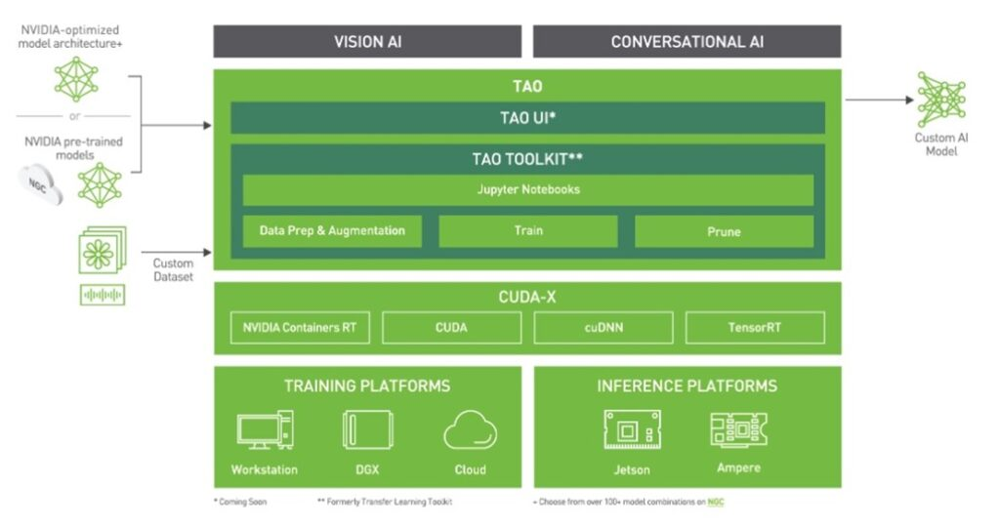

TAO 工具包可以作为 CLI 或 Jupyter Notebook 运行。 它只兼容 Python3（3.6.9 和 3.7），所以首先安装必须的工具。

## [安装docker-ce](https://docs.docker.com/engine/install/)

* 在 Linux 上，[检查安装后步骤](https://docs.docker.com/engine/install/linux-postinstall/)以确保 Docker 可以在没有 sudo 的情况下运行。
* [安装 nvidia-container-toolkit](https://docs.nvidia.com/datacenter/cloud-native/container-toolkit/install-guide.html)。
* 创建 [NGC 帐户](https://catalog.ngc.nvidia.com/)并生成 API 密钥进行身份验证。
* 通过运行命令 `docker login nvcr.io` 登录到 NGC Docker 注册表并输入您的凭据以进行身份验证。

安装必备软件后，安装 TAO 工具包。 NVIDIA 建议使用 [virtualenvwrapper](https://python-guide-cn.readthedocs.io/en/latest/dev/virtualenvs.html) 在虚拟环境中安装包。 要安装 TAO 启动器 Python 包，请运行以下命令：

```console
pip3 install nvidia-pyindex
pip3 install nvidia-tao
```

通过运行 `tao --help` 检查您是否已正确完成安装。

## 访问 Innotescus API
Innotescus 可作为基于 Web 的应用程序访问，但您还将使用其 API 来演示如何以编程方式完成相同的任务。 首先，安装 Innotescus 库。

```console
pip install innotescus
```

接下来，使用从平台检索到的 `client_id` 和 `client_secret` 值对 API 实例进行身份验证。

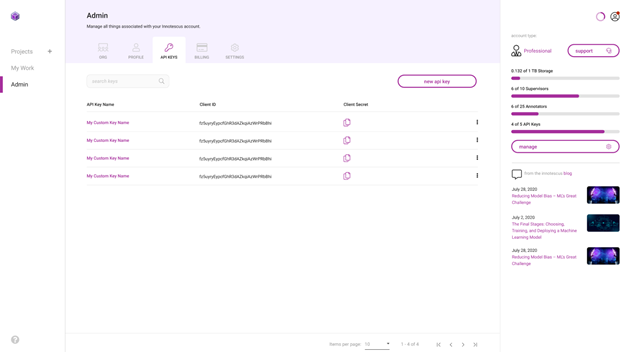

```Python
from innotescus import client_factory
client = client_factory(client_id=’client_id’, client_secret=’client_secret’)
```
现在您已准备好通过 API 与平台进行交互，您将在接下来的流程的每个步骤中进行操作。

## 数据收集
您需要数据来训练模型。 虽然它经常被忽视，但数据收集可以说是开发过程中最重要的一步。 在收集数据时，您应该问自己几个问题：

* 训练数据是否充分代表了每个感兴趣的对象？
* 您是否考虑了您期望部署模型的所有场景？
* 你有足够的数据来训练模型吗？

您不能总是完全回答这些问题，但是制定一个全面的数据收集计划可以帮助您避免在开发过程的后续步骤中出现问题。 数据收集是一个耗时且昂贵的过程。 由于 TAO 提供的模型是经过预训练的，因此再训练的数据需求要小得多，从而在此阶段为组织节省了大量资源。

对于本实验，您使用来自 [MS COCO Validation 2017](https://cocodataset.org/#download) 数据集的图像和标注。 该数据集包含 80 个不同类别的 5,000 张图像，但您仅使用包含至少一个人的 2,685 张图像。

```Python
%matplotlib inline
from pycocotools.coco import COCO
import matplotlib.pyplot as plt

dataDir=’Your Data Directory’
dataType=’val2017’
annFile=’{}/annotations/instances_{}.json’.format(dataDir,dataType)

coco=COCO(annFile)

catIds = coco.getCatIds(catNms=[‘person’]) # only using ‘person’ category
imgIds = coco.getImgIds(catIds=catIds)

for num_imgs in len(imgIds): 
	img = coco.loadImgs(imgIds[num_imgs])[0]
	I = io.imread(img[‘coco_url’])
```

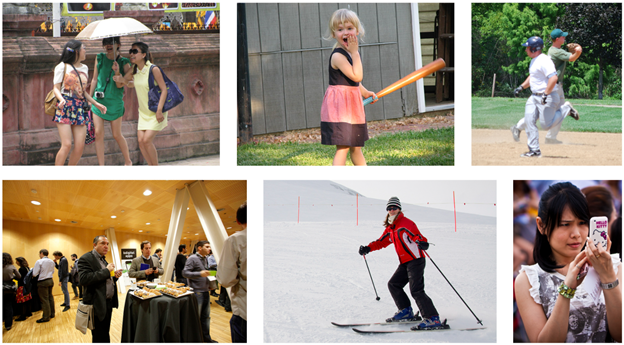

使用经过身份验证的 Innotescus 客户端实例，开始设置项目并上传以人为中心的数据集。

```Python
#create a new project
client.create_project(project_name)
#upload data to the new project
client.upload_data(project_name, dataset_name, file_paths, data_type, storage_type)
```

* data_type: The type of data this dataset holds. Accepted values:
    * DataType.IMAGE
    * DataType.VIDEO
* storage_type: The source of the data. Accepted values:
    * StorageType.FILE_SYSTEM
    * StorageType.URL

现在可以通过 Innotescus 用户界面访问该数据集。

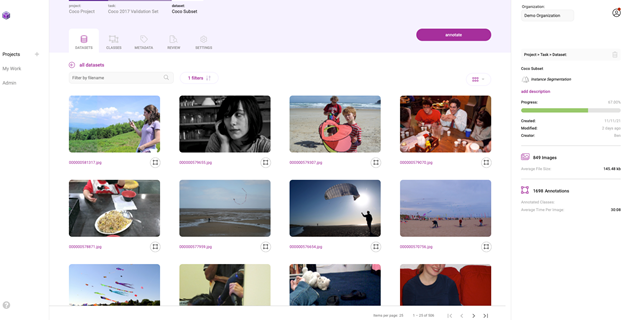

## 数据管理

现在您已经有了初始数据集，开始整理它以确保数据集平衡。 研究一再表明，该过程的这一阶段大约需要花费在机器学习项目上的 80% 的时间。

使用 TAO 和 Innotescus，我们重点介绍了预注释和审查等技术，这些技术可以在此步骤中节省时间，而不会牺牲数据集的大小或质量。

## Pre-annotation
预注释使您能够使用模型生成的注释来消除准确标记 2,685 个图像子集所需的大量时间和手动工作。 您使用 YOLOv4（与您重新训练的模型相同）来生成预注释，以供注释者细化。

因为预注释可以为您节省大量时间在注释任务的较简单组件上，您可以将注意力集中在模型尚无法处理的较难示例上。

YOLOv4 包含在 TAO 工具包中，支持 k-means 聚类、训练、评估、推理、修剪和导出。 要使用该模型，首先必须创建一个 [YOLOv4 spec](https://docs.nvidia.com/tao/tao-toolkit/text/object_detection/yolo_v4.html) 文件，该文件具有以下主要组件：

* yolov4_config
* training_config
* eval_config
* nms_config
* augmentation_config
* dataset_config

spec 文件是一个 protobuf 文本（prototxt）消息，它的每个字段既可以是基本数据类型，也可以是嵌套消息。

接下来，下载具有预训练权重的模型。 TAO Toolkit Docker 容器提供对预训练模型存储库的访问，这些模型在训练深度神经网络时是一个很好的起点。 由于这些模型托管在 NGC 目录中，因此您必须首先下载并安装 NGC CLI。 有关详细信息，请参阅 [NGC 文档](https://docs.nvidia.com/ngc/ngc-catalog-cli-user-guide/index.html%22)。

安装 CLI 后，您可以在 NGC 存储库中查看预训练计算机视觉模型列表，并下载预训练模型。

```
ngc registry model list nvidia/tao/pretrained_*
ngc registry model download-version /path/to/model_on_NGC_repo/ -dest /path/to/model_download_dir/
```

下载模型并更新规范文件后，您现在可以通过运行推理子任务来生成预注释。

```
tao yolo_v4 inference [-h] -i /path/to/imgFolder/ -l /path/to/annotatedOutput/ -e /path/to/specFile.txt -m /path/to/model/ -k $KEY
```

推理子任务的输出是一系列KITTI格式的注解，保存在指定的输出目录中。 下图显示了这些注释的两个示例：
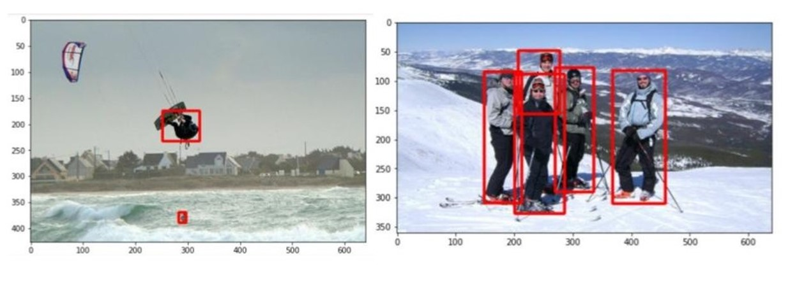

通过基于 Web 的用户界面或使用 API 手动将预注释上传到 Innotescus 平台。 因为 KITTI 格式是 Innotescus 接受的众多格式之一，所以不需要预处理。


```Python 
#upload pre-annotations generated by YOLOv4
Response = client.upload_annotations(project_name, dataset_name, task_type, data_type, annotation_format, file_paths, task_name, task_description, overwrite_existing_annotations, pre_annotate)
```

* project_name: The name of the project containing the affected dataset and task.
* dataset_name: The name of the dataset to which these annotations are to be applied.
* task_type: The type of annotation task being created with these annotations. Accepted values from the TaskType class:
    * CLASSIFICATION
    * OBJECT_DETECTION
    * SEGMENTATION
    * INSTANCE_SEGMENTATION
* data_type: The type of data to which the annotations correspond. Accepted values:
    * DataType.IMAGE
    *DataType.VIDEO
* annotation_format: The format in which these annotations are stored. Accepted values from the AnnotationFormat class:
    * COCO
    * KITTI
    * MASKS_PER_CLASS
    * PASCAL
    * CSV
    * MASKS_SEMANTIC
    * MASKS_INSTANCE
    * INNOTESCUS_JSON
    * YOLO_DARKNET
    * YOLO_KERAS
* file_paths: A list of file paths containing the annotation files to upload.
* task_name: The name of the task to which these annotations belong; if the task does not exist, it is created and populated with these annotations.
* task_description: A description of the task being created, if the task does not exist yet.
overwrite_existing_annotations: If the task already exists, this flag allows you to overwrite existing annotations.
* pre_annotate: Allows you to import annotations as pre-annotations.


将预注释导入平台并保存大量初始注释工作后，进入 Innotescus 以进一步更正、优化和分析数据。

## 审查和更正

成功导入预注释后，前往平台对预注释进行审查和更正。 虽然预训练模型节省了大量的注释时间，但它仍然不完美，需要一些人在循环中的交互来确保高质量的训练数据。 下图 显示了您可能进行的典型更正示例。

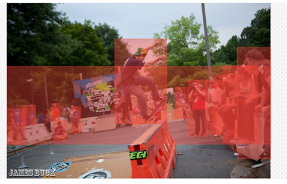

除了第一次修复和提交预注释之外，Innotescus 还可以对图像和注释进行更集中的采样，以进行多阶段审查。 这使大型团队能够系统且有效地确保整个数据集的高质量。


## 探索性数据分析
探索性数据分析（EDA）是从多个统计角度调查和可视化数据集的过程，以全面了解数据中存在的潜在模式、异常和偏差。在深思熟虑地解决数据集包含的统计不平衡问题之前，这是一个有效且必要的步骤。

Innotescus 提供预先计算的指标，用于理解数据和注释的类别、颜色、空间和复杂性分布，并使您能够在图像和注释元数据中添加自己的信息层，以将特定于应用程序的信息合并到分析中。

以下是如何使用 Innotescus 的深度可视化来了解数据集中存在的一些模式和偏差。下面的散点图显示了图像熵的分布，它是图像中的平均信息或随机程度，在数据集中沿 x 轴。您可以看到清晰的模式，但您也可以发现异常，例如具有低熵或信息内容的图像。

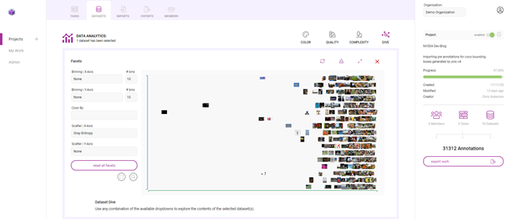

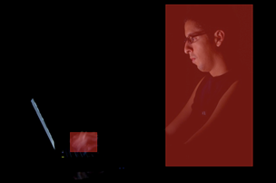

像这样的异常值引发了如何处理数据集中异常的问题。 识别异常使您能够提出一些关键问题：

* 您是否希望模型在部署时遇到低熵输入？
* 如果是这样，您是否需要在训练数据集中有更多这样的示例？
* 如果不是，这些示例是否会对训练有害，是否应该从训练数据集中删除？

在另一个示例中，查看每个注释的区域，相对于它所在的图像。

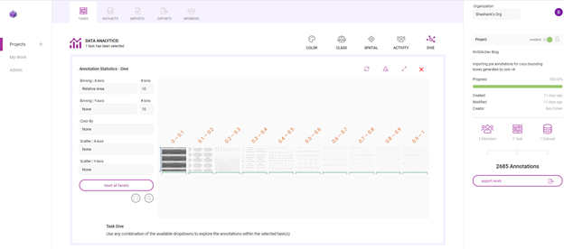

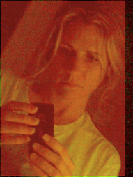

在上图 中，这两个图像显示了数据集中注释大小的变化。 虽然有些注释会捕捉到占据大量图像的人物，但大多数会显示远离相机的人物。

在这里，很大比例的注释在它们各自图像大小的 0% 到 10% 之间。 这意味着数据集偏向于小物体或远离相机的人。 然后，您是否需要训练数据中的更多示例，这些示例具有更大的注释来代表离相机更近的人？ 以这种方式了解数据分布有助于您开始考虑数据增强计划。

使用 Innotescus，EDA 变得直观。 它为您提供了对数据集进行强大扩充并在开发过程早期消除偏见所需的信息。

## 使用数据集扩充进行集群再平衡

集群再平衡增强背后的想法是强大的。在最近由 Andrew Ng 和 DeepLearning.AI 主办的以数据为中心的 AI 竞赛中，这项技术的性能提升了 21%。

您为每个数据点（每个边界框注释）生成一个 N 维特征向量，并将所有数据点聚集在更高维空间中。当您对具有相似特征的对象进行聚类时，您可以扩充数据集以使每个聚类具有相同的表示。

我们选择使用[red channel mean, green channel mean, blue channel mean, gray image std, gray image entropy, relative area]作为N维特征向量。这些指标是从 Innotescus 导出的，它会自动计算它们。您还可以使用预训练模型生成的嵌入来填充特征向量，这可以说是更健壮的。

您使用 k=4 的 k-means 聚类作为聚类算法，并使用 UMAP 将维度减少到两个以进行可视化。以下代码示例生成显示 UMAP 图的图形，使用这四个集群进行颜色编码。

```Python
import umap
from sklearn.decomposition import PCA
from sklearn.cluster import KMeans

# k-means on the feature vector
kmeans = KMeans(n_clusters=4, random_state=0).fit(featureVector)

# UMAP for dim reduction and visualization
fit = umap.UMAP(n_neighbors=5,
		min_dist=0.2,
		n_components=2,
		metric=’manhattan’)

u = fit.fit_transform(featureVector)

# Plot UMAP components
plt.scatter(u[:,0], u[:,1], c=(kmeans.labels_))
plt.title(‘UMAP embedding of kmeans colours’)
```

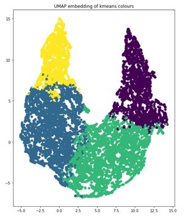

当您查看每个集群中的对象数量时，您可以清楚地看到不平衡，这会告知您应该如何增加数据以进行再训练。 这四个聚类分别代表 854、1523、1481 和 830 张图像。 如果图像在多个集群中具有对象，则将集群中的该图像与其大部分对象分组以进行增强。

```Python
clusters = {}

for file, cluster in zip(filename, kmeans.labels_):
	if cluster not in clusters.keys():
		clusters[cluster] = []
		clusters[cluster].append(file)
	else:
		clusters[cluster].append(file)

for numCls in range(0, len(clusters)):
	print(‘Cluster {}: {} objects, {} images’.format(numCls+1, len(clusters[numCls]), len(list(set(clusters[numCls])))))
```
输出:
```
Cluster 1: 2234 objects, 854 images
Cluster 2: 3490 objects, 1523 images
Cluster 3: 3629 objects, 1481 images
Cluster 4: 1588 objects, 830 images
```
定义好集群后，您可以使用 [imgaug](https://imgaug.readthedocs.io/en/latest/) Python 库引入增强技术来增强训练数据：平移、图像亮度调整和比例增强。 您进行扩充，使每个集群包含 2,000 个图像，总共 8,000 个。 当您扩充图像时，imgaug 确保注释坐标也被适当地更改。

```Python
import imgaug as ia
import imgaug.augmenters as iaa

# augment images
seq = iaa.Sequential([
	iaa.Multiply([1.1, 1.5]), # change brightness, doesn’t affect BBs
	iaa.Affine(
		translate_px={“x”:60, “y”:60},
		scale=(0.5, 0.8)
	) # translate by 60px on x/y axes & scale to 50-80%, includes BBs
])

# augment BBs and images
image_aug, bbs_aug = seq(image=I, bounding_boxes=boundingBoxes)
```
使用相同的 UMAP 可视化技术，增强数据点现在以红色显示，您会看到数据集现在更加平衡，因为它更类似于高斯分布。
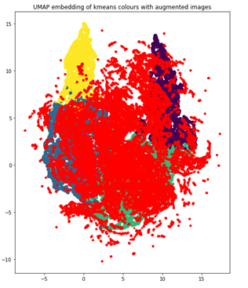

## 模型训练
有了均衡的、高质量的训练数据，最后一步就是训练模型。

## 利用TAO Toolkit对YOLOv4进行在训练

要开始重新训练模型，首先确保规范文件包含感兴趣的类，以及预训练模型和训练数据的正确目录路径。 更改 training_config 部分中的训练参数。 保留 30% 的增强数据集作为测试数据集，用于比较预训练模型和再训练模型的性能。

```
ttraining_config {
	batch_size_per_gpu: 8
	num_epochs: 80
	enable_qat: false
	checkpoint_interval: 10
	learning_rate {
		soft_start_cosine_annealing_schedule {
			min_learning_rate: 1e-7
			max_learning_rate: 1e-4
			soft_start: 0.3
		}
	}
	regularizer {
		type: L1
		weight: 3e-5
	}
	optimizer {
		adam {
			epsilon: 1e-7
			beta1: 0.9
			beta2: 0.999
			amsgrad: false
		}
	}
	pretrain_model_path: “path/to/model/model.hdf5”
}
```
运行训练命令

```
tao yolo_v4 train -e /path/to/specFile.txt -r /path/to/result -k $KEY
```

结果
如您所见，平均精度提高了 14.93%，比预训练模型的 mAP 提高了 21.37%：

|Model|	mAP50|
|----|----|
|Yolov4 pretrained model|	69.86%|
|Yolov4 retrained model with cluster-rebalanced augmentation|	84.79%|

## 总结
使用 NVIDIA TAO Toolkit 进行预注释和模型训练，使用 Innotescus 进行数据细化、分析和管理，您将 YOLOv4 在人类上的平均精度提高了很多：超过 20%。 您不仅提高了所选课程的表现，而且您使用的时间和数据比没有迁移学习的显着优势时更少。

迁移学习是在资源有限的环境中生成高性能、特定于应用程序的模型的好方法。 使用诸如 TAO 工具包和 Innotescus 之类的工具使其适用于各种规模和背景的团队。

## 自己尝试
有兴趣使用 [Innotescus](https://innotescus.io/) 来增强和优化您自己的数据集吗？ [注册](http://info.innotescus.io/nvidia-blog-lp)免费试用。 [下载示例资源](https://catalog.ngc.nvidia.com/orgs/nvidia/resources/cv_samples)，开始使用 TAO 工具包进行 AI 模型训练。
