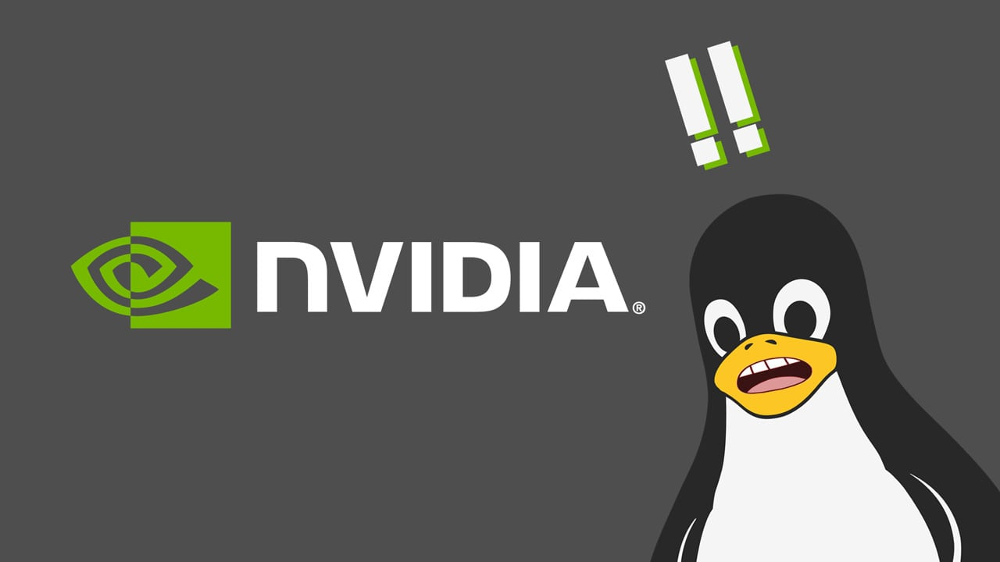
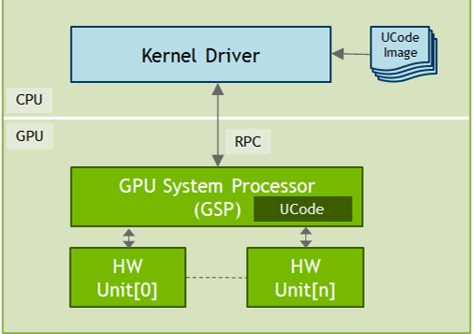

# NVIDIA开源内核模块

5月11日, NVIDIA 将 Linux GPU 内核模块作为开放源代码发布.

那么, 什么是开源GPU内核模组呢?

* GPU内核模块开源发布，基于GSP驱动架构
* 这将包含下面的模组:​

    * nvidia.ko​

    * nvidia-modeset.ko​

    * nvidia-uvm.ko​

    * nvidia-drm.ko​

    * nvidia-peermem.ko​ 

* NVIDIA将发布内核级组件的源代码。​
* 欢迎开发人员使用已发布的源代码来评审代码、提出补丁、自行调试问题等等。
* [Github](https://github.com/NVIDIA/open-gpu-kernel-modules)

本次发布是改善在 Linux 中使用 NVIDIA GPU 的体验、与操作系统更紧密集成以及开发人员调试、集成和反馈的重要一步。对于 Linux 发行商来说，开源模块增加了易用性。他们还改进了开箱即用的用户体验，以签署和分发 NVIDIA GPU 驱动程序。 Canonical 和 SUSE 能够立即用 Ubuntu 和 SUSE Linux 企业版打包开放内核模块。

* 支持的GPU体系结构
    * Turing, Ampere, and beyond
    * 图灵GPU之前的架构不能运行开放GPU内核模块，因为它们没有所需的GSP硬件
* 支持的数据中心图形处理器
    * 在R515中，开放GPU内核模块对数据中心GPU的支持是产品级的
    * 针对工作站和GeForce GPU的开放GPU内核模块是alpha质量的，将在2022年第四季度前致力于产品质量支持
* Open GPU Kernel Modules和Closed source Modules是安装时间互斥的，因为它们为用户空间提供了相同的ABI
* 版本锁定组件
    * 打开GPU内核模块，用户模式驱动程序和GSP固件是“版本锁定”的，这意味着它们必须作为一个集合运行。
    * 正在努力在未来实现组件的解耦。

[点击此处加入NVIDIA开发者计划](https://developer.nvidia.com/zh-cn/developer-program)

