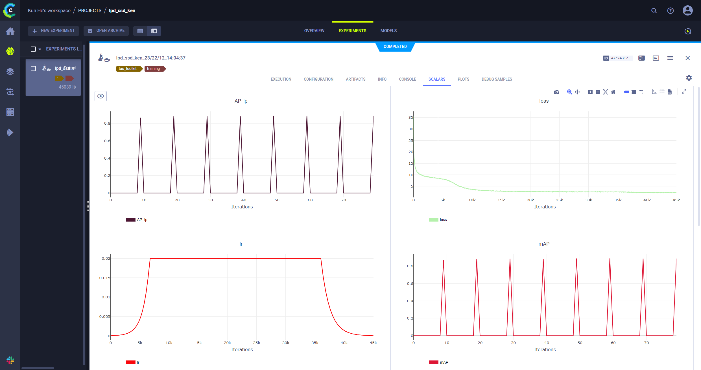

# 利用SSD网络进行车牌检测

本教程利用NVIDIA TAO进行车牌检测模型的训练:
1. 模型框架:SSD
2. 数据集: CRPD, 连接:https://github.com/yxgong0/CRPD
3. 训练框架: NVIDIA TAO, 安装教程连接: https://docs.nvidia.com/tao/tao-toolkit/text/tao_toolkit_quick_start_guide.html#tao-toolkit-package-content
4. 预训练模型: 可从NGC下载, 连接:https://catalog.ngc.nvidia.com/orgs/nvidia/teams/tao/models/pretrained_object_detection/files
5. 本教程文件夹目录(不含数据和模型): 链接：https://pan.baidu.com/s/1IKrXQX3m21bzFSOljrDULA 
提取码：0512 


## 教程目录

0. [设置环境以及路径](#head-0)
1. [安装TAO启动器](#head-1)
2. [准备数据集和预训练模型](#head-2) <br>
    2.1 [下载预训练模型](#head-2-1) <br>
3. [定义训练参数](#head-3)
4. [利用TAO开始训练](#head-4)
5. [评估模型](#head-5)
6. [剪枝模型](#head-6)
7. [重新训练模型](#head-7)
8. [评估模型](#head-8)
9. [可视化推理](#head-9)
10. [模型导出](#head-10)
11. [验证部署模型](#head-11)

## 0.设置环境以及路径 <a class="anchor" id="head-0"></a>

NVIDIA TAO是以docker镜像的形式运行, 我们需要设置自己的计算机系统和docker镜像内系统的路径映射关系.

我们采用了clearml的可视化技术, 可以利用clearml来监测我们的训练过程, 这里还需要设置clearml相关的配置信息

```python
import os

print("Please replace the variable with your key.")
#设置NVIDIA TAO的api key, 这个key是用来加密你的模型的
%env KEY=nvidia_tlt
%env GPU_INDEX=0

#设置实验路径和数据集路径, 这里的路径指的是docker镜像内部的路径
%env USER_EXPERIMENT_DIR=/workspace/tao-experiments/ssd
%env DATA_DOWNLOAD_DIR=/workspace/tao-experiments/data

#设置clearml的相关配置信息
%env CLEARML_WEB_HOST=https://app.clear.ml
%env CLEARML_API_HOST=https://api.clear.ml
%env CLEARML_FILES_HOST=https://files.clear.ml
%env CLEARML_API_ACCESS_KEY=SY1OMSO6JY6W24WVBHOR
%env CLEARML_API_SECRET_KEY=URcjcox7nx9YIE7mDFoabr1CsdVcMWKSU0NPb5machH3aPP8FZ

#这里设置的路径是指的你自己计算机系统的路径, 当前设置的是我的, 你需要根据你自己的实验路径更改
%env LOCAL_PROJECT_DIR=/home/hekun/mydata/tao-3.0-sample/cv_samples_v1.4.0/ssd
os.environ["LOCAL_DATA_DIR"] = os.path.join(os.getenv("LOCAL_PROJECT_DIR", os.getcwd()), "data")
os.environ["LOCAL_EXPERIMENT_DIR"] = os.path.join(os.getenv("LOCAL_PROJECT_DIR", os.getcwd()), "ssd")

#这里设置的是训练,数据转换等定义文件的存放路径
os.environ["LOCAL_SPECS_DIR"] = os.path.join(
    os.getenv("NOTEBOOK_ROOT", os.getcwd()),
    "specs"
)
%env SPECS_DIR=/workspace/tao-experiments/ssd/specs


!ls -rlt $LOCAL_SPECS_DIR
```

下面的单元格将本地主机上的项目目录映射到 TAO docker 实例中的工作区目录，以便数据和结果从 docker 中映射出来。 更多信息请参考用户指南中的[启动器实例](https://docs.nvidia.com/tao/tao-toolkit/tao_launcher.html)。

envs里面指的是clearml可视化的设置信息, 你需要根据你自己的账户设置`CLEARML_API_ACCESS_KEY`和`CLEARML_API_SECRET_KEY`

```python
# Mapping up the local directories to the TAO docker.
import json
mounts_file = os.path.expanduser("~/.tao_mounts.json")

# Define the dictionary with the mapped drives
drive_map = {
    "Mounts": [
            # Mapping the data directory
            {
                "source": os.environ["LOCAL_PROJECT_DIR"],
                "destination": "/workspace/tao-experiments"
            },
            # Mapping the specs directory.
            {
                "source": os.environ["LOCAL_SPECS_DIR"],
                "destination": os.environ["SPECS_DIR"]
            },
        ],
    "Envs": [
        {
            "variable": "CLEARML_WEB_HOST",
            "value": "https://app.clear.ml"
        },
        {
            "variable": "CLEARML_API_HOST",
            "value": "https://api.clear.ml"
        },
        {
            "variable": "CLEARML_FILES_HOST",
            "value": "https://files.clear.ml"
        },
        {
            "variable": "CLEARML_API_ACCESS_KEY",
            "value": "SY1OMSO6JY6W24WVBHOR"
        },
        {
            "variable": "CLEARML_API_SECRET_KEY",
            "value": "URcjcox7nx9YIE7mDFoabr1CsdVcMWKSU0NPb5machH3aPP8FZ"
        }
    ],
    "DockerOptions": {
        "shm_size": "16G",
        "ulimits": {
            "memlock": -1,
            "stack": 67108864
        },
        "user": "1000:1000",
        "ports": {
            "8888": 8888
        }
    }
}

# Writing the mounts file.
with open(mounts_file, "w") as mfile:
    json.dump(drive_map, mfile, indent=4)
```

```python
!cat ~/.tao_mounts.json
```

## 1. 安装tao启动器<a class="anchor" id="head-1"></a>
TAO 启动器是一个 python 包，作为 PyPI 中列出的 python wheel 分发。 您可以通过执行以下单元格来安装启动器。

请注意，TAO Toolkit 建议用户使用 python 3.6.9 在虚拟环境中运行 TAO 启动器。 您可以按照此 [页面](https://virtualenvwrapper.readthedocs.io/en/latest/install.html) 中的说明使用 `virtualenv` 和 `virtualenvwrapper` 包设置 python 虚拟环境。 设置 virtualenvwrapper 后，请使用 `VIRTUALENVWRAPPER_PYTHON` 变量设置要在虚拟环境中使用的 python 版本。 你可以通过运行来做到这一点

```sh
export VIRTUALENVWRAPPER_PYTHON=/path/to/bin/python3.x
```
其中 x >= 6 且 <= 8

我们建议先执行此步骤，然后从虚拟环境启动笔记本。 除了安装 TAO python 包外，请确保满足以下软件要求：
* python >=3.6.9 < 3.8.x
* docker-ce > 19.03.5
* docker-API 1.40
* nvidia-container-toolkit > 1.3.0-1
* nvidia-container-runtime > 3.4.0-1
* nvidia-docker2 > 2.5.0-1
* nvidia-driver > 455+

安装先决条件后，请按照以下命令登录到 docker registry nvcr.io

```sh
docker login nvcr.io
```

您将被触发输入用户名和密码。 用户名是“$oauthtoken”，密码是从“ngc.nvidia.com”生成的 API 密钥。 请按照 [NGC 设置指南](https://docs.nvidia.com/ngc/ngc-overview/index.html#generating-api-key) 中的说明生成您自己的 API 密钥。

```python
# SKIP this step IF you have already installed the TAO launcher.
!pip3 install nvidia-tao
```

```python
# View the versions of the TAO launcher
!tao info
```

## 2. 准备数据集和预训练模型<a class="anchor" id="head-2"></a>

CRPD (Chinese Road Plate Dataset)是一个大型的中文车牌数据集, 它包含三个子集--- CRPD-single, CRPD-double ,CRPD-multi. 本教程采用了其中的CRPD-single为例. 他的标注包含:  

x1, y1, x2, y2, x3, y3, x4, y4, type, content
* 前八个数字表示边界四边形角的坐标。 
* “type”标注表示LP的类型，0代表蓝盘，1代表黄盘和单行车牌，2代表黄牌和双行车牌，3代表白牌。 
* “content”注释表示 LP 内容。

由于NVIDIA TAO目标检测模型训练数据集需要KITTI格式, 所以我们需要将数据集的标注进行转换.我已经将转换格式的脚本放在本教程文件夹中, 请查看`preprocess_crpd.py`文件, 并根据你实际的路径作出简单调整就可以使用

```python
!python3 preprocess_crpd.py
```
接下来将准备好的数据集分割一部分出来当做测试集

```python
# Generate val dataset out of training dataset
!python3 generate_val_dataset.py --input_image_dir=$LOCAL_DATA_DIR/lpd_images \
                                 --input_label_dir=$LOCAL_DATA_DIR/lpd_labels \
                                 --output_dir=$LOCAL_DATA_DIR/val
```

当我们准备好数据集之后, 我们需要将数据集转换成tfrecords格式, 这里可以利用tao自带的工具.  

我们在这里需要定义数据的路径, 格式, 目标类别等信息. 

需要注意的是这里的路径`root_directory_path`指的是docker系统内的路径

```python
print("TFRecords conversion spec file:")
!cat $LOCAL_SPECS_DIR/ssd_tfrecords_kitti_train.txt
```
开始转换

```python
# Creating a new directory for the output tfrecords dump.
print("Converting the training set to TFRecords.")
!mkdir -p $LOCAL_DATA_DIR/tfrecords && rm -rf $LOCAL_DATA_DIR/tfrecords/*
!tao ssd dataset_convert \
         -d $SPECS_DIR/ssd_tfrecords_kitti_train.txt \
         -o $DATA_DOWNLOAD_DIR/tfrecords/kitti_train
!ls -rlt $LOCAL_DATA_DIR/tfrecords/
```
### 2.1 下载预训练模型 <a class="anchor" id="head-2-1"></a>
我们将使用 NGC CLI 获取预训练模型。 有关详细信息，请访问 [ngc.nvidia.com](ngc.nvidia.com) 并单击导航栏上的 SETUP。

这里如果因为网络的原因没法下载, 也可以手动登录并下载模型:

https://catalog.ngc.nvidia.com/orgs/nvidia/teams/tao/models/pretrained_object_detection/files


```python
# Installing NGC CLI on the local machine.
## Download and install
%env CLI=ngccli_cat_linux.zip
!mkdir -p $LOCAL_PROJECT_DIR/ngccli

# Remove any previously existing CLI installations
!rm -rf $LOCAL_PROJECT_DIR/ngccli/*
!wget "https://ngc.nvidia.com/downloads/$CLI" -P $LOCAL_PROJECT_DIR/ngccli
!unzip -u "$LOCAL_PROJECT_DIR/ngccli/$CLI" -d $LOCAL_PROJECT_DIR/ngccli/
!rm $LOCAL_PROJECT_DIR/ngccli/*.zip 
os.environ["PATH"]="{}/ngccli:{}".format(os.getenv("LOCAL_PROJECT_DIR", ""), os.getenv("PATH", ""))
```
```python
!ngc registry model list nvidia/tao/pretrained_object_detection:*
```
```python
!mkdir -p $LOCAL_EXPERIMENT_DIR/pretrained_resnet18/
```
```python
# Pull pretrained model from NGC
!ngc registry model download-version nvidia/tao/pretrained_object_detection:resnet18 --dest $LOCAL_EXPERIMENT_DIR/pretrained_resnet18
```
```python
print("Check that model is downloaded into dir.")
!ls -l $LOCAL_EXPERIMENT_DIR/pretrained_resnet18/pretrained_object_detection_vresnet18
```

## 3. 定义训练参数<a class="anchor" id="head-3"></a>
我们需要定义训练的一些参数, 通过`scpecs/ssd_train_resnet18_kitti.txt`文件来定义:

```python
!cat $LOCAL_SPECS_DIR/ssd_train_resnet18_kitti.txt
```
## 4. 利用tao开始训练<a class="anchor" id="head-4"></a>
接下来我们开始训练, 这个过程会比较久, 你也可以通过clearml来监控训练过程



```python
!mkdir -p $LOCAL_EXPERIMENT_DIR/experiment_dir_unpruned
```

```python
print("To run with multigpu, please change --gpus based on the number of available GPUs in your machine.")
!tao ssd train --gpus 1 --gpu_index=$GPU_INDEX \
               -e $SPECS_DIR/ssd_train_resnet18_kitti.txt \
               -r $USER_EXPERIMENT_DIR/experiment_dir_unpruned \
               -k $KEY \
               -m $USER_EXPERIMENT_DIR/pretrained_resnet18/pretrained_object_detection_vresnet18/resnet_18.hdf5
```

```python
print("To resume from checkpoint, please uncomment and run this instead. Change last two arguments accordingly.")
# !tao ssd train --gpus 1 --gpu_index=$GPU_INDEX \
#                -e $SPECS_DIR/ssd_train_resnet18_kitti.txt \
#                -r $USER_EXPERIMENT_DIR/experiment_dir_unpruned \
#                -k $KEY \
#                -m $USER_EXPERIMENT_DIR/experiment_dir_unpruned/weights/ssd_resnet18_epoch_001.tlt \
#                --initial_epoch 2
```
```python
print('Model for each epoch:')
print('---------------------')
!ls -ltrh $LOCAL_EXPERIMENT_DIR/experiment_dir_unpruned/weights
```
```python
# Now check the evaluation stats in the csv file and pick the model with highest eval accuracy.
!cat $LOCAL_EXPERIMENT_DIR/experiment_dir_unpruned/ssd_training_log_resnet18.csv
%set_env EPOCH=080
```

## 5. 评估模型 <a class="anchor" id="head-5"></a>

```python
!tao ssd evaluate --gpu_index=$GPU_INDEX \
                  -e $SPECS_DIR/ssd_train_resnet18_kitti.txt \
                  -m $USER_EXPERIMENT_DIR/experiment_dir_unpruned/weights/ssd_resnet18_epoch_$EPOCH.tlt \
                  -k $KEY
```
## 6. 模型剪枝 <a class="anchor" id="head-6"></a>
* 指定预训练模型
* 设置剪枝阈值

通常，您只需要调整 `-pth`（阈值）以获得准确性和模型大小的权衡。 更高的 `pth` 给你更小的模型（因此推理速度更快）但准确性更差。 阈值取决于数据集和模型。 下面块中的“0.5”只是一个起点。 如果重新训练的准确性很好，您可以增加此值以获得更小的模型。 否则，降低此值以获得更好的准确性。


```python
!mkdir -p $LOCAL_EXPERIMENT_DIR/experiment_dir_pruned
```
```python
!tao ssd prune --gpu_index=$GPU_INDEX \
               -m $USER_EXPERIMENT_DIR/experiment_dir_unpruned/weights/ssd_resnet18_epoch_$EPOCH.tlt \
               -o $USER_EXPERIMENT_DIR/experiment_dir_pruned/ssd_resnet18_pruned.tlt \
               -eq intersection \
               -pth 0.1 \
               -k $KEY
```
```python
!ls -rlt $LOCAL_EXPERIMENT_DIR/experiment_dir_pruned/
```
## 7. 重新训练模型 <a class="anchor" id="head-7"></a>
* 剪枝后需要重新训练模型以恢复准确率
* 指定再训练参数
* 警告：训练需要数小时或一天才能完成


```python
# Printing the retrain spec file. 
# Here we have updated the spec file to include the newly pruned model as a pretrained weights.
!cat $LOCAL_SPECS_DIR/ssd_retrain_resnet18_kitti.txt
```

```python
!mkdir -p $LOCAL_EXPERIMENT_DIR/experiment_dir_retrain
# Retraining using the pruned model as pretrained weights 
!tao ssd train --gpus 1 --gpu_index=$GPU_INDEX \
               -e $SPECS_DIR/ssd_retrain_resnet18_kitti.txt \
               -r $USER_EXPERIMENT_DIR/experiment_dir_retrain \
               -m $USER_EXPERIMENT_DIR/experiment_dir_pruned/ssd_resnet18_pruned.tlt \
               -k $KEY
```
```python
# Listing the newly retrained model.
!ls -rlt $LOCAL_EXPERIMENT_DIR/experiment_dir_retrain/weights
# Now check the evaluation stats in the csv file and pick the model with highest eval accuracy.
!cat $LOCAL_EXPERIMENT_DIR/experiment_dir_retrain/ssd_training_log_resnet18.csv
%set_env EPOCH=080
```
## 8. 评估模型 <a class="anchor" id="head-8"></a>
```python
!tao ssd evaluate --gpu_index=$GPU_INDEX \
                  -e $SPECS_DIR/ssd_retrain_resnet18_kitti.txt \
                  -m $USER_EXPERIMENT_DIR/experiment_dir_retrain/weights/ssd_resnet18_epoch_$EPOCH.tlt \
                  -k $KEY
```

## 9. 可视化推理 <a class="anchor" id="head-9"></a>
在本节中，我们运行 `infer` 工具来生成对训练模型的推理并可视化结果。
```python
# Running inference for detection on n images
!tao ssd inference --gpu_index=$GPU_INDEX -i $DATA_DOWNLOAD_DIR/test_samples \
                   -o $USER_EXPERIMENT_DIR/ssd_infer_images \
                   -e $SPECS_DIR/ssd_retrain_resnet18_kitti.txt \
                   -m $USER_EXPERIMENT_DIR/experiment_dir_retrain/weights/ssd_resnet18_epoch_$EPOCH.tlt \
                   -l $USER_EXPERIMENT_DIR/ssd_infer_labels \
                   -k $KEY
```
`tao` 推理工具产生两个输出。
1. 在 `$USER_EXPERIMENT_DIR/ssd_infer_images` 中叠加图像
2. kitti 格式的逐帧 bbox 标签位于 `$USER_EXPERIMENT_DIR/ssd_infer_labels`

```python
# Simple grid visualizer
!pip3 install matplotlib==3.3.3
import matplotlib.pyplot as plt
import os
from math import ceil
valid_image_ext = ['.jpg', '.png', '.jpeg', '.ppm']

def visualize_images(image_dir, num_cols=4, num_images=10):
    output_path = os.path.join(os.environ['LOCAL_EXPERIMENT_DIR'], image_dir)
    num_rows = int(ceil(float(num_images) / float(num_cols)))
    f, axarr = plt.subplots(num_rows, num_cols, figsize=[80,30])
    f.tight_layout()
    a = [os.path.join(output_path, image) for image in os.listdir(output_path) 
         if os.path.splitext(image)[1].lower() in valid_image_ext]
    for idx, img_path in enumerate(a[:num_images]):
        col_id = idx % num_cols
        row_id = idx // num_cols
        img = plt.imread(img_path)
        axarr[row_id, col_id].imshow(img) 

# Visualizing the sample images.
OUTPUT_PATH = 'ssd_infer_images' # relative path from $USER_EXPERIMENT_DIR.
COLS = 3 # number of columns in the visualizer grid.
IMAGES = 9 # number of images to visualize.

visualize_images(OUTPUT_PATH, num_cols=COLS, num_images=IMAGES)
```
## 10. 模型导出 <a class="anchor" id="head-10"></a>
如果您训练了非 QAT 模型，您可以使用下面的代码块以 FP32、FP16 或 INT8 模式导出。 对于 INT8，您需要提供校准图像目录。

```python
# tao <task> export will fail if .etlt already exists. So we clear the export folder before tao <task> export
!rm -rf $LOCAL_EXPERIMENT_DIR/export
!mkdir -p $LOCAL_EXPERIMENT_DIR/export
# Export in FP32 mode. Change --data_type to fp16 for FP16 mode
!tao ssd export --gpu_index=$GPU_INDEX \
                -m $USER_EXPERIMENT_DIR/experiment_dir_retrain/weights/ssd_resnet18_epoch_$EPOCH.tlt \
                -k $KEY \
                -o $USER_EXPERIMENT_DIR/export/ssd_resnet18_epoch_$EPOCH.etlt \
                -e $SPECS_DIR/ssd_retrain_resnet18_kitti.txt \
                --batch_size 16 \
                --data_type fp32 \
                --gen_ds_config

# Uncomment to export in INT8 mode (generate calibration cache file).
# !tao ssd export --gpu_index=$GPU_INDEX \
#                 -m $USER_EXPERIMENT_DIR/experiment_dir_retrain/weights/ssd_resnet18_epoch_$EPOCH.tlt  \
#                 -o $USER_EXPERIMENT_DIR/export/ssd_resnet18_epoch_$EPOCH.etlt \
#                 -e $SPECS_DIR/ssd_retrain_resnet18_kitti.txt \
#                 -k $KEY \
#                 --cal_image_dir $DATA_DOWNLOAD_DIR/testing/image_2 \
#                 --data_type int8 \
#                 --batch_size 16 \
#                 --batches 10 \
#                 --cal_cache_file $USER_EXPERIMENT_DIR/export/cal.bin  \
#                 --cal_data_file $USER_EXPERIMENT_DIR/export/cal.tensorfile \
#                 --gen_ds_config
```
```python
print('Exported model:')
print('------------')
!ls -lh $LOCAL_EXPERIMENT_DIR/export
```
使用 docker 附带的“tao-converter”实用程序验证引擎生成。

`tao-converter` 为它所在的平台生成优化的 tensorrt 引擎。 因此，为了获得最佳性能，请实例化此 docker 并在目标设备上使用导出的 .etlt 文件和校准缓存（用于 int8 模式）执行 `tao-converter` 命令。 此 docker 中包含的 tao-converter 实用程序仅适用于具有独立 NVIDIA GPU 的 x86 设备。

对于 jetson 设备，请从开发区链接 [此处](https://developer.nvidia.com/tao-converter) 下载 tao-converter for jetson。

如果您选择将您的模型直接集成到 deepstream 中，您可以通过简单地将导出的 .etlt 文件连同校准缓存复制到目标设备并更新配置 gst-nvinfer 元素指向的 spec 文件来实现 到这个新导出的模型。 通常，此文件对于检测模型称为“config_infer_primary.txt”，对于分类模型称为“config_infer_secondary_*.txt”。

```python
# Convert to TensorRT engine (FP32)
!tao converter -k $KEY \
                   -d 3,300,300 \
                   -o NMS \
                   -e $USER_EXPERIMENT_DIR/export/trt.engine \
                   -m 16 \
                   -t fp32 \
                   -i nchw \
                   $USER_EXPERIMENT_DIR/export/ssd_resnet18_epoch_$EPOCH.etlt

# Convert to TensorRT engine (FP16)
# !tao converter -k $KEY \
#                    -d 3,300,300 \
#                    -o NMS \
#                    -e $USER_EXPERIMENT_DIR/export/trt.engine \
#                    -m 16 \
#                    -t fp16 \
#                    -i nchw \
#                    $USER_EXPERIMENT_DIR/export/ssd_resnet18_epoch_$EPOCH.etlt

# Convert to TensorRT engine (INT8).
# !tao converter -k $KEY  \
#                    -d 3,300,300 \
#                    -o NMS \
#                    -c $USER_EXPERIMENT_DIR/export/cal.bin \
#                    -e $USER_EXPERIMENT_DIR/export/trt.engine \
#                    -b 8 \
#                    -m 16 \
#                    -t int8 \
#                    -i nchw \
#                    $USER_EXPERIMENT_DIR/export/ssd_resnet18_epoch_$EPOCH.etlt
```


```python
print('Exported engine:')
print('------------')
!ls -lh $LOCAL_EXPERIMENT_DIR/export/trt.engine
```

## 11. 验证部署模型 <a class="anchor" id="head-11"></a>
通过可视化 TensorRT 推理来验证转换后的引擎。

```python
# Infer using TensorRT engine

# The engine batch size once created, cannot be alterred. So if you wish to run with a different batch-size,
# please re-run tlt-convert.

!tao ssd inference --gpu_index=$GPU_INDEX \
                   -m $USER_EXPERIMENT_DIR/export/trt.engine \
                   -e $SPECS_DIR/ssd_retrain_resnet18_kitti.txt \
                   -i $DATA_DOWNLOAD_DIR/test_samples \
                   -o $USER_EXPERIMENT_DIR/ssd_infer_images \
                   -t 0.4
```
```python
# Visualizing the sample images.
OUTPUT_PATH = 'ssd_infer_images' # relative path from $USER_EXPERIMENT_DIR.
COLS = 3 # number of columns in the visualizer grid.
IMAGES = 9 # number of images to visualize.

visualize_images(OUTPUT_PATH, num_cols=COLS, num_images=IMAGES)
```


