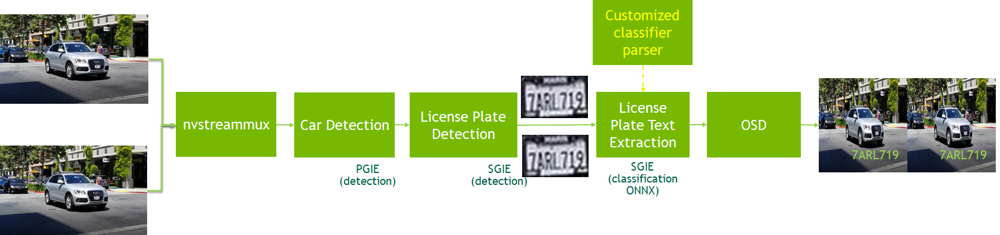

# 车牌识别应用搭建

## 内容说明
本示例旨在展示如何在 DeepStream SDK 版本不低于 5.0.1 的情况下使用分级模型进行检测和分类。 本例中的模型均为TAO3.0模型。

`PGIE(car detection) -> SGIE(car license plate detection) -> SGIE(car license plate recognization)`




该流程基于以下三个 TAO 模型:

* 车辆检测模型: https://ngc.nvidia.com/catalog/models/nvidia:tao:trafficcamnet
* 车牌检测模型(lpd): https://ngc.nvidia.com/catalog/models/nvidia:tao:lpdnet
* 车牌识别模型(lpr): https://ngc.nvidia.com/catalog/models/nvidia:tao:lprnet

TAO 3.0 LPD和LPR模型以及TAO训练的更多细节，请参考[TAO文档](https://docs.nvidia.com/tao/tao-toolkit/text/overview.html)。


## 性能

下表显示了使用此示例应用程序处理 1080p 视频的端到端性能。

|Device	|Number of streams|	Batch Size|	Total FPS|
|----|----|----|----|
|Jetson Nano|	1	|1	|9.2|
|Jetson NX	|3	|3|	80.31|
|Jetson Xavier|	5|	5|	146.43|
|Jetson Orin|	5	|5|	341.65|
|T4|	14	|14	|447.15|

## 预安装

* DeepStream SDK 6.0 or above


* tao-converter

    https://catalog.ngc.nvidia.com/orgs/nvidia/teams/tao/resources/tao-converter/version.

* Triton Inference Server
  
    The LPR sample application can work as Triton client on x86 platforms.

## 下载

1. 从Github下载源码:
```bash
    // SSH
    git clone git@github.com:NVIDIA-AI-IOT/deepstream_lpr_app.git
    // or HTTPS
    git clone https://github.com/NVIDIA-AI-IOT/deepstream_lpr_app.git
```

2. 准备模型:

```bash
 cd deepstream_lpr_app/
 #美国车牌模型
 ./download_convert.sh us 0  #if DeepStream SDK 5.0.1, use ./download_convert.sh us 1
 #中国车牌模型
 ./download_convert.sh ch 0  #if DeepStream SDK 5.0.1, use ./download_convert.sh ch 1
```

## 编译运行

```bash
make
cd deepstream-lpr-app
cp dict_us.txt dict.txt #美国车牌
cp dict_ch.txt dict.txt #中国车牌

```
开始运行:
```bash
./deepstream-lpr-app <1:US car plate model|2: Chinese car plate model> \
         <1: output as h264 file| 2:fakesink 3:display output> <0:ROI disable|1:ROI enable> <infer|triton|tritongrpc> \
         <input mp4 file name> ... <input mp4 file name> <output file name>

./deepstream-lpr-app 1 1 0 infer us_car_test_video.mp4 out.mp4
```


