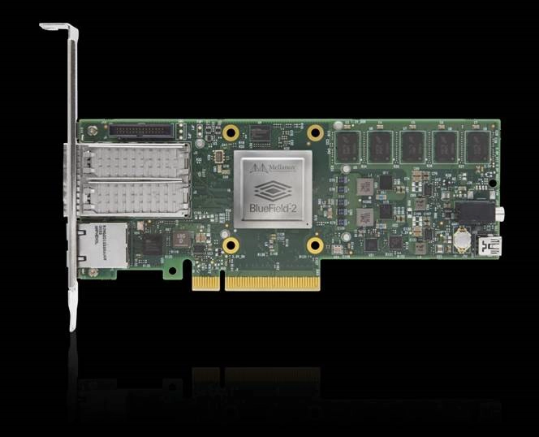
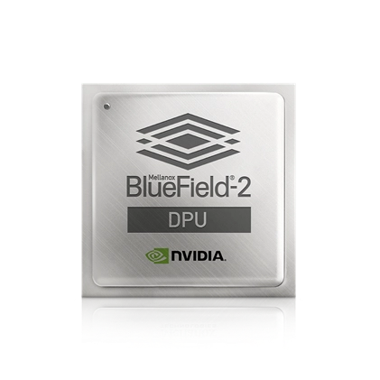

#! https://zhuanlan.zhihu.com/p/600124409
# 什么是DPU
## 什么是 DPU？

在数据中心、DPU 或数据处理单元中移动数据的专家是一种新型的可编程处理器，将与 CPU 和 GPU 一起成为计算的三大支柱之一。

当然，您可能已经熟悉中央处理器。 多年来，CPU 是大多数计算机中唯一的可编程元件，灵活且响应迅速。

最近，GPU 或图形处理单元发挥了核心作用。 最初用于提供丰富的实时图形，它们的并行处理能力使它们成为各种加速计算任务的理想选择。 得益于这些功能，GPU 对于人工智能、深度学习和大数据分析应用程序至关重要。

然而，在过去十年中，计算已经突破了 PC 和服务器的四四方方的限制——CPU 和 GPU 为庞大的新超大规模数据中心提供动力。

这些数据中心与功能强大的新型处理器结合在一起。 DPU成为以数据为中心的加速计算模型的第三个成员。

“这将代表未来计算的三大支柱之一，”NVIDIA 首席执行官黄仁勋在本月早些时候的一次谈话中表示。

“CPU 用于通用计算，GPU 用于加速计算，而在数据中心移动数据的 DPU 进行数据处理。”

## 什么是 DPU？
片上系统结合了：
* 行业标准、高性能、软件可编程多核 CPU
* 高性能网络接口
* 灵活和可编程的加速引擎

## CPU vs GPU vs DPU：是什么让 DPU 与众不同？
DPU 是结合了三个关键元素的新型可编程处理器。 DPU 是片上系统或 SoC，它结合了：

1. 行业标准、高性能、软件可编程的多核 CPU，通常基于广泛使用的 Arm 架构，与其他 SoC 组件紧密耦合。
2. 一种高性能网络接口，能够以线速或网络其余部分的速度向 GPU 和 CPU 解析、处理和高效传输数据。
3. 一组丰富的灵活和可编程的加速引擎，可以卸载和提高人工智能和机器学习、零信任安全、电信和存储等应用程序的性能。
所有这些 DPU 功能对于实现隔离的裸机云原生计算平台至关重要，该平台将定义下一代云规模计算。

## DPU 并入 SmartNIC
DPU 可用作独立的嵌入式处理器。 但它更经常被整合到 SmartNIC 中，这是一种网络接口控制器，用作下一代服务器的关键组件。

其他声称是 DPU 的设备遗漏了这三个关键功能的重要元素。

例如，一些供应商使用的专有处理器无法从广泛的 Arm CPU 生态系统丰富的开发和应用基础设施中获益。

其他人声称拥有 DPU，但却错误地只关注嵌入式 CPU 来执行数据路径处理。

## 专注于数据处理
这种方法没有竞争力，也无法扩展，因为试图通过强力性能攻击击败传统的 x86 CPU 是一场必败之战。 如果 100 Gb/sec 的数据包处理速度让 x86 崩溃，为什么嵌入式 CPU 的性能会更好？

相反，网络接口需要足够强大和灵活以处理所有网络数据路径处理。 嵌入式CPU应该是用于控制路径初始化和异常处理，仅此而已。

网络数据路径加速引擎至少需要提供 10 项功能：

* 数据包解析、匹配和操作以实现开放式虚拟交换机 (OVS)
* 零接触 RoCE 的 RDMA 数据传输加速
* GPUDirect 加速器绕过 CPU 并将网络数据直接馈送到 GPU（来自存储和其他 GPU）
* TCP加速包括RSS、LRO、checksum等。
* 用于 VXLAN 和 Geneve 覆盖以及 VTEP 卸载的网络虚拟化
* 流量整形“数据包定步”加速器，支持多媒体流、内容分发网络和新的 4K/8K 视频 over IP（RiverMax for ST 2110）
* 用于电信云 RAN 的精密定时加速器，例如用于 5G 功能的 5T
* IPSEC 和 TLS 的加密加速以内联方式执行，因此所有其他加速仍在运行
* 对 SR-IOV、VirtIO 和准虚拟化的虚拟化支持
* 安全隔离：信任根、安全启动、安全固件升级以及经过身份验证的容器和应用程序生命周期管理

这些只是加速和硬件功能中的 10 种，它们对于能够回答“什么是 DPU？”这个问题至关重要。

许多所谓的 DPU 只专注于提供这些功能中的一两个。

最糟糕的尝试是卸载专有处理器中的数据路径。

虽然有利于原型制作，但由于数据中心的规模、范围和广度，这是徒劳的。

