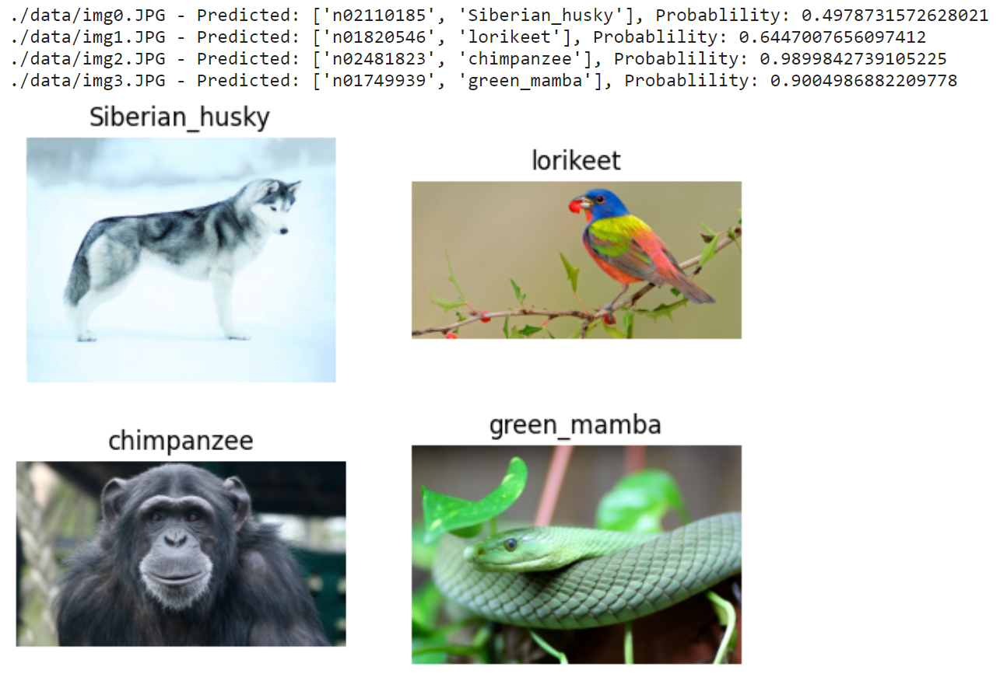

#! https://zhuanlan.zhihu.com/p/600124255
# 一行代码加速Pytorch推理速度6倍

Torch-TensorRT 是 PyTorch 的集成，它利用 NVIDIA GPU 上的 TensorRT 推理优化。 只需一行代码，它就提供了一个简单的 API，可在 NVIDIA GPU 上提供高达 6 倍的性能加速。

**话不多说, 线上代码, 再解释原理!!**

## 学习目标

本笔记本演示了在预训练的 ResNet-50 网络上使用 Torch-TensorRT 编译 TorchScript 模块并运行它以测试获得的加速的步骤。

## 内容
1. 安装
2. ResNet-50 概述
3. 在没有优化的情况下运行模型
4. 使用 Torch-TensorRT 加速
5. 结论

## 1. 安装

NVIDIA 的 NGC 提供 PyTorch Docker Container，其中包含 PyTorch 和 Torch-TensorRT。 我们可以使用 [最新的 pytorch](https://catalog.ngc.nvidia.com/orgs/nvidia/containers/pytorch)容器来运行这个notebook。


## 2. ResNet-50 概述


PyTorch 有一个名为 PyTorch Hub 的模型存储库，它是常见模型的高质量实现的来源。 我们可以从那里获得在 ImageNet 上预训练的 ResNet-50 模型。

### 模型说明

这个 ResNet-50 模型基于 [Deep Residual Learning for Image Recognition](https://arxiv.org/pdf/1512.03385.pdf) 论文，该论文将 ResNet 描述为“一种使用单一深度残差检测图像中对象的方法” 神经网络”。输入大小固定为 32x32。


## 3. 在没有优化的情况下运行模型

```python
import torch
import torchvision

torch.hub._validate_not_a_forked_repo=lambda a,b,c: True

resnet50_model = torch.hub.load('pytorch/vision:v0.10.0', 'resnet50', pretrained=True)
resnet50_model.eval()
```

加载我们的模型后，让我们继续下载一些图像！

```bash
!mkdir -p ./data
!wget  -O ./data/img0.JPG "https://d17fnq9dkz9hgj.cloudfront.net/breed-uploads/2018/08/siberian-husky-detail.jpg?bust=1535566590&width=630"
!wget  -O ./data/img1.JPG "https://www.hakaimagazine.com/wp-content/uploads/header-gulf-birds.jpg"
!wget  -O ./data/img2.JPG "https://www.artis.nl/media/filer_public_thumbnails/filer_public/00/f1/00f1b6db-fbed-4fef-9ab0-84e944ff11f8/chimpansee_amber_r_1920x1080.jpg__1920x1080_q85_subject_location-923%2C365_subsampling-2.jpg"
!wget  -O ./data/img3.JPG "https://inaturalist-open-data.s3.amazonaws.com/photos/98797/large.jpg"

!wget  -O ./data/imagenet_class_index.json "https://s3.amazonaws.com/deep-learning-models/image-models/imagenet_class_index.json"
```

所有预训练模型都期望输入图像以相同的方式归一化，
即形状为`(3 x H x W)`的 3 通道 RGB 图像，其中`H`和`W`预计至少为`224`。
图像必须加载到“[0, 1]”范围内，然后使用`mean = [0.485, 0.456, 0.406]`和`std = [0.229, 0.224, 0.225]`进行归一化
。

这是一个示例。

```python
from PIL import Image
from torchvision import transforms
import matplotlib.pyplot as plt
import json 

fig, axes = plt.subplots(nrows=2, ncols=2)

for i in range(4):
    img_path = './data/img%d.JPG'%i
    img = Image.open(img_path)
    preprocess = transforms.Compose([
        transforms.Resize(256),
        transforms.CenterCrop(224),
        transforms.ToTensor(),
        transforms.Normalize(mean=[0.485, 0.456, 0.406], std=[0.229, 0.224, 0.225]),
    ])
    input_tensor = preprocess(img)      
    plt.subplot(2,2,i+1)
    plt.imshow(img)
    plt.axis('off')

# loading labels    
with open("./data/imagenet_class_index.json") as json_file: 
    d = json.load(json_file)

```

在本教程中，我们将使用一些实用函数； `rn50_preprocess` 用于预处理输入图像，`predict` 用于使用模型进行预测，`benchmark` 用于对推理进行基准测试。 您无需了解这些函数, 通过这些实用函数即可使用 Torch TensorRT.


```python

import numpy as np
import time
import torch.backends.cudnn as cudnn
cudnn.benchmark = True

def rn50_preprocess():
    preprocess = transforms.Compose([
        transforms.Resize(256),
        transforms.CenterCrop(224),
        transforms.ToTensor(),
        transforms.Normalize(mean=[0.485, 0.456, 0.406], std=[0.229, 0.224, 0.225]),
    ])
    return preprocess

# decode the results into ([predicted class, description], probability)
def predict(img_path, model):
    img = Image.open(img_path)
    preprocess = rn50_preprocess()
    input_tensor = preprocess(img)
    input_batch = input_tensor.unsqueeze(0) # create a mini-batch as expected by the model
    
    # move the input and model to GPU for speed if available
    if torch.cuda.is_available():
        input_batch = input_batch.to('cuda')
        model.to('cuda')

    with torch.no_grad():
        output = model(input_batch)
        # Tensor of shape 1000, with confidence scores over Imagenet's 1000 classes
        sm_output = torch.nn.functional.softmax(output[0], dim=0)
        
    ind = torch.argmax(sm_output)
    return d[str(ind.item())], sm_output[ind] #([predicted class, description], probability)

def benchmark(model, input_shape=(1024, 1, 224, 224), dtype='fp32', nwarmup=50, nruns=10000):
    input_data = torch.randn(input_shape)
    input_data = input_data.to("cuda")
    if dtype=='fp16':
        input_data = input_data.half()
        
    print("Warm up ...")
    with torch.no_grad():
        for _ in range(nwarmup):
            features = model(input_data)
    torch.cuda.synchronize()
    print("Start timing ...")
    timings = []
    with torch.no_grad():
        for i in range(1, nruns+1):
            start_time = time.time()
            features = model(input_data)
            torch.cuda.synchronize()
            end_time = time.time()
            timings.append(end_time - start_time)
            if i%10==0:
                print('Iteration %d/%d, ave batch time %.2f ms'%(i, nruns, np.mean(timings)*1000))

    print("Input shape:", input_data.size())
    print("Output features size:", features.size())
    print('Average batch time: %.2f ms'%(np.mean(timings)*1000))
```

下载模型并编写 util 函数后，让我们快速查看一些预测，并在当前未优化状态下对模型进行基准测试。


```python
for i in range(4):
    img_path = './data/img%d.JPG'%i
    img = Image.open(img_path)
    
    pred, prob = predict(img_path, resnet50_model)
    print('{} - Predicted: {}, Probablility: {}'.format(img_path, pred, prob))

    plt.subplot(2,2,i+1)
    plt.imshow(img);
    plt.axis('off');
    plt.title(pred[1])
```


```python
# Model benchmark without Torch-TensorRT
model = resnet50_model.eval().to("cuda")
benchmark(model, input_shape=(128, 3, 224, 224), nruns=100)
```

```bash
Warm up ...
Start timing ...
Iteration 10/100, ave batch time 102.00 ms
Iteration 20/100, ave batch time 102.01 ms
Iteration 30/100, ave batch time 102.01 ms
Iteration 40/100, ave batch time 102.02 ms
Iteration 50/100, ave batch time 102.01 ms
Iteration 60/100, ave batch time 102.00 ms
Iteration 70/100, ave batch time 102.00 ms
Iteration 80/100, ave batch time 101.99 ms
Iteration 90/100, ave batch time 102.00 ms
Iteration 100/100, ave batch time 101.99 ms
Input shape: torch.Size([128, 3, 224, 224])
Output features size: torch.Size([128, 1000])
Average batch time: 101.99 ms
```

## 4. 利用Torch-TensorRT进行加速

继续下一步，使用 Torch TensorRT 加速。 在这些示例中，我们展示了 FP32（单精度）和 FP16（半精度）的结果。 我们不演示具体的调整，只是展示使用的简单性。 如果您想了解有关可能的自定义的更多信息，请访问我们的[文档](https://nvidia.github.io/Torch-TensorRT/)。

### FP32 (single precision)

```python
import torch_tensorrt

# The compiled module will have precision as specified by "op_precision".
# Here, it will have FP32 precision.
trt_model_fp32 = torch_tensorrt.compile(model, inputs = [torch_tensorrt.Input((128, 3, 224, 224), dtype=torch.float32)],
    enabled_precisions = torch.float32, # Run with FP32
    workspace_size = 1 << 22
)
```
继续运行**benchmark**
```python
# Obtain the average time taken by a batch of input
benchmark(trt_model_fp32, input_shape=(128, 3, 224, 224), nruns=100)
```
```bash
Warm up ...
Start timing ...
Iteration 10/100, ave batch time 70.88 ms
Iteration 20/100, ave batch time 71.09 ms
Iteration 30/100, ave batch time 71.18 ms
Iteration 40/100, ave batch time 71.27 ms
Iteration 50/100, ave batch time 71.27 ms
Iteration 60/100, ave batch time 71.26 ms
Iteration 70/100, ave batch time 71.25 ms
Iteration 80/100, ave batch time 71.32 ms
Iteration 90/100, ave batch time 71.35 ms
Iteration 100/100, ave batch time 71.36 ms
Input shape: torch.Size([128, 3, 224, 224])
Output features size: torch.Size([128, 1000])
Average batch time: 71.36 ms
```

### FP16 (half precision)

```python
import torch_tensorrt

# The compiled module will have precision as specified by "op_precision".
# Here, it will have FP16 precision.
trt_model_fp16 = torch_tensorrt.compile(model, inputs = [torch_tensorrt.Input((128, 3, 224, 224), dtype=torch.half)],
    enabled_precisions = {torch.half}, # Run with FP16
    workspace_size = 1 << 22
)
```
继续运行**benchmark**
```python
# Obtain the average time taken by a batch of input
benchmark(trt_model_fp16, input_shape=(128, 3, 224, 224), dtype='fp16', nruns=100)

```

```bash
Warm up ...
Start timing ...
Iteration 10/100, ave batch time 17.40 ms
Iteration 20/100, ave batch time 17.40 ms
Iteration 30/100, ave batch time 17.60 ms
Iteration 40/100, ave batch time 17.61 ms
Iteration 50/100, ave batch time 17.57 ms
Iteration 60/100, ave batch time 17.53 ms
Iteration 70/100, ave batch time 17.61 ms
Iteration 80/100, ave batch time 17.67 ms
Iteration 90/100, ave batch time 17.72 ms
Iteration 100/100, ave batch time 17.74 ms
Input shape: torch.Size([128, 3, 224, 224])
Output features size: torch.Size([128, 1000])
Average batch time: 17.74 ms
```

**可以看到此处的平均时间是没有利用TensorRT优化的5.7倍左右**

## 5. 总结
在本教程中，我们介绍了使用 Torch-TensorRT 为 ResNet-50 模型编译 TorchScript 模型的完整过程，并测试了优化对性能的影响。 使用 Torch-TensorRT，我们在 NVIDIA V100 GPU 上观察到 FP32 的加速为 **1.42x**，FP16 的加速为 **5.4x**。 这些加速数字会因 GPU 的不同而不同（以及基于所使用的操作的不同实施），我们鼓励您尝试最新一代的数据中心计算卡以获得最大加速。

现在是时候在您自己的模型上试用 Torch-TensorRT 了。 如果遇到任何问题，可以在 https://github.com/pytorch/TensorRT 上填写。 您的参与将有助于 Torch-TensorRT 的未来发展。


## Torch-TensorRT 如何工作

`Torch-TensorRT` 作为 `TorchScript` 的扩展。 它优化并执行兼容的子图，让 PyTorch 执行剩余的图。 PyTorch 全面而灵活的功能集与 Torch-TensorRT 一起使用，解析模型并将优化应用于图的 TensorRT 兼容部分。

编译后，使用优化图就像运行一个 `TorchScript` 模块，用户可以获得更好的 TensorRT 性能。 Torch-TensorRT 编译器的架构由兼容子图的三个阶段组成：

* 简化 TorchScript 模块
* 转换
* 执行

### 简化 TorchScript 模块

在第一阶段，`Torch-TensorRT` 简化了 `TorchScript` 模块，将常见操作的实现简化为更直接映射到 TensorRT 的表示。 需要注意的是，这种简化通道不会影响图形本身的功能。


### 转换

在转换阶段，Torch-TensorRT 会自动识别与 TensorRT 兼容的子图，并将其转换为 TensorRT 操作：

* 具有静态值的节点被评估并映射到常量。
* 描述张量计算的节点被转换为一个或多个 TensorRT 层。
* 其余节点保留在 TorchScripting 中，形成一个混合图，作为标准 TorchScript 模块返回。


修改后的模块会通过嵌入的 TensorRT 引擎返回给您，这意味着整个模型（PyTorch 代码、模型权重和 TensorRT 引擎）可以在单个包中进行移植。


### 执行
当您执行已编译的模块时，Torch-TensorRT 会实时设置引擎并准备好执行。 当您执行这个修改后的 TorchScript 模块时，TorchScript 解释器会调用 TensorRT 引擎并传递所有输入。 引擎运行并将结果推送回解释器，就好像它是一个普通的 `TorchScript` 模块一样。


