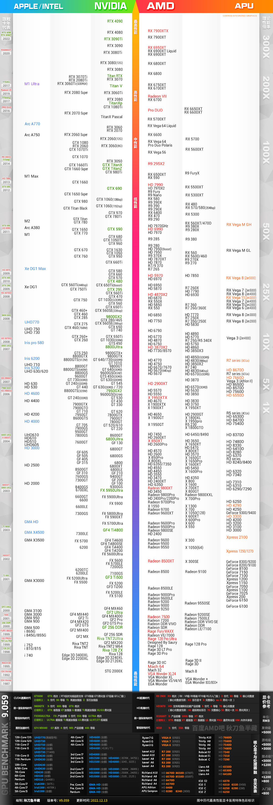

# 2023英伟达显卡排名天梯图

**注意**

这里没有更新4070Ti, 它的性能应该在3090和3090ti之间

## Kelvin
* Kelvin 于 2001 年发布，是 Nvidia 千年以来第一个新的 GPU 微架构。最初的 Xbox 游戏机使用带有 Kelvin 微架构的 NV2A GPU。 GeForce 3 和 GeForce 4 系列 GPU 是采用这种微架构发布的。

## Rankine
* Rankine 是 2003 年发布的 Kelvin 的后续产品，用于 GeForce 5 系列的 Nvidia GPU。 Rankine 支持顶点和片段程序，并将 VRAM 大小增加到 256MB。

## Curie
* Curie——GeForce 6 和 7 系列 GPU 使用的微架构——于 2004 年作为 Rankine 的继任者发布。Curie 将 VRAM 数量翻了一番，达到 512MB，并且是第一代支持 PureVideo 视频解码的 Nvidia GPU。

## Tesla
* Tesla GPU 微架构于 2006 年作为居里的继任者发布，为 Nvidia 的 GPU 产品线引入了几项重要变化。除了作为 GeForce 8、9、100、200 和 300 系列 GPU 使用的架构之外，Tesla 还被用于图形处理之外的用例的 Quadro 系列 GPU 使用。

## Fermi
* 特斯拉的继任者费米于 2010 年发布。费米推出了多项增强功能

## Kepler
* Kepler GPU 微架构作为 Fermi 2012 的继任者发布。

## Maxwell
* 2014 年发布的麦克斯韦是费米的继任者。

## Pascal

* Pascal 在 2016 年接替 Maxwell。这个 Nvidia GPU 微架构提供了对 Maxwell 的改进

## Volta
* Volta 是 2017 年发布的一个有点独特的微架构迭代。虽然以前的大多数微架构都用于消费类 GPU，但 Volta GPU 的营销目的是严格用于专业应用程序。 Volta 也是第一个使用张量核心的微架构。

## Turing
* Turing 于 2018 年发布，除了支持 Tensor Cores 之外，还包括许多以消费者为中心的 GPU。 Turing 是 Nvidia 广受欢迎的 Quadro RTX 和 

## Ampere
* Ampere 微架构刚刚开始投放市场。 Ampere 旨在进一步实现高性能计算 (HPC) 和 AI 用例。 Ampere 的增强功能包括第三代 NVLink 和 Tensor 核心、结构稀疏性（将不需要的参数转换为零以启用 AI 模型训练）、第二代光线追踪核心、多实例 GPU (MIG) 以实现将 A100 GPU 逻辑分区为单个隔离和安全的 GPU 实例。

## Ada Lovelace
Ada Lovelace 架构的架构改进包括以下内容：

* CUDA 计算能力 8.9
* TSMC 4N 工艺（为 NVIDIA 定制设计）——不要与 TSMC 的常规 N4 节点混淆
* 具有 FP8、FP16、bfloat16、TensorFloat-32 (TF32) 和稀疏加速的第 4 代 Tensor Cores
* 第三代光线追踪核心，以及并发光线追踪和着色与计算
* 着色器执行重新排序 (SER)
* 具有 8K 10 位 60FPS AV1 固定功能硬件编码的 Nvidia 视频编码器/解码器 (NVENC/NVDEC)

