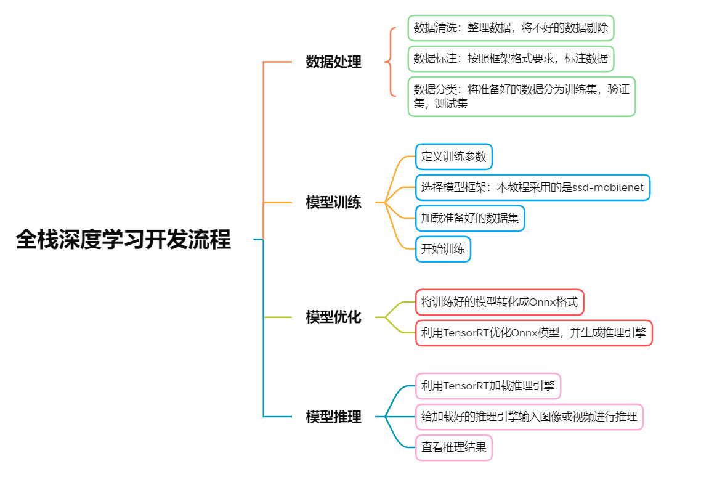
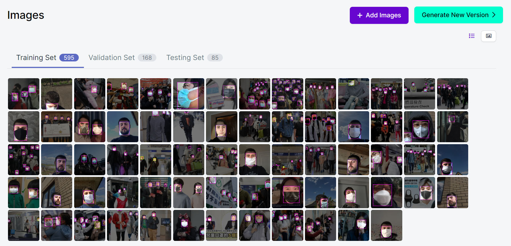

# 人脸口罩检测(含运行代码+数据集)

* **本教程目的为让开发者了解深度学习中的完整流程，这包括：**  
    1.数据集导入及预处理流程  
    2.网络模型选择及参数设置流程  
    3.模型训练及导出流程  
    4.模型加载/优化并得出推断结果  

项目源码以及数据集下载:
https://download.csdn.net/download/kunhe0512/85360655


<center></center>

* **本教程采用了以下主要的软硬件环境：**  
    1.NVIDIA Xavier NX  
    2.Jetpack 4.6  
    3.TensorRT 8.0.1  
    4.Pytorch 1.10.0  
    5.Python 3.6.9  
    6.Opencv 4.1.1  
    
* **实验内容：**  
    * 本教程的实验内容是利用深度学习的方法，完成口罩检测的任务。
    * 检测目标类别为：Background，face，mask，mask_weared_incorrect
    * 在实验过程中，采用了OpenImages CVS格式的数据集和SSD-mobilenet的模型。
    * 本实验利用Pytorch进行模型训练，将训练好的模型转化为ONNX格式，最后利用TensorRT进行推理
    * 您可以访问https://app.roboflow.com/ds/EEnqhVHyLu?key=EvtTcERf4B 来下载训练数据集（如果您需要）  
    * 更多精彩内容，请扫描下方二维码或者访问https://developer.nvidia.com/zh-cn/developer-program 来加入NVIDIA开发者计划  

<center></center>


# 开始实验  
## 1.导入需要的工具库

```Python
#1
import os
import sys
sys.executable
import logging
import argparse
import itertools
import torch

from torch.utils.data import DataLoader, ConcatDataset
from torch.optim.lr_scheduler import CosineAnnealingLR, MultiStepLR

from vision.utils.misc import str2bool, Timer, freeze_net_layers, store_labels
from vision.ssd.ssd import MatchPrior
from vision.ssd.vgg_ssd import create_vgg_ssd
from vision.ssd.mobilenetv1_ssd import create_mobilenetv1_ssd
from vision.ssd.mobilenetv1_ssd_lite import create_mobilenetv1_ssd_lite
from vision.ssd.mobilenet_v2_ssd_lite import create_mobilenetv2_ssd_lite
from vision.ssd.squeezenet_ssd_lite import create_squeezenet_ssd_lite
from vision.datasets.voc_dataset import VOCDataset
from vision.datasets.open_images import OpenImagesDataset
from vision.nn.multibox_loss import MultiboxLoss
from vision.ssd.config import vgg_ssd_config
from vision.ssd.config import mobilenetv1_ssd_config
from vision.ssd.config import squeezenet_ssd_config
from vision.ssd.data_preprocessing import TrainAugmentation, TestTransform
```

## 2.使用GPU完成训练

```Python
#2
DEVICE = torch.device("cuda:0")
torch.backends.cudnn.benchmark = True
```

## 3.设定训练方法
```C++
#3
def train(loader, net, criterion, optimizer, device, debug_steps=100, epoch=-1):
    net.train(True)
    running_loss = 0.0
    running_regression_loss = 0.0
    running_classification_loss = 0.0
    for i, data in enumerate(loader):
        images, boxes, labels = data
        images = images.to(device)
        boxes = boxes.to(device)
        labels = labels.to(device)

        optimizer.zero_grad()
        confidence, locations = net(images)
        regression_loss, classification_loss = criterion(confidence, locations, labels, boxes)  # TODO CHANGE BOXES
        loss = regression_loss + classification_loss
        loss.backward()
        optimizer.step()

        running_loss += loss.item()
        running_regression_loss += regression_loss.item()
        running_classification_loss += classification_loss.item()
        if i and i % debug_steps == 0:
            avg_loss = running_loss / debug_steps
            avg_reg_loss = running_regression_loss / debug_steps
            avg_clf_loss = running_classification_loss / debug_steps
            print(
                f"Epoch: {epoch}, Step: {i}/{len(loader)}, " +
                f"Avg Loss: {avg_loss:.4f}, " +
                f"Avg Regression Loss {avg_reg_loss:.4f}, " +
                f"Avg Classification Loss: {avg_clf_loss:.4f}"
            )
            running_loss = 0.0
            running_regression_loss = 0.0
            running_classification_loss = 0.0
```

## 4.设定测试方法

```C++
#4
def test(loader, net, criterion, device):
    net.eval()
    running_loss = 0.0
    running_regression_loss = 0.0
    running_classification_loss = 0.0
    num = 0
    for _, data in enumerate(loader):
        images, boxes, labels = data
        images = images.to(device)
        boxes = boxes.to(device)
        labels = labels.to(device)
        num += 1

        with torch.no_grad():
            confidence, locations = net(images)
            regression_loss, classification_loss = criterion(confidence, locations, labels, boxes)
            loss = regression_loss + classification_loss

        running_loss += loss.item()
        running_regression_loss += regression_loss.item()
        running_classification_loss += classification_loss.item()
    return running_loss / num, running_regression_loss / num, running_classification_loss / num
```

## 5.设定训练参数

```Python
#5
net_name = "mb1-ssd"
datasets = []
datasets_path = ["data/mask"]
model_dir = "models/mask/" 
voc_or_open_images = "open_images"
batch_size = 4
num_epochs = 6
validation_epochs = 2
num_workers = 2
lr = 0.01
base_net_lr = 0.001
extra_layers_lr = 0.01
momentum=0.9
weight_decay=5e-4
```

## 6.加载数据集

```Python
#6
timer = Timer()
create_net = create_mobilenetv1_ssd
config = mobilenetv1_ssd_config

        
# create data transforms for train/test/val
train_transform = TrainAugmentation(config.image_size, config.image_mean, config.image_std)
target_transform = MatchPrior(config.priors, config.center_variance,
                                  config.size_variance, 0.5)

test_transform = TestTransform(config.image_size, config.image_mean, config.image_std)

# load datasets (could be multiple)
print("Prepare training datasets.")
for dataset_path in datasets_path:
    if voc_or_open_images == 'voc':
        dataset = VOCDataset(dataset_path, transform=train_transform,target_transform=target_transform)
        label_file = os.path.join(model_dir, "labels.txt")
        store_labels(label_file, dataset.class_names)
        num_classes = len(dataset.class_names)
    elif voc_or_open_images == 'open_images':
        dataset = OpenImagesDataset(dataset_path,transform=train_transform, target_transform=target_transform,dataset_type="train", balance_data=False)
        label_file = os.path.join(model_dir, "labels.txt")
        store_labels(label_file, dataset.class_names)
        print(dataset)
        num_classes = len(dataset.class_names)

    else:
        raise ValueError(f"Dataset type is not supported.")
    datasets.append(dataset)
```

## 7.将加载好的数据集分割为训练集和验证集

```Python
#7
# create training dataset
print(f"Stored labels into file {label_file}.")
train_dataset = ConcatDataset(datasets)
print("Train dataset size: {}".format(len(train_dataset)))
train_loader = DataLoader(train_dataset, batch_size,num_workers=num_workers,shuffle=True)
                           
# create validation dataset                           
print("Prepare Validation datasets.")
if voc_or_open_images == "voc":
    val_dataset = VOCDataset(dataset_path, transform=test_transform,target_transform=target_transform, is_test=True)
elif voc_or_open_images == 'open_images':
    val_dataset = OpenImagesDataset(dataset_path,transform=test_transform, target_transform=target_transform,dataset_type="test")
    print(val_dataset)
print("Validation dataset size: {}".format(len(val_dataset)))

val_loader = DataLoader(val_dataset, batch_size,num_workers = num_workers,shuffle=False)
```

## 8.创建网络模型

```C++
#8
# create the network
print("Build network.")
net = create_net(num_classes)
min_loss = -10000.0
last_epoch = -1

params = [
    {'params': net.base_net.parameters(), 'lr': base_net_lr},
    {'params': itertools.chain(
        net.source_layer_add_ons.parameters(),
        net.extras.parameters()
    ), 'lr': extra_layers_lr},
    {'params': itertools.chain(
        net.regression_headers.parameters(),
        net.classification_headers.parameters()
    )}
]
```

## 9.定义是否使用预训练模型或者
   * **我们这里设计了三种模式:**    
       **1.重头开始训练，只需将你的模型路径赋值给base_net： base_net = "path/to/the/basic/model"**   
       **2.使用之前训练一半中间断开没训练完的模型继续训练，只需将模型路径赋值给resume：resume = "path/to/the/resume/model"**   
       **3.利用我们已经准好的预训练模型，只需将模型路径赋值给pretrained_ssd: pretrained_ssd = "path/to/the/pretrained_ssd/model"**    
   * **如果不太明白想选择什么模型，可以将resume，base_net和pretrained_ssd都赋值None，将会自动从头开始训练**

```Python
#9
# load a previous model checkpoint (if requested)
timer.start("Load Model")
resume=None
base_net = None
pretrained_ssd = "models/face-mask-pretrain-model.pth"
if resume:
    print(f"Resume from the model {resume}")
    net.load(resume)
elif base_net:
    print(f"Init from base net {base_net}")
    net.init_from_base_net(base_net)
elif pretrained_ssd:
    print(f"Init from pretrained ssd {pretrained_ssd}")
    net.init_from_pretrained_ssd(pretrained_ssd)
print(f'Took {timer.end("Load Model"):.2f} seconds to load the model.')
```

## 10.开始训练模型

```Python
#10
# move the model to GPU
net.to(DEVICE)

# define loss function and optimizer
criterion = MultiboxLoss(config.priors, iou_threshold=0.5, neg_pos_ratio=3,center_variance=0.1, size_variance=0.2, device=DEVICE)
optimizer = torch.optim.SGD(params, lr=lr, momentum=0.9, weight_decay=weight_decay)
print(f"Learning rate: {lr}, Base net learning rate: {base_net_lr}, "+ f"Extra Layers learning rate: {extra_layers_lr}.")

# set learning rate policy
print("Uses CosineAnnealingLR scheduler.")
scheduler = CosineAnnealingLR(optimizer, 100, last_epoch=last_epoch)


# train for the desired number of epochs
print(f"Start training from epoch {last_epoch + 1}.")
    
for epoch in range(last_epoch + 1, num_epochs):
    scheduler.step()
    train(train_loader, net, criterion, optimizer,device=DEVICE, debug_steps=10, epoch=epoch)
        
    if epoch % validation_epochs == 0 or epoch == num_epochs - 1:
        val_loss, val_regression_loss, val_classification_loss = test(val_loader, net, criterion, DEVICE)
        print(
            f"Epoch: {epoch}, " +
            f"Validation Loss: {val_loss:.4f}, " +
            f"Validation Regression Loss {val_regression_loss:.4f}, " +
            f"Validation Classification Loss: {val_classification_loss:.4f}"
        )
        model_path = os.path.join(model_dir, f"{net_name}-Epoch-{epoch}-Loss-{val_loss}.pth")
        net.save(model_path)
        print(f"Saved model {model_path}")

print("Task done, exiting program.")
    
```

## 11.将训练好的模型转化成ONNX格式

```Python
#11
!python3 onnx_export.py --model-dir=models/mask
```

## 12.将转化好的ONNX格式利用TensorRT进行优化，生成TensorRT推理引擎

这里注意,需要安装Onnx2TensorRT

https://github.com/onnx/onnx-tensorrt

```Python
#12
!onnx2trt models/mask/ssd-mobilenet.onnx -o models/TRT_ssd_mobilenet_v1_face2.bin
```

## 13.加载引擎推理时所需要的工具库

```Python
#13
import sys
import time
import argparse
import cv2
import pycuda.autoinit 
import numpy as np
from utils.ssd_classes import get_cls_dict
from utils.camera import add_camera_args, Camera
from utils.display import open_window, set_display, show_fps
from utils.visualization import BBoxVisualization
import ctypes
import tensorrt as trt
import pycuda.driver as cuda
```

## 14.设计引擎输入输出的预处理方法和后处理方法
```C++
#14
def do_nms(det, boxes, confs, clss):
    drop = False
    if len(boxes) <= 0:
        boxes.append((det[0],det[1],det[2],det[3]))
        confs.append(det[4])
        clss.append(det[5])
        return boxes, confs, clss
    for i in range(0,len(boxes)):
        bbox = boxes[i]
        xx1 = np.maximum(det[0], bbox[0])
        yy1 = np.maximum(det[1], bbox[1])
        xx2 = np.minimum(det[2], bbox[2])
        yy2 = np.minimum(det[3], bbox[3])
        
        w = np.maximum(0.0, xx2-xx1+1)
        h = np.maximum(0.0, yy2-yy1+1)
        area_det = (det[2]-det[0]+1)*(det[3]-det[1]+1)
        area_bbox = (bbox[2]-bbox[0]+1)*(bbox[3]-bbox[1]+1)
        inter = w*h
        ovr = inter / (area_det + area_bbox - inter)
        if ovr > 0.6 and not drop:
            if det[4] > confs[i]:
                boxes[i] = ((det[0],det[1],det[2],det[3]))
                confs[i] = det[4]
                clss[i] = det[5]
            drop = True
    if not drop:
        boxes.append((det[0],det[1],det[2],det[3]))
        confs.append(det[4])
        clss.append(det[5])
    return boxes, confs, clss

def _preprocess_trt(img, shape=(300, 300)):
    """Preprocess an image before TRT SSD inferencing."""
    img = cv2.resize(img, shape)
    img = cv2.cvtColor(img, cv2.COLOR_BGR2RGB)
    img = img.transpose((2, 0, 1)).astype(np.float32)
    img *= (2.0/255.0)
    img -= 1.0
    return img


def _postprocess_trt(img, output, conf_th, output_layout):
    """Postprocess TRT SSD output."""
    img_h, img_w, _ = img.shape
    boxes, confs, clss, results = [], [], [],[]
    #print(((len(output[1]))/4+1))
    #print("len(outputs[0]): "+str(len(output[0]))+" len(outputs[1]): "+str(len(output[1])))
    for n in range(0, int((len(output[1]))/4)):
        maxScore = -1000.0000
        maxClass = 0
        for m in range(0, 4):
            score = output[0][n*4+m]
            #print(score)
            if score < conf_th:
                continue
            if m <= 0:
                continue
            if( score > maxScore):
                maxScore = score
                maxClass = m
        #if(maxClass < 0):
        #    continue
        index = int(n)
        if maxScore < conf_th:
            continue
        #print(str(output[1][n*4+0])+" "+str(output[1][n*4+1])+" "+str(output[1][n*4+2])+" "+str(output[1][n*4+3]))
        x1 = int(output[1][n*4+0] * img_w)
        y1 = int(output[1][n*4+1] * img_h)
        x2 = int(output[1][n*4+2] * img_w)
        y2 = int(output[1][n*4+3] * img_h)
        det = [x1,y1,x2,y2,maxScore,maxClass,n]
        boxes, confs, clss = do_nms(det, boxes, confs, clss)
    return boxes, confs, clss
```

## 15.定义SSD-mobilenet v1模型的推理引擎的加载  
* 当我们已经优化好了引擎的时候，我们可以将优化好的引擎以文件的形式写到硬盘上，我们称之为序列化文件（serialized file）或PLAN文件
* 我们下次想直接使用优化好的引擎的时候，我们可以通过读取硬盘上的序列化文件，并利用 <font color=#008000 size=4>deserialize_cuda_engine() </font>方法进行反序列化，生成可执行的引擎
* 利用序列化文件生成可执行引擎可以为我们节省大量的时间
* 不同平台（软件或硬件平台）上生成的引擎的序列化文件不能直接通用，相同平台（软件且硬件平台）或同一台设备上生成的引擎序列化文件可以直接用

```Python
#15
class TrtSSD(object):
    """TrtSSD class encapsulates things needed to run TRT SSD."""
    #加载自定义组建，这里如果TensorRT版本小于7.0需要额外生成flattenconcat的自定义组件库
    def _load_plugins(self):
        trt.init_libnvinfer_plugins(self.trt_logger, '')
    #加载通过Transfer Learning Toolkit生成的推理引擎
    def _load_engine(self):
        TRTbin = 'models/TRT_%s.bin' % self.model
        with open(TRTbin, 'rb') as f, trt.Runtime(self.trt_logger) as runtime:
            return runtime.deserialize_cuda_engine(f.read())
    #通过加载的引擎，生成可执行的上下文
    def _create_context(self):
        for binding in self.engine:
            size = trt.volume(self.engine.get_binding_shape(binding)) * \
                   self.engine.max_batch_size
            ##注意：这里的host_mem需要时用pagelocked memory，以免内存被释放
            host_mem = cuda.pagelocked_empty(size, np.float32)
            cuda_mem = cuda.mem_alloc(host_mem.nbytes)
            self.bindings.append(int(cuda_mem))
            if self.engine.binding_is_input(binding):
                self.host_inputs.append(host_mem)
                self.cuda_inputs.append(cuda_mem)
            else:
                self.host_outputs.append(host_mem)
                self.cuda_outputs.append(cuda_mem)
        return self.engine.create_execution_context()
    #初始化引擎
    def __init__(self, model, input_shape, output_layout=7):
        """Initialize TensorRT plugins, engine and conetxt."""
        self.model = model
        self.input_shape = input_shape
        self.output_layout = output_layout
        self.trt_logger = trt.Logger(trt.Logger.INFO)
        self._load_plugins()
        self.engine = self._load_engine()

        self.host_inputs = []
        self.cuda_inputs = []
        self.host_outputs = []
        self.cuda_outputs = []
        self.bindings = []
        self.stream = cuda.Stream()
        self.context = self._create_context()
    #释放引擎，释放GPU显存，释放CUDA流
    def __del__(self):
        """Free CUDA memories."""
        del self.stream
        del self.cuda_outputs
        del self.cuda_inputs
    #利用生成的可执行上下文执行推理
    def detect(self, img, conf_th=0.3):
        """Detect objects in the input image."""
        img_resized = _preprocess_trt(img, self.input_shape)
        np.copyto(self.host_inputs[0], img_resized.ravel())
        #将处理好的图片从CPU内存中复制到GPU显存
        cuda.memcpy_htod_async(
            self.cuda_inputs[0], self.host_inputs[0], self.stream)
        #开始执行推理任务
        self.context.execute_async(
            batch_size=1,
            bindings=self.bindings,
            stream_handle=self.stream.handle)
        #将推理结果输出从GPU显存复制到CPU内存
        cuda.memcpy_dtoh_async(
            self.host_outputs[1], self.cuda_outputs[1], self.stream)
        cuda.memcpy_dtoh_async(
            self.host_outputs[0], self.cuda_outputs[0], self.stream)
        self.stream.synchronize()


        output = self.host_outputs
        #print("len(outputs[0]): "+str(len(self.host_outputs[0]))+" len(outputs[1]): "+str(len(self.host_outputs[1])))
        #for x in self.host_outputs[0]:
        #    print(str(x),end=' ')
        #for x in self.host_outputs[1]:
        #    print(str(x),end=' ')
        return _postprocess_trt(img, output, conf_th, self.output_layout)
```

## 16.设置模型库  
* 1.这里定义了多个模型库，我们选用的是人脸口罩检测，也就是最后一个**ssd_mobilenet_v1_face2**
* 2.这里还定义了我们模型的输入（300,300）

```Python
#16
INPUT_HW = (300, 300)
SUPPORTED_MODELS = [
    'ssd_mobilenet_v1_coco',
    'ssd_mobilenet_v1_egohands',
    'ssd_mobilenet_v2_coco',
    'ssd_mobilenet_v2_egohands',
    'ssd_mobilenet_v2_face',
    'ssd_resnet18_5th',
    'ssd_mobilenet_v1_face2',
    'ssd_mobilenet_v1_fruit'
]
```
## 17.开始定义方法来读取数据并将输出可视化的画到图像上
* detect_one()方法是检测单张图片，detect_video()方法是检测视频
* 注意：这里打印的fps值是包括将图像写到结果视频中的时间，如果取消将视频写到结果视频的功能，速度会有大幅度提升
```Python
#17-1
def detect_video(video, trt_ssd, conf_th, vis,result_file_name):
    full_scrn = False
    fps = 0.0
    tic = time.time()
    frame_width = int(video.get(cv2.CAP_PROP_FRAME_WIDTH))
    frame_height = int(video.get(cv2.CAP_PROP_FRAME_HEIGHT))
    fps = video.get(cv2.CAP_PROP_FPS)
    #print(str(frame_width)+str(frame_height))
    ##定义输入编码
    fourcc = cv2.VideoWriter_fourcc('M', 'P', '4', 'V')
    videoWriter = cv2.VideoWriter('result.AVI', fourcc, fps, (frame_width,frame_height))
    ##开始循环检测，并将结果写到result.mp4中
    while True:
        ret,img = video.read()
        if img is not None:
            boxes, confs, clss = trt_ssd.detect(img, conf_th)
            #print("boxes,confs,clss: "+ str(boxes)+" "+ str(confs)+" "+str(clss))
            img = vis.draw_bboxes(img, boxes, confs, clss)
            videoWriter.write(img)
            toc = time.time()
            curr_fps = 1.0 / (toc - tic)
            fps = curr_fps if fps == 0.0 else (fps*0.95 + curr_fps*0.05)
            tic = toc
            print("\rfps: "+str(fps),end="")
        else:
            break

#17-2
def detect_one(img, trt_ssd, conf_th, vis):
    full_scrn = False
    tic = time.clock()
    ##开始检测，并将结果写到result.jpg中
    boxes, confs, clss = trt_ssd.detect(img, conf_th)
    toc = time.clock()
    curr_fps = (toc - tic)
    #print("boxes: "+str(boxes))
    #print("clss: "+str(clss))
    #print("confs: "+str(confs))
    img = vis.draw_bboxes(img, boxes, confs, clss)
    cv2.imwrite("result.jpg",img)        
    print("time: "+str(curr_fps)+"(sec)")
```
## 18.定义main()函数，检测单张图片**
* 您可以自行上传图像到当前文件夹，并将filename请改成您要测试的图片的名字
* face指的是没有戴口罩的人脸，face_mask指的是带了口罩的人脸，mask_weared_incorrect指的是带了口罩但是带的不规范的人脸


```Python
#18-1
def main_one():    
    filename = "mask.jpg"
    result_file_name = str(filename)
    img = cv2.imread(filename)
    cls_dict = get_cls_dict("ssd_mobilenet_v1_face2".split('_')[-1])
    model_name ="ssd_mobilenet_v1_face2"
    trt_ssd = TrtSSD(model_name, INPUT_HW)
    vis = BBoxVisualization(cls_dict)
    print("start detection!")
    detect_one(img, trt_ssd, conf_th=0.5, vis=vis)
    cv2.destroyAllWindows()
    print("finish!")
```
```Python
#18-2
from IPython.display import Image
main_one()
Image("result.jpg")
```

## 19.定义main()函数，检测视频
* 您可以自行上传视频到当前文件夹，并将filename请改成您要测试的视频的名字
* 检测视频部分由于要将检测的结果写到硬盘上，所以时间会加倍，如果要得到和单张检测相似的数据，可以将读写的语句注释掉
* face指的是没有戴口罩的人脸，face_mask指的是带了口罩的人脸，mask_weared_incorrect指的是带了口罩但是带的不规范的人脸）

```Python
#19-1
def main_loop():   
    filename = "face_mask_test_video.mp4"
    result_file_name = str(filename)
    video = cv2.VideoCapture(filename)
    cls_dict = get_cls_dict("ssd_mobilenet_v1_face2".split('_')[-1])
    model_name ="ssd_mobilenet_v1_face2"
    trt_ssd = TrtSSD(model_name, INPUT_HW)
    vis = BBoxVisualization(cls_dict)
    print("start detection!")
    detect_video(video, trt_ssd, conf_th=0.8, vis=vis, result_file_name=result_file_name)
    video.release()
    cv2.destroyAllWindows()
    print("\nfinish!")
```
```Python
#19-2
main_loop()
```
## 20.将生成的视频转码，以便能够在Jupyter Notebook中查看
* 这里采用的是利用GPU加速的转码技术，将输出的视频转换到MP4格式，比单纯使用CPU进行转码的速度有大幅度提升

```C++
#20
!rm result-ffmpeg4.mp4
!ffmpeg -i result.AVI -vcodec libx264 -f mp4 result-ffmpeg4.mp4 
```
## 21.查看结果视频
```C++
#21
from IPython.display import Video

Video("result-ffmpeg4.mp4")
```


