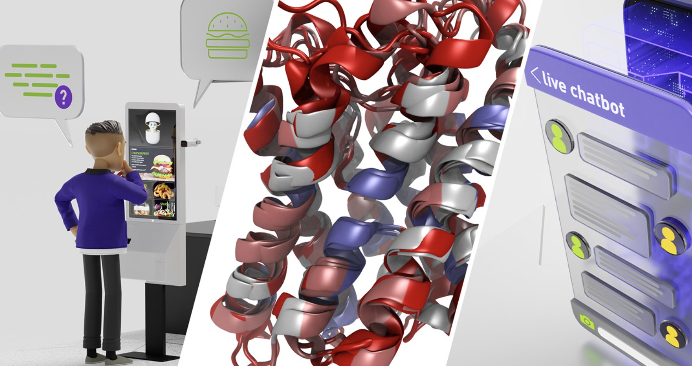

# 大型语言模型有什么用？
大型语言模型识别、总结、翻译、预测、生成文本和其他内容。

AI 应用程序正在总结文章、撰写故事和进行长时间对话——而大型语言模型正在承担繁重的工作。

大型语言模型或 LLM 是一种深度学习算法，可以根据从海量数据集中获得的知识来识别、总结、翻译、预测和生成文本和其他内容。

大型语言模型是 Transformer 模型最成功的应用之一。 它们不仅用于教授 AI 人类语言，还用于理解蛋白质、编写软件代码等等。

除了加速自然语言处理应用程序——如翻译、聊天机器人和人工智能助手——大型语言模型还用于医疗保健、软件开发和许多其他领域的用例。

## 大型语言模型有什么用？
语言不仅仅用于人类交流。

代码是计算机的语言。 蛋白质和分子序列是生物学的语言。 大型语言模型可以应用于需要不同类型通信的语言或场景。

这些模型拓宽了 AI 在各行各业和企业中的应用范围，并有望引发新一轮的研究、创造力和生产力浪潮，因为它们可以帮助为世界上最棘手的问题生成复杂的解决方案。

例如，使用大型语言模型的人工智能系统可以从分子和蛋白质结构数据库中学习，然后利用这些知识提供可行的化合物，帮助科学家开发突破性的疫苗或治疗方法。

大型语言模型还有助于创建重新构想的搜索引擎、辅导聊天机器人、歌曲、诗歌、故事和营销材料等的创作工具。

## 大型语言模型如何工作？
大型语言模型从大量数据中学习。 顾名思义，LLM 的核心是它所训练的数据集的大小。 但随着人工智能的发展，“大”的定义也在不断扩大。

现在，大型语言模型通常是在足够大的数据集上训练的，这些数据集几乎可以包含很长一段时间内在互联网上编写的所有内容。

如此大量的文本被输入到使用无监督学习的 AI 算法中——当一个模型被赋予一个数据集而没有关于如何处理它的明确指示时。 通过这种方法，大型语言模型可以学习单词，以及它们之间的关系和背后的概念。 例如，它可以根据上下文学习区分“bark”一词的两种含义。

正如掌握一门语言的人可以猜测句子或段落中接下来会出现什么——甚至自己想出新词或概念——大型语言模型可以应用其知识来预测和生成内容。

大型语言模型也可以针对特定用例进行定制，包括通过微调或提示调整等技术，这是为模型提供少量数据以供关注的过程，以针对特定应用对其进行训练。

由于其在并行处理序列方面的计算效率，transformer 模型架构是最大和最强大的 LLM 背后的构建块。

## 大型语言模型的热门应用
大型语言模型正在开启搜索引擎、自然语言处理、医疗保健、机器人技术和代码生成等领域的新可能性。

流行的 ChatGPT AI 聊天机器人是大型语言模型的一种应用。 它可以用于无数的自然语言处理任务。

LLM 几乎无限的应用还包括：

* 零售商和其他服务提供商可以使用大型语言模型，通过动态聊天机器人、人工智能助手等提供更好的客户体验。
* 搜索引擎可以使用大型语言模型来提供更直接、更像人类的答案。
* 生命科学研究人员可以训练大型语言模型来理解蛋白质、分子、DNA 和 RNA。
* 开发人员可以使用大型语言模型编写软件并教机器人完成物理任务。
* 营销人员可以训练一个大型语言模型来将客户反馈和请求组织成集群，或者根据产品描述将产品分类。
* 财务顾问可以使用大型语言模型总结收益电话会议并创建重要会议的文字记录。 信用卡公司可以使用 LLM 进行异常检测和欺诈分析以保护消费者。
* 法律团队可以使用大型语言模型来帮助进行法律释义和抄写。
在生产环境中高效运行这些大型模型需要大量资源并需要专业知识等挑战，因此企业转向 NVIDIA Triton 推理服务器，该软件可帮助标准化模型部署并在生产环境中交付快速且可扩展的 AI。

## 在哪里可以找到大型语言模型
2020 年 6 月，OpenAI 发布了 GPT-3 作为一项服务，该服务由一个 1750 亿参数的模型提供支持，该模型可以生成带有简短书面提示的文本和代码。

2021 年，NVIDIA 和微软开发了 Megatron-Turing 自然语言生成 530B，这是世界上最大的阅读理解和自然语言推理模型之一，可简化摘要和内容生成等任务。

HuggingFace 去年推出了 BLOOM，这是一种开放的大型语言模型，能够以 46 种自然语言和十几种编程语言生成文本。

另一个 LLM，Codex，将文本转换为软件工程师和其他开发人员的代码。

NVIDIA 提供了一些工具来简化大型语言模型的构建和部署：

NVIDIA NeMo LLM 服务提供了一种快速途径，可以使用 NVIDIA 的托管云 API 或通过私有云和公共云自定义大型语言模型并大规模部署它们。
NVIDIA NeMo Megatron 是 NVIDIA AI 平台的一部分，是一个框架，用于简单、高效、经济高效地训练和部署大型语言模型。 NeMo Megatron 专为企业应用程序开发而设计，为自动化分布式数据处理提供端到端的工作流程； 训练大规模、定制的模型类型，包括 GPT-3 和 T5； 并部署这些模型以进行大规模推理。
NVIDIA BioNeMo 是一种特定领域的托管服务和框架，适用于蛋白质组学、小分子、DNA 和 RNA 中的大型语言模型。 它基于 NVIDIA NeMo Megatron 构建，用于在超级计算规模上训练和部署大型生物分子变压器 AI 模型。
大型语言模型的挑战
扩展和维护大型语言模型可能既困难又昂贵。

构建基础大型语言模型通常需要数月的训练时间和数百万美元。

而且由于 LLM 需要大量的训练数据，开发人员和企业会发现访问足够大的数据集是一项挑战。

由于大型语言模型的规模，部署它们需要技术专长，包括对深度学习、转换器模型和分布式软件和硬件的深刻理解。

许多技术领域的领导者正在努力推进开发和构建资源，以扩大对大型语言模型的访问，让各种规模的消费者和企业都能从中获益。

了解有关[大型语言模型](https://www.nvidia.com/en-us/deep-learning-ai/solutions/large-language-models/)的更多信息。

