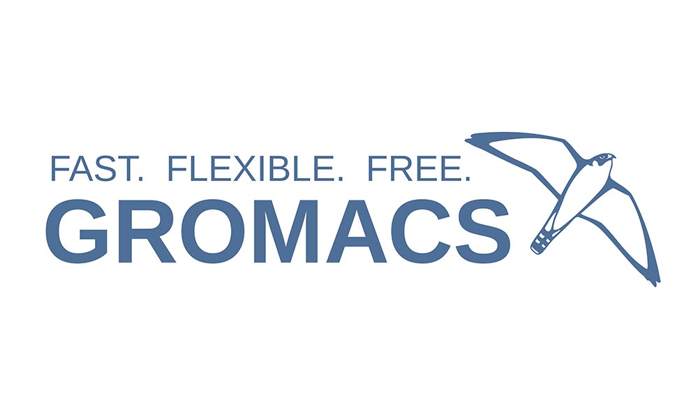
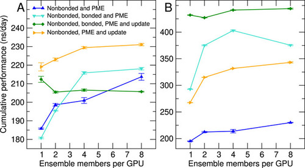
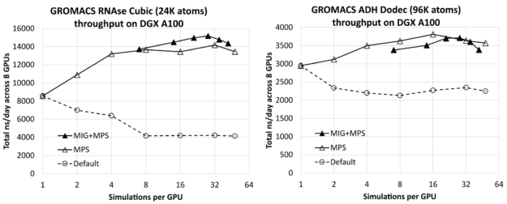

# 利用MPS和MIG实现GROMACS吞吐量最大化



GROMACS是一个生物分子系统模拟软件包，是全球使用最广泛的科学应用软件之一，是了解包括当前COVID-19大流行潜在生物过程在内的重要生物过程的关键工具。

在[这篇文章](https://developer.nvidia.com/blog/creating-faster-molecular-dynamics-simulations-with-gromacs-2020/)中，我们展示了与核心开发团队合作执行的最新优化，这些优化使 GROMACS 能够比以前在现代多 GPU 服务器上运行得更快。这些优化涉及将计算和通信都卸载到 GPU，后者对于那些可以有效地并行使用多个 GPU 进行单个模拟的相对较大的情况特别有益。有关最新异构软件引擎的并行化和内部工作的更多信息，请参阅 [GROMACS 中分子动力学模拟的异构并行化和加速](https://aip.scitation.org/doi/full/10.1063/5.0018516)。

另一个越来越常见的工作流程涉及运行许多独立的 GROMACS 模拟，其中每个模拟可能相对较小。 NVIDIA GPU 的尺寸和功能不断增加，但通常情况下，相对较小的模拟系统的孤立单轨迹模拟无法充分利用每个 GPU 上的所有可用计算资源。

但多轨迹工作流程可能涉及数万到数千个松散耦合的分子动力学模拟。在此类工作负载中，目标通常不是最小化单个模拟的求解时间，而是最大化整个集成的吞吐量。

每个 GPU 并行运行多个模拟可以显着提高整体吞吐量，正如之前 [GROMACS 在异构并行化和 GROMACS 中分子动力学模拟的加速](https://aip.scitation.org/doi/full/10.1063/5.0018516)中所展示的那样（下图）。已创建 NVIDIA 多进程服务器 (MPS) 和多实例 GPU (MIG) 功能以促进此类工作流程，通过使每个 GPU 能够同时用于多个任务来进一步提高效率。



在这篇文章中，我们展示了为 GROMACS 在每个 GPU 上运行多个模拟的好处。我们展示了如何利用 MPS（包括与 MIG 结合使用）在每个 GPU 上并行运行多个模拟，从而将吞吐量提高 1.8 倍。

## 背景知识

### 硬件
对于本文后面给出的结果，我们在 DGX A100 服务器上运行，它是 NVIDIA 内部 Selene 超级计算机的一部分，它具有八个 A100-SXM4-80GB GPU 和两个 AMD EPYC 7742 64 核 CPU 插槽。

### GROMACS 测试用例
为了生成下一节中给出的结果，我们使用了 24K 原子 RNAse 立方和 96K 原子 ADH dodec 测试用例，它们都使用 PME 进行远程静电。有关更多信息和输入文件，请参阅 [GROMACS 中分子动力学模拟的异构并行化和加速的补充信息](https://zenodo.org/record/3893789)。

我们使用 GROMACS 版本 2021.2（带有 CUDA 版本 11.2，驱动程序版本 470.57.02）。对于单个隔离实例（在单个 [A100-SXM4-80GB GPU](https://www.nvidia.com/content/dam/en-zz/Solutions/Data-Center/a100/pdf/a100-80gb-datasheet-update-nvidia-us-1521051-r2-web.pdf) 上），使用稍后描述的相同 GROMACS 选项，我们实现了 1,083 ns/天的 RNAse 和 378 ns/天的 ADH。

`-update gpu` 选项对这里的性能至关重要。这会触发“GPU 驻留步骤”，其中每个时间步的更新和约束部分与默认的“GPU 强制卸载”行为一起被卸载到 GPU。没有这个，在这个硬件上，每种情况下的性能大约会降低 2 倍。这对可用的 CPU 和 GPU 功能的平衡很敏感，因此如果在不同的硬件上运行，我们建议您尝试使用此选项。

对于本文中描述的实验，我们使用独立启动的同一模拟系统的多个实例。这是真实集成模拟的代理，当然，成员模拟和不规则通信之间可能存在细微差异，但仍以类似方式重叠。

### MPS
随着 GPU 的大小和功能不断增加，单个应用程序执行可能无法充分利用每个 GPU 的所有可用资源。 NVIDIA 多进程服务 (MPS) 是一种使从多个 CPU 进程提交的计算内核能够在同一个 GPU 上同时执行的设施。这种重叠可以潜在地实现更彻底的资源使用和更好的整体吞吐量。

使用 MPS 还可以通过更有效地重叠硬件资源利用和更好地利用基于 CPU 的并行性，来促进跨多个 GPU 的应用程序的强大扩展，如本文后面所述。

2017 年，NVIDIA Volta 架构与 NVIDIA Volta MPS 一起发布，该架构具有增强的功能，包括每个 GPU 最多增加 48 个 MPS 客户端：所有后续 V100、Quadro 和 GeForce GPU 都支持这一点。

### MIG
与 MPS 一样，[NVIDIA 多实例 GPU](https://docs.nvidia.com/datacenter/tesla/mig-user-guide/index.html) (MIG) 促进了每个 GPU 的共享，但对资源进行了严格的划分。它非常适合在多个不同用户之间共享 GPU，因为每个 MIG 实例都有一组有保证的资源并且是完全隔离的。

MIG 可在选定的 NVIDIA Ampere 架构 GPU 上使用，包括 A100，每个 GPU 最多支持七个 MIG 实例。 MIG 可以与 MPS 结合使用，多个 MPS 客户端可以在每个 MIG 实例上同时运行，每个物理 GPU 最多可以有 48 个 MPS 客户端。

虽然可以跨多个 MIG 实例运行单个应用程序实例，例如使用 MPI，但 MIG 并不打算为此用例提供任何性能改进。 MIG 的主要目标是在每个 GPU 上促进多个不同的应用程序实例。有关更多信息，请参阅[通过多实例 GPU 充分利用 NVIDIA A100 GPU](https://developer.nvidia.com/blog/getting-the-most-out-of-the-a100-gpu-with-multi-instance-gpu/)。

## 性能结果



上图显示了每个 GPU 的模拟次数对在 8-GPU DGX A100 服务器上同时运行的所有模拟的总组合吞吐量（以 ns/天为单位，越高越好）的影响，对于 RNAse（左）和 ADH（右） ）。每种情况下最左边的结果（每个 GPU 一个模拟）仅比相应的隔离单模拟结果（前面给出）乘以 8（DGX A100 服务器上的 GPU 数量）低几个百分点。这表明您可以在服务器上有效地运行多个模拟，而不会受到重大干扰。

您可以看到，通过增加每个 GPU 的模拟数量可以获得显着的改进，对于相对较小的 RNAse 情况，提高到 1.8 倍，对于较大的 ADH 情况提高到 1.3 倍。

对于每个测试用例，我们都包含了没有和使用 MIG 的结果，每个 GPU 最多使用七个 MIG 分区。在这种情况下，MPS 用于在每个 GPU 上运行多个进程，每个物理 GPU 最多 48 个 MPS 客户端，其中 MIG 案例中的最大客户端总数为 42：七个 MIG 分区中的每个分区有六个 MPS 客户端。作为参考，我们还包括了没有 MPS 或 MIG 的默认结果，我们认为每个 GPU 运行多个模拟没有任何好处。

对于每个测试用例，最左边的 MIG+MPS 结果是每个 GPU 进行 7 次模拟：每个 MIG 客户端进行一次模拟（即，没有 MPS）。我们发现这些“纯 MIG”性能结果与相应的“纯 MPS”结果相比没有优势。对于 RNAse，Pure-MIG 与 pure-MPS 相似，而对于 ADH，Pure-MIG 低于 pure-MPS。然而，将 MIG 与 MPS 相结合会导致 RNAse 的最佳整体结果，比最好的纯 MPS 结果高出约 7%。它导致的性能与 ADH 的纯 MPS 相当，但略低于纯 MPS。

对于 RNAse，最佳性能配置是每个 MIG 四个 MPS 客户端，即每个 GPU 总共 28 个模拟。对于 ADH，性能最佳的配置是每个 GPU 使用纯 MPS 进行 16 次模拟，没有 MIG。

当 MIG 处于活动状态时，它会强制将每个模拟隔离到 GPU 硬件的特定分区，这取决于测试用例关键路径的特定数据访问模式，这可能是有利的。另一方面，在没有 MIG 的情况下，每个模拟都可以以更动态的方式跨 GPU 访问资源，这也是有利的。

正如我们之前讨论的，MIG 的好处可能取决于测试用例。令人欣慰的是，无论是否使用 MIG，MPS 都有效，尤其是在某些用例中，由于其他原因需要 MIG，例如在用户之间共享 GPU。

GROMACS 是异构的，并且在将哪些计算卸载到 GPU 方面具有灵活性，其中 CPU 可以同时使用。我们的运行使用默认选项进行力计算，将非粘合力和 PME 力计算映射到 GPU，同时使用 CPU 进行粘合力计算。这种配置通常会导致良好的资源重叠使用。

我们尝试将键合力计算卸载到 GPU（使用 `-bonded gpu` 选项），所有情况下性能相似但略低。如前所述，我们使用了驻留 GPU 步骤。我们尝试将更新和约束映射到 CPU，我们还观察到每个 GPU 运行多个模拟的好处。

对于较大的 ADH 情况，可实现的吞吐量大大低于将更新和约束卸载到 GPU 时的吞吐量。然而，对于较小的 RNAse 案例，尽管在每个 GPU 运行单个（或几个）模拟时吞吐量较低，但在每个 GPU 进行八个或更多模拟时，我们看到无论这部分是否卸载，吞吐量都相似。行为可能因测试用例和硬件而异，因此尝试所有可用的运行时组合始终是一个好主意。

我们还在不同硬件上重复了 RNAse 的 MPS 实验：NVIDIA A40 和 V100-SXM2 GPU，我们还发现每个 GPU 运行多个模拟以提供吞吐量改进，尽管程度低于 A100。鉴于这些 GPU 的规格相对较低，这并不奇怪。 A40 为 1.5 倍，V100-SXM2 为 1.4 倍，观察到的吞吐量改进明显低于观察到的 A100 的 1.8 倍，但仍然值得。

这些结果表明，通过使用 MPS 在每个 GPU 上运行多个进程可以实现大的吞吐量改进，并且将 MIG 与 MPS 相结合是有效的。最佳配置（包括 GROMACS 中的计算卸载选项）取决于具体情况，我们再次建议进行实验。以下部分描述了这些模拟是如何编排的。


## 运行配置细节
在本节中，我们提供了用于生成结果的脚本，并描述了其中包含的命令，作为您自己工作流程的参考或起点。

### 纯 MPS 运行
以下脚本使用 MPS 向 8-GPU DGX A100 服务器启动多个模拟。
```Bash
     1  #!/bin/bash
     2  # Demonstrator script to run multiple simulations per GPU with MPS on DGX-A100
     3  #
     4  # Alan Gray, NVIDIA
     5
     6  # Location of GROMACS binary
     7  GMX=/lustre/fsw/devtech/hpc-devtech/alang/gromacs-binaries/v2021.2_tmpi_cuda11.2/bin/gmx
     8  # Location of input file
     9  INPUT=/lustre/fsw/devtech/hpc-devtech/alang/Gromacs_input/rnase.tpr
    10
    11  NGPU=8 # Number of GPUs in server
    12  NCORE=128 # Number of CPU cores in server
    13
    14  NSIMPERGPU=16 # Number of simulations to run per GPU (with MPS)
    15
    16  # Number of threads per simulation
    17  NTHREAD=$(($NCORE/($NGPU*$NSIMPERGPU)))
    18  if [ $NTHREAD -eq 0 ]
    19  then
    20      NTHREAD=1
    21  fi
    22  export OMP_NUM_THREADS=$NTHREAD
    23
    24  # Start MPS daemon
    25  nvidia-cuda-mps-control -d
    26
    27  # Loop over number of GPUs in server
    28  for (( i=0; i<$NGPU; i++ ));
    29  do
    30      # Set a CPU NUMA specific to GPU in use with best affinity (specific to DGX-A100)
    31      case $i in
    32          0)NUMA=3;;
    33          1)NUMA=2;;
    34          2)NUMA=1;;
    35          3)NUMA=0;;
    36          4)NUMA=7;;
    37          5)NUMA=6;;
    38          6)NUMA=5;;
    39          7)NUMA=4;;
    40      esac
    41
    42      # Loop over number of simulations per GPU
    43      for (( j=0; j<$NSIMPERGPU; j++ ));
    44      do
    45          # Create a unique identifier for this simulation to use as a working directory
    46          id=gpu${i}_sim${j}
    47          rm -rf $id
    48          mkdir -p $id
    49          cd $id
    50
    51          ln -s $INPUT topol.tpr
    52
    53          # Launch GROMACS in the background on the desired resources
    54          echo "Launching simulation $j on GPU $i with $NTHREAD CPU thread(s) on NUMA region $NUMA"
    55          CUDA_VISIBLE_DEVICES=$i numactl --cpunodebind=$NUMA $GMX mdrun \
    56                              -update gpu  -nsteps 10000000 -maxh 0.2 -resethway -nstlist 100 \
    57                              > mdrun.log 2>&1 &
    58          cd ..
    59      done
    60  done
    61  echo "Waiting for simulations to complete..."
    62  wait
```
* 第 7 行和第 9 行分别指定 GROMACS 二进制文件和测试用例输入文件的位置。

* 第 11-12 行指定了服务器的固定硬件细节，它有 8 个 GPU 和 128 个 CPU 内核。
* 第 14 行指定了每个 GPU 的模拟次数，可以改变它来评估性能，就像生成上述结果一样。
* 第 17-21 行计算出应该为每个模拟分配多少 CPU 线程。
* 第 25 行启动 MPS 守护程序，它使从单独的模拟启动的内核能够在同一个 GPU 上同时执行。
* 第 28-40 行遍历服务器中的 GPU，并为每个特定的 GPU 分配一组适当的 CPU 内核（“NUMA 区域”）。此映射特定于 DGX A100 拓扑，该拓扑具有两个 AMD CPU，每个 CPU 具有四个 NUMA 区域。我们安排特定编号以获得最佳亲和力。有关详细信息，请参阅 DGX A100 用户指南中的第 1.3 节。
* 第 43-49 行循环遍历每个 GPU 的模拟数量，并创建一个模拟唯一的工作目录。
* 第 51 行在这个唯一的工作目录中创建了一个指向输入文件的链接。
* 第 55-57 行启动每个模拟，使用 `CUDA_VISIBLE_DEVICES` 环境变量将其限制为所需的 GPU，并使用 numactl 实用程序限制在所需的 CPU NUMA 区域。可以使用 `apt install numactl` 提前安装该实用程序。

`-update gpu` 选项与默认 GPU 强制卸载行为相结合，对性能至关重要（见上文），而 `-nsteps 10000000 -maxh 0.2 -resethway` 组合的结果是每个模拟运行 12 分钟（0.2 小时） ，其中内部计时器被中途重置以消除任何初始化开销。 `-nstlist 100` 指定 GROMACS 应该每 100 步重新生成内部邻居列表，这是一个影响性能但不影响正确性的可调参数。）

### 结合MIG和MPS一起运行
以下脚本是前一个脚本的一个版本，扩展为支持每个 GPU 多个 MIG 实例，其中每个 MIG 实例可以使用 MPS 启动多个模拟。

```Bash
     1  #!/bin/bash
     2  # Demonstrator script to run multiple simulations per GPU with MIG+MPS on DGX-A100
     3  #
     4  # Alan Gray, NVIDIA
     5
     6  # Location of GROMACS binary
     7  GMX=/lustre/fsw/devtech/hpc-devtech/alang/gromacs-binaries/v2021.2_tmpi_cuda11.2/bin/gmx
     8  # Location of input file
     9  INPUT=/lustre/fsw/devtech/hpc-devtech/alang/Gromacs_input/adhd.tpr
    10
    11  NGPU=8 # Number of GPUs in server
    12  NCORE=128 # Number of CPU cores in server
    13
    14  NMIGPERGPU=7 # Number of MIGs per GPU
    15  NSIMPERMIG=3 # Number of simulations to run per MIG (with MPS)
    16
    17  # Number of threads per simulation
    18  NTHREAD=$(($NCORE/($NGPU*$NMIGPERGPU*$NSIMPERMIG)))
    19  if [ $NTHREAD -eq 0 ]
    20  then
    21      NTHREAD=1
    22  fi
    23  export OMP_NUM_THREADS=$NTHREAD
    24
    25  # Loop over number of GPUs in server
    26  for (( i=0; i<$NGPU; i++ ));
    27  do
    28      # Set a CPU NUMA specific to GPU in use with best affinity (specific to DGX-A100)
    29      case $i in
    30          0)NUMA=3;;
    31          1)NUMA=2;;
    32          2)NUMA=1;;
    33          3)NUMA=0;;
    34          4)NUMA=7;;
    35          5)NUMA=6;;
    36          6)NUMA=5;;
    37          7)NUMA=4;;
    38      esac
    39
    40      # Discover list of MIGs that exist on this GPU
    41      MIGS=`nvidia-smi -L | grep -A $(($NMIGPERGPU+1)) "GPU $i" | grep MIG | awk '{ print $6 }' | sed 's/)//g'`
    42      MIGARRAY=($MIGS)
    43
    44      # Loop over number of MIGs per GPU
    45      for (( j=0; j<$NMIGPERGPU; j++ ));
    46      do
    47
    48          MIGID=${MIGARRAY[j]}
    49          # Start MPS daemon unique to MIG
    50          export CUDA_MPS_PIPE_DIRECTORY=/tmp/$MIGID
    51          mkdir -p $CUDA_MPS_PIPE_DIRECTORY
    52          CUDA_VISIBLE_DEVICES=$MIGID nvidia-cuda-mps-control -d
    53
    54          # Loop over number of simulations per MIG
    55          for (( k=0; k<$NSIMPERMIG; k++ ));
    56          do
    57
    58              # Create a unique identifier for this simulation to use as a working directory
    59              id=gpu${i}_mig${j}_sim${k}
    60              rm -rf $id
    61              mkdir -p $id
    62              cd $id
    63
    64              ln -s $INPUT topol.tpr
    65
    66              # Launch GROMACS in the background on the desired resources
    67              echo "Launching simulation $k on MIG $j, GPU $i with $NTHREAD CPU thread(s) on NUMA region $NUMA"
    68              CUDA_VISIBLE_DEVICES=$MIGID numactl --cpunodebind=$NUMA $GMX mdrun \
    69                                  -update gpu  -nsteps 10000000 -maxh 0.2 -resethway -nstlist 100 \
    70                                  > mdrun.log 2>&1 &
    71              cd ..
    72          done
    73      done
    74  done
    75  echo "Waiting for simulations to complete..."
    76  wait 
```


与纯 MPS 脚本的主要区别以粗体突出显示：

*第 14 行指定了每个 GPU 的 MIG 实例数，最大设置为 7。使用以下命令在 8 个 GPU 中的每一个上预先创建实例：

```Bash
for gpu in 0 1 2 3 4 5 6 7
do 
  nvidia-smi mig -i $gpu --create-gpu-instance \    
     1g.10gb,1g.10gb,1g.10gb,1g.10gb,1g.10gb,1g.10gb,1g.10gb \
     --default-compute-instance
done
```
* 第 15 行指定每个 MIG 实例要运行多少模拟。
* 第 18 行调整 CPU 核心分配计算，以适当考虑每个 GPU 的模拟总数。
* 第 41-42 行位于（物理）GPU 的循环中，列出了与该 GPU 关联的 MIG 的唯一 ID，并创建包含这七个 ID 的可索引数组。
* 第 45 行向循环嵌套添加了一个新的中间层，对应于每个 GPU 的多个 MIG。
* 第 48-52 行为每个 MIG 启动一个单独的 MPS 守护程序，这是结合 MIG 和 MPS 的要求。
* 第 55 行循环遍历每个 MIG 的模拟次数。 它会像以前一样继续启动每个模拟，只是现在每个模拟都被限制到使用唯一 MIG ID 的特定 MIG 实例。

## 多进程的其他优点

到目前为止，我们已经向您展示了, 如何在每个 GPU 上运行多个进程可以为 GROMACS 带来巨大的好处，并且我们提供了具体的示例进行演示。类似的技术可以在更广泛的用例和场景中提供好处，包括 GROMACS 和其他应用程序。我们将在本节中简要讨论其中的一些。

### GROMACS 多重仿真框架
在这篇文章中，我们使用 shell 脚本中的循环并行启动了多个模拟。 GROMACS 内置的[多仿真框架](https://manual.gromacs.org/documentation/current/user-guide/mdrun-features.html#running-multi-simulations)提供了一种替代机制，其中 GROMACS 通过映射到多个仿真的多个 MPI 任务启动，通过 [mdrun 的 `-multidir`](https://manual.gromacs.org/documentation/current/onlinehelp/gmx-mdrun.html) 选项。以类似的方式，最大化吞吐量的好处也可以应用于这种机制。

为了评估这一点，我们没有直接使用 MPI 启动 GROMACS，而是通过一个包装脚本启动，该脚本可以为每个 MPI 等级适当地设置环境变量和 numactl 选项。可以使用环境变量发现排名，例如 OpenMPI 的 `OMPI_COMM_WORLD_LOCAL_RANK`。另一种方法是以类似的方式使用 MPI 启动器的绑定功能。

我们的实验表明，MPS 的行为与前面描述的一样。然而，相比之下，我们没有看到将 MPS 和 MIG 结合起来的任何额外好处，这需要进一步调查。

多重仿真框架还可以通过 [mdrun 的 `-replex` 选项](https://manual.gromacs.org/documentation/current/onlinehelp/gmx-mdrun.html)或 [AWH 多重](https://manual.gromacs.org/current/reference-manual/special/awh.html)器方法在一个模拟中应用多个独立的偏置电位，从而在集成内的模拟之间实现不频繁的副本交换。对于这些工作流程，性能行为取决于用例的具体细节，因此我们建议进行试验。有关 `-replex` 选项的更多信息，请参阅[复制交换模拟简介](https://www.gromacs.org/Documentation_of_outdated_versions/Tutorials/GROMACS_USA_Workshop_and_Conference_2013/An_introduction_to_replica_exchange_simulations%3A_Mark_Abraham%2C_Session_1B)教程。

### 用于多重 GPU 强扩展的 MPS

这篇文章探讨了 MPS（和 MIG）的好处，以提高许多并行运行的独立模拟的吞吐量。另一个共同目标是通过并行使用多个 GPU 来最大限度地减少单个模拟的求解时间。

通常，单独的 CPU 任务（例如 MPI 任务）用于控制每个 GPU 并执行任何未卸载到 GPU 的计算工作负载。在某些情况下，每个 GPU 运行多个 CPU 任务可能是有益的，因为这可以为重叠 CPU 计算、GPU 计算和通信提供额外的机会。每个 GPU 运行多个进程还有助于重新平衡并行运行中固有的任何负载不平衡。有关详细信息，请参阅本节后面讨论的 GROMACS 示例。

这种方法还可以增加 CPU 上基于任务的并行度，并提高应用程序中任何驻留在 CPU 的并行工作负载的性能。在 MPS 处于活动状态时，与多个任务相关的多个内核可以在每个 GPU 上并行执行。始终最好进行试验以发现它是否可以使特定案例受益并找到最佳配置。

#### GROMACS 示例

这是 GROMACS 的一个具体示例。在[这篇文章](https://developer.nvidia.com/blog/creating-faster-molecular-dynamics-simulations-with-gromacs-2020/)中，我们关注了每个 GROMACS 模拟在四个 GPU 上并行运行以最大限度地缩短求解时间的情况。我们展示了这四个 GPU 如何有效地平衡三个 PP 任务和一个 PME 任务。

但是，如果您尝试将该配置调整到两个 GPU，最自然的方法是分配一个 PP GPU 和一个 PME GPU。这不会导致良好的性能，因为 PP GPU 的工作量更大。

最好将四 GPU 配置映射到两个 GPU，同时激活 MPS 以启用内核重叠。其中一个 GPU 与两个 PP 任务重叠，而另一个与两个 PP 和一个 PME 重叠。这可以显着改善负载平衡并加快解决时间。在 [GROMACS 论文分子动力学模拟的异构并行化和加速中](https://aip.scitation.org/doi/full/10.1063/5.0018516)，该技术用于生成双 GPU 强缩放结果。同样，我们建议针对任何特定情况进行实验。

### 与计算重叠 I/O

这篇文章展示了每个 GPU 运行多个进程如何通过重叠提供好处。好处不仅限于计算和通信。此解决方案也适用于在 I/O 上花费大量时间的情况。在这些情况下，一个实例的 I/O 组件可以与另一个实例的计算组件重叠，以提高整体吞吐量。 MPS 使内核能够与其他计算内核、通信或文件 I/O 并发执行。

如果您有任何问题或建议，请在下方发表评论。


