# 生成式人工智能研究焦点：揭秘基于扩散的模型
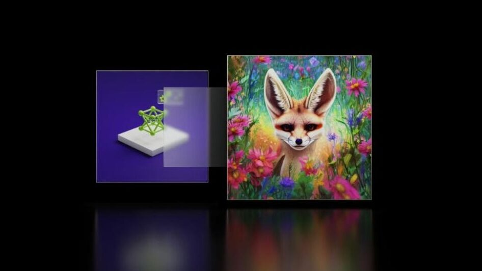

随着互联网规模的数据，人工智能生成内容的计算需求显着增长，数据中心全速运行数周或数月来训练单个模型，更不用说生成时的高推理成本（通常作为服务提供）。 在这种情况下，牺牲性能的次优算法设计是一个代价高昂的错误。

人工智能生成的图像、视频和音频内容的最新进展大部分都是由去噪扩散驱动的——一种迭代地将随机噪声塑造成新的数据样本的技术。 从对基础知识的清晰认识开始，我们找到了质量和计算效率的最先进实践。

## 去噪扩散
去噪是指消除图像中的传感器噪声或录音中的嘶嘶声等。 这篇文章将使用图像作为运行示例，但该过程也适用于许多其他领域。 该任务非常适合卷积神经网络。

这与生成新颖图像有什么关系？ 想象一下图像上存在大量噪声。 确实如此，以至于原始图像丢失了。 可以使用降噪器来揭示一些可能隐藏在所有噪音下的随机图像吗？ 令人惊讶的是，答案是肯定的。

这就是去噪扩散的简单本质：首先绘制纯白噪声的随机图像，然后通过反复将其输入神经降噪器来降低噪声水平（例如一次 2%）。 渐渐地，一个随机的干净图像从噪音下面浮现出来。 生成内容的分布（猫和狗的图片？英语口语短语的音频波形？驾驶视频剪辑？）由训练降噪器网络的数据集决定。

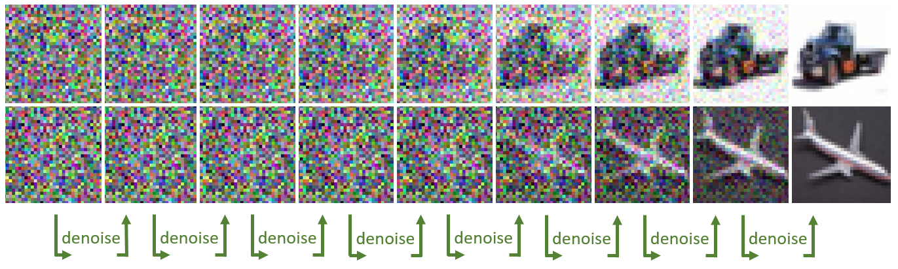

下面的代码是对如何实现这个想法的初步猜测，假设神经网络函数降噪可用。

```python
# start with an image of pure large-magnitude noise
sigma = 80      # initial noise level
x = sigma * torch.randn(img_shape)
 
for step in range(256):
    # keep 98% of current noisy image, and mix in 2% of denoising
    x = 0.98 * x + 0.02 * denoise(x, sigma)
     
    # keep track of current noise level
    sigma *= 0.98
```
如果您曾经查看过该领域的代码库或科学论文，其中充满了方程式，您可能会惊讶地发现这段近乎微不足道的代码实际上是概率流常微分的理论上有效的实现 方程求解器。 虽然这个片段很难说是最佳的，但令人惊讶的是，它体现了本文中解释的许多关键良好实践。 该团队的顶级最终采样器本质上只是多了几行。

那个函数降噪怎么样？ 从本质上讲，它也非常简单：降噪器必须输出可能隐藏在噪声下的所有可能的干净图像的模糊平均值。 不同噪声水平下的所需输出可能类似于下图中的示例。

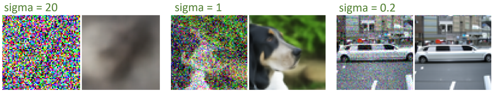

使用基本损失（其输出与干净目标之间的均方误差）训练降噪器网络（通常是 U-Net）可以精确地实现此结果。 追求更高产出的狂热损失实际上是有害的，并且违反了该理论。 请记住，即使任务在概念上很简单，大多数现有的降噪器都没有经过专门训练。

文献中许多明显的数学复杂性都源于证明其原理的合理性。 该理论可以通过各种形式建立起来，最流行的两种是马尔可夫链和随机微分方程。 虽然每种方法都归结为使用训练有素的降噪器的降噪循环，但它们打开了不同实际实现的巨大且令人困惑的空间，以及做出错误选择的机会的雷区。

本文剥离了数学复杂性的层层，直接在易于分析的标准化框架中揭示了有形的设计选择。

这篇文章通过可视化和代码展示了团队的主要发现和直觉。 我们将讨论三个主题：

* 去噪扩散背后理论的直观概述
* 与采样相关的设计选择（当您已经有经过训练的降噪器时生成图像）
* 训练降噪器时的设计选择

## 是什么让扩散发挥作用？
首先，本节回顾基础知识并构建证明这段简单代码合理性的理论。 我们在微分方程框架中找到了最深入的见解，该框架最初在[《通过随机微分方程进行基于分数的生成建模》](https://arxiv.org/abs/2011.13456)中提出。 虽然方程和数学概念可能看起来令人生畏，但它们对于理解要点并不重要。 偶尔提及它们是有用的，以强调它们通常只是用于描述代码中完成的具体事情的不同语言。

想象一下数据集中的形状为 `[3, 64, 64]` 的 RGB 图像 x。 首先考虑通过逐渐在图像上添加噪声来破坏图像的简单方向。 （当然，这与最终目标相反。）

```python
for step in range(1000):
    x = x + 0.1 * torch.randn_like(x)
```

这实际上是一个随机微分方程（SDE）求解器，对应于简单的 SDE $dx=dw_t$。 它表示图像 x 在短时间内的变化是随机白噪声。 这里，求解简单地意味着模拟 SDE 描述的过程的特定随机数值实现。

微分方程的一个好处是它们有丰富的几何解释。 您可以将此过程可视化为图像在像素值空间中进行随机游走（著名的布朗运动或维纳过程）。 如果您认为上面的 x 只是一个数字（“单像素图像”），您可以将其演变绘制如下图。 真实的东西是完全相同的，但维度要高得多，因此无法在二维显示器上可视化。

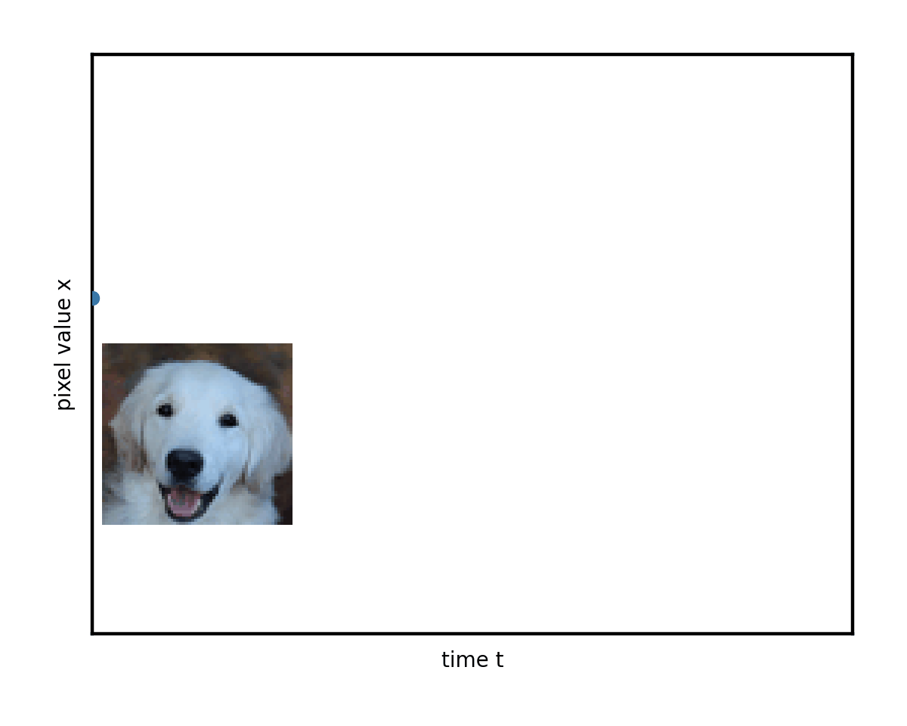

使用许多不同的起始图像和随机路径来研究这种演变，您开始在混乱中看到一些秩序。 可以将其想象为将许多这些弯曲的路径堆叠在一起。 平均而言，它们会随着时间的推移创造出不断变化的形状。

左边缘的复杂数据模式（您可以隐喻地想象分别对应于猫和狗的图像的两个峰值）逐渐混合并简化为右边缘的无特征斑点。 这就是普遍存在的正态分布，或者说纯白噪声。

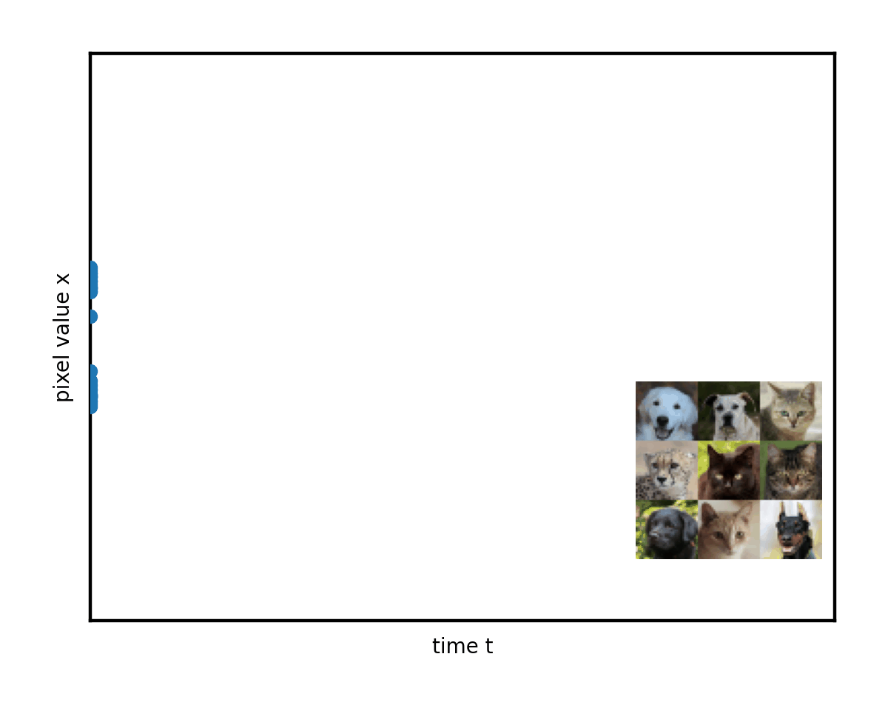

高级目标（生成建模）是找到一种技巧，从上图左侧的真实隐藏数据分布中采样新图像 - 本来可以存在于数据集中但实际上没有的实际新图像。 您可以使用 randn 轻松地从右侧的纯噪声状态中进行采样。 是否可以以相反的方向运行上述噪声过程，以便以干净图像的随机样本结束？

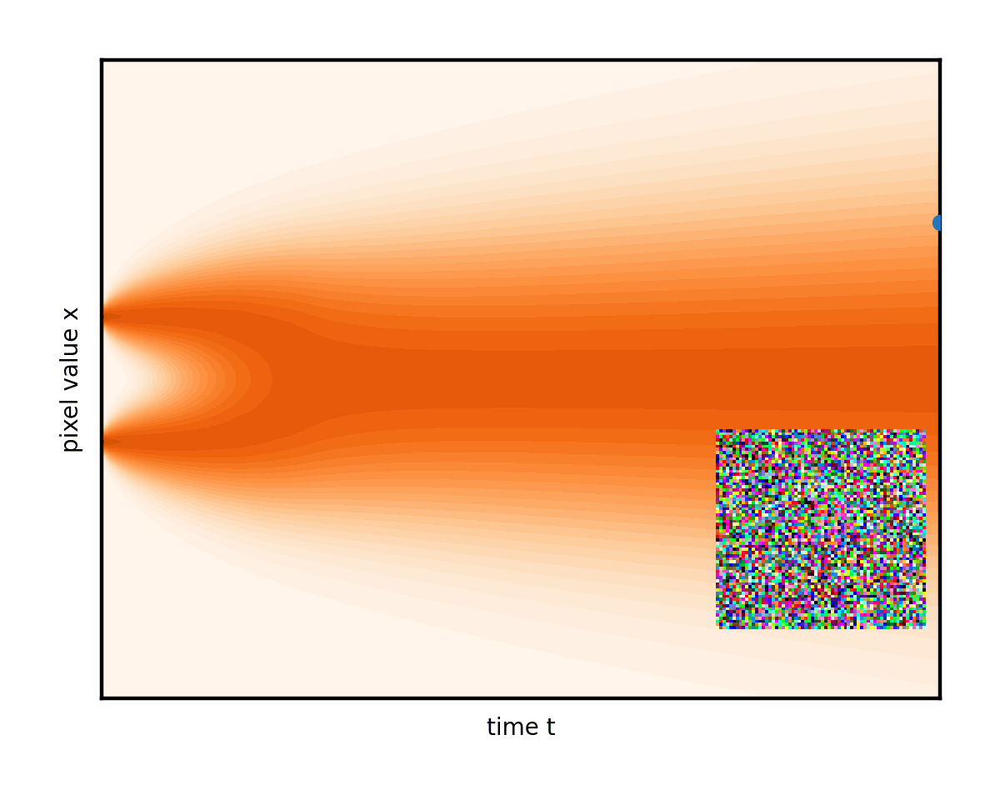

沿着从右边缘开始的随机路径，什么可以保证左边缘的正确图像，而不仅仅是更多的噪声？ 每一步都需要某种额外的力来轻轻地将图像拉向数据。

SDE 的理论提供了一个漂亮的解决方案。 无需过多深入探讨技术细节，它确实可以逆转时间方向，并且这样做会自动引入一个额外的术语来表示备受追捧的数据吸引力。 该力将噪声图像拉向其均方最佳去噪。 这可以使用经过训练的神经网络来估计（这里，sigma 是当前的噪声水平）：

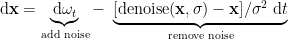

您甚至可以调整这两项的权重，只要您小心保持总降噪率不变即可。 将这个想法发挥到极致，专门消除噪声会产生完全确定的常微分方程 (ODE)，根本没有随机分量。 然后，演变遵循平滑的轨迹，并且图像只是从固定噪声下方淡入。

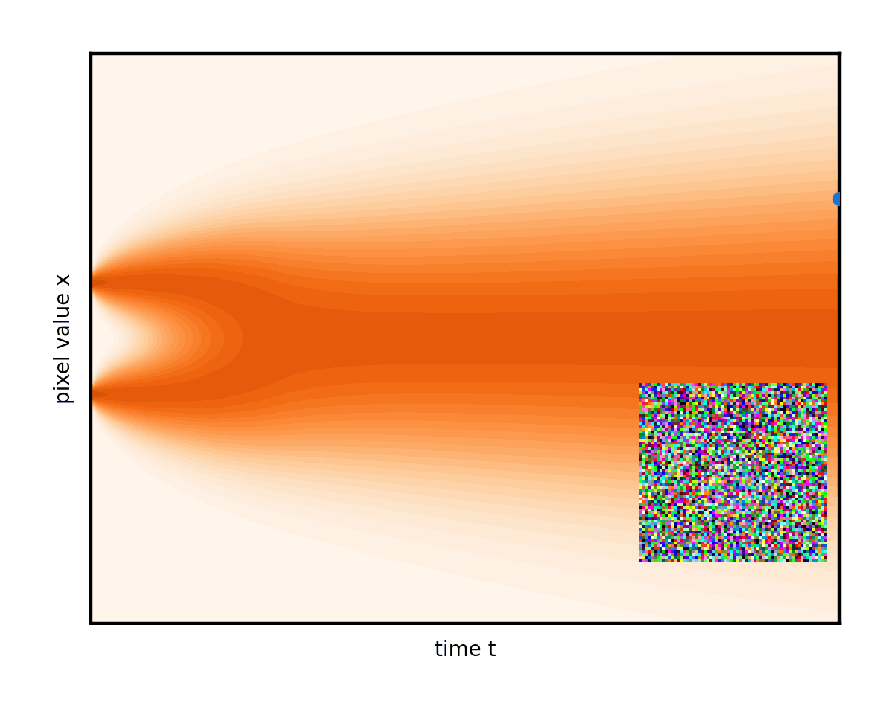

请注意上图 中的弯曲轨迹如何将右边缘的初始随机噪声连接到左边缘的唯一生成图像。 事实上，ODE 为每个初始噪声建立了不同的轨迹。 将这些曲线视为流体推动图像的流线。 在生成过程中，任务只是从一开始就尽可能准确地遵循流程线。 从右侧的随机点开始，在每一步，公式（实际上是降噪器网络）显示流线指向当前图像的位置。 朝其方向稍微移动一点并重复。 简而言之，这就是生成过程。

下图显示解算器的每个步骤都会将时间向后推进某个选定的量 (dt)，并参考 ODE 公式（以及降噪器网络）来确定如何在时间步上更改图像。

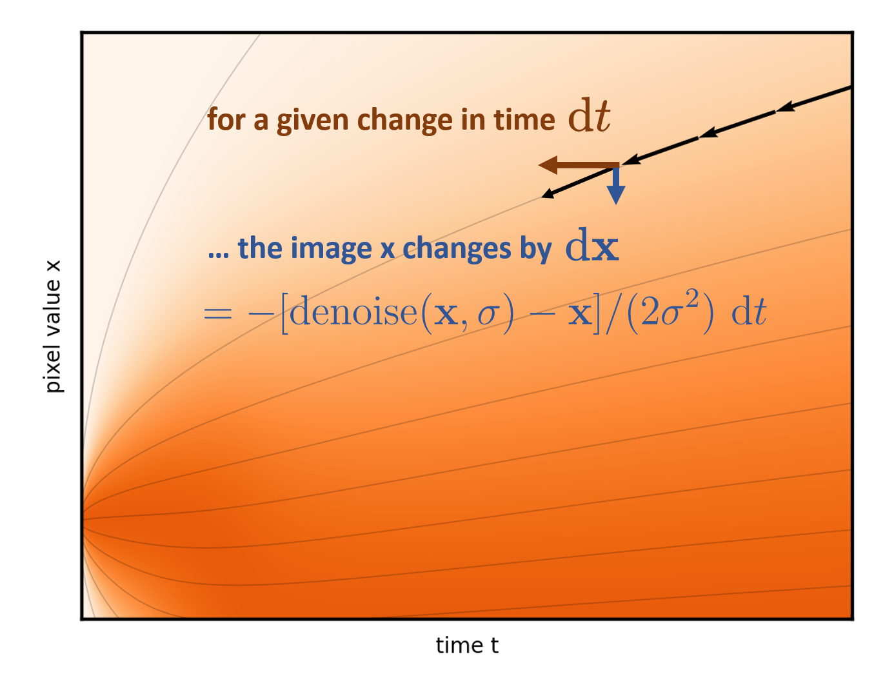

后续部分专门分析确定性版本，因为随机性掩盖了确定性图景所提供的几何洞察力。 通过适当的调整，随机性具有有益的纠错特性，但使用起来很乏味，并且可以被视为一种拐杖。 有关更多详细信息，请参阅阐明基于扩散的模型的设计空间。

## 采样生成图像的设计选择
正如简介中所述，细节决定性能。 关键的困难在于网络给出的步进方向仅在当前噪声水平附近有效。 试图立即减少太多噪音而不停下来重新评估会导致在图像中添加一些不应该存在的东西。 这表现为不同程度的图像质量下降：难以描述的斑点和颗粒感、颜色和强度伪影、面部和其他高级细节的扭曲和缺乏连贯性等等。

在一维可视化中，这相当于采取远离起始流线的步骤，如下图所示。请注意箭头（表示可能采取的步骤）和曲线之间的间隙。

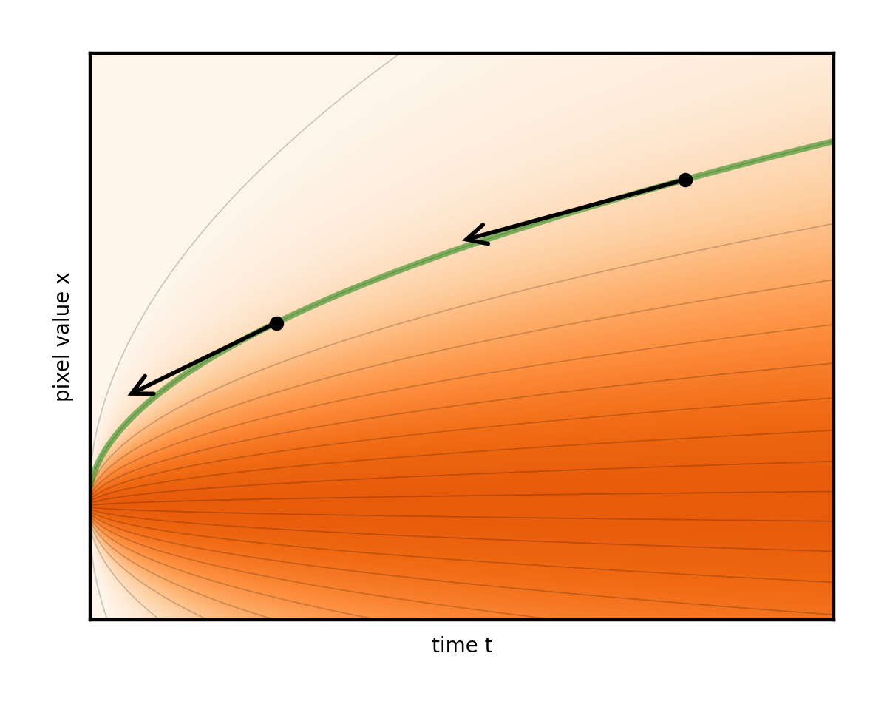

常见的暴力解决方案是简单地采取大量非常短的步骤，以避免被甩掉。 然而，这是昂贵的，因为每一步都会对降噪器网络进行全面评估。 这就像爬行而不是跑步：安全但缓慢。

我们的采样器设计大大减少了所需的步骤，而不会影响质量。 该策略分为三部分：

* 设计 ODE，使其流线尽可能直，从而易于遵循（噪声表）
* 确定哪些噪声级别仍需要格外小心的步进（时间步离散化）
* 采取更明智的步骤，从每个（高阶求解器）中获得最大收益

## 以更少的步骤理顺流程
关键问题是流线的曲率。 如果它们是直线，就很容易遵循。 可以采取一个长的直线步骤一直到噪音水平为零，并且永远不用担心从曲线上掉下来。 实际上，设置中不可避免地会存在一些曲率。 可以减少吗？

事实证明，上一节中提出的理论在这方面导致了一些糟糕的选择。 例如，您可以通过指定不同的噪声计划来构建不同版本的 ODE。 回想一下，一维可视化是通过在每个步骤添加相同量的噪声来构建的。 如果以某种不同的时变速率添加它，则每个噪声水平将在某个不同的时间（不同的时间表）达到。 这相当于拉伸和挤压时间轴。

下图显示了由不同噪声方案选择引起的一些不同的 ODE。

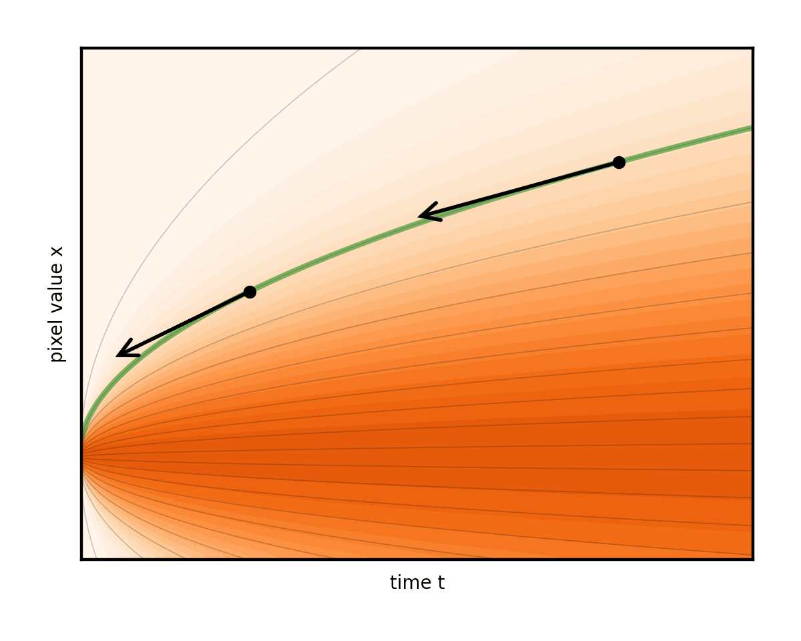

请注意，这会产生重塑流线的副作用。 事实上，其中一张时间表中的线路几乎是笔直的。 这确实是团队所提倡的。 代表步骤的箭头现在几乎与曲线完美对齐。 因此，与其他选择相比，可以采取更少的步骤。
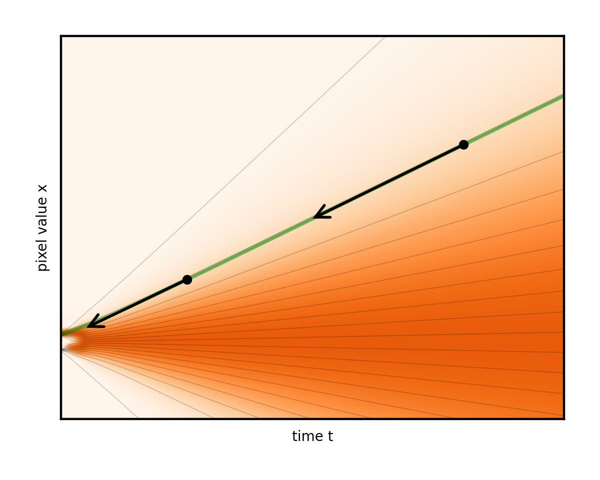


上图显示了噪声水平随时间线性增长的时间表。 与前面的恒定速率添加示例相比，噪声水平首先快速增长，但随后减慢。 换句话说，时间变成了噪音水平的代名词。 无需深入探讨这里的技术细节，这种特殊的选择提供了非常简单的求解器算法。 这是我们论文中的算法 1，没有可选的第 6 到 8 行，使用建议的时间表并经过一些整理后：

```python
# a (poor) placeholder example time discretization
timesteps = np.linspace(80, 0, num_steps)
 
# sample an image of random noise at first noise level
x = torch.randn(img_shape) * timesteps[0]
 
# iterate through pairs of adjacent noise levels
for t_curr, t_next in zip(timesteps[:-1], timesteps[1:]):
 
    # fraction of noise we keep in this iteration
    blend = t_next / t_curr
     
    # mix in the denoised image
    x = blend * x + (1-blend) * denoise(x, t_curr)

```
该代码只是简介中列出的代码的轻微概括。 没有比这更简单的了。 该算法是如此简单，以至于人们想知道它是如何在 2015 年通过启发式原理而被偶然发现的——也许这个想法似乎太荒谬了，无法发挥作用。 顺便说一句，去噪扩散在 2015 年的论文[《使用非平衡热力学的深度无监督学习》](https://arxiv.org/abs/1503.03585)中进行了讨论，但是以复杂的数学为幌子的。 多年来，它的潜力一直未被注意到。

## 在低噪音水平下步骤
这清楚地突出了另一种设计选择，在大多数处理中，该选择被模糊并与噪声时间表纠缠在一起：时间步长的选择。 前面的代码片段中使用的线性间距实际上是一个糟糕的选择。 根据经验（并根据自然图像统计数据进行推理），很明显，在低噪声水平附近，细节会更快地显示出来。 在一维可视化中，图右侧的大部分区域几乎没有发生任何变化，但随后流线突然转向左侧的两个盆地之一。 这意味着在高噪声水平下可以进行长步长，但在接近低噪声水平时有必要放慢速度。

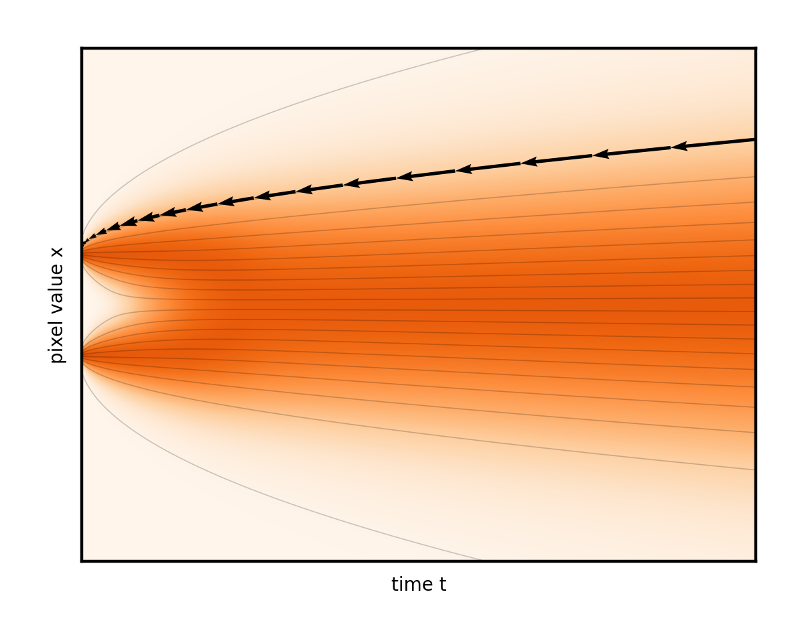

我们的论文根据经验研究了低噪声水平和高噪声水平下的相对步长应该是多少。 以下代码片段对时间步进行了简单但强大的修改。 粗略地，将其中的数字增加到 7 次方（小心地将它们缩放到 0 到 80 的原始范围）。 这强烈地将步骤偏向低噪声水平：
```python
sigma_max = 80
sigma_min = 0.002   # leave a microscopic bit of noise for stability
rho = 7
 
step_indices = torch.arange(num_steps)
timesteps = (sigma_max ** (1 / rho) \
          + step_indices / (num_steps - 1) \
            * (sigma_min ** (1 / rho) - sigma_max ** (1 / rho))) ** rho
```

## 高阶求解器可实现更准确的步骤
ODE 观点允许使用更高级的高阶求解器，该求解器本质上采用曲线而不是线性步骤。 当尝试遵循弯曲的流线时，这是一个优势。 好处并不明确，因为估计局部曲率需要额外的神经网络评估。 该团队测试了一系列方法，一致发现所谓的二阶 Heun 方案是最佳方案。 这会在代码中添加几行（请参阅阐明[基于扩散的模型的设计空间中的算法](https://research.nvidia.com/publication/2022-11_elucidating-design-space-diffusion-based-generative-models)），并使每次迭代的费用加倍，但将所需的迭代次数减少到一小部分。

Heun 步骤有很好的几何解释和简单的代码实现。 像以前一样试探性地迈出一步，然后迈出第二步，然后从着陆点折回一半。 请注意最终修正的步骤如何比原始步骤更接近实际流线。
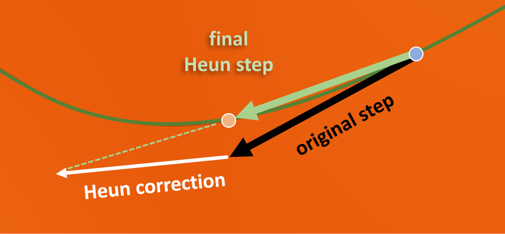

将所有这些改进结合起来，现在只需评估降噪器 30 到 80 次就足够了，而不是像大多数以前的工作那样评估 250 到 1,000 次。

## 训练降噪器的设计选择
现在这是一个流畅且高效的去噪步骤链。 到目前为止，假设每个步骤都可以调用一个易于训练的降噪器降噪（x，sigma），接收噪声图像和指示其噪声水平的数字。 但如何对其进行参数化和训练以获得最佳结果呢？

对于这样的网络，理论上有效的训练的最基本形式（这里是实例化为降噪的 PyTorch 模块）如下所示：

```python
# WARNING: this code illustrates poor choices across the board!
 
for clean_image in training_data:   # we’ll ignore minibatching for brevity
 
    # pick a random noise level to train at
    sigma = np.random.uniform(0, 80)
 
    # add noise with this level
    noisy_image = clean_image + sigma * torch.randn_like(clean_image)
 
    # feed to network under training
    denoised_image = denoise(noisy_image, sigma)
 
    # compute mean square loss
    loss = (denoised_image - clean_image).square().sum()
 
    # ... plus the usual backpropagation and parameter updates

```
该理论要求使用白噪声和均方损失，并触及用于采样的所有噪声水平。 在这些限制内，可以有很大的自由度来重新安排计算。 以下小节确定并解决了本规范中的每个严重的实际问题。

请注意，不会讨论网络架构本身。 这个讨论很大程度上是正交的，并且与层数、形状和大小、注意力或变压器的使用等无关。 对于本文中的所有结果，均采用了之前工作的网络架构。

## 网络友好的数值大小
这些示例中的最大噪声级别 80 是根据经验选择的，作为一个足够大的数字，可以完全淹没图像。 因此，降噪器有时会输入像素值大致在 -1 到 1 范围内（当噪声水平非常低时）的图像，有时会输入超出 -100 到 100 范围内的图像。这会产生红色 标记，因为如果神经网络的输入在示例之间的规模差异很大，那么众所周知，神经网络会遭受不稳定的训练和较差的最终性能。 有必要对尺度进行标准化。

一些工作通过修改 ODE 本身来解决这个问题，使得采样过程将噪声图像保持在恒定的幅度范围内，而不是让它随着时间的推移而扩展（所谓的方差保留比例表）。 不幸的是，这再次扭曲了流线，抵消了上一节中揭示的拉直的好处。

接下来是一个不受此类数值缺陷影响的简单解决方案。 噪声水平是已知的，因此只需将噪声图像缩放到标准大小，然后再将其输入网络即可。 它将通过训练自动适应不同的尺度约定，但有问题的范围变化被消除。

实现这一目标的简洁方法是从外部调用者（ODE 求解器和训练循环）的角度来看保持降噪不变，但改变其内部利用网络的方式。 将实际的原始网络层隔离到它们自己的黑盒模块网络中，并用降噪中的幅度管理代码（“预处理”）将其包装：

```python
sigma_data = 0.5    # approximate standard deviation of ImageNet pixels
def denoise(noisy_image, sigma):
    noisy_image_variance = sigma**2 + sigma_data**2
    scaled_noisy_image = noisy_image / noisy_image_variance ** 0.5
    return net(scaled_noisy_image, sigma)
```
在这里，将噪声图像除以其预期标准差，使其大致达到单位方差。

作为一个小细节（此处未显示），类似地，还使用对数函数扭曲输入到网络的噪声级别标签，使其在 -1 到 1 的范围内更均匀地分布。

## 预测图像与噪声
如果您熟悉现有的扩散方法，您可能已经注意到，它们中的大多数训练网络来预测噪声（单位方差）而不是干净的图像，将其显式缩放到已知的噪声水平西格玛，然后恢复去噪后的图像。 通过从输入中减去图像。

事实证明，这是一个好主意，特别是在低噪声水平下，但在高噪声水平下却是一个坏主意。 由于大多数图像细节会在相对较低的噪声水平下突然显现出来，因此利大于弊。

为什么这在低噪音水平下是个好主意？ 这种方法从输入中回收了几乎干净的图像，并且仅使用网络对其添加了小的噪声校正。 重要的是，网络输出被显式缩小（按西格玛）以匹配噪声水平。 因此，如果网络犯了一些错误（一如既往），该错误也会缩小，并且不太可能弄乱图像。 这最大限度地减少了不可靠的学习网络的贡献，并最大限度地重用输入中已知的内容。

为什么在高噪音水平下这是一个坏主意？ 它最终根据大的噪声幅度来提高网络输出。 因此，网络产生的任何小错误现在都会成为降噪器输出中的大错误。

更好的选择是连续过渡，其中网络预测（负）噪声和干净图像的噪声水平相关的混合。 然后将其与适当数量的噪声输入混合以消除噪声。

本文提出了一种计算混合权重作为噪声水平函数的原则方法。 确切的统计论据在一定程度上涉及，因此本文不会尝试完全复制它。 基本上，它要求的是导致网络输出放大最小的混合系数。 实现非常简单。 最后一个返回行替换为下面的代码，其中 c_skip 和 c_out 是分别控制回收输入量和网络贡献量的混合因子。
```python
return c_skip * noisy_image + c_out * net(scaled_noisy_image, sigma)
```

## 均衡噪声水平上的梯度反馈幅度
完成降噪器的内部结构后，本节将解决稻草人训练代码片段中的噪声水平问题。 对损失不应用任何与噪声水平相关的缩放是一个（糟糕的）隐式选择。 就好像写了下面这样：

```python
weight = 1
loss = weight * (denoised_image - clean_image).square().sum()
```
问题在于，由于降噪器内部的各种缩放，这种损失的值对于某些噪声水平来说很大，而对于其他噪声水平来说很小。 因此，对网络权重进行的更新（梯度反馈）的幅度也将取决于噪声水平。 这就像不同的学习率被用于不同的噪声水平，没有充分的理由。

这是另一种情况，统一幅度可以带来更稳定和成功的训练。 幸运的是，一个简单的与数据无关的统计公式给出了每个噪声级别的预期损失幅度。 相应地设置权重以将该量值缩放回 1。

## 分配培训工作
权重的一种诱人的误用还可能是根据噪声水平的相对重要性来衡量噪声水平，以便将更多的网络容量引导到重要的地方。 然而，通过在这些重要的噪声水平上更频繁地进行训练，可以在不影响幅度的情况下实现相同的目标。 下图 从概念上说明了团队提倡的分工。

在整个训练过程中，每个噪声级别都会为网络权重提供梯度更新（箭头）。 我们分别使用两种各自的机制来控制这些更新的幅度和数量。 默认情况下，幅度（箭头的长度）和频率（箭头的数量）都以不受控制的方式取决于噪声水平。 该团队提倡分工，其中损失缩放标准化长度，噪声水平分布决定每个级别的训练频率。

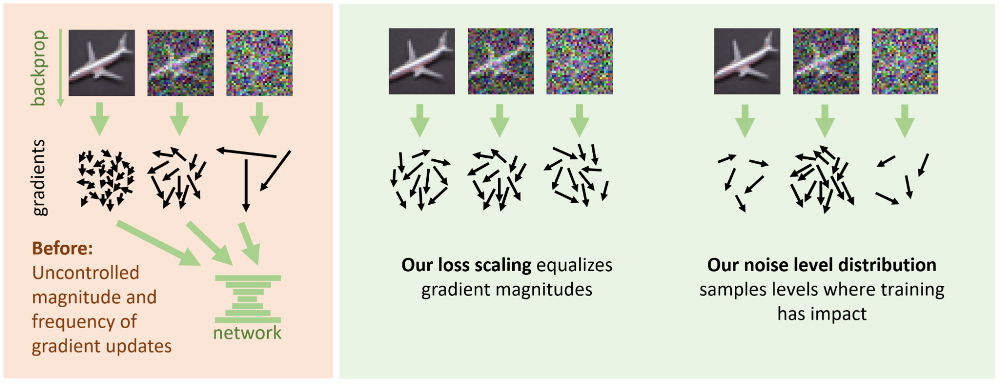

毫不奇怪，从均匀分布中选择训练噪声级别的代码示例是一个糟糕的选择。 该理论对这种选择提供的指导很少，因为它取决于数据集的特征。 在噪声水平非常低的情况下，进展是最小的，因为从无噪声图像中预测噪声实际上是不可能的（而且也是无关紧要的）。 相反，在非常高的噪声水平下，最佳去噪（数据集图像的模糊平均值）相当容易预测。 中间提供了可以取得进展的广泛级别。

在实践中，我们从公式 sigma = torch.exp(P_mean + P_std * torch.randn([])) 中选择随机训练噪声级别，其中 P_mean 和 P_std 指定训练的平均噪声级别，以及周围随机化的宽度 分别为该值。 选择这个特定的公式只是因为它是绘制跨越多个数量级的非负随机值的简单启发式方法。 这些参数的值是根据经验调整的，但事实证明在常规图像数据集中相当稳健。

总而言之，下面是一个最小的部分，汇集了我们原始训练代码所讨论的所有更改，包括任何省略的公式：

```python
P_mean = -1.2       # average noise level (logarithmic)
P_std = 1.2     # spread of random noise levels
sigma_data = 0.5    # ImageNet standard deviation
 
def denoise(noisy_image, sigma):
        # Input, output and skip scale
        c_in = 1 / torch.sqrt(sigma_data**2 + sigma**2)
        c_out = sigma * sigma_data / torch.sqrt(sigma**2 + sigma_data**2)
        c_skip = sigma_data**2 / (sigma**2 + sigma_data**2)
        c_noise = torch.log(sigma) / 4      # noise label warp
 
        # mix the input and network output to extract the clean image
        return c_skip * noisy_image + \
                   c_out  * net(c_in * noisy_image, c_noise)
 
for clean_image in training_data:   # we’ll ignore minibatching for brevity
       # random noise level
        sigma = torch.exp(P_mean + P_std * torch.randn([]))
 
       noisy_image = clean_image \
                            + sigma * torch.randn_like(clean_image)
       denoised_image = denoise(noisy_image, sigma)
     
       # weighted least squares loss
       weight = (sigma**2 + sigma_data**2) / (sigma * sigma_data)**2
       loss = weight * (denoised_image - clean_image).square().sum()
 
       # ... plus backpropagation and optimizer update
```


