# NVIDIA Chat With RTX安装使用教程

世界各地每天有数百万人使用聊天机器人，由基于 NVIDIA GPU 的云服务器提供支持。 现在，这些突破性工具即将登陆由 NVIDIA RTX 提供支持的 Windows PC，以实现本地、快速、自定义的生成 AI。

Chat with RTX 是一个技术演示，现已免费下载，可让用户使用自己的内容个性化聊天机器人，并由本地 NVIDIA GeForce RTX 30 系列 GPU 或更高版本（具有至少 8GB 显存和 VRAM）加速。

Chat with RTX 使用检索增强生成 (RAG)、NVIDIA TensorRT-LLM 软件和 NVIDIA RTX 加速，为本地 GeForce 支持的 Windows PC 带来生成式 AI 功能。 用户可以快速、轻松地将 PC 上的本地文件作为数据集连接到 Mistral 或 Llama 2 等开源大型语言模型，从而能够快速查询上下文相关的答案。

# 1.安装

## 1.1 首先需要安装驱动和CUDA
此步骤网上的教程很多, 您也可以参考我之前写的教程: 
[https://blog.csdn.net/kunhe0512/article/details/124331221](https://blog.csdn.net/kunhe0512/article/details/124331221)

此处详情就不再赘述.

## 1.2 下载
请您访问[Chat With RTX官网](https://www.nvidia.com/en-us/ai-on-rtx/chat-with-rtx-generative-ai/)下载应用

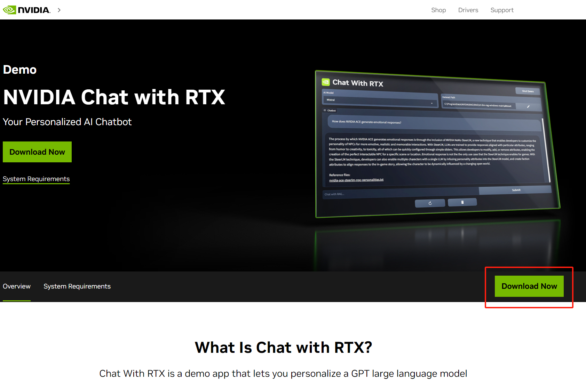

当然,我遇到过下载大文件的时候出现无法解压缩的问题, 如果您遇到下载完解压缩出现错误的情况, 您也可以访问我准备的百度云盘上的下载地址:

[链接：https://pan.baidu.com/s/1Jy0_3d7A996VpLFt6WMCJg?pwd=0512 
提取码：0512](https://pan.baidu.com/s/1Jy0_3d7A996VpLFt6WMCJg?pwd=0512)

**注意** 官网给的系统需求是win11, 实测win10也可以
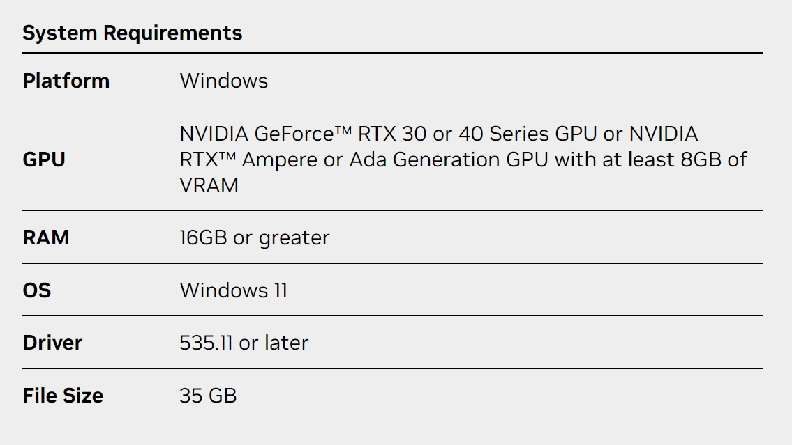

## 1.3 解压缩并安装程序:

经过漫长的下载和解压缩之后(大于一个小时的时间), 您会看到如下图的内容:
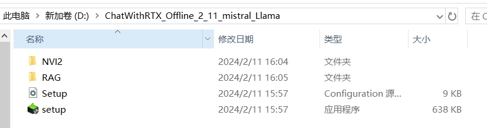

点击`setup.exe`, 执行安装.

加下来你就会看到:

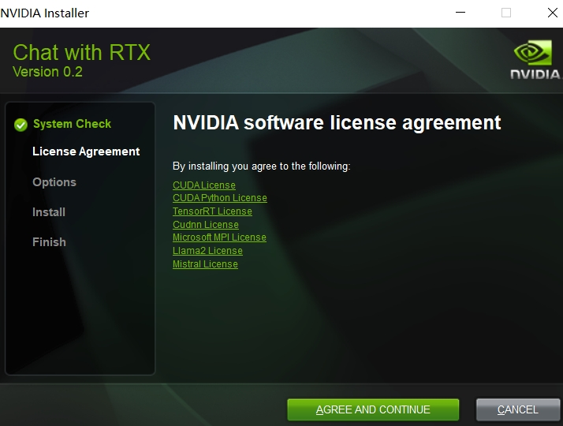

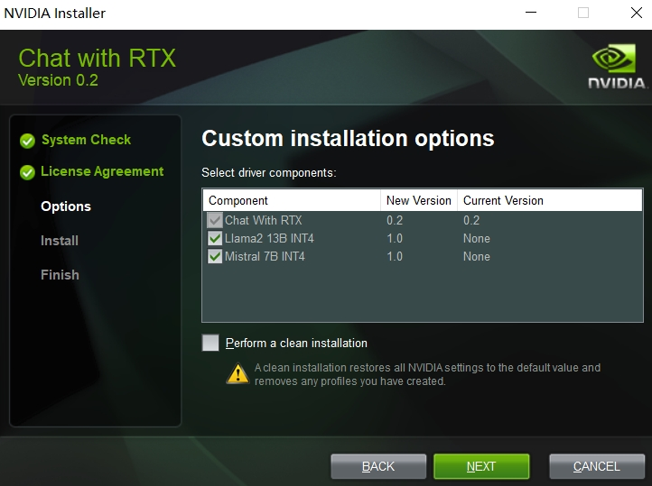

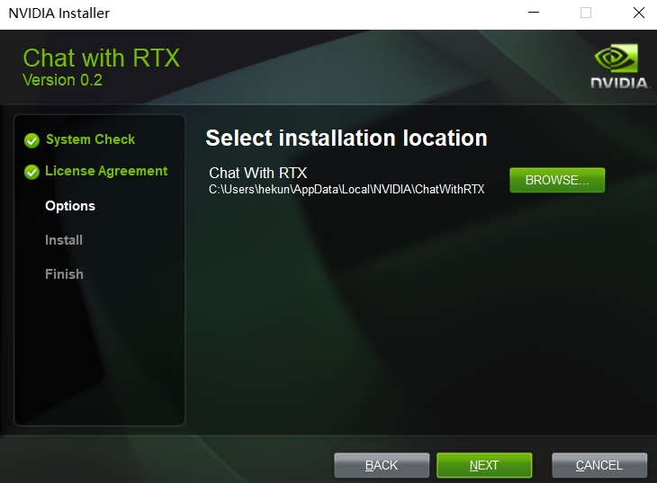

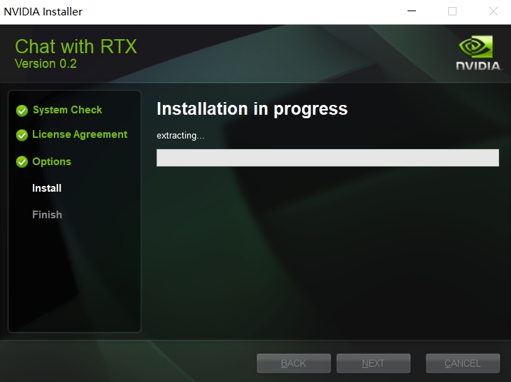

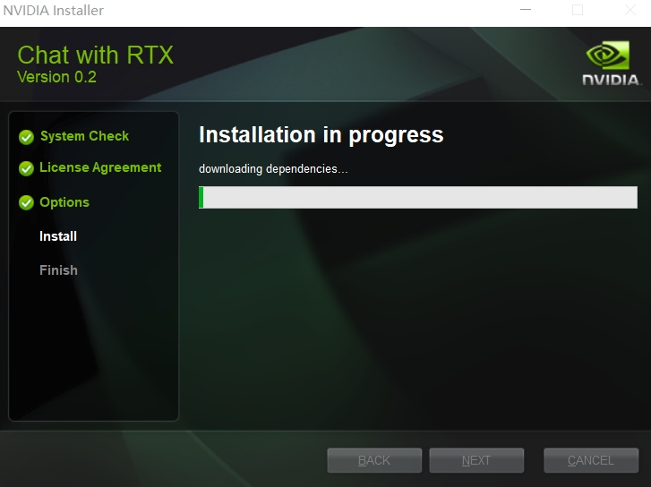

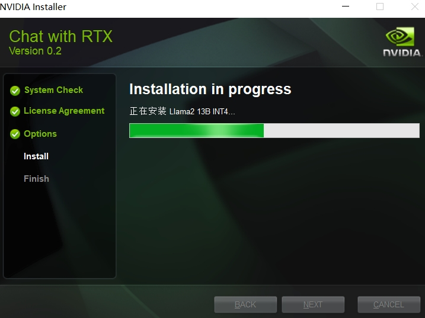

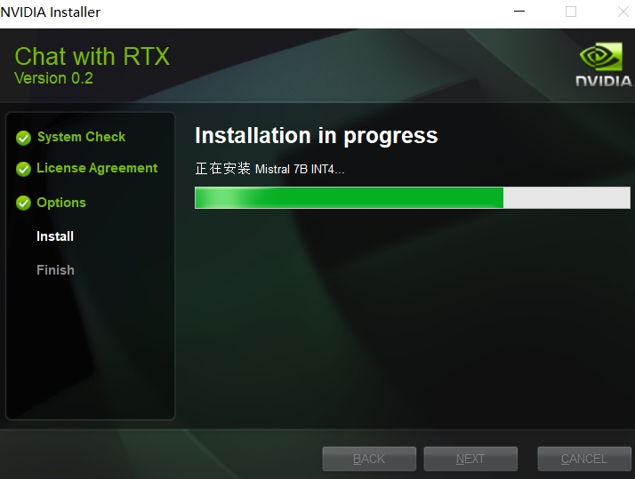

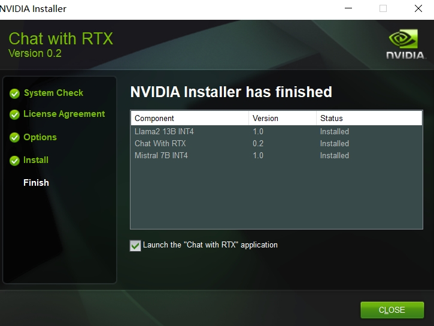

这个时候你就安装好了Chat With RTX

这时你的桌面就会出现Chat With RTX的图标, 双击打开它你就可以用了
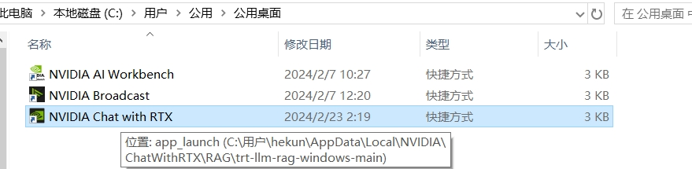

# 2.使用Chat With RTX

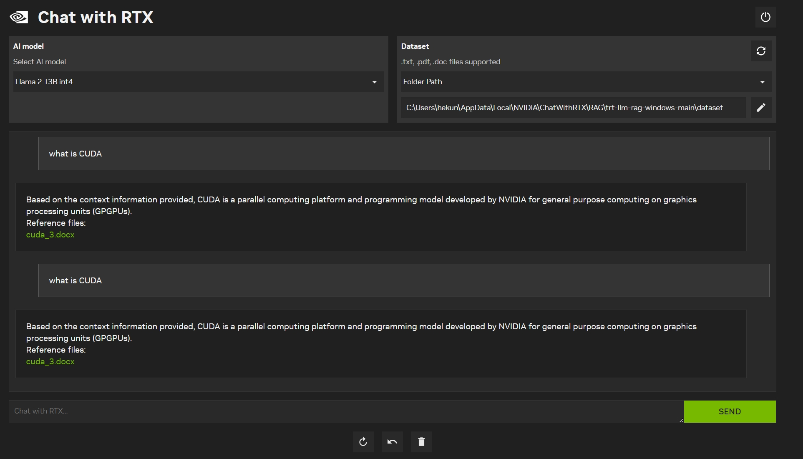

双击图标后, 在浏览器中会弹出如下界面, 您就已经搭建完了一个本地的聊天机器人.

**注意:** 如果你的显存不够大, 比如不够12G, 那么你在上面安装的时候,以及此处选择模型的时候会看不到LLama2, 只有Mistral.

## 2.1 完全离线运行

虽然模型的推理是利用TensorRT-LLM在本地进行推理, 但是这时,如果你想用的话,还需要链接一下网络(甚至需要科学上网).那么接下来我们就介绍下如何完全离线运行.

### 2.1.1修改user_interface.py文件

打开你的安装目录, 比如我的是(下面都会以我自己的目录来展示,请对应到您自己的电脑目录):

C:\Users\hekun\AppData\Local\NVIDIA\ChatWithRTX

在C:\Users\hekun\AppData\Local\NVIDIA\ChatWithRTX\RAG\trt-llm-rag-windows-main\ui里面有一个user_interface.py文件, 打开它, 并找到254行左右的位置

在`interface.launch`函数里加上share=True, 如下图所示:

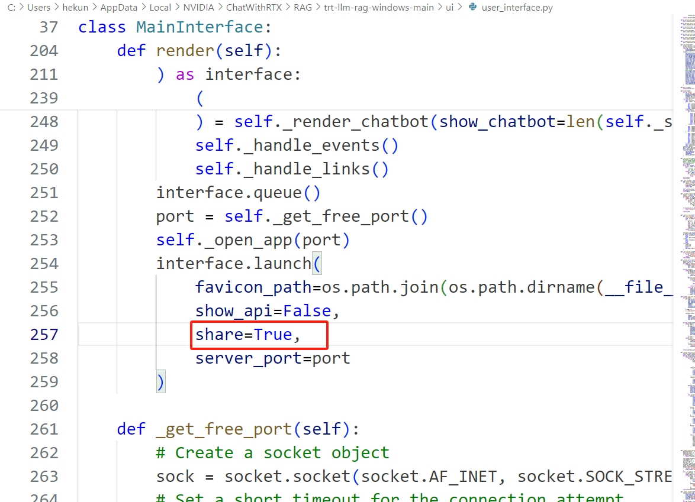

### 2.1.2下载UAE-Large-V1

当我们启动Chat With RTX的时候, 需要联网的原因可能是它需要从HF上下载一个文件, 我们打开:

C:\Users\hekun\AppData\Local\NVIDIA\ChatWithRTX\RAG\trt-llm-rag-windows-main\config\app_config.json

如下图, 我们可以看到:

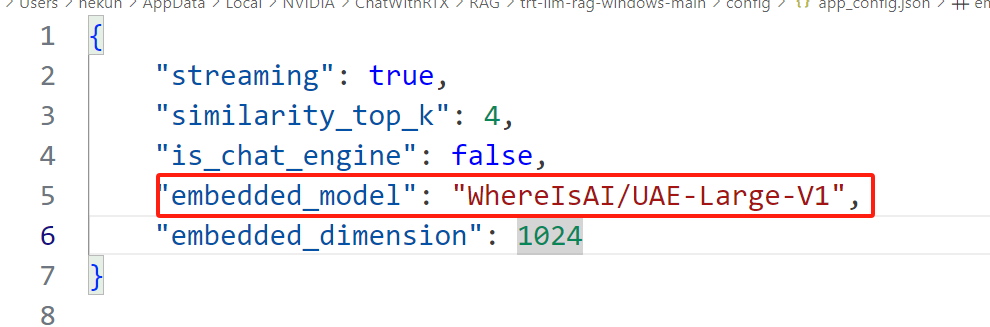

这里它会去找"WhereIsAI/UAE-Large-V1"这个embedding模型, 所以我们可以直接从HF上下载下来, 然后修改这个路径就好.

下载地址: https://huggingface.co/WhereIsAI/UAE-Large-V1/tree/main

当然, 我也为无法访问HF的朋友准备了百度云盘的地址:

链接：https://pan.baidu.com/s/1jlceEfQeBrtjge2MWuaDrg?pwd=0512 
提取码：0512 

然后修改此处的"embedded_model"属性为"C:\\Users\\hekun\\AppData\\Local\\NVIDIA\\ChatWithRTX\\UAE-Large-V1"

如下图所示:
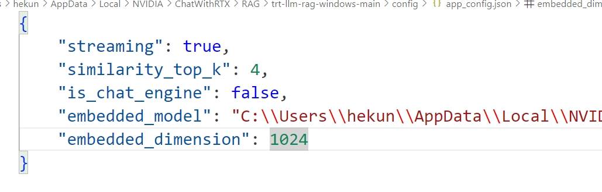
**注意**, 这里的路径是我自己下载完的路径, 请根据您的路径进行修改

完成上述操作之后记得保存, 然后重启就不需要联网,能够完全离线运行了!
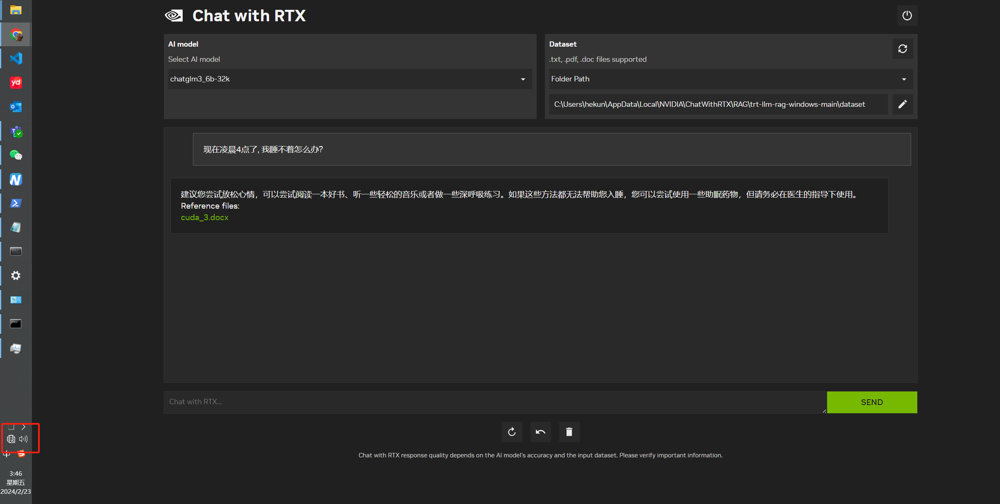

## 2.2 参考本地文档

我们的聊天机器人不仅能根据大模型本身的推理能力来给出结果, 还可以根据您自己的资料来给出更符合您预期的结果, 比如您在某个领域的专业资料.

我们只需要把文档添加进它的数据库就好

接下来我们做一个实验, 我曾经翻译了CUDA开发者手册, 里面包含了CUDA编程的知识, 我把下面这个页面的内容保存成了word格式的文档:

https://blog.csdn.net/kunhe0512/article/details/124121054

这个是CUDA 11 编程手册中第三章的内容

我把上面页面中的内容全部复制下来, 放到`cuda_3.doc`文件中, 并把文件放在了:  

C:\Users\hekun\AppData\Local\NVIDIA\ChatWithRTX\RAG\trt-llm-rag-windows-main\dataset

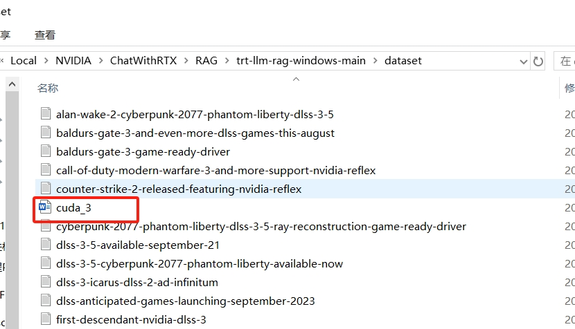

然后点击页面右上角的刷新数据库按钮:

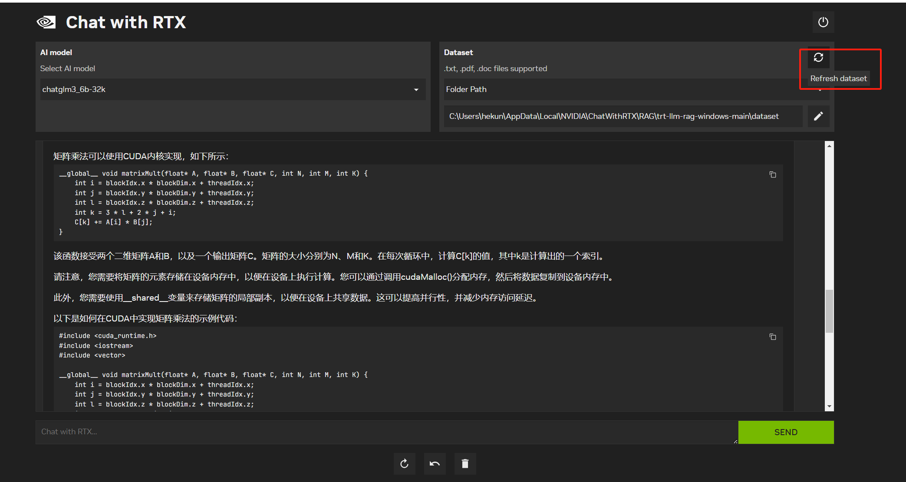

这是后我让它帮我写一个矩阵乘的CUDA函数, 就会出现如下结果:

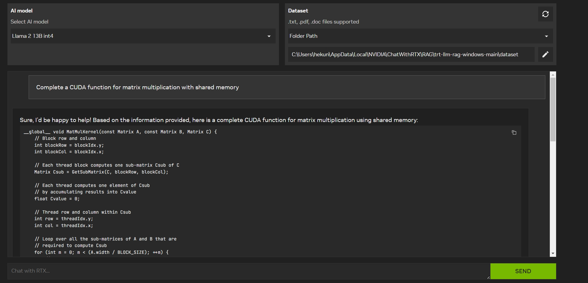
```CPP
__global__ void MatMulKernel(const Matrix A, const Matrix B, Matrix C) {
    // Block row and column
    int blockRow = blockIdx.y;
    int blockCol = blockIdx.x;

    // Each thread block computes one sub-matrix Csub of C
    Matrix Csub = GetSubMatrix(C, blockRow, blockCol);

    // Each thread computes one element of Csub
    // by accumulating results into Cvalue
    float Cvalue = 0;

    // Thread row and column within Csub
    int row = threadIdx.y;
    int col = threadIdx.x;

    // Loop over all the sub-matrices of A and B that are
    // required to compute Csub
    for (int m = 0; m < (A.width / BLOCK_SIZE); ++m) {
        // Get sub-matrix Asub of A
        Matrix Asub = GetSubMatrix(A, blockRow, m);

        // Get sub-matrix Bsub of B
        Matrix Bsub = GetSubMatrix(B, m, blockCol);

        // Shared memory used to store Asub and Bsub respectively
        __shared__ float As[BLOCK_SIZE][BLOCK_SIZE];
        __shared__ float Bs[BLOCK_SIZE][BLOCK_SIZE];

        // Load Asub and Bsub from device memory to shared memory
        // Each thread loads one element of each sub-matrix
        As[row][col] = GetElement(Asub, row, col);
        Bs[row][col] = GetElement(Bsub, row, col);

        // Synchronize to make sure the sub-matrices are loaded
        // before starting the computation
        __syncthreads();

        // Multiply Asub and Bsub together
        for (int e = 0; e < BLOCK_SIZE; ++e) {
            Cvalue += As[row][e] * Bs[e][col];
        }

        // Synchronize to make sure that the preceding
        // computation is done before loading two new
        // sub-matrices of A and B in the next iteration
        __syncthreads();
    }

    // Write Csub to device memory
    // Each thread writes one element
    SetElement(Csub, row, col, Cvalue);
}
```

当然, 在最后面他还会说明引用的文档:
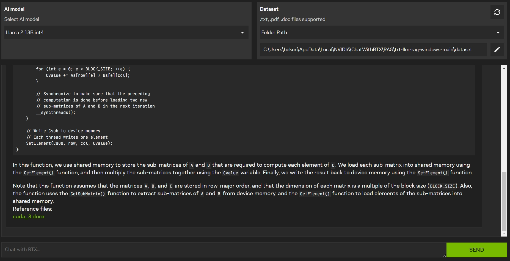

## 2.3 增加一个新的模型

当我们安装好后, Chat With RTX会默认有两个模型, 一个是LLama2, 一个是Mistral.

那么我们接下来试验下如何增加一个新的模型.

**注意:到此处就需要一定的专业知识了.**

### 2.3.1安装TensorRT-LLM

如果我们想增加一个模型, 那么我们就需要知道一个工具---TensorRT-LLM

TensorRT是专门为GPU设计的AI推理工具, TensorRT-LLM就是专门为大语言模型推理而设计的, 这也是能让那些大语言模型在我们这些游戏显卡上运行的一个重要原因. 这个工具能够加速AI模型的推理速度, 让我们的模型运行起来更快,更节省内存.

首先, 我们先来到TensorRT-LLM的官方Github页面:

https://github.com/NVIDIA/TensorRT-LLM/tree/rel

注意, 我们这里的分支选择的是rel.

接下来您需要手动安装git, 网上搜一下, 教程很多.

打开powershell, win10的话直接搜一下就有, 自带的工具.

通过下面三行命令, 下载TensorRT-LLm:
```bash
git clone --branch rel https://github.com/NVIDIA/TensorRT-LLM.git
cd TensorRT-LLM
git submodule update --init --recursive
```

进入Windows目录:
```bash
cd windows
```

输入如下命令开始安装, 注意此处我们应该已经安装了CUDA,所以跳过:
```bash
./setup_env.ps1 -skipCUDA

pip install tensorrt_llm --extra-index-url https://pypi.nvidia.com --extra-index-url https://download.pytorch.org/whl/cu121
```
安装好之后, 可以输入`python -c "import tensorrt_llm; print(tensorrt_llm._utils.trt_version())"`来验证是否安装完毕

正常的话会输出您安装的版本, 如下图所示:
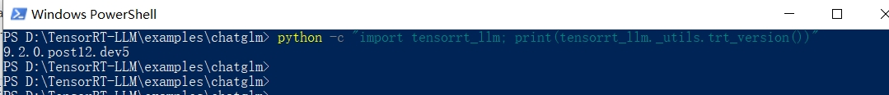

### 2.3.2部署一个新的模型
我们可以在TensorRT-LLM的页面看到很多例子

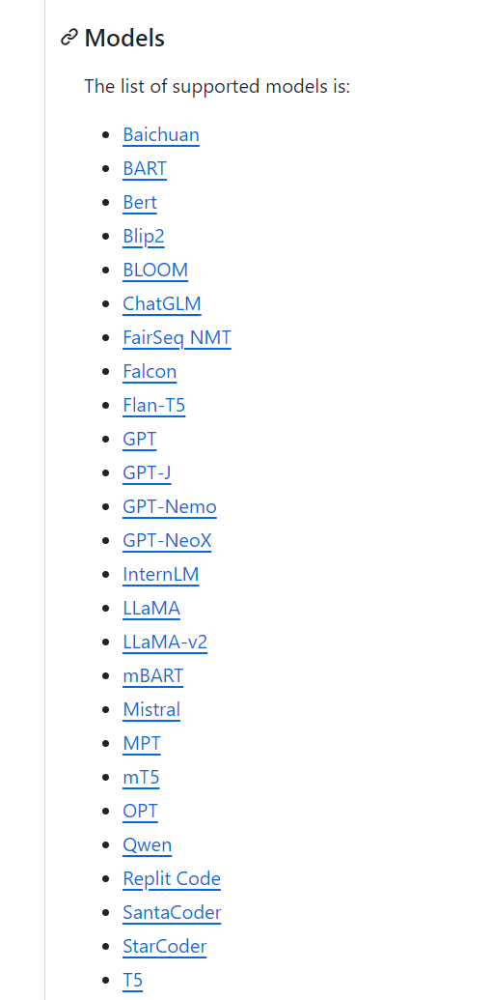

我们接下来尝试把chatglm部署上

https://github.com/NVIDIA/TensorRT-LLM/tree/rel/examples/chatglm


首先我们先去HF上下载, 我们这里选择6b-32k版本:

https://huggingface.co/THUDM/chatglm3-6b-32k

当然, 我还是为没法访问HF的同学准备了百度云版本:

链接：https://pan.baidu.com/s/1ooAypr7tnrkiRPrflqrXEQ?pwd=0512 
提取码：0512 


我们从页面就可以看到, 这个chatglm在中文表现上似乎更好.

接下来, 我们看看下载好的文件:
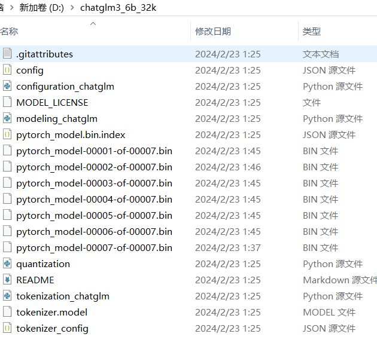

接下来我们打开miniconda

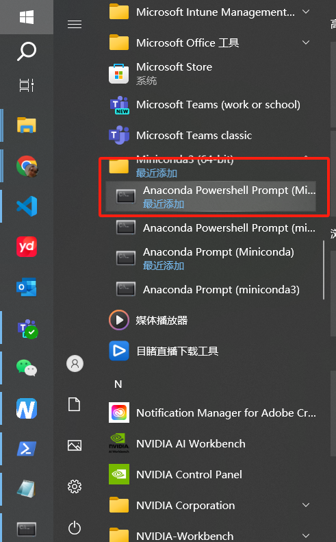

输入如下命令:

这一步是激活我们Chat With RTX的环境, 其实意味着我们接下来的操作和我们运行Chat With RTX处于同一情形, 避免出现因为某些包的版本不匹配而造成的错误
```bash
conda activate C:\Users\hekun\AppData\Local\NVIDIA\ChatWithRTX\env_nvd_rag
```

接下来我们通过TensorRT-LLm来处理下下载下来的模型, 把它编程TensorRT的格式(这里用的通俗的讲法, 专业术语叫构建TensorRT推理引擎)

**注意,--model_dir后面是chatglm存放的路径**

**注意2, 此处的chatglm3_6b_32k文件夹名字是我改过的, 下面我把32前面的`-`变成了`_`, 因为命令中回不识别`减号`,需要用`下划线`来代替**

```bash
cd D:\TensorRT-LLM\examples\chatglm

python build.py -m chatglm3_6b_32k --model_dir D:\\chatglm3_6b_32k  --output_dir trt_engines/chatglm3_6b-32k/fp16/1-gpu --use_weight_only --weight_only_precision int4 --max_input_len 3900
```

构建完之后就会有如下显示:

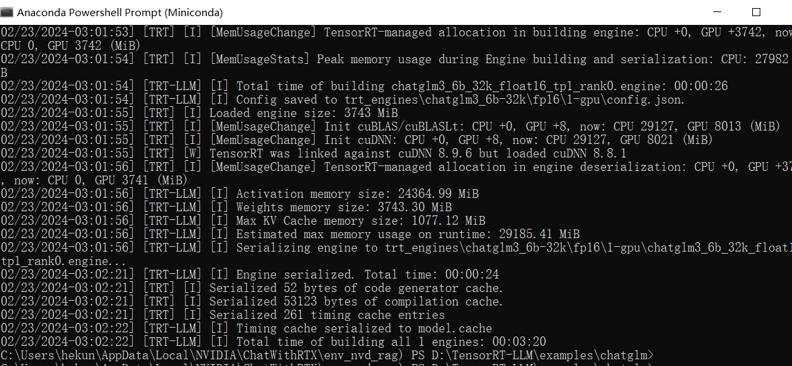

这时候, 我们就能在`D:\TensorRT-LLM\examples\chatglm\trt_engines\chatglm3_6b-32k\fp16\1-gpu`目录下看到生成好的引擎

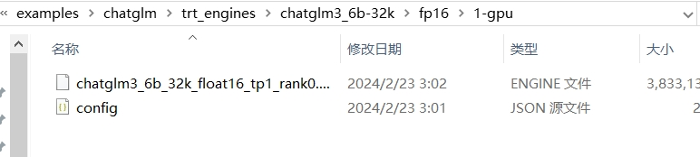

接下来我们打开文件夹, 找到`C:\Users\hekun\AppData\Local\NVIDIA\ChatWithRTX\RAG\trt-llm-rag-windows-main\model`
目录, 创建一个新的文件夹:chatglm
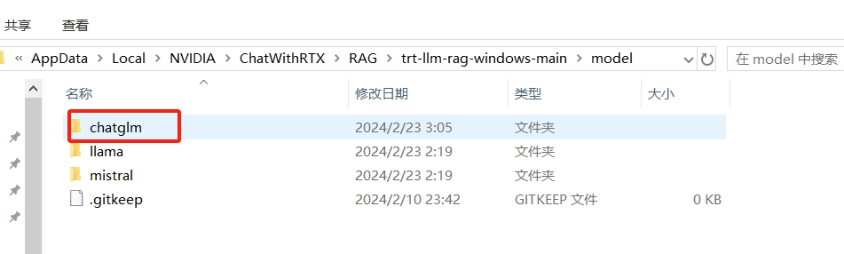

然后在`chatglm`里面分别创建`chatglm_engine`和`chatglm_hf`文件夹:

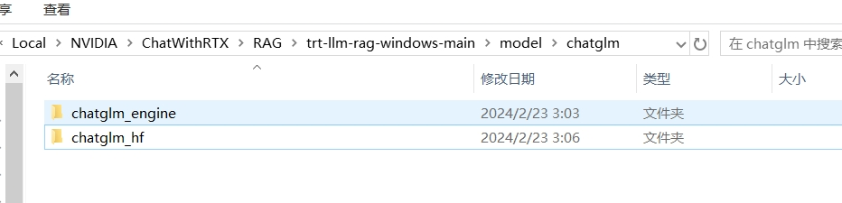

这时候, 我们把上面生成好的引擎和配置文件复制到`chatglm_engine`文件夹中:
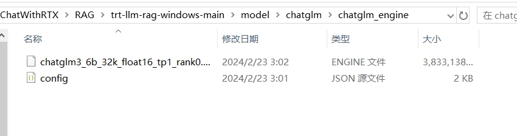

把我们下载的`D:\chatglm3_6b_32k`文件夹中的`config.json`, `tokenization_chatglm.py`, `tokenizer.model`和`tokenizer_config.json`文件放到`chatglm_hf`文件夹中:

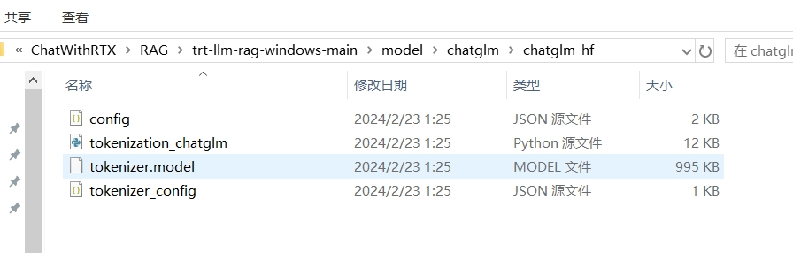


打开`C:\Users\hekun\AppData\Local\NVIDIA\ChatWithRTX\RAG\trt-llm-rag-windows-main\config`文件夹中的`config.json`文件, 将我们新创建的chatglm模型的信息放在里面, 如下图所示:

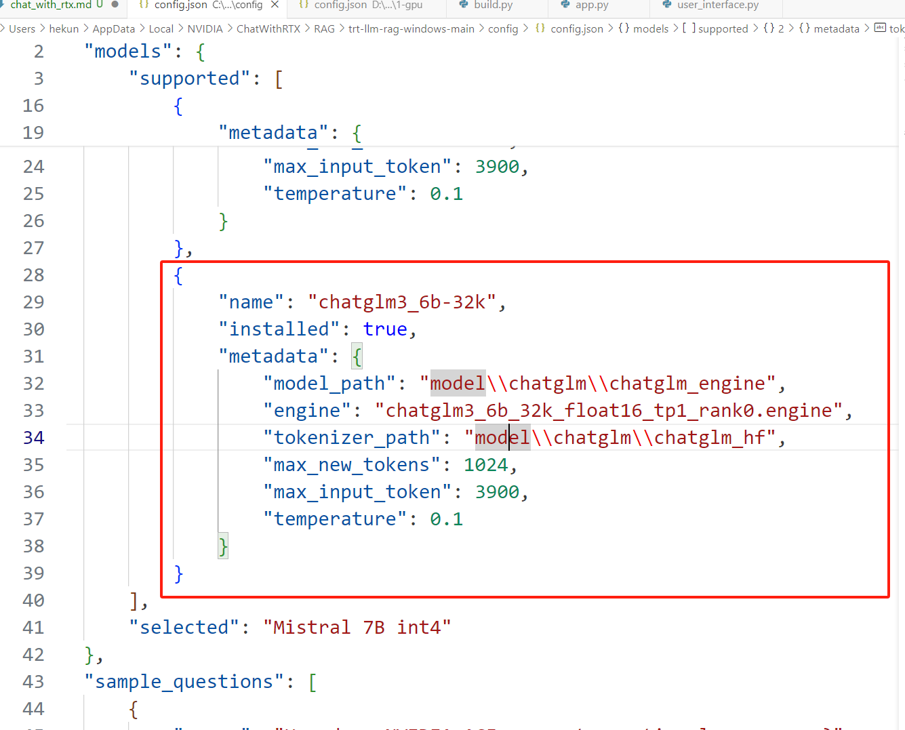

下面是我的config.json中的信息, 供大家参考:

```json
{
    "models": {
        "supported": [
            {
                "name": "Mistral 7B int4",
                "installed": true,
                "metadata": {
                    "model_path": "model\\mistral\\mistral7b_int4_engine",
                    "engine": "llama_float16_tp1_rank0.engine",
                    "tokenizer_path": "model\\mistral\\mistral7b_hf",
                    "max_new_tokens": 1024,
                    "max_input_token": 7168,
                    "temperature": 0.1
                }
            },
            {
                "name": "Llama 2 13B int4",
                "installed": true,
                "metadata": {
                    "model_path": "model\\llama\\llama13_int4_engine",
                    "engine": "llama_float16_tp1_rank0.engine",
                    "tokenizer_path": "model\\llama\\llama13_hf",
                    "max_new_tokens": 1024,
                    "max_input_token": 3900,
                    "temperature": 0.1
                }
            },
            {
                "name": "chatglm3_6b-32k",
                "installed": true,
                "metadata": {
                    "model_path": "model\\chatglm\\chatglm_engine",
                    "engine": "chatglm3_6b_32k_float16_tp1_rank0.engine",
                    "tokenizer_path": "model\\chatglm\\chatglm_hf",
                    "max_new_tokens": 1024,
                    "max_input_token": 3900,
                    "temperature": 0.1
                }
            }
        ],
        "selected": "Mistral 7B int4"
    },
    "sample_questions": [
        {
            "query": "How does NVIDIA ACE generate emotional responses?"
        },
        {
            "query": "What is Portal prelude RTX?"
        },
        {
            "query": "What is important about Half Life 2 RTX?"
        },
        {
            "query": "When is the launch date for Ratchet & Clank: Rift Apart on PC?"
        }
    ],
    "dataset": {
        "sources": [
            "directory",
            "youtube",
            "nodataset"
        ],
        "selected": "directory",
        "path": "dataset",
        "isRelative": true
    },
    "strings": {
        "directory": "Folder Path",
        "youtube": "YouTube URL",
        "nodataset": "AI model default"
    }
}
```

然后, 我们重新打开Chat With RTX, 就会出现chatglm的选项:

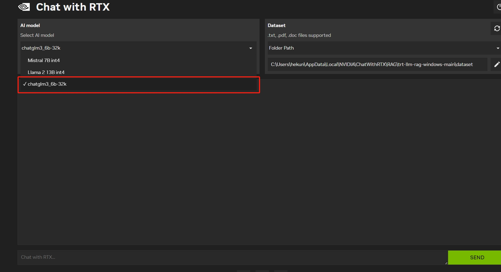

我们可以尝试用中文问他一些问题:

比如我在写这篇文章的时候是凌晨五点, 那么我想问问它`我总是失眠,如何让我快速入睡`

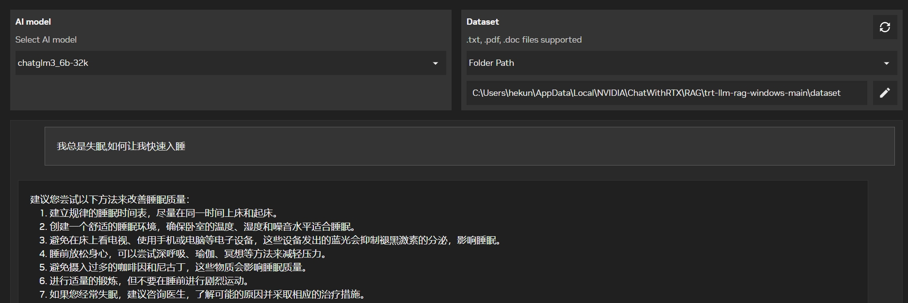

OK, 到这里我们就完成了所有的任务~~


