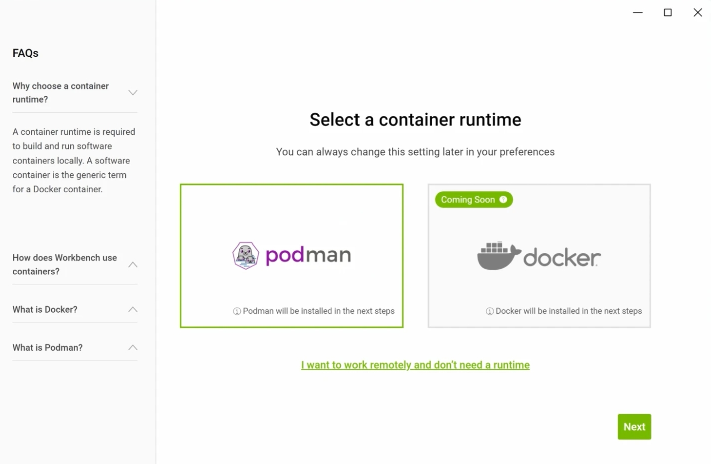
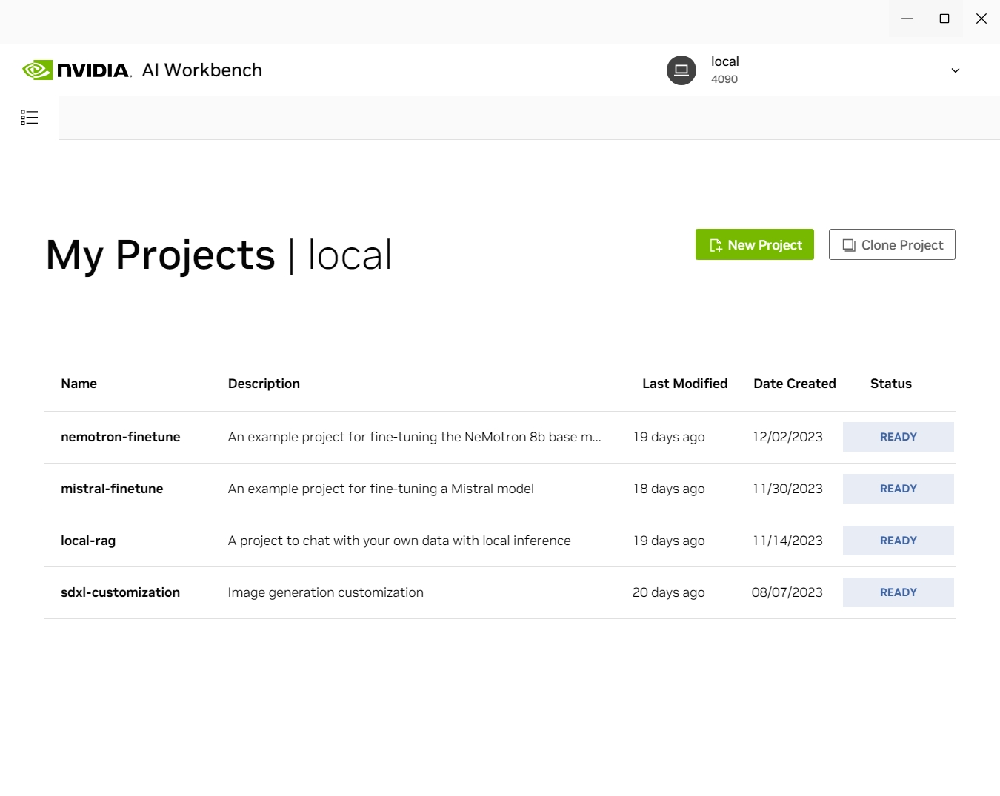

# NVIDIA Workbench 安装使用教程

让每个人都可以进行新一代人工智能开发

NVIDIA AI Workbench 是一个统一且易于使用的工具包，允许开发人员在 PC 或工作站上快速创建、测试和自定义预训练的生成式 AI 模型和 LLM，然后将其扩展到几乎任何数据中心、公共云或 NVIDIA DGX 云。 简化的用户界面可实现 AI 项目团队之间的协作，并简化对 Hugging Face、GitHub 和 NVIDIA NGC 等流行存储库的访问。


## 1.安装

### 1.1 下载软件

NVIDIA Workbench支持Windows, Ubuntu, Mac操作系统, 请您去官网下载对应的安装包, 本教程会以Windows为例.

**注意: 因为我们后面使用可能会需要链接Github/HuggingFace等网站下载/认证,请大家自行处理网络问题**

下载地址:

https://developer.nvidia.com/ai-workbench-beta/getting-started

进入下载页面, 勾选同意用户协议, 然后下载您需要的版本, 如下图所示:


### 1.2 安装软件

在开始之前，您应该拥有 GitHub.com 或 GitLab.com 帐户。 您还应该验证您的 Windows 版本是否支持 WSL2。 Windows 11 和 Windows 10 版本高于 19041 支持 WSL2。

接下来点击安装程序, 开始安装

**注意:这里有些安全软件或者防病毒软件可能会进行拦截或者查杀, 请您根据您的消毒软件允许安装操作**


如果您的系统上尚未安装 WSL2，AI Workbench 将为您安装。 在“WSL2 必需”屏幕上单击“下一步”以启用 WSL2 所需的虚拟化功能。 然后您需要重新启动。


当系统再次启动时，AI Workbench 将安装 WSL2。 这会自动安装一个名为 Ubuntu 的默认 Ubuntu 发行版。 AI Workbench 不会使用此发行版。 如果终端打开，请关闭它。

相反，AI Workbench 将安装另一个 Ubuntu 22.04 发行版，对其进行一些更改并将其命名为 NVIDIA-Workbench。 这是依赖项和大多数应用程序文件将安装的位置。

AI Workbench 需要容器运行时。 选择 Podman 或 Docker，然后单击“下一步”继续。

**注意:实测选择podman会更好一点, Docker可能会出现BUG**




安装所有依赖项后，“下一步”按钮将变为绿色。 单击它继续。


选择 GitHub 或 GitLab，然后单击下一步。 您也可以跳过这一部分并稍后连接到 Git 服务器。

身份验证代码将出现在应用程序窗口中，浏览器应打开一个可以输入代码的页面。

单击授权 NVIDIA 按钮以允许 AI Workbench 访问您的命名空间。


## 2.使用NVIDIA Workbench

到这里您就已经安装好了NVIDIA Workbench

我们打开它就会看到如下页面:


比如我这里是一台带有4090显卡的机器, 我就把当前机器命名为4090.

点击图中的`local 4090`按钮, 就会出现如下页面:

此处页面中显示的项目是我已经做好的, 第一次打开没有这些项目




### 2.1 创建一个新项目

首先, 我们打开开始下载软件的页面:

https://developer.nvidia.com/ai-workbench-beta/getting-started

我们可以看到如下页面:


这些都是已经准备好的项目, 基本上你不用再去写什么代码.

我们此处以SDXL Customization为例, 点击SDXL Customization, 进入官方Github下载页:

https://github.com/NVIDIA/workbench-example-sdxl-customization

点击页面右上角的`Fork`按钮:


把它分叉到自己的Github账户, 以便后面搭建项目或者更新自定义内容时候时使用.


然后, 我们回到Workbench工具, 点击页面中`Clone Project`


将你刚才fork的项目地址粘贴到对应栏中


**注意:上图中Path指的是虚拟环境中Ubuntu系统的路径,不是我们自己电脑中的路径, 大家不必管他**

完成后点击西面的`clone`按钮, 完成项目的创建.这时, 在下面的项目列表中就会出现我们创建的项目.

然后我们点击项目进入:


点击上图页面中的`Open JupyterLab`绿色按钮, 工具就会自动帮您搭建虚拟环境

完成后就会自动打开浏览器, 进入JupyterLab页面


进入左边目录栏中的`code`文件夹, 您就会发现一个jupyter notebook文件, 打开之后就会有上图所示的文档.

到此处您的工具以及环境就安装完毕了

## 3.额外提示

### 3.1 当我们没有停止直接关闭或者直接重启电脑后, 再打开我们已经创立的项目的时候可能会出现创建失败等错误信息.
不用担心, 此处可能是因为podman镜像临时文件错误引起.可以打开wsl, 如下图所示:


输入如下命令:

```bash
cd /tmp

sudo rm -r containers-user-1000/

sudo rm -r podman-run-1000/
```


然后再重新点击Workbench中的Open JupyterLab按钮即可

### 3.2 一些需要的模型

因为此处需要链接HF, 对于无法连接的同学, 可以参考下面的百度云盘链接:

Mistral 7B v0.1: 

链接：https://pan.baidu.com/s/1TKRvpIfMntL-d_vEYJ9bvA?pwd=0512 
提取码：0512 


SDXL: 

链接：https://pan.baidu.com/s/1pNEp3jG2rQoeoJz7Zmq_6A?pwd=0512 
提取码：0512 


