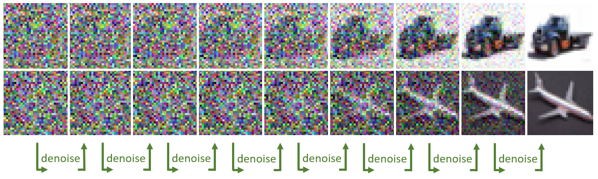
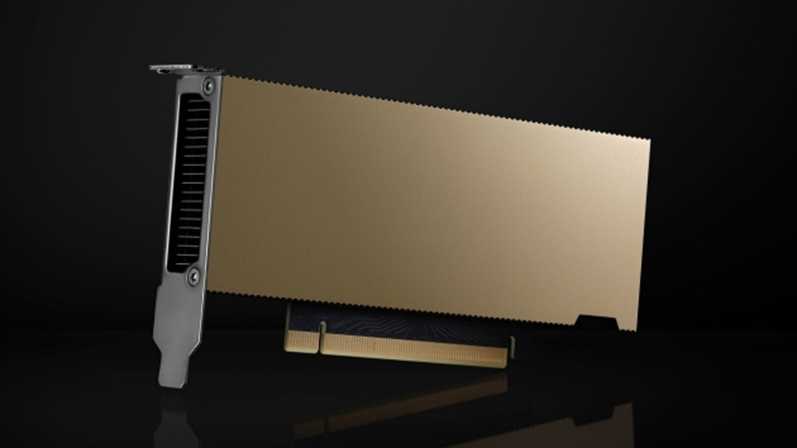
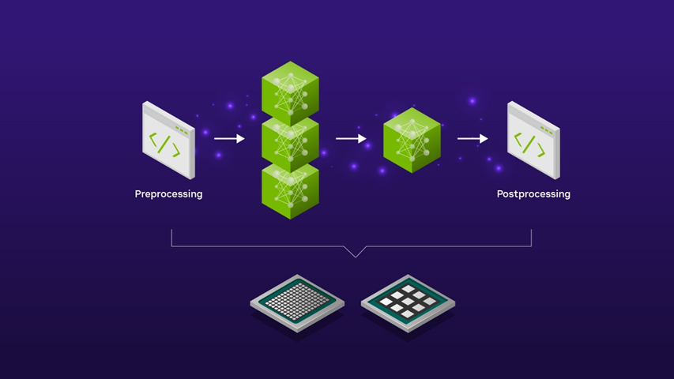
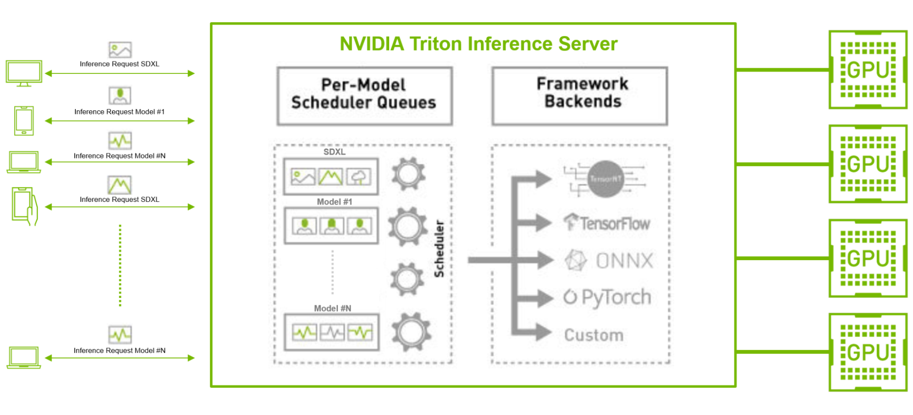

#! https://zhuanlan.zhihu.com/p/686775001
# 在 NVIDIA AI 推理平台上使用 Stable Diffusion XL 生成令人惊叹的图像


扩散模型正在改变跨行业的创意工作流程。 这些模型通过去噪扩散技术迭代地将随机噪声塑造成人工智能生成的艺术，从而基于简单的文本或图像输入生成令人惊叹的图像。 这可以应用于许多企业用例，例如创建个性化营销内容、为照片中的对象生成富有想象力的背景、设计动态的高质量环境和游戏角色等等。

虽然扩散模型可以成为增强工作流程的有用工具，但大规模部署时模型的计算量可能非常大。 在 CPU 等非专用硬件上生成单批四个图像可能需要几分钟的时间，这可能会阻碍创意流程，并成为许多希望满足严格服务级别协议 (SLA) 的开发人员的障碍。

在这篇文章中，我们将向您展示 [NVIDIA AI 推理平台](https://www.nvidia.com/en-us/deep-learning-ai/solutions/inference-platform/)如何通过[Stable Diffusion XL](https://huggingface.co/stabilityai/stable-diffusion-xl-base-1.0) (SDXL) 来解决这些挑战。 我们从企业在生产中部署 SDXL 时面临的常见挑战开始，深入探讨由 NVIDIA L4 Tensor Core GPU、NVIDIA TensorRT 和 [NVIDIA Triton 推理服务器](https://www.nvidia.com/en-us/ai-data-science/products/triton-inference-server/)提供支持的 Google Cloud G2 实例如何帮助缓解这些挑战。 我们介绍了领先的 AI 计算机视觉初创公司 Let’s Enhance 如何在 NVIDIA AI 推理平台和 Google Cloud 上使用 SDXL，使企业只需单击一下即可创建迷人的产品图像。 最后，我们提供了有关如何开始使用 Google Cloud 上的 SDXL 进行经济高效的图像生成的分步教程。

## 解决 SDXL 生产部署挑战
在生产中部署任何人工智能工作负载都会面临一系列挑战。 其中包括在现有模型服务基础设施中部署模型，通过优化推理请求的批处理来提高吞吐量和延迟，以及使基础设施成本符合预算限制。

然而，由于扩散模型对卷积神经网络的依赖、图像预处理和后处理操作的要求以及严格的企业 SLA 要求，在生产中部署扩散模型的挑战非常突出。

在这篇文章中，我们将深入研究这些方面，并探讨 NVIDIA 全栈推理平台如何帮助缓解这些问题。

## 利用 GPU 专用Tensor Core
Stable Diffusion 的核心是 U-Net 模型，该模型从噪声图像（一组随机数矩阵）开始。 这些矩阵被切成更小的子矩阵，在其上应用一系列卷积（数学运算），产生精细的、噪音较小的输出。 每个卷积都需要乘法和累加运算。 该去噪过程会迭代多次，直到获得新的、增强的最终图像。



鉴于其计算复杂性，该过程显着受益于特定类型的 GPU 核心，例如 NVIDIA Tensor 核心。 这些专用内核是从头开始构建的，旨在加速矩阵乘法累加运算，从而加快图像生成速度。

NVIDIA 通用 L4 GPU 拥有超过 200 个 Tensor Core，对于希望在生产环境中部署 SDXL 的企业来说是理想的经济高效的 AI 加速器。 企业可以通过 Google Cloud 等云服务提供商访问 L4 GPU，Google Cloud 是第一个通过其 G2 实例在云中提供 L4 GPU 的 CSP。



## 图像预处理和后处理的自动化
在使用 SDXL 的实际企业应用程序中，该模型是更广泛的 AI 管道的一部分，其中包括其他计算机视觉模型以及预处理和后处理图像编辑步骤。

例如，使用 SDXL 为新产品发布活动创建背景场景可能需要先进行初步的放大预处理步骤，然后再将产品图像输入 SDXL 模型以进行场景生成。 生成的 SDXL 图像输出可能还需要进一步的后处理，例如使用图像升级器升级到更高分辨率，然后才适合在营销活动中使用。

使用功能齐全的 AI 推理模型服务器（例如开源 [Triton 推理服务器](https://www.nvidia.com/en-us/ai-data-science/products/triton-inference-server/)）可以自动将这些不同的预处理和后处理步骤拼接到简化的 AI 管道中。 这样就无需编写手动代码或在计算环境中来回复制数据，从而引入不必要的延迟并浪费昂贵的计算和网络资源。




通过使用 Triton Inference Server 为 SDXL 模型提供服务，您可以利用模型集成功能，该功能使您能够定义如何使用低代码方法将一个模型的输出作为下一个模型的输入。 您可以选择在 CPU 上运行预处理和后处理步骤，在 GPU 上运行 SDXL 模型，或者选择在 GPU 上运行整个管道以实现超低延迟应用程序。 任一选项均可让您充分灵活地控制 SDXL 管道的端到端延迟。

## 生产环境的高效扩展
随着越来越多的企业计划将 SDXL 纳入其业务线，有效批处理传入用户请求和最大化 GPU 利用率的挑战变得越来越复杂。 这种复杂性源于需要最大限度地减少延迟以获得积极的用户体验，同时提高吞吐量以降低运营成本。

使用 TensorRT 等开源 GPU 模型优化器，再加上具有并发模型执行和动态批处理功能的推理服务器（如 Triton Inference Server），可以缓解这些挑战。

例如，考虑与其他 TensorFlow 和 PyTorch 图像分类或特征提取 AI 模型并行运行 SDXL 模型的场景，特别是在具有大量传入客户端请求的生产环境中。 在这里，SDXL 模型可以使用 TensorRT 进行编译，从而优化模型以实现低延迟推理。

Triton 推理服务器还可以通过其动态批处理和并发推理功能，有效地批处理和跨模型分发大量传入请求，无论其后端框架如何。 这种方法优化了吞吐量，使企业能够以更少的资源和更低的总拥有成本满足用户需求。



## 将普通的产品照片变成美丽的营销资产
Let’sEnhance 是一家利用 NVIDIA AI 推理平台的强大功能在生产环境中为 SDXL 提供服务的公司的一个很好的例子。 这家开创性的 AI 初创公司三年多来一直使用 Triton Inference Server 在 NVIDIA Tensor Core GPU 上部署 30 多个 AI 模型。

最近，Let’sEnhance 庆祝其最新产品 AI Photoshoot 的推出，该产品使用 SDXL 模型将普通的产品照片转换为用于电子商务网站和营销活动的美丽视觉资产。

凭借 Triton Inference Server 对各种框架和后端的强大支持，再加上其动态批处理功能集，Let's Enhance 创始人兼首席技术官 Vlad Pranskevichus 能够将 SDXL 模型无缝集成到现有的 AI 管道中，而 ML 工程团队的参与最少， 腾出时间进行研究和开发工作。

通过成功的概念验证，这家 AI 图像增强初创公司发现，通过将 SDXL 模型迁移到 Google Cloud G2 实例上的 NVIDIA L4 GPU，成本可降低 30%，并概述了到 2024 年中期完成多个管道迁移的路线图。


## 使用 L4 GPU 和 TensorRT 开始使用 SDXL
在下一部分中，我们将演示如何在 Google Cloud 的 G2 实例上快速部署 TensorRT 优化版本的 SDXL，以获得最佳性价比。 要使用 NVIDIA 驱动程序在 Google Cloud 上启动虚拟机实例，请按照以下步骤操作。

选择以下机器配置选项：

* Machine type: g2-standard-8
* CPU platform: Intel Cascade Lake
* Minimum CPU platform: None
* Display device: Disabled
* GPUs: 1 x NVIDIA L4

g2-standard-8 机器类型配备 1 个 NVIDIA L4 GPU 和 4 个 vCPU。 根据需要多少内存，可以使用更大的机器类型。

选择以下启动磁盘选项，确保选择源映像：

* Type: Balanced persistent disk
* Size: 500 GB
* Zone: us-central1-a
* Labels: None
* In use by: instance-1
* Snapshot schedule: None
* Source image: c0-deeplearning-common-gpu
* Encryption type: Google-managed
* Consistency group: None

[Google 深度学习 VM](https://console.cloud.google.com/marketplace/product/click-to-deploy-images/deeplearning?project=nvidia-ngc-public) 包含最新的 NVIDIA GPU 库。

VM 实例启动并运行后，在浏览器窗口中选择“连接”、“SSH”、“打开”和“身份验证”。 这会在浏览器窗口中加载 SSH 终端。

按照以下步骤，使用使用 TensorRT 优化的 Stable Diffusion XL 生成图像。

克隆 TensorRT OSS 存储库：
```bash
git clone https://github.com/NVIDIA/TensorRT.git -b release/9.2 --single-branch

cd TensorRT
```
安装 nvidia-docker 并启动 PyTorch 容器：

```bash
docker run --rm -it --gpus all -v $PWD:/workspace nvcr.io/nvidia/pytorch:24.01-py3 /bin/bash
```
安装最新的 TensorRT 版本：

```bash
python3 -m pip install --upgrade pip
python3 -m pip install --pre --upgrade --extra-index-url https://pypi.nvidia.com tensorrt
```
安装所需的软件包：

```bash
export TRT_OSSPATH=/workspace
export HF_TOKEN=<your_hf_token_to_download_models>
cd $TRT_OSSPATH/demo/Diffusion
pip3 install -r requirements.txt
```
现在运行TensorRT优化的Stable Diffusion XL模型，提示“装饰艺术，现实”：

```bash
python3 demo_txt2img_xl.py "art deco, realistic" --hf-token=$HF_TOKEN --version xl-1.0 --batch-size 1 --build-static-batch --num-warmup-runs 5 --seed 3 --verbose --use-cuda-graph
```
这会生成一个令人惊叹的图像，可以在notebook中查看：

```python
from IPython.display import display
from PIL import Image
img = Image.open('output/xl_base-fp16-art_deco,_-1-xxxx.png')
display(img)
```


恭喜！ 您已使用经过 TensorRT 优化的 Stable Diffusion XL 生成了示例图像。

为了提高吞吐量，您可以使用更大的机器类型，利用多达 8 个 L4 GPU 并在每个 GPU 上加载模型以实现高效的并行处理。 为了实现更快的推理，您可以调整去噪步骤数、图像分辨率或精度。 例如，将前面示例中的降噪步骤数从 30 减少到 20，可使吞吐量提高 1.5 倍图像/秒。

L4 GPU 具有出色的性价比。 与 NVIDIA A100 Tensor Core GPU 相比，它每美元生成的图像数量增加了 1.4 倍，非常适合成本敏感型应用程序和离线批量图像生成。 然而，相对于 L4，A100 或 H100 是延迟敏感型应用程序的更好选择，生成图像的速度分别快 3.8-7.9 倍。

性能取决于推理过程中的多个因素，包括批量大小、分辨率、去噪步骤和数据精度。 有关进一步优化和配置选项的更多信息，请参阅 /NVIDIA/TensorRT GitHub 存储库中的 [DemoDiffusion](https://github.com/NVIDIA/TensorRT/blob/release/9.2/demo/Diffusion/README.md) 示例。

## 使用 Triton Inference Server 在生产环境中部署 SDXL

以下介绍了如何在 g2-standard-32 机器类型上使用 Triton Inference Server 在生产环境中部署 SDXL 模型。

克隆 Triton 推理服务器教程存储库：
```bash
git clone https://github.com/triton-inference-server/tutorials.git -b r24.02 --single-branch

cd tutorials/Popular_Models_Guide/StableDiffusion 
```
构建 Triton Inference Server diffusion容器镜像：

```bash
./build.sh
```
在容器映像中运行交互式 shell。 以下命令启动容器并将当前目录挂载为工作空间：
```bash
./run.sh
```

构建Stable Diffusion XL TensorRT 引擎。 这需要几分钟的时间。

```bash
./scripts/build_models.sh --model stable_diffusion_xl
```
完成后，预期输出将如下所示：

```bash
diffusion-models
 |-- stable_diffusion_xl
    |-- 1
    |   |-- xl-1.0-engine-batch-size-1
    |   |-- xl-1.0-onnx
    |   `-- xl-1.0-pytorch_model
    `-- config.pbtxt
```

启动 Triton 推理服务器。 在这个demo中，我们使用EXPLICIT模型控制模式来控制加载哪个Stable Diffusion版本。 有关生产部署的更多信息，请参阅[安全部署注意事项](https://github.com/triton-inference-server/server/blob/main/docs/customization_guide/deploy.md)。

```bash
tritonserver --model-repository diffusion-models --model-control-mode explicit --load-model stable_diffusion_xl
```
完成后，预期输出将如下所示：

```bash
<SNIP>
I0229 20:22:22.912465 1440 server.cc:676]
+---------------------+---------+--------+
| Model               | Version | Status |
+---------------------+---------+--------+
| stable_diffusion_xl | 1       | READY  |
+---------------------+---------+--------+
<SNIP>/sy
```

在单独的交互式 shell 中启动一个新容器来运行示例 Triton Inference Server 客户端。 以下命令启动容器并将当前目录挂载为工作空间：

```bash
./run.sh
```
将提示发送到 Stable Diffusion XL：

```bash
python3 client.py --model stable_diffusion_xl --prompt "butterfly in new york, 4k, realistic" --save-image
```


恭喜！ 您已成功使用 Triton 部署 SDXL。

## 使用 Triton Inference Server 进行动态批处理
启动并运行基本的 Triton 推理服务器后，您现在可以增加 `max_batch_size` 参数以启用动态批处理。

如果 Triton 推理服务器正在运行，请将其停止。 可以通过在交互式 shell 中输入 CTRL-C 来停止服务器。

编辑模型配置文件 `./diffusion-models/stable_diffusion_xl/config.pbtxt`，将批量大小增加到 2：

* 之前：max_batch_size：1
* 之后：max_batch_size：2

重建批量大小为 2 的 TRT 引擎。需要几分钟。

```bash
./scripts/build_models.sh --model stable_diffusion_xl
```
完成后，预期输出将如下所示：

```bash
diffusion-models
|-- stable_diffusion_xl
   |-- 1
   |   |-- xl-1.0-engine-batch-size-2
   |   |-- xl-1.0-onnx
   |   `-- xl-1.0-pytorch_model
   `-- config.pbtxt
```
重新启动 Triton 推理服务器：

```bash
tritonserver --model-repository diffusion-models --model-control-mode explicit --load-model stable_diffusion_xl
```
完成后，预期输出将如下所示：

```bash
<SNIP>
I0229 20:22:22.912465 1440 server.cc:676]
+---------------------+---------+--------+
| Model               | Version | Status |
+---------------------+---------+--------+
| stable_diffusion_xl | 1       | READY  |
+---------------------+---------+--------+
<SNIP>
```
向服务器发送并发请求。 为了使服务器能够动态批处理多个请求，必须有多个客户端并行发送请求。 示例客户端使您能够增加客户端数量以了解动态批处理的优势。

```bash
python3 client.py --model stable_diffusion_xl --prompt "butterfly in new york, 4k, realistic" --clients 2 –requests 5
```
检查服务器日志和指标。 启用动态批处理、并发请求和信息级日志记录后，该示例将打印出有关 TensorRT 引擎的每个请求中包含的提示数量的附加信息。
```bash
57291 │ I0229 20:36:23.017339 2146 model.py:184] Client Requests in Batch:2
57292 │ I0229 20:36:23.017428 2146 model.py:185] Prompts in Batch:2
```

## 总结
在 NVIDIA AI 推理平台上部署 SDXL 可为企业提供可扩展、可靠且经济高效的解决方案。

TensorRT 和 Triton 推理服务器都可以释放性能并简化生产就绪部署，并作为 [NVIDIA AI Enterprise](https://console.cloud.google.com/marketplace/product/nvidia/nvidia-ai-enterprise-vmi?project=nvidia-ngc-public) 的一部分包含在 Google Cloud Marketplace 上。 AI Enterprise 提供 NVIDIA 支持服务以及支持 AI 推理的开源容器和框架的企业级稳定性、安全性和可管理性。

企业开发人员还可以选择使用 [NVIDIA Picasso](https://www.nvidia.com/en-us/gpu-cloud/picasso/)（视觉内容定制生成 AI 的代工厂）来训练、微调、优化和推断扩散基础模型。

SDXL 作为 NVIDIA AI 基础模型的一部分并在 NGC 目录中提供。 它提供了易于使用的界面，可直接从浏览器快速尝试 SDXL。


我将在 NVIDIA GTC 大会期间为大家带来免费中文在线解读：

NVIDIA CUDA 最新特性以及生成式 AI 相关内容，包括 Stable Diffusion 模型部署实践，以及介绍用于视觉内容生成的 Edify 模型，点击链接了解详情并注册参会：

https://www.nvidia.cn/gtc-global/session-catalog/?search=WP62435%20WP62832%20WP62400&ncid=ref-dev-945313#/


