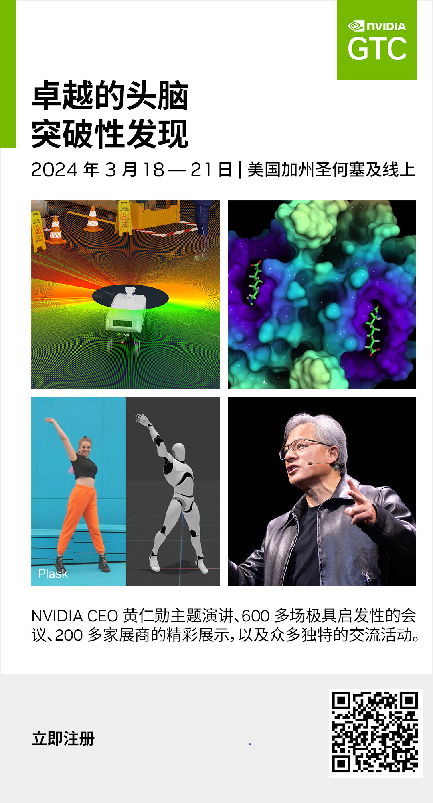
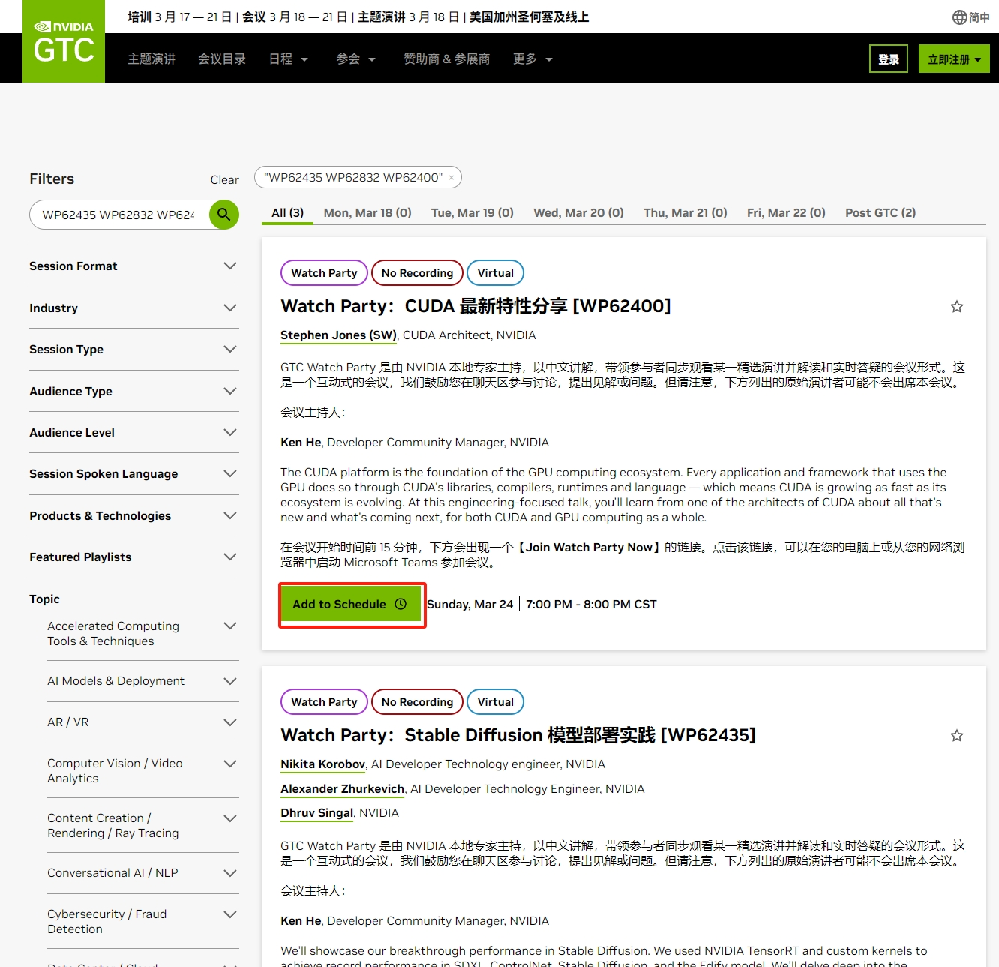
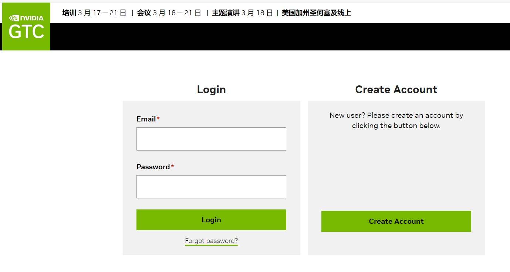
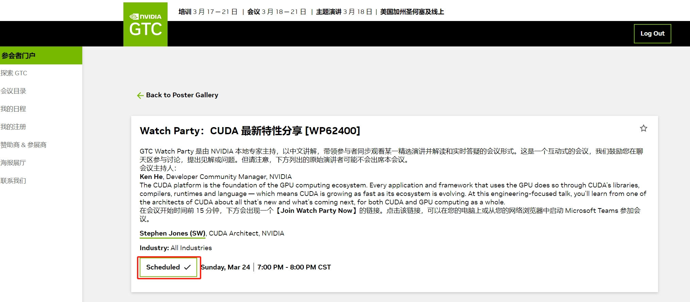

#! https://zhuanlan.zhihu.com/p/687502247
# 2024年NVIDIA GPU技术大会开发者合集

我专门为开发者整理了NVIDIA GPU技术大会上专注技术的内容合集, 希望可以帮助开发者朋友们快速了解NVIDIA的最新技术.

**首先, 注册NVIDIA GPU 技术大会**:

您可以访问: https://www.nvidia.cn/gtc-global/?ncid=ref-dev-945313

或者扫描下面的二维码注册GPU技术大会

## 如何登录和预约会议

#### 步骤一,进入会议链接

点击下面会议的[链接](https://www.nvidia.cn/gtc-global/session-catalog/?search=WP62435%20WP62832%20WP62400&ncid=ref-dev-945313#/)或者在浏览器中打开下面的链接(这里用**CUDA最新特性分享**的会议举例):

https://www.nvidia.cn/gtc-global/session-catalog/?search=WP62435%20WP62832%20WP62400&ncid=ref-dev-945313#/

点击“**Add to Schedule**”绿色按钮登录

#### 步骤二, 注册免费参会

通过左侧对话框登录，如果没有注册,请点击右边的"**Create Account**"绿色按钮

#### 步骤三, 成功预约

登录后，跳转到所选演讲的页面，

点击“**Add to Schedule**”绿色按钮预约该演讲

状态变为“**Scheduled**”即预约成

## 合集分类

### LLM 大语言模型/生成式AI 专场

1. 专门为中国开发者举办的[China AI DAY](https://www.nvidia.cn/gtc-global/sessions/china-ai-day/?ncid=so-wech-863176-vt04)

    NVIDIA 携手国内领先的云和互联网， 分享 NVIDIA 最新架构、软硬件协同优化的 LLM 全栈解决方案，从架构、训练、推理、量化，助力 LLM 性能极致优化；叠加 RAG 等开发工具链，基于 LLM 的创新不断涌现，本论坛也将展现 LLM 在互联网核心应用、芯片设计、消费电子领域的案例。

2. [使用 Triton Inference Server 部署、优化大型语言模型并对其进行基准测试 [S62531]](https://www.nvidia.cn/gtc-global/session-catalog/?search=S62531&ncid=ref-dev-945313#/)

    通过分步说明了解如何使用 Triton Inference Server 高效地服务大型语言模型 (LLM)。 NVIDIA Triton 推理服务器是一款开源推理服务解决方案，可大规模简化 AI 模型的生产部署。 借助统一的界面和标准的指标集，开发人员可以在多种类型的硬件（CPU 和 图形处理器）。 我们将回顾为法学硕士提供服务的挑战，并演示 Triton Inference Server 的最新功能如何帮助克服这些挑战。 我们将介绍如何跨多个后端轻松部署 LLM 并比较其性能，以及如何微调部署配置以获得最佳性能。 我们将提供分步说明，供任何人使用公开可用的资料来遵循，并在此过程中回答问题。

3. [利用 Hugging Face 和 NVIDIA 构建加速 AI [S63149]](https://www.nvidia.cn/gtc-global/session-catalog/?search=S63149&ncid=ref-dev-945313#/)

    在本次会议中，产品主管 Jeff Boudier 将带您了解最新的 Hugging Face 工具，以使用开源并利用 NVIDIA GPU 可用的最佳技术来构建加速 AI，包括使用 Optimum-NVIDIA 和 TRT 在 H100 上的 FP8 中部署大型语言模型 -LLM，使用 AutoTrain 和 DGX Cloud 训练您自己的生成式 AI 模型。

4. [LLMOps：机器学习操作的新前沿 [S62458]](https://www.nvidia.cn/gtc-global/session-catalog/?search=S62458&ncid=ref-dev-945313#/)
    
    深入了解 LLMOps 的世界，这是用于管理生产中大型语言模型 (LLM) 的下一代解决方案。 LLMOps 以 MLOps 的核心能力为基础，引入了专门针对LLM独特挑战的专业工具和服务。 通过构建 ChipNeMo 的真实案例研究，重温 LLMOps 之旅。ChipNeMo 是一种电子设计自动化 (EDA) 定制 LLM，通过将最新的生成式 AI 功能融入芯片设计流程，帮助 NVIDIA 保持领先地位。 发现并了解 LLMOps 为企业带来的新功能、道德考虑和变革潜力。 在机器学习操作中保持领先地位，加入我们，探索令人兴奋的人工智能新领域。

5. [使用 TensorRT-LLM 优化和扩展 LLM 以生成文本 [S61775]](https://www.nvidia.cn/gtc-global/session-catalog/?search=S61775&ncid=ref-dev-945313#/)
    
    大型语言模型 (LLM) 的前景正在迅速发展。 随着模型参数和规模的增加，优化和部署 LLM 进行推理变得非常复杂。 这需要一个具有更好 API 支持的框架，以便于扩展，而不太强调内存管理或 CUDA 调用。 了解我们如何使用 NVIDIA 的解决方案套件来优化 LLM 模型并在多 GPU 环境中进行部署。

6. [扩展和优化您的 LLM 流程以提高端到端效率 [S62006]](https://www.nvidia.cn/gtc-global/session-catalog/?search=S62006&ncid=ref-dev-945313#/)
   
   您在让语言模型 (LLM) 在您的组织中发挥作用时遇到困难吗？ 你不是一个人。 我们将了解如何在 GKE 上部署开源语言模型。 我们将向数据科学家和机器学习工程师展示如何将 NeMo 和 TRT-LLM 与 GKE 笔记本结合使用。 此外，GKE 还具有独特的能力，可以帮助高效、便捷地编排 AI 工作负载。 我们还将演示如何使用 NeMo 训练和调整语言模型，并进行现场技术演示，展示数据科学团队如何使用 TRT LLM 和 GKE 在 GPU 上推断这些模型。

7. [利用 NVIDIA DRIVE 上的大型语言模型和视觉语言模型推进汽车人工智能 [SE63017]](https://www.nvidia.cn/gtc-global/session-catalog/?search=SE63017&ncid=ref-dev-945313#/)
    
    如今，在 NVIDIA DRIVE 上运行的大型语言和视觉语言模型正在重新定义下一代汽车。 车辆驾驶舱正在成为一种全新的体验：与车辆的交互将不再是触摸屏和语音命令，而是更加直观的自然语言交互，使驾驶员能够像人类副驾驶一样管理车辆。 除了驾驶舱之外，LLM 和 VLM 在高级驾驶辅助和自动驾驶汽车应用方面也显示出非常有前景的成果。 他们基于大量文本数据对交通机制进行建模的能力是解决新的、看不见的驾驶场景的关键。 我们将解释汽车用例的 LLM 基础知识，并展示如何使用 TensorRT-LLM 在 NVIDIA DRIVE Orin 上部署和运行 LLM。

8. [使用 NVIDIA NeMo 以多种语言自定义基础大型语言模型 [S62743]](https://www.nvidia.cn/gtc-global/session-catalog/?search=S62743&ncid=ref-dev-945313#/)
   
   我们将专注于为英语以外的语言定制基础大语言模型 (LLM)。 我们将介绍提示工程、提示调整、参数高效微调和监督指令微调 (SFT) 等技术，使LLM能够适应不同的用例。 我们将使用适用于 NVIDIA 基础模型和其他社区模型（例如 Llama-2）的 NVIDIA NeMo 框架来展示其中一些技术。 最后，我们将演示如何使用 NVIDIA TensorRT-LLM 和 NVIDIA Triton 推理服务器高效部署定制模型。

9. [使用 TensorRT-LLM 加速 LLM 推理 [S62031]](https://www.nvidia.cn/gtc-global/session-catalog/?search=S62031&ncid=ref-dev-945313#/)

    NVIDIA 软件技术在构建我们在 A100 和 H100 GPU 上服务产品的优化大语言模型 (LLM) 方面发挥了重要作用。 我们将深入探讨如何利用 TensorRT-LLM 来实现模型服务产品的关键功能，并重点介绍 TensorRT-LLM 的有用功能，例如令牌流、运行中批处理、分页注意力、量化等 。 我们还将讨论如何增强 TensorRT-LLM，通过利用不同形式的量化、量化后的质量评估以及许多其他功能来加速内部和开源模型架构的托管，从而实现行业领先的成本和性能。

10. [NVIDIA LLM 全栈式方案使用和优化最佳实践 [SE63216]](https://www.nvidia.cn/gtc-global/session-catalog/?search=SE63216&ncid=ref-dev-945313#/)
    
    介绍基于 NVIDIA LLM 训练，推理和部署全栈式解决方案的使用和优化的最佳实践。重点介绍 Megatron-Core、TensorRT-LLM 和 Triton Inference Server。Megatron-Core 是 NVIDIA 加速 LLM 大规模训练库，开发者可以基于它构建自己的 LLM 训练框架；TensorRT-LLM 是 NVIDIA 加速 LLM 推理的解决方案，开发者利用 TensorRT-LLM 可以在 GPU 上轻松取得 SOTA LLM 推理性能；Triton Inference Server 是 NVIDIA 部署推理服务的解决方案，它可以极大地简化基于 LLM 服务的部署，还包括了调度层的性能优化。

11. [LLM 推理：端到端推理系统基准测试 [S62797]](https://www.nvidia.cn/gtc-global/session-catalog/?search=S62797&ncid=ref-dev-945313#/)

    通过了解大语言模型 (LLM) 推理规模的关键指标，了解如何为您的 AI 计划选择正确的路径。 本演讲将为您提供必要的工具，通过剖析 LLM 推理基准和比较配置来优化性能。 我们将演示如何利用 NVIDIA 的软件生态系统通过支持各种推理抽象层来提升您的 AI 应用程序。 我们将分享最佳实践和技巧，让您为 LLM 推理项目带来无与伦比的效率和效果。

12. [通过 TensorRT-LLM 和 TensorRT 中的量化来优化生成式 AI 推理 [S63213]](https://www.nvidia.cn/gtc-global/session-catalog/?search=S63213&ncid=ref-dev-945313#/)

    由于大规模运行人工智能模型的推理成本很高，因此优化技术对于降低推理成本至关重要。 我们的教程介绍了 TensorRT 模型优化工具包——NVIDIA 的算法模型优化网关。 TensorRT 模型优化工具包提供了一组最先进的量化方法，包括 FP8、Int8、Int4 和混合精度以及硬件加速稀疏性，并将这些方法与最先进的 NVIDIA 部署解决方案（例如 TensorRT-LLM）连接起来 。 本教程包括使用 TensorRT-LLM 的语言模型和使用 TensorRT 的稳定扩散模型的端到端优化到部署演示。

13. [使用大型语言模型接口增强视觉 AI 以提高生产力 [S62394]](https://www.nvidia.cn/gtc-global/session-catalog/?search=S62394&ncid=ref-dev-945313#/)

    物联网机器生成大量遥测数据，通过视频分析模型，可以轻松理解这些数据并生成推论。 Vision AI 引擎分析 Vision AI 元数据并提供索引，聚合分析数据。 大语言模型 (LLM) + 检索增强生成 (RAG) 可用于从已部署的物联网传感器及其遥测元数据以及来自 Vision AI 的信息中提取开发人员所需的精确见解。 在本次会议中，了解如何使用定制领域特定数据来增强LLM，以便为自然语言交互提供相关的上下文响应。 这可以通过使用 RAG 解决方案来完成，该解决方案使用知识库和用户提示来生成极其准确的答案。

14. [使用 NVIDIA AI 构建 LLM RAG 的最佳实践 [SE62831]](https://www.nvidia.cn/gtc-global/session-catalog/?search=SE62831&ncid=ref-dev-945313#/)
    
    加入观看最具创造力的开发人员使用 NVIDIA AI Foundation 模型推销他们的前沿检索增强生成 (RAG) 方法。 RAG 是一种利用从内部和外部数据源获取的事实来提高生成式 AI 模型的准确性和可靠性的技术。 几乎所有企业都可以将其技术或政策手册、视频或日志转化为称为知识库的资源，从而增强大型语言模型 (LLM)。 这些来源可以支持客户服务、代码生成或copilots等用例。

15. [NVIDIA 面向大语言模型的全栈 AI 解决方案 [SE63215]](https://www.nvidia.cn/gtc-global/session-catalog/?search=SE63215&ncid=ref-dev-945313#/)

    本演讲将深入探讨如何创建为大语言模型（LLM）设计的稳定、健壮且高效的数据中心架构。我们将利用 NVIDIA LLM 训练框架、Transformer Engine 上的 FP8 训练以及多精度训练（MPT）的能力，揭开 NVIDIA 针对 LLM 的全栈软件和硬件整体流水线的神秘面纱。此外，我们还将讨论 NVIDIA 训练和推理解决方案的最佳实践，包括 NVIDIA TensorRT、TensorRT-LLM、Triton Inference Server 等，所有这些都是 NVIDIA AI Enterprise 套件的 AI 组件。这些内容将让您全面了解如何在 NVIDIA 加速的基础设施中优化 LLM 性能。

16. [Transformer 引擎和 FP8 训练的新增功能 [S62457]](https://www.nvidia.cn/gtc-global/session-catalog/?search=S62457&ncid=ref-dev-945313#/)

    该课程将包括 FP8 和混合精度训练的介绍、Transformer Engine 新功能的概述、框架集成以及有关如何使用该库加速 LLM 训练的代码演示。

17. [大模型结合 RAG 构建客服场景自动问答 [SE63229]](https://www.nvidia.cn/gtc-global/session-catalog/?search=SE63229&ncid=ref-dev-945313#/)
    

### CUDA专场:

1. [CUDA: 最新特性和发展方向 [S62400]](https://www.nvidia.cn/gtc-global/session-catalog/?search=S62400&ncid=ref-dev-945313#/)
   
   CUDA平台是GPU计算生态系统的基础。 每个使用 GPU 的应用程序和框架都是通过 CUDA 的库、编译器、运行时和语言来实现的，这意味着 CUDA 的发展速度与其生态系统的发展速度一样快。 在这场以工程为重点的演讲中，您将从 CUDA 架构师之一那里了解 CUDA 和 GPU 计算整体的所有新增功能以及接下来的发展趋势。

2. [如何编写CUDA程序: The Ninja Edition [S62401]](https://www.nvidia.cn/gtc-global/session-catalog/?search=S62401&ncid=ref-dev-945313#/)

    与 CUDA 架构师一起深入探讨如何将应用程序映射到大规模并行计算机上，涵盖一系列旨在充分利用 GPU 的不同技术。 我们将介绍并行程序设计的原理，并将它们与 GPU 编程的细节联系起来，以了解一切如何协同工作。 本次会议是一系列年度讲座的下一部分，旨在探讨 CUDA 编程的具体细节（尽管不要求看过过去的会议）。 去年的目标是开始； 今年更多关注的是熟悉编程的人——甚至可能有点熟悉 CUDA——但应该能为每个对 GPU 开发感兴趣的人提供信息。

3. [掌握 CUDA C++: CUDA C++ 核心库的现代最佳实践 [S62175]](https://www.nvidia.cn/gtc-global/session-catalog/?search=S62175&ncid=ref-dev-945313#/)
    现代 CUDA C++ 开发注重性能、安全性和适应性。 为了实现这些目标，了解正确的工具和库至关重要。 我们将重点关注编写一流 CUDA C++ 代码的艺术，重点介绍 CUDA C++ 核心库 (CCCL)（Thrust、CUB 和 libcudacxx）如何成为您的盟友。 您还将学习如何使用 CMake 来简化 CUDA C++ 项目的构建。 最后，您将掌握可操作的技术和见解来编写以光速执行的 CUDA C++ 代码，同时还具有可维护性和健壮性。 加入我们，提高您的技能，并将您的 CUDA C++ 项目提升到新的水平。

### 计算机视觉专场

1. [使用大型语言模型接口增强视觉 AI 以提高生产力 [S62394]](https://www.nvidia.cn/gtc-global/session-catalog/?search=S62394&ncid=ref-dev-945313#/)

    物联网机器生成大量遥测数据，通过视频分析模型，可以轻松理解这些数据并生成推论。 Vision AI 引擎分析 Vision AI 元数据并提供索引，聚合分析数据。 大语言模型 (LLM) + 检索增强生成 (RAG) 可用于从已部署的物联网传感器及其遥测元数据以及来自 Vision AI 的信息中提取开发人员所需的精确见解。 在本次会议中，了解如何使用定制领域特定数据来增强LLM，以便为自然语言交互提供相关的上下文响应。 这可以通过使用 RAG 解决方案来完成，该解决方案使用知识库和用户提示来生成极其准确的答案。

2. [彻底改变视觉 AI：从 2D 到 3D 世界 [S62724]](https://www.nvidia.cn/gtc-global/session-catalog/?search=S62724&ncid=ref-dev-945313#/)

    视觉人工智能正在以以前难以想象的方式彻底改变行业，取得突破性的进步。讨论视觉人工智能从像素到生成人工智能和 3D 世界的重大演变。 聆听真正专家的意见并在竞争中保持领先地位。

3. [适用于云规模视觉 AI 服务的流视频处理 [S61437]](https://www.nvidia.cn/gtc-global/session-catalog/?search=S61437&ncid=ref-dev-945313#/)

    基于人工智能的计算机视觉 (CV) 的实时云规模应用正在快速增长，视频数据现已成为消费者互联网流量的主要组成部分。 因此，为视频处理工作负载构建高性能且经济高效的云解决方案至关重要。 现有的解决方案在视频编码/解码、前/后处理和推理的重量级框架中具有很高的互操作成本。 作为范式转变，我们将利用 NVIDIA 的 Triton 推理服务器和轻量级 NVIDIA CV 核心组件，深入研究流式视频处理原型，展示更快的部署和更好的可扩展性。 此外，Netflix 专家将与我们一起讨论他们使用优化的新颖视频应用程序。

4. [由 DeepStream 驱动的视觉人工智能革命 [S62624]](https://www.nvidia.cn/gtc-global/session-catalog/?search=S62624&ncid=ref-dev-945313#/)

    视觉人工智能领域需要用于构建可扩展的高性能应用程序的工具，这些应用程序利用最先进的 GPU 驱动的推理。 开发此类应用程序有两种主要方法： - 利用硬件加速库的 API - 使用软件框架。 本演示将探讨这两种方法之间的权衡，并介绍 NVIDIA DeepStream Libraries 的一项新功能，该功能首次添加了对这两种方法的支持。 了解新的 DeepStream Libraries Python API 如何帮助开发人员在不依赖框架的情况下利用 GPU 加速的视觉 AI 功能。 您还将了解利用 GStreamer 框架的最新 DeepStream SDK：一种简化 GStreamer 使用的新颖编程模型、用于管道管理的 REST-API、支持与 BEVFusion 模型的传感器融合以及用于优化 DeepStream 管道的开发人员工具。 加入我们，利用最新的 DeepStream 创新来推进您的 Vision-AI 开发。

5. [学习逼真 3D 数字人类的 AI [S62511]](https://www.nvidia.cn/gtc-global/session-catalog/?search=S62511&ncid=ref-dev-945313#/)

    传统上，创建 3D 数字人类需要数字艺术家的长期努力，并且通常需要使用特殊的多视图扫描仪进行昂贵的 3D 扫描。 了解最新的生成式 AI 技术如何从一系列野外 2D 图像（例如互联网照片）中学习逼真的 3D 表示。 我们将深入研究我们最近的工作“EG3D”，它可以实时合成各种逼真的 3D 人体。 我们还将展示如何使用来自预训练 3D 生成模型的 3D 合成数据来训练另一个 AI 模型，以执行具有挑战性的图像合成任务。 为此，我们展示了我们最近的工作“LP3D”，它可以从单个 RGB 图像实时合成真实感神经辐射场 (NeRF) 模型。 我们将演示这些人工智能驱动的人体合成方法如何使任何人都可以使用 3D 视频会议等高级功能，并在未来启用新的应用程序。

6. [世界上最快的稳定扩散[S62435]](https://www.nvidia.cn/gtc-global/session-catalog/?search=S62435&ncid=ref-dev-945313#/)

    我们将展示我们在稳定扩散方面的突破性性能。 我们使用 NVIDIA TensorRT 和自定义内核在 SDXL、ControlNet、Stable Diffusion 和 Edify 模型中实现了创纪录的性能。 我们将深入研究使用 TensorRT 为 genAI 构建高性能推理管道的复杂性，以及 DevTech 工程师用来创建峰值性能 GPU 内核的丰富工具生态系统。 DevTech 工程师的详细介绍将涵盖整个过程：从框架到将优化内核精确集成到 ONNX 图中，再到 TensorRT 引擎构建过程的最后阶段。 最后，我们将演示如何通过 NVIDIA Picasso 服务（NVIDIA 用于生成 AI 的尖端无服务器 API）来利用这种加速。

7. [OpenUSD 简介 [S62642]](https://www.nvidia.cn/gtc-global/session-catalog/?search=S62642&ncid=ref-dev-945313#/)

    通用场景描述不仅仅是一种文件格式。 这个开放、强大、易于扩展的世界合成框架具有用于在高度复杂的 3D 场景中创建、编辑、查询、渲染、模拟和协作的 API。 NVIDIA 继续投资，帮助推动媒体和娱乐以外的工作流程的美元发展，以实现工业数字化工作流程以及下一波计算机视觉和生成式 AI。 参加本次会议，了解 NVIDIA 的最新进展以及我们的下一个重大里程碑。

8. [从概念到创造：使用 TAO 和 DeepStream SDK 进行视觉 AI 应用程序开发 [SE62936]](https://www.nvidia.cn/gtc-global/session-catalog/?search=SE62936&ncid=ref-dev-945313#/)

    本次会议将深入探讨 NVIDIA TAO Toolkit 和 DeepStream SDK 用于视觉 AI 应用开发的强大组合。 我们将指导您完成使用 TAO 训练模型的过程，然后使用 DeepStream 在自定义应用程序中部署和优化这些模型。 该会议强调实际应用，提供开发强大、高效的视觉人工智能解决方案的见解。

9. [NVIDIA GPU 视频技术：新功能、改进和云 API [S61767]](https://www.nvidia.cn/gtc-global/session-catalog/?search=S61767&ncid=ref-dev-945313#/)
    概述 NVIDIA GPU 视频技术 SDK（视频编解码器和光流 SDK）中添加的新功能更新、质量改进和新云 API。 新功能和云 API 旨在促进本机和云应用程序中 GPU 硬件视频编解码器加速器 NVENC 和 NVDEC 的质量提高和高效利用。 您应该熟悉视频编码概念和Video Codec SDK的API。 我们将涵盖以下主题： 
    * 使用高级编码工具提高视频编码质量的新 API； 
    * 新的视频编码/解码 API：Vulkan 视频、DirectX 12； 
    * 如何使用云进行视频编码/解码：容器和微服务； 
    * 用于NVENC/NVDEC 分析和优化的新工具； 
    * 使用GPU在可信执行环境中进行机密计算，包括视频解码； 
    * 视频编解码器功能路线图；
    * 光流 SDK 的最新更新

### 语音/对话专场

1. [基于 NVIDIA Omniverse、AIGC 和 LLM 构建互动化身世界 [S62294]](https://www.nvidia.cn/gtc-global/session-catalog/?search=S62294&ncid=ref-dev-945313#/)

    随着大型语言模型和人工智能生成内容（AIGC）技术的出现，构建更加智能、沉浸式、交互式的数字人类成为可能。 我们将与出门问问这家主要专注于语音人工智能和生成式人工智能技术的公司一起讨论制作交互式数字化身的挑战，包括如何复制一个人的声音、表情和一般行为，以及如何对人类的反应做出反应。 问题或命令。 参加本次会议的目的是： 
    * 了解如何通过 Omniverse Audio2Face 驱动和渲染实时、逼真的数字人类。 
    * 了解如何利用语音和对话式人工智能功能创建交互式自主化身，例如 RIVA、在三秒内克隆语音的 Mobvoi TTS 服务、ChatGLM。 
    * 了解我们将AIGC/LLM 技术与数字化身相结合的探索，例如视频/动作生成、命令理解和代码生成。 
    * 深入了解如何在虚幻引擎中组合 Audio2Face。

2. [通过检索增强生成构建生成式 AI 应用程序 [CWE62682]](https://www.nvidia.cn/gtc-global/session-catalog/?search=CWE62682&ncid=ref-dev-945313#/)

    与 NVIDIA 技术产品经理、工程师和解决方案架构师一起参加此交互式支持会议，您可以在其中了解使用大型语言模型和检索增强生成 (RAG) 将生成式 AI 连接到企业知识库中的资源的最佳实践。

3. [使用 NVIDIA NeMo 以多种语言自定义基础大型语言模型 [S62743]](https://www.nvidia.cn/gtc-global/session-catalog/?search=S62743&ncid=ref-dev-945313#/)
   
   我们将专注于为英语以外的语言定制基础大语言模型 (LLM)。 我们将介绍提示工程、提示调整、参数高效微调和监督指令微调 (SFT) 等技术，使LLM能够适应不同的用例。 我们将使用适用于 NVIDIA 基础模型和其他社区模型（例如 Llama-2）的 NVIDIA NeMo 框架来展示其中一些技术。 最后，我们将演示如何使用 NVIDIA TensorRT-LLM 和 NVIDIA Triton 推理服务器高效部署定制模型。

4. [检索增强生成：设计系统、数据和定制概述 [S62744]](https://www.nvidia.cn/gtc-global/session-catalog/?search=S62744&ncid=ref-dev-945313#/)

    利用 NVIDIA 技术探索检索增强生成 (RAG) 的潜力。 RAG 系统通过从大型语料库中检索相关文档段落，将信息检索和生成模型结合起来，然后将它们用作生成详细答案的上下文。 我们将介绍端到端 RAG 系统的设计，包括数据准备以及检索器和生成器模型。 我们将展示使用 NVIDIA TensorRT-LLM 和 NeMo 的 RAG 系统示例。 我们将介绍针对特定任务的 RAG 模型评估和定制。

### 边缘计算/机器人专区

1. [在 Jetson 上开发高性能 AI 应用程序流程的最佳实践 [SE62932]](https://www.nvidia.cn/gtc-global/session-catalog/?search=SE62932&ncid=ref-dev-945313#/)

    在本次会议中，我们将介绍在 Jetson 上编写高效 AI 管道的所有提示和技巧。 我们将涵盖与电源管理、内存管理、多媒体和相机 API、不同 IPC 机制等相关的主题。 您将获得成为专业 Jetson 开发人员所需的大量知识。 作为先决条件，我们希望您拥有 NVIDIA Jetson 的使用经验，并且至少了解 NVIDIA JetPack SDK 的入门知识。

2. [通过 Jetson 的 Metropolis 微服务将生成式 AI 和视觉 AI 引入边缘生产 [SE62941]](https://www.nvidia.cn/gtc-global/session-catalog/?search=SE62941&ncid=ref-dev-945313#/)

    了解适用于 Jetson 的最新 NVIDA Metropolis 微服务以及构建边缘应用程序的新云原生方法。 了解如何构建强大的视觉 AI 应用程序、从云端管理您的 Jetson 应用程序以及使用您自己的微服务自定义您的应用程序。

3. [在边缘计算中的生成式 AI 入门 [SE62935]](https://www.nvidia.cn/gtc-global/session-catalog/?search=SE62935&ncid=ref-dev-945313#/)

    在 Jetson Orin 平台上开始您的生成式 AI 之旅。 在本次会议中，参与者将学习基础知识，从刷新设备到安装和启动带有预训练模型的生成式 AI 示例。 在不到一个小时的时间里，即使是那些刚接触生成式人工智能的人也会了解如何将这些模型应用到实际的工业用例中，获得探索边缘人工智能的变革潜力所需的技能和信心。 

4. [使用 Isaac ROS 进行基于人工智能的机器人开发简介 [SE62934]](https://www.nvidia.cn/gtc-global/session-catalog/?search=SE62934&ncid=ref-dev-945313#/)

    Isaac ROS 是用于构建高性能机器人解决方案的硬件加速包 (GEM) 的集合。 Isaac ROS 针对 NVIDIA GPU 和 NVIDIA Jetson 进行了优化，提供用于机器人感知的模块化软件包，并可轻松集成到现有的基于 ROS 2 的应用程序中。 本演讲简要概述了 Isaac ROS GEM 以及如何在机器人管道中使用多个 GEM。 

### 网络专区

1. [面向无限可扩展的高性能 AI 网络 [SE62701]](https://www.nvidia.cn/gtc-global/session-catalog/?search=SE62701&ncid=ref-dev-945313#/)
    
    数据中心已成为新的计算单元，网络定义现代数据架构的趋势已经明朗，人工智能平台对于算力的需求无上限，网络决定了数据中心的总性能和扩展性，这需要全新的高性能、可扩展、多业务性能隔离、高安全可靠的网络规范，才能满足人工智能工作负载的无限算力需求。在此，我们将深入探讨人工智能网络 - InfiniBand 网络和 Spectrum-X 网络的核心技术实现及其正在发挥的重要作用，重构以数据中心为计算单元的全新 AI 计算平台。

2. [进入人工智能网络创新新领域 [S62293]](https://www.nvidia.cn/gtc-global/session-catalog/?search=S62293&ncid=ref-dev-945313#/)
   
   NVIDIA Quantum InfiniBand 和 Spectrum-X 以太网已成为大规模训练和部署 AI 的事实上的网络标准。 InfiniBand 通过网络内计算、超低延迟和高效带宽实现了无与伦比的性能，有助于创建更大、更复杂的基础模型。 Spectrum-X 作为第一个能够支持 AI 基础设施的以太网平台，已为超大规模 AI 云和企业提供针对生成式 AI 优化的网络。 我们将深入探讨 NVIDIA Quantum InfiniBand 和 Spectrum-X 以太网平台的最新创新及其在下一代 AI 数据中心设计中的重要作用。

3. [人工智能网络的最佳实践：云服务提供商的观点 [S62447]](https://www.nvidia.cn/gtc-global/session-catalog/?search=S62447&ncid=ref-dev-945313#/)

    网络定义了数据中心，高性能网络是成功训练和大规模部署基础模型、LLM 和生成式 AI 等 AI 工作负载的关键。 网络必须提供高效带宽、低尾延迟和性能隔离，同时还支持云原生操作和管理所需的功能。 在本次小组讨论中，领先的云服务提供商将分享影响 AI 数据中心构建的考虑因素和挑战，以及他们如何利用 NVIDIA Quantum InfiniBand 和 NVIDIA Spectrum-X 以太网解决这些挑战。

## 开发者社区中文讲解专区

NVIDIA 企业开发者社区 **李奕澎** 老师将在 NVIDIA GTC 大会期间为大家带来免费中文在线解读大语言模型新技术，包括：

* RAG 检索增强生成 - 设计系统、数据和定制概述使用，
* NVIDIA NeMo 定制多语言的大语言模型
* 大语言模型的理想方案: 平衡准确性、延迟和成本提升性能，

点击链接免费报名参会：

https://www.nvidia.cn/gtc-global/session-catalog/?search=WP62744a%20WP62743%20WP62163&ncid=ref-dev-945313#/

NVIDIA 企业开发者社区 **何琨** 老师将在 NVIDIA GTC 大会期间为大家带来免费中文在线解读：
* NVIDIA CUDA 最新特性
* 包括 Stable Diffusion 模型部署实践
* 介绍用于视觉内容生成的 Edify 模型

点击链接了解详情并注册参会：
https://www.nvidia.cn/gtc-global/session-catalog/?search=WP62435%20WP62832%20WP62400&ncid=ref-dev-945313#/

