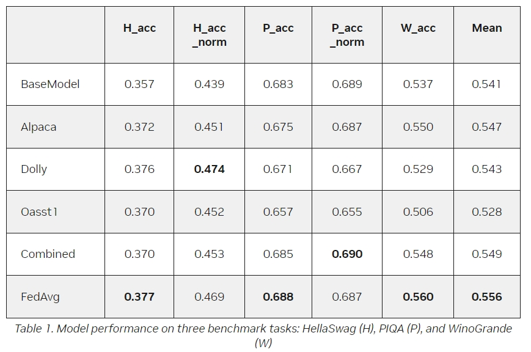

#! https://zhuanlan.zhihu.com/p/687587453
# 使用 NVIDIA FLARE 进行可扩展联邦学习以增强 LLM 性能


在不断发展的大型语言模型 (LLM) 领域，有效的数据管理是一个关键挑战。 数据是模型性能的核心。 虽然大多数先进的机器学习算法都是以数据为中心的，但必要的数据并不总是集中的。 这是由于多种因素造成的，例如隐私、监管、地缘政治、版权问题以及移动大量数据集所需的巨大努力。

本文探讨了 NVIDIA FLARE 支持的联邦学习 (FL) 如何通过简单且可扩展的集成来应对这些挑战。 这些功能可以对LLM进行有监督的微调和参数高效的微调，以提高其准确性和稳健性。

## 数据挑战
需要从多个来源访问数据是许多 LLM 任务中的常见场景。 考虑收集不同医院的报告进行医学研究或收集不同机构的财务数据进行分析。 集中此类数据可能不切实际，并且会受到隐私问题、法规和其他障碍的阻碍。 联邦学习提供了一个优雅的解决方案。

## 联邦学习-Federated learning 
FL 已成为解决这些数据挑战的技术。 这种方法通过共享模型而不是原始数据来绕过集中数据的模型训练。 参与的客户在本地使用其私有数据集训练模型，并且更新的模型参数在全球范围内聚合。

这保护了底层数据的隐私，同时使全局模型能够从训练过程中获得的知识中共同受益。 这会产生更稳健和更通用的模型。 有关具体示例，请参阅用于预测 COVID-19 患者临床结果的联邦学习。

FL 提供了多种用于训练 AI 模型的选项。 一般来说，FL 可以训练全局模型，同时保留数据隐私和治理。 培训可以为每个客户进一步定制，提供个性化模型。 除了训练之外，FL 基础设施还可以用于推理和联合评估。

### 基础模型
基础模型是根据大量通用文本数据进行预训练的。 然而，它们可能并不专门用于特定领域或下游任务。 进一步的微调使这些模型能够适应和专门针对特定领域和任务，使它们在提供特定于领域和任务的结果时更加有效和准确。 这对于发挥它们的潜力并使它们适应各种应用的多样化和不断变化的需求至关重要。

### 微调技术
有监督微调（SFT）和参数高效微调（PEFT）是两种方法，旨在高效且有效地针对特定领域和任务定制基础模型。 两者都基于基础模型实现了特定于领域和任务的适应。

SFT 微调所有 LLM 参数。 PEFT 尝试添加适应参数或层，同时保持 LLM 参数固定，使其成为一种经济有效且资源高效的选择。 这两种技术在利用LLM的力量进行广泛的应用方面发挥着关键作用，提供量身定制的资源感知解决方案。

## FL 用于 LLM 适应
与其他人工智能技术一样，LLM的表现受益于更大、更多样化的数据集。 更多的数据通常意味着更好的准确性、更强的鲁棒性和普遍性。

如下图所示，使用 PEFT，基础 LLM 的参数在训练和评估期间被冻结并保持固定，同时注入额外的参数以进行定制。 因此，只有这些参数在本地客户端进行调整，并在全局级别进行聚合。 另一方面，使用SFT对整个LLM进行微调，并且所有参数都用于聚合。


## 使用 Lightning 客户端 API 轻松适应
为了在本文中展示 PEFT 和 SFT 的应用，我们使用 NVIDIA NeMo 的 GPT 模型。 NeMo 利用 PyTorch Lightning 进行模型训练。 NVIDIA FLARE 2.4 的一项显着功能是 Lightning Client API，它显着简化了将本地训练脚本转换为在 FL 场景中运行的过程。 只需更改几行代码，您就可以无缝集成 PEFT 和 SFT 等方法。

如下所示，Lightning训练器可以通过调用flare.patch(trainer)来适配运行FL。 接下来，添加一个额外的 while 循环 (whileflare.is_running:)，以允许在每轮 FL 中重复使用相同的训练器对象。 或者，调用 trainer.validate(model) 来评估当前轮次从 FL 服务器接收到的客户端数据的全局模型。 这对于根据从每个客户端收到的验证分数在服务器上启用全局模型选择非常有用。

```python
from nemo.core.config import hydra_runner
from nemo.utils import logging
from nemo.utils.exp_manager import exp_manager
 
mp.set_start_method("spawn", force=True)
 
# (0): import nvflare lightning api
import nvflare.client.lightning as flare

```
```python
# (1): flare patch
   flare.patch(trainer)
 
   # (2): Add while loop to keep receiving the FLModel in each FL round.
   # Note, after flare.patch the trainer.fit/validate will get the
   # global model internally at each round.
   while flare.is_running():
       # (optional): get the FL system info
       fl_sys_info = flare.system_info()
       print("--- fl_sys_info ---")
       print(fl_sys_info)            
 
       # (3) evaluate the current global model to allow server-side model selection.
       print("--- validate global model ---")
       trainer.validate(model)
 
       # (4) Perform local training starting with the received global model.
       print("--- train new model ---")      
       trainer.fit(model)

```

## 通过流式传输进行可扩展模型训练
主流 LLM 的规模可能非常巨大，从数十亿个参数到数百亿个参数，这导致模型大小显着增加。 随着SFT对整个网络进行微调，整个模型需要进行传输和聚合。 为了使最近获得佛罗里达州LLM的 SFT 成为可能，需要妥善解决这一传输挑战。

NVIDIA FLARE 2.4 有助于大文件的流式传输。 利用这种能力来传输大量数据可以在 FL 设置下实现 LLM SFT。

## 联邦 PEFT 和 SFT 性能
对于 PEFT，您可以使用 NeMo PEFT 方法。 通过单行配置更改，您可以尝试各种 PEFT 技术，例如 p-tuning、适配器或 LoRA，所有这些技术都会向 LLM 引入少量可训练参数。 这些参数调节模型以生成下游任务所需的输出。 图 3 展示了 LoRA 在 NeMo Megatron-GPT2 345M 模型上运行 LoRA 金融情绪预测任务时的准确性。

使用狄利克雷采样策略创建异构分区，如[带有匹配平均的联邦学习](https://arxiv.org/abs/2002.06440)中详细介绍。 在这里，没有一个站点可以仅使用本地数据来达到所需的性能。 然而，他们可以使用 FL 进行协作，并由于有效使用更大的数据集而获得性能更好的模型，但不会失去隐私和数据治理。 有关更多详细信息，请访问 GitHub 上的 [NVIDIA/NVFlare](https://github.com/NVIDIA/NVFlare/blob/main/integration/nemo/examples/peft/peft.ipynb)。


对于 SFT，我们使用 NeMo Megatron-GPT 1.3B 模型进行了五轮实验，在三个开放数据集（Alpaca、databricks-dolly-15k 和 OpenAssistant Conversations）上进行训练，每个客户端一个。

下图显示了所有实验设置下的验证曲线：对三个数据集、组合数据集以及所有三个客户端使用 FedAvg 算法一起训练的 FL 进行仅本地训练。 平滑曲线代表局部训练，而由红点标识的步进曲线代表 FL。 这些步骤是由于每轮 FL 开始时的全局模型聚合和更新而产生的。


评估LLM可能是一项艰巨的任务。 遵循流行的基准测试任务，我们在零样本设置下执行了三种语言建模任务，包括 HellaSwag (H)、PIQA (P) 和 WinoGrande (W)。 表1显示了每个SFT模型的结果，其中BaseModel代表SFT之前的模型。

如图所示，与对各个站点数据进行训练相比，通过结合不同来源的更新，FL 可以帮助实现最佳的整体性能。



总结
NVIDIA FLARE 和 NVIDIA NeMo 通过流行的微调方案（包括使用 FL 的 PEFT 和 SFT）促进 LLM 的轻松、可扩展的适应。 两个主要功能占据中心位置：客户端 API 和大文件流的能力。 FL 提供了协作学习的潜力，可以保护隐私并提高模型性能。

FL 为适应基础LLM和解决隐私意识世界中的数据挑战提供了令人兴奋的前景。 微调技术旨在为各种领域和任务定制基础LLM，可以轻松应用于 FL 设置，并受益于更多样化的数据的更大可用性。 NVIDIA FLARE 提供通信支持以促进协作式 LLM 培训。


