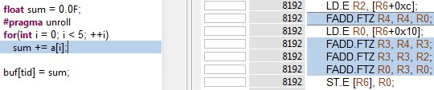
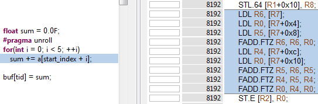
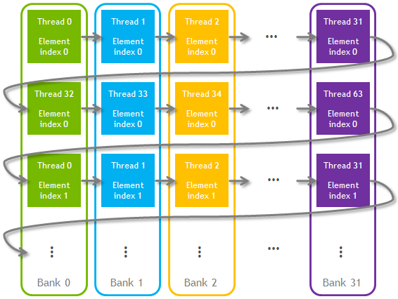
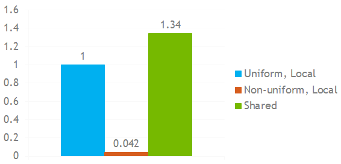

# CUDA 中私有数组的快速动态索引


有时候你需要在你的GPU内核中使用小型的每个线程私有的数组。访问这些数组中的元素的性能取决于许多因素。在这篇文章中，我将介绍几个常见的场景，从快速静态索引到更复杂、更具挑战性的用例。

## 静态索引

在讨论动态索引之前，让我们先简要了解一下静态索引。 对于所有索引在编译时都是已知常量的小数组，如以下示例代码所示，编译器将数组的所有访问元素放入寄存器中。

```C++
__global__ void kernel1(float * buf)
{
    float a[2];
    ...
    float sum = a[0] + a[1];
    ...
}
```

这样可以以最快的方式访问数组元素：数学指令直接使用数据而无需加载和存储。

一个稍微复杂（可能更有用）的情况是对数组索引的展开循环。 在下面的代码中，编译器还能够将访问的数组元素分配给寄存器。
```C++
__global__ void kernel2(float * buf)
{
    float a[5];
    ...
    float sum = 0.0f;
    #pragma unroll
    for(int i = 0; i < 5; ++i)
        sum += a[i];
    ...
}
```
在这里，我们告诉编译器使用指令`#pragma unroll` 展开循环，有效地将循环替换为明确列出的所有迭代，如下面的代码片段所示。

```C++
sum += a[0];
sum += a[1];
sum += a[2];
sum += a[3];
sum += a[4];
```

所有索引现在都是常量，因此编译器将整个数组放入寄存器。 我在 [NVIDIA Visual Profiler](http://docs.nvidia.com/cuda/profiler-users-guide/index.html#visual-profiler) 中运行了内核配置文件实验。 当您通过使用 `-lineinfo nvcc` 选项构建 CUDA 源文件来启用二进制文件中的源代码行信息时，`Visual Profiler `会显示 CUDA C++ 源代码行与[生成的汇编程序指令](http://docs.nvidia.com/cuda/cuda-binary-utilities/index.html#instruction-set-ref)之间的对应关系。 对于上面展开的循环，编译器只能生成 4 个浮点加法指令，而无需任何存储和加载。 当我们有 5 个加法时，为什么要 4 个指令？ 编译器足够聪明，可以确定将 `0.0f` 添加到 `a[0]` 只是 `a[0]` 并且它消除了该指令。 参见下图 中 Kernel Profile 实验的屏幕截图。



在某些情况下，编译器可以自动展开循环而无需`#pragma unroll`。 请注意，数组大小必须是确定的数常量； 但是您可以通过`#define` 或内核的模板参数来定义它。


## 使用统一访问的动态索引

当编译器无法将数组索引解析为常量时，它必须将私有数组放入 GPU 本地内存 (local memory: 一种on board的存储单元, 访存速度和global memory 差不多) 中。这里的“本地”并不意味着该内存必须靠近计算单元；这意味着它对每个线程都是本地的，对其他线程不可见。逻辑本地内存实际上驻留在全局 GPU 内存中。每个线程都有自己的任何本地数组的副本，编译器分别为数组读取和写入生成加载和存储指令。

**使用本地内存比将数组元素直接保存在寄存器中要慢**，但是如果您的内核中有足够的数学指令和足够的线程来隐藏延迟，则本地加载/存储指令可能是一个很小的成本。根据经验，4:1 到 8:1 的数学运算与内存运算的比率就足够了，具体数字取决于您的特定内核和 GPU 架构。你的内核还应该有足够高的占用率来隐藏本地内存访问延迟。

这是一个内核示例，即使展开循环，编译器也无法将索引解析为常量。
```C++
__global__ void kernel3(float * buf, int start_index)
{
    float a[6];
    ...
    float sum = 0.0f;
    #pragma unroll
    for(int i = 0; i < 5; ++i)
        sum += a[start_index + i];
    ...
}
```
内核配置文件实验证实，现在对数组 a 的每次访问都会导致本地加载或存储，如下图 所示。



请注意，此示例演示了统一访问：每个 warp 的所有线程都使用相同的索引访问它们自己的私有数组的元素（即使该索引是在运行时动态计算的）。 这使 GPU 加载/存储单元能够以最有效的方式执行指令。

本地内存缓存在 GPU 的 L2 和 L1 缓存中。 随着私有数组的大小增长，它将超过 L1 缓存的大小，然后是 L2 缓存，直到最终访问将支付访问全局内存的全部代价。 为了部分缓解这个问题，您可以使用 `cudaFuncSetCacheConfig` 和 `cudaFuncCachePreferL1` 来告诉 CUDA 运行时配置更大的 L1 缓存和更小的共享内存。 请注意，共享内存和 L1 缓存在 Maxwell 架构中是物理分离的，因此该功能对这些芯片无效。

## 具有非统一访问的动态索引
当 warp 的线程开始使用不同的索引访问其私有数组的元素时，事情变得更加困难。 这称为非统一索引。 发生这种情况时，SM 必须为 warp 中的线程使用的每个唯一索引“replay”加载/存储指令。 这在数据相关算法中更常见，例如以下示例，其中每个线程从全局内存数组 `indexbuf` 中读取其索引。
```C++
#define ARRAY_SIZE 32
__global__ void kernel4(float * buf, int * indexbuf)
{
    float a[ARRAY_SIZE];
    ...
    int index = indexbuf[threadIdx.x + blockIdx.x * blockDim.x];
    float val = a[index];
    ...
}
```
根据 `indexbuf` 中的数据，加载指令重播的数量可能会有很大差异：

* 当 index 对 warp 的所有线程具有相同的值时，零重播；
* 当 index 是一个从 0 到 31 均匀分布的独立随机变量时，平均约 2.5 次重播；
* 当一个 warp 的所有线程的索引都不同时，高达 31 次重播。


在这种情况下，内核可能有如此多的本地内存加载和存储重播，以至于其性能显着下降。

幸运的是，有一个技巧可以帮助您解决这个问题。让我们将私有数组显式存储在[共享内存](https://developer.nvidia.com/blog/parallelforall/using-shared-memory-cuda-cc/)中！

共享内存有 32 个存储区，这些存储区的组织使得连续的 32 位字映射到连续的存储区（有关详细信息，请参阅 [CUDA C 编程指南](http://docs.nvidia.com/cuda/cuda-c-programming-guide/index.html#shared-memory-5-x)）。对于我们的示例，我们将分配一个足够大的 `__shared__` 数组来保存线程块的所有线程的私有数组。

我们将这个新的 `__shared__` 数组的元素在逻辑上分配给线程块的线程，以便每个线程的新虚拟私有数组的所有元素都存储在它自己的共享内存库中。

我将使用 `THREADBLOCK_SIZE` 来定义线程块的大小（这个值应该能被 warp 大小 32 整除）。这里我们共享内存数组的第一个 `THREADBLOCK_SIZE` 元素包含线程块的所有线程的私有数组的所有 0 索引元素。共享内存数组的下一个 `THREADBLOCK_SIZE` 元素包含私有数组的所有 `1-index` 元素，依此类推。这种方法如下图 所示。




这样我们保证线程0的整个虚拟私有数组落入共享内存`bank 0`，线程1的数组落入`bank 1`，以此类推。 线程 32（下一个 warp 中的第一个线程）将再次占用 `bank 0`，但不会与线程 0（或任何其他 `bank 0` 线程）发生共享内存 `bank 冲突`，因为它们属于不同的 warp，因此永远不会在 同一瞬间读取。

下面的代码实现了这个想法。
```C++
// Should be multiple of 32
#define THREADBLOCK_SIZE 64 
// Could be any number, but the whole array should fit into shared memory 
#define ARRAY_SIZE 32 

__device__ __forceinline__ int no_bank_conflict_index(int thread_id, 
                                                      int logical_index)
{
    return logical_index * THREADBLOCK_SIZE + thread_id;
}

__global__ void kernel5(float * buf, int * index_buf)
{
    // Declare shared memory array A which will hold virtual 
    // private arrays of size ARRAY_SIZE elements for all 
    // THREADBLOCK_SIZE threads of a threadblock
    __shared__ float A[ARRAY_SIZE * THREADBLOCK_SIZE]; 
    ...
    int index = index_buf[threadIdx.x + blockIdx.x * blockDim.x];

    // Here we assume thread block is 1D so threadIdx.x 
    // enumerates all threads in the thread block
    float val = A[no_bank_conflict_index(threadIdx.x, index)];
    ...
}
```
只要数组 A 被声明为 `__shared__`，每次访问 A 的元素都是从 (LDS) 共享内存加载或存储到 (STS) 共享内存，参见下图。


这种技术保证了对该数组（现在位于共享内存中）的所有访问都将在没有任何重放的情况下执行。 可以修改代码以消除对 `THREADBLOCK_SIZE` 可被 32 整除的一维线程块的限制。

但是，这种方法具有与共享内存的使用相关的内在局限性。 随着阵列大小（位于共享内存中）的增长，占用率下降。 如果占用率下降得太低，当内核没有足够的占用率来隐藏延迟时，性能可能会下降。 在某些时候，这个数组将不适合共享内存，您将无法运行内核。 48 KB 是线程块可以使用的最大共享内存大小。 简而言之，这种方法适用于相对较小的私有数组：每个线程最多 30-50 个 32 位元素。

## 性能表现

为了进行性能比较，我使用了一个对 32 个 32 位元素的私有数组进行动态索引的内核。 内核性能受限于它访问这些元素的速度。

我在 NVIDIA Tesla K20 加速器上比较了 3 个案例的性能：

1. 统一动态索引，私有数组存储在本地内存中。
2. 具有最坏情况访问模式的非统一动态索引会导致 31 次重放，并且私有数组存储在本地内存中。
3. 具有相同最坏情况访问模式的非统一动态索引，但私有数组存储在共享内存中。


由于私有数组存储在本地内存中，如我们所料，非统一索引会更糟：我的特定内核慢了 24 倍。 有趣的是，具有非统一索引的基于共享内存的内核比具有统一索引的基于本地内存的内核快 1.34 倍，如下图 所示。



这种效果有一个很好的理由：本地内存版本从 L1 缓存溢出到 L2 缓存甚至全局内存，而共享内存版本能够容纳所有私有数组而没有任何溢出。

即使对于这个内核，相对性能也取决于 GPU 的架构。例如，在 `Maxwell` 上，两种基于本地内存的情况之间的差异较小 - 大约 14 倍 - 但共享内存版本的运行速度比具有统一索引的本地内存版本快 4 倍。由于不同的指令组合，您的特定内核很可能会有不同的行为。尝试一下。

## 总结
访问私有数组的 CUDA 内核的性能很大程度上取决于访问模式。

* 当编译器可以为对数组元素的所有访问派生常量索引时，通过统一访问可以实现最高性能，因为编译器会将数组元素直接放入寄存器中。
* 具有真正动态索引的统一访问导致编译器为数组使用本地内存。如果 1) 您在内核中有足够的数学指令来隐藏本地加载/存储延迟，并且 2) 私有数组适合 L2/L1 缓存，那么这些额外的加载/存储对性能的影响应该很小。
* 对于非统一访问，成本取决于每个经线处理的唯一元素的数量。在某些情况下，指令重播的数量可能非常高。
* 您可以将小型私有数组放入共享内存并获得零重放（如在具有动态索引的统一访问情况下）。即使您从零重放开始，这也会有所帮助，因为共享内存访问更具“确定性”，它们不会溢出到 L2 缓存或全局内存。


