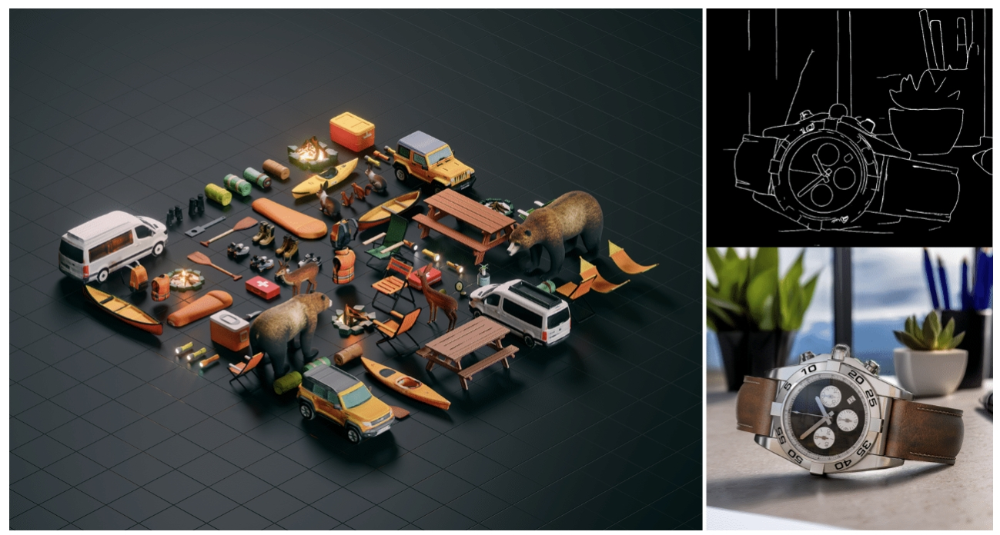
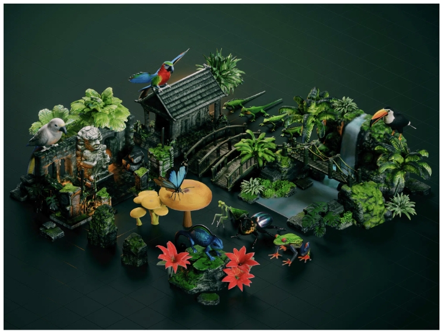
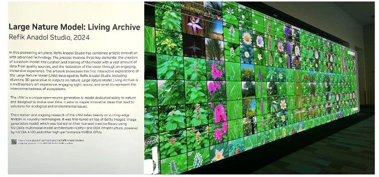

# NVIDIA Edify 为视觉内容提供商解锁 3D 生成 AI 和新图像控件

Shutterstock 3D 一代进入抢先体验阶段； Getty Images 为企业推出定制微调； Adobe 将为 Firefly 和 Creative Cloud 创作者带来 3D 生成人工智能技术； Be.Live、Bria 和 Cuebric 选择 NVIDIA Picasso AI Foundry 进行推理。

NVIDIA Edify 是一种用于视觉生成 AI 的多模式架构，正在进入一个新的维度。

3D 资产生成是 Edify 为开发人员和视觉内容提供商提供的最新功能之一，他们还能够对 AI 图像生成发挥更多的创造性控制。

多媒体内容和数据提供商 Shutterstock 正在推出对 API 或应用程序编程接口的早期访问，该接口基于 Edify 架构构建，允许创作者使用文本提示或图像快速生成虚拟场景的 3D 对象。

视觉内容创建者和市场 Getty Images 将为其商业安全的生成式人工智能服务添加自定义微调功能，帮助企业客户生成符合品牌准则和风格的视觉效果。 该服务还将融入新功能，使客户能够进一步控制其生成的图像。

开发人员可以通过 NVIDIA NIM（今天在 NVIDIA GTC 上宣布的一组用于推理的微服务）测试驱动 Getty Images 和 Shutterstock 提供的预训练 Edify 模型作为 API。 开发人员还可以通过 NVIDIA Picasso（基于 NVIDIA DGX Cloud 构建的 AI 铸造厂）使用 Edify 架构来训练和部署自己的生成式 AI 模型。

NVIDIA 和 Adobe 正在合作，为数百万 Firefly 和 Creative Cloud 创作者带来基于 Edify 的全新 3D 生成 AI 技术。

直播平台 Be.Live 使用 NVIDIA Picasso 代工服务来提供实时生成 AI，从而能够自动创建视觉效果并为观众提供互动体验。 Bria 是一个为开发负责任的视觉生成人工智能的企业量身定制的整体平台，它采用了 Picasso 来运行推理。 创意工作室 Cuebric 正在通过开发由毕加索驱动的生成式人工智能应用程序来构建沉浸式虚拟环境，从而增强电影制作和内容创作。

Speedy 3D：Shutterstock 3D AI 生成器现已提供抢先体验
Shutterstock 的 3D AI 服务现已开放抢先体验，将使创作者能够生成用于布景和构思的虚拟对象。 此功能可以大大减少场景原型所需的时间，让艺术家有更多时间专注于英雄角色和物体。

使用这些工具，创意专业人士将能够根据文本提示或参考图像快速创建资源，并从一系列流行的 3D 格式中进行选择来导出文件。 基于 Edify 3D 的服务还将配备内置保护措施来过滤生成的内容。

商业安全模型是根据 Shutterstock 的许可数据进行训练的。 Shutterstock 已经向数十万艺术家提供了补偿，预计还会有数百万人获得补偿，以表彰他们的内容知识产权在培训生成技术方面所发挥的作用。

在 GTC 上，HP 和 Shutterstock 展示了一项合作，利用 Edify 3D 增强定制 3D 打印，为设计师提供无限的原型选择。

Shutterstock 的 3D AI 生成器使设计人员能够快速迭代概念，创建数字资产，HP 可以通过自动化工作流程将其转换为可 3D 打印模型。 然后，HP 3D 打印机会将这些模型转化为物理原型，以帮助激发产品设计灵感。

Mattel 正在启用 Shutterstock 的 3D 生成人工智能功能，可以加速设计构思过程。 借助人工智能工具，玩具设计师可以通过简单的文字描述将他们的新产品创意形象化。 通过降低创建高保真概念设计的技术障碍，设计师可以探索更广泛的想法并更快地迭代。

Shutterstock 还在构建基于 Edify 的工具，使用根据文本或图像提示生成的 360 HDRi 环境来照亮 3D 场景。

达索系统通过其用于 3D 内容创建的领先 3DEXCITE 应用程序和 CGI 工作室 Katana 将 Shutterstock 生成 360 HDRi API 纳入其基于 NVIDIA Omniverse 的工作流程，NVIDIA Omniverse 是一个用于开发基于通用场景描述 (OpenUSD) 的 3D 工作流程和应用程序的计算平台。

全球最大的科技创意集团 Accenture Song 正在使用 Omniverse 平台根据计算机辅助设计数据生成高保真 Defender 车辆，以用于营销目的。 与 Edify 提供支持的生成式 AI 微服务相结合，Accenture Song 能够通过对话提示创建电影般的交互式 3D 环境。 其结果是一个完全身临其境的 3D 场景，将现实生成的环境与 Defender 车辆的数字双胞胎相协调。

## 掌控一切：通过 Getty Images 的定制微调将创意愿景变为现实
Getty Images 继续扩展其商业安全的生成人工智能服务所提供的功能，该服务为用户生成的内容提供赔偿。

在 1 月份的 CES 展会上，Getty Images 发布了由 Edify 支持的 API，用于修复（添加、删除或替换图像中的对象）和修复（扩展创意画布）。 这些功能现已在 Gettyimages.com 和 iStock.com 上提供。

从 5 月开始，Getty Images 还将提供根据公司品牌和视觉风格定制微调 Edify 基础模型的服务。

这些服务将采用无代码的自助服务方法，供公司上传专有数据集、查看自动生成的标签、提交微调任务并在部署到生产之前查看结果。

作为定制微调工具的一部分，Getty Images 将发布一系列 API，提供对图像输出的更精细控制，这是生成 AI 中最大的挑战之一。

开发人员很快将能够访问草图、深度和分割功能，这些功能允许用户提供草图来指导人工智能的图像生成； 通过深度图复制参考图像的组成； 以及分割图像的一部分以添加、删除或修饰字符或对象。

* Getty Images 的 API 服务已被领先的创意人员和广告商使用，包括：

* Dentsu Inc.：这家日本广告公司正在使用 Getty Images 的生成式 AI API 服务来支持 MAFA：Manga Anime For All，这是一款可以为营销用例创建漫画和动漫风格内容的应用程序。 Dentsu Creative 还使用 NVIDIA Picasso 为领先的会员仓储零售商 Sam's Club 微调 Getty Images 的模型。
* McCann：这家创意机构利用生成式 AI 帮助其客户利洁时 (Reckitt) 的非处方感冒药 Mucinex 开发一款创新游戏，在游戏中客户可以与该品牌的吉祥物互动。
* Refik Anadol Studio：该工作室以在艺术作品中使用生成式人工智能而闻名，将在 GTC 上展示雨林风格的艺术装置，该装置是使用 Getty Images 的人工智能模型创建的，并与 Refik 的雨林目录进行了微调。
* WPP：这家营销和传播服务公司正在与可口可乐公司合作，探索如何微调 Getty Images 的模型来帮助构建符合品牌风格和准则的定制视觉效果。

