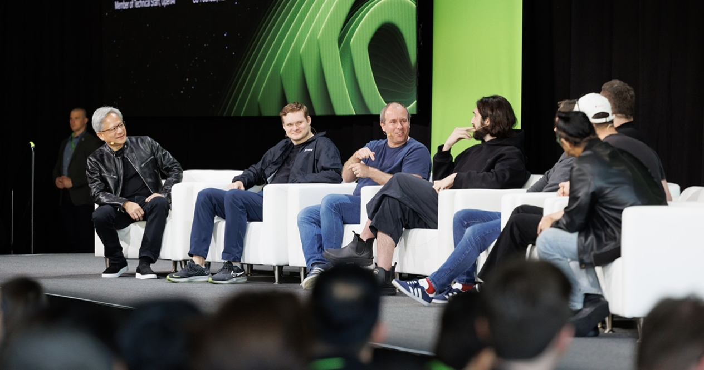

#! https://zhuanlan.zhihu.com/p/689066139
# NVIDIA 首席执行官对里程碑式 AI 论文背后的研究人员说：“你们改变了世界”

在 GTC 的 900 多场会议中，最受欢迎的是由 NVIDIA 创始人兼首席执行官黄仁勋与传奇研究论文的七位作者主持的对话，该论文介绍了恰当命名的 Transformer——一种后来改变了深度学习的神经网络架构 景观并启用当今的生成式人工智能时代。

“我们今天享受的一切都可以追溯到那一刻，”黄仁勋对挤满了数百名与会者的房间说道，他们听到他与《[Attention Is All You Need](https://arxiv.org/abs/1706.03762)》的作者们交谈。

研究界的杰出人物首次同台，反思了他们原创论文的形成因素，该论文自首次发表并在 NeurIPS AI 会议上发表以来已被引用超过 100,000 次。 他们还讨论了他们的最新项目，并对生成人工智能领域的未来方向提出了见解。

虽然他们最初是谷歌的研究人员，但现在合作者遍布整个行业，其中大多数是自己的人工智能公司的创始人。

“我们整个行业都对你们所做的工作表示感谢，”黄仁勋说。

## Transformer 模型的起源
研究团队最初试图克服循环神经网络（RNN）的局限性，循环神经网络当时是处理语言数据的最先进技术。

Character.AI 联合创始人兼首席执行官 Noam Shazeer 将 RNN 比作蒸汽机，将Transformer比作内燃机效率的提高。

“我们本来可以用蒸汽机来实现工业革命，但这只会很痛苦，”他说。 “有了内燃，一切都变得非常好。”

“现在我们只是在等待融合，”区块链公司 NEAR Protocol 的联合创始人 Illia Polosukhin 打趣道。

该论文的标题来自于这样一种认识：注意力机制（神经网络的一个元素，使它们能够确定输入数据不同部分之间的关系）是其模型性能的最关键组成部分。

“我们最近开始扔掉模型的一些部分，只是为了看看它会变得多么糟糕。 令我们惊讶的是，它开始变得更好。”Sakana AI 联合创始人兼首席技术官 Llion Jones 说道。

“变形金刚”这个笼统的名字体现了该团队的雄心，即构建可以处理和转换每种数据类型（包括文本、图像、音频、张量和生物数据）的人工智能模型。

Cohere 联合创始人兼首席执行官艾丹·戈麦斯 (Aidan Gomez) 表示：“北极星在零天就出现了，所以看到它的实现真是令人兴奋和欣慰。” “我们现在确实看到了这种情况的发生。”

## 展望未来之路
自适应计算（模型根据给定问题的复杂性调整计算能力的使用量）是研究人员认为未来人工智能模型改进的关键因素。

生物软件公司 Inceptive 的联合创始人兼首席执行官 Jakob Uszkoreit 表示：“这实际上是在特定问题上投入适当的努力和最终的精力。” “你不想在简单的问题上花费太多，也不想在困难的问题上花费太少。”

例如，像二加二这样的数学问题不应该通过万亿参数的Transformer模型来运行——它应该在一个基本的计算器上运行，该小组一致认为。

他们也期待下一代人工智能模型。

“我认为世界需要比Transformer更好的东西，”戈麦斯说。 “我想我们所有人都希望它能取得成功，从而将我们的业绩推向新的高峰。”

“你不想错过接下来的十年，”黄仁勋说。 “将会发明令人难以置信的新功能。”

对话结束时，黄仁勋向每位研究人员赠送了一块 NVIDIA DGX-1 AI 超级计算机的镶框盖板，上面写着“您改变了世界”。

