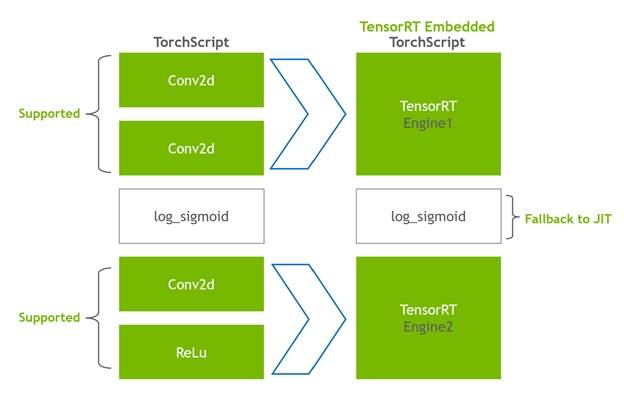

# 使用Torch-TensorRT在PyTorch中将推理速度提高6倍


----
我对Torch-TensorRT感到兴奋，这是PyTorch与NVIDIA TensorRT的新集成，它用一行代码就可以加速推理。PyTorch是当今领先的深度学习框架，在全球拥有数百万用户。TensorRT是一个用于跨gpu加速平台的高性能、深度学习推理的SDK，运行在数据中心、嵌入式和汽车设备上。这种集成使得PyTorch用户在使用TensorRT时可以通过简化工作流获得极高的推断性能。

----


## 什么是 Torch-TensorRT

Torch-TensorRT 是 PyTorch 的集成，它利用 NVIDIA GPU 上的 TensorRT 推理优化。 只需一行代码，它就提供了一个简单的 API，可在 NVIDIA GPU 上提供高达 6 倍的性能加速。

这种集成利用了 TensorRT 优化，例如 `FP16` 和 `INT8` 降低精度，同时在 TensorRT 不支持模型子图时提供对原生 PyTorch 的回退。 如需快速概览，请参阅 [NVIDIA Torch-TensorRT 入门视频](https://www.youtube.com/watch?v=TU5BMU6iYZ0)


## Torch-TensorRT 如何工作

`Torch-TensorRT` 作为 `TorchScript` 的扩展。 它优化并执行兼容的子图，让 PyTorch 执行剩余的图。 PyTorch 全面而灵活的功能集与 Torch-TensorRT 一起使用，解析模型并将优化应用于图的 TensorRT 兼容部分。

编译后，使用优化图就像运行一个 `TorchScript` 模块，用户可以获得更好的 TensorRT 性能。 Torch-TensorRT 编译器的架构由兼容子图的三个阶段组成：

* 降低 TorchScript 模块
* 转换
* 执行

### 降低 TorchScript 模块

在第一阶段，`Torch-TensorRT` 降低了 `TorchScript` 模块，将常见操作的实现简化为更直接映射到 TensorRT 的表示。 需要注意的是，这种降低通道不会影响图形本身的功能。


### 转换

在转换阶段，Torch-TensorRT 会自动识别与 TensorRT 兼容的子图，并将其转换为 TensorRT 操作：

* 具有静态值的节点被评估并映射到常量。
* 描述张量计算的节点被转换为一个或多个 TensorRT 层。
* 其余节点保留在 TorchScripting 中，形成一个混合图，作为标准 TorchScript 模块返回。


修改后的模块会通过嵌入的 TensorRT 引擎返回给您，这意味着整个模型（PyTorch 代码、模型权重和 TensorRT 引擎）可以在单个包中进行移植。



### 执行
当您执行已编译的模块时，Torch-TensorRT 会实时设置引擎并准备好执行。 当您执行这个修改后的 TorchScript 模块时，TorchScript 解释器会调用 TensorRT 引擎并传递所有输入。 引擎运行并将结果推送回解释器，就好像它是一个普通的 `TorchScript` 模块一样。


## Torch-TensorRT 特性

Torch-TensorRT介绍了以下特性:`支持INT8`和`稀疏性`。

### 支持INT8

Torch-TensorRT 通过两种技术扩展了对低精度推理的支持：

* 训练后量化 (PTQ)
* 量化感知训练 (QAT)


对于 `PTQ`，TensorRT 使用校准步骤，使用来自目标域的样本数据执行模型。 IT 跟踪 `FP32` 中的激活以校准到 `INT8` 的映射，从而最大限度地减少 `FP32` 和 `INT8` 推理之间的信息丢失。 TensorRT 应用程序要求您编写一个校准器类，为 TensorRT 校准器提供样本数据。

`Torch-TensorRT` 使用 `PyTorch` 中的现有基础设施来简化校准器的实施。 `LibTorch` 提供了一个 `DataLoader` 和 `Dataset` API，它简化了预处理和批处理输入数据。这些 API 通过 `C++` 和 `Python` 接口公开，使您更容易使用 PTQ。有关更多信息，请参阅[训练后量化 (PTQ)](https://nvidia.github.io/Torch-TensorRT/tutorials/ptq.html)。

对于 `QAT`，TensorRT 引入了新的 API：`QuantizeLayer` 和 `DequantizeLayer`，它们将 PyTorch 中与量化相关的操作映射到 TensorRT。像 `aten::fake_quantize_per_*_affine` 这样的操作在内部由 `Torch-TensorRT` 转换为 `QuantizeLayer + DequantizeLayer`。有关使用 Torch-TensorRT 优化使用 PyTorch 的 QAT 技术训练的模型的更多信息，请参阅[使用 Torch-TensorRT 在 INT8 中部署量化感知训练模型](https://nvidia.github.io/Torch-TensorRT/_notebooks/vgg-qat.html)。


### 稀疏性

NVIDIA Ampere 架构在 NVIDIA A100 GPU 上引入了第三代Tensor core，这些核心在网络权重中使用细粒度的稀疏性。 它们提供了密集数学计算的最大吞吐量，而不会牺牲作为深度学习核心的矩阵乘法累加作业的准确性。

* TensorRT 支持在这些 Tensor Core 上注册和执行一些稀疏层的深度学习模型。

* Torch-TensorRT 扩展了对卷积和全连接层的支持。

## 示例：图像分类的吞吐量比较

在这篇文章中，您将通过一个名为 EfficientNet 的图像分类模型执行推理，并计算模型在通过 PyTorch、TorchScript JIT 和 Torch-TensorRT 导出和优化时的吞吐量。 有关更多信息，请参阅 [Torch-TensorRT GitHub 存储库上的端到端示例笔notebook](https://github.com/NVIDIA/Torch-TensorRT/blob/master/notebooks/EfficientNet-example.ipynb)。


### 安装需求

要执行这些步骤，您需要以下资源：

* 具有 NVIDIA GPU、计算架构 7 或更早版本的 Linux 机器
* 已安装 Docker，19.03 或更高版本
* 一个 Docker 容器，包含 PyTorch、Torch-TensorRT 以及从 [NGC](https://ngc.nvidia.com/catalog/containers/nvidia:pytorch) 目录中提取的所有依赖项

按照说明运行标记为 [nvcr.io/nvidia/pytorch:21.11-py3](https://catalog.ngc.nvidia.com/orgs/nvidia/containers/pytorch) 的 Docker 容器。

现在您在 Docker 容器中有一个实时 bash 终端，启动一个 JupyterLab 实例来运行 Python 代码。 在端口 8888 上启动 JupyterLab 并将令牌设置为 TensorRT。 保留系统的 IP 地址，以便在浏览器上访问 JupyterLab 的图形用户界面。

```Bash
Jupyter lab --allow-root --IP=0.0.0.0 --NotebookApp.token=’TensorRT’ --port 8888
```

在浏览器上使用端口 8888 导航到此 IP 地址。如果您正在运行此本地系统示例，则导航到 `Localhost:8888`。

在浏览器上连接到 JupyterLab 的图形用户界面后，您可以创建一个新的 Jupyter notebook。 首先安装 timm，这是一个包含预训练计算机视觉模型、权重和脚本的 PyTorch 库。 从此库中提取 EfficientNet-b0 模型。

```C++
pip install timm
```

导入相关库并为 EfficientNet-b0 创建一个 PyTorch nn.Module 对象。

```Python
import torch
import torch_tensorrt
import timm
import time
import numpy as np
import torch.backends.cudnn as cudnn

torch.hub._validate_not_a_forked_repo=lambda a,b,c: True

efficientnet_b0 = timm.create_model('efficientnet_b0',pretrained=True)
```

您可以通过将一个随机浮点数张量传递给这个 `Effectivenet_b0 `对象的 `forward` 方法，从这个模型中获得预测。
```Python
model = efficientnet_b0.eval().to("cuda")
detections_batch = model(torch.randn(128, 3, 224, 224).to("cuda"))
detections_batch.shape
```

这将返回一个 `[128, 1000]` 的张量，对应于 `128` 个样本和 `1,000` 个类。

要通过 PyTorch JIT 和 Torch-TensorRT AOT 编译方法对该模型进行基准测试，请编写一个简单的基准实用程序函数：

```Python
cudnn.benchmark = True

def benchmark(model, input_shape=(1024, 3, 512, 512), dtype='fp32', nwarmup=50, nruns=1000):
    input_data = torch.randn(input_shape)
    input_data = input_data.to("cuda")
    if dtype=='fp16':
        input_data = input_data.half()
        
    print("Warm up ...")
    with torch.no_grad():
        for _ in range(nwarmup):
            features = model(input_data)
    torch.cuda.synchronize()
    print("Start timing ...")
    timings = []
    with torch.no_grad():
        for i in range(1, nruns+1):
            start_time = time.time()
            pred_loc  = model(input_data)
            torch.cuda.synchronize()
            end_time = time.time()
            timings.append(end_time - start_time)
            if i%10==0:
                print('Iteration %d/%d, avg batch time %.2f ms'%(i, nruns, np.mean(timings)*1000))

    print("Input shape:", input_data.size())
    print('Average throughput: %.2f images/second'%(input_shape[0]/np.mean(timings)))
```

您现在已准备好对此模型执行推理。

### 使用 PyTorch 和 TorchScript 进行推理

首先，采用 PyTorch 模型并计算批量大小为 1 的平均吞吐量：

```Python
model = efficientnet_b0.eval().to("cuda")
benchmark(model, input_shape=(1, 3, 224, 224), nruns=100)
```

可以使用 TorchScript JIT 模块重复相同的步骤：

```Python
traced_model = torch.jit.trace(model, torch.randn((1,3,224,224)).to("cuda")])
torch.jit.save(traced_model, "efficientnet_b0_traced.jit.pt")
benchmark(traced_model, input_shape=(1, 3, 224, 224), nruns=100)
```
PyTorch 和 TorchScript JIT 报告的平均吞吐量将是相似的。

### 使用 Torch-TensorRT 进行推理

要使用 Torch-TensorRT 以混合精度编译模型，请运行以下命令：

```Python
trt_model = torch_tensorrt.compile(model, 
    inputs= [torch_tensorrt.Input((1, 3, 224, 224))],
    enabled_precisions= { torch_tensorrt.dtype.half} # Run with FP16
)
```
最后，对这个 Torch-TensorRT 优化模型进行基准测试：

```Python
benchmark(trt_model, input_shape=(1, 3, 224, 224), nruns=100, dtype="fp16")
```
## 测试结果

这是我在批量大小为 1 的 NVIDIA A100 GPU 上取得的结果。


## 总结
只需一行代码进行优化，Torch-TensorRT 即可将模型性能加速高达 6 倍。 它确保了 NVIDIA GPU 的最高性能，同时保持了 PyTorch 的易用性和灵活性。

有兴趣在您的模型上试用吗？ 从 [PyTorch](https://ngc.nvidia.com/catalog/containers/nvidia:pytorch) NGC 容器下载 Torch-TensorRT，通过 TensorRT 优化加速 PyTorch 推理，无需更改代码。