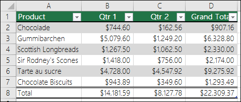
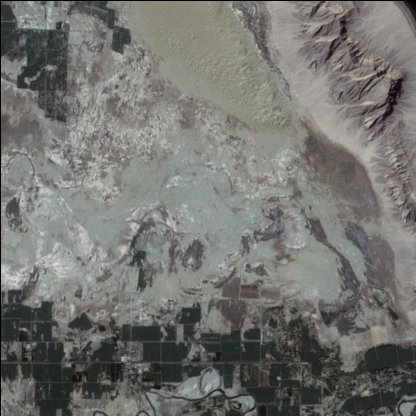
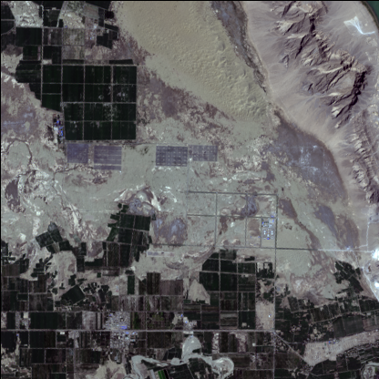
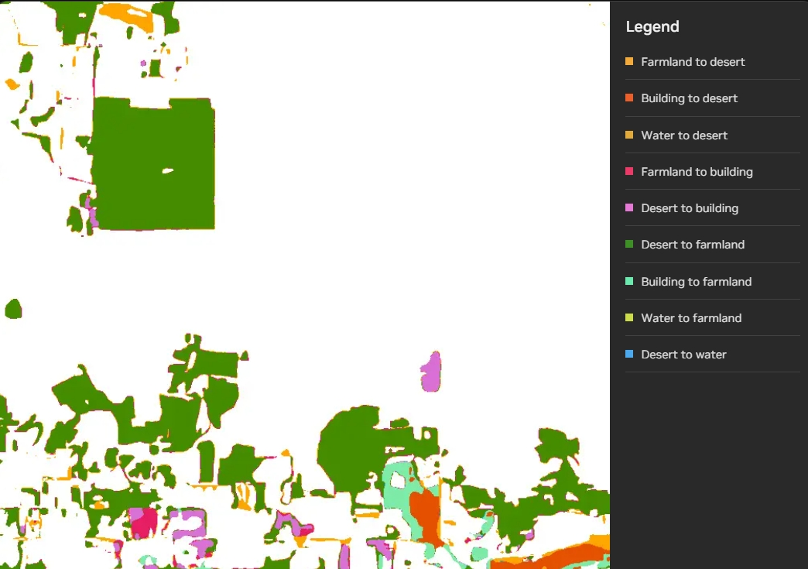
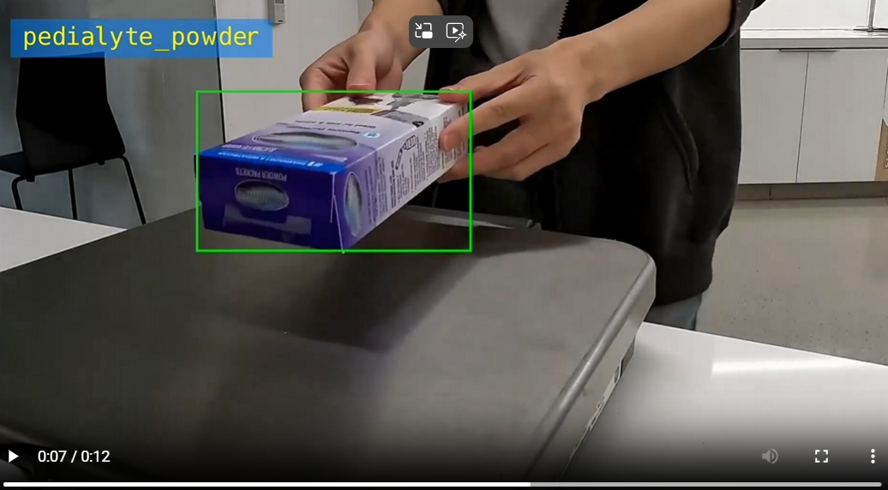
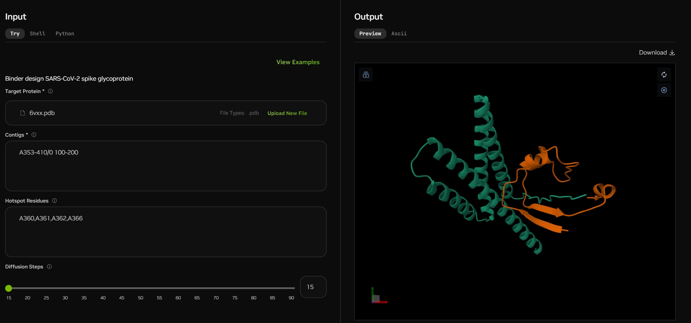

# NIM(NVIDIA Inference Microservice)最新模型实例

得益于不断涌现的突破性基础模型，生成式 AI 正在彻底改变各行各业的几乎所有用例。这些模型能够理解背景和原因，从而生成高质量的内容和高精度答案。

NVIDIA 不断优化和发布新的模型。本文将为您介绍最近更新的六个模型, 涵盖了对话, 视觉, 编程和医疗等领域。它们包括:
* Phi-3 LLMs
* Phi-3 Vision
* Granite Code
* ChangeNet
* Retail Object Detection: 
* RFdiffusion

接下来, 我将相近为您介绍这些模型, 并给出示例:

## 1.Phi-3 LLMs
微软的 Phi-3 系列包含小型语言模型 (SLM)，目的是实现最佳性能，同时不影响计算效率。其强大的推理能力和逻辑能力使其成为内容生成、摘要、问答和情感分析任务的理想选择。它包括:
* Phi-3-medium
* Phi-3-small
* Phi-3-mini

我们以Phi-3-mini为例, mini版有两种变体 4K 和 128K，这是它可以支持的上下文长度（以标记为单位）。该模型经过了严格的增强过程，结合了监督微调和直接偏好优化，以确保精确遵守指令和强大的安全措施。

您可以通过Python代码来实现调用,下面代码中的`$NVAPI_KEY`您可以通过下面地址来申请:
https://build.nvidia.com/microsoft/phi-3-mini-4k

```python
import requests

url = "https://integrate.api.nvidia.com/v1/chat/completions"

payload = {
    "model": "microsoft/phi-3-mini-4k-instruct",
    "messages": [
        {
            "content": "I am going to Paris, what should I see?",
            "role": "user"
        }
    ],
    "temperature": 0.2,
    "top_p": 0.7,
    "max_tokens": 1024,
    "seed": 42,
    "stream": False,
    "stop": ["string"],
    "bad": ["string"]
}
headers = {
    "accept": "application/json",
    "content-type": "application/json",
    "authorization": "Bearer $NVAPI_KEY
}

response = requests.post(url, json=payload, headers=headers)

print(response.json()["choices"][0]['message']['content'])

```
这是就可以通过NIM的API调用phi-3-mini-4k模型, 并得到输出:

```
Paris, known as the "City of Light," offers a plethora of attractions that cater to a wide range of interests. Here's a list of must-see places and experiences:

1. Eiffel Tower: No visit to Paris is complete without seeing this iconic landmark. You can either climb the tower for a panoramic view of the city or enjoy a romantic dinner at one of the restaurants on the first level.

2. Louvre Museum: Home to thousands of works of art, including the Mona Lisa and Venus de Milo, the Louvre is the world's largest art museum.

3. Notre-Dame Cathedral: This Gothic masterpiece is a must-see for its stunning architecture and historical significance.

4. Montmartre: This charming neighborhood is known for its bohemian atmosphere, the Sacré-Cœur Basilica, and the bustling Place du Tertre, where artists display their work.

......

Remember to plan your itinerary according to your interests and the time you have available, as some attractions may require advance booking. Bon voyage!
```


## 2.Phi-3 Vision

Phi-3 Vision 使用图像和文本输入进行推理。这是一个轻量级、先进的开放式多模态模型，基于合成数据和从网站上筛选的公开数据集构建。重点关注非常高质量、推理密集的文本和视觉数据。该模型属于 Phi-3 模型系列，多模态版本可支持 128K 上下文长度（以 token 为单位）。该模型经过了严格的增强过程，结合了监督微调和直接偏好优化，以确保精确遵循指令和强大的安全措施。

您可以通过Python代码来实现调用,下面代码中的`$NVAPI_KEY`您可以通过下面地址来申请:
https://build.nvidia.com/microsoft/phi-3-vision-128k-instruct
```python

import requests, base64

invoke_url = "https://ai.api.nvidia.com/v1/vlm/microsoft/phi-3-vision-128k-instruct"
stream = False


with open("1.png", "rb") as f:
  image_b64 = base64.b64encode(f.read()).decode()

assert len(image_b64) < 180_000, \
  "To upload larger images, use the assets API (see docs)"
  


headers = {
  "Authorization": "Bearer $NVAPI_KEY",
  "Accept": "text/event-stream" if stream else "application/json"
}

payload = {
  "messages": [
    {
      "role": "user",
      "content": f'Can you convert the table to markdown format? '
    }
  ],
  "max_tokens": 512,
  "temperature": 1.00,
  "top_p": 0.70,
  "stream": stream
}

response = requests.post(invoke_url, headers=headers, json=payload)

if stream:
    for line in response.iter_lines():
        if line:
            print(line.decode("utf-8"))
else:
    print(response.json()["choices"][0]['message']['content'])

```

此实例是上传一个表格的截图(如下所示), 并要求模型将截图中内容识别, 并转换成Markdown格式:


通过`phi-3-vision-128k`模型的处理, 最终输出:
```
Certainly! Below is the markdown table converted from the image provided:
```
```markdown
| Product            | Qtr 1     | Qtr 2     | Grand Total |
|--------------------|-----------|-----------|-------------|
| Chocolade          | $744.60   | $162.56   | $907.16     |
| Gummibarchen       | $5,079.60 | $1,249.20 | $6,328.80   |
| Scottish Longbreads| $1,267.50 | $1,062.50 | $2,330.00   |
| Sir Rodney's Scones| $1,418.00 | $756.00   | $2,174.00   |
| Tarte au sucre     | $4,728.00 | $4,547.92 | $9,275.92   |
| Chocolate Biscuits | $943.89   | $349.60   | $1,293.49   |
| Total              | $14,181.59| $8,127.78 | $22,309.37  |
```
```
This table lists various products along with their quarterly sales (Qtr 1 and Qtr 2) and the grand total for each product.
```

我们可以看到, 此时模型已经将图片中的表格转换成了Markdown格式, 并且给出了它的理解


## 3.Granite Code

IBM 发布的 Granite Code 模型是开放式编程模型，目的是协助完成各种编码任务。这些模型经过 116 种编程语言的训练，可以生成代码示例、识别和修复错误并提供代码段的解释。

Granite Code模型分为8B和34B两个版本, 我们此处以34B版本为例。

您可以通过Python代码来实现调用,下面代码中的`$NVAPI_KEY`您可以通过下面地址来申请:
https://build.nvidia.com/ibm/granite-34b-code-instruct

```python

import requests

url = "https://integrate.api.nvidia.com/v1/chat/completions"

payload = {
    "model": "ibm/granite-34b-code-instruct",
    "max_tokens": 1024,
    "stream": False,
    "temperature": 0.5,
    "top_p": 1,
    "frequency_penalty": 0,
    "presence_penalty": 0,
    "seed": 0,
    "stop": None,
    "messages": "Generate a C++ program to implement the quicksort algorithm."
}
headers = {
    "accept": "application/json",
    "content-type": "application/json",
    "authorization": "Bearer $NVAPI_KEY
}

response = requests.post(url, json=payload, headers=headers)

print(response.json()["choices"][0]['message']['content'])

```
此示例给`granite-34b-code`输入`Generate a C++ program to implement the quicksort algorithm`, 让该模型帮我们实现一个C++版本的快速排序算法, 大模型的输出如下:

Here is a C++ program that implements the quicksort algorithm:

```cpp
#include <iostream>

using namespace std;

// A utility function to swap two elements
void swap(int* a, int* b)
{
    int t = *a;
    *a = *b;
    *b = t;
}

/* This function takes last element as pivot, places
   the pivot element at its correct position in sorted
    array, and places all smaller (smaller than pivot)
   to left of pivot and all greater elements to right
   of pivot */
int partition (int arr[], int low, int high)
{
    int pivot = arr[high];    // pivot
    int i = (low - 1);  // Index of smaller element

    for (int j = low; j <= high- 1; j++)
    {
        // If current element is smaller than or
        // equal to pivot
        if (arr[j] <= pivot)
        {
            i++;    // increment index of smaller element
            swap(&arr[i], &arr[j]);
        }
    }
    swap(&arr[i + 1], &arr[high]);
    return (i + 1);
}

/* The main function that implements QuickSort
 arr[] --> Array to be sorted,
  low  --> Starting index,
  high  --> Ending index */
void quickSort(int arr[], int low, int high)
{
    if (low < high)
    {
        /* pi is partitioning index, arr[p] is now
           at right place */
        int pi = partition(arr, low, high);

        // Separately sort elements before
        // partition and after partition
        quickSort(arr, low, pi - 1);
        quickSort(arr, pi + 1, high);
    }
}

/* Function to print an array */
void printArray(int arr[], int size)
{
    int i;
    for (i=0; i < size; i++)
        cout << arr[i] << " ";
    cout << endl;
}

// Driver program to test above functions
int main()
{
    int arr[] = {10, 7, 8, 9, 1, 5};
    int n = sizeof(arr)/sizeof(arr[0]);
    quickSort(arr, 0, n-1);
    cout << "Sorted array: \n";
    printArray(arr, n);
    return 0;
}
```

This program implements the quicksort algorithm in C++. The `swap` function is used to swap two elements, and the `partition` function takes the last element as the pivot and rearranges the array such that all elements smaller than the pivot are on the left and all elements greater than the pivot are on the right. The `quickSort` function recursively calls itself to sort the subarrays before and after the partition. Finally, the `printArray` function is used to print the sorted array.


我们可以看到, 模型的输出不仅完成了算法的实现, 还在代码中加入了注释, 方便用户理解代码。


## 4.ChangeNet
ChangeNet是一种先进的基于 Transformer 的模型，通过分析图像对来检测景观的变化。

您可以通过Python代码来实现调用,下面代码中的`$NVAPI_KEY`您可以通过下面地址来申请:
https://build.nvidia.com/nvidia/visual-changenet

```python
import os
import sys
import uuid
import zipfile

import requests

nvai_url="https://ai.api.nvidia.com/v1/cv/nvidia/visual-changenet"
header_auth = f"Bearer $NVAPI_KEY"

def _upload_asset(input, description):
    """
    Uploads an asset to the NVCF API.
    :param input: The binary asset to upload
    :param description: A description of the asset

    """

    authorize = requests.post(
        "https://api.nvcf.nvidia.com/v2/nvcf/assets",
        headers={
            "Authorization": header_auth,
            "Content-Type": "application/json",
            "accept": "application/json",
        },
        json={"contentType": "image/jpeg", "description": description},
        timeout=30,
    )
    authorize.raise_for_status()

    response = requests.put(
        authorize.json()["uploadUrl"],
        data=input,
        headers={
            "x-amz-meta-nvcf-asset-description": description,
            "content-type": "image/jpeg",
        },
        timeout=300,
    )

    response.raise_for_status()
    return uuid.UUID(authorize.json()["assetId"])


if __name__ == "__main__":
    # Local images
    asset_id1 = _upload_asset(open('2.png', "rb"), "Reference Image")
    asset_id2 = _upload_asset(open('3.png', "rb"), "Test Image")

    # Asset IDs returned by the _upload_asset function
    inputs = {"reference_image": f"{asset_id1}", "test_image": f"{asset_id2}"}
    asset_list = f"{asset_id1} , {asset_id2}"

    headers = {
        "Content-Type": "application/json",
        "NVCF-INPUT-ASSET-REFERENCES": asset_list,
        "NVCF-FUNCTION-ASSET-IDS": asset_list,
        "Authorization": header_auth,
    }

    # Send the request to the NIM API.
    response = requests.post(nvai_url, headers=headers, json=inputs)

    with open(f"{'result'}.zip", "wb") as out:
        out.write(response.content)

    with zipfile.ZipFile(f"{'result'}.zip", "r") as z:
        z.extractall('result')

    print(f"Response saved to result")
    print(os.listdir('result'))

```
此处我们上传了两张遥感地图的图像:




`changenet`模型将为我分析两张图中的变化, 并得到如下结果, 我们可以在下图中看到标注出的变化.:




## 5.Retail Object Detection
Retail Object Detection 将检测图像中的零售商品, 它将对象分类为零售或非零售。


您可以通过Python代码来实现调用,下面代码中的`$NVAPI_KEY`您可以通过下面地址来申请:
https://build.nvidia.com/nvidia/retail-object-detection

```python
import os
import sys
import uuid
import zipfile

import requests

nvai_url="https://ai.api.nvidia.com/v1/cv/nvidia/retail-object-detection"
header_auth = f"Bearer $NVAPI_KEY"


def _upload_asset(input, description):
    assets_url = "https://api.nvcf.nvidia.com/v2/nvcf/assets"

    headers = {
        "Authorization": header_auth,
        "Content-Type": "application/json",
        "accept": "application/json",
    }

    s3_headers = {
        "x-amz-meta-nvcf-asset-description": description,
        "content-type": "video/mp4",
    }

    payload = {"contentType": "video/mp4", "description": description}

    response = requests.post(assets_url, headers=headers, json=payload, timeout=30)

    response.raise_for_status()

    asset_url = response.json()["uploadUrl"]
    asset_id = response.json()["assetId"]

    response = requests.put(
        asset_url,
        data=input,
        headers=s3_headers,
        timeout=300,
    )

    response.raise_for_status()
    return uuid.UUID(asset_id)


if __name__ == "__main__":
    """Uploads a video or image of your choosing to the NVCF API and sends a
    request to the Retail Object Detection model. The response is saved to a
    local directory.

    Note: You must set up an environment variable, NVIDIA_API_KEY.
    """

    if len(sys.argv) != 3:
        print("Usage: python test.py <input_video> <output_dir>")
        sys.exit(1)

    asset_id = _upload_asset(open(sys.argv[1], "rb"), "Input Video")

    inputs = {"input_video": f"{asset_id}", "threshold": 0.9}

    asset_list = f"{asset_id}"

    headers = {
        "Content-Type": "application/json",
        "NVCF-INPUT-ASSET-REFERENCES": asset_list,
        "NVCF-FUNCTION-ASSET-IDS": asset_list,
        "Authorization": header_auth,
    }

    response = requests.post(nvai_url, headers=headers, json=inputs)

    with open(f"{sys.argv[2]}.zip", "wb") as out:
        out.write(response.content)

    with zipfile.ZipFile(f"{sys.argv[2]}.zip", "r") as z:
        z.extractall(sys.argv[2])

    print(f"Output saved to {sys.argv[2]}")
    print(os.listdir(sys.argv[2]))

```
它将帮助您对上传的视频进行检测, 并将检测结果返回, 完成实时的目标检测任务:




## 6.RFdiffusion

RFdiffusion是一种由华盛顿大学开发的蛋白质生成模型，可以预测与特定目标结合的蛋白质的氨基酸序列。

您可以访问下面的地址尝试:

https://build.nvidia.com/ipd/rfdiffusion




# 总结

以上就是六种最新发布的模型介绍。当然, NIM平台还包括很多热门的模型, 包括:

* Llama3-70B
* Llama3-8B
* Gemma 2B
* Mixtral 8X22B

您都可以通过访问: https://build.nvidia.com/explore/discover 来尝试将其中的功能部署到您的应用程序中, 借助NVIDIA Inference Microservice来加速您的AI应用


