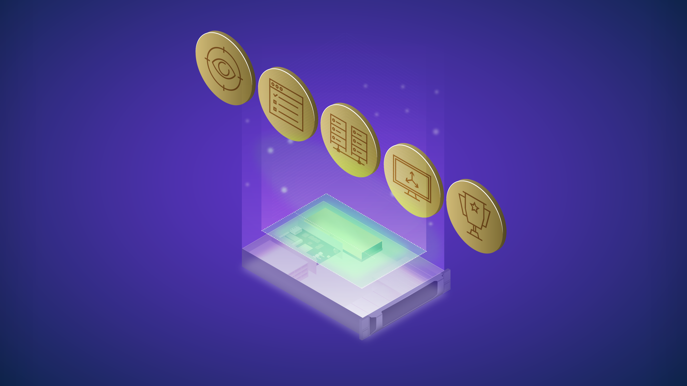

# 边缘计算AI入门

在对更高效业务流程的需求以及物联网 (IoT)、5G 和人工智能的关键进步的推动下，对[边缘计算](https://blogs.nvidia.com/blog/2019/10/22/what-is-edge-computing/)的需求比以往任何时候都高。 在 [IBM 于 2021 年 5 月发布的一项研究](https://www.ibm.com/downloads/cas/Y7RA6X93)中，94% 的受访高管表示，他们的组织将在未来 5 年内实施边缘计算。

Edge AI 是边缘计算和 AI 的结合，是软件定义业务的关键部分。 从智能医院和城市到无人商店再到自动驾驶汽车，所有这些都由运行在边缘的人工智能应用程序提供支持。

通过边缘人工智能驱动的智能转变业务就是这样，一种转变，这意味着它可能很复杂。 无论您是开始您的第一个 AI 项目，还是查看基础设施蓝图和扩展，这五个步骤都将有助于您的边缘 AI 项目取得成功。

## 1. 定义用户需求

在开始使用边缘 AI 时，确定正确的用例非常重要，无论是提高运营效率、财务影响还是社会倡议。例如，零售业的收缩是一个 千亿 美元的问题，可以通过机器学习和深度学习来缓解。即使减少 10% 也代表着数十亿美元的收入。

在选择开始使用边缘 AI 的用例时，请考虑以下因素。

* **业务影响**：成功的 AI 项目必须对业务具有足够高的价值，以使它们值得投入所需的时间和资源来启动它们。

* **主要利益相关者**：参与 AI 项目的团队包括开发人员、IT、安全运营 (SecOps)、合作伙伴、系统集成商、应用程序供应商等。尽早让这些团队参与进来，以获得最佳结果。

* **成功标准**：在开始时定义最终目标，以确保项目不会因范围蔓延而漂移。

* **时间框架**：人工智能需要时间并且是一个迭代过程。识别对业务有长期影响的用例将确保解决方案在长期内保持价值。

## 2. 评估您的数据和应用程序需求

数十亿个传感器位于边缘位置，通常是一个数据丰富的环境。此步骤需要了解将使用哪些数据来训练 AI 应用程序以及推理，从而采取行动。

获取标记数据可能令人生畏，但有一些方法可以解决这个问题。

* 利用内部专业知识：如果您尝试自动化流程，请使用手动执行任务的专家来标记数据。

* 合成数据：当训练数据有限或推理数据与原始数据集有很大差异时，使用计算机模拟或算法生成的注释信息是一种常用的技术。

* 众包数据：利用您的受众来帮助标记大量数据对一些公司来说是有效的。示例包括开源数据集、社交媒体内容，甚至是根据客户输入收集信息的自助结账机。

* 如果您拥有训练或重新训练 AI 模型所需的数据数量和质量，那么您可以继续下一步。

## 3.了解边缘基础设施需求

推出边缘 AI 解决方案时最重要和最昂贵的费用之一是基础设施。 与数据中心不同，边缘计算基础设施必须考虑性能、带宽、延迟和安全性方面的额外考虑。

首先查看现有基础架构，以了解已经存在的内容以及需要添加的内容。 以下是边缘 AI 平台需要考虑的一些基础设施项目。

* 传感器：当今大多数组织都将摄像头作为主要的边缘设备，但传感器可以包括聊天机器人、雷达、激光雷达、温度传感器等。

* 计算系统：在确定计算系统规模时，请考虑应用程序的性能和边缘位置的限制，包括空间、功率限制和热量。确定这些限制因素后，您就可以了解应用程序的性能要求。

* 网络：网络的主要考虑因素是您需要多快的响应才能使用例可行，或者需要多少数据以及是否必须通过网络传输实时数据。由于延迟和可靠性，在可能的情况下使用有线网络，但在需要时可以选择无线网络。

* 管理：边缘计算在这些环境的管理中提出了独特的挑战。组织应考虑解决边缘 AI 需求的解决方案，即可扩展性、性能、远程管理、弹性和安全性。

* 基础设施直接连接到直接用例解决方案，但重要的是要考虑到可能部署在同一位置的其他用例。

## 4. 推出你的边缘AI解决方案

在推出边缘 AI 应用程序时，在边缘测试 AI 应用程序对于确保成功至关重要。 边缘 AI 概念验证 (POC) 通常部署在少数几个位置，可能需要 3-12 个月的时间。

为确保从 POC 顺利过渡到生产，重要的是要考虑最终解决方案的外观。 以下是推出 AI 应用程序时需要考虑的一些事项。

* 规模设计：POC 通常仅限于一个或少数几个位置，但如果成功，它们必须扩展到数百甚至数千个位置。

* 限制范围：人工智能应用程序会随着时间的推移而改进。 不同的用例会有不同的准确性要求，可以在成功标准中定义。

* 为变化做好准备：Edge AI 有很多变数，这意味着即使是最完善的计划也会发生变化。 确保在不影响定义的成功标准的情况下灵活部署。

## 5. 庆祝你的成功

Edge AI 是一项变革性技术，可帮助企业提高体验、速度和运营效率。许多组织都有多个边缘用例要推出，这就是庆祝成功如此重要的原因。突出成功的公司更有可能为未来的边缘人工智能项目带来兴趣、支持和资金。

## 开始使用端到端边缘 AI
作为 AI 领域的领导者，NVIDIA 与客户和合作伙伴合作创建边缘计算解决方案，以提供强大的分布式计算；安全的远程管理；以及与行业领先技术的兼容性。

组织可以轻松开始使用 NVIDIA LaunchPad，它提供对必要硬件和软件堆栈的即时、短期访问，以体验人工智能、数据科学、3D 设计协作和模拟领域的端到端解决方案工作流程，以及更多的。 LaunchPad 上的精选实验室可帮助开发人员、设计师和 IT 专业人员加快现代数据密集型应用程序的创建和部署。

立即开始在 [NVIDIA LaunchPad](https://www.nvidia.com/en-us/data-center/launchpad/) 上免费试用。
