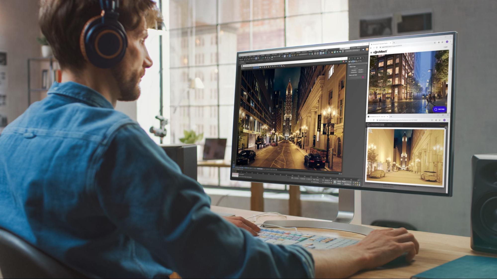
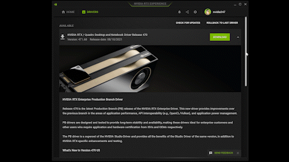
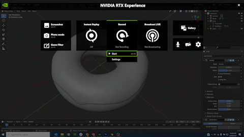
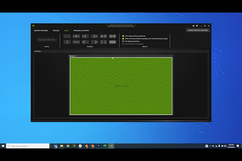
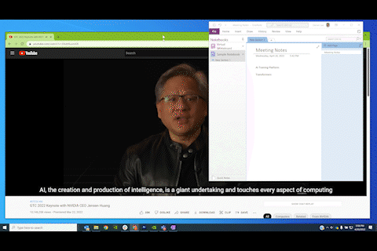

#! https://zhuanlan.zhihu.com/p/553899629
# 使用NVIDIA RTX软件增强您的工作空间的五个功能

从数字内容创建到产品设计，图形工作流程正变得更加复杂、互动和协作。随着世界各地的许多组织适应混合工作环境，设计师、工程师、开发人员和其他专业人士不断地建立最适合他们的工作空间，无论他们在哪里工作。

使用 NVIDIA RTX 软件，用户可以轻松创建最佳设置来自定义他们的工作空间并提高生产力和效率。

NNVIDIA RTX 软件有两个旨在提高生产力的产品：

* [NVIDIA RTX 桌面管理器](http://www.nvidia.com/rtx-desktop-manager)：用户可以轻松管理单显示器或多显示器工作区，提供最大的灵活性和对显示器空间和桌面的控制。
* [NVIDIA RTX Experience](http://www.nvidia.com/rtx-experience)：提供驱动程序管理和内容捕获等生产力工具，以最大限度地减少 GPU 工具的上下文切换，使用户可以专注于他们的工作。

查看 NVIDIA RTX 桌面管理器和 RTX Experience 的五项功能。

## 即时、自动下载

每当有新驱动程序可用时，从 `NVIDIA RTX Experience` 获取自动警报。 立即从应用程序下载和安装驱动程序，从正常的下载和安装过程中减少多个步骤。 如果您需要以前的驱动程序中的某些内容，回滚功能可以轻松重新安装。

## 桌面录制点播
使用 NVIDIA RTX Experience 热键立即开始录制您的桌面以捕捉图像或创建操作视频以与他人分享。 录音会自动保存在方便的存储库中，以便于访问。 这对于故障排除也非常有用。

## 将窗口捕捉到网格

使用 NVIDIA RTX 桌面管理器将窗口快速捕捉到预定义的网格中，并轻松更改网格配置以适应特定的工作流程或项目。 这将有助于最大化展示空间——同时与您的美学保持一致。

## 鸟瞰一切

在 RTX 桌面管理器的 Birdseye View 界面中管理您的所有物理和虚拟桌面。 无需在显示器上滚动或拖动窗口即可将事物组织和对齐，从一个中心位置完成所有操作。

## 通过多层最大限度地提高生产力

找不到隐藏在其他窗口下的应用程序？ 使用 RTX 桌面管理器的扩展工具集将所需的应用程序切换为“始终保持在桌面顶部”。您还可以设置该顶部窗口的透明度级别以查看下面发生的情况。 这也是在视频通话中记笔记的好方法。

NVIDIA RTX 软件可供所有拥有 RTX GPU 的用户使用。

立即下载 [NVIDIA RTX 桌面管理器](http://www.nvidia.com/rtx-desktop-manager)和 [NVIDIA RTX Experience](http://www.nvidia.com/rtx-experience)，并获取生产力工具来增强随时随地的工作。

