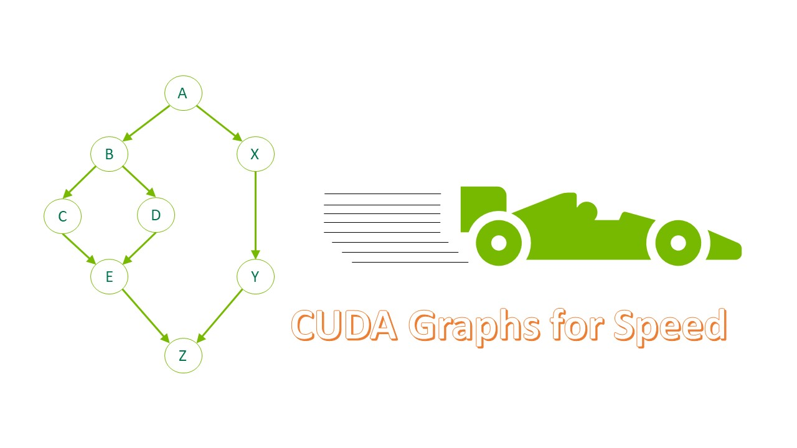
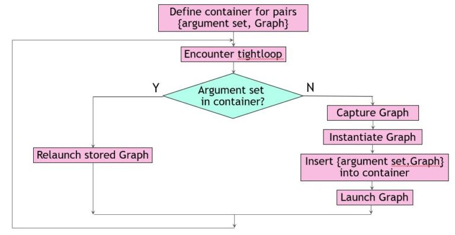
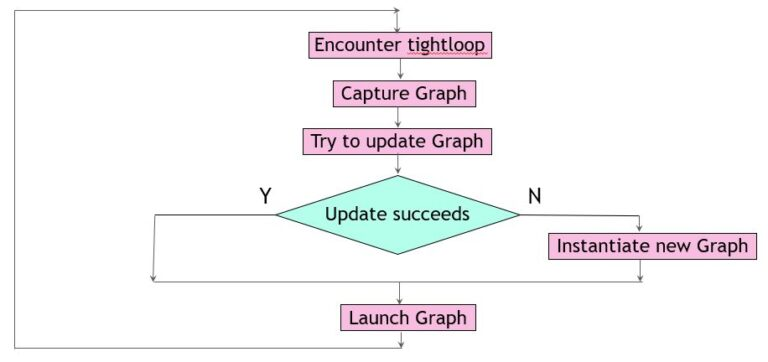

#! https://zhuanlan.zhihu.com/p/551693502
# 在动态环境中使用CUDA图



通过将计算密集型部分放到 GPU 上，可以大大加快许多工作负载的速度。 在 CUDA 术语中，这称为启动内核。 当这些内核很多且持续时间很短时，启动开销有时会成为问题。

CUDA Graphs 提供了一种减少这种开销的方法。 图之所以有效，是因为它们将任意数量的异步 CUDA API 调用（包括内核启动）组合成一个只需要一次启动的操作。 它们在创建时确实会产生一些开销，因此它们最大的好处来自于多次重用它们。

在工具包版本 10 中引入时，CUDA 图可能已经更新以反映其实例化的一些细微变化。 此后，此类更新操作的覆盖范围和效率显着提高。 在这篇文章中，我描述了一些通过使用 CUDA 图来提高实际应用程序性能的场景，其中一些包括图更新功能。

## Context
考虑一个具有启动许多短期运行内核的函数的应用程序，例如：
```C++
tight_loop(); //function containing many small kernels 
```

如果每次遇到这个函数时都执行相同的操作，那么很容易使用流捕获将其转换为 CUDA 图。 您必须引入一个开关（在本例中为捕获的布尔值）来指示是否已经创建了图。 将此开关的声明和初始化放在源代码中，使其范围包括函数`tight_loop` 的每次调用。

```C++
cudaGraphExec_t instance; 
static bool captured = false;

```

接下来，使用代码包装函数的任何实际调用以创建其对应的 CUDA 图（如果它尚不存在），然后启动该图。

```C++

if (!captured)
 {// you haven’t captured the graph yet
   cudaGraph_t graph; 
   cudaStreamBeginCapture(stream, cudaStreamCaptureModeGlobal); 
   tight_loop(); //function containing many small kernels
   //aggregate all info about the stream capture into “graph”
   cudaStreamEndCapture(stream, &graph);
   //turn this info into executable CUDA Graph “instance”
   cudaGraphInstantiate(&instance, graph, NULL, NULL, 0);
   //no need to hang on to the stream info
   cudaGraphDestroy(graph);
   captured = true;
 }
 cudaGraphLaunch(instance, stream);//launch the executable graph 
```

对`tight_loop` 函数的调用实际上并不执行任何内核启动或其他CUDA 操作。 它仅记录所有此类操作并将它们存储在数据结构中。

专注于启动内核的功能。 在实际应用中，它看起来像以下代码：
```C++
void tight_loop(int first_step, MyStruct params, int delta, dim3 grid_dim, dim3 block_dim, cudaStream_t stream)
 {
   for (int step = first_step; step >= 0; --step, params.size -= delta)
   {
     tiny_kernel1<<<grid_dim, block_dim, 0, stream>>>(params);
     tiny_kernel2<<<grid_dim, block_dim, 0, stream>>>(params);
   }
 } 
 ```

 显然，如果函数的参数在连续调用时发生变化，则表示 GPU 内部工作的 CUDA 图也应该发生变化。 您不能重复使用原始图表。 但是，假设多次遇到相同的函数参数集，您至少可以通过两种不同的方式处理这种情况：保存和识别图或更新图。

 ## 保存和识别图
 第一种方法从 C++ 标准模板库中引入一个容器来存储参数集。 每当你遇到一个新的参数集唯一地定义了函数`tight_loop`，把它和它对应的可执行图一起添加到容器中。

当您遇到容器中已经存在的参数集时，启动相应的 CUDA 图。 假设在这种情况下，变量 `first`、`params.size` 和 `delta` 唯一地定义了`tight_loop`。 这个三元组是用来区分图形的关键。 您定义它和要在源代码中使用的容器，使其范围包括函数`tight_loop` 的每次调用。

```C++

typedef struct 
 { //define the fields of a key
    int first;
    double delta;
    int size;
 } Key;
 //define the container (map) containing (key,value) pairs
 map<Key, cudaGraphExec_t, cmpKeys> MapOfGraphs; 
```

无论函数`tight_loop` 出现在哪里，您都使用填充Key的代码将其包装起来，并在您的容器中查找它。 如果找到Key，代码将启动相应的可执行 CUDA 图。 否则，它会创建一个新图，将其添加到容器中，然后启动它（下图所示）。

```C++
Key triplet = {first_step, delta, params.size};
 map<Key, cudaGraphExec_t, cmpKeys>::iterator it = MapOfGraphs.find(triplet);
 if (it == MapOfGraphs.end())
 { // new parameters, so need to capture new graph
   cudaStreamBeginCapture(stream, cudaStreamCaptureModeGlobal);
   tight_loop(first_step, params, delta, grid_dim, block_dim, stream);
   cudaStreamEndCapture(stream, &graph);
   cudaGraphInstantiate(&instance, graph, NULL, NULL, 0);
   cudaGraphDestroy(graph);
   // add this graph to the container of saved graphs
   MapOfGraphs.insert(make_pair(trio,instance));
   cudaGraphLaunch(instance, stream);
 }
 else
 {// recognized parameters, so can launch previously captured graph
   cudaGraphLaunch(it->second, stream);
 } 

```



这种方法通常效果很好，但它有一些内在的危险。 在本例中，您确定只需要三个参数来定义容器中的Key。 对于不同的工作负载，这可能会有所不同，或者其他开发团队成员可能会默默地添加字段来构造 MyStruct。 这会影响非平凡函数 `cmpKeys` 的编写方式。 该函数是容器所需要的，用于判断某个Key是否小于另一个Key。

为 STL 容器编写一个重要的比较函数通常并不困难，但当一个Key由多个重要的实体组成时可能会很乏味。 一种普遍适用的方法是使用字典比较。 对于此示例，以下代码示例有效：
```C++
struct cmpKeys {
   bool operator()(const Key& a, const Key& b) const {
     if (a.first != b.first) return(a.first < b.first);
     else 
     {
        if (a.delta != b.delta ) return (a.delta < b.delta);
        else return(a.size < b.size);
     }
   }
 } 

```
请记住，要重用以前捕获的可执行 CUDA 图，它必须与调用上下文完全匹配：

* 相同的拓扑
    * 相同数量和类型的图形节点
    * 图节点之间的相同依赖关系
* 相同的节点参数


但是，如果其拓扑保持不变，则可以调整 CUDA 图以使其符合新需求。 存在一种方便的机制来确认拓扑等价，同时调整节点参数以返回修改后的可执行图。 它由 `cudaGraphExecUpdate` 提供，它通过将现有的可执行图与新派生的图（例如，通过流捕获方便地获得）进行比较来工作。 如果可能，差值用于进行更改。

这种方法的好处是双重的。 首先，当更新足够时，您可以避免昂贵的新 CUDA 图实例化。 其次，您不必知道是什么让图表与众不同。 任何图形比较都由更新函数隐式执行。 下面的代码示例实现了此方法。 和以前一样，它从声明和初始化开关开始，以指示先前创建的图形。

```C++
static bool captured = false;
```

将tight_loop的调用点修改如下：
```C++

 cudaStreamBeginCapture(stream, cudaStreamCaptureModeGlobal);
 tight_loop(first_step, params, delta, grid_dim, block_dim, stream);
 cudaStreamEndCapture(stream, &graph);
 if (!captured) {
    cudaGraphInstantiate(&instance, graph, NULL, NULL, 0);
    captured = true;
 } else {
   // graph already exists; try to apply changes
   if (cudaGraphExecUpdate(instance, graph, NULL, &update) != cudaSuccess) 
   {// only instantiate a new graph if update fails
     cudaGraphExecDestroy(instance);
     cudaGraphInstantiate(&instance, graph, NULL, NULL, 0)
   {
 }
 cudaGraphDestroy(graph);
 cudaGraphLaunch(instance, stream); 
```

在这种情况下，您总是进行流捕获以收集有关紧密循环中的 CUDA 操作的信息。 这是一个相对便宜的操作，完全在主机上执行，而不是在 GPU 上。 它可以与之前的 CUDA 图启动重叠，后者本身就是异步操作（如下图所示）。



需要注意的是。 `cudaGraphExecUpdate` 的复杂性大致与对 CUDA 图节点所做的更改数量成正比，因此如果大部分节点发生更改，它的效率就会降低。

## 结果

促使这两种方法以灵活方式管理 CUDA 图的应用程序具有两种不同的工作负载大小，其行为略有不同。 所有涉及的内核都需要 2-8 微秒才能在单个 NVIDIA A100 GPU 上执行。 报告的加速是针对可以转换为 CUDA 图的代码部分。

## 结论

具有许多小型 CUDA 内核的应用程序通常可以使用 CUDA 图加速，即使内核启动模式在整个应用程序中发生变化。 考虑到这种动态环境，最佳方法取决于您的应用程序的具体情况。 希望您发现本文中描述的两个示例易于理解和实现。