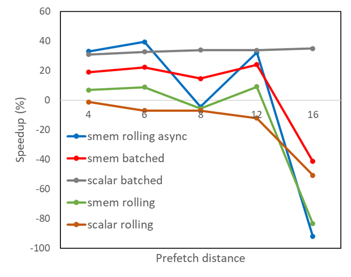
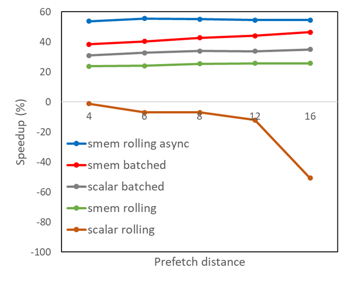

# 利用GPU内存的预获取功能加速应用


NVIDIA GPU 具有巨大的计算能力，通常必须高速输入数据才能部署这种能力。 原则上这是可能的，因为 GPU 也具有高内存带宽，但有时它们需要您的帮助才能使带宽饱和。

在这篇文章中，我们研究了一种特定的方法来实现这一点：**预取**。 我们解释了预取在哪些情况下可以正常工作，以及如何确定这些情况是否适用于您的工作负载。

## Context

NVIDIA GPU 的强大功能来自大规模并行性。许多 32 个线程的 warp 可以放置在流式多处理器 (SM) 上，等待轮到它们执行。当一个 warp 因某种原因停止时，warp 调度程序以零开销切换到另一个，确保 SM 始终有工作要做。

在高性能 NVIDIA Ampere Architecture A100 GPU 上，多达 64 个活动 warp 可以共享一个 SM，每个 SM 都有自己的资源。最重要的是，A100 有 108 个 SM 可以同时执行 warp 指令。

大多数指令必须对数据进行操作，而这些数据几乎总是源自连接到 GPU 的设备内存 (DRAM)。即使是 SM 上的大量 warp 也会耗尽工作的主要原因之一是因为它们正在等待数据从内存中到达。

如果发生这种情况，并且内存的带宽没有被充分利用，则可以重新组织程序以改善内存访问并减少 warp 停顿，从而使程序更快地完成。这称为延迟隐藏。

## Prefetching

CPU 上的硬件通常支持的一种技术称为预取。 CPU 看到来自内存的请求流到达，找出模式，并在实际需要数据之前开始获取数据。当数据传输到 CPU 的执行单元时，可以执行其他指令，有效地隐藏传输成本（内存延迟）。

预取是一种有用的技术，但就芯片上的硅面积而言是昂贵的。相对而言，这些成本在 GPU 上会更高，因为它的执行单元比 CPU 多得多。相反，GPU 使用多余的扭曲来隐藏内存延迟。如果这还不够，您可以在软件中使用预取。它遵循与硬件支持的预取相同的原则，但需要显式指令来获取数据。

要确定此技术是否可以帮助您的程序运行得更快，请使用 GPU 分析工具（例如 NVIDIA Nsight Compute）检查以下内容：

* 确认并非所有内存带宽都在使用。
* 确认 warp 被阻塞的主要原因是 Stall Long Scoreboard，这意味着 SM 正在等待来自 DRAM 的数据。
* 确认这些停顿集中在相当大的循环中，其迭代不相互依赖。

### 展开

考虑对这种循环进行最简单的优化，称为展开(Unrolling)。如果循环足够短，您可以告诉编译器将其完全展开并显式展开迭代。因为迭代是独立的，所以编译器可以预先发出所有数据请求（“加载”），前提是它为每个加载分配不同的寄存器。

这些请求可以相互重叠，因此整个负载集只经历一个内存延迟，而不是所有单个延迟的总和。更好的是，单个延迟的一部分被连续的加载指令本身隐藏了。这是一个近乎最佳的情况，但它可能需要大量的寄存器来接收加载的结果。

如果循环太长，它可能会部分展开。在这种情况下，批量迭代被扩展，然后你遵循与以前相同的一般策略。你的工作很少（但你可能没那么幸运）。

如果循环包含许多其他指令，其操作数需要存储在寄存器中，那么即使只是部分展开也可能不是一种选择。在这种情况下，在您确认满足之前的条件后，您必须根据进一步的信息做出一些决定。

预取意味着使数据更接近 SM 的执行单元。寄存器是最接近的。如果有足够的可用空间，您可以使用 **Nsight Compute occupancy** 视图找到，您可以直接预取到寄存器中。

考虑以下循环，其中数组 `arr` 存储在全局内存 (DRAM) 中。它隐含地假设只使用了一个单一的一维线程块，而从它派生的激励应用程序则不是这种情况。但是，它减少了代码混乱并且不会更改参数。

在这篇文章的所有代码示例中，大写变量都是编译时常量。 `BLOCKDIMX` 采用预定义变量 `blockDim.x` 的值。对于某些目的，它必须是编译时已知的常数，而对于其他目的，它对于避免在运行时进行计算很有用。

```C++
for (i=threadIdx.x; i<imax; i+= BLOCKDIMX) {
  double locvar = arr[i];
  <lots of instructions using locvar, for example, transcendentals>
}
```
想象一下，您有八个寄存器可用于预取。 这是一个可调整参数。 以下代码在每第四次迭代开始时获取占用八个 4 字节寄存器的四个双精度值，并一个一个地使用它们，直到批次耗尽，此时您获取一个新批次。

要跟踪批次，请引入一个计数器 (ctr)，该计数器随着线程执行的每次连续迭代而递增。 为方便起见，假设每个线程的迭代次数可以被 4 整除。

```C++
double v0, v1, v2, v3;
for (i=threadIdx.x, ctr=0; i<imax; i+= BLOCKDIMX, ctr++) {
  ctr_mod = ctr%4;
  if (ctr_mod==0) { // only fill the buffer each 4th iteration
    v0=arr[i+0* BLOCKDIMX]; 
    v1=arr[i+1* BLOCKDIMX]; 
    v2=arr[i+2* BLOCKDIMX]; 
    v3=arr[i+3* BLOCKDIMX];
  }
  switch (ctr_mod) { // pull one value out of the prefetched batch
    case 0: locvar = v0; break;
    case 1: locvar = v1; break;
    case 2: locvar = v2; break;
    case 3: locvar = v3; break;
  }
  <lots of instructions using locvar, for example, transcendentals>
}
```
通常，可以预取的值越多，该方法就越有效。 虽然前面的例子并不复杂，但它有点麻烦。 如果预取值的数量（PDIST 或预取距离）发生变化，您必须添加或删除代码行。

将预取值存储在共享内存中更容易，因为您可以使用数组表示法并毫不费力地改变预取距离。 但是，共享内存不像寄存器那样靠近执行单元。 当它准备好使用时，它需要一条额外的指令才能将数据从那里移动到寄存器中。 为方便起见，我们引入宏 vsmem 来简化在共享内存中对数组的索引：

```C++
#define vsmem(index)  v[index+PDIST*threadIdx.x]
__shared__ double v[PDIST* BLOCKDIMX];
for (i=threadIdx.x, ctr=0; i<imax; i+= BLOCKDIMX, ctr++) {
  ctr_mod = ctr%PDIST;
  if (ctr_mod==0) {
    for (k=0; k<PDIST; ++k) vsmem(k) = arr[i+k* BLOCKDIMX];
  }
  locvar = vsmem(ctr_mod);
  <more instructions using locvar, for example, transcendentals>
}
```
除了批量预取，您还可以进行“滚动”预取。 在这种情况下，您在进入主循环之前填充预取缓冲区，然后在每次循环迭代期间从内存中预取一个值，以便稍后使用 PDIST 迭代。 下一个示例使用数组表示法和共享内存实现滚动预取。

```C++
__shared__ double v[PDIST* BLOCKDIMX];
for (k=0; k<PDIST; ++k) vsmem(k) = arr[threadIdx.x+k* BLOCKDIMX];
for (i=threadIdx.x, ctr=0; i<imax; i+= BLOCKDIMX, ctr++) {
  ctr_mod= ctr%PDIST;
  locvar = vsmem(ctr_mod);
  if ( i<imax-PDIST* BLOCKDIMX) vsmem(ctr_mod) = arr[i+PDIST* BLOCKDIMX]; 
  <more instructions using locvar, for example, transcendentals>
}
```

与批处理方法相反，滚动预取在主循环执行期间不会再遭受内存延迟，以获得足够大的预取距离。 它还使用相同数量的共享内存或寄存器资源，因此它似乎是首选。 然而，一个微妙的问题可能会限制其有效性。

循环内的同步（例如，syncthreads）构成内存栅栏，并强制 arr 的加载在同一迭代中的该点完成，而不是稍后的 PDIST 迭代。 解决方法是使用异步加载到共享内存中，最简单的版本在 CUDA 程序员指南的[pipeline接口](https://docs.nvidia.com/cuda/cuda-c-programming-guide/index.html#pipeline-interface)部分中进行了说明。 这些异步加载不需要在同步点完成，而仅在显式等待它们时完成。

下面是对应的代码：

```C++
#include <cuda_pipeline_primitives.h>
__shared__ double v[PDIST* BLOCKDIMX];
for (k=0; k<PDIST; ++k) { // fill the prefetch buffer asynchronously
  __pipeline_memcpy_async(&vsmem(k), &arr[threadIdx.x+k* BLOCKDIMX], 8);
  __pipeline_commit();
}
for (i=threadIdx.x, ctr=0; i<imax; i+= BLOCKDIMX, ctr++) {
  __pipeline_wait_prior(PDIST-1); //wait on needed prefetch value
  ctr_mod= ctr%PDIST;
  locvar = vsmem(ctr_mod);
  if ( i<imax-PDIST* BLOCKDIMX) { // prefetch one new value
    __pipeline_memcpy_async(&vsmem(ctr_mod), &arr[i+PDIST* BLOCKDIMX], 8);
    __pipeline_commit();
  }
  <more instructions using locvar, for example, transcendentals>
}
```

由于每个 `__pipeline_wait_prior` 指令必须与 `__pipeline_commit` 指令匹配，我们将后者放入预填充预取缓冲区的循环中，然后再进入主计算循环，以保持匹配指令对的簿记简单。

## 性能结果
下图 显示了对于各种预取距离，在前面描述的五种算法变体下，从金融应用程序中提取的内核的性能改进。

* 批量预取到寄存器中（标量批量）
* 批量预取到共享内存（smem 批量）
* 将预取滚动到寄存器中（标量滚动）
* 将预取滚动到共享内存（smem rolling）
* 使用异步内存副本将预取滚动到共享内存中（smem rolling async）




显然，使用异步内存副本滚动预取到共享内存有很好的好处，但随着预取缓冲区大小的增长，它是不平衡的。

使用 `Nsight Compute` 对结果进行更仔细的检查表明，存储库冲突发生在共享内存中，这导致大量异步负载被拆分为比严格必要的更多连续内存请求。 在这种情况下，在共享内存中填充数组大小以避免出现差步的经典优化方法有效。 选择 PADDING 的值，使得 PDIST 和 PADDING 的总和等于 2 的幂加 1。将其应用于使用共享内存的所有变体：

```C++
#define vsmem(index) v[index+(PDIST+PADDING)*threadIdx.x]
```

这导致了如下图 所示的改进的共享内存结果。仅 6 的预取距离与滚动方式的异步内存拷贝相结合，足以以比原始代码版本快近 60% 的速度获得最佳性能。 实际上，我们可以通过更改共享内存中数组的索引方案来实现这种性能改进，而无需使用填充，这留给读者练习。




尚未讨论的[预取变体](https://docs.nvidia.com/cuda/parallel-thread-execution/index.html#data-movement-and-conversion-instructions-ld)将数据从全局内存移动到二级缓存，如果共享内存中的空间太小而无法容纳所有符合预取条件的数据，这可能很有用。 这种类型的预取不能在 CUDA 中直接访问，需要在较低的 PTX 级别进行编程。

## 总结
在这篇文章中，我们向您展示了对源代码进行本地化更改的示例，这些更改可能会加快内存访问速度。 这些不会改变从内存移动到 SM 的数据量，只会改变它们的时间。 您可以通过重新安排内存访问来进行更多优化，以便数据在到达 SM 后可以多次重复使用。


