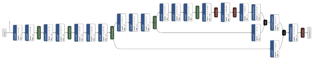

# 使用TensorFlow, ONNX和TensorRT加速深度学习推理


在这篇文章中，您将了解如何使用新的 TensorFlow-ONNX-TensorRT 工作流程部署经过 TensorFlow 训练的深度学习模型。 本教程使用 NVIDIA [TensorRT 8.0.0.3](https://developer.nvidia.com/tensorrt) 并提供[两个代码示例](https://developer.download.nvidia.com/devblogs/speeding-up-tensorflow-onnx-tensorrt-updated-code-examples.zip)，一个用于 TensorFlow v1，一个用于 TensorFlow v2。 TensorRT 是一个推理加速器。

首先，使用任何框架训练网络。 网络经过训练后，批大小和精度是固定的（精度为 `FP32`、`FP16` 或 `INT8`）。 训练后的模型被传递给 TensorRT 优化器，该优化器输出一个优化的运行时，也称为计划(plan)。 `.plan` 文件是 TensorRT 引擎的序列化文件格式。 计划文件必须反序列化才能使用 TensorRT 运行时运行推理。

要优化在 TensorFlow 中实现的模型，您唯一需要做的就是将模型转换为 ONNX 格式，并使用 TensorRT 中的 ONNX 解析器来解析模型并构建 TensorRT 引擎。 下图显示了高级别的 ONNX 工作流程。


在这篇文章中，我们将讨论如何使用 ONNX 工作流程创建 TensorRT 引擎，以及如何从 TensorRT 引擎运行推理。 更具体地说，我们展示了从 Keras 或 TensorFlow 中的模型到 ONNX 以及到带有 ResNet-50、语义分割和 U-Net 网络的 TensorRT 引擎的端到端推理。 最后，我们将解释如何在其他网络上使用此工作流程。

[下载代码示例并解压缩](https://developer.download.nvidia.com/devblogs/speeding-up-tensorflow-onnx-tensorrt-updated-code-examples.zip)。 您可以按照相应的自述文件运行 TensorFlow 1 或 TensorFlow 2 代码示例。 下载文件后，您还应该从 Cityscapes 数据集脚本存储库下载 [labels.py](https://github.com/mcordts/cityscapesScripts/blob/master/cityscapesscripts/helpers/labels.py)，并将其与其他脚本放在同一文件夹中。

## ONNX 概述
ONNX 是一种用于机器学习和深度学习模型的开放格式。 它允许您将来自不同框架（如 `TensorFlow`、`PyTorch`、`MATLAB`、`Caffe` 和 `Keras`）的深度学习和机器学习模型转换为单一格式。

它定义了一组通用的运算符、一组通用的深度学习构建块和一种通用的文件格式。 它提供了计算图的定义，以及内置的运算符。 可能有一个或多个输入或输出的 ONNX 节点列表形成一个无环图。

## ResNet ONNX 工作流示例
在这个例子中，我们展示了如何在两个不同的网络上使用 ONNX 工作流并创建一个 TensorRT 引擎。 第一个网络是 ResNet-50。

工作流程包括以下步骤：

1. 将 TensorFlow/Keras 模型转换为 `.pb` 文件。
2. 将 `.pb` 文件转换为 ONNX 格式。
3. 创建一个 TensorRT 引擎。
4. 从 TensorRT 引擎运行推理。

### Requirements:

```Bash
#IF TensorFlow 1
pip install tensorflow-gpu==1.15.0 keras==2.3.1
#IF TensorFlow 2
pip install tensorflow-gpu==2.4.0 keras==2.4.3

#Other requirements
pip install -U keras2onnx tf2onnx==1.8.2 pillow pycuda scikit-image

#Check installation
python -c "import keras;print(keras.version)"
```

### 将模型转换为 `.pb`**

第一步是将模型转换为 `.pb `文件。 以下代码示例将 ResNet-50 模型转换为 `.pb` 文件：

```Python
import tensorflow as tf
import keras
from tensorflow.keras.models import Model
import keras.backend as K
K.set_learning_phase(0)

def keras_to_pb(model, output_filename, output_node_names):

   """
   This is the function to convert the Keras model to pb.

   Args:
      model: The Keras model.
      output_filename: The output .pb file name.
      output_node_names: The output nodes of the network. If None, then
      the function gets the last layer name as the output node.
   """

   # Get the names of the input and output nodes.
   in_name = model.layers[0].get_output_at(0).name.split(':')[0]

   if output_node_names is None:
       output_node_names = [model.layers[-1].get_output_at(0).name.split(':')[0]]

   sess = keras.backend.get_session()

   # The TensorFlow freeze_graph expects a comma-separated string of output node names.
   output_node_names_tf = ','.join(output_node_names)

   frozen_graph_def = tf.graph_util.convert_variables_to_constants(
       sess,
       sess.graph_def,
       output_node_names)

   sess.close()
   wkdir = ''
   tf.train.write_graph(frozen_graph_def, wkdir, output_filename, as_text=False)

   return in_name, output_node_names

# load the ResNet-50 model pretrained on imagenet
model = keras.applications.resnet.ResNet50(include_top=True, weights='imagenet', input_tensor=None, input_shape=None, pooling=None, classes=1000)

# Convert the Keras ResNet-50 model to a .pb file
in_tensor_name, out_tensor_names = keras_to_pb(model, "models/resnet50.pb", None) 
```
除了 Keras，您还可以从以下位置下载 ResNet-50：

* [深度学习示例 GitHub 存储库](https://github.com/NVIDIA/DeepLearningExamples)：提供最新的深度学习示例网络。 您还可以看到 ResNet-50 分支，其中包含用于训练 ResNet-50 v1.5 模型的脚本和配方。
* [NVIDIA NGC 模型](https://ngc.nvidia.com/catalog/models?orderBy=modifiedDESC&pageNumber=1&query=&quickFilter=models&filters=)：它具有预训练模型的检查点列表。 例如，在 ResNet-50v1.5 上搜索 TensorFlow 并从下载页面获取最新的检查点。


### 将 `.pb` 文件转换为 ONNX
第二步是将`.pb`模型转换为ONNX格式。 为此，首先安装 [tf2onnx](https://github.com/onnx/tensorflow-onnx)。

安装 tf2onnx 后，有两种方法可以将模型从 `.pb` 文件转换为 ONNX 格式。 第一种方法是使用命令行，第二种方法是使用 Python API。 运行以下命令：
```Bash
python -m tf2onnx.convert  --input /Path/to/resnet50.pb --inputs input_1:0 --outputs probs/Softmax:0 --output resnet50.onnx 
```

### 从 ONNX 创建 TensorRT 引擎

要从 ONNX 文件创建 TensorRT 引擎，请运行以下命令：

```Python
import tensorrt as trt

TRT_LOGGER = trt.Logger(trt.Logger.WARNING)
trt_runtime = trt.Runtime(TRT_LOGGER)
def build_engine(onnx_path, shape = [1,224,224,3]):

   """
   This is the function to create the TensorRT engine
   Args:
      onnx_path : Path to onnx_file. 
      shape : Shape of the input of the ONNX file. 
  """
   with trt.Builder(TRT_LOGGER) as builder, builder.create_network(1) as network, builder.create_builder_config() as config, trt.OnnxParser(network, TRT_LOGGER) as parser:
       config.max_workspace_size = (256 << 20)
       with open(onnx_path, 'rb') as model:
           parser.parse(model.read())
       network.get_input(0).shape = shape
       engine = builder.build_engine(network, config)
       return engine

def save_engine(engine, file_name):
   buf = engine.serialize()
   with open(file_name, 'wb') as f:
       f.write(buf)
def load_engine(trt_runtime, plan_path):
   with open(plan_path, 'rb') as f:
       engine_data = f.read()
   engine = trt_runtime.deserialize_cuda_engine(engine_data)
   return engine
```
此代码应保存在 engine.py 文件中，稍后在帖子中使用。

此代码示例包含以下变量：

* `max_workspace_size`：ICudaEngine 在执行时可以使用的最大 GPU 临时内存。


构建器创建一个空网络 (`builder.create_network()`)，并且 ONNX 解析器将 ONNX 文件解析到网络中 (`parser.parse(model.read())`)。 您设置网络的输入形状 (`network.get_input(0).shape = shape`)，之后构建器创建引擎 (`engine = builder.build_cuda_engine(network)`)。 要创建引擎，请运行以下代码示例：
```Python
import engine as eng
import argparse
from onnx import ModelProto
import tensorrt as trt 
 
 engine_name = “resnet50.plan”
 onnx_path = "/path/to/onnx/result/file/"
 batch_size = 1 
 
 model = ModelProto()
 with open(onnx_path, "rb") as f:
    model.ParseFromString(f.read())
 
 d0 = model.graph.input[0].type.tensor_type.shape.dim[1].dim_value
 d1 = model.graph.input[0].type.tensor_type.shape.dim[2].dim_value
 d2 = model.graph.input[0].type.tensor_type.shape.dim[3].dim_value
 shape = [batch_size , d0, d1 ,d2]
 engine = eng.build_engine(onnx_path, shape= shape)
 eng.save_engine(engine, engine_name) 
```

在此代码示例中，您首先从 ONNX 模型中获取输入形状。 接下来，创建引擎，然后将引擎保存在 `.plan` 文件中。

### 从 TensorRT 引擎运行推理：
TensorRT 引擎在以下工作流程中运行推理：

* 为 GPU 中的输入和输出分配缓冲区。
* 将数据从主机复制到 GPU 中分配的输入缓冲区。
* 在 GPU 中运行推理。
* 将结果从 GPU 复制到主机。
* 根据需要重塑结果。


这些步骤在以下代码示例中进行了详细说明。 此代码应保存在 inference.py 文件中，并在本文后面使用。
```Python
import tensorrt as trt
import pycuda.driver as cuda
import numpy as np
import pycuda.autoinit 

def allocate_buffers(engine, batch_size, data_type):

   """
   This is the function to allocate buffers for input and output in the device
   Args:
      engine : The path to the TensorRT engine. 
      batch_size : The batch size for execution time.
      data_type: The type of the data for input and output, for example trt.float32. 
   
   Output:
      h_input_1: Input in the host.
      d_input_1: Input in the device. 
      h_output_1: Output in the host. 
      d_output_1: Output in the device. 
      stream: CUDA stream.

   """

   # Determine dimensions and create page-locked memory buffers (which won't be swapped to disk) to hold host inputs/outputs.
   h_input_1 = cuda.pagelocked_empty(batch_size * trt.volume(engine.get_binding_shape(0)), dtype=trt.nptype(data_type))
   h_output = cuda.pagelocked_empty(batch_size * trt.volume(engine.get_binding_shape(1)), dtype=trt.nptype(data_type))
   # Allocate device memory for inputs and outputs.
   d_input_1 = cuda.mem_alloc(h_input_1.nbytes)

   d_output = cuda.mem_alloc(h_output.nbytes)
   # Create a stream in which to copy inputs/outputs and run inference.
   stream = cuda.Stream()
   return h_input_1, d_input_1, h_output, d_output, stream 

def load_images_to_buffer(pics, pagelocked_buffer):
   preprocessed = np.asarray(pics).ravel()
   np.copyto(pagelocked_buffer, preprocessed) 

def do_inference(engine, pics_1, h_input_1, d_input_1, h_output, d_output, stream, batch_size, height, width):
   """
   This is the function to run the inference
   Args:
      engine : Path to the TensorRT engine 
      pics_1 : Input images to the model.  
      h_input_1: Input in the host         
      d_input_1: Input in the device 
      h_output_1: Output in the host 
      d_output_1: Output in the device 
      stream: CUDA stream
      batch_size : Batch size for execution time
      height: Height of the output image
      width: Width of the output image
   
   Output:
      The list of output images

   """

   load_images_to_buffer(pics_1, h_input_1)

   with engine.create_execution_context() as context:
       # Transfer input data to the GPU.
       cuda.memcpy_htod_async(d_input_1, h_input_1, stream)

       # Run inference.

       context.profiler = trt.Profiler()
       context.execute(batch_size=1, bindings=[int(d_input_1), int(d_output)])

       # Transfer predictions back from the GPU.
       cuda.memcpy_dtoh_async(h_output, d_output, stream)
       # Synchronize the stream
       stream.synchronize()
       # Return the host output.
       out = h_output.reshape((batch_size,-1, height, width))
       return out 
```
前两行用于确定输入和输出的维度。 您在主机 `(h_input_1, h_output)` 中创建页面锁定内存缓冲区。 然后，您为输入和输出分配与主机输入和输出（`d_input_1，d_output`）相同大小的设备内存。 下一步是创建 CUDA 流，用于在设备和主机分配的内存之间复制数据。

在此代码示例中，在 `do_inference` 函数中，第一步是使用 `load_images_to_buffer` 函数将图像加载到主机中的缓冲区。 然后将输入数据传输到 GPU (`cuda.memcpy_htod_async(d_input_1, h_input_1, stream)`) 并使用 `context.execute` 运行推理。 最后将结果从 GPU 复制到主机 (`cuda.memcpy_dtoh_async(h_output, d_output, stream)`)。

## 语义分割 ONNX 工作流示例

在这篇文章中，您将使用类似的网络来运行 ONNX 工作流程以进行语义分割。该网络由一个基于 VGG16 的编码器和三个使用反卷积层实现的上采样层组成。该网络在 Cityscapes 数据集上进行了大约 40,000 次迭代训练。

有多种方法可以将 TensorFlow 模型转换为 ONNX 文件。一种方法是 ResNet50 部分中解释的方法。 Keras 还有自己的 Keras-to-ONNX 文件转换器。有时，TensorFlow-to-ONNX 不支持某些层，但 Keras 到 ONNX 转换器支持它们。根据 Keras 框架和使用的层类型，您可能需要在转换器之间进行选择。

在以下代码示例中，您使用 Keras-to-ONNX 转换器直接将 Keras 模型转换为 ONNX。下载预训练的语义分割文件，[semantic_segmentation.hdf5](https://developer.download.nvidia.com/devblogs/semantic_segmentation.hdf5)。

```Python
import keras
import tensorflow as tf
from keras2onnx import convert_keras

def keras_to_onnx(model, output_filename):
   onnx = convert_keras(model, output_filename)
   with open(output_filename, "wb") as f:
       f.write(onnx.SerializeToString())

semantic_model = keras.models.load_model('/path/to/semantic_segmentation.hdf5')
keras_to_onnx(semantic_model, 'semantic_segmentation.onnx') 
```


与前面的示例一样，使用以下代码示例创建语义分割引擎。

```Python
import engine as eng
from onnx import ModelProto
import tensorrt as trt


engine_name = 'semantic.plan'
onnx_path = "semantic.onnx"
batch_size = 1

model = ModelProto()
with open(onnx_path, "rb") as f:
  model.ParseFromString(f.read())

d0 = model.graph.input[0].type.tensor_type.shape.dim[1].dim_value
d1 = model.graph.input[0].type.tensor_type.shape.dim[2].dim_value
d2 = model.graph.input[0].type.tensor_type.shape.dim[3].dim_value
shape = [batch_size , d0, d1 ,d2]
engine = eng.build_engine(onnx_path, shape= shape)
eng.save_engine(engine, engine_name) 
```
要测试模型的输出，请使用 Cityscapes 数据集。 要使用 Cityscapes，您必须具有以下功能：`sub_mean_chw` 和 `color_map`。

在下面的代码示例中，sub_mean_chw 用于从图像中减去平均值作为预处理步骤，而 color_map 是从类 ID 到颜色的映射。 后者用于可视化。

```C++
import numpy as np
from PIL import Image
import tensorrt as trt
import labels  # from cityscapes evaluation script
import skimage.transform

TRT_LOGGER = trt.Logger(trt.Logger.WARNING)
trt_runtime = trt.Runtime(TRT_LOGGER)

MEAN = (71.60167789, 82.09696889, 72.30508881)
CLASSES = 20

HEIGHT = 512
WIDTH = 1024

def sub_mean_chw(data):
   data = data.transpose((1, 2, 0))  # CHW -> HWC
   data -= np.array(MEAN)  # Broadcast subtract
   data = data.transpose((2, 0, 1))  # HWC -> CHW
   return data

def rescale_image(image, output_shape, order=1):
   image = skimage.transform.resize(image, output_shape,
               order=order, preserve_range=True, mode='reflect')
   return image

def color_map(output):
   output = output.reshape(CLASSES, HEIGHT, WIDTH)
   out_col = np.zeros(shape=(HEIGHT, WIDTH), dtype=(np.uint8, 3))
   for x in range(WIDTH):
       for y in range(HEIGHT):

           if (np.argmax(output[:, y, x] )== 19):
               out_col[y,x] = (0, 0, 0)
           else:
               out_col[y, x] = labels.id2label[labels.trainId2label[np.argmax(output[:, y, x])].id].color
   return out_col  
```
以下代码示例是上一个示例的其余代码。 您必须先运行前一个块，因为您需要定义的函数。 使用该示例比较 Keras 模型和 TensorRT 引擎语义 `.plan` 文件的输出，然后可视化这两个输出。 根据需要替换下面内容 `/path/to/semantic_segmentation.hdf5` 和 `input_file_path`。

```Python
import engine as eng
import inference as inf
import keras
import tensorrt as trt 

input_file_path = ‘munster_000172_000019_leftImg8bit.png’
onnx_file = "semantic.onnx"
serialized_plan_fp32 = "semantic.plan"
HEIGHT = 512
WIDTH = 1024

image = np.asarray(Image.open(input_file_path))
img = rescale_image(image, (512, 1024),order=1)
im = np.array(img, dtype=np.float32, order='C')
im = im.transpose((2, 0, 1))
im = sub_mean_chw(im)

engine = eng.load_engine(trt_runtime, serialized_plan_fp32)
h_input, d_input, h_output, d_output, stream = inf.allocate_buffers(engine, 1, trt.float32)
out = inf.do_inference(engine, im, h_input, d_input, h_output, d_output, stream, 1, HEIGHT, WIDTH)
out = color_map(out)

colorImage_trt = Image.fromarray(out.astype(np.uint8))
colorImage_trt.save(“trt_output.png”)

semantic_model = keras.models.load_model('/path/to/semantic_segmentation.hdf5')
out_keras= semantic_model.predict(im.reshape(-1, 3, HEIGHT, WIDTH))

out_keras = color_map(out_keras)
colorImage_k = Image.fromarray(out_keras.astype(np.uint8))
colorImage_k.save(“keras_output.png”)
```
下图 显示了实际图像和ground truth，以及 Keras 的输出与 TensorRT 引擎的输出。 如您所见，TensorRT 引擎的输出与 Keras 的输出相似。


**ground truth**


**TensorRT输出结果**


**Keras输出结果**


## 在其他网络上试试
现在您可以在其他网络上尝试 ONNX 工作流程。

例如，我们展示了如何将 ONNX 工作流与其他网络一起使用。此示例中的网络是来自 [segmentation_models](https://github.com/qubvel/segmentation_models) 库的 U-Net。在这里，我们只加载了模型，没有训练它。您可能需要在首选数据集上训练这些模型。

关于这些网络的重要一点是，当您加载这些网络时，它们的输入层大小如下：(`None, None, None, 3`)。要创建 TensorRT 引擎，您需要一个已知输入大小的 ONNX 文件。在将此模型转换为 ONNX 之前，通过将大小分配给其输入来更改网络，然后将其转换为 ONNX 格式。

例如，从该库 (segmentation_models) 加载 U-Net 网络并将大小 (`244, 244, 3`) 分配给其输入。在为推理创建 TensorRT 引擎后，进行与语义分割类似的转换。根据应用程序和数据集，您可能需要使用不同的颜色映射。

```Bash
# Requirement for TensorFlow 2
pip install tensorflow-gpu==2.1.0
 
# Other requirements
pip install -U segmentation-models
```
```Python
import segmentation_models as sm
import keras
from keras2onnx import convert_keras
from engine import *
onnx_path = 'unet.onnx'
engine_name = 'unet.plan'
batch_size = 1
CHANNEL = 3
HEIGHT = 224
WIDTH = 224

model = sm.Unet()
model._layers[0].batch_input_shape = (None, 224,224,3)
model = keras.models.clone_model(model)

onx = convert_keras(model, onnx_path)
with open(onnx_path, "wb") as f:
  f.write(onx.SerializeToString())

shape = [batch_size , HEIGHT, WIDTH, CHANNEL]
engine = build_engine(onnx_path, shape= shape)
save_engine(engine, engine_name) 
```

正如我们在本文前面提到的，另一种下载预训练模型的方法是从 [NVIDIA NGC 模型](https://ngc.nvidia.com/catalog/models?orderBy=modifiedDESC&pageNumber=1&query=&quickFilter=models&filters=)下载它们。 它有一个预训练模型的检查点列表。 例如，您可以搜索 UNet for TensorFlow，然后转到下载页面以获取最新的内容。

## 总结
在这篇文章中，我们通过几个示例解释了如何使用 TensorFlow-to-ONNX-to-TensorRT 工作流程部署深度学习应用程序。 第一个示例是 ResNet-50 上的 ONNX-TensorRT，第二个示例是在 Cityscapes 数据集上训练的基于 VGG16 的语义分割。 在文章的最后，我们演示了如何在其他网络上应用此工作流程。 


