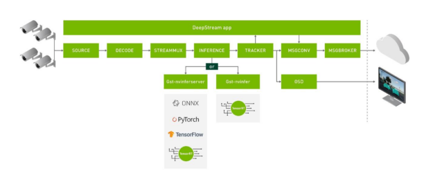

# 利用NVIDIADeepstream管理视频流


交通监控系统、医疗保健和零售业都从**智能视频分析** (IVA) 中受益匪浅。 DeepStream 是一个 IVA SDK。 DeepStream 使您能够在运行时附加和分离视频流，而不会影响整个部署。

这篇文章讨论了使用 DeepStream 进行流添加和删除工作的细节。我还提供了一个关于如何跨多个隔离数据中心集中管理大型部署的想法，通过来自多个摄像头的数据流为多个用例提供服务。

**NVIDIA DeepStream SDK** 是用于多传感器处理的流式分析工具包。流式数据分析用例正在您眼前发生转变。 IVA 在更智能的空间中提供了巨大的帮助。 DeepStream 可在 `NVIDIA T4`、`NVIDIA Ampere` 架构等离散 GPU 和 `NVIDIA Jetson` 系列设备等片上系统平台上运行。

DeepStream 具有灵活性，使您能够使用以下任何一种方式构建复杂的应用程序：

* 多种深度学习框架
* 多个流
* 多个模型串联或并联组合形成一个整体
* 多个模型协同工作
* 以不同的精度计算
* 自定义预处理和后处理
* 使用 Kubernetes 进行编排


DeepStream 应用程序可以有多个插件，如下图 所示。每个插件根据能力可以使用 GPU、DLA 或专用硬件。



DeepStream 从根本上构建允许大规模部署，确保在任何给定时间的吞吐量和准确性。任何 IVA 管道的规模取决于两个主要因素：

* 流管理
* 计算能力


流管理是任何带有许多摄像机的大型部署的一个重要方面。任何大型部署都不能只有关闭才能添加/删除流。如此大规模的部署必须确保在运行时处理虚假流。此外，预计部署将处理用例与使用特定模型运行的管道的运行时附加/分离。

这篇文章帮助您了解流管理的以下方面：

* 使用 DeepStream Python API 进行流消费
* 在运行时添加和删除流
* 在运行时将特定流附加到具有特定模型的管道
* 涉及多个数据中心的大规模部署的流管理


随着应用程序的复杂性增加，更改变得越来越困难。从一开始就经过深思熟虑的发展战略可以大有帮助。在下一节中，我将简要讨论开发 DeepStream 应用程序的不同方法。我还将讨论如何管理流/用例分配和释放，并考虑一些最佳实践。

## DeepStream 应用程序开发
DeepStream 使您能够为基于 AI 的视频、音频和图像分析创建无缝流式传输管道。 DeepStream 让您可以选择使用 `C` 或 `Python` 进行开发，从而为它们提供更大的灵活性。 DeepStream 附带了几个硬件加速插件。 DeepStream 源自 `Gstreamer`，提供 Python 和 C 语言之间的统一 API。

DeepStream 的 `Python` 和 `C` API 是统一的。这意味着任何用 Python 开发的应用程序都可以轻松转换为 C 语言，反之亦然。 Python 和 C 为开发人员提供了所有级别的自由。使用 DeepStream Python 和 C API，可以设计在运行时处理流和用例的动态应用程序。一些示例 Python 应用程序位于：[NVIDIA-AI-IOT/deepstream_python_apps](https://github.com/NVIDIA-AI-IOT/deepstream_python_apps)。

DeepStream SDK 基于 GStreamer 多媒体框架，包括一个 GPU 加速的插件管道。 SDK 中包含用于视频输入、视频解码、图像预处理、基于 NVIDIA TensorRT 的推理、对象跟踪和显示的插件，以简化应用程序开发过程。这些功能可用于创建适应性强的多流视频分析解决方案。

插件是构建管道的核心构建块。输入（即管道的输入，例如`相机和视频文件`）和输出（例如`屏幕显示`）之间的每个数据缓冲区都通过插件传递。视频解码和编码、神经网络推理以及在视频流上显示文本都是插件的示例。连接的插件构成管道。

`Pad`是插件之间的接口。当数据在管道中从一个插件流向另一个插件时，它会从一个插件的 `Source pad` 流向另一个插件的 `Sink pad`。每个插件可能有零个、一个或多个源/接收器组件。


前面的示例应用程序包含以下插件：

* **GstUriDecodebin**：将数据从 URI 解码为原始媒体。它选择一个可以处理给定方案的源插件并将其连接到 decodebin。
* **Nvstreammux**：`Gst-nvstreammux` 插件从多个输入源形成一批帧。
* **Nvinfer**：`Gst-nvinfer` 插件使用 TensorRT 对输入数据进行推理。
* **Nvmultistream-tiler**：`Gst-nvmultistreamtiler` 插件从批处理缓冲区合成 2D 切片。
* **Nvvideoconvert**：`Gst-nvvideoconvert` 执行缩放、裁剪和视频颜色格式转换。
* **NvDsosd**：`Gst-nvdsosd `绘制边界框、文本和感兴趣区域 (ROI) 多边形。
* **GstEglGles**：`EglGlesSink` 在 EGL 表面（xOverlay 界面和 Native Display）上渲染视频帧。


每个插件可以有一个或多个源和 sink pads。在这种情况下，当添加流时，`Gst-Uridecodebin` 插件会添加到管道中，每个流一个。每个 `Gst-Uridecodebin` 插件的源组件连接到单个 `Nv-streammux` 插件上的每个接收器组件。 `Nv-streammux` 从来自所有先前插件的帧创建批次，并将它们推送到管道中的下一个插件。下图 显示了如何将多个摄像机流添加到管道中。


缓冲区通过管道传输数据。 缓冲区带有时间戳，包含由各种 DeepStream 插件附加的元数据。 缓冲区携带诸如有多少插件正在使用它、标志和指向内存中对象的指针等信息。

DeepStream 应用程序可以被认为是由单个组件插件组成的管道。 每个插件都代表一个功能块，例如使用 TensorRT 或多流解码的推理。 在适用的情况下，使用底层硬件加速插件以提供最佳性能。 DeepStream 的关键价值在于让视频深度学习变得容易访问，让您能够专注于快速构建和定制高效且可扩展的视频分析应用程序。

## 运行时流添加/删除功能

DeepStream 为 Python 和 C 语言的运行时添加/删除功能提供了示例实现。样本位于以下位置：

* DeepStream源添加删除（C）：https://github.com/NVIDIA-AI-IOT/deepstream_reference_apps/tree/master/runtime_source_add_delete
* DeepStream源添加删除（Python）：https://github.com/NVIDIA-AI-IOT/deepstream_python_apps/tree/master/apps/runtime_source_add_delete


这些应用程序的设计考虑到了简单性。这些应用程序采用一个输入流，并在设定的时间间隔后将同一流多次添加到正在运行的管道中。这是在不重新启动应用程序的情况下将指定数量的流添加到管道的方式。最终，每个流在每个时间间隔都被删除。删除最后一个流后，应用程序会优雅地停止。

要开始使用示例应用程序，请执行以下步骤。

### 创建基于 Python 的应用程序
1. 从 ngc.nvidia.com 拉取 [DeepStream Docker](https://ngc.nvidia.com/catalog/containers/nvidia:deepstream) 映像。
2. 在 Docker 容器内的 [Python 应用程序存储](https://github.com/NVIDIA-AI-IOT/deepstream_python_apps)库上运行 git clone。
3. 转到 Docker 容器中的以下位置： deepstream_python_apps/apps/runtime_source_add_delete
4. [安装一些需要的 Python 库](https://github.com/NVIDIA-AI-IOT/deepstream_python_apps/blob/master/apps/README)。
5. 转到 apps/runtime_source_add_delete 并执行应用程序，如下所示：

```Bash
python3 deepstream-test-rt-src-add-del.py <uri>
python3 deepstream_rt_src_add_del.py file:///opt/nvidia/deepstream/deepstream-<VER>/samples/streams/sample_720p.mp4
```

### 创建基于 C 的应用程序
1. 从 ngc.nvidia.com 拉取 [DeepStream Docker](https://ngc.nvidia.com/catalog/containers/nvidia:deepstream) 映像。 ：
2. 在 Docker 容器内 /opt/nvidia/deepstream/deepstream/sources/apps/sample_apps/ 的 C 应用程序存储库上运行 git clone。
3. 转到 deepstream_reference_apps/runtime_source_add_delete 并编译并运行应用程序，如下所示：

```Bash
make
./deepstream-test-rt-src-add-del <uri>
./deepstream-test-rt-src-add-del file:///opt/nvidia/deepstream/deepstream-<VER>/samples/streams/sample_720p.mp4
```

## 应用方面：运行时添加/删除摄像头
DeepStream Python 或 C 应用程序通常在运行脚本时将输入流作为参数列表。代码执行后，会发生一系列事件，最终将流添加到正在运行的管道中。

在这里，您使用 `uridecodebin` 插件将数据从 URI 解码为原始媒体。它选择可以处理给定方案的源插件并将其连接到解码箱。

这是注册任何流时发生的序列列表：

1. 源 `bin` 由函数 `create_uridecode_bin` 从 `Curidecodebin` 插件创建。函数 `create_uridecode_bin` 接受第一个参数 `source_id`，它是一个整数，第二个参数是 `rtsp_url`。在这种情况下，这个整数是从 `1…..N` 开始的流的顺序。此整数用于创建一个唯一可识别的源 bin 名称，如 `source-bin-1`、`source-bin-2`、... `source-bin-N`。
2. `g_source_bin_list` 字典在` source-bin` 和 `id` 值之间映射。
3. 创建源 bin 后，来自程序参数的 `RTSP 流` URL 将附加到此源 bin。
4. 之后，`uridecodebin` 的 `source-bin` 值链接到下一个插件 `streammux` 的 `sink-bin`。
5. 这样的多个 `uridecodebin` 插件被创建，每个插件用于一个流，并附加到 `streammux` 插件。


以下代码示例显示了 Python 中将多个流附加到 DeepStream 管道的最少代码。
```Python
g_source_bin_list = []
for i in range(num_sources):
    print("Creating source_bin ",i," \n ")
    uri_name=argv[i]
    if uri_name.find("rtsp://") == 0 :
        is_live = True
    #Create source bin and add to pipeline
    source_bin=create_uridecode_bin(i, uri_name)
    g_source_bin_list[rtsp[i]] = source_bin
    pipeline.add(source_bin)
```

在一个更有条理的应用程序中，这些负责添加流的代码行被转移到一个函数，该函数接受两个参数来附加一个流：`stream_id` 和 `rtsp_url`。 您可以随时调用此类函数并将更多流附加到正在运行的应用程序。

同样，当流必须从应用程序中分离时，会发生以下事件：

1. 已附加流的 `source_id` 被赋予函数 `stop_release_source`。
2. 附加到要释放的 `source_id` 的 `streammux` 的 `sink-pad` 与 `uridecodebin` 的源 bin 分离。
3. 然后从管道中删除 `uridecodebin` 的源 bin。
4. 活动源计数减一。


以下代码示例显示了用于从 DeepStream 管道中分离流的 Python 代码。
```Python
def stop_release_source(source_id):
    pad_name = "sink_%u" % source_id
    print(pad_name)
    #Retrieve sink pad to be released
    sinkpad = streammux.get_static_pad(pad_name)
    #Send flush stop event to the sink pad, then release from the streammux
    sinkpad.send_event(Gst.Event.new_flush_stop(False))
    streammux.release_request_pad(sinkpad)
    #Remove the source bin from the pipeline
    pipeline.remove(g_source_bin_list[source_id])
    source_id -= 1
    g_num_sources -= 1
```

## 部署方面：运行时摄像头和用例管理
之前，我讨论了如何在代码中添加和删除流。考虑到部署方面，还有其他一些因素。

以前，您使用命令行参数获取所有输入流。但是，在程序执行后并在部署期间，您不能为其提供任何附加参数。您如何将指令传递给正在运行的程序要附加或分离哪个流？

部署需要额外的代码来定期检查是否有必须附加的新流可用。应删除以下流：

* 流不再需要监控。
* 摄像头问题导致没有流。
* 以前附加的流必须用于另一个用例。


在多个数据中心进行流处理的情况下，优先选择离数据中心最近的流源。

DeepStream 管道在主线程中运行。需要一个单独的线程来检查要添加或删除的流。幸运的是，Glib 有一个名为 `g_timeout_add_seconds` 的函数。 Glib 是 GNU C 库项目，它为 GNU 系统和 GNU/Linux 系统以及许多其他使用 Linux 作为内核的系统提供核心库。

`g_timeout_add_seconds (set)` 是在管道运行时定期调用的函数。重复调用该函数，直到返回 FALSE，此时超时自动销毁，不再调用该函数。

`guint g_timeout_add_seconds`（`guint interval, GSourceFunc function, gpointer data`）；

`g_timeout_add_seconds` 需要三个输入：

* **Interval**：调用函数之间的时间，以秒为单位。
* **function**：要调用的函数。
* **data**：传递给函数的数据和参数。


例如，您调用一个函数 `watchDog`，它需要 `GSourceBinList`。 `streamURL` 和 `streamId` 之间的字典映射。 `streamId` 是在将流添加到管道后生成的内部 ID（整数）。最终的调用者函数类似于以下代码示例：

```C++
guint interval = 10;
guint g_timeout_add_seconds (interval, watchDog, GSourceBinList,  argv);
```

根据当前的间隔设置，`watchDog` 函数每 10 秒调用一次。 必须维护一个数据库来管理和跟踪许多流。 这样的示例数据库表如表 1 所示。函数 `watchDog` 可用于查询数据库，其中维护了所有可用流的当前状态和用例列表。

|Source ID|	RTSP URL|	Stream State	|Use case|	Camera Location|	Taken|
|----|----|----|----|----|----|
|1|	Rtsp://123/1.mp4|	ON|	License Plate Detection|	Loc1|	True|
|2|	Rtsp://123/2.mp4|	BAD STREAM|	License Plate Detection	|Loc2	|False|
|3	|Rtsp://123/3.mp4|	OFF|	Motion Detection|	Loc2|	False|
|n|	Rtsp://123/n.mp4|	OFF|	Social Distance	|Loc3|	False|


以下是同时管理多个流所需的最低限度数据库结构（SQL/no-SQL）的示例：

* **Source ID**：一个唯一的 ID，也是它所连接的 `nvstreammux` 的 `sink pad ID`。 `source_id` 可用于监控 `nv-gst` 事件，例如，为每个流添加已删除的 EOS。请记住，在前面的简单应用程序中，您考虑将源 bin 按参数输入的顺序设置为 `source-bin-1`、`source-bin-2`、... `source-bin-N`。您对许多相机使用相同的方法并跟踪应用程序范围内的所有活动源箱。
* **RTSP URL**：源插件应该使用的 URL。
* **流状态**：有助于管理流的状态，例如 ON 或 OFF。数据库客户端还必须能够根据客户端感知的内容更改摄像头，例如 BAD STREAM、NO STREAMm CAMERA FAULT 等。这有助于即时维护。
* **用例**：为相机分配一个用例。检查此用例，并且仅连接模型当前处于活动状态的那些相机。
* **摄像头位置**：帮助根据摄像头的位置定位计算。此检查避免了来自位于远处位置的相机的不必要捕获，并且可以更好地分配给附近的其他计算集群。
* **Taken**：假设部署是具有多个节点的多个 GPU。当在任何机器和任何 GPU 上运行的 DeepStream 应用程序添加任何源时，它会将标志设置为 True。这可以防止另一个实例再次重复添加相同的源。


维护所描述的模式可以从中心位置轻松创建和监控仪表板。

回到 `watchDog` 函数，这是检查流状态并根据位置和用例附加新视频流的伪代码：

```C++
FUNCTION watchDog (Dict: GSourceBinList)
INITIALIZE streamURL ⟵ List ▸ Dynamic list of stream URLs
INITIALIZE streamState ⟵ List ▸ Dynamic list of state corresponding to stream URLs
INITIALIZE streamId ⟵ Integer ▸ variable to store id for new stream
streamURL, streamState := getCurrentCameraState()

FOR X = 1 in length(streamState)
	IF ((streamURL[X] IN gSourceBinList.keys()) & (streamState[X] == "OFF"))
			stopReleaseSource(streamURL[X]) ▸ Detach stream

streamURL, streamState := getAllStreamByLocationAndUsecase()
FOR Y = 1 in length(streamState)
	IF ((streamURL[Y] NOT IN gSourceBinList.keys()) & (streamState [Y] == "ON")
			streamId := addSource(streamURL[Y]) ▸ Add new stream
			GSourceBinList(streamURL, streamId) ▸ update mappings
RETURN GSourceBinList

```

* 应用程序在模块加载和全局变量初始化后进入主函数。
* 在主函数中，本地模块和变量被初始化。
* 当应用程序第一次启动时，它会在应用位置和用例过滤器后从数据库中请求流列表。
* 收到流列表后，DeepStream管道的所有插件都被初始化，链接，并设置为PLAY状态。此时，应用程序正在使用提供的所有流运行。
* 在每个设定的时间间隔之后，一个单独的线程检查数据库中当前流的状态。如果数据库中任何已添加的流的状态更改为 OFF，则释放该流。该线程还检查数据库中是否列出了具有 ON 状态的新相机，在应用位置和用例过滤器后将流添加到 DeepStream 管道。
* 添加流后，必须将数据库的 Taken 列中的标志设置为 True，这样其他进程就不能再次添加相同的流。


下图显示了有效添加删除摄像头流并附加到使用适当模型运行的服务器所需的功能调用的整体流程。


仅仅改变源的数量并没有帮助，因为源的下游组件必须能够根据流的数量来改变它们的属性。 为此，DeepStream 应用程序的组件已经过优化，可以在运行时更改属性。

但是，许多插件在初始化期间使用批量大小作为参数来分配计算/内存资源。 在这种情况下，我们建议在执行应用程序时指定最大批处理大小。


