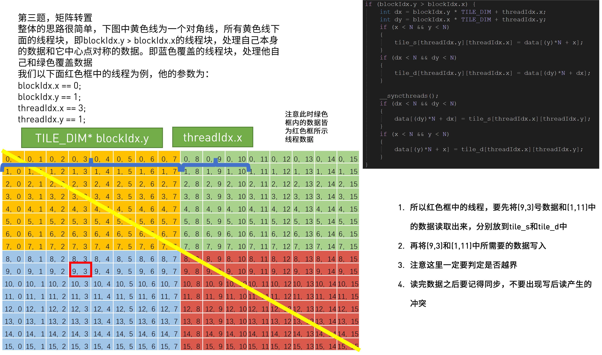

# CUDA优化实例: In-Place矩阵转置

所谓In-Place矩阵转置, 简单点说就是我们在同一个内存空间内做矩阵转置的操作.这也是很多计算需要的步骤之一, 这样操作可以有效减少对存储单元的需求.

利用CUDA优化矩阵转置,可以参考我之前的blog:
https://blog.csdn.net/kunhe0512/article/details/124884614

而In-Place矩阵转置简单点说, 我们可以使用一半的线程来完成任务:



----


这里使用一半的线程的意义在于即使使用全部线程也不能增加速度, 用一半的线程还可以节省资源

源码如下:
```C++
#include <stdio.h>
#include <stdlib.h>
#include "error.cuh"

#define TILE_DIM 32   //Don't ask me why I don't set these two values to one
#define BLOCK_SIZE 32
#define N 1000 

__managed__ int input_M[N*N];      //input matrix & GPU result
int cpu_result[N*N];   //CPU result


//in-place matrix transpose
__global__ void ip_transpose(int* data)
{
  __shared__ int tile_s[TILE_DIM][TILE_DIM+1];
  __shared__ int tile_d[TILE_DIM][TILE_DIM+1];

  int x = blockIdx.x * TILE_DIM + threadIdx.x;
  int y = blockIdx.y * TILE_DIM + threadIdx.y;

  //Threads in the triangle below
  if (blockIdx.y>blockIdx.x) { 
    int dx = blockIdx.y * TILE_DIM + threadIdx.x;
    int dy = blockIdx.x * TILE_DIM + threadIdx.y;
    if(x<N && y<N)
    {
        tile_s[threadIdx.y][threadIdx.x] = data[(y)*N + x];
    }
    if(dx<N && dy<N)
    {
        tile_d[threadIdx.y][threadIdx.x] = data[(dy)*N + dx];
    }
    
    __syncthreads();
    if(dx<N && dy<N)
    {
        data[(dy)*N + dx] = tile_s[threadIdx.x][threadIdx.y];
    }
    if(x<N && y<N)
    {
        data[(y)*N + x] = tile_d[threadIdx.x][threadIdx.y];
    }
  }
  else if (blockIdx.y==blockIdx.x)//Threads on the diagonal
  { 
      if(x<N && y<N)
      {
          tile_s[threadIdx.y][threadIdx.x] = data[(y)*N + x];
      }
      __syncthreads();
      if(x<N && y<N)
      {
          data[(y)*N + x] = tile_s[threadIdx.x][threadIdx.y];
      }
  }
}

void cpu_transpose(int* A, int* B)
{
    for (int j = 0; j < N; j++)
    {
        for (int i = 0; i < N; i++)
        {
            B[i*N+j] = A[j*N+i];
        }
    }
}

int main(int argc, char const *argv[])
{
    
    cudaEvent_t start,stop_gpu;
    CHECK(cudaEventCreate(&start));
    CHECK(cudaEventCreate(&stop_gpu));


    for (int i = 0; i < N; ++i) {
        for (int j = 0; j < N; ++j) {
            input_M[i * N + j] = rand()%1000;
        }
    }
    cpu_transpose(input_M, cpu_result);
    
    CHECK(cudaEventRecord(start));
    unsigned int grid_rows = (N + BLOCK_SIZE - 1) / BLOCK_SIZE;
    unsigned int grid_cols = (N + BLOCK_SIZE - 1) / BLOCK_SIZE;
    dim3 dimGrid(grid_cols, grid_rows);
    dim3 dimBlock(BLOCK_SIZE, BLOCK_SIZE);
    ip_transpose<<<dimGrid, dimBlock>>>(input_M);
    CHECK(cudaDeviceSynchronize());
    CHECK(cudaEventRecord(stop_gpu));
    CHECK(cudaEventSynchronize(stop_gpu));
    
    float elapsed_time_gpu;
    CHECK(cudaEventElapsedTime(&elapsed_time_gpu, start, stop_gpu));
    printf("Time_GPU = %g ms.\n", elapsed_time_gpu);

    CHECK(cudaEventDestroy(start));
    CHECK(cudaEventDestroy(stop_gpu));

    int ok = 1;
    for (int i = 0; i < N; ++i)
    { 
        for (int j = 0; j < N; ++j)
        {
            if(fabs(input_M[i*N + j] - cpu_result[i*N + j])>(1.0e-10))
            {
                ok = 0;
            }
        }
    }


    if(ok)
    {
        printf("Pass!!!\n");
    }
    else
    {
        printf("Error!!!\n");
    }
    
    return 0;
}
```

