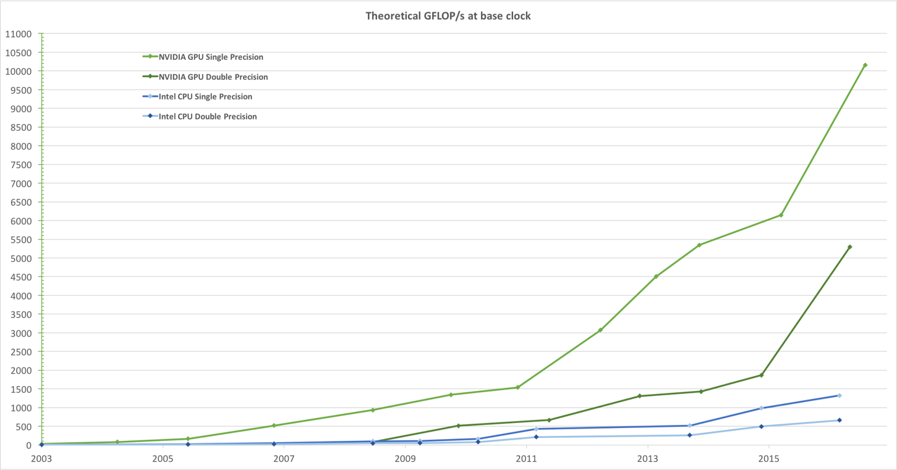
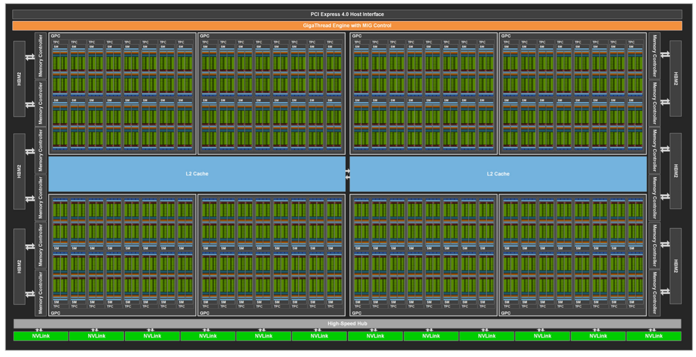
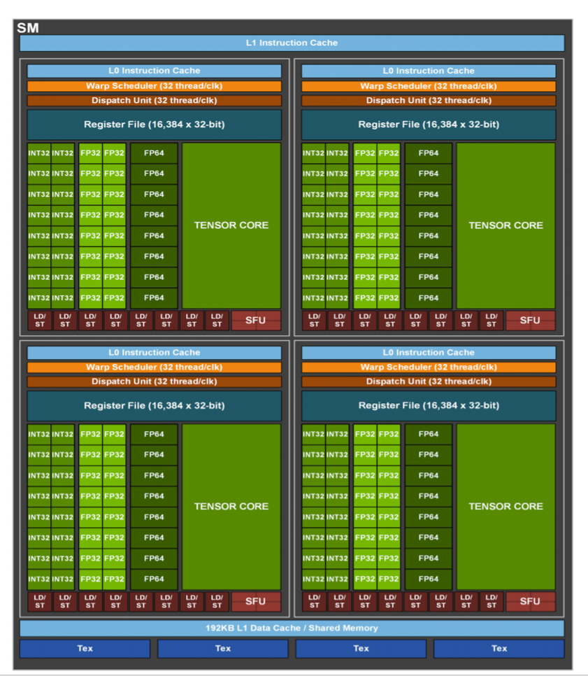
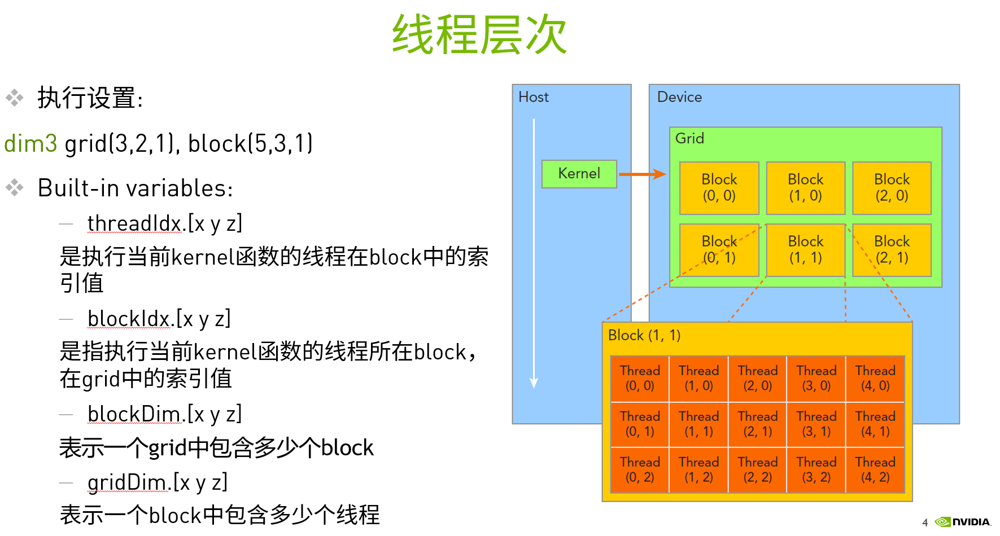
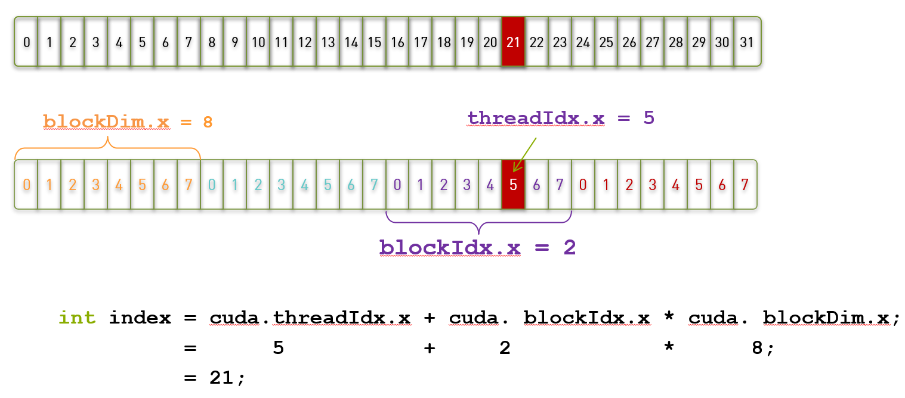

# CUDA Python详细教程(含环境配置和源码)

## 环境配置

1.	安装Anaconda
因为本次课程课件描述部分是以ipython文件形式呈现，对于windows用户需要配置Jupyter-lab。如您已经有了可以查看ipython文件的环境，可以忽略此步骤
下载地址，并按照程序步骤安装：
https://www.anaconda.com/products/individual#Downloads

2.	安装CUDA
下载CUDA工具包并按照程序步骤安装：https://developer.nvidia.com/cuda-downloads

3.	利用Anaconda配置环境

    打开windows菜单中的Anaconda Powershell prompt输入如下命令：

    conda install python

    conda install numba

    conda install cudatoolkit

    pip install opencv-python

    conda install jupyterlab


## 1. 什么是CUDA？
* CUDA

    Compute Unified Device Architecture

* CUDA C/C++

  基于C/C++的编程方法 支持异构编程的扩展方法 简单明了的APIs，能够轻松的管理存储系统

* CUDA支持的编程语言：

    C/C++/Python/Fortran/Java/…….




## 2.适用设备:
- 所有包含NVIDIA GPU的服务器，工作站，个人电脑，嵌入式设备等电子设备
- 软件安装:  

    Windows：https://docs.nvidia.com/cuda/cuda-installation-guide-microsoft-windows/index.html
	只需安装一个.exe的可执行程序

    Linux：https://docs.nvidia.com/cuda/cuda-installation-guide-linux/index.html 
	按照上面的教程，需要6 / 7 个步骤即可

    Jetson： https://developer.nvidia.com/embedded/jetpack
	直接利用NVIDIA SDK Manager 或者 SD image进行刷机即可

通过下面的命令查看是否安装好CUDA

```Bash
nvcc -V

nvcc: NVIDIA (R) Cuda compiler driver
Copyright (c) 2005-2021 NVIDIA Corporation
Built on Wed_Jun__2_19:25:35_Pacific_Daylight_Time_2021
Cuda compilation tools, release 11.4, V11.4.48
Build cuda_11.4.r11.4/compiler.30033411_0
```

通过下面的命令查看是否有支持CUDA的 NVIDIA GPU

```Bash
nvidia-smi
```
```C++
+-----------------------------------------------------------------------------+
| NVIDIA-SMI 471.11       Driver Version: 471.11       CUDA Version: 11.4     |
|-------------------------------+----------------------+----------------------+
| GPU  Name            TCC/WDDM | Bus-Id        Disp.A | Volatile Uncorr. ECC |
| Fan  Temp  Perf  Pwr:Usage/Cap|         Memory-Usage | GPU-Util  Compute M. |
|                               |                      |               MIG M. |
|===============================+======================+======================|
|   0  NVIDIA GeForce ... WDDM  | 00000000:01:00.0  On |                  N/A |
| 30%   46C    P8    32W / 250W |   1763MiB / 11264MiB |     19%      Default |
|                               |                      |                  N/A |
+-------------------------------+----------------------+----------------------+
                                                                               
+-----------------------------------------------------------------------------+
| Processes:                                                                  |
|  GPU   GI   CI        PID   Type   Process name                  GPU Memory |
|        ID   ID                                                   Usage      |
|=============================================================================|
|    0   N/A  N/A      1884    C+G   C:\Windows\System32\dwm.exe     N/A      |
|    0   N/A  N/A      5728    C+G   ...wekyb3d8bbwe\Video.UI.exe    N/A      |
|    0   N/A  N/A      6236    C+G   C:\Windows\explorer.exe         N/A      |
```

## 3.GPU的硬件结构
下图所示的是GA100的硬件架构图，它包含了：
- 8192 FP32 CUDA Cores（用于计算的核心）
- 128个SM（SM指stream multiprocessor，即流多处理器，可以方便一块线程之间的协作）
- 每个SM包含64个FP32 CUDA Core，4个第三代Tensor Core  


- Device


- SM  


## 4.CUDA的线程层次
在计算机科学中，执行线程是可由调度程序独立管理的最小程序指令序列。  
在GPU中，可以从多个层次管理线程：
- Thread: sequential execution unit
    所有线程执行相同的核函数
    并行执行
- Thread Block: a group of threads
    执行在一个Streaming Multiprocessor (SM)
    同一个Block中的线程可以协作
- Thread Grid: a collection of thread blocks
    一个Grid当中的Block可以在多个SM中执行



## 5.CUDA程序的编写
- kernel函数的实现
    需要在核函数之前加上 **@cuda.jit**标识符  
```Python
    @cuda.jit
    def add_kernel(x, y, out):
```
- kernel函数的调用
    需要添加执行设置  
    **add_kernel[blocks_per_grid, threads_per_block](x, y, out)**  
    这里的blocks_per_grid代表Grid中block在x,y,z三个维度的数量  
    这里的threads_per_block代表Block中thread在x,y,z三个维度的数量  

## 6.CUDA线程索引
- 我们可以通过cuda.threadIdx，cuda.blockIdx，cuda.blockDim，cuda.gridDim来确定每个线程要处理的数据  



## 7.实际编程 
接下来我们来尝试编写第一个CUDA程序。我们来实现一个向量加法的例子，将两个包含1000000个元素的向量相加  
当我们用CPU实现时：
```Python
def vecAdd (n, a, b, c)
    for i in range(n):    
        c[i] = a[i] + b[i];
```
当我们用GPU实现时：
```Python
def add_kernel(x, y, out):
    tx = cuda.threadIdx.x # 当前线程在block中的索引值
    ty = cuda.blockIdx.x  # 当前线程所在block在grid中的索引值

    block_size = cuda.blockDim.x  # 每个block有多少个线程
    grid_size = cuda.gridDim.x    # 每个grid有多少个线程块
    
    start = tx + ty * block_size
    stride = block_size * grid_size
    
    for i in range(start, x.shape[0], stride):
        out[i] = x[i] + y[i]
```

执行下面的代码，来完成向量相加的例子

```Python
from numba import cuda, float32

@cuda.jit
def add_kernel(x, y, out):
    tx = cuda.threadIdx.x 
    ty = cuda.blockIdx.x  

    block_size = cuda.blockDim.x  
    grid_size = cuda.gridDim.x    
    
    start = tx + ty * block_size
    stride = block_size * grid_size
    for i in range(start, x.shape[0], stride):
        out[i] = x[i] + y[i]

import numpy as np

n = 100000
x = np.arange(n).astype(np.float32)
y = 2 * x
out = np.empty_like(x)

threads_per_block = 128
blocks_per_grid = 30

add_kernel[blocks_per_grid, threads_per_block](x, y, out)
print(out[:20])
```

此时，我们看到在计算向量运算的时候，GPU比CPU有明显的速度优势  
**虽然这个例子很简单，但是在我们的实际应用中却经常用到。  
比如：我们在对拍好的照片进行美化的时候，需要将照片的亮度调整。那么此时，我们就需要对每一个像素点的数值进行增大或者缩小。如果我们把图片的所有像素值想象成我们上面处理的向量，利用CUDA就可以非常有效的进行加速**


**如上图所示，我们只需要让每个线程来调整一个像素中数值即可调整整张图片的亮度和对比度**  
**接下来执行下面的代码，完成调整图片亮度的例子：**

第一步，完成CUDA核函数

```Python
import cv2
import numba
import time
import math

#GPU function
@cuda.jit
def process_gpu(img,rows,cols,channels):
    tx = cuda.blockIdx.x*cuda.blockDim.x+cuda.threadIdx.x
    ty = cuda.blockIdx.y*cuda.blockDim.y+cuda.threadIdx.y
    if tx<rows and ty<cols:                             
        for c in range(channels):
            color = img[tx,ty][c]*2.0+30
            if color>255:
                img[tx,ty][c]=255
            elif color<0:
                img[tx,ty][c]=0
            else:
                img[tx,ty][c]=color
```

第二步，实现CPU端处理的代码

```Python
#cpu function
def process_cpu(img):
    rows,cols,channels=img.shape
    for i in range(rows):
        for j in range(cols):
            for c in range(3):
                color=img[i,j][c]*2.0+30
                if color>255:
                    img[i,j][c]=255
                elif color<0:
                    img[i,j][c]=0
                else:
                    img[i,j][c]=color
```
第三步，定义main函数，利用opencv读取图片，并将它分别交给CPU和GPU进行处理


```Python
def main_image_process():
    #Create an image.
    filename = 'test1.jpg'
    img = cv2.imread(filename)
    img2 = cv2.imread(filename)
    img = cv2.resize(img,(1000,1000),interpolation = cv2.INTER_AREA)
    img2 = cv2.resize(img,(1000,1000),interpolation = cv2.INTER_AREA)
    rows,cols,channels=img.shape
    dst_cpu = img.copy()
    dst_gpu = img.copy()
    start_cpu = time.time()
    process_cpu(img)
    end_cpu = time.time()
    time_cpu = (end_cpu-start_cpu)
    print("CPU process time: "+str(time_cpu))
    ##GPU function
    threadsperblock = (16,16)
    blockspergrid_x = int(math.ceil(rows/threadsperblock[0]))
    blockspergrid_y = int(math.ceil(cols/threadsperblock[1]))
    blockspergrid = (blockspergrid_x,blockspergrid_y)
    start_gpu = time.time()
    dImg = cuda.to_device(img2)
    cuda.synchronize()
    process_gpu[blockspergrid,threadsperblock](dImg,rows,cols,channels)
    cuda.synchronize()
    end_gpu = time.time()
    dst_gpu = dImg.copy_to_host()
    time_gpu = (end_gpu-start_gpu)
    print("GPU process time: "+str(time_gpu))
    #save
    cv2.imwrite("result_cpu.png",img)
    cv2.imwrite("result_gpu.png",dst_gpu)
    print("Done.")
```
第四步，执行，得到处理结果

```Python
main_image_process()
```
```C++
CPU process time: 7.344363451004028
GPU process time: 0.018997907638549805
Done.
```

此时，查看result_cpu.png和result_gpu.png。我们很清楚的看到，完成同样的事情并得到相同的结果，CPU比GPU用了更多的时间

## 8.矩阵相乘  
完成上一个例子，您就已经能够进行简单的CUDA编程了。接下来我们体验一下难一点的例子，矩阵相乘。  
矩阵操作在很多领域都有非常广泛的应用，比如在非常热门的卷积神经网络中的卷积操作，就可以利用矩阵乘来完成。接下来，我们就尝试利用CUDA来加速矩阵相乘的操作。  
下面展示了如何利用CPU来完成矩阵相乘的操作    

```Python
def matmul_cpu(A,B,C):
	for y in range(B.shape[1]):
		for x in range(A.shape[0]):
			tmp = 0
			for k in range(A.shape[1]):
				tmp += A[x,k]*B[k,y]
			C[x,y] = tmp
```

此时，我们看到，CPU代码的逻辑是，逐一求出结果矩阵P中的每一个元素的值。   
而利用CUDA来加速时，我们要申请与C矩阵中元素个数相等的线程，每个线程来处理求一个C矩阵中的元素值，最终并行执行得到结果矩阵。

```Python
@cuda.jit
def matmul_gpu(A,B,C):
	row,col = cuda.grid(2)
	if row < C.shape[0] and col < C.shape[1]:
		tmp = 0.
		for k in range(A.shape[1]):
			tmp += A[row,k]*B[k,col]
		C[row,col] = tmp
```

**执行下面的代码，完成矩阵相乘的例子**

第一步，实现CPU端代码

```Python
def matmul_cpu(A,B,C):
    for y in range(B.shape[1]):
        for x in range(A.shape[0]):
            tmp = 0
            for k in range(A.shape[1]):
                tmp += A[x,k]*B[k,y]
            C[x,y] = tmp
```

第二步，实现CUDA核函数

```Python
@cuda.jit
def matmul_gpu(A,B,C):
    row,col = cuda.grid(2)
    if row < C.shape[0] and col < C.shape[1]:
        tmp = 0.
        for k in range(A.shape[1]):
            tmp += A[row,k]*B[k,col]
        C[row,col] = tmp
```
第三步，利用SM中的Shared memory来优化核函数

```Python
TPB = 16
@cuda.jit
def matmul_shared_mem(A,B,C):
    sA = cuda.shared.array(shape=(TPB,TPB), dtype=float32)
    sB = cuda.shared.array(shape=(TPB,TPB), dtype=float32)

    x,y = cuda.grid(2)

    tx = cuda.threadIdx.x
    ty = cuda.threadIdx.y
    if x>=C.shape[0] or y >= C.shape[1]:
        return
    tmp = 0.
    for i in range(int(A.shape[1]/TPB)):
        sA[tx, ty] = A[x, ty+i*TPB]
        sB[tx, ty] = B[tx+i*TPB, y]
        cuda.syncthreads()
        for j in range(TPB):
            tmp += sA[tx,j]*sB[j,ty]
    C[x,y] = tmp
```
第四步，定义main函数，在这部中，我们初始化A，B矩阵，并将数据传输给GPU
```Python
def main_matrix_mul():
    TPB = 16
    A = np.full((TPB*1000,TPB*1000), 3.0, np.float)
    B = np.full((TPB*1000,TPB*1000), 4.0, np.float)
    C_cpu = np.full((A.shape[0],B.shape[1]), 0, np.float)
    
    #Start in CPU
    #print("Start processing in CPU")
    #start_cpu = time.time()
    #matmul_cpu(A,B,C_cpu)
    #end_cpu = time.time()
    #time_cpu = (end_cpu - start_cpu)
    #print("CPU time: "+str(time_cpu))
    
    #Start in GPU
    A_global_mem = cuda.to_device(A)
    B_global_mem = cuda.to_device(B)
    
    C_global_mem = cuda.device_array((A.shape[0],B.shape[1]))
    C_shared_mem = cuda.device_array((A.shape[0],B.shape[1]))
    
    threadsperblock = (TPB, TPB)
    blockspergrid_x = int(math.ceil(A.shape[0]/threadsperblock[0]))
    blockspergrid_y = int(math.ceil(A.shape[1]/threadsperblock[1]))
    blockspergrid = (blockspergrid_x,blockspergrid_y)
    
    print("Start processing in GPU")
    start_gpu = time.time()
    matmul_gpu[blockspergrid, threadsperblock](A_global_mem,B_global_mem,C_global_mem)
    cuda.synchronize()
    end_gpu = time.time()
    time_gpu = (end_gpu - start_gpu)
    print("GPU time(global memory):"+str(time_gpu))
    C_global_gpu = C_global_mem.copy_to_host()
    
    print("Start processing in GPU (shared memory)")
    start_gpu = time.time()
    matmul_shared_mem[blockspergrid, threadsperblock](A_global_mem,B_global_mem,C_global_mem)
    cuda.synchronize()
    end_gpu = time.time()
    time_gpu = (end_gpu - start_gpu)
    print("GPU time(shared memory):"+str(time_gpu))
    C_shared_gpu = C_shared_mem.copy_to_host
```

第五步，执行main函数，对比使用不同的方法来加速矩阵乘的速度差异

```Python
main_matrix_mul()
```
```C++
Start processing in GPU
GPU time(global memory):77.07939052581787
Start processing in GPU (shared memory)
GPU time(shared memory):45.05343770980835
```

此时，我们可以看到，GPU比CPU有明显的速度优势。这样，我们如果在人工智能或者深度学习中利用GPU进行加速，就可以取得非常大的性能优势

**接下来，我们再看一个利用卷积操作对图像进行模糊的例子**

请连续执行下面三个代码块
```Python
@cuda.jit
def convolve(result, mask, image):
    i, j = cuda.grid(2) 
    image_rows, image_cols, channels = image.shape
    if (i <= image_rows) and (j <= image_cols): 
        delta_rows = mask.shape[0] // 2 
        delta_cols = mask.shape[1] // 2
        for c in range(3):
            result[i, j][c] = 0
        for k in range(mask.shape[0]):
            for l in range(mask.shape[1]):
                i_k = i - k + delta_rows
                j_l = j - l + delta_cols
                if (i_k >= 0) and (i_k < image_rows) and (j_l >= 0) and (j_l < image_cols):
                    for c in range(3):
                        result[i, j][c] += mask[k, l] * image[i_k, j_l][c]
```
```Python
def main_convolve():
    filename = 'test1.jpg'
    img = cv2.imread(filename).astype(np.float32)
    dImg = cuda.to_device(img)
    result = cuda.to_device(img)
    rows,cols,channels=img.shape
    dst_gpu = img.copy()
    
    mask = np.random.rand(13, 13).astype(np.float32) 
    mask /= mask.sum() 

    ##GPU function
    threadsperblock = (16,16)
    blockspergrid_x = int(math.ceil(rows/threadsperblock[0]))
    blockspergrid_y = int(math.ceil(cols/threadsperblock[1]))
    blockspergrid = (blockspergrid_x,blockspergrid_y)
    cuda.synchronize()
    start_gpu = time.time()
    convolve[blockspergrid,threadsperblock](result,mask,dImg)
    cuda.synchronize()
    end_gpu = time.time()
    result_gpu = result.copy_to_host()
    time_gpu = (end_gpu-start_gpu)
    print("GPU process time: "+str(time_gpu))
    #save
    cv2.imwrite("result_gpu_convolve.png",result_gpu)
    print("Done.")
```
```Python
main_convolve()
```

此时我们打开result_gpu_convolve.png,可以看到利用GPU对test1.jpg进行模糊处理过的结果 

处理前   

  

处理后   


