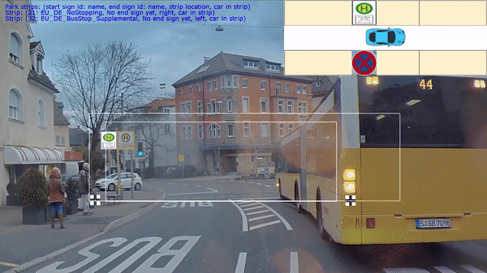
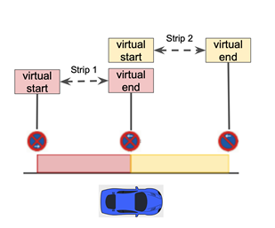
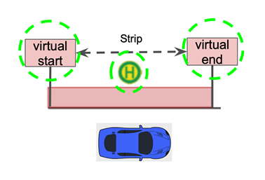
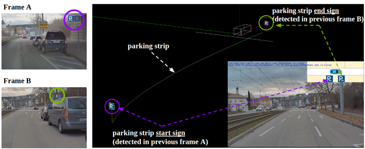

# 通过停车标志辅助推进自动代客泊车功能

这是 NVIDIA DRIVE 实验室系列的最新视频。 这些视频以工程为重点，介绍了各个自动驾驶汽车的挑战以及 NVIDIA DRIVE 团队如何应对这些挑战。 了解更多[ NVIDIA DRIVE](https://blogs.nvidia.com/blog/category/auto/) 。

自动泊车涉及一系列复杂的感知和决策算法，传统上依靠高清 (HD) 地图来检索泊车信息。

然而，地图覆盖范围和较差或过时的定位信息可能会限制此类系统。 更复杂的是，系统必须理解和解释因地区而异的停车规则。

在这篇 DRIVE Labs 帖子中，我们展示了基于 AI 的实时感知如何帮助将自动泊车扩展到全球各地。

## 自动泊车系统概述

理解和解释停车规则可能比看起来更微妙。

有效区域内的不同停车规则可以被覆盖。例如，“No Stopping”可以覆盖“No Parking”。

此外，非停车相关标志可以推断停车规则。例如，在德国，任何公交车站标志的 15 米范围内都不允许停车。在美国，停车标志前 30 英尺内停车是非法的。

最后，除了像物理标志这样的显式线索外，还有一些携带停车信息的隐性标志。例如，在许多区域中，交叉路口表示上一个有效停车规则的结束。

先进的基于算法的停车标志辅助 (PSA) 系统对于自动驾驶汽车了解停车规则的复杂性并做出相应反应至关重要。

传统的 PSA 系统仅依赖来自高清地图的输入。然而，NVIDIA DRIVE AV 软件堆栈利用最先进的深度神经网络 (DNN) 和计算机视觉算法来提高自动泊车在现实世界场景中的覆盖范围和鲁棒性。这些技术可以实时检测、跟踪和分类各种停车交通标志和道路交叉口。

* [WaitNet DNN](https://blogs.nvidia.com/blog/2019/05/10/drive-labs-intersection-detection/) 检测交通标志和十字路口。
* [Wait perception ](https://developer.nvidia.com/drive/drive-perception)跟踪各个标志和交叉点，以通过三角测量提供 3D 位置。
* [SignNet DNN ](https://developer.nvidia.com/blog/drive-labs-signnet-and-lighnet-dnns/?ncid=so-yout-35702#cid=organicSocial_en-us_YouTube_Automotive-DRIVE-Labs-AV07)识别交通标志类型。

然后将模块的结果输入 PSA 系统，该系统使用数据来确定汽车是否在停车带内、有什么限制以及是否允许汽车在该区域内停车或停放。

## 停车标志辅助概述
PSA 系统接收到检测到的停车标志和道路交叉口后，将对象抽象为开始停车标志或结束停车标志。 这种抽象级别允许系统在全球范围内扩展。

开始停车标志标志着新停车带的潜在开始，而结束停车标志可能会关闭一个或多个现有停车带。 下面两张图显示了停车带是如何形成的。

除了形成停车带外，PSA系统还使用标志的语义将停车带分类为no-parking, no-stopping、允许停车和未知状态。 然后可以将此信息提供给驾驶员或任何自动泊车系统。

上图显示了 PSA 系统的主要功能工作流程。在帧 A 中，检测到“停车区开始”标志并创建新的停车带。汽车行驶一段时间后，检测到“停车区结束”标志，该标志与该停车带的起始标志相匹配。

最后，PSA 系统将所有活动的停车带存储在其内存中，并根据有效的停车带所暗示的交通规则向驾驶员发出当前停车状态的信号。

## 总结
PSA 系统以极高的准确性实现复杂的决策，在 NVIDIA DRIVE AGX 上运行仅需几毫秒。它还兼容任何使用实时摄像头传感器输入的仅感知自动车辆堆栈。

我们目前的 SignNet DNN 支持欧洲 20 多个停车标志，包括公交车站标志、禁止停车标志和禁止停车标志，覆盖范围不断扩大。我们还在系统中添加了光学字符识别 (OCR) 和自然语言处理 (NLP) 模块，以处理标志上的书面文本携带的复杂信息。

