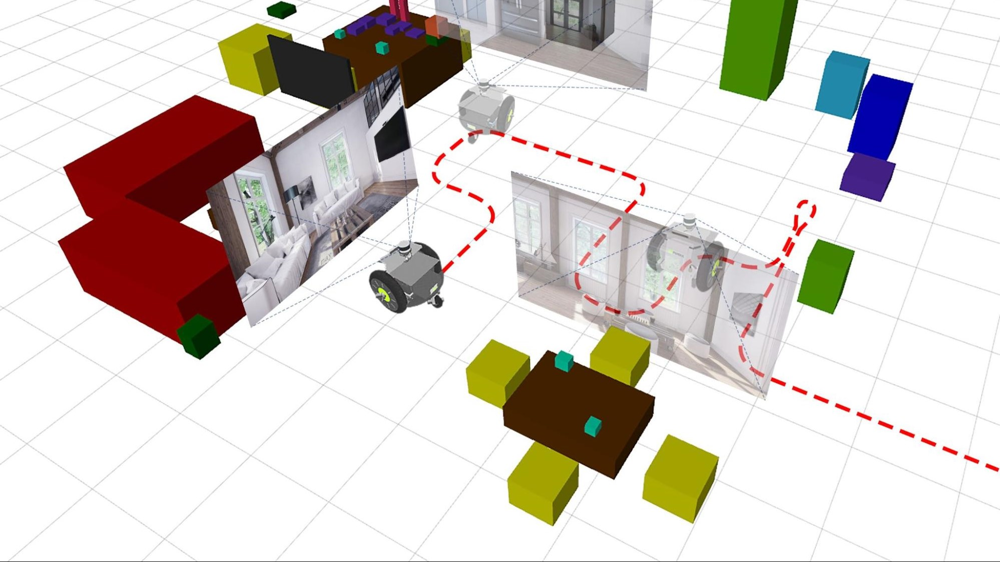
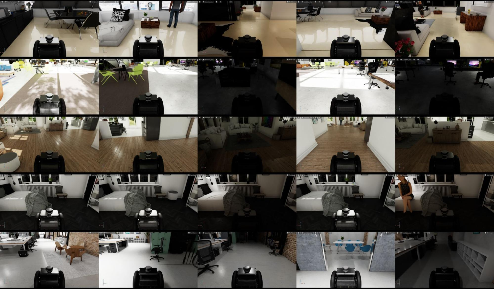
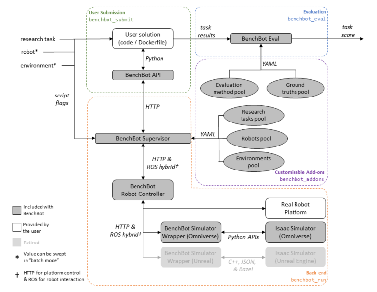
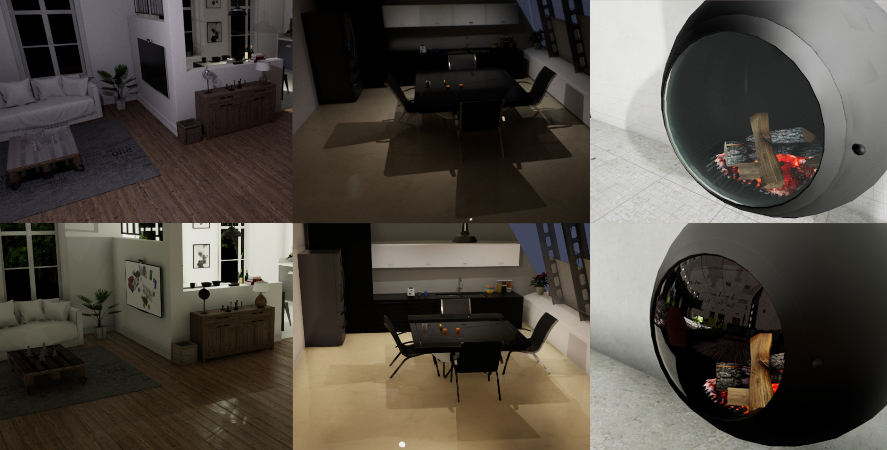
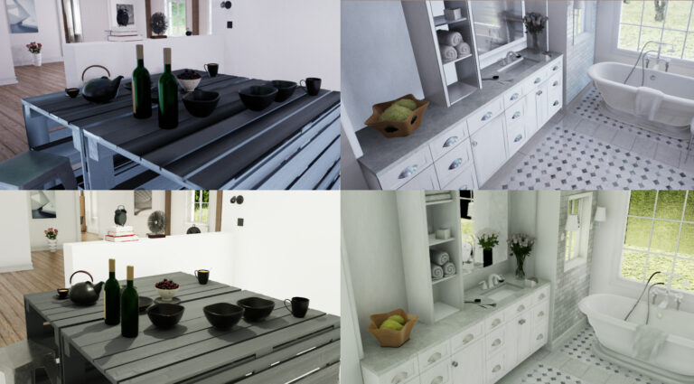
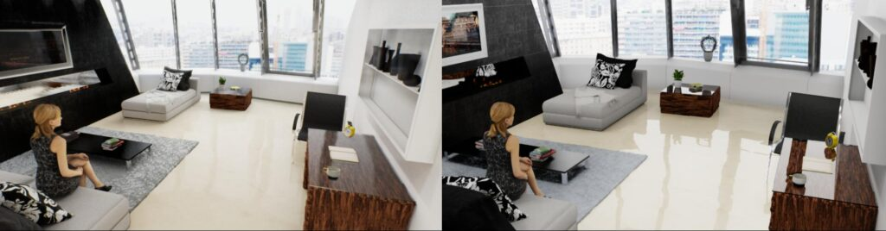
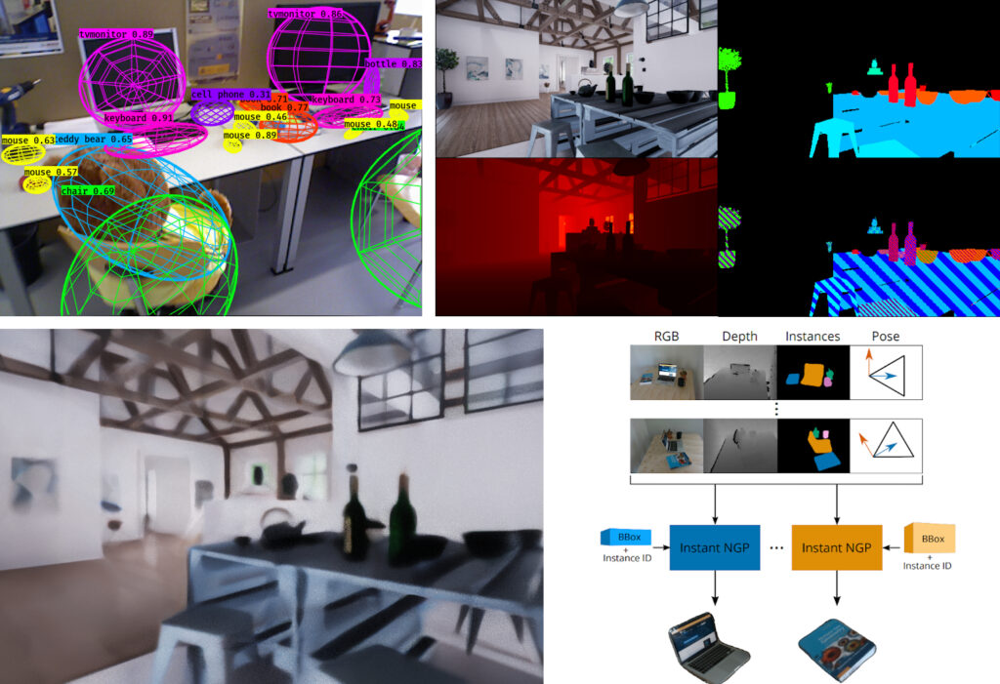

# 使用BenchBot和NVIDIAIsaacSim让机器人更容易



从事机器人技术工作充满了令人兴奋和有趣的问题，但也因传感器校准、构建变换树、管理分布式系统和调试脆弱系统中的奇怪故障等问题而浪费了几天的时间。

我们在 QUT 机器人中心 (QCR) 构建了 BenchBot 平台，使机器人专家能够将时间集中在研究机器人技术中令人兴奋和有趣的问题上。

我们最近还升级到了新的 NVIDIA Omniverse 驱动的 NVIDIA Isaac Sim，它对 BenchBot 平台进行了大量重大改进。无论机器人是您的爱好、学术追求还是工作，BenchBot 以及 NVIDIA Isaac Sim 功能都可以让您只用几行 Python 代码就可以进入机器人的美妙世界。在这篇文章中，我们将分享我们是如何创建 BenchBot、它支持什么、我们计划在未来将它应用到哪里以及您可以在自己的工作中使用它的地方。我们的目标是通过展示您可以使用 BenchBot 做什么的想法，为您提供开始从事您自己的机器人项目和研究的工具。我们还分享了我们在与新的 NVIDIA Isaac Sim 集成时学到的知识。





这篇文章还为我们的机器人视觉场景理解 (RVSU) 挑战提供了背景信息，该挑战目前处于第三次迭代中。 RVSU 挑战赛是一个亲身尝试解决家用机器人基本问题的机会：它们如何了解环境中的内容以及位置。通过竞争，您可以分享包括 NVIDIA A6000 GPU 和 2,500 美元现金在内的奖品。

## BenchBot 背后的故事
BenchBot 解决了我们语义场景理解研究的需求。我们主持了一个对象检测挑战并产生了新的评估指标，但需要将这项工作扩展到机器人领域：

* 什么是理解场景？
* 如何评估理解程度？
* 代理在理解场景中扮演什么角色？
* 模拟中的理解可以转移到现实世界吗？
* 为了理解转移到现实世界，模拟需要什么？
  

我们制作了 BenchBot 平台，让您能够专注于这些大问题，而不会迷失在机器人系统通常引发的挑战的海洋中。 BenchBot 由许多活动部件组成，这些部件将这些操作复杂性抽象出来（下图）。




以下是 BenchBot 架构的一些关键组件和功能：

* 您可以通过编写调用 BenchBot API 的 Python 脚本来创建机器人问题的解决方案。
* 您可以使用可定制的评估工具轻松了解您的解决方案执行给定机器人任务的效果。
* [supervisor](https://github.com/qcr/benchbot_supervisor)代理高级 Python API 和典型机器人系统的低级接口之间的通信。
* supervisor与后端无关。机器人可以是真实的或模拟的，它只需要运行 ROS。
* 所有配置都存在于一个模块化的附加系统中，允许您使用自己的任务、机器人、环境、评估方法、示例等轻松扩展系统。
我们所有的代码都是在 MIT 许可下开源的。有关详细信息，请参阅 [BenchBot：在真实感 3D 仿真和真实机器人上评估机器人研究](https://arxiv.org/pdf/2008.00635.pdf) (PDF)。

大量活动部件如果使用户体验复杂化，不一定是好事，因此设计用户体验也是开发 BenchBot 的核心重点。

用于控制系统的三个基本命令：
```Bash
benchbot_install –help
benchbot_run –help
benchbot_submit –help
```
以下命令有助于在多个环境中构建强大的评估工作流程：

```Bash
benchbot_batch –help
```

这是一个简单的 Python 命令，用于与机器人的感觉运动功能进行交互：

```C++
python
from benchbot_api import Agent, BenchBot

class MyAgent(Agent):
    def is_done(self, action_result):
        …

    def pick_action(self, observations, action_list):
        …

    def save_result(self, filename, empty_results, results_format_fns):
        …

BenchBot(agent=MyAgent()).run()
```

凭借简单的 Python API、世界级的逼真模拟以及管理整个系统所需的少量命令，我们已准备好将 BenchBot 应用于我们的第一个大型输出：RVSU 挑战。

## RVSU 挑战
RVSU 挑战促使研究人员开发能够理解周围环境的语义和几何方面的机器人视觉系统。 该挑战包括六个任务，具有基于对象、语义、实时定位和建图 (SLAM) 以及场景变化检测 (SCD) 的多个难度级别。

挑战还集中在家用机器人的核心要求上：他们需要了解环境中的物体以及它们的位置。 这个问题本身就是我们的语义 SLAM 任务中捕获的第一个挑战，其中机器人必须探索环境，找到所有感兴趣的对象，并将它们添加到 3D 地图中。

SCD 任务更进一步，要求机器人在不同的时间点报告环境中对象的变化。 


## 使用 NVIDIA Isaac Sim 将 RVSU 挑战变为现实
最近，我们将 BenchBot 从使用旧的基于 Unreal Engine 的 NVIDIA Isaac Sim 升级到了新的 Omniverse 驱动的 NVIDIA Isaac Sim。这为 BenchBot 带来了许多关键优势，让我们对未来可以使用 Omniverse 驱动的模拟去哪里感到兴奋。我们看到显着收益的领域包括：

* 质量：NVIDIA RTX 渲染产生了美丽的照片级模拟，所有这些都使用我们之前使用的相同资产。
* 性能：我们访问了强大的动态照明效果，具有复杂的映射反射，所有这些都是实时生成的，用于具有真实物理的实时模拟。
* 可定制性：用于 Omniverse 和 NVIDIA Isaac Sim 的 Python API 可以完全控制模拟器，使我们能够重新启动模拟、更换环境以及以编程方式移动机器人。
* 简单性：我们用一个 Python 文件替换了整个 C++ 接口库。


[qcr/benchbot_sim_omni](https://github.com/qcr/benchbot_sim_omni) 存储库记录了我们在过渡到新的 NVIDIA Isaac Sim 过程中的经验，并且还可以作为 BenchBot 生态系统之外的独立软件包运行。该包是一个可定制的 HTTP API，用于加载环境、放置机器人和控制模拟。它是使用 NVIDIA Isaac Sim 以编程方式运行模拟的绝佳起点。

我们欢迎关于如何扩展这个包的功能的请求和建议。我们也希望它可以提供一些有用的示例来帮助您使用 NVIDIA Isaac Sim 开始您自己的项目，例如以下示例。

## 在 NVIDIA Isaac Sim 中打开环境
打开环境首先需要一个正在运行的模拟器实例。通过实例化 SimulationApp 类创建一个新实例，使用 open_usd 选项让您选择最初打开的环境：
```Python
from omni.isaac.kit import SimulationApp

inst = SimulationApp({
            "renderer": "RayTracedLighting",
            "headless": False,
	“open_usd”: MAP_USD_PATH,
        })
```

值得注意的是，每个 Python 脚本只能运行一个模拟实例，并且必须在初始化实例后导入 NVIDIA Isaac Sim 组件。

使用 NVIDIA Isaac Sim API 中的帮助程序在运行时选择不同的阶段：

```Python
from omni.isaac.core.utils.stage import open_stage, update_stage

open_stage(usd_path=MAP_USD_PATH)
update_stage()
```

### 将机器人置于环境中
在开始模拟之前，将机器人加载并放置在环境中。 使用 Robot 类和以下代码行执行此操作：
```Python
from omni.isaac.core.robots import Robot
from omni.isaac.core.utils.stage import add_reference_to_stage, update_stage

add_reference_to_stage(usd_path=ROBOT_USD_PATH, prim_path=ROBOT_PRIM_PATH)
robot = Robot(prim_path=ROBOT_PRIM_PATH, name=ROBOT_NAME)
robot.set_world_pose(position=NP_XYZ * 100, orientation=NP_QUATERNION)
update_stage()
```
## 控制模拟
NVIDIA Isaac Sim 中的模拟由 SimulationContext 类控制：
```python
from omni.isaac.core import SimulationContext
sim = SimulationContext()
sim.play()
```
然后，step 方法对仿真进行细粒度控制，仿真以 60Hz 运行。 我们使用这个控件来管理我们的传感器发布、转换树和状态检测逻辑。

我们偶然发现的另一个有用的代码示例是使用 dynamic_control 模块在模拟过程中获取机器人的真实姿态：

```python
from omni.isaac.dynamic_control import _dynamic_control
dc = _dynamic_control.acquire_dynamic_control_interface()
robot_dc = dc.get_articulation_root_body(dc.get_object(ROBOT_PRIM_PATH))
gt_pose = dc.get_rigid_body_pose(robot_dc)
```

## 结果
希望这些代码示例对您开始使用 NVIDIA Isaac Sim 有所帮助。 仅此而已，我们已经取得了一些令人印象深刻的结果：

* 我们的逼真模拟的显着改进
* 强大的实时灯光效果
* 通过基本 Python 代码进行完全定制








## 更进一步：其他领域的 BenchBot
尽管语义场景理解是我们研究的重点以及它在研究中的使用起源，但 BenchBot 的应用并不仅限于该领域。 BenchBot 使用丰富的附加架构构建，允许对系统进行模块化添加和调整以适应不同的问题域。

QCR 的视觉学习和理解研究计划已开始利用这种灵活性将 BenchBot 及其 Omniverse 驱动的模拟应用于一系列有趣的问题。 下图 显示了我们正在考虑使用 BenchBot 的几个领域：

* 努力将最先进的语义 SLAM 与 QuadricSLAM 以及我们的开源 GTSAM quadrics 扩展一起使用。
* 使用自定义 BenchBot 插件在 Omniverse 的逼真模拟中收集合成数据集。
* 探索神经辐射场 (NeRF) 如何帮助增强场景理解并使用噪声数据构建更好的对象图。



我们在制作 BenchBot 时非常注重能够使其适应您的研究问题。尽管我们很享受将其应用于我们的研究问题，但我们很高兴看到其他人将其应用于何处。创建您自己的附加组件记录在附加组件存储库中，我们很乐意将一些第三方附加组件添加到官方附加组件组织。

## 总结
我们希望这篇深入的评论很有见地，并能帮助您进入机器人领域，解决让我们机器人专家兴奋的问题。

我们欢迎 RVSU 挑战的参赛作品，无论您对语义场景理解的兴趣是随意的还是正式的、学术的还是工业的、竞争的还是迭代的。我们认为您会发现与 BenchBot 系统竞争是一种丰富的体验。您可以注册挑战，并通过 EvalAI 挑战页面提交参赛作品。

如果您正在寻找 BenchBot 和 Omniverse 的下一步发展方向，这里有一些建议：

* 按照我们的教程开始使用 BenchBot。
* 创建一些自定义插件并与官方 BenchBot 频道分享。
* 使用包装库开始以编程方式运行 Omniverse 和 NVIDIA Isaac Sim。
* 如果您有研究合作的想法或想要应用它的问题，请联系 BenchBot 的作者。


在 QCR，我们很高兴看到机器人技术的发展方向。借助 BenchBot 和新的 Omniverse 驱动的 NVIDIA Isaac Sim 等工具，现在正是加入并开始使用机器人技术的最佳时机。


