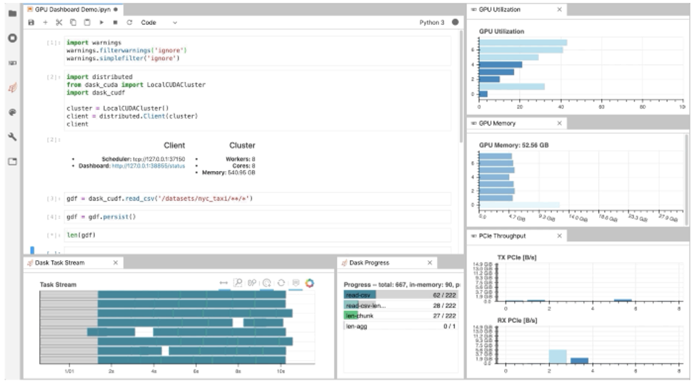
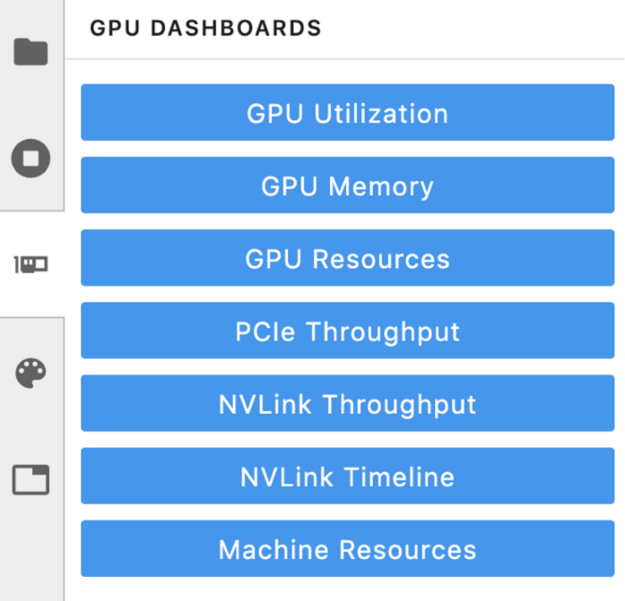
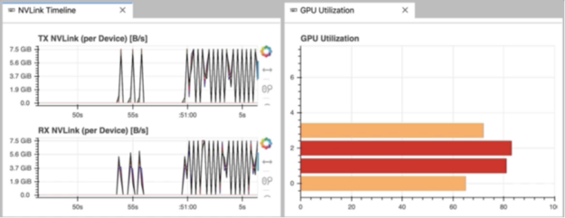
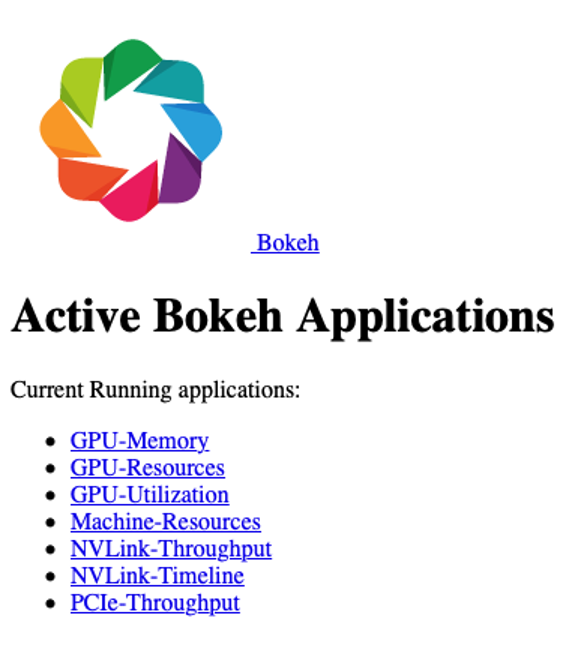
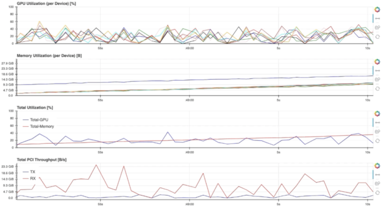

# GPU运行状态监测




## 介绍

**[NVDashboard](https://github.com/rapidsai/jupyterlab-nvdashboard)** 是一个开源包，用于在交互式 Jupyter Lab 环境中实时可视化 NVIDIA GPU 指标。 NVDashboard 是所有 GPU 用户监控系统资源的好方法。然而，它对于 NVIDIA 的 GPU 加速数据科学软件库开源套件 RAPIDS 的用户来说尤其有价值。

鉴于现代数据科学算法的计算强度，在许多情况下 GPU 可以提供改变游戏规则的工作流加速。为了达到最佳性能，底层软件有效利用系统资源是绝对关键的。尽管加速库（如 cuDNN 和 RAPIDS）专门设计用于在性能优化方面进行繁重的工作，但对于开发人员和最终用户来说，验证他们的软件是否确实按预期利用了 GPU 资源可能非常有用。虽然这可以通过 nvidia-smi 等命令行工具来完成，但许多专业数据科学家更喜欢使用交互式 Jupyter 笔记本进行日常模型和工作流开发。


如上图 所示，NVDashboard 使 Jupyter notebook用户能够在他们用于开发的同一交互式环境中可视化系统硬件指标。支持的指标包括：

* GPU 计算利用率
* GPU 内存消耗
* PCIe 吞吐量
* NVLink 吞吐量


该软件包基于基于 Python 的仪表板服务器构建，支持 Bokeh 可视化库实时显示和更新图形。一个额外的 Jupyter-Lab 扩展将这些仪表板作为可移动窗口嵌入到交互式环境中。大多数 GPU 指标都是通过 PyNVML 收集的，PyNVML 是一个开源 Python 包，由 NVIDIA 管理库 (NVML) 的包装器组成。出于这个原因，可以修改/扩展可用的仪表板以显示可通过 NVML 访问的任何可查询的 GPU 指标。

## 使用 NVDashboard
nvdashboard 包在 PyPI 上可用，它由两个基本组件组成：

* Bokeh Server：服务器组件利用出色的 Bokeh 可视化库来实时显示和更新 GPU 诊断仪表板。使用 PyNVML 访问所需的硬件指标，PyNVML 是一个开源 python 包，由 NVIDIA 管理库 (NVML) 的包装器组成。出于这个原因，可以修改/扩展 NVDashboard 以显示任何可通过 NVML 访问的可查询 GPU 指标，并且可以从 Python 轻松访问。
* Jupyter-Lab 扩展：Jupyter-Lab 扩展将 GPU 诊断仪表板作为可移动窗口嵌入到交互式 Jupyter-Lab 环境中。

```Bash
$ pip install jupyterlab-nvdashboard

# If you are using Jupyter Lab 2 you will also need to run
$ jupyter labextension install jupyterlab-nvdashboard
```


需要澄清的是，NVDashboard 会自动监控整个机器的 GPU 资源，而不仅仅是本地 Jupyter 环境使用的那些。 Jupyter-Lab eExtension 当然可以用于非 iPython/notebook 开发。 例如，在下图中，“NVLink Timeline”和“GPU Utilization”仪表板正在 Jupyter-Lab 环境中用于监控从命令行执行的多 GPU 深度学习工作流。




## Boker server
虽然 Jupyter-Lab 扩展对于 iPython/基于笔记本的开发爱好者来说无疑是理想的，但其他 GPU 用户也可以使用独立的 Bokeh 服务器访问仪表板。 这是通过运行来完成的。
```Bash
$ python -m jupyterlab_nvdashboard.server <端口号>
```

启动 Bokeh 服务器后，通过在标准 Web 浏览器中打开适当的 url（例如，`http://<ip-address>:<port-number>`）来访问 GPU 仪表板。 如下图 所示，主菜单列出了 NVDashboard 中可用的所有仪表板。




例如，选择“GPU-Resources”链接会打开如下图 所示的仪表板，该仪表板使用对齐的时间线图总结了各种 GPU 资源的利用率。





要以这种方式使用 NVDashboard，只需要 pip-installation 步骤（可以跳过实验室扩展安装步骤）：
```
$ pip install jupyterlab-nvdashboard
```
或者，也可以克隆 [jupyterlab-nvdashboard ](https://github.com/rapidsai/jupyterlab-nvdashboard)，并简单地执行 server.py 脚本（例如，`python jupyterlab_nvdashboard/server.py <port-number>`）。


## 实施细节
现有的 nvdashboard 包提供了许多有用的 GPU 资源仪表板。但是，修改现有仪表板和/或创建全新的仪表板相当简单。为此，您只需要利用 PyNVML 和 Bokeh。

## PyNVML 基础
PyNVML 是 NVIDIA 管理库 ([NVML](https://github.com/gpuopenanalytics/pynvml)) 的 Python 包装器，它是一个基于 C 的 API，用于监控和管理 NVIDIA GPU 设备的各种状态。 NVML 直接由更知名的 NVIDIA 系统管理接口 (nvidia-smi) 使用。根据 NVIDIA 开发者网站，NVML 提供对以下可查询状态的访问（除了此处未讨论的可修改状态之外）：

* ECC 错误计数：报告可纠正的单位错误和可检测的双位错误。为当前引导周期和 GPU 的生命周期提供错误计数。
* GPU 利用率：报告 GPU 的计算资源和内存接口的当前利用率。
* 活动计算进程：报告 GPU 上运行的活动进程列表，以及相应的进程名称/ID 和分配的 GPU 内存。
* 时钟和 PState：报告几个重要时钟域的最大和当前时钟速率，以及当前 GPU 性能状态。
* 温度和风扇速度：报告当前核心 GPU 温度，以及非被动产品的风扇速度。
* 电源管理：对于支持的产品，会报告当前的电路板功耗和功率限制。
* 识别：上报各种动态和静态信息，包括板卡序列号、PCI设备ID、VBIOS/Inform版本号和产品名称。

尽管目前存在几种不同的 NVML python 包装器，但我们使用 GoAi 在 GitHub 上托管的 [PyNVML](https://github.com/gpuopenanalytics/pynvml) 包。这个版本的 PyNVML 使用 ctypes 来包装大部分 NVML C API。 NVDashboard 仅使用查询实时 GPU 资源利用率所需的 API 的一小部分，包括：

* nvmlInit()：初始化 NVML。成功初始化后，GPU 句柄将被缓存，以降低仪表板中主动监控期间数据查询的延迟。
* nvmlShutdown()：完成 NVML
* nvmlDeviceGetCount()：获取可用GPU设备的数量
* nvmlDeviceGetHandleByIndex()：获取设备的句柄（给定一个整数索引）
* nvmlDeviceGetMemoryInfo()：获取内存信息对象（给定设备句柄）
* nvmlDeviceGetUtilizationRates()：获取利用率对象（给定设备句柄）
* nvmlDeviceGetPcieThroughput()：获取 PCIe 吞吐量对象（给定设备句柄）
* nvmlDeviceGetNvLinkUtilizationCounter()：获取 NVLink 利用率计数器（给定设备句柄和链接索引）


在当前版本的 PyNVML 中，python 函数名称通常被选择为与 C API 完全匹配。例如，要查询每个可用设备上的当前 GPU 利用率，代码如下所示：

```Python
In [1]: from pynvml import *
In [2]: nvmlInit()
In [3]: ngpus = nvmlDeviceGetCount()
In [4]: for i in range(ngpus):
…: handle = nvmlDeviceGetHandleByIndex(i)
…: gpu_util = nvmlDeviceGetUtilizationRates(handle).gpu
…: print(‘GPU %d Utilization = %d%%’ % (i, gpu_util))
…:
GPU 0 Utilization = 43%
GPU 1 Utilization = 0%
GPU 2 Utilization = 15%
GPU 3 Utilization = 0%
GPU 4 Utilization = 36%
GPU 5 Utilization = 0%
GPU 6 Utilization = 0%
GPU 7 Utilization = 11%
```

## 仪表板代码
为了修改/添加 GPU 仪表板，只需要使用两个文件（jupyterlab_bokeh_server/server.py 和 jupyterlab_nvdashboard/apps/gpu.py）。 添加/修改仪表板所需的大部分 PyNVML 和散景代码都在 gpu.py 中。 只有在添加或更改菜单/显示名称时才需要修改 server.py。 在这种情况下，必须在路由字典中指定新的/修改的名称（键是所需的名称，值是相应的仪表板定义）：

```C++
routes = {
   "/GPU-Utilization": apps.gpu.gpu,
   "/GPU-Memory": apps.gpu.gpu_mem,
   "/GPU-Resources": apps.gpu.gpu_resource_timeline,
   "/PCIe-Throughput": apps.gpu.pci,
   "/NVLink-Throughput": apps.gpu.nvlink,
   "/NVLink-Timeline": apps.gpu.nvlink_timeline,
   "/Machine-Resources": apps.cpu.resource_timeline,
}
```

为了让服务器不断刷新散景应用程序使用的 PyNVML 数据，我们使用散景的 ColumnDataSource 类来定义每个绘图中的数据源。 ColumnDataSource 类允许为每种类型的数据传递一个更新函数，可以在每个应用程序的专用回调函数 (cb) 中调用该函数。 例如，现有的 gpu 应用程序是这样定义的：

```Python
ef gpu(doc):
    fig = figure(title="GPU Utilization", sizing_mode="stretch_both", x_range=[0, 100])

    def get_utilization():
        return [
            pynvml.nvmlDeviceGetUtilizationRates(gpu_handles[i]).gpu
            for i in range(ngpus)
        ]

    gpu = get_utilization()
    y = list(range(len(gpu)))
    source = ColumnDataSource({"right": y, "gpu": gpu})
    mapper = LinearColorMapper(palette=all_palettes["RdYlBu"][4], low=0, high=100)
    fig.hbar(
        source=source,
        y="right",
        right="gpu",
        height=0.8,
        color={"field": "gpu", "transform": mapper},
    )
    fig.toolbar_location = None
    doc.title = "GPU Utilization [%]"
    doc.add_root(fig)

    def cb():
        source.data.update({"gpu": get_utilization()})

    doc.add_periodic_callback(cb, 200)
```

请注意，PyNVML GPU 利用率数据的实时更新是在 `source.data.update()` 调用中执行的。 有了必要的 ColumnDataSource 逻辑，可以通过多种方式修改标准 GPU 定义（上图）。 例如，交换 x 和 y 轴，指定不同的调色板，甚至将图形从 hbar 完全更改为其他东西。


