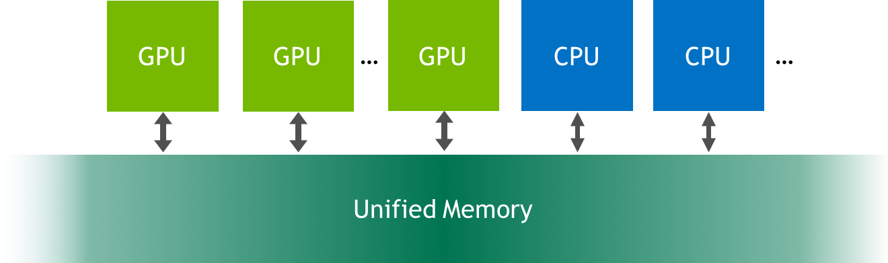

#! https://zhuanlan.zhihu.com/p/551695117
# 初步介绍CUDA中的统一内存.md


## 为此，我向您介绍了统一内存，它可以非常轻松地分配和访问可由系统中任何处理器、CPU 或 GPU 上运行的代码使用的数据。



 首先，因为 NVIDIA Titan X 和 NVIDIA Tesla P100 等 Pascal GPU 是第一批包含页面迁移引擎的 GPU，该引擎是统一内存页面错误和页面迁移的硬件支持。 第二个原因是它提供了一个很好的机会来了解更多关于统一内存的信息。

## Fast GPU, Fast Memory… Right?
对！ 但是让我们看看。 首先，我将重新打印在两个 NVIDIA Kepler GPU 上运行的结果（一个在我的笔记本电脑上，一个在服务器上）。


||Laptop (GeForce GT 750M)|Laptop (GeForce GT 750M)|	Server (Tesla K80)|Server (Tesla K80)|
|----|----|----|----|----|
|Version|	Time|	Bandwidth	|Time	|Bandwidth|
|1 CUDA Thread|	411ms	|30.6 MB/s|	463ms|	27.2 MB/s|
|1 CUDA Block|	3.2ms	|3.9 GB/s|	2.7ms|	4.7 GB/s|
|Many CUDA Blocks|	0.68ms|	18.5 GB/s|	0.094ms	|134 GB/s|

现在让我们尝试在基于 Pascal GP100 GPU 的非常快的 Tesla P100 加速器上运行。

```
> nvprof ./add_grid
...
Time(%)      Time     Calls       Avg       Min       Max  Name
100.00%  2.1192ms         1  2.1192ms  2.1192ms  2.1192ms  add(int, float*, float*)
```

嗯，低于 6 GB/s：比在我的笔记本电脑的基于 Kepler 的 GeForce GPU 上运行要慢。 不过，不要气馁； 我们可以解决这个问题。 为了理解如何，我将不得不告诉你更多关于统一内存的信息。

下面是参考，这是上次 add_grid.cu 的完整代码。

```C++
#include <iostream>
#include <math.h>
 
// CUDA kernel to add elements of two arrays
__global__
void add(int n, float *x, float *y)
{
  int index = blockIdx.x * blockDim.x + threadIdx.x;
  int stride = blockDim.x * gridDim.x;
  for (int i = index; i < n; i += stride)
    y[i] = x[i] + y[i];
}
 
int main(void)
{
  int N = 1<<20;
  float *x, *y;
 
  // Allocate Unified Memory -- accessible from CPU or GPU
  cudaMallocManaged(&x, N*sizeof(float));
  cudaMallocManaged(&y, N*sizeof(float));
 
  // initialize x and y arrays on the host
  for (int i = 0; i < N; i++) {
    x[i] = 1.0f;
    y[i] = 2.0f;
  }
 
  // Launch kernel on 1M elements on the GPU
  int blockSize = 256;
  int numBlocks = (N + blockSize - 1) / blockSize;
  add<<<numBlocks, blockSize>>>(N, x, y);
 
  // Wait for GPU to finish before accessing on host
  cudaDeviceSynchronize();
 
  // Check for errors (all values should be 3.0f)
  float maxError = 0.0f;
  for (int i = 0; i < N; i++)
    maxError = fmax(maxError, fabs(y[i]-3.0f));
  std::cout << "Max error: " << maxError << std::endl;
 
  // Free memory
  cudaFree(x);
  cudaFree(y);
 
  return 0;
}
```
分配和初始化内存的代码在第 19-27 行。

## 什么是统一内存?
统一内存是可从系统中的任何处理器访问的单个内存地址空间（参见上图）。 这种硬件/软件技术允许应用程序分配可以从 CPU 或 GPU 上运行的代码读取或写入的数据。 分配统一内存就像用调用 `cudaMallocManaged()` 替换对 `malloc()` 或 `new` 的调用一样简单，这是一个分配函数，它返回一个可从任何处理器访问的指针（下文中的 ptr）。

```C++
cudaError_t cudaMallocManaged(void** ptr, size_t size);
```
当在 CPU 或 GPU 上运行的代码访问以这种方式分配的数据（通常称为 CUDA 托管数据）时，CUDA 系统软件和/或硬件负责将内存页面迁移到访问处理器的内存。 这里重要的一点是，Pascal GPU 架构是第一个通过其页面迁移引擎为虚拟内存页面错误和页面迁移提供硬件支持的架构。 基于 Kepler 和 Maxwell 架构的旧 GPU 也支持更有限的统一内存形式。

## 当我在Kepler平台上调用cudaMallocManaged()时会发生什么?

在具有 pre-Pascal GPU （如 `Tesla K80`）的系统上，调用 `cudaMallocManaged()` 会在调用时处于活动状态的 GPU 设备上分配 `size` 字节的托管内存。 在内部，驱动程序还为分配覆盖的所有页面设置页表条目，以便系统知道这些页面驻留在该 GPU 上。

因此，在我们的示例中，在 `Tesla K80 GPU`（`Kepler` 架构）上运行时，x 和 y 最初都完全驻留在 GPU 内存中。 然后在从第 6 行开始的循环中，CPU 遍历两个数组，将它们的元素分别初始化为 `1.0f` 和 `2.0f`。 由于页面最初驻留在设备内存中，因此对于它写入的每个数组页面，CPU 都会发生页面错误，并且 GPU 驱动程序会将页面从设备内存迁移到 CPU 内存。 循环之后，两个数组的所有页面都驻留在 CPU 内存中。

在 CPU 上初始化数据后，程序启动 `add()` 内核将 x 的元素添加到 y 的元素中。

```C++
add<<<1, 256>>>(N, x, y);
```
在 pre-Pascal GPU 上，在启动内核时，CUDA 运行时必须将之前迁移到主机内存或另一个 GPU 的所有页面迁移回运行内核的设备的设备内存。 由于这些较旧的 GPU 不能出现页面错误，因此所有数据都必须驻留在 GPU 上，以防内核访问它（即使它不会访问）。 这意味着每次内核启动都有潜在的迁移开销。

这就是我在 K80 或我的 Macbook Pro 上运行程序时发生的情况。 但是请注意，分析器将内核运行时间与迁移时间分开显示，因为迁移发生在内核运行之前。

```
==15638== Profiling application: ./add_grid
==15638== Profiling result:
Time(%)      Time     Calls       Avg       Min       Max  Name
100.00%  93.471us         1  93.471us  93.471us  93.471us  add(int, float*, float*)

==15638== Unified Memory profiling result:
Device "Tesla K80 (0)"
   Count  Avg Size  Min Size  Max Size  Total Size  Total Time  Name
       6  1.3333MB  896.00KB  2.0000MB  8.000000MB  1.154720ms  Host To Device
     102  120.47KB  4.0000KB  0.9961MB  12.00000MB  1.895040ms  Device To Host
Total CPU Page faults: 51
```
## 当我在Pascal平台上调用cudaMallocManaged()时会发生什么?

在 Pascal 和更高版本的 GPU 上，当 `cudaMallocManaged()` 返回时，托管内存可能不会被物理分配；它只能在访问（或预取）时填充。换句话说，页面和页表条目可能不会被创建，直到它们被 GPU 或 CPU 访问。页面可以随时迁移到任何处理器的内存，驱动程序采用启发式方法来维护数据局部性并防止过多的页面错误。 （注意：应用程序可以使用 `cudaMemAdvise()` 引导驱动程序，并使用 `cudaMemPrefetchAsync()` 显式迁移内存，如[这篇博文所述](https://developer.nvidia.com/blog/parallelforall/beyond-gpu-memory-limits-unified-memory-pascal/)）。

与pre-Pascal GPU 不同，Tesla P100 支持硬件页面错误和页面迁移。因此在这种情况下，运行时不会在运行内核之前自动将所有页面复制回 GPU。内核在没有任何迁移开销的情况下启动，当它访问任何缺少的页面时，GPU 会停止访问线程的执行，并且页面迁移引擎会在恢复线程之前将页面迁移到设备。

这意味着当我在 Tesla P100 (2.1192 ms) 上运行我的程序时，迁移的成本包含在内核运行时间中。在这个内核中，数组中的每一页都是由 CPU 写入，然后由 GPU 上的 CUDA 内核访问，导致内核等待大量的页面迁移。这就是为什么分析器测量的内核时间在像 Tesla P100 这样的 Pascal GPU 上更长的原因。让我们看看 P100 上程序的完整 nvprof 输出。

```
==19278== Profiling application: ./add_grid
==19278== Profiling result:
Time(%)      Time     Calls       Avg       Min       Max  Name
100.00%  2.1192ms         1  2.1192ms  2.1192ms  2.1192ms  add(int, float*, float*)

==19278== Unified Memory profiling result:
Device "Tesla P100-PCIE-16GB (0)"
   Count  Avg Size  Min Size  Max Size  Total Size  Total Time  Name
     146  56.109KB  4.0000KB  988.00KB  8.000000MB  860.5760us  Host To Device
      24  170.67KB  4.0000KB  0.9961MB  4.000000MB  339.5520us  Device To Host
      12         -         -         -           -  1.067526ms  GPU Page fault groups
Total CPU Page faults: 36
```
如您所见，有许多主机到设备的页面错误，降低了 CUDA 内核实现的吞吐量。

## 我该怎么办？
在实际应用程序中，GPU 可能会在 CPU 不接触数据的情况下对数据执行更多计算（可能很多次）。 这段简单代码中的迁移开销是由 CPU 初始化数据而 GPU 只使用一次数据造成的。 有几种不同的方法可以消除或更改迁移开销，以更准确地测量`vector add`内核性能。

* 将数据初始化移动到另一个 CUDA 内核中的 GPU。
* 多次运行内核并查看平均和最小运行时间。
* 在运行内核之前将数据预取到 GPU 内存。


让我们来看看这三种方法中的每一种。

## 初始化内核中的数据
如果我们将初始化从 CPU 转移到 GPU，则添加内核不会出现页面错误。 这是一个用于初始化数据的简单 CUDA C++ 内核。 我们可以通过启动这个内核来替换初始化 x 和 y 的主机代码。

```C++
__global__ void init(int n, float *x, float *y) {
  int index = threadIdx.x + blockIdx.x * blockDim.x;
  int stride = blockDim.x * gridDim.x;
  for (int i = index; i < n; i += stride) {
    x[i] = 1.0f;
    y[i] = 2.0f;
  }
}

```

当我这样做时，我在 Tesla P100 GPU 的配置文件中看到了两个内核：

```
==44292== Profiling application: ./add_grid_init
==44292== Profiling result:
Time(%)      Time     Calls       Avg       Min       Max  Name
 98.06%  1.3018ms         1  1.3018ms  1.3018ms  1.3018ms  init(int, float*, float*)
  1.94%  25.792us         1  25.792us  25.792us  25.792us  add(int, float*, float*)

==44292== Unified Memory profiling result:
Device "Tesla P100-PCIE-16GB (0)"
   Count  Avg Size  Min Size  Max Size  Total Size  Total Time  Name
      24  170.67KB  4.0000KB  0.9961MB  4.000000MB  344.2880us  Device To Host
      16         -         -         -           -  551.9940us  GPU Page fault groups
Total CPU Page faults: 12
```
add 内核现在运行得更快：25.8us，相当于近 500 GB/s。 这是计算带宽的方法。

带宽 = 字节/秒 = 3 * 4,194,304 bytes * 1e-9 bytes/GB) / 25.8e-6s = 488 GB/s

（要了解如何计算理论和实现的带宽，请参阅[这篇文章](https://developer.nvidia.com/blog/parallelforall/how-implement-performance-metrics-cuda-cc/)。）仍然存在设备到主机页面错误，但这是由于程序末尾的循环检查 CPU 上的结果。

## 多次运行

另一种方法是多次运行内核并查看分析器中的平均时间。 为此，我需要修改我的错误检查代码，以便正确报告结果。 以下是在 Tesla P100 上运行内核 100 次的结果：

```
==48760== Profiling application: ./add_grid_many
==48760== Profiling result:
Time(%)      Time     Calls       Avg       Min       Max  Name
100.00%  4.5526ms       100  45.526us  24.479us  2.0616ms  add(int, float*, float*)

==48760== Unified Memory profiling result:
Device "Tesla P100-PCIE-16GB (0)"
   Count  Avg Size  Min Size  Max Size  Total Size  Total Time  Name
     174  47.080KB  4.0000KB  0.9844MB  8.000000MB  829.2480us  Host To Device
      24  170.67KB  4.0000KB  0.9961MB  4.000000MB  339.7760us  Device To Host
      14         -         -         -           -  1.008684ms  GPU Page fault groups
Total CPU Page faults: 36
```

最小内核运行时间仅为 24.5 微秒，这意味着它实现了超过 500GB/s 的内存带宽。 我还包括了来自 `nvprof` 的统一内存分析输出，它显示了从主机到设备总共 8MB 的页面错误，对应于第一次添加运行时通过页面错误复制到设备的两个 4MB 数组（x 和 y）。

## 预获取
第三种方法是使用统一内存预取在初始化数据后将数据移动到 GPU。 CUDA 为此提供了 `cudaMemPrefetchAsync()`。 我可以在内核启动之前添加以下代码。
```C++
  // Prefetch the data to the GPU
  int device = -1;
  cudaGetDevice(&device);
  cudaMemPrefetchAsync(x, N*sizeof(float), device, NULL);
  cudaMemPrefetchAsync(y, N*sizeof(float), device, NULL);

  // Run kernel on 1M elements on the GPU
  int blockSize = 256;
  int numBlocks = (N + blockSize - 1) / blockSize;
  saxpy<<<numBlocks, blockSize>>>(N, 1.0f, x, y);
```

现在，当我在 Tesla P100 上进行分析时，我得到以下输出。
```
==50360== Profiling application: ./add_grid_prefetch
==50360== Profiling result:
Time(%)      Time     Calls       Avg       Min       Max  Name
100.00%  26.112us         1  26.112us  26.112us  26.112us  add(int, float*, float*)

==50360== Unified Memory profiling result:
Device "Tesla P100-PCIE-16GB (0)"
   Count  Avg Size  Min Size  Max Size  Total Size  Total Time  Name
       4  2.0000MB  2.0000MB  2.0000MB  8.000000MB  689.0560us  Host To Device
      24  170.67KB  4.0000KB  0.9961MB  4.000000MB  346.5600us  Device To Host
Total CPU Page faults: 36
```
在这里，您可以看到内核只运行了一次，耗时 26.1us — 与之前显示的 100 次运行中的最快速度相似。 您还可以看到不再报告任何 GPU 页面错误，并且由于预取，主机到设备的传输仅显示为四个 2MB 传输。

现在我们让它在 P100 上快速运行，让我们将它添加到上次的结果表中。

|	|Laptop (GeForce GT 750M)|Laptop (GeForce GT 750M)|	Server (Tesla K80)|Server (Tesla K80)|	Server (Tesla P100)|Server (Tesla P100)|
|----|----|----|----|----|----|----|
|Version	|Time|	Bandwidth|	Time|	Bandwidth|	Time|	Bandwidth|
|1 CUDA Thread|	411ms|	30.6 MB/s	|463ms|	27.2 MB/s|	NA|	NA|
|1 CUDA Block|	3.2ms|	3.9 GB/s|	2.7ms|	4.7 GB/s|	NA|	NA|
|Many CUDA Blocks|	0.68ms|	18.5 GB/s|	0.094ms|	134 GB/s|	0.025ms|	503 GB/s|

## 关于并发的说明
请记住，您的系统有多个处理器同时运行您的 CUDA 应用程序的一部分：一个或多个 CPU 和一个或多个 GPU。即使在我们的简单示例中，也有一个 CPU 线程和一个 GPU 执行上下文。因此，在访问任一处理器上的托管分配时，我们必须小心，以确保没有竞争条件。

无法从计算能力低于 6.0 的 CPU 和 GPU 同时访问托管内存。这是因为 pre-Pascal GPU 缺乏硬件页面错误，因此无法保证一致性。在这些 GPU 上，当内核运行时从 CPU 进行访问将导致segmentation fault。

在 Pascal 和更高版本的 GPU 上，CPU 和 GPU 可以同时访问托管内存，因为它们都可以处理页面错误；但是，由应用程序开发人员来确保不存在由同时访问引起的竞争条件。

在我们的简单示例中，我们在内核启动后调用了 `cudaDeviceSynchronize()`。这可确保内核在 CPU 尝试从托管内存指针读取结果之前运行完成。否则，CPU 可能会读取无效数据（在 Pascal 和更高版本上），或出现segmentation fault（在pre-Pascal GPU 上）。


## 统一内存在 Pascal 和更高版本 GPU 上的优势

从 Pascal GPU 架构开始，统一内存功能通过 49 位虚拟寻址和按需页面迁移得到显着改进。 49 位虚拟地址足以让 GPU 访问整个系统内存以及系统中所有 GPU 的内存。页面迁移引擎允许 GPU 线程在非驻留内存访问时出错，因此系统可以根据需要将页面从系统中的任何位置迁移到 GPU 的内存，以进行高效处理。

换句话说，统一内存透明地启用了超额订阅 GPU 内存，为任何使用统一内存进行分配的代码启用了核外计算（例如 `cudaMallocManaged()`）。无论是在一个 GPU 上还是在多个 GPU 上运行，它都可以“正常工作”而无需对应用程序进行任何修改。

此外，Pascal 和 Volta GPU 支持系统范围的原子内存操作。这意味着您可以从多个 GPU 对系统中任何位置的值进行原子操作。这对于编写高效的多 GPU 协作算法很有用。

请求分页对于以 ***稀疏*** 模式访问数据的应用程序特别有益。在某些应用程序中，事先不知道特定处理器将访问哪些特定内存地址。如果没有硬件页面错误，应用程序只能预加载整个阵列，或者承受高延迟的设备外访问（也称为“零复制”）的成本。但是页面错误意味着只需要迁移内核访问的页面。


