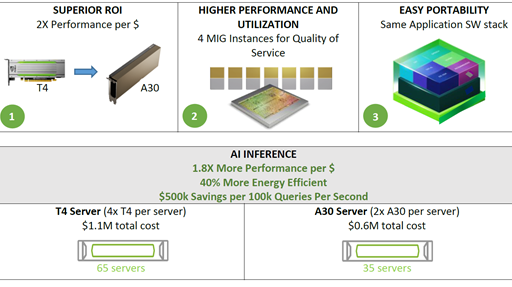
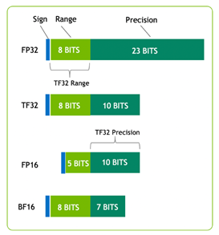
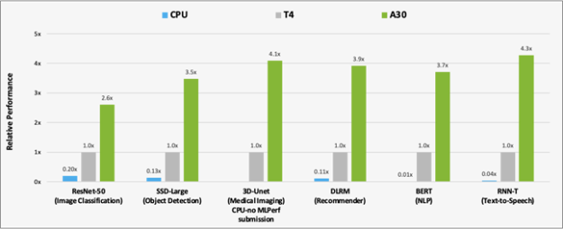
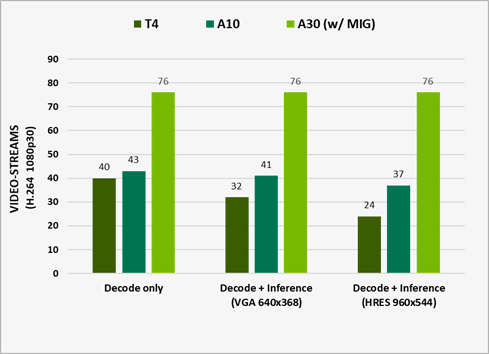

# 加速PyTorch, Tensorflow等框架的推理流程

NVIDIA A30 GPU 基于最新的 NVIDIA Ampere 架构构建，可加速各种工作负载，例如大规模 AI 推理、企业培训和适用于数据中心主流服务器的 HPC 应用程序。 A30 PCIe 卡将第三代张量核心与大容量 HBM2 内存 (24 GB) 和快速 GPU 内存带宽 (933 GB/s) 结合在一个低功耗封装（最大 165 W）中。

A30 支持广泛的数学精度：

* double-precision (FP64)
* single-precision (FP32)
* half-precision (FP16)
* Brain Float 16 (BF16)
* Integer (INT8)

它还支持 Tensor Float 32 (TF32) 和 Tensor Core FP64 等创新，提供单一加速器来加速每个工作负载。

下图显示了 TF32，它具有 FP32 的范围和 FP16 的精度。 TF32 是 PyTorch、TensorFlow 和 MXNet 中的默认选项，因此无需更改代码即可实现比上一代 NVIDIA Volta 架构的加速。

A30 的另一个重要特性是多实例 GPU (MIG) 能力。 MIG 可以最大限度地提高从大到小工作负载的 GPU 利用率，并确保服务质量 (QoS)。 单个 A30 最多可以划分为四个 MIG 实例以同时运行四个应用程序，每个应用程序都与自己的流式多处理器 (SM)、内存、L2 缓存、DRAM 带宽和解码器完全隔离。

互连方面，A30 支持 PCIe Gen4（64 GB/s）和高速第三代 NVLink（最高 200 GB/s）。 每个 A30 可以支持一个 NVLink 桥接与单个相邻的 A30 卡连接。 只要服务器中存在一对相邻的 A30 卡，则该对应通过跨越两个 PCIe 插槽的 NVLink 桥接器连接，以获得最佳桥接性能和平衡的桥接拓扑。

|	|NVIDIA T4|	NVIDIA A30|
|----|----|----|
|Design	|Small Footprint Data Center & Edge Inference	|AI Inference & Mainstream Compute|
|Form Factor|	x16 PCIe Gen3 1 slot LP|	x16 PCIe Gen4 2 Slot FHFL
1 NVLink bridge|
|Memory	|16GB GDDR6|	24GB HBM2|
|Memory Bandwidth​|	320 GB/s|	933 GB/s|
|Multi-Instance GPU	 ||	Up to 4|
|Media Acceleration	|1 Video Encoder 2 Video Decoder	|1 JPEG Decoder 4 Video Decoder|
|Fast FP64	|No	|Yes|
|Ray Tracing|	Yes|	No|
|Power ​|	70W	|165W|

除了上表中总结的硬件优势外，A30 与 T4 GPU 相比可以实现更高的性能。 A30 还支持端到端的软件堆栈解决方案：

* Libraries
* GPU 加速的深度学习框架，例如 PyTorch、TensorFlow 和 MXNet
* 优化的深度学习模型
* 超过 2,000 个 HPC 和 AI 应用程序，可从 NGC 容器中获取

## 性能分析

为了分析 A30 相对于 T4 和 CPU 的性能改进，我们使用数据集对 MLPerf Inference v1.1 中的六个模型进行了基准测试：

* ResNet-50 v1.5 (ImageNet)
* SSD-Large ResNet-34 (COCO)
* 3D-Unet (BraTS 2019)
* DLRM (1TB Click Logs, offline scenario)
* BERT (SQuAD v1.1, seq-len: 384)
* RNN-T (LibriSpeech)

MLPerf 基准套件涵盖了广泛的推理用例，从图像分类和对象检测到推荐器，以及自然语言处理 (NLP)。

下图 显示了 A30 与 T4 和 CPU 在 AI 推理工作负载上的性能比较结果。对于 BERT 推理，A30 比 CPU 快约 300 倍。

与 T4 相比，A30 使用这六种模型的推理性能提高了大约 3-4 倍。 性能加速是由于 A30 更大的内存大小。 这可以为模型提供更大的批量大小和更快的 GPU 内存带宽（几乎是 T4 的 3 倍），从而可以在更短的时间内将数据发送到计算内核。

除了 AI 推理，A30 还可以使用 TF32 快速预训练 BERT Large 等 AI 模型，以及使用 FP64 Tensor Cores 加速 HPC 应用程序。 带有 TF32 的 A30 张量核心可提供比 T4 高 10 倍的性能，而无需对代码进行任何更改。 它们还通过自动混合精度提供额外的 2 倍提升，从而实现 20 倍的综合吞吐量增加。

## 硬件解码器
在构建视频分析或视频处理管道时，必须考虑几个操作：

* **计算模型或预处理步骤的要求**。 这归结为Tensor Cores、GPU DRAM 和其他加速模型或帧预处理内核的硬件组件。
* **传输前的视频流编码**。 这样做是为了最小化网络所需的带宽。 要加速此工作负载，请使用 NVIDIA 硬件解码器。

