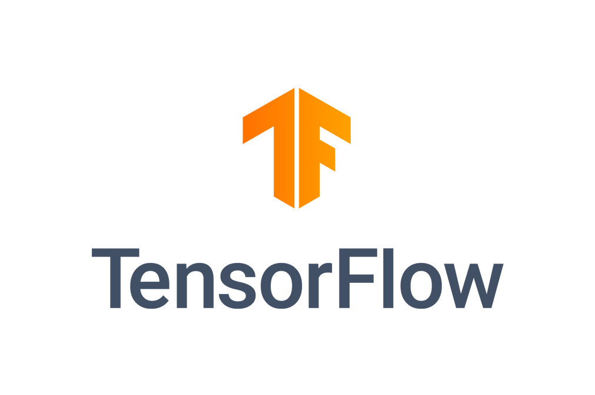
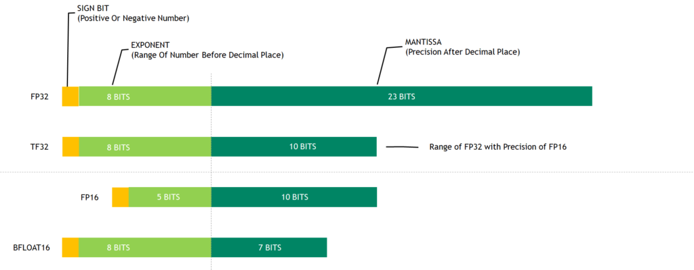
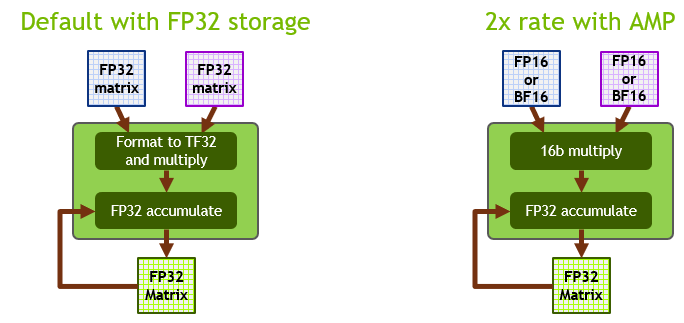
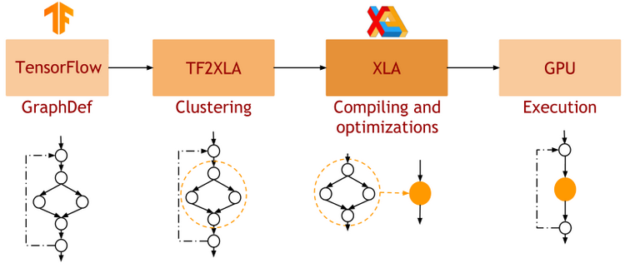
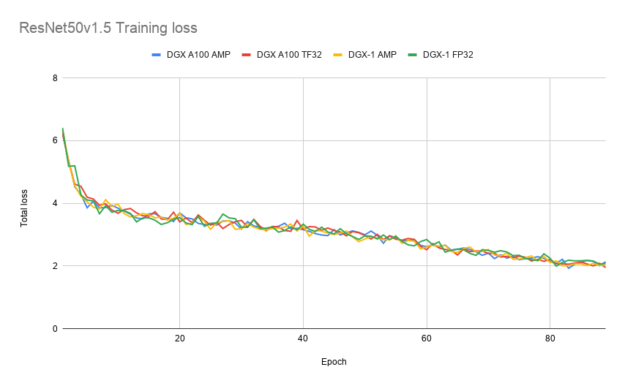
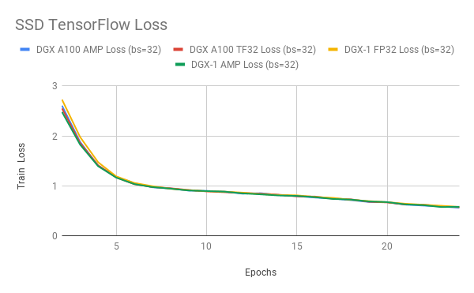
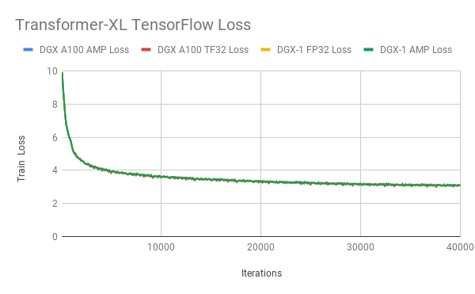

# 利用A100 GPU加速Tensorflow



NVIDIA A100 基于 NVIDIA Ampere GPU 架构，提供一系列令人兴奋的新功能：第三代张量核心、多实例 GPU (MIG) 和第三代 NVLink。

Ampere Tensor Cores 引入了一种专门用于 AI 训练的新型数学模式：TensorFloat-32 (TF32)。 TF32 旨在加速 DL 工作负载中常用的 FP32 数据类型的处理。在 NVIDIA A100 Tensor Cores 上，以 TF32 格式运行的数学运算的吞吐量是在之前的 Volta 代 V100 GPU 上运行的 FP32 的 10 倍以上，从而使 DL 工作负载的性能提高了 5.7 倍。

每个月，NVIDIA 都会在 NVIDIA NGC 上发布用于 DL 框架的容器，所有容器都针对 NVIDIA GPU 进行了优化：TensorFlow 1、TensorFlow 2、PyTorch 和 MXNet。从 20.06 版本开始，在所有深度学习框架容器中添加了对新 NVIDIA A100 功能、新 CUDA 11 和 cuDNN 8 库的支持。

在这篇文章中，我将重点介绍支持 NVIDIA GPU（包括 A100）的基于 TensorFlow 1.15 的容器和pip wheels。

20.06 版本的 NVIDIA TensorFlow 1.15.2 基于上游 TensorFlow 版本 1.15.2。在此版本中，为 NVIDIA Ampere 架构 GPU 上的 TF32 提供了开箱即用的支持，同时还增强了对上一代 GPU（例如 Volta 和 Turing）的支持。此版本允许您在 NVIDIA Ampere 架构 GPU 上实现 TF32 的速度优势，而无需更改 DL 工作负载的代码。此版本还包括对自动混合精度 (AMP)、XLA 和 TensorFlow-TensorRT 集成的重要更新。


## NVIDIA A100 支持的数值精度
深度神经网络 (DNN) 通常可以使用混合精度策略进行训练，主要使用 FP16，但在必要时也使用 FP32 精度。这种策略导致计算、内存和内存带宽需求显着降低，同时通常收敛到相似的最终精度。

NVIDIA Tensor Cores是 NVIDIA Volta 和新一代 GPU 上的专用算术单元。它们可以在单个时钟周期内执行完整的矩阵乘法和累加运算 (MMA)。在 Volta 和 Turing 上，输入是 FP16 格式的两个大小为 4×4 的矩阵，而累加器是 FP32 格式。

Ampere 上的第三代Tensor Cores支持一种新颖的数学模式：TF32。 TF32 是一种混合格式，旨在更高效地处理 FP32 的工作。具体来说，TF32 使用与 FP16 相同的 10 位尾数来确保准确性，同时具有与 FP32 相同的范围，这要归功于使用 8 位指数。

更广泛的可表示范围匹配 FP32 消除了使用 TF32 时对损失缩放操作的需要，从而简化了混合精度训练工作流程。下图 显示了各种数字格式之间的比较。




在 Ampere Tensor Cores 上，TF32 是 DL 工作负载的默认数学模式，与 Volta/Turing GPU 上的 FP32 不同。 在内部，当在 TF32 模式下运行时，Ampere Tensor Cores 接受两个 FP32 矩阵作为输入，但在内部以 TF32 格式执行矩阵乘法。 结果在 FP32 矩阵中累加。

在 FP16/BF16 模式下运行时，Ampere Tensor Cores 接受 FP16/BF16 矩阵，并在 FP32 矩阵中累加。 与 TF32 相比，Ampere 上的 FP16/BF16 模式提供 2 倍的吞吐量。 下图显示了这些操作模式。




TF32 旨在将 NVIDIA Tensor Cores 技术的处理能力带入所有 DL 工作负载，而无需任何必要的代码更改。 对于希望解锁最高吞吐量的更精明的开发人员来说，使用 FP16 进行 AMP 训练仍然是性能最高的选项，而且无需更改代码（使用 NVIDIA NGC TensorFlow 容器时）或只需一行额外代码即可轻松启用。

我们对各种网络架构的广泛实验表明，任何可以成功训练以与 FP16/BF16 上的 AMP 收敛的网络也可以训练以与 TF32 收敛。 在这种情况下，最终 TF32 训练的模型精度与 FP32 训练的模型精度相当。

## TensorFlow 1.15.2 的增强功能
TensorFlow 1.15.2 提供以下增强功能：

* TF32 support
* AMP
* XLA
* TensorFlow-TensorRT 集成

## TF32 支持
20.06 版的 NVIDIA TensorFlow 1.15.2 使用开箱即用的 Ampere TF32 功能来加速所有 DL 训练工作负载。 这是默认选项，不需要开发人员更改代码。 在 pre-Ampere GPU 架构上，FP32 仍然是默认精度。

您还可以通过设置环境变量将 Ampere GPU 上的默认数学模式更改为 FP32：
```C++
export NVIDIA_TF32_OVERRIDE=0
```
不推荐使用此选项。 主要用于调试目的。

## 自动混合精度训练
使用 FP16 进行 AMP 训练仍然是 DL 训练的最佳性能选项。 对于 TensorFlow，AMP 训练是在 TensorFlow 1.14 之后集成的，使从业者可以通过编程方式或通过设置环境变量轻松地进行混合精度训练。

使用单个 API 调用来包装优化器：

```C++
opt = tf.train.experimental.enable_mixed_precision_graph_rewrite(opt)

```

此更改将自动损失缩放应用于您的模型，并启用自动转换为半精度。

使用以下命令在 NVIDIA NGC TensorFlow 1 容器中启用环境变量：

```C++
export TF_ENABLE_AUTO_MIXED_PRECISION=1
```
这会自动将混合精度训练应用于所有 TensorFlow 工作负载。 

## XLA
XLA 是 TensorFlow 的 DL 图编译器。 在原生 TensorFlow 中，网络的每一层都是独立处理的。 相比之下，XLA 可以将网络的部分聚类成可以优化和编译的“子图”。 这以一些编译开销为代价提供了性能优势。 下图 显示了 XLA 的工作流程。




在 GPU 上执行时，XLA 会进行如下优化：

* 内核融合：具有消费者/生产者关系的带宽绑定内核垂直和水平融合到单个 CUDA 内核中。这通过减少对全局内存的访问来提高性能，并提供观察到的大部分性能优势。
* 调用优化的库内核：XLA-GPU 以高度优化和性能调整的 cuDNN/cuBLAS 内核为目标，并将多个运算符组合成一个优化的 cuDNN/cuBLAS 内核。

## TensorFlow-TensorRT 集成
NVIDIA TensorRT 是一个用于高性能深度学习推理的 SDK。它包括一个 DL 推理优化器和运行时，可为 DL 推理应用程序提供低延迟和高吞吐量。

TensorRT 紧密集成到 TensorFlow 1 中。我们称之为 TensorFlow-TensorRT 集成 (TF-TRT)。在 TF 版本 1.15 中，它是 tensorflow.python.compiler 包的一部分。一个经过训练的神经网络可以通过简单的 API 调用轻松转换为 TF-TRT 模型，如以下代码块所示。
```Python
from tensorflow.python.compiler.tensorrt import trt_convert as trt
converter = trt.TrtGraphConverter(
input_saved_model_dir=input_saved_model_dir,
precision_mode=trt.TrtPrecisionMode.
)
converter.convert()
converter.save(output_saved_model_dir)
```
TF-TRT 可以将模型转换为不同的精度：FP32、FP16 和 INT8。 在 INT8 的情况下，需要通过网络馈送小型校准数据集以确定最佳量化参数。 当您将模型从 FP32 转换为 INT8 时，TF-TRT 在图灵一代 T4 GPU 上提供高达 11 倍的推理加速。 

当您在 Ampere 上将模型转换为 FP32 时，TF-TRT 采用的内部数学模式是 TF32，不需要任何代码干预。

## TensorFlow 1.15.2 入门
来自 20.06 版本的 NVIDIA TensorFlow 1.15.2 可作为 NGC Docker 映像或通过 pip wheel 包提供。

拉取 NGC Docker 镜像
可以通过拉取 NGC Docker 容器映像轻松访问 NVIDIA TensorFlow 版本。 使用以下命令：
```Bash
docker pull nvcr.io/nvidia/tensorflow:20.06-tf1-py3
```
此 Docker 容器映像包含所有必需的 TensorFlow-GPU 依赖项，例如 CUDA、CuDNN 和 TensorRT。 它还包括用于多 GPU 和多节点训练的 NCCL 和 Horovod 库，以及用于加速数据预处理和加载的 NVIDIA DALI。

## 安装 pip wheels
来自 20.06 版本的 NVIDIA TensorFlow 1.15.2 也可以通过 wheel 包安装。 当您使用这种安装方式时，NVIDIA TensorFlow 只需要一个带有 Ubuntu 的裸机环境，例如 Ubuntu 18.04，或者一个最小的 Docker 容器，例如 ubuntu:18.04。 此外，NVIDIA 显卡驱动程序也必须可用，并且您应该可以调用 nvidia-smi 来检查 GPU 状态。 从 20.06 版本开始，NVIDIA TensorFlow 1.15.2 所需的所有其他依赖项均由 wheel 包安装。

### 要安装的基本软件
无论您是在裸机上还是在容器中，您都可能需要执行以下操作：

```Bash
apt update
apt install -y python3-dev python3-pip git
pip3 install --upgrade pip setuptools requests
```

### 虚拟环境
有些人使用虚拟环境将 pip 包与冲突隔离开来。 从概念上讲，它类似于 Docker 映像，但它本质上是一个带有目标搜索路径的单独安装目录。

**要设置虚拟环境：**

```
pip install -U virtualenv
virtualenv --system-site-packages -p python3 /venv
```

**启动虚拟环境：**

```
source /venv/bin/activate
```

**为 TensorFlow pip安装索引**

需要安装此索引，以便 pip 知道去 NVIDIA 网站获取wheel。 否则，pip 默认为 PyPI.org。 使用以下命令：

```
pip install nvidia-pyindex
```

**安装 TensorFlow wheel**

**使用以下命令：**
```
pip install nvidia-tensorflow[horovod]
```

**验证是否安装了软件包：**

```
pip list | grep nvidia
```

**输出应如下所示：**

```
nvidia-cublas 11.1.0.213
nvidia-cuda-cupti 11.0.167
nvidia-cuda-nvcc 11.0.167
nvidia-cuda-nvrtc 11.0.167
nvidia-cuda-runtime 11.0.167
nvidia-cudnn 8.0.1.13
nvidia-cufft 10.1.3.191
nvidia-curand 10.2.0.191
nvidia-cusolver 10.4.0.191
nvidia-cusparse 11.0.0.191
nvidia-dali 0.22.0
nvidia-dali-tf-plugin 0.22.0
nvidia-horovod 0.19.1
nvidia-nccl 2.7.5
nvidia-pyindex 1.0.0
nvidia-tensorflow 1.15.2+nv20.6
nvidia-tensorrt 7.1.2.8
```

**验证 TensorFlow 是否加载：**

```
python -c 'import tensorflow as tf; print(tf.__version__)'
```
**输出**
```
1.15.2
```

**验证 GPU 是否被 TensorFlow 使用：**

```
python -c "import tensorflow as tf; print('Num GPUs Available: ', len(tf.config.experimental.list_physical_devices('GPU')))"
```

**输出应该类似于以下内容：**


```C++
2020-05-16 22:03:35.428277: I tensorflow/core/common_runtime/gpu/gpu_device.cc:1639] Found device 0 with properties:
name: Tesla V100-SXM2-16GB major: 7 minor: 0 memoryClockRate(GHz): 1.53
```

## 性能测试
在本文中，我们将讨论在 NVIDIA TensorFlow 1.15.2 NGC 容器中运行时，与 FP32 和使用 AMP 的混合精度训练相比，NVIDIA A100 上的 TF32 的准确性和性能。

### TF32 精度
TF32 匹配任何使用 FP16 或 BF16 混合精度成功训练的网络的 FP32 结果。 我们已经对大量的网络架构进行了试验，但还没有发现例外。

下图 显示了使用 TF32、FP32 和 AMP 训练时 ResNet50、SSD 和 Transformer-XL 的训练损失曲线。 TF32 在稳定性和最终准确度方面产生了可比较的训练曲线。 这些结果可以使用 NVIDIA 深度学习示例中的模型脚本来重现。








