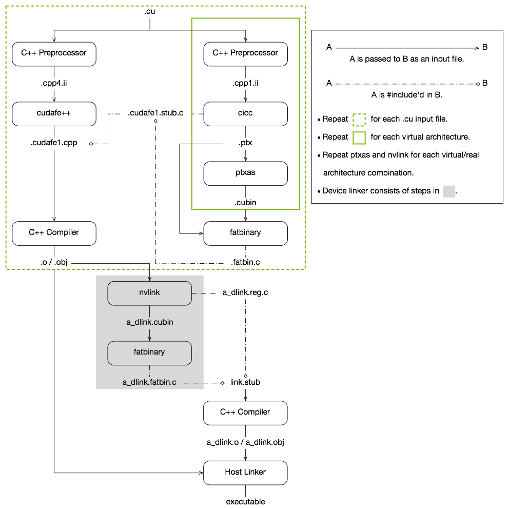

# NVCC编译器详解

CUDA C++ 为熟悉 C++ 编程语言的用户提供了一种简单的途径，可以轻松编写由设备执行的程序。

它由c++语言的最小扩展集和运行时库组成。

编程模型中引入了核心语言扩展。它们允许程序员将内核定义为 C++ 函数，并在每次调用函数时使用一些新语法来指定网格和块的维度。所有扩展的完整描述可以在 [C++ 语言扩展](https://docs.nvidia.com/cuda/cuda-c-programming-guide/index.html#c-language-extensions)中找到。任何包含这些扩展名的源文件都必须使用 nvcc 进行编译，如[使用NVCC编译](https://docs.nvidia.com/cuda/cuda-c-programming-guide/index.html#compilation-with-nvcc)中所述。

运行时在 [CUDA Runtime](https://docs.nvidia.com/cuda/cuda-c-programming-guide/index.html#cuda-c-runtime) 中引入。它提供了在主机上执行的 C 和 C++ 函数，用于分配和释放设备内存、在主机内存和设备内存之间传输数据、管理具有多个设备的系统等。运行时的完整描述可以在 CUDA 参考手册中找到。

运行时构建在较低级别的 C API（即 CUDA 驱动程序 API）之上，应用程序也可以访问该 API。驱动程序 API 通过公开诸如 CUDA 上下文（类似于设备的主机进程）和 CUDA 模块（类似于设备的动态加载库）等较低级别的概念来提供额外的控制级别。大多数应用程序不使用驱动程序 API，因为它们不需要这种额外的控制级别，并且在使用运行时时，上下文和模块管理是隐式的，从而产生更简洁的代码。由于运行时可与驱动程序 API 互操作，因此大多数需要驱动程序 API 功能的应用程序可以默认使用运行时 API，并且仅在需要时使用驱动程序 API。 [Driver API](https://docs.nvidia.com/cuda/cuda-c-programming-guide/index.html#driver-api) 中介绍了驱动API并在参考手册中进行了全面描述。

## 利用NVCC编译

内核可以使用称为 `PTX` 的 CUDA 指令集架构来编写，`PTX` 参考手册中对此进行了描述。 然而，使用高级编程语言（如 C++）通常更有效。 在这两种情况下，内核都必须通过 `nvcc` 编译成二进制代码才能在设备上执行。

`nvcc` 是一种编译器驱动程序，可简化编译 `C++` 或 `PTX` 代码：它提供简单且熟悉的命令行选项，并通过调用实现不同编译阶段的工具集合来执行它们。 本节概述了 `nvcc` 工作流程和命令选项。 完整的描述可以在 `nvcc` 用户手册中找到。

### 编译流程
####  离线编译

使用 nvcc 编译的源文件可以包含主机代码（即在`host`上执行的代码）和设备代码（即在`device`上执行的代码。 nvcc 的基本工作流程包括将设备代码与主机代码分离，然后： 

* 将设备代码编译成汇编形式（`PTX` 代码）或二进制形式（`cubin` 对象）
* 并通过CUDA运行时函数的调用来替换 <<<...>>> 语法对主机代码进行修改，以从 `PTX` 代码或 `cubin` 对象加载和启动每个编译的内核。
  
修改后的主机代码要么作为 C++ 代码输出，然后使用另一个工具编译，要么直接作为目标代码输出，方法是让 nvcc 在最后编译阶段调用主机编译器。

然后应用程序可以：

* 链接到已编译的主机代码（这是最常见的情况），
* 或者忽略修改后的主机代码（如果有）并使用 CUDA 驱动程序 API（请参阅[驱动程序 API](https://docs.nvidia.com/cuda/cuda-c-programming-guide/index.html#driver-api)）来加载和执行 `PTX` 代码或 `cubin` 对象。

#### 即时编译


应用程序在运行时加载的任何 `PTX` 代码都由设备驱动程序进一步编译为二进制代码。这称为即时编译。即时编译增加了应用程序加载时间，但允许应用程序受益于每个新设备驱动程序带来的任何新编译器改进。它也是应用程序能够运行在编译时不存在的设备上的唯一方式，如应用[程序兼容性](https://docs.nvidia.com/cuda/cuda-c-programming-guide/index.html#application-compatibility)中所述。

当设备驱动程序为某些应用程序实时编译一些 `PTX` 代码时，它会自动缓存生成二进制代码的副本，以避免在应用程序的后续调用中重复编译。缓存（称为计算缓存）在设备驱动程序升级时自动失效，因此应用程序可以从设备驱动程序中内置的新即时编译器的改进中受益。

环境变量可用于控制即时编译，如[ CUDA 环境变量](https://docs.nvidia.com/cuda/cuda-c-programming-guide/index.html#env-vars)中所述

作为使用 `nvcc` 编译 CUDA C++ 设备代码的替代方法，`NVRTC` 可用于在运行时将 CUDA C++ 设备代码编译为 PTX。 `NVRTC` 是 CUDA C++ 的运行时编译库；更多信息可以在 `NVRTC` 用户指南中找到。

### Binary 兼容性

二进制代码是特定于体系结构的。 使用指定目标体系结构的编译器选项 `-code` 生成 `cubin` 对象：例如，使用 `-code=sm_35` 编译会为[计算能力](https://docs.nvidia.com/cuda/cuda-c-programming-guide/index.html#compute-capability)为 3.5 的设备生成二进制代码。 从一个次要修订版到下一个修订版都保证了二进制兼容性，但不能保证从一个次要修订版到前一个修订版或跨主要修订版。 换句话说，为计算能力 X.y 生成的 cubin 对象只会在计算能力 X.z 且 z≥y 的设备上执行。

#### 注意：仅桌面支持二进制兼容性。 Tegra 不支持它。 此外，不支持桌面和 Tegra 之间的二进制兼容性。

###  PTX 兼容性
某些 PTX 指令仅在具有更高计算能力的设备上受支持。 例如，[Warp Shuffle Functions](https://docs.nvidia.com/cuda/cuda-c-programming-guide/index.html#warp-shuffle-functions) 仅在计算能力 3.0 及以上的设备上支持。 -arch 编译器选项指定将 C++ 编译为 PTX 代码时假定的计算能力。 因此，例如，包含 `warp shuffle` 的代码必须使用 -arch=compute_30（或更高版本）进行编译。

为某些特定计算能力生成的 PTX 代码始终可以编译为具有更大或相等计算能力的二进制代码。 请注意，从早期 PTX 版本编译的二进制文件可能无法使用某些硬件功能。 例如，从为计算能力 6.0 (Pascal) 生成的 PTX 编译的计算能力 7.0 (Volta) 的二进制目标设备将不会使用 Tensor Core 指令，因为这些指令在 Pascal 上不可用。 因此，最终二进制文件的性能可能会比使用最新版本的 PTX 生成的二进制文件更差。

###  应用程序兼容性

要在具有特定计算能力的设备上执行代码，应用程序必须加载与此计算能力兼容的二进制或 PTX 代码，如[二进制兼容性](https://docs.nvidia.com/cuda/cuda-c-programming-guide/index.html#binary-compatibility)和 [PTX 兼容性](https://docs.nvidia.com/cuda/cuda-c-programming-guide/index.html#ptx-compatibility)中所述。 特别是，为了能够在具有更高计算能力的未来架构上执行代码（尚无法生成二进制代码），应用程序必须加载将为这些设备实时编译的 PTX 代码（参见[即时编译](https://docs.nvidia.com/cuda/cuda-c-programming-guide/index.html#just-in-time-compilation)）。

哪些 `PTX` 和二进制代码嵌入到 CUDA C++ 应用程序中由 `-arch` 和 `-code` 编译器选项或 `-gencode` 编译器选项控制，详见 nvcc 用户手册。 例如:
```C++
nvcc x.cu
        -gencode arch=compute_50,code=sm_50
        -gencode arch=compute_60,code=sm_60
        -gencode arch=compute_70,code=\"compute_70,sm_70\"
```
嵌入与计算能力 5.0 和 6.0（第一和第二`-gencode` 选项）兼容的二进制代码以及与计算能力 7.0（第三`-gencode` 选项）兼容的 PTX 和二进制代码。

生成主机代码以在运行时自动选择最合适的代码来加载和执行，在上面的示例中，这些代码将是：
* 具有计算能力 5.0 和 5.2 的设备的 5.0 二进制代码，
* 具有计算能力 6.0 和 6.1 的设备的 6.0 二进制代码，
* 具有计算能力 7.0 和 7.5 的设备的 7.0 二进制代码，
* PTX 代码在运行时编译为具有计算能力 8.0 和 8.6 的设备的二进制代码。

例如，`x.cu` 可以有一个优化代码的方法，使用 warp shuffle 操作，这些操作仅在计算能力 3.0 及更高版本的设备中受支持。 `__CUDA_ARCH__` 宏可用于根据计算能力区分各种代码方案。 它仅为设备代码定义。 例如，当使用 `-arch=compute_35` 编译时，`__CUDA_ARCH__` 等于 350。

使用驱动 API 的应用程序必须编译代码以分离文件并在运行时显式加载和执行最合适的文件。

Volta 架构引入了独立线程调度，它改变了在 GPU 上调度线程的方式。 对于依赖于以前架构中 [SIMT 调度](https://docs.nvidia.com/cuda/cuda-c-programming-guide/index.html#simt-architecture)的特定行为的代码，独立线程调度可能会改变参与线程的集合，从而导致不正确的结果。 为了在实现[独立线程调度](https://docs.nvidia.com/cuda/cuda-c-programming-guide/index.html#independent-thread-scheduling-7-x)中详述的纠正措施的同时帮助迁移，Volta 开发人员可以使用编译器选项组合 -arch=compute_60 -code=sm_70 选择加入 Pascal 的线程调度。

nvcc 用户手册列出了 `-arch、-code` 和 `-gencode` 编译器选项的各种简写。 例如，`-arch=sm_70` 是 `-arch=compute_70 -code=compute_70,sm_70` 的简写（与 `-gencode arch=compute_70,code=\"compute_70,sm_70\"` 相同）。

###  C++兼容性
编译器前端根据 C++ 语法规则处理 CUDA 源文件。 主机代码支持完整的 C++。 但是，设备代码仅完全支持 C++ 的一个子集，如 [C++ 语言支持](https://docs.nvidia.com/cuda/cuda-c-programming-guide/index.html#c-cplusplus-language-support)中所述。

### 64位支持

64 位版本的 `nvcc` 以 64 位模式编译设备代码（即指针是 64 位的）。 以 64 位模式编译的设备代码仅支持以 64 位模式编译的主机代码。

同样，32 位版本的 `nvcc` 以 32 位模式编译设备代码，而以 32 位模式编译的设备代码仅支持以 32 位模式编译的主机代码。

32 位版本的 `nvcc` 也可以使用 -m64 编译器选项以 64 位模式编译设备代码。

64 位版本的 `nvcc` 也可以使用 -m32 编译器选项以 32 位模式编译设备代码。