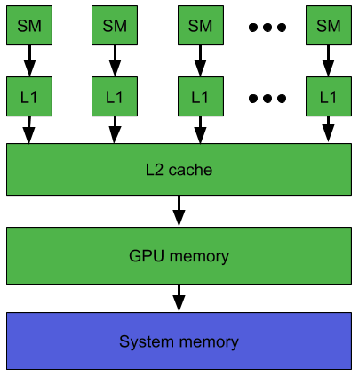

# L2级设备内存管理


当一个 CUDA 内核重复访问全局内存中的一个数据区域时，这种数据访问可以被认为是持久化的。 另一方面，如果数据只被访问一次，那么这种数据访问可以被认为是流式的。

从 CUDA 11.0 开始，计算能力 8.0 及以上的设备能够影响 L2 缓存中数据的持久性，从而可能提供对全局内存的更高带宽和更低延迟的访问。

## 为持久访问预留L2缓存
可以留出一部分 L2 缓存用于持久化对全局内存的数据访问。 持久访问优先使用 L2 缓存的这个预留部分，而对全局内存的正常访问或流式访问只能在持久访问未使用 L2 的这一部分使用。

可以在以下限制内调整用于持久访问的 L2 缓存预留大小：
``` C++
cudaGetDeviceProperties(&prop, device_id);                
size_t size = min(int(prop.l2CacheSize * 0.75), prop.persistingL2CacheMaxSize);
cudaDeviceSetLimit(cudaLimitPersistingL2CacheSize, size); /* set-aside 3/4 of L2 cache for persisting accesses or the max allowed*/ 
```

在多实例 GPU (MIG) 模式下配置 GPU 时，L2 缓存预留功能被禁用。

使用多进程服务 (MPS) 时，`cudaDeviceSetLimit` 无法更改 L2 缓存预留大小。 相反，只能在 MPS 服务器启动时通过环境变量 `CUDA_DEVICE_DEFAULT_PERSISTING_L2_CACHE_PERCENTAGE_LIMIT` 指定预留大小。

## L2持久化访问策略

访问策略窗口指定全局内存的连续区域和L2缓存中的持久性属性，用于该区域内的访问。

下面的代码示例显示了如何使用 CUDA 流设置L2持久访问窗口。
```C++
cudaStreamAttrValue stream_attribute;                                         // Stream level attributes data structure
stream_attribute.accessPolicyWindow.base_ptr  = reinterpret_cast<void*>(ptr); // Global Memory data pointer
stream_attribute.accessPolicyWindow.num_bytes = num_bytes;                    // Number of bytes for persistence access.
                                                                              // (Must be less than cudaDeviceProp::accessPolicyMaxWindowSize)
stream_attribute.accessPolicyWindow.hitRatio  = 0.6;                          // Hint for cache hit ratio
stream_attribute.accessPolicyWindow.hitProp   = cudaAccessPropertyPersisting; // Type of access property on cache hit
stream_attribute.accessPolicyWindow.missProp  = cudaAccessPropertyStreaming;  // Type of access property on cache miss.

//Set the attributes to a CUDA stream of type cudaStream_t
cudaStreamSetAttribute(stream, cudaStreamAttributeAccessPolicyWindow, &stream_attribute); 
```

当内核随后在 CUDA 流中执行时，全局内存范围 [ptr..ptr+num_bytes) 内的内存访问比对其他全局内存位置的访问更有可能保留在 L2 缓存中。

也可以为 CUDA Graph Kernel Node节点设置 L2 持久性，如下例所示：
```C++
cudaKernelNodeAttrValue node_attribute;                                     // Kernel level attributes data structure
node_attribute.accessPolicyWindow.base_ptr  = reinterpret_cast<void*>(ptr); // Global Memory data pointer
node_attribute.accessPolicyWindow.num_bytes = num_bytes;                    // Number of bytes for persistence access.
                                                                            // (Must be less than cudaDeviceProp::accessPolicyMaxWindowSize)
node_attribute.accessPolicyWindow.hitRatio  = 0.6;                          // Hint for cache hit ratio
node_attribute.accessPolicyWindow.hitProp   = cudaAccessPropertyPersisting; // Type of access property on cache hit
node_attribute.accessPolicyWindow.missProp  = cudaAccessPropertyStreaming;  // Type of access property on cache miss.
                                    
//Set the attributes to a CUDA Graph Kernel node of type cudaGraphNode_t
cudaGraphKernelNodeSetAttribute(node, cudaKernelNodeAttributeAccessPolicyWindow, &node_attribute); 
```

`hitRatio` 参数可用于指定接收 `hitProp` 属性的访问比例。 在上面的两个示例中，全局内存区域 [ptr..ptr+num_bytes) 中 60% 的内存访问具有持久属性，40% 的内存访问具有流属性。 哪些特定的内存访问被归类为持久（`hitProp`）是随机的，概率大约为 `hitRatio`； 概率分布取决于硬件架构和内存范围。

例如，如果 L2 预留缓存大小为 16KB，而 accessPolicyWindow 中的 num_bytes 为 32KB：
* `hitRatio` 为 0.5 时，硬件将随机选择 32KB 窗口中的 16KB 指定为持久化并缓存在预留的 L2 缓存区域中。
* `hitRatio` 为 1.0 时，硬件将尝试在预留的 L2 缓存区域中缓存整个 32KB 窗口。 由于预留区域小于窗口，缓存行将被逐出以将 32KB 数据中最近使用的 16KB 保留在 L2 缓存的预留部分中。

因此，`hitRatio` 可用于避免缓存的破坏，并总体减少移入和移出 L2 高速缓存的数据量。

低于 1.0 的 `hitRatio` 值可用于手动控制来自并发 CUDA 流的不同 `accessPolicyWindows` 可以缓存在 L2 中的数据量。 例如，让 L2 预留缓存大小为 16KB； 两个不同 CUDA 流中的两个并发内核，每个都有一个 16KB 的 `accessPolicyWindow`，并且两者的 `hitRatio` 值都为 1.0，在竞争共享 L2 资源时，可能会驱逐彼此的缓存。 但是，如果两个 `accessPolicyWindows` 的 `hitRatio` 值都为 0.5，则它们将不太可能逐出自己或彼此的持久缓存。 

## L2访问属性

为不同的全局内存数据访问定义了三种类型的访问属性：

1. `cudaAccessPropertyStreaming`：使用流属性发生的内存访问不太可能在 L2 缓存中持续存在，因为这些访问优先被驱逐。
2.  `cudaAccessPropertyPersisting`：使用持久属性发生的内存访问更有可能保留在 L2 缓存中，因为这些访问优先保留在 L2 缓存的预留部分中。
3. `cudaAccessPropertyNormal`：此访问属性强制将先前应用的持久访问属性重置为正常状态。来自先前 CUDA 内核的具有持久性属性的内存访问可能会在其预期用途之后很长时间保留在 L2 缓存中。这种使用后的持久性减少了不使用持久性属性的后续内核可用的 L2 缓存量。使用 `cudaAccessPropertyNormal` 属性重置访问属性窗口会删除先前访问的持久（优先保留）状态，就像先前访问没有访问属性一样。

## L2持久性示例

以下示例显示如何为持久访问预留 L2 缓存，通过 CUDA Stream 在 CUDA 内核中使用预留的 L2 缓存，然后重置 L2 缓存。
```C++
cudaStream_t stream;
cudaStreamCreate(&stream);                                                                  // Create CUDA stream

cudaDeviceProp prop;                                                                        // CUDA device properties variable
cudaGetDeviceProperties( &prop, device_id);                                                 // Query GPU properties
size_t size = min( int(prop.l2CacheSize * 0.75) , prop.persistingL2CacheMaxSize );
cudaDeviceSetLimit( cudaLimitPersistingL2CacheSize, size);                                  // set-aside 3/4 of L2 cache for persisting accesses or the max allowed

size_t window_size = min(prop.accessPolicyMaxWindowSize, num_bytes);                        // Select minimum of user defined num_bytes and max window size.

cudaStreamAttrValue stream_attribute;                                                       // Stream level attributes data structure
stream_attribute.accessPolicyWindow.base_ptr  = reinterpret_cast<void*>(data1);               // Global Memory data pointer
stream_attribute.accessPolicyWindow.num_bytes = window_size;                                // Number of bytes for persistence access
stream_attribute.accessPolicyWindow.hitRatio  = 0.6;                                        // Hint for cache hit ratio
stream_attribute.accessPolicyWindow.hitProp   = cudaAccessPropertyPersisting;               // Persistence Property
stream_attribute.accessPolicyWindow.missProp  = cudaAccessPropertyStreaming;                // Type of access property on cache miss

cudaStreamSetAttribute(stream, cudaStreamAttributeAccessPolicyWindow, &stream_attribute);   // Set the attributes to a CUDA Stream

for(int i = 0; i < 10; i++) {
    cuda_kernelA<<<grid_size,block_size,0,stream>>>(data1);                                 // This data1 is used by a kernel multiple times
}                                                                                           // [data1 + num_bytes) benefits from L2 persistence
cuda_kernelB<<<grid_size,block_size,0,stream>>>(data1);                                     // A different kernel in the same stream can also benefit
                                                                                            // from the persistence of data1

stream_attribute.accessPolicyWindow.num_bytes = 0;                                          // Setting the window size to 0 disable it
cudaStreamSetAttribute(stream, cudaStreamAttributeAccessPolicyWindow, &stream_attribute);   // Overwrite the access policy attribute to a CUDA Stream
cudaCtxResetPersistingL2Cache();                                                            // Remove any persistent lines in L2 

cuda_kernelC<<<grid_size,block_size,0,stream>>>(data2);                                     // data2 can now benefit from full L2 in normal mode
```

## 将L2 Access重置为Normal

来自之前CUDA内核的L2缓存在被使用后可能会长期保存在L2中。因此，L2缓存重设为正常状态对于流或正常内存访问很重要，以便以正常优先级使用L2缓存。有三种方法可以将持久访问重置为正常状态。
1. 使用访问属性`cudaAccessPropertyNormal`重置之前的持久化内存区域。
2. 通过调用`cudaCtxResetPersistingL2Cache()`将所有持久L2缓存线重置为正常。
3. 最终，未触及的空间会自动重置为正常。对自动复位的依赖性很强

## 管理L2预留缓存的利用率
在不同 CUDA 流中同时执行的多个 CUDA 内核可能具有分配给它们的流的不同访问策略窗口。 但是，L2 预留缓存部分在所有这些并发 CUDA 内核之间共享。 因此，这个预留缓存部分的净利用率是所有并发内核单独使用的总和。 将内存访问指定为持久访问的好处会随着持久访问的数量超过预留的 L2 缓存容量而减少。

要管理预留 L2 缓存部分的利用率，应用程序必须考虑以下事项：

* L2 预留缓存的大小。
* 可以同时执行的 CUDA 内核。
* 可以同时执行的所有 CUDA 内核的访问策略窗口。
* 何时以及如何需要 L2 重置以允许正常或流式访问以同等优先级利用先前预留的 L2 缓存。

## 查询L2缓存属性
与 L2 缓存相关的属性是 `cudaDeviceProp` 结构的一部分，可以使用 CUDA 运行时 API `cudaGetDeviceProperties` 进行查询

CUDA 设备属性包括：

* `l2CacheSize`：GPU 上可用的二级缓存数量。
* `persistingL2CacheMaxSize`：可以为持久内存访问留出的 L2 缓存的最大数量。
* `accessPolicyMaxWindowSize`：访问策略窗口的最大尺寸。

## 控制L2缓存预留大小用于持久内存访问
使用 CUDA 运行时 API `cudaDeviceGetLimit` 查询用于持久内存访问的 L2 预留缓存大小，并使用 CUDA 运行时 API `cudaDeviceSetLimit` 作为 `cudaLimit` 进行设置。 设置此限制的最大值是 `cudaDeviceProp::persistingL2CacheMaxSize`。
```C++
enum cudaLimit {
    /* other fields not shown */
    cudaLimitPersistingL2CacheSize
}; 
```