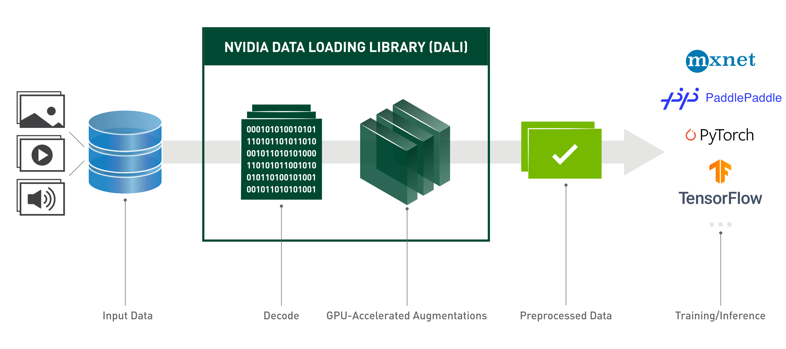

# NVIDIA_DALI

NVIDIA 数据加载库 (DALI: Data Loading Library) 是一个用于数据加载和预处理以加速深度学习应用程序的库。它提供了一组高度优化的构建块，用于加载和处理图像、视频和音频数据。它可以用作流行深度学习框架中内置数据加载器和数据迭代器的便携式替代品。

深度学习应用程序需要复杂的多阶段数据处理管道，包括加载、解码、裁剪、调整大小和许多其他增强功能。这些目前在 CPU 上执行的数据处理管道已成为瓶颈，限制了训练和推理的性能和可扩展性。

DALI 通过将数据预处理卸载到 GPU 来解决 CPU 瓶颈问题。此外，DALI 依赖于自己的执行引擎，旨在最大限度地提高输入管道的吞吐量。预取、并行执行和批处理等功能为用户透明地处理。

此外，深度学习框架具有多种数据预处理实现，导致训练和推理工作流程的可移植性以及代码可维护性等挑战。使用 DALI 实现的数据处理管道是可移植的，因为它们可以轻松地重新定位到 TensorFlow、PyTorch、MXNet 和 PaddlePaddle。




```Python
from nvidia.dali.pipeline import pipeline_def
import nvidia.dali.types as types
import nvidia.dali.fn as fn
from nvidia.dali.plugin.pytorch import DALIGenericIterator

@pipeline_def(batch_size=128, num_threads=4, device_id=0)
def get_dali_pipeline(data_dir, crop_size):
  images, labels = fn.readers.file(file_root=data_dir, shuffle=True, name="Reader")
  # decode data on the GPU
  images = fn.decoders.image_random_crop(images, device="mixed", output_type=types.RGB)
  # the rest of processing happens on the GPU as well
  images = fn.resize(images, resize_x=crop_size, resize_y=crop_size)
  images = fn.crop_mirror_normalize(images,
                                    mean=[0.485 * 255,0.456 * 255,0.406 * 255],
                                    std=[0.229 * 255,0.224 * 255,0.225 * 255],
                                    mirror=fn.random.coin_flip())
  return images, label

train_data = DALIGenericIterator(
   [get_dali_pipeline(data_dir, (244,244))], ['data', 'label’],
   reader_name='Reader’
)


for i, data in enumerate(train_data):
  x, y = data[0]['data'], data[0]['label’]
  pred = model(x)
  loss = loss_func(pred, y)
  backward(loss, model)

```

## 特点
* 易于使用的 Python API。

* 支持多种数据格式 - LMDB、RecordIO、TFRecord、COCO、JPEG、JPEG 2000、WAV、FLAC、OGG、H.264、VP9 和 HEVC。

* 可跨流行的深度学习框架移植：TensorFlow、PyTorch、MXNet、PaddlePaddle。

* 支持 CPU 和 GPU 执行。

* 可跨多个 GPU 进行扩展。

* 灵活的图表让开发人员可以创建自定义管道。

* 可通过自定义运算符扩展以满足用户特定的需求。

* 加速图像分类 (ResNet-50)、对象检测 (SSD) 工作负载以及 ASR 模型（Jasper、RNN-T）。

* 允许使用 GPUDirect Storage 在存储和 GPU 内存之间建立直接数据路径。

* 与带有 DALI TRITON 后端的 NVIDIA Triton 推理服务器轻松集成。

* 开源。


