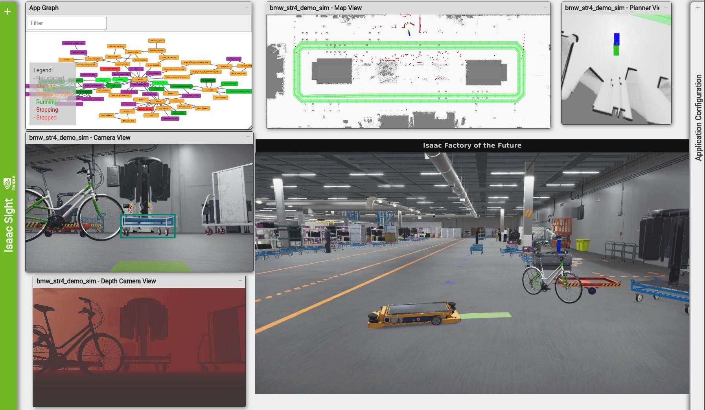
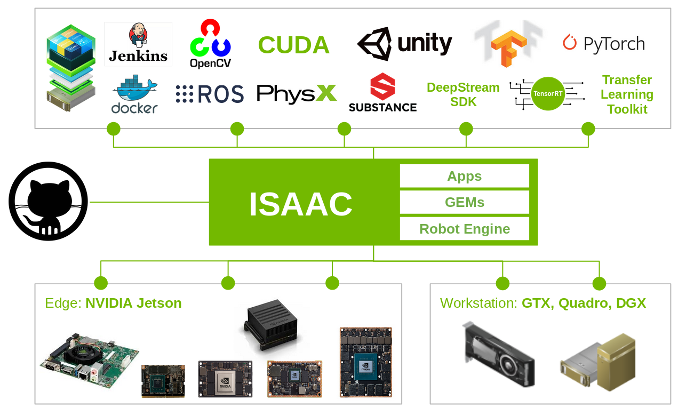
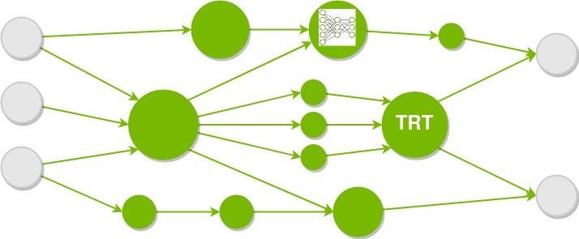
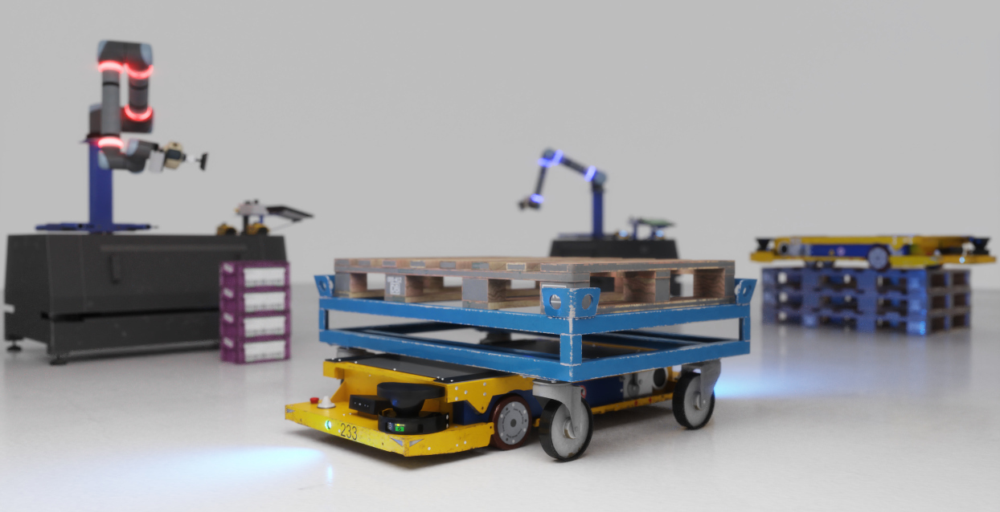

# Isaac简介

## 简介
Isaac 是 NVIDIA 的智能机器人开放平台。 Isaac SDK 提供了大量强大的 GPU 加速算法 GEM 用于导航和操作。 Isaac SDK Engine 是一个框架，可轻松编写模块化应用程序并将其部署在真实机器人上。 Isaac SDK 附带各种示例应用程序，从显示特定功能的基本示例到促进复杂机器人用例的应用程序。 Isaac SDK 还与 Isaac SIM 协同工作，允许在虚拟环境中开发、测试和训练机器人。

## Isaac GEMs
机器人技术结合了许多不同的学科，包括低级硬件驱动程序、安全规划算法、快速准确的计算机视觉、深度神经网络和高级人工智能。在这些学科取得成功通常需要多年的专业知识。

Isaac SDK 附带一组高性能算法，也称为 GEM，以加速具有挑战性的机器人应用程序的开发。例如，Isaac 为导航和操作用例提供规划和感知 GEM。 GEM 还为关键硬件组件和机器人外围设备提供支持。

## Isaac Applications
Isaac SDK 提供了各种示例应用程序，这些示例应用程序突出了 Isaac SDK 引擎的功能或专注于特定 Isaac SDK GEM 的功能。这些示例应用程序是学习 Isaac 的良好起点。

Isaac SDK 用于开发复杂用例（如送货机器人）的应用程序。 Carter 应用程序为您提供了构建自己的送货机器人的起点。卡特可以开车到目标地点，巡逻建筑物，或者给你带来爆米花。 Carter 导航堆栈基于激光雷达。

要从较小的规模开始，请参阅 Kaya 应用程序。 Isaac 包含有关如何构建自己的机器人并使用人工智能将其变为现实的说明。

Isaac SDK 也得到了丰富的生态系统的支持，Isaac SDK Engine 将 Isaac GEM 连接到现有的包，如 OpenCV、ROS、PCL 等。

## Isaac Engine
Isaac SDK 包括 Isaac SDK 引擎，这是一个用于构建模块化机器人应用程序的功能丰富的框架。 使用 Isaac，您可以使用小组件构建应用程序，这些组件在彼此之间传递消息，并且可以配置为您的自定义用例。

Isaac SDK 带有基于 Bazel 构建系统的工具链，用于构建和部署应用程序。您可以使用像

` bazel run //apps/samples/realsense_camera` 

这样简单的命令来构建和运行应用程序。所有外部依赖项都会自动拉入您的系统，无需任何额外设置。本文档的[设置](https://docs.nvidia.com/isaac/doc/setup.html#setup-isaac)部分介绍了入门所需的几个步骤。

Isaac SDK 引擎完全支持 NVIDIA GPU 和 CUDA、TensorRT、NPP 和其他框架，可让您构建最快的机器人应用程序。它针对 Jetson Xavier、Jetson TX/2、Jetson Nano 和工作站 GPU 等 NVIDIA 硬件进行了优化。您可以使用一个简短的命令行脚本部署针对您的平台优化的交叉编译应用程序。

## Isaac Sim
Isaac Sim 将 NVIDIA Omniverse™ 平台应用于机器人技术，具有最先进的 RTX 图形和 GPU 加速的 PhysX 模拟。您可以使用 Omniverse Connect 将工程模型从流行工具导出到 Omniverse Nucleus 服务器，并使用 Isaac Sim 编辑器构建您的模拟实验。您可以在[ Omniverse 文档](https://docs.omniverse.nvidia.com/app_isaacsim/app_isaacsim/overview.html)页面上了解有关 Isaac Sim 的更多信息。

Isaac SDK 还支持 Unity3D 作为导航和感知训练的模拟后端，并支持 Unity3D 高清渲染管道 (HDRP)。

