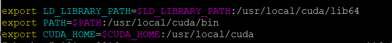
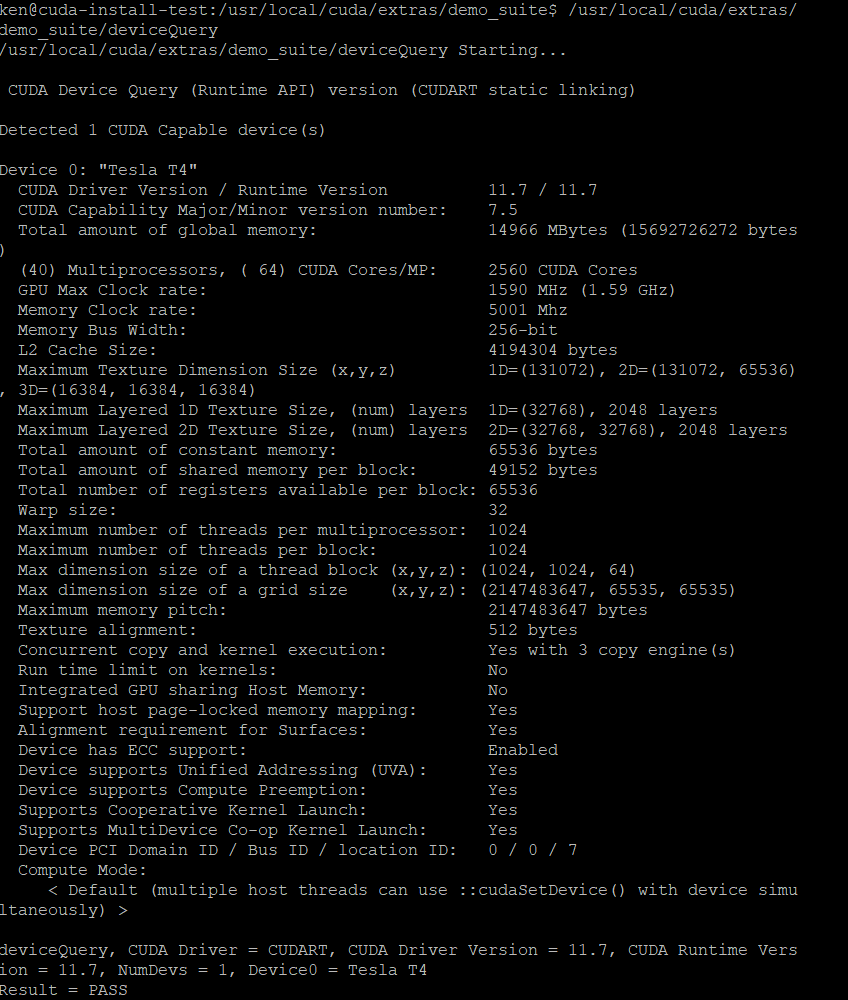

# ubuntu 20.04 CUDA 11.7环境配置教程

本教程可以在完全命令行完成, 你可以只需要用ssh连接主机就好.

本教程适配环境:
* ubuntu 20.04
* cuda 11.7
* cudnn 8.4


# 1.查看是否有合适的GPU
在命令行输入:
```Bash
lspci | grep -i nvidia
```
输出:
```Bash
00:07.0 3D controller: NVIDIA Corporation TU104GL [Tesla T4] (rev a1)
```

# 2.查看系统版本,我用的是ubuntu 20.04:
在命令行输入:
```Bash
uname -m && cat /etc/*release
```
输出:
```Bash
x86_64
DISTRIB_ID=Ubuntu
DISTRIB_RELEASE=20.04
DISTRIB_CODENAME=focal
DISTRIB_DESCRIPTION="Ubuntu 20.04.4 LTS"
NAME="Ubuntu"
VERSION="20.04.4 LTS (Focal Fossa)"
ID=ubuntu
ID_LIKE=debian
PRETTY_NAME="Ubuntu 20.04.4 LTS"
VERSION_ID="20.04"
HOME_URL="https://www.ubuntu.com/"
SUPPORT_URL="https://help.ubuntu.com/"
BUG_REPORT_URL="https://bugs.launchpad.net/ubuntu/"
PRIVACY_POLICY_URL="https://www.ubuntu.com/legal/terms-and-policies/privacy-policy"
VERSION_CODENAME=focal
UBUNTU_CODENAME=focal
```

# 3.验证系统GCC版本:
在命令行输入:
```Bash
gcc --version
```
输出:
```Bash
gcc (Ubuntu 9.4.0-1ubuntu1~20.04.1) 9.4.0
Copyright (C) 2019 Free Software Foundation, Inc.
This is free software; see the source for copying conditions.  There is NO
warranty; not even for MERCHANTABILITY or FITNESS FOR A PARTICULAR PURPOSE.

```

# 4.通过下面的地址下载安装包:
https://developer.nvidia.com/cuda-downloads


比如我这里是Ubuntu 20.04, 那么我选择的是`Linux -> x86_64 -> Ubuntu -> 20.04 -> runfile(local)`

#### 这里奉劝各位一句, 如果你实在是新手, 可以选择deb(local)


我这里用的是wget的下载命令, 如果大家网速不行, 建议可以手动复制wget后面的网址, 然后在浏览器打开进行下载

在命令行输入:
```Bash
wget https://developer.download.nvidia.com/compute/cuda/11.7.0/local_installers/cuda_11.7.0_515.43.04_linux.run
```


# 5.禁用系统自带的显卡驱动
在命令行输入:

```Bash
sudo touch /etc/modprobe.d/blacklist-nouveau.conf
```
```Bash
sudo vim /etc/modprobe.d/blacklist-nouveau.conf
```
然后将下面的内容添加到`/etc/modprobe.d/blacklist-nouveau.conf`中并保存:
```C++
blacklist nouveau
options nouveau modeset=0
```
更新一下
```Bash
sudo update-initramfs -u
```
输出:
```
update-initramfs: Generating /boot/initrd.img-5.4.0-110-generic
```
这里需要重启一下
```
sudo reboot
```

# 6.安装cuda程序
找到我们在之前下载.run文件

在命令行输入:
```
sudo sh cuda_11.7.0_515.43.04_linux.run
```
运行之后可能要稍微等一小段时间, 20~30秒左右, 系统在解压文件并加载, 不用着急.

然后需要你先接受使用协议:


然后选择安装:

这里可以明确的看到, 它会帮你自动安装好所需要的驱动, 这里建议使用它的会比较好.包括:驱动,toolkit,demo和文档都可以安装好.


然后界面会跳回之前的界面, 稍等, 这里在安装东西, 大家不要慌.


等待安装完毕会有如下界面:


这就完了吗? 当然不是!

# 7.将CUDA路径加入系统环境
在安装完成后, 我们需要将cuda的路径写入系统环境变量中, 让系统能够找到CUDA.

这里需要你用VIM或者gedit打开~/.bashrc:
#### 这里再次强调一下, 如果没学过vim的同学可以学一下, 在Linux中用的非常多, vim工具也很简单, 就是一个文本编辑工具
```Bash
vim ~/.bashrc
```
然后将下面的内容放在.bashrc文件的最后面

```Bash
export LD_LIBRARY_PATH=$LD_LIBRARY_PATH:/usr/local/cuda/lib64
export PATH=$PATH:/usr/local/cuda/bin
export CUDA_HOME=$CUDA_HOME:/usr/local/cuda
```


然后输入:
```
source ~/.bashrc
sudo ldconfig
```
这两步是来更新系统环境的


# 8.验证安装

查看nvcc:
```Bash
nvcc -V
```


查看你的系统GPU参数, 运行deviceQuery:

```Bash
 /usr/local/cuda/extras/demo_suite/deviceQuery
```

# 特别注意一点:现在安装方式把原来老版本中samples文件夹替换成了demo_suit, 原来完整版的samples请前往GITHUB下载: https://github.com/NVIDIA/cuda-samples


# 9.cuDNN下载
下载地址:
https://developer.nvidia.com/rdp/cudnn-download

将下载的tar文件上传到设备上

解压缩文件:
```Bash
tar -xvf cudnn-linux-x86_64-8.4.0.27_cuda11.6-archive.tar.xz
```


# 10.cuDNN安装

将下载好的.h文件和lib文件放到cuda文件夹目录下:

注意这里的`cudnn-linux-x86_64-8.4.0.27_cuda11.6-archive`可能会因为你是用别的版本而稍有不同, 请使用别的版本的同学自行更改
```Bash
sudo cp cudnn-linux-x86_64-8.4.0.27_cuda11.6-archive/include/cudnn*.h /usr/local/cuda/include 

sudo cp -p cudnn-linux-x86_64-8.4.0.27_cuda11.6-archive/lib/libcudnn* /usr/local/cuda/lib64

sudo chmod a+r /usr/local/cuda/include/cudnn*.h /usr/local/cuda/lib64/libcudnn*
```


## OK! 到这里就全部安装好了, 希望对大家有用.

## 另外再强调一点, 在Linux上开发, 真的建议广大初学者从命令行开始入手!!!


