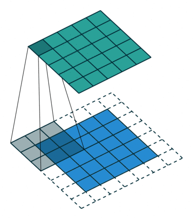
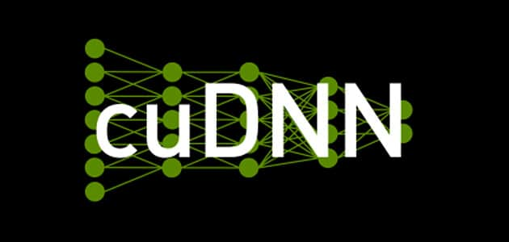

# 深度神经网络加速库cuDNN简介

## 简介
NVIDIA® CUDA深度神经网络库 (cuDNN: CUDA Deep Neural Network ) 是用于深度神经网络的 GPU 加速基元库。它提供了 DNN 应用程序中经常出现的例程的高度调整实现：
* Convolution forward and backward, including cross-correlation
* Matrix multiplication
* Pooling forward and backward
* Softmax forward and backward
* Neuron activations forward and backward: relu, tanh, sigmoid, elu, gelu, softplus, swish
* Arithmetic, mathematical, relational and logical pointwise operations
* Tensor transformation functions
* LRN, LCN and batch normalization forward and backward

cuDNN 卷积示例旨在实现与此类示例的最快的基于 GEMM（矩阵乘法）的实现具有竞争力的性能，同时使用显着更少的内存。

cuDNN 功能包括可定制的数据布局，支持灵活的维度排序、跨步以及用作其所有例程的输入和输出的 4D 张量的子区域。这种灵活性允许轻松集成到任何神经网络实现中，并避免了基于 GEMM 的卷积有时需要的输入/输出转置步骤。

cuDNN 提供了一个基于上下文的 API，可以轻松实现多线程和（可选）与 NVIDIA® CUDA® 流的互操作性。

## 编程模型

cuDNN 库公开了一个主机 API，但假设对于使用 GPU 的操作，可以从设备直接访问必要的数据。

使用 cuDNN 的应用程序必须通过调用 `cudnnCreate()` 来初始化库上下文的句柄。这个句柄被显式地传递给对 GPU 数据进行操作的每个后续库函数。一旦应用程序完成使用 cuDNN，它可以使用 `cudnnDestroy()` 释放与库句柄关联的资源。这种方法允许用户在使用多个主机线程、GPU 和 CUDA 流时显式控制库的功能。

例如，应用程序可以使用 `cudaSetDevice` 将不同的设备与不同的主机线程相关联，并且在每个主机线程中，使用唯一的 cuDNN 句柄将库调用定向到与其关联的设备。因此，使用不同句柄进行的 cuDNN 库调用将自动在不同的设备上运行。

假定与特定 cuDNN 上下文关联的设备在相应的 `cudnnCreate()` 和 `cudnnDestroy()` 调用之间保持不变。为了使 cuDNN 库在同一主机线程中使用不同的设备，应用程序必须通过调用 `cudaSetDevice()` 设置要使用的新设备，然后通过调用创建另一个与新设备关联的 cuDNN 上下文cudnnCreate()。

## cuDNN API 兼容性
从 cuDNN 7 开始，补丁和次要版本的二进制兼容性保持如下：
* 任何补丁版本 x.y.z 都与针对另一个 cuDNN 补丁版本 x.y.w 构建的应用程序向前或向后兼容（意思是，具有相同的主要和次要版本号，但具有 w!=z）。

* 从 cuDNN 7 开始的 cuDNN 次要版本与基于相同或更早补丁版本构建的应用程序二进制向后兼容（这意味着，基于 cuDNN 7.x 构建的应用程序与 cuDNN 库 7.y 二进制兼容，其中 y>=x）。

* 当 y > x 时，使用 cuDNN 版本 7.y 编译的应用程序不能保证与 7.x 版本一起使用。

