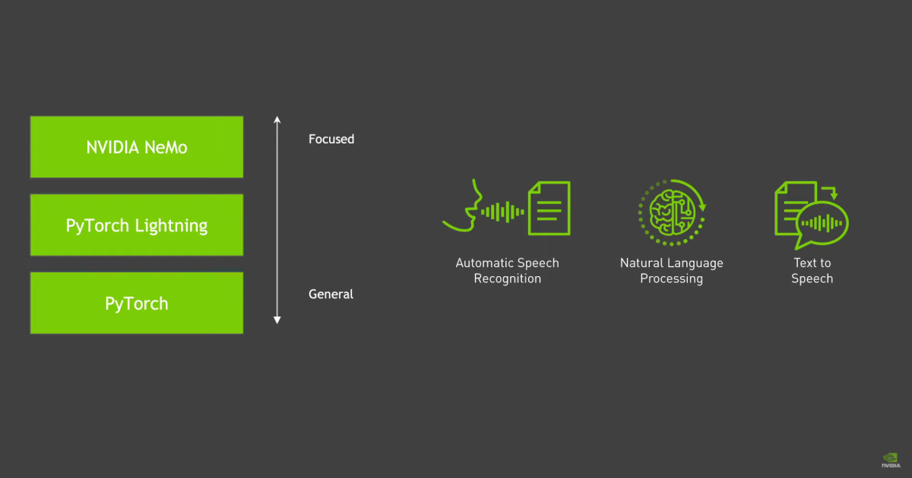

#! https://zhuanlan.zhihu.com/p/553265790
# NeMo简介



**NVIDIA NeMo** 是一个用于构建新的最先进的对话式 AI 模型的工具包。 NeMo 有自动语音识别 (ASR)、自然语言处理 (NLP) 和文本到语音 (TTS) 模型的单独集合。 每个集合都包含预构建的模块，其中包括训练数据所需的一切。 每个模块都可以轻松定制、扩展和组合，以创建新的对话式 AI 模型架构。

对话式 AI 架构通常很大，需要大量数据和计算来进行训练。 NeMo 使用 PyTorch Lightning 进行简单且高性能的多 GPU/多节点混合精度训练。

## 1.系统环境

在开始使用 NeMo 之前，假设您满足以下先决条件。

* 您有 Python 版本 3.6、3.7 或 3.8。

* 你有 Pytorch 版本 1.8.1。

* 您可以使用 NVIDIA GPU 进行训练。

## 2.快速开始

本 NeMo 快速入门指南是想要试用 NeMo 的用户的起点； 具体来说，本指南通过引导您完成示例音频翻译和语音交换，使用户能够快速开始使用 NeMo 基础知识。

如果您是 NeMo 新手，最好的入门方法是查看以下教程：

* [文本分类（情感分析）](https://github.com/NVIDIA/NeMo/blob/stable/tutorials/Text_Classification_Sentiment_Analysis) - 使用 NeMo NLP 集合演示文本分类模型。

* [NeMo Primer](https://github.com/NVIDIA/NeMo/blob/stable/tutorials/00_NeMo_Primer.ipynb) - 介绍 NeMo、PyTorch Lightning 和 OmegaConf，并展示如何使用、修改、保存和恢复 NeMo 模型。

* [NeMo 模型](https://github.com/NVIDIA/NeMo/blob/stable/tutorials/01_NeMo_Models.ipynb) - 解释了 NeMo 模型的基本概念。

*[ NeMo 语音交换演示](https://github.com/NVIDIA/NeMo/blob/stable/tutorials/NeMo_voice_swap_app.ipynb) - 演示如何将音频片段中的语音与使用 NeMo 生成的计算机交换语音。

下面我们是音频翻译应用程序的代码片段。
```Python
# Import NeMo and it's ASR, NLP and TTS collections
import nemo
# Import Speech Recognition collection
import nemo.collections.asr as nemo_asr
# Import Natural Language Processing colleciton
import nemo.collections.nlp as nemo_nlp
# Import Speech Synthesis collection
import nemo.collections.tts as nemo_tts

# Next, we instantiate all the necessary models directly from NVIDIA NGC
# Speech Recognition model - QuartzNet trained on Russian part of MCV 6.0
quartznet = nemo_asr.models.EncDecCTCModel.from_pretrained(model_name="stt_ru_quartznet15x5").cuda()
# Neural Machine Translation model
nmt_model = nemo_nlp.models.MTEncDecModel.from_pretrained(model_name='nmt_ru_en_transformer6x6').cuda()
# Spectrogram generator which takes text as an input and produces spectrogram
spectrogram_generator = nemo_tts.models.FastPitchModel.from_pretrained(model_name="tts_en_fastpitch").cuda()
# Vocoder model which takes spectrogram and produces actual audio
vocoder = nemo_tts.models.HifiGanModel.from_pretrained(model_name="tts_hifigan").cuda()
# Transcribe an audio file
# IMPORTANT: The audio must be mono with 16Khz sampling rate
# Get example from: https://nemo-public.s3.us-east-2.amazonaws.com/mcv-samples-ru/common_voice_ru_19034087.wav
russian_text = quartznet.transcribe(['Path_to_audio_file'])
print(russian_text)
# You should see russian text here. Let's translate it to English
english_text = nmt_model.translate(russian_text)
print(english_text)
# After this you should see English translation
# Let's convert it into audio
# A helper function which combines FastPitch and HiFiGAN to go directly from
# text to audio
def text_to_audio(text):
  parsed = spectrogram_generator.parse(text)
  spectrogram = spectrogram_generator.generate_spectrogram(tokens=parsed)
  audio = vocoder.convert_spectrogram_to_audio(spec=spectrogram)
  return audio.to('cpu').numpy()
audio = text_to_audio(english_text[0])
```

## 3.安装

### PIP安装
```Bash
apt-get update && apt-get install -y libsndfile1 ffmpeg
pip install Cython
pip install nemo_toolkit[all]
```
### Pip from source
```Bash
apt-get update && apt-get install -y libsndfile1 ffmpeg
pip install Cython
python -m pip install git+https://github.com/NVIDIA/NeMo.git@{BRANCH}#egg=nemo_toolkit[all]
# For v1.0.2, replace {BRANCH} with v1.0.2 like so:
# python -m pip install git+https://github.com/NVIDIA/NeMo.git@v1.0.2#egg=nemo_toolkit[all]

```

### 源代码安装

```Bash
apt-get update && apt-get install -y libsndfile1 ffmpeg
git clone https://github.com/NVIDIA/NeMo
cd NeMo
./reinstall.sh
```


### docker方式安装

```Bash
docker run --gpus all -it --rm -v <nemo_github_folder>:/NeMo --shm-size=8g \
-p 8888:8888 -p 6006:6006 --ulimit memlock=-1 --ulimit \
stack=67108864 --device=/dev/snd nvcr.io/nvidia/pytorch:21.08-py3
```


