# 最新CUDA环境配置(Win10 + CUDA 11.6 + VS2019)

本篇博客根据NVIDIA 官方文档所述, 并根据自己实践得出. 供各位需要的朋友参考.

## 1.前言
本篇文章的软件环境为:
* Windows 10
* CUDA 11.6
* VS2019

CUDA是目前做人工智能, 深度学习等方向的必备工具库. 由CUDA衍生出的加速工具很多, 如: cuDNN, TensorRT, cuBLAS等HPC加速库, 或者涉及最新的元宇宙概念中的Omniverse等.

在很多时候, 非常多的NVIDIA加速库的底层加速方案都是CUDA. 我们可能在绝大多数时候不会直接利用CUDA写代码, 但是了解CUDA如何运转或者基本概念一定能让你如虎添翼.

如果大家感兴趣也可以查看本人翻译的官方的CUDA编程手册,希望能帮到大家.
[https://blog.csdn.net/kunhe0512/category_11774233.html](https://blog.csdn.net/kunhe0512/category_11774233.html)

## 2.VS 2019

对于VS, 我用的其实极少. 本人从一开始就被老板带进了Vim + Makefile的环境. 这里简单提一下.

目前我用的是VS2019, 大家可以根据自己需要下载所需版本, 下面是链接地址. 
[https://visualstudio.microsoft.com/zh-hans/vs/](https://visualstudio.microsoft.com/zh-hans/vs/)

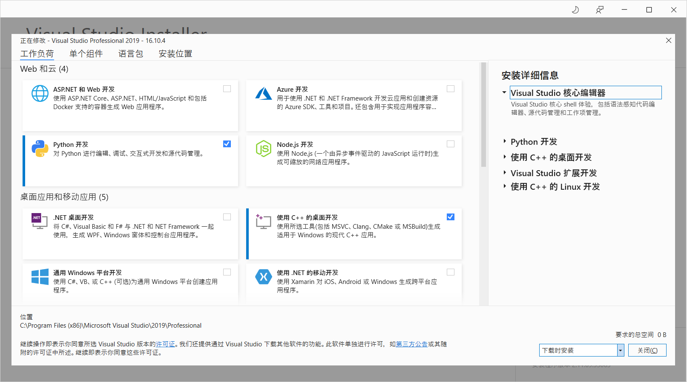

这里需要重点提的是, 尽量把使用C++的桌面开发选择上.后续在用CMake的时候会比较方便.

## 3.CUDA下载

**CUDA官方安装教程:** [https://docs.nvidia.com/cuda/cuda-installation-guide-microsoft-windows/index.html](https://docs.nvidia.com/cuda/cuda-installation-guide-microsoft-windows/index.html)

**CUDA Toolkit的下载:** [https://developer.nvidia.com/cuda-downloads](https://developer.nvidia.com/cuda-downloads)

点击上述下载页面之后, 你会看到:
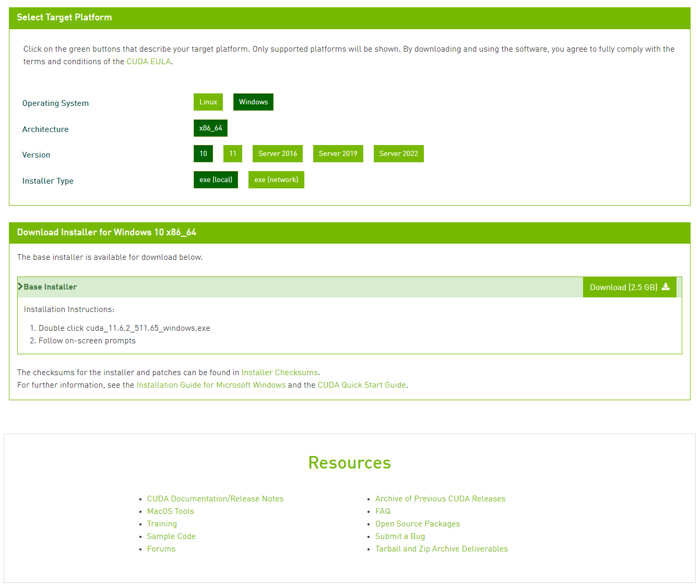

你需要自己选择你的操作系统, 系统架构, 系统版本 和 安装方式.

选择完成之后, 点击 **Download(2.5 GB)** 的按钮,就可以下载了.

当然, 如果你想安装历史版本(更早期的版本), 那么也可以点击下面的[Archive of Previous CUDA Releases](https://developer.nvidia.com/cuda-toolkit-archive)来下载, 操作方法同上.

下载好之后, 你就可以看到一下图标:

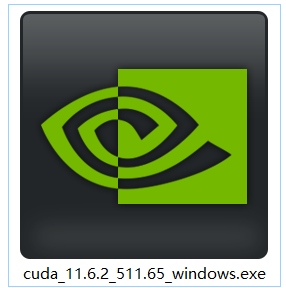

## 4.安装配置
双击你下载的CUDA Toolkit, 你就会看到工具包的解压路径(推荐默认).

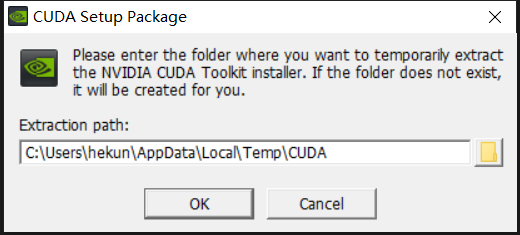

解压完毕之后, 就开始安装了, 接下来点击同意并继续:
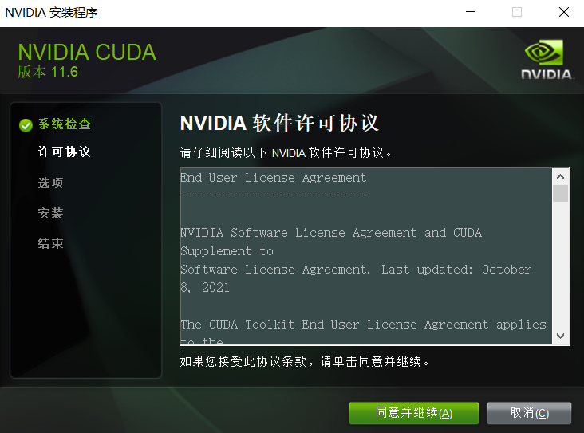

接下来设置安装选项, 这里推荐点击自定义(特别是第一次安装):

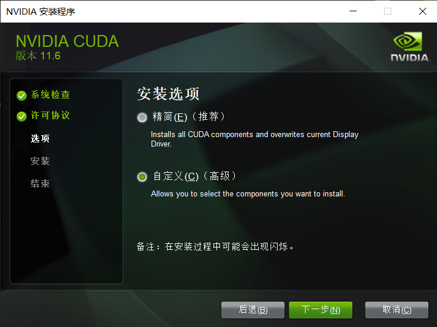

然后将能选的都选上, 很多东西可能你一开始用不上(比如nsight系统), 但是当你做的越来越多, 涉及的越来越深的时候就可能会用到.
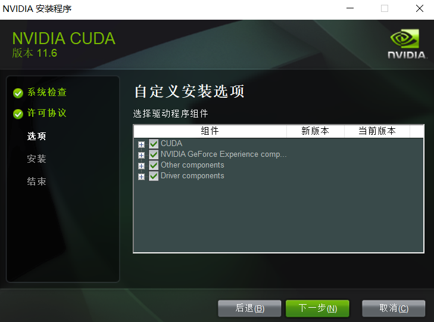

然后选择安装路径, 这里也推荐默认, 毕竟是底层的调用库

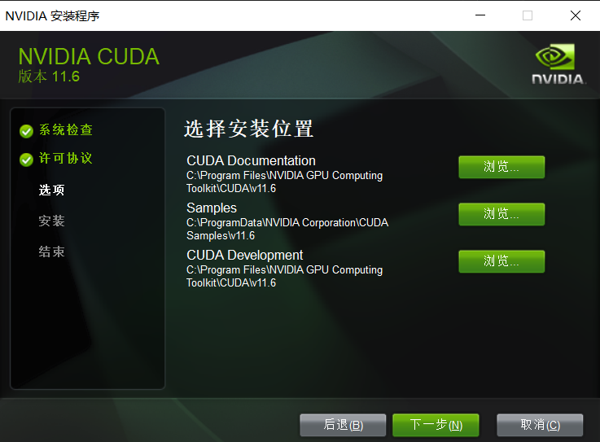


接下来就不用你在操作了, 直到CUDA Toolkit 安装完毕.

## 5.环境变量
右键点击我的电脑(此电脑) --> 属性 --> 高级系统设置 --> 环境变量, 查看CUDA路径是否已经在系统中, 如果没有记得添加上.

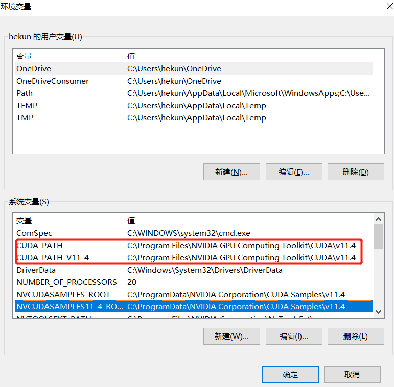

## 6.测试CUDA安装是否成功

利用(Win + R)-->cmd, 打开系统终端命令行, 输入
```
nvcc -V
```
如果你看到如下结果, 证明你的CUDA已经安装完毕.
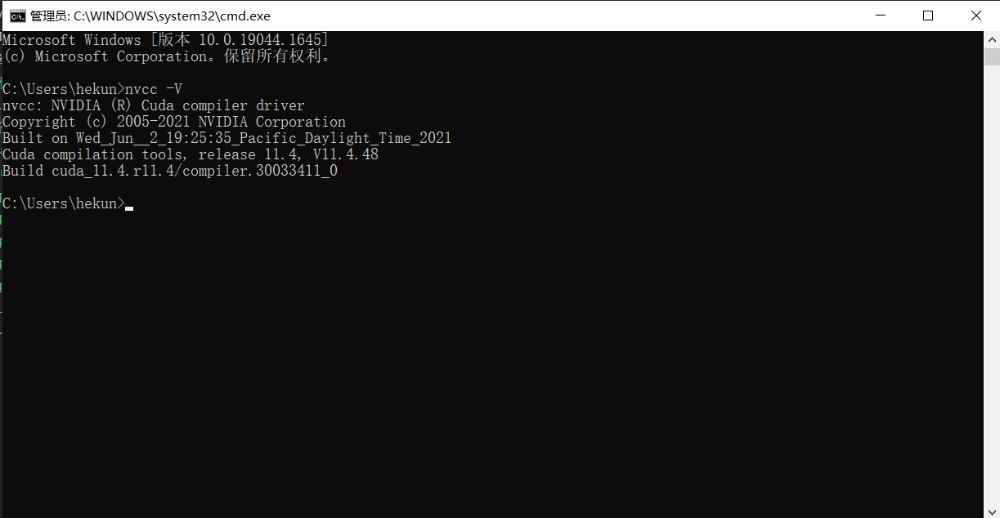

## 7.利用Visual Studio 2019 进行CUDA程序开发
打开已经安装好的VS 2019, 选择创建新项目:


选择CUDA 11.xx Runtime, 这里的xx代表你的版本.

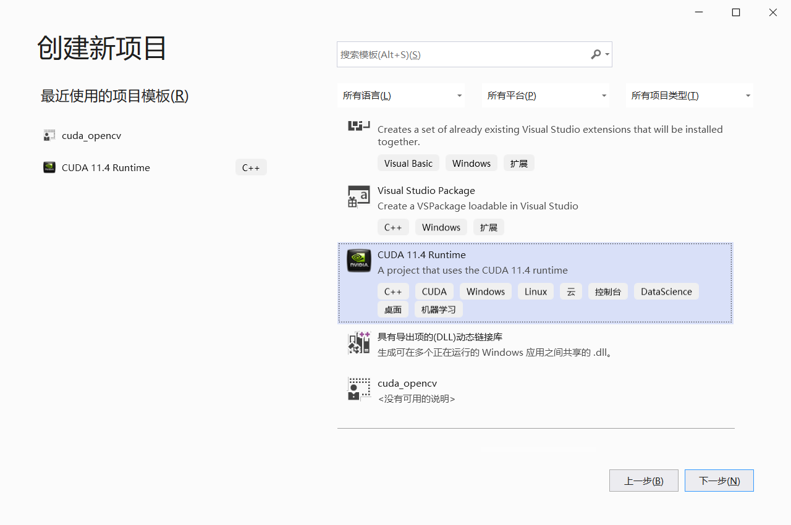

给你的CUDA程序起个名字: ***Matrix_transpose***
这里的名字随便起的, 因为我后面要写一个矩阵转置的示例,所以才用Matrix_transpose这个名字

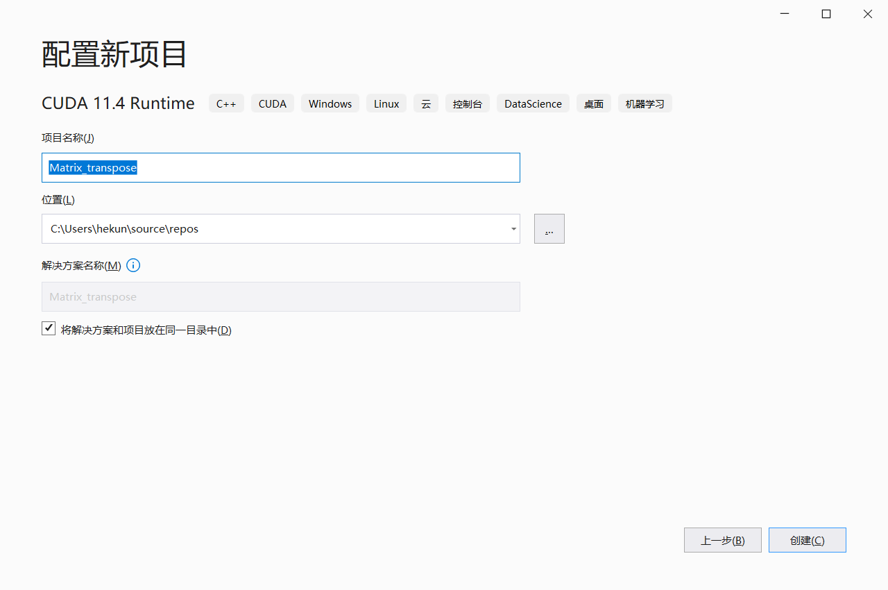

创建之后, 你会发现里面已经有了一些代码, 那个是向量相加的示例. 你不用管他, 把kernel.cu中的代码删掉, 就可以开始你自己的开发了.

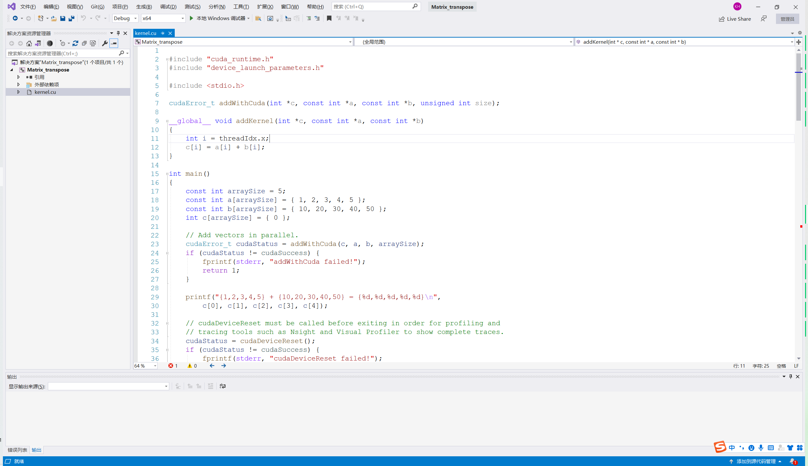


你可以尝试输入一下代码, 完成一个矩阵转置的实例:
```C++
#include <stdio.h>
#include <stdlib.h>
#include "error.cuh"

#define TILE_DIM 32   //Don't ask me why I don't set these two values to one
#define BLOCK_SIZE 32
#define N 3001 // for huanhuan, you know that!

__managed__ int input_M[N * N];      //input matrix & GPU result
int cpu_result[N * N];   //CPU result


//in-place matrix transpose
__global__ void ip_transpose(int* data)
{
    __shared__ int tile_s[TILE_DIM ][TILE_DIM + 1];
    __shared__ int tile_d[TILE_DIM ][TILE_DIM + 1];

    int x = blockIdx.x * TILE_DIM + threadIdx.x;
    int y = blockIdx.y * TILE_DIM + threadIdx.y;

    //Threads in the triangle below
    if (blockIdx.y > blockIdx.x) {
        int dx = blockIdx.y * TILE_DIM + threadIdx.x;
        int dy = blockIdx.x * TILE_DIM + threadIdx.y;
        if (x < N && y < N)
        {
            tile_s[threadIdx.y][threadIdx.x] = data[(y)*N + x];
        }
        if (dx < N && dy < N)
        {
            tile_d[threadIdx.y][threadIdx.x] = data[(dy)*N + dx];
        }

        __syncthreads();
        if (dx < N && dy < N)
        {
            data[(dy)*N + dx] = tile_s[threadIdx.x][threadIdx.y];
        }
        if (x < N && y < N)
        {
            data[(y)*N + x] = tile_d[threadIdx.x][threadIdx.y];
        }
    }
    else if (blockIdx.y == blockIdx.x)//Threads on the diagonal
    {
        if (x < N && y < N)
        {
            tile_s[threadIdx.y][threadIdx.x] = data[(y)*N + x];
        }
        __syncthreads();
        if (x < N && y < N)
        {
            data[(y)*N + x] = tile_s[threadIdx.x][threadIdx.y];
        }
    }
}

void cpu_transpose(int* A, int* B)
{
    for (int j = 0; j < N; j++)
    {
        for (int i = 0; i < N; i++)
        {
            B[i * N + j] = A[j * N + i];
        }
    }
}

int main(int argc, char const* argv[])
{

    cudaEvent_t start, stop_gpu;
    CHECK(cudaEventCreate(&start));
    CHECK(cudaEventCreate(&stop_gpu));


    for (int i = 0; i < N; ++i) {
        for (int j = 0; j < N; ++j) {
            input_M[i * N + j] = rand() % 1000;
        }
    }
    cpu_transpose(input_M, cpu_result);

    CHECK(cudaEventRecord(start));
    unsigned int grid_rows = (N + BLOCK_SIZE - 1) / BLOCK_SIZE;
    unsigned int grid_cols = (N + BLOCK_SIZE - 1) / BLOCK_SIZE;
    dim3 dimGrid(grid_cols, grid_rows);
    dim3 dimBlock(BLOCK_SIZE, BLOCK_SIZE);
    ip_transpose << <dimGrid, dimBlock >> > (input_M);
    CHECK(cudaDeviceSynchronize());
    CHECK(cudaEventRecord(stop_gpu));
    CHECK(cudaEventSynchronize(stop_gpu));

    float elapsed_time_gpu;
    CHECK(cudaEventElapsedTime(&elapsed_time_gpu, start, stop_gpu));
    printf("Time_GPU = %g ms.\n", elapsed_time_gpu);

    CHECK(cudaEventDestroy(start));
    CHECK(cudaEventDestroy(stop_gpu));

    int ok = 1;
    for (int i = 0; i < N; ++i)
    {
        for (int j = 0; j < N; ++j)
        {
            if (fabs(input_M[i * N + j] - cpu_result[i * N + j]) > (1.0e-10))
            {
                ok = 0;
            }
        }
    }


    if (ok)
    {
        printf("Pass!!!\n");
    }
    else
    {
        printf("Error!!!\n");
    }

    return 0;
}
```

点击运行之后, 你就可以看到如下结果:

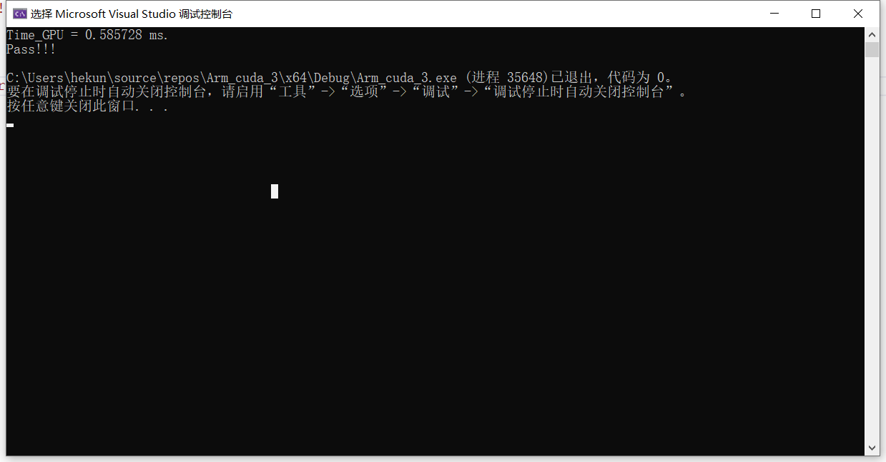

OK, 到这里你就完成了CUDA环境的搭建, 并且写了第一个CUDA程序
