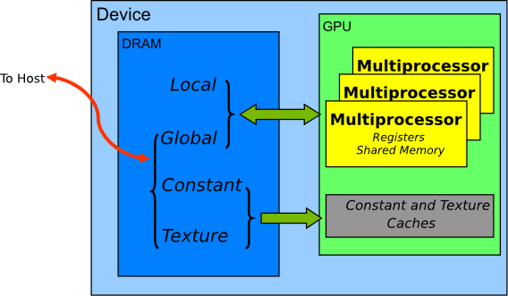

# CUDA_C优化详解

使用 CUDA 工具包从 NVIDIA GPU 获得最佳性能的编程指南。

## 前言

### 这篇文档干什么的?
本最佳实践指南是帮助开发人员从 NVIDIA® CUDA® GPU 获得最佳性能的手册。 它介绍了已建立的并行化和优化技术，并解释了可以大大简化支持 CUDA 的 GPU 架构的编程的编码方式和习惯。

虽然这些内容可以用作参考手册，但您应该知道，随着对各种编程和配置主题的探索，一些主题会在不同的上下文中重新讨论。 因此，建议初次阅读的读者按顺序阅读本指南。 这种方法将极大地提高您对有效编程实践的理解，并使您能够更好地使用该指南以供以后参考。

### 谁应该读这篇文章?
本指南中的讨论均使用 C++ 编程语言，因此您应该能够轻松阅读 C++ 代码。

本指南引用并依赖于您应该拥有的其他几个文档以供参考，所有这些文档都可以从 CUDA 网站 https://docs.nvidia.com/cuda/ 免费获得。 以下文件是特别重要的资源：

* CUDA 安装指南
* CUDA C++ 编程指南
* CUDA 工具包参考手册


特别是，本指南的优化部分假设您已经成功下载并安装了 CUDA Toolkit（如果没有，请参考您平台的相关 CUDA 安装指南），并且您对 CUDA C++ 编程语言有基本的了解 和环境（如果没有，请参阅 CUDA C++ 编程指南）。

### Assess, Parallelize, Optimize, Deploy
本指南介绍了应用程序的评估、并行、优化、部署 (APOD) 设计周期，旨在帮助应用程序开发人员快速识别最容易从 GPU 加速中受益的代码部分，快速实现该优势并开始利用 尽早加快生产速度。

APOD 是一个循环过程：只需最少的初始时间投资即可实现、测试和部署初始加速，此时可以通过识别进一步的优化机会、查看额外的加速，然后部署更快的版本来重新开始循环 应用到生产中。


#### 评估
对于现有项目，第一步是评估应用程序以找到负责大部分执行时间的代码部分。 有了这些知识，开发人员可以评估这些并行化瓶颈并开始研究 GPU 加速。

通过了解最终用户的要求和约束并应用 `Amdahl` 和 `Gustafson` 定律，开发人员可以根据应用程序的已识别部分的加速来确定性能改进的上限。

#### 并行
确定热点并完成设定目标和期望的基本练习后，开发人员需要并行化代码。 根据原始代码，这可以像调用现有的 GPU 优化库（例如 `cuBLAS`、`cuFFT` 或 `Thrust`）一样简单，也可以像添加一些预处理器指令作为并行编译器的提示一样简单。

另一方面，某些应用程序的设计将需要进行一些重构以暴露其固有的并行性。 由于即使是 CPU 架构也需要公开并行性以提高或简单地保持顺序应用程序的性能，所以 CUDA 系列并行编程语言（CUDA C++、CUDA Fortran 等）旨在使这种并行性的表达尽可能简单 ，同时在支持 CUDA 的 GPU 上进行操作，以实现最大并行吞吐量。

#### 优化
在每轮应用程序并行化完成后，开发人员可以着手优化实现以提高性能。由于可以考虑许多可能的优化，因此对应用程序的需求有很好的了解可以帮助使过程尽可能顺利。但是，与整个 APOD 一样，程序优化是一个迭代过程（确定优化机会，应用和测试优化，验证实现的加速，然后重复），这意味着程序员不需要花费大量资金在看到良好的加速之前记住大部分所有可能的优化策略的时间。相反，可以在学习时逐步应用策略。

优化可以应用于各个级别，从与计算重叠的数据传输一直到微调浮点运算序列。可用的分析工具对于指导此过程非常宝贵，因为它们可以帮助为开发人员的优化工作建议下一个最佳行动方案，并提供对本指南优化部分相关部分的参考。


#### 部署

完成应用程序的一个或多个组件的 GPU 加速后，可以将结果与原始预期进行比较。 回想一下，最初的评估步骤允许开发人员确定通过加速给定关键点可实现的潜在加速的上限。

在解决其他关键点以提高整体速度之前，开发人员应该考虑采用部分并行化的实现，并将其应用到生产中。这一点很重要，原因有很多;例如，它允许用户尽早从他们的投资中获利(加速可能是部分的，但仍然是有价值的)，并且通过向应用程序提供一组渐进的而不是革命性的更改，它将开发人员和用户的风险最小化。

### Recommendations and Best Practices
在本指南中，针对 CUDA C++ 代码的设计和实现提出了具体建议。这些建议按优先级分类，优先级是建议的效果及其范围的混合。对大多数 CUDA 应用程序进行重大改进的操作具有最高优先级，而仅影响非常特定情况的小型优化则具有较低优先级。

在实施较低优先级的建议之前，最好确保已应用所有相关的较高优先级建议。这种方法往往会为投入的时间提供最佳结果，并避免过早优化的陷阱。

确定优先级的利益标准和范围将根据计划的性质而有所不同。在本指南中，它们代表了一个典型案例。您的代码可能会反映不同的优先级因素。不管这种可能性如何，在执行较低优先级的项目之前，最好确认没有忽略较高优先级的建议。

#### 注意：为了简洁起见，整个指南中的代码示例省略了错误检查。但是，生产代码应该系统地检查每个 API 调用返回的错误代码，并通过调用 cudaGetLastError() 检查内核启动中的故障。

## 1.评估你的应用

从超级计算机到手机，现代处理器越来越依赖并行性来提供性能。 核心计算单元，包括控制、算术、寄存器和通常一些缓存，被复制一定次数并通过网络连接到内存。 因此，所有现代处理器都需要并行代码才能充分利用其计算能力。

虽然处理器正在向程序员提供更细粒度的并行性，但许多现有应用程序已经发展为串行代码或粗粒度并行代码（例如，数据被分解为并行处理的区域，子区域, 使用 MPI 共享）。 为了从包括 GPU 在内的任何现代处理器架构中获益，第一步是评估应用程序以识别关键点，确定它们是否可以并行化，并了解现在和未来的相关工作负载。

## 2.异构计算
CUDA 编程涉及同时在两个不同的平台上运行代码：具有一个或多个 CPU 的主机系统和一个或多个支持 CUDA 的 NVIDIA GPU 设备。

虽然 NVIDIA GPU 经常与图形相关联，但它们也是强大的算术引擎，能够并行运行数千个轻量级线程。 这种能力使它们非常适合可以利用并行执行的计算。

但是，该设备基于与主机系统截然不同的设计，因此了解这些差异以及它们如何确定 CUDA 应用程序的性能以有效地使用 CUDA 非常重要。

### 2.1 主机和设备的不同

主要区别在于线程模型和单独的物理内存：

* **线程资源**
  
    主机系统上的执行管道可以支持有限数量的并发线程。例如，具有两个 32 核处理器的服务器只能同时运行 64 个线程（如果 CPU 支持同时多线程，则可以运行少量线程）。相比之下，CUDA 设备上最小的可执行并行单元包含 32 个线程（称为线程束）。现代 NVIDIA GPU 最多可以支持每个多处理器同时运行 2048 个活动线程（请参阅 CUDA C++ 编程指南的特性和规范）在具有 80 个多处理器的 GPU 上，这会导致超过 160,000 个并发活动线程。

* **线程**
    CPU 上的线程通常是重量级实体。操作系统必须在 CPU 执行通道上交换线程以提供多线程能力。上下文切换（当交换两个线程时）因此缓慢且昂贵。相比之下，GPU 上的线程非常轻量级。在一个典型的系统中，数千个线程排队等待工作（每个线程束有 32 个线程）。如果 GPU 必须等待一个线程束，它只会开始在另一个线程上执行工作。因为单独的寄存器分配给所有活动线程，所以在 GPU 线程之间切换时不需要发生寄存器交换或其他状态。资源一直分配给每个线程，直到它完成执行。简而言之，CPU 内核旨在将每个线程的延迟最小化，而 GPU 旨在处理大量并发的轻量级线程，以最大限度地提高吞吐量。

* 内存
    主机系统和设备都有各自不同的附加[物理内存](https://docs.nvidia.com/cuda/cuda-c-best-practices-guide/index.html#fntarg_1). 由于主机和设备内存是分开的，主机内存中的项目有时必须在设备内存和主机内存之间进行通信，如在[启用 CUDA 时运行的内容](https://docs.nvidia.com/cuda/cuda-c-best-practices-guide/index.html#what-runs-on-cuda-enabled-device)中所述设备。

这些是 CPU 主机和 GPU 设备在并行编程方面的主要硬件差异。其他差异将在本文档其他地方出现时进行讨论。考虑到这些差异的应用程序可以将主机和设备一起视为一个有凝聚力的异构系统，其中每个处理单元都被利用来完成它最擅长的工作：主机上的顺序工作和设备上的并行工作。

### 2.2 GPU设备上运行了什么?
在确定要在设备上运行应用程序的哪些部分时，应考虑以下问题：

* 该设备非常适用于可以同时在多个数据元素上并行运行的计算。这通常涉及大型数据集（例如矩阵）的算术运算，其中可以同时在数千个（如果不是数百万个）元素上执行相同的操作。这是在 CUDA 上获得良好性能的要求：软件必须使用大量（通常为数千或数万）并发线程。对并行运行大量线程的支持源于 CUDA 使用上述轻量级线程模型。
  
* 要使用 CUDA，数据值必须从主机传输到设备。这些传输在性能方面代价高昂，应尽量减少。 （请参阅[主机和设备之间的数据传输](https://docs.nvidia.com/cuda/cuda-c-best-practices-guide/index.html#data-transfer-between-host-and-device)。）这种成本有几个后果：
    * 操作的复杂性应该证明将数据移入和移出设备的成本是合理的。传输数据以供少数线程短暂使用的代码将看到很少或没有性能优势。理想的场景是许多线程执行大量工作的场景。    
    例如，将两个矩阵传输到设备以执行矩阵加法，然后将结果传输回主机不会实现太多的性能优势。这里的问题是每个传输的数据元素执行的操作数。对于前面的过程，假设矩阵大小为 NxN，有 N$^2$ 个操作（加法）和 3N$^2$ 个元素转移，因此运算与转移元素的比例为 1:3 或 O(1)。当这个比率越高时，性能优势就越容易实现。例如，相同矩阵的矩阵乘法需要 N$^3$ 次运算（乘加），因此运算与传递的元素的比率为 O(N)，在这种情况下，矩阵越大，性能优势就越大。运算的类型是一个额外的因素，因为加法具有与三角函数不同的复杂度曲线。在确定操作应该在主机上还是在设备上执行时，将数据传入和传出设备的开销包括在内是很重要的。
    * 数据应尽可能长时间地保存在设备上。因为传输应该被最小化，在同一数据上运行多个内核的程序应该倾向于在内核调用之间将数据留在设备上，而不是将中间结果传输到主机，然后将它们发送回设备进行后续计算。因此，在前面的示例中，如果要添加的两个矩阵作为先前计算的结果已经存在于设备上，或者如果相加的结果将用于后续计算，则应该在本地执行矩阵相加装置。即使可以在主机上更快地执行一系列计算中的一个步骤，也应该使用这种方法。如果它避免主机和设备内存之间的一次或多次传输，即使是相对较慢的内核也可能是有利的。主机和设备之间的数据传输提供了更多详细信息，包括主机和设备之间的带宽测量以及设备本身内的带宽测量。
* 为了获得最佳性能，设备上运行的相邻线程的内存访问应该有一些一致性。某些内存访问模式使硬件能够将多个数据项的读取或写入组合并到一个操作中。无法布局以启用合并的数据，或者没有足够的局部性来有效使用 L1 或纹理缓存的数据，在用于 GPU 上的计算时往往会看到较小的加速。一个值得注意的例外是完全随机的内存访问模式。一般来说，应该避免它们，因为与峰值能力相比，任何架构都以低效率处理这些内存访问模式。然而，与基于缓存的架构（如 CPU）相比，延迟隐藏架构（如 GPU）倾向于更好地应对完全随机的内存访问模式。


## 3.应用分析

### 3.1 分析

许多代码用相对较少的代码完成了大部分工作。 使用分析器，开发人员可以识别此类关键点并开始编译并行化候选列表。

#### 3.1.1 创建分析文件

有许多可能的方法来分析代码，但在所有情况下，目标都是相同的：识别应用程序花费大部分执行时间的一个或多个函数。

**注意：高优先级：为了最大限度地提高开发人员的工作效率，请分析应用程序以确定关键点和瓶颈。**

任何分析活动的最重要考虑因素是确保工作负载是现实的——即从测试中获得的信息和基于该信息的决策与真实数据相关。 使用不切实际的工作负载会导致开发人员针对不切实际的问题规模进行优化，并导致开发人员专注于错误的功能，从而导致次优结果和浪费精力。

有许多工具可用于生成配置文件。 以下示例基于 gprof，它是来自 GNU Binutils 集合的 Linux 平台的开源分析器。

```
$ gcc -O2 -g -pg myprog.c
$ gprof ./a.out > profile.txt
Each sample counts as 0.01 seconds.
  %   cumulative   self              self     total           
 time   seconds   seconds    calls  ms/call  ms/call  name    
 33.34      0.02     0.02     7208     0.00     0.00  genTimeStep
 16.67      0.03     0.01      240     0.04     0.12  calcStats
 16.67      0.04     0.01        8     1.25     1.25  calcSummaryData
 16.67      0.05     0.01        7     1.43     1.43  write
 16.67      0.06     0.01                             mcount
  0.00      0.06     0.00      236     0.00     0.00  tzset
  0.00      0.06     0.00      192     0.00     0.00  tolower
  0.00      0.06     0.00       47     0.00     0.00  strlen
  0.00      0.06     0.00       45     0.00     0.00  strchr
  0.00      0.06     0.00        1     0.00    50.00  main
  0.00      0.06     0.00        1     0.00     0.00  memcpy
  0.00      0.06     0.00        1     0.00    10.11  print
  0.00      0.06     0.00        1     0.00     0.00  profil
  0.00      0.06     0.00        1     0.00    50.00  report
```

### 3.1.2 Identifying Hotspots
在上面的示例中，我们可以清楚地看到函数 `genTimeStep()` 占用了应用程序总运行时间的三分之一。 这应该是我们第一个并行化的候选函数。 [Understanding Scaling](https://docs.nvidia.com/cuda/cuda-c-best-practices-guide/index.html#understanding-scaling) 讨论了我们可能期望从这种并行化中获得的潜在好处。

值得注意的是，上面示例中的其他几个函数也占用了整个运行时间的很大一部分，例如 `calcStats()` 和 `calcSummaryData()`。 并行化这些功能也应该增加我们的加速潜力。 然而，由于 APOD 是一个循环过程，我们可能会选择在后续的 APOD pass 中并行化这些功能，从而将我们在任何给定 pass 中的工作范围限制为一组较小的增量更改。

#### 3.1.3. Understanding Scaling
应用程序通过在 CUDA 上运行将实现的性能优势完全取决于它可以并行化的程度。 不能充分并行化的代码应该在主机上运行，除非这样做会导致主机和设备之间的过度传输。

**注意：高优先级：要从 CUDA 中获得最大收益，首先要关注寻找并行化顺序代码的方法。**

通过了解应用程序如何扩展，可以设定期望并计划增量并行化策略。 [Strong Scaling and Amdahl's Law](https://docs.nvidia.com/cuda/cuda-c-best-practices-guide/index.html#strong-scaling-and-amdahls-law)描述了强缩放，它允许我们为固定问题大小的加速设置上限。 [Weak Scaling and Gustafson's Law](https://docs.nvidia.com/cuda/cuda-c-best-practices-guide/index.html#weak-scaling-and-gustafsons-law)描述了弱缩放，通过增加问题规模来实现加速。 在许多应用中，强和弱缩放的组合是可取的。

##### 3.1.3.1. Strong Scaling and Amdahl's Law

强伸缩性度量的是，对于固定的总体问题大小，随着向系统中添加更多处理器，解决问题所需的时间如何减少。表现出强线性伸缩性的应用程序具有与所使用的处理器数量相等的加速。

强伸缩性通常等同于Amdahl定律，它指定了串行程序的部分并行化所能期望的最大加速。本质上，它声明了一个程序的最大加速S为:

$S = \dfrac{1}{(1-P) + \dfrac{P}{N}}$

这里 P 是可以并行化的代码部分所花费的总串行执行时间的分数，N 是代码的并行部分运行的处理器数量。

N越大（即处理器数量越多），$P/N$分数越小。将 N 视为一个非常大的数字可能更简单，这实际上将方程转换为 $S=1/(1-P)$。现在，如果顺序程序的运行时间的 3/4 是并行化的，则串行代码的最大加速为 $1 / (1 - 3/4) = 4$。

实际上，大多数应用程序并没有表现出完美的线性强伸缩性，即使它们确实表现出某种程度的强伸缩性。对于大多数目的，关键点是可并行化部分 P 越大，潜在的加速就越大。相反，如果 P 是一个很小的数字（意味着应用程序基本上不可并行化），则增加处理器的数量 N 对提高性能几乎没有影响。因此，为了在固定问题规模下获得最大的加速，值得花精力增加 P，最大化可以并行化的代码量。

##### 3.1.3.2. Weak Scaling and Gustafson's Law

弱伸缩性是衡量随着更多处理器添加到每个处理器的固定问题大小的系统中，求解时间如何变化的度量； 即，随着处理器数量的增加，整体问题的大小也会增加。

弱伸缩性通常等同于古斯塔夫森定律，该定律指出，在实践中，问题的大小与处理器的数量成比例。 因此，程序的最大加速比 S 为：

$S=N+(1−P)(1−N)$

这里 P 是可以并行化的代码部分所花费的总串行执行时间的分数，N 是代码的并行部分运行的处理器数量。

另一种看待古斯塔夫森定律的方式是，当我们扩大系统规模时，保持不变的不是问题大小，而是执行时间。 请注意，古斯塔夫森定律假设串行执行与并行执行的比率保持不变，这反映了设置和处理更大问题的额外成本。

##### 3.1.3.3. Applying Strong and Weak Scaling
了解哪种类型的缩放最适用于应用程序是估计加速的重要部分。 对于某些应用程序，问题大小将保持不变，因此仅适用于强缩放。 一个例子是模拟两个分子如何相互作用，其中分子大小是固定的。

对于其他应用程序，问题大小将增长到填满可用的处理器。 示例包括将流体或结构建模为网格或网格以及一些蒙特卡罗模拟，其中增加问题规模可提高准确性。

了解了应用程序配置文件后，开发人员应该了解如果计算性能发生变化，问题大小将如何变化，然后应用 Amdahl 或 Gustafson 定律来确定加速的上限。

## 4.并行化你的应用

确定关键点并完成设定目标和期望的基本练习后，开发人员需要并行化代码。 根据原始代码，这可以像调用现有的 GPU 优化库（例如 cuBLAS、cuFFT 或 Thrust）一样简单，也可以像添加一些预处理器指令作为并行编译器的提示一样简单。

另一方面，某些应用程序的设计将需要进行一些重构以暴露其固有的并行性。 由于即使是 CPU 架构也需要公开这种并行性以提高或简单地保持顺序应用程序的性能，所以 CUDA 系列并行编程语言（CUDA C++、CUDA Fortran 等）旨在使这种并行性的表达尽可能简单 ，同时在支持 CUDA 的 GPU 上进行操作，以实现最大并行吞吐量。

## 5.开始!

并行化顺序代码有几种关键策略。 虽然如何将这些策略应用于特定应用程序的细节是一个复杂且特定于问题的主题，但无论我们是并行化代码以在多核 CPU 上运行还是在 CUDA GPU 上使用，这里列出的一般主题都适用。

### 5.1. Parallel Libraries
并行化应用程序最直接的方法是利用现有的库，这些库代表我们利用并行架构。 CUDA Toolkit 包含许多此类库，这些库已针对 NVIDIA CUDA GPU 进行了微调，例如 cuBLAS、cuFFT 等。

这里的关键是，当库与应用程序的需求很好地匹配时，它们是最有用的。例如，已经使用其他 BLAS 库的应用程序通常可以很容易地切换到 cuBLAS，而很少或没有线性代数的应用程序将很少使用 cuBLAS。其他 CUDA Toolkit 库也是如此：cuFFT 的接口类似于 FFTW 等。

另外值得注意的是 Thrust 库，它是一个类似于 C++ 标准模板库的并行 C++ 模板库。 Thrust 提供了丰富的数据并行原语集合，例如扫描、排序和归约，它们可以组合在一起，以简洁易读的源代码实现复杂的算法。通过根据这些高级抽象来描述您的计算，您可以为 Thrust 提供自动选择最有效实现的自由。因此，Thrust 可用于 CUDA 应用程序的快速原型设计，其中程序员的生产力最为重要，也可用于生产中，其中稳健性和绝对性能至关重要。

### 5.2. Parallelizing Compilers

顺序代码并行化的另一种常见方法是使用并行化编译器。 这通常意味着使用基于指令的方法，程序员使用编译指示或其他类似符号向编译器提供关于在何处可以找到并行性的提示，而无需修改或调整底层代码本身。 通过向编译器公开并行性，指令允许编译器完成将计算映射到并行架构的详细工作。

OpenACC 标准提供了一组编译器指令，用于指定标准 C、C++ 和 Fortran 中的循环和代码区域，这些循环和区域应从主机 CPU 卸载到连接的加速器，例如 CUDA GPU。 管理加速器设备的细节由支持 OpenACC 的编译器和运行时隐式处理。

有关详细信息，请参见 http://www.openacc.org/。


### 5.3. Coding to Expose Parallelism
对于需要超出现有并行库或并行化编译器所能提供的附加功能或性能的应用程序，与现有顺序代码无缝集成的并行编程语言（例如 CUDA C++）至关重要。

一旦我们在应用程序的配置文件评估中找到了一个关键点并确定自定义代码是最佳方法，我们就可以使用 CUDA C++ 将我们代码的该部分中的并行性公开为 CUDA 内核。然后我们可以将该内核启动到 GPU 上并检索结果，而无需对应用程序的其余部分进行重大重写。

当我们的应用程序的大部分总运行时间花在代码的几个相对隔离的部分时，这种方法最直接。更难并行化的是具有非常扁平化配置文件的应用程序 - 即，所花费的时间相对均匀地分布在代码库的很大一部分中的应用程序。对于后一种应用程序，可能需要进行某种程度的代码重构以暴露应用程序中固有的并行性，但请记住，这种重构工作将有利于所有未来的架构，包括 CPU 和 GPU，因此非常值得必要时作出努力。

## 6. 得到正确的答案

获得正确答案显然是所有计算的主要目标。 在并行系统上，可能会遇到传统的面向串行编程中通常不会遇到的困难。 其中包括线程问题、由于计算浮点值的方式导致的意外值，以及由于 CPU 和 GPU 处理器操作方式的差异而带来的挑战。 本章检查可能影响返回数据正确性的问题并指出适当的解决方案。

### 6.1. Verification

#### 6.1.1. Reference Comparison
对任何现有程序进行修改的正确性验证的一个关键方面是建立某种机制，从而可以将来自代表性输入的先前已知良好的参考输出与新结果进行比较。进行每次更改后，使用适用于特定算法的任何标准确保结果匹配。有些人会期望按位相同的结果，这并不总是可能的，尤其是在涉及浮点运算的情况下；有关数值精度，请参阅[数值精度和精度](https://docs.nvidia.com/cuda/cuda-c-best-practices-guide/index.html#numerical-accuracy-and-precision)。对于其他算法，如果它们与某个小 epsilon 内的引用匹配，则可以认为实现是正确的。

请注意，用于验证数值结果的过程也可以很容易地扩展到验证性能结果。我们希望确保我们所做的每项更改都是正确的，并且可以提高性能（以及提高多少）。作为我们循环 APOD 流程的一个组成部分，经常检查这些事情将有助于确保我们尽快达到预期的结果。

#### 6.1.2. Unit Testing

上述参考比较的一个有用对应物是以易于在单元级别验证的方式构建代码本身。例如，我们可以将我们的 CUDA 内核编写为许多短的 `__device__` 函数的集合，而不是一个大型的单片 `__global__` 函数；在将它们全部连接在一起之前，可以独立测试每个设备功能。

例如，许多内核除了实际计算外，还具有用于访问内存的复杂寻址逻辑。如果我们在引入大量计算之前分别验证我们的寻址逻辑，那么这将简化以后的调试工作。 （请注意，CUDA 编译器将任何对写入全局内存没有贡献的设备代码视为需要消除的死代码，因此我们必须至少根据我们的寻址逻辑将某些内容写入全局内存才能成功应用这个策略。）

更进一步，如果大多数函数被定义为 `__host____device__` 而不仅仅是 `__device__` 函数，那么这些函数可以在 CPU 和 GPU 上进行测试，从而增加我们对函数正确并且不会有任何意外差异的信心在结果中。如果存在差异，那么这些差异将及早看到，并且可以在简单函数的上下文中理解。

作为一个有用的副作用，如果我们希望在我们的应用程序中同时包含 CPU 和 GPU 执行路径，这个策略将允许我们减少代码重复：如果我们的 CUDA 内核的大部分工作是在 `__host____device__` 函数中完成的，我们可以轻松地从主机代码和设备代码调用这些函数，而无需重复。

### 6.2. Debugging
CUDA-GDB 是在 Linux 和 Mac 上运行的 GNU 调试器的一个端口； 请参阅：https://developer.nvidia.com/cuda-gdb。

适用于 Microsoft Windows 7、Windows HPC Server 2008、Windows 8.1 和 Windows 10 的 `NVIDIA Nsight Visual Studio` 版可作为 Microsoft Visual Studio 的免费插件提供； 请参阅：https://developer.nvidia.com/nsight-visual-studio-edition。

一些第三方调试器也支持 CUDA 调试； 有关详细信息，请参阅：https://developer.nvidia.com/debugging-solutions。

### 6.3. Numerical Accuracy and Precision

不正确或意外的结果主要是由于浮点值的计算和存储方式导致的浮点精度问题。 以下部分解释了感兴趣的主要项目。 浮点运算的其他特性在 CUDA C++ 编程指南的特性和技术规范以及白皮书和随附的关于浮点精度和性能的网络研讨会中介绍，可从下面地址中查看  
 [https://developer.nvidia.com/content/precision-performance-floating-point-and-ieee-754-compliance-nvidia-gpus.](https://developer.nvidia.com/content/precision-performance-floating-point-and-ieee-754-compliance-nvidia-gpus.)


#### 6.3.1. Single vs. Double Precision

[计算能力](https://docs.nvidia.com/cuda/cuda-c-best-practices-guide/index.html#cuda-compute-capability) 1.3 及更高版本的设备为双精度浮点值（即 64 位宽的值）提供本机支持。 使用双精度算术获得的结果经常与通过单精度算术执行的相同运算不同，因为前者的精度更高并且由于舍入问题。 因此，重要的是要确保比较具有相似精度的值并在一定的公差范围内表达结果，而不是期望它们是精确的。

#### 6.3.2. Floating Point Math Is not Associative

每个浮点算术运算都涉及一定量的舍入。 因此，执行算术运算的顺序很重要。 如果 A、B 和 C 是浮点值，则 (A+B)+C 不能保证等于数学中的 A+(B+C)。 当您并行化计算时，您可能会更改操作顺序，因此并行结果可能与顺序结果不匹配。 此限制并非特定于 CUDA，而是浮点值并行计算的固有部分。

#### 6.3.3. IEEE 754 Compliance
所有 CUDA 计算设备都遵循二进制浮点表示的 IEEE 754 标准，但有一些小例外。 这些异常（在 CUDA C++ 编程指南的特性和技术规范中有详细说明）可能导致与主机系统上计算的 IEEE 754 值不同的结果。

主要区别之一是融合乘加 (FMA) 指令，它将乘加操作组合到单个指令执行中。 它的结果通常与分别执行这两个操作所获得的结果略有不同。

#### 6.3.4. x86 80-bit Computations
x86 处理器在执行浮点计算时可以使用 80 位双扩展精度数学方法。 这些计算的结果经常不同于在 CUDA 设备上执行的纯 64 位操作。 要在值之间获得更紧密的匹配，请将 x86 主机处理器设置为使用常规双精度或单精度（分别为 64 位和 32 位）。 这是通过 FLDCW x86 汇编指令或等效的操作系统 API 完成的。

## 7.优化CUDA应用

在每轮应用程序并行化完成后，开发人员可以着手优化实现以提高性能。由于可以考虑许多可能的优化，因此对应用程序的需求有很好的了解可以帮助使过程尽可能顺利。但是，与整个 APOD 一样，程序优化是一个迭代过程（确定优化机会，应用和测试优化，验证实现的加速，然后重复），这意味着程序员不需要花费大量资金在看到良好的加速之前记住大部分所有可能的优化策略的时间。相反，可以在学习时逐步应用策略。

优化可以应用于各个级别，从与计算重叠的数据传输一直到微调浮点运算序列。可用的分析工具对于指导此过程非常宝贵，因为它们可以帮助为开发人员的优化工作建议下一个最佳行动方案，并提供对本指南优化部分相关部分的参考。

## 8.性能指标
在尝试优化 CUDA 代码时，了解如何准确测量性能并了解带宽在性能测量中所起的作用是值得的。 本章讨论如何使用 CPU 计时器和 CUDA 事件正确测量性能。 然后，它探讨了带宽如何影响性能指标以及如何减轻它带来的一些挑战。

### 8.1. Timing
CUDA 调用和内核执行可以使用 CPU 或 GPU 计时器进行计时。 本节检查这两种方法的功能、优势和缺陷。

#### 8.1.1. Using CPU Timers

任何 CPU 计时器都可用于测量 CUDA 调用或内核执行的经过时间。各种 CPU 计时方法的详细信息超出了本文档的范围，但开发人员应始终了解他们的计时调用提供的精度。

使用 CPU 计时器时，务必记住许多 CUDA API 函数是异步的。也就是说，它们在完成工作之前将控制权返回给调用 CPU 线程。所有内核启动都是异步的，名称上带有 `Async` 后缀的内存复制函数也是如此。因此，要准确测量特定调用或 CUDA 调用序列的经过时间，有必要在启动和停止 CPU 计时器之前立即调用 `cudaDeviceSynchronize()` 使 CPU 线程与 GPU 同步。 `cudaDeviceSynchronize()` 会阻塞调用 CPU 线程，直到该线程先前发出的所有 CUDA 调用都完成。

尽管也可以将 CPU 线程与 GPU 上的特定流或事件同步，但这些同步功能不适用于默认流以外的流中的时序代码。 `cudaStreamSynchronize()` 会阻塞 CPU 线程，直到之前向给定流发出的所有 CUDA 调用都已完成。 `cudaEventSynchronize()` 阻塞，直到 GPU 记录了特定流中的给定事件。由于驱动程序可能会交错执行来自其他非默认流的 CUDA 调用，因此其他流中的调用可能包含在计时中。

因为默认流，流 0，展示了设备上工作的序列化行为（默认流中的操作只能在任何流中的所有先前调用都完成后开始；并且任何流中的后续操作在完成之前都不能开始），这些函数可以可靠地用于默认流中的计时。

请注意，本节中提到的 CPU 到 GPU 同步点意味着 GPU 处理管道中的停顿，因此应谨慎使用以尽量减少它们对性能的影响。

#### 8.1.2. Using CUDA GPU Timers
CUDA 事件 API 提供创建和销毁事件、记录事件（包括时间戳）以及将时间戳差异转换为以毫秒为单位的浮点值的调用。 [How to time code using CUDA events](https://docs.nvidia.com/cuda/cuda-c-best-practices-guide/index.html#using-cuda-gpu-timers__how-to-time-code-using-cuda-events) 说明了它们的用途。

如何使用 CUDA 事件进行时间编码
```C++
cudaEvent_t start, stop;
float time;

cudaEventCreate(&start);
cudaEventCreate(&stop);

cudaEventRecord( start, 0 );
kernel<<<grid,threads>>> ( d_odata, d_idata, size_x, size_y, 
                           NUM_REPS);
cudaEventRecord( stop, 0 );
cudaEventSynchronize( stop );

cudaEventElapsedTime( &time, start, stop );
cudaEventDestroy( start );
cudaEventDestroy( stop );
```

这里 `cudaEventRecord()` 用于将开始和停止事件放入默认流，流 0。设备将在流中到达该事件时记录事件的时间戳。 `cudaEventElapsedTime()` 函数返回记录开始和停止事件之间经过的时间。 该值以毫秒为单位，分辨率约为半微秒。 与此清单中的其他调用一样，它们的具体操作、参数和返回值在 CUDA 工具包参考手册中进行了描述。 请注意，时序是在 GPU 时钟上测量的，因此时序分辨率与操作系统无关。

### 8.2. Bandwidth

带宽——数据传输的速率——是影响性能的最重要的因素之一。 几乎所有对代码的更改都应该在它们如何影响带宽的背景下进行。 如本指南的[内存优化](https://docs.nvidia.com/cuda/cuda-c-best-practices-guide/index.html#memory-optimizations)中所述，带宽会受到存储数据的内存选择、数据的布局方式和访问顺序以及其他因素的显着影响。

为了准确测量性能，计算理论带宽和有效带宽很有用。 当后者远低于前者时，设计或实现细节很可能会降低带宽，增加带宽应该是后续优化工作的首要目标。

**注意：高优先级：在衡量性能和优化收益时，使用计算的有效带宽作为指标。**

#### 8.2.1. Theoretical Bandwidth Calculation

可以使用产品文献中提供的硬件规格计算理论带宽。 例如，NVIDIA Tesla V100 使用 HBM2（双倍数据速率）RAM，内存时钟频率为 877 MHz，内存接口为 4096 位宽。

使用这些数据项，NVIDIA Tesla V100 的峰值理论内存带宽为 898 GB/s：

$(0.877×10^9×(4096/8)×2)÷10^9=898GB/s$

在此计算中，内存时钟速率转换为 Hz，乘以接口宽度（除以 8，将位转换为字节）并乘以 2，因为数据速率是双倍的。 最后，这个产品除以 $10^{9}$ 将结果转换为 GB/s。

**注意：某些计算使用 $1024^3$ 而不是 $10^9$ 进行最终计算。 在这种情况下，带宽将为 `836.4 GiB/s`。 在计算理论带宽和有效带宽时使用相同的除数很重要，这样比较才有效。**

**注意：在启用了 ECC 的 GDDR 内存的 GPU 上，可用 DRAM 减少了 6.25%，以允许存储 ECC 位。 与禁用 ECC 的相同 GPU 相比，为每个内存事务获取 ECC 位也将有效带宽减少了大约 20%，尽管 ECC 对带宽的确切影响可能更高并且取决于内存访问模式。 另一方面，HBM2 存储器提供专用的 ECC 资源，允许无开销的 [ECC 保护](https://docs.nvidia.com/cuda/cuda-c-best-practices-guide/index.html#fntarg_2)。**


#### 8.2.2. Effective Bandwidth Calculation
有效带宽是通过定时特定的程序活动和了解程序如何访问数据来计算的。 为此，请使用以下等式：

$Effective bandwidth=((B_r+B_w)÷10^9)÷time$

这里，有效带宽的单位是 GB/s，$B_r$ 是每个内核读取的字节数，$B_w$ 是每个内核写入的字节数，时间以秒为单位。

例如，要计算 2048 x 2048 矩阵传输的有效带宽，可以使用以下公式：

$Effective bandwidth=((2048^2×4×2)÷10^9)÷time$

元素的数量乘以每个元素的大小（浮点数为 4 字节），再乘以 2（由于读写），再除以 $10^9$（或 $1024^3$）即可获得传输的 GB 内存。 该数字除以时间（以秒为单位）得到 GB/s。

#### 8.2.3. Throughput Reported by Visual Profiler

对于具有 2.0 或更高[计算能力](https://docs.nvidia.com/cuda/cuda-c-best-practices-guide/index.html#cuda-compute-capability)的设备，Visual Profiler 可用于收集几种不同的内存吞吐量度量。以下吞吐量指标可以显示在详细信息或详细信息图表视图中：

* 请求的全局负载吞吐量
* 请求的全球存储吞吐量
* 全局负载吞吐量
* 全球存储吞吐量
* DRAM 读取吞吐量
* DRAM 写入吞吐量

`Requested Global Load Throughput` 和 `Requested Global Store Throughput` 值表示内核请求的全局内存吞吐量，因此对应于通过有效带宽计算下显示的计算获得的有效带宽。

由于最小内存事务大小大于大多数字大小，内核所需的实际内存吞吐量可能包括内核未使用的数据传输。对于全局内存访问，此实际吞吐量由全局负载吞吐量和全局存储吞吐量值报告。

重要的是要注意这两个数字都很有用。实际内存吞吐量显示代码与硬件限制的接近程度，有效或请求带宽与实际带宽的比较可以很好地估计内存访问的次优合并浪费了多少带宽（请参阅 Coalesced Access to Global记忆）。对于全局内存访问，请求的内存带宽与实际内存带宽的比较由 `Global Memory Load Efficiency` 和 `Global Memory Store Efficiency` 指标报告。

## 9. Memory Optimizations
内存优化是性能最重要的领域。 目标是通过最大化带宽来最大化硬件的使用。 通过使用尽可能多的快速内存和尽可能少的慢速访问内存来提供最佳带宽。 本章讨论主机和设备上的各种内存，以及如何最好地设置数据项以有效地使用内存。

### 9.1. Data Transfer Between Host and Device

设备内存和 GPU 之间的峰值理论带宽（例如，在 NVIDIA Tesla V100 上为 898 GB/s）远高于主机内存和设备内存之间的峰值理论带宽（在 PCIe x16 Gen3 上为 16 GB/s） .因此，为了获得最佳的整体应用程序性能，重要的是尽量减少主机和设备之间的数据传输，即使这意味着在 GPU 上运行内核与在主机 CPU 上运行相比没有任何加速。

**注意：高优先级：尽量减少主机和设备之间的数据传输，即使这意味着在设备上运行一些内核，与在主机 CPU 上运行相比，它们并没有显示出性能提升。**

中间数据结构应该在设备内存中创建，由设备操作，并在不被主机映射或复制到主机内存的情况下销毁。

此外，由于与每次传输相关的开销，将许多小型传输批处理到一个较大的传输中执行比单独进行每次传输要好得多，即使这样做需要将内存的非连续区域打包到一个连续的缓冲区中，然后在传输后解包.

最后，当使用页面锁定（或固定）内存时，主机和设备之间可以实现更高的带宽，如 CUDA C++ 编程指南和本文档的[固定内存](https://docs.nvidia.com/cuda/cuda-c-best-practices-guide/index.html#pinned-memory)部分所述。

#### 9.1.1. Pinned Memory
页锁定或固定内存传输在主机和设备之间获得最高带宽。例如，在 PCIe x16 Gen3 卡上，固定内存可以达到大约 12 GB/s 的传输速率。

固定内存是使用 Runtime API 中的 `cudaHostAlloc()` 函数分配的。 `bandwidthTest` CUDA 示例展示了如何使用这些函数以及如何测量内存传输性能。

对于已经预分配的系统内存区域，`cudaHostRegister()` 可用于即时固定内存，而无需分配单独的缓冲区并将数据复制到其中。

不应过度使用固定内存。过度使用会降低整体系统性能，因为固定内存是一种稀缺资源，但很难提前知道多少是多少。此外，与大多数正常的系统内存分配相比，系统内存的固定是一项重量级操作，因此与所有优化一样，测试应用程序及其运行的系统以获得最佳性能参数。

#### 9.1.2. Asynchronous and Overlapping Transfers with Computation

使用 `cudaMemcpy()` 的主机和设备之间的数据传输是阻塞传输；也就是说，只有在数据传输完成后，控制权才返回给主机线程。 `cudaMemcpyAsync()` 函数是 `cudaMemcpy()` 的非阻塞变体，其中控制立即返回给主机线程。与 `cudaMemcpy()` 相比，异步传输版本需要固定主机内存（请参阅[固定内存](https://docs.nvidia.com/cuda/cuda-c-best-practices-guide/index.html#pinned-memory)），并且它包含一个附加参数，一个流 ID。流只是在设备上按顺序执行的一系列操作。不同流中的操作可以交错，在某些情况下可以重叠 - 一种可用于隐藏主机和设备之间数据传输的属性。

异步传输以两种不同的方式使数据传输与计算重叠。在所有支持 CUDA 的设备上，可以将主机计算与异步数据传输和设备计算重叠。例如，[重叠计算和数据传输](https://docs.nvidia.com/cuda/cuda-c-best-practices-guide/index.html#asynchronous-transfers-and-overlapping-transfers-with-computation__overlapping-computation-and-data-transfers)演示了如何在例程 `cpuFunction()` 中执行主机计算，同时将数据传输到设备并执行使用该设备的内核。

**重叠计算和数据传输**
```C++
cudaMemcpyAsync(a_d, a_h, size, cudaMemcpyHostToDevice, 0);
kernel<<<grid, block>>>(a_d);
cpuFunction();
```

`cudaMemcpyAsync()` 函数的最后一个参数是流 ID，在这种情况下，它使用默认流，流 0。内核也使用默认流，直到内存复制完成后才会开始执行；因此，不需要显式同步。因为内存副本和内核都立即将控制权返回给主机，所以主机函数 `cpuFunction()` 会重叠它们的执行。

在重叠计算和数据传输中，内存复制和内核执行顺序发生。在能够并发复制和计算的设备上，可以将设备上的内核执行与主机和设备之间的数据传输重叠。设备是否具有此功能由 `cudaDeviceProp` 结构的 `asyncEngineCount` 字段指示（或在 `deviceQuery` CUDA 示例的输出中列出）。在具有此功能的设备上，重叠再次需要固定主机内存，此外，数据传输和内核必须使用不同的非默认流（具有非零流 ID 的流）。此重叠需要非默认流，因为使用默认流的内存复制、内存设置函数和内核调用仅在设备（在任何流中）上的所有先前调用完成之后才开始，并且设备上没有任何操作（在任何流）开始，直到它们完成。

[并发复制和执行](https://docs.nvidia.com/cuda/cuda-c-best-practices-guide/index.html#asynchronous-transfers-and-overlapping-transfers-with-computation__concurrent-copy-and-execute)说明了基本技术。

Sequential copy and execute:
```C++
cudaMemcpy(a_d, a_h, N*sizeof(float), dir);
kernel<<<N/nThreads, nThreads>>>(a_d);
```

[分阶段并发复制和执行](https://docs.nvidia.com/cuda/cuda-c-best-practices-guide/index.html#asynchronous-transfers-and-overlapping-transfers-with-computation__staged-concurrent-copy-and-execute)展示了如何将传输和内核执行分解为 nStreams 阶段。 这种方法允许数据传输和执行的一些重叠。

Staged concurrent copy and execute:
```C++
size=N*sizeof(float)/nStreams;
for (i=0; i<nStreams; i++) {
    offset = i*N/nStreams;
    cudaMemcpyAsync(a_d+offset, a_h+offset, size, dir, stream[i]);
    kernel<<<N/(nThreads*nStreams), nThreads, 0,  
             stream[i]>>>(a_d+offset);
}
```

（在[分阶段并发复制和执行](https://docs.nvidia.com/cuda/cuda-c-best-practices-guide/index.html#asynchronous-transfers-and-overlapping-transfers-with-computation__staged-concurrent-copy-and-execute)中，假设 N 可以被 nThreads*nStreams 整除。）因为流中的执行是按顺序进行的，所以在各自流中的数据传输完成之前，不会启动任何内核。当前的 GPU 可以同时处理异步数据传输和执行内核。具有单个复制引擎的 GPU 可以执行一个异步数据传输并执行内核，而具有两个复制引擎的 GPU 可以同时执行一个从主机到设备的异步数据传输，一个从设备到主机的异步数据传输，并执行内核。 GPU 上的复制引擎数量由 `cudaDeviceProp` 结构的 `asyncEngineCount` 字段给出，它也在 `deviceQuery` CUDA 示例的输出中列出。 （需要说明的是，阻塞传输和异步传输是不可能重叠的，因为阻塞传输发生在默认流中，所以直到所有之前的 CUDA 调用完成才会开始。它不会允许任何其他 CUDA 调用开始直到它完成。）描述两个代码段的执行时间线的图表下图 所示，nStreams 等于 4 用于分阶段并发复制并在图的下半部分执行。


对于这个例子，假设数据传输和内核执行时间是可比较的。 在这种情况下，当执行时间 ($t_E$) 超过传输时间 ($t_T$) 时，总时间的粗略估计是分阶段版本的 $t_E + t_T/nStreams$ 与顺序版本的 $t_E + t_T$。 如果传输时间超过执行时间，则对总时间的粗略估计为 $t_T + t_E/nStreams$。

### 9.1.3. Zero Copy
零拷贝是 CUDA Toolkit 2.2 版中添加的一项功能。它使 GPU 线程能够直接访问主机内存。为此，它需要映射的固定（不可分页）内存。在集成 GPU（即，将 CUDA 设备属性结构的集成字段设置为 1 的 GPU）上，映射固定内存始终是性能提升，因为它避免了多余的拷贝，因为集成 GPU 和 CPU 内存在物理上是相同的。在离散 GPU 上，映射固定内存仅在某些情况下是有利的。因为数据没有缓存在 GPU 上，映射的固定内存应该只被读取或写入一次，并且读取和写入内存的全局加载和存储应该被合并。零拷贝可以用来代替流，因为源自内核的数据传输会自动与内核执行重叠，而无需设置和确定最佳流数量的开销。

**注意：低优先级：在 CUDA Toolkit 2.2 版及更高版本的集成 GPU 上使用零复制操作。**

零拷贝主机代码中的主机代码显示了通常如何设置零拷贝。

```C++
float *a_h, *a_map;
...
cudaGetDeviceProperties(&prop, 0);
if (!prop.canMapHostMemory) 
    exit(0);
cudaSetDeviceFlags(cudaDeviceMapHost);
cudaHostAlloc(&a_h, nBytes, cudaHostAllocMapped);
cudaHostGetDevicePointer(&a_map, a_h, 0);
kernel<<<gridSize, blockSize>>>(a_map);
```

在此代码中，`cudaGetDeviceProperties()` 返回的结构体的 `canMapHostMemory` 字段用于检查设备是否支持将主机内存映射到设备的地址空间。通过使用 `cudaDeviceMapHost` 调用 `cudaSetDeviceFlags()` 来启用页面锁定内存映射。请注意，必须在设置设备或进行需要状态的 CUDA 调用之前调用 `cudaSetDeviceFlags()`（本质上，在创建上下文之前）。页面锁定的映射主机内存使用 `cudaHostAlloc()` 分配，指向映射设备地址空间的指针通过函数 `cudaHostGetDevicePointer()` 获得。在零拷贝主机代码中的代码中，`kernel()` 可以使用指针 `a_map` 引用映射的固定主机内存，就像 `a_map` 引用设备内存中的位置一样。

**注意：映射固定主机内存允许您将 CPU-GPU 内存传输与计算重叠，同时避免使用 CUDA 流。但由于对此类内存区域的任何重复访问都会导致 CPU-GPU 重复传输，因此请考虑在设备内存中创建第二个区域以手动缓存先前读取的主机内存数据。**

### 9.1.4. Unified Virtual Addressing
[计算能力](https://docs.nvidia.com/cuda/cuda-c-best-practices-guide/index.html#cuda-compute-capability) 2.0 及更高版本的设备支持在 64 位 Linux 和 Windows 上称为统一虚拟寻址 (UVA) 的特殊寻址模式。使用 UVA，所有已安装的受支持设备的主机内存和设备内存共享一个虚拟地址空间。

在 UVA 之前，应用程序必须跟踪每个指针的哪些指针引用设备内存（以及哪些设备）以及哪些指针作为元数据的单独位（或程序中的硬编码信息）引用主机内存。另一方面，使用 UVA，可以简单地通过使用 `cudaPointerGetAttributes()` 检查指针的值来确定指针指向的物理内存空间。

在 UVA 下，使用 `cudaHostAlloc()` 分配的固定主机内存将具有相同的主机和设备指针，因此无需为此类分配调用 `cudaHostGetDevicePointer()`。但是，事后通过 `cudaHostRegister()` 固定的主机内存分配将继续具有与其主机指针不同的设备指针，因此在这种情况下 `cudaHostGetDevicePointer()` 仍然是必需的。

UVA 也是实现对等 (P2P) 数据直接跨 PCIe 总线或 NVLink 传输的必要先决条件，支持的 GPU 在支持的配置中绕过主机内存。

有关 UVA 和 P2P 的进一步说明和软件要求，请参阅 CUDA C++ 编程指南。

### 9.2. Device Memory Spaces
CUDA 设备使用多个内存空间，这些空间具有不同的特征，反映了它们在 CUDA 应用程序中的不同用途。 这些内存空间包括`global`, `local`, `shared`, `texture`, 和 `registers`，下图所示。


在这些不同的内存空间中，全局内存是最丰富的； 有关每个[计算能力](https://docs.nvidia.com/cuda/cuda-c-best-practices-guide/index.html#cuda-compute-capability)级别的每个内存空间中可用的内存量，请参阅 CUDA C++ 编程指南的功能和技术规范。 全局、局部和纹理内存的访问延迟最大，其次是常量内存、共享内存和寄存器文件。

内存类型的各种主要特征如下表所示。

<div class="tablenoborder"><a name="device-memory-spaces__salient-features-device-memory" shape="rect">
                              <!-- --></a><table cellpadding="4" cellspacing="0" summary="" id="device-memory-spaces__salient-features-device-memory" class="table" frame="border" border="1" rules="all">
                              <caption><span class="tablecap">Table 1. Salient Features of Device Memory</span></caption>
                              <thead class="thead" align="left">
                                 <tr class="row">
                                    <th class="entry" valign="top" width="12.5%" id="d117e2181" rowspan="1" colspan="1">Memory</th>
                                    <th class="entry" valign="top" width="12.5%" id="d117e2184" rowspan="1" colspan="1">Location on/off chip</th>
                                    <th class="entry" valign="top" width="12.5%" id="d117e2187" rowspan="1" colspan="1">Cached</th>
                                    <th class="entry" valign="top" width="12.5%" id="d117e2190" rowspan="1" colspan="1">Access</th>
                                    <th class="entry" valign="top" width="25%" id="d117e2193" rowspan="1" colspan="1">Scope</th>
                                    <th class="entry" valign="top" width="25%" id="d117e2197" rowspan="1" colspan="1">Lifetime</th>
                                 </tr>
                              </thead>
                              <tbody class="tbody">
                                 <tr class="row">
                                    <td class="entry" valign="top" width="12.5%" headers="d117e2181" rowspan="1" colspan="1">Register</td>
                                    <td class="entry" valign="top" width="12.5%" headers="d117e2184" rowspan="1" colspan="1">On</td>
                                    <td class="entry" valign="top" width="12.5%" headers="d117e2187" rowspan="1" colspan="1">n/a</td>
                                    <td class="entry" valign="top" width="12.5%" headers="d117e2190" rowspan="1" colspan="1">R/W</td>
                                    <td class="entry" valign="top" width="25%" headers="d117e2193" rowspan="1" colspan="1">1 thread</td>
                                    <td class="entry" valign="top" width="25%" headers="d117e2197" rowspan="1" colspan="1">Thread</td>
                                 </tr>
                                 <tr class="row">
                                    <td class="entry" valign="top" width="12.5%" headers="d117e2181" rowspan="1" colspan="1">Local</td>
                                    <td class="entry" valign="top" width="12.5%" headers="d117e2184" rowspan="1" colspan="1">Off</td>
                                    <td class="entry" valign="top" width="12.5%" headers="d117e2187" rowspan="1" colspan="1">Yes††</td>
                                    <td class="entry" valign="top" width="12.5%" headers="d117e2190" rowspan="1" colspan="1">R/W</td>
                                    <td class="entry" valign="top" width="25%" headers="d117e2193" rowspan="1" colspan="1">1 thread</td>
                                    <td class="entry" valign="top" width="25%" headers="d117e2197" rowspan="1" colspan="1">Thread</td>
                                 </tr>
                                 <tr class="row">
                                    <td class="entry" valign="top" width="12.5%" headers="d117e2181" rowspan="1" colspan="1">Shared</td>
                                    <td class="entry" valign="top" width="12.5%" headers="d117e2184" rowspan="1" colspan="1">On</td>
                                    <td class="entry" valign="top" width="12.5%" headers="d117e2187" rowspan="1" colspan="1">n/a</td>
                                    <td class="entry" valign="top" width="12.5%" headers="d117e2190" rowspan="1" colspan="1">R/W</td>
                                    <td class="entry" valign="top" width="25%" headers="d117e2193" rowspan="1" colspan="1">All threads in block</td>
                                    <td class="entry" valign="top" width="25%" headers="d117e2197" rowspan="1" colspan="1">Block</td>
                                 </tr>
                                 <tr class="row">
                                    <td class="entry" valign="top" width="12.5%" headers="d117e2181" rowspan="1" colspan="1">Global</td>
                                    <td class="entry" valign="top" width="12.5%" headers="d117e2184" rowspan="1" colspan="1">Off</td>
                                    <td class="entry" valign="top" width="12.5%" headers="d117e2187" rowspan="1" colspan="1">†</td>
                                    <td class="entry" valign="top" width="12.5%" headers="d117e2190" rowspan="1" colspan="1">R/W</td>
                                    <td class="entry" valign="top" width="25%" headers="d117e2193" rowspan="1" colspan="1">All threads + host</td>
                                    <td class="entry" valign="top" width="25%" headers="d117e2197" rowspan="1" colspan="1">Host allocation</td>
                                 </tr>
                                 <tr class="row">
                                    <td class="entry" valign="top" width="12.5%" headers="d117e2181" rowspan="1" colspan="1">Constant</td>
                                    <td class="entry" valign="top" width="12.5%" headers="d117e2184" rowspan="1" colspan="1">Off</td>
                                    <td class="entry" valign="top" width="12.5%" headers="d117e2187" rowspan="1" colspan="1">Yes</td>
                                    <td class="entry" valign="top" width="12.5%" headers="d117e2190" rowspan="1" colspan="1">R</td>
                                    <td class="entry" valign="top" width="25%" headers="d117e2193" rowspan="1" colspan="1">All threads + host</td>
                                    <td class="entry" valign="top" width="25%" headers="d117e2197" rowspan="1" colspan="1">Host allocation</td>
                                 </tr>
                                 <tr class="row">
                                    <td class="entry" valign="top" width="12.5%" headers="d117e2181" rowspan="1" colspan="1">Texture</td>
                                    <td class="entry" valign="top" width="12.5%" headers="d117e2184" rowspan="1" colspan="1">Off</td>
                                    <td class="entry" valign="top" width="12.5%" headers="d117e2187" rowspan="1" colspan="1">Yes</td>
                                    <td class="entry" valign="top" width="12.5%" headers="d117e2190" rowspan="1" colspan="1">R</td>
                                    <td class="entry" valign="top" width="25%" headers="d117e2193" rowspan="1" colspan="1">All threads + host</td>
                                    <td class="entry" valign="top" width="25%" headers="d117e2197" rowspan="1" colspan="1">Host allocation</td>
                                 </tr>
                                 <tr class="row">
                                    <td class="entry" colspan="6" valign="top" headers="d117e2181 d117e2184 d117e2187 d117e2190 d117e2193 d117e2197" rowspan="1"><sup class="ph sup">†</sup> Cached
                                       in L1 and L2 by default on devices of compute capability 6.0 and 7.x;
                                       cached only in L2 by default on devices of lower compute
                                       capabilities, though some allow opt-in to caching in L1 as well
                                       via compilation flags.
                                    </td>
                                 </tr>
                                 <tr class="row">
                                    <td class="entry" colspan="6" valign="top" headers="d117e2181 d117e2184 d117e2187 d117e2190 d117e2193 d117e2197" rowspan="1"><sup class="ph sup">††</sup> Cached
                                       in L1 and L2 by default except on devices of compute capability 5.x;
                                       devices of compute capability 5.x cache locals only in L2.
                                    </td>
                                 </tr>
                              </tbody>
                           </table>
                        </div>


在纹理访问的情况下，如果纹理引用绑定到全局内存中的线性数组，则设备代码可以写入底层数组。 绑定到 CUDA 数组的纹理引用可以通过将表面绑定到相同的底层 CUDA 数组存储来通过表面写入操作写入）。 应该避免在同一个内核启动时在写入其底层全局内存数组的同时从纹理读取，因为纹理缓存是只读的，并且在修改关联的全局内存时不会失效。

#### 9.2.1. Coalesced Access to Global Memory
在为支持 CUDA 的 GPU 架构进行编程时，一个非常重要的性能考虑是全局内存访问的合并。 Warp 线程的全局内存加载和存储由设备合并为尽可能少的事务。

**注意：高优先级：确保尽可能合并全局内存访问。**

合并的访问要求取决于设备的计算能力，并记录在 CUDA C++ 编程指南中


对于计算能力为6.0或更高的设备，可以很容易地总结出需求:一个warp的线程的并发访问将合并成一个事务数，这个事务数等于服务该warp的所有线程所需的32字节事务数。

对于计算能力为 3.5、3.7 和 5.2 的某些设备，可以选择启用对全局内存访问的 L1 缓存。如果在这些设备上启用了 L1 缓存，则所需事务的数量等于所需的 128 字节对齐段的数量。

注意：在计算能力 6.0 或更高版本的设备上，L1 缓存是默认设置，但是无论全局负载是否缓存在 L1 中，数据访问单元都是 32 字节。

在具有 GDDR 内存的设备上，当 ECC 开启时，以合并的方式访问内存更为重要。分散访问会增加 ECC 内存传输开销，尤其是在将数据写入全局内存时。


以下简单示例说明了合并概念。这些示例假定计算能力为 6.0 或更高，并且访问是针对 4 字节字的，除非另有说明。

#### 9.2.1.1. A Simple Access Pattern
第一个也是最简单的合并情况可以通过任何计算能力为 6.0 或更高的启用 CUDA 的设备来实现：第 k 个线程访问 32 字节对齐数组中的第 k 个字。 并非所有线程都需要参与。

例如，如果 warp 的线程访问相邻的 4 字节字（例如，相邻的浮点值），则四个合并的 32 字节事务将服务于该内存访问。 这种模式如下图所示。


这种访问模式会产生四个 32 字节的事务，用红色矩形表示。

如果从四个 32 字节段中的任何一个中仅请求字的子集（例如，如果多个线程访问了同一个字或如果某些线程没有参与访问），则无论如何都会获取完整的段。 此外，如果 warp 线程的访问已经在四个段内或跨四个段进行了置换，那么具有 6.0 或更高计算能力的设备仍然只能执行四个 32 字节事务。

#### 9.2.1.2. A Sequential but Misaligned Access Pattern

如果 warp 中的顺序线程访问内存是顺序的但未与 32 字节段对齐，则将请求五个 32 字节段，如下图所示。


通过 CUDA 运行时 API（例如通过 `cudaMalloc()`）分配的内存保证至少与 256 字节对齐。 因此，选择合理的线程块大小，例如 warp 大小的倍数（即当前 GPU 上的 32），有助于通过正确对齐的 warp 访问内存。 （例如，如果线程块大小不是 warp 大小的倍数，请考虑第二个、第三个和后续线程块访问的内存地址会发生什么情况。）

#### 9.2.1.3. Effects of Misaligned Accesses
使用简单的复制内核来探索未对齐访问的后果既简单又有益，如下面代码所示。

```C++
__global__ void offsetCopy(float *odata, float* idata, int offset)
{
    int xid = blockIdx.x * blockDim.x + threadIdx.x + offset;
    odata[xid] = idata[xid];
}
```

在说明未对齐访问的复制内核中，数据从输入数组 `idata` 复制到输出数组，两者都存在于全局内存中。 内核在主机代码的循环中执行，将参数`offset`从 0 更改为 32。（例如，上对应于这种错位） 显示了 NVIDIA Tesla V100（计算能力 7.0）上具有各种偏移量的拷贝的有效带宽 在下图中。


对于 NVIDIA Tesla V100，没有偏移量或偏移量是 8 个字的倍数的全局内存访问会导致四个 32 字节事务。 实现的带宽约为 790 GB/s。 否则，每个 warp 会加载五个 32 字节的段，我们预计大约 4/5 的内存吞吐量是在没有偏移的情况下实现的。

然而，在这个特定示例中，实现的偏移内存吞吐量约为 9/10，因为相邻的 warp 重用了其邻居获取的缓存行。 因此，尽管影响仍然很明显，但它并没有我们预期的那么大。 如果相邻的 warp 没有表现出对过度获取的缓存行的高度重用，情况会更糟。

#### 9.2.1.4. Strided Accesses

如上所示，在未对齐的顺序访问的情况下，缓存有助于减轻性能影响。 但是，非单元跨步访问可能会有所不同，这是在处理多维数据或矩阵时经常出现的模式。 出于这个原因，确保尽可能多地实际使用所提取的每个缓存行中的数据是这些设备上内存访问性能优化的重要部分。

为了说明跨步访问对有效带宽的影响，请参阅下面代码中 strideCopy() 来说明非单元跨步数据复制，它将线程之间的跨步数据从 `idata` 复制到 `odata。`
```C++
__global__ void strideCopy(float *odata, float* idata, int stride)
{
    int xid = (blockIdx.x*blockDim.x + threadIdx.x)*stride;
    odata[xid] = idata[xid];
}
```
下图说明了这种情况； 在这种情况下，warp 中的线程以 2 的步幅访问内存中的字。此操作导致 Tesla V100（计算能力 7.0）上的每个 warp 加载 8 个 L2 缓存段。


步幅为 2 会导致 50% 的加载/存储效率，因为事务中的一半元素没有被使用并表示浪费了带宽。 随着步幅的增加，有效带宽会减少，直到为一个 warp 中的 32 个线程加载 32 个 32 字节段，下图所示。


如上图所示，应尽可能避免非单位跨度的全局内存访问。 这样做的一种方法是利用共享内存，这将在下一节中讨论。

#### 9.2.2. L2 Cache

从 CUDA 11.0 开始，计算能力 8.0 及以上的设备能够影响 L2 缓存中数据的持久性。 由于 L2 高速缓存是片上的，因此它可能提供对全局内存的更高带宽和更低延迟的访问。

有关详细信息，请参阅 [CUDA C++ 编程指南](https://docs.nvidia.com/cuda/cuda-c-programming-guide/index.html#L2_access_intro)中的 L2 访问管理部分。

#### 9.2.2.1. L2 Cache Access Window

当一个 CUDA 内核重复访问全局内存中的一个数据区域时，这种数据访问可以被认为是持久化的。 另一方面，如果数据只被访问一次，那么这种数据访问可以被认为是流式的。 L2 缓存的一部分可以留出用于对全局内存中数据区域的持久访问。 如果持久访问不使用此预留部分，则流式传输或正常数据访问可以使用它。

可以在以下限制内调整用于持久访问的 L2 缓存预留大小：

```C++
cudaGetDeviceProperties(&prop, device_id);                
cudaDeviceSetLimit(cudaLimitPersistingL2CacheSize, prop.persistingL2CacheMaxSize); /* Set aside max possible size of L2 cache for persisting accesses */ 
```
可以使用 CUDA 流或 CUDA 图形内核节点上的访问策略窗口来控制用户数据到 L2 预留部分的映射。 下面的示例显示了如何在 CUDA 流上使用访问策略窗口。
```C++
cudaStreamAttrValue stream_attribute;                                         // Stream level attributes data structure
stream_attribute.accessPolicyWindow.base_ptr  = reinterpret_cast<void*>(ptr); // Global Memory data pointer
stream_attribute.accessPolicyWindow.num_bytes = num_bytes;                    // Number of bytes for persisting accesses.
                                                                              // (Must be less than cudaDeviceProp::accessPolicyMaxWindowSize)
stream_attribute.accessPolicyWindow.hitRatio  = 1.0;                          // Hint for L2 cache hit ratio for persisting accesses in the num_bytes region
stream_attribute.accessPolicyWindow.hitProp   = cudaAccessPropertyPersisting; // Type of access property on cache hit
stream_attribute.accessPolicyWindow.missProp  = cudaAccessPropertyStreaming;  // Type of access property on cache miss.

//Set the attributes to a CUDA stream of type cudaStream_t
cudaStreamSetAttribute(stream, cudaStreamAttributeAccessPolicyWindow, &stream_attribute);  
```

访问策略窗口需要 `hitRatio` 和 `num_bytes` 的值。 根据 `num_bytes` 参数的值和 L2 缓存的大小，可能需要调整 `hitRatio` 的值以避免 L2 缓存行的抖动。

#### 9.2.2.2. Tuning the Access Window Hit-Ratio

`hitRatio` 参数可用于指定接收 `hitProp` 属性的访问比例。例如，如果 `hitRatio` 值为 0.6，则全局内存区域 `[ptr..ptr+num_bytes)` 中 60% 的内存访问具有持久属性，40% 的内存访问具有流属性。为了理解 `hitRatio` 和 `num_bytes` 的影响，我们使用了滑动窗口基准。

此基准测试使用 GPU 全局内存中的 1024 MB 区域。首先，我们留出 30 MB 的 L2 缓存用于使用 `cudaDeviceSetLimit()` 进行持久访问，如上所述。然后，如下图所示，我们指定对内存区域的第一个`freqSize * sizeof(int)`字节的访问是持久的。因此，该数据将使用 L2 预留部分。在我们的实验中，我们将此持久数据区域的大小从 10 MB 更改为 60 MB，以模拟数据适合或超过可用 L2 预留部分 30 MB 的各种场景。请注意，NVIDIA Tesla A100 GPU 的二级缓存总容量为 40 MB。对内存区域剩余数据（即流数据）的访问被视为正常或流访问，因此将使用剩余 10 MB 的非预留 L2 部分（除非 L2 预留部分的一部分未使用） .


考虑以下内核代码和访问窗口参数，作为滑动窗口实验的实现。
```C++
__global__ void kernel(int *data_persistent, int *data_streaming, int dataSize, int freqSize) { 
    int tid = blockIdx.x * blockDim.x + threadIdx.x; 
    
    /*Each CUDA thread accesses one element in the persistent data section
      and one element in the streaming data section.
      Because the size of the persistent memory region (freqSize * sizeof(int) bytes) is much 
      smaller than the size of the streaming memory region (dataSize * sizeof(int) bytes), data 
      in the persistent region is accessed more frequently*/

    data_persistent[tid % freqSize] = 2 * data_persistent[tid % freqSize]; 
    data_streaming[tid % dataSize] = 2 * data_streaming[tid % dataSize];
}     

stream_attribute.accessPolicyWindow.base_ptr  = reinterpret_cast<void*>(data_persistent); 
stream_attribute.accessPolicyWindow.num_bytes = freqSize * sizeof(int);   //Number of bytes for persisting accesses in range 10-60 MB
stream_attribute.accessPolicyWindow.hitRatio  = 1.0;                      //Hint for cache hit ratio. Fixed value 1.0
```

上述内核的性能如下图所示。 当持久数据区域完全适合 L2 缓存的 30 MB 预留部分时，可以观察到高达 50% 的性能提升。 但是，一旦此持久数据区域的大小超过 L2 预留缓存部分的大小，由于 L2 缓存行的抖动，会观察到大约 10% 的性能下降。


为了优化性能，当持久数据的大小大于预留的二级缓存部分的大小时，我们调整访问窗口中的 `num_bytes` 和 `hitRatio` 参数，如下所示。
```C++
stream_attribute.accessPolicyWindow.base_ptr  = reinterpret_cast<void*>(data_persistent); 
stream_attribute.accessPolicyWindow.num_bytes = 20*1024*1024;                                  //20 MB
stream_attribute.accessPolicyWindow.hitRatio  = (20*1024*1024)/((float)freqSize*sizeof(int));  //Such that up to 20MB of data is resident.
```
我们将访问窗口中的 `num_bytes` 固定为 20 MB，并调整 `hitRatio`，以便总持久数据的随机 20 MB 驻留在 L2 预留缓存部分。 将使用流属性访问此持久数据的剩余部分。 这有助于减少缓存抖动。 结果如下图所示，无论持久数据是否适合 L2 预留空间，我们都可以看到良好的性能。


#### 9.2.3. Shared Memory

因为它是片上的，所以共享内存比本地和全局内存具有更高的带宽和更低的延迟——前提是线程之间没有bank冲突，如下节所述。

#### 9.2.3.1. Shared Memory and Memory Banks

为了实现并发访问的高内存带宽，共享内存被划分为可以同时访问的大小相等的内存模块（bank）。因此，可以同时为跨越 n 个不同bank的 n 个地址的任何内存加载或存储提供服务，从而产生一个有效带宽，该带宽是单个bank带宽的 n 倍。

但是，如果内存请求的多个地址映射到同一个bank，则访问是串行的。硬件根据需要将具有bank冲突的内存请求拆分为多个单独的无冲突请求，从而将有效带宽减少等于单独内存请求数量的因子。这里的一个例外是当一个 warp 中的多个线程寻址相同的共享内存位置时，会导致广播。在这种情况下，来自不同组的多个广播被合并为一个从请求的共享内存位置到线程的多播。

为了最大限度地减少bank冲突，了解内存地址如何映射到bank以及如何优化调度内存请求非常重要。

在计算能力为 5.x 或更高版本的设备上，每个bank每个时钟周期的带宽为 32 位，并且连续的 32 位字被分配给连续的bank。 warp 大小是 32 个线程，bank 的数量也是 32，因此 warp 中的任何线程之间都可能发生 bank 冲突。有关详细信息，请参阅 CUDA C++ 编程指南中的 Compute Capability 5.x。

计算能力 3.x
在计算能力 3.x 的设备上，每个bank每个时钟周期的带宽为 64 位。有两种不同的存储区模式：将连续的 32 位字（在 32 位模式下）或连续的 64 位字（64 位模式）分配给连续的bank。 warp 大小是 32 个线程，bank 的数量也是 32，因此 warp 中的任何线程之间都可能发生 bank 冲突。有关详细信息，请参阅 CUDA C++ 编程指南中的 Compute Capability 3.x。

#### 9.2.3.2. Shared Memory in Matrix Multiplication (C=AB)

共享内存支持块中线程之间的协作。当一个块中的多个线程使用全局内存中的相同数据时，共享内存只能用于访问全局内存中的数据一次。共享内存还可用于通过从全局内存以合并模式加载和存储数据，然后在共享内存中对其重新排序来避免未合并的内存访问。除了bank冲突之外，共享内存中对warp中非顺序或未对齐的访问没有任何惩罚。

共享内存的使用通过矩阵乘法 C = AB 的简单示例来说明，其中 A 的维数为 `Mxw`，B 的维数为 `wxN`，C 的维数为 `MxN`。为了保持内核简单，`M` 和 `N` 是 32 的倍数，因为对于当前设备，warp 大小 (w) 是 32。

问题的自然分解是使用块和瓦片大小的 `wxw` 线程。因此，对于 `wxw` 瓦片而言，A 是列矩阵，B 是行矩阵，C 是它们的外积；参见下图。启动 N/w × M/w 块的网格，其中每个线程块从 A 的单个块和 B 的单个块计算 C 中不同块的元素。


为此，simplextiply内核([未优化的矩阵乘法](https://docs.nvidia.com/cuda/cuda-c-best-practices-guide/index.html#shared-memory-in-matrix-multiplication-c-ab__unoptimized-matrix-multiplication))计算矩阵C的一个tile的输出元素。


未优化的矩阵乘法
```C++
__global__ void simpleMultiply(float *a, float* b, float *c,
                               int N)
{
    int row = blockIdx.y * blockDim.y + threadIdx.y;
    int col = blockIdx.x * blockDim.x + threadIdx.x;
    float sum = 0.0f;
    for (int i = 0; i < TILE_DIM; i++) {
        sum += a[row*TILE_DIM+i] * b[i*N+col];
    }
    c[row*N+col] = sum;
}
```

在[未优化矩阵乘法](https://docs.nvidia.com/cuda/cuda-c-best-practices-guide/index.html#shared-memory-in-matrix-multiplication-c-ab__unoptimized-matrix-multiplication)中，a、b 和 c 分别是指向矩阵 A、B 和 C 的全局内存的指针； `blockDim.x、blockDim.y` 和 `TILE_DIM` 都等于 w。 wxw-thread 块中的每个线程计算 C 的 tile 中的一个元素。 `row` 和 `col` 是 C 中由特定线程计算的元素的行和列。 for 循环将 A 的一行乘以 B 的列，然后将其写入 C。

在 NVIDIA Tesla V100 上，此内核的有效带宽为 119.9 GB/s。 为了分析性能，有必要考虑在for循环中warp是如何访问全局内存的。 下图 所示，每个线程束计算 C 的一个小块的一行，这取决于 A 的单行和 B 的整个小块。


对于 for 循环的每次迭代 i，warp 中的线程读取 B 块的一行，这是对所有计算能力的顺序和合并访问。

然而，对于每次迭代 i，warp 中的所有线程都从矩阵 A 的全局内存中读取相同的值，因为索引 `row*TILE_DIM+i` 在 Warp 中是恒定的。即使这样的访问只需要在计算能力为 2.0 或更高的设备上进行 1 个事务，事务中也会浪费带宽，因为在 32 字节缓存段的 8 个字中只使用了一个 4 字节字。我们可以在循环的后续迭代中重用这个缓存行，最终我们将使用所有 8 个字；然而，当许多 warp 同时在同一个多处理器上执行时，通常情况下，缓存行可能很容易在迭代 i 和 i+1 之间从缓存中逐出。

任何计算能力的设备上的性能都可以通过将 A 的瓦片读入共享内存来提高，如下面代码中所示。

```C++
__global__ void coalescedMultiply(float *a, float* b, float *c,
                                  int N)
{
    __shared__ float aTile[TILE_DIM][TILE_DIM];

    int row = blockIdx.y * blockDim.y + threadIdx.y;
    int col = blockIdx.x * blockDim.x + threadIdx.x;
    float sum = 0.0f;
    aTile[threadIdx.y][threadIdx.x] = a[row*TILE_DIM+threadIdx.x];
    __syncwarp();
    for (int i = 0; i < TILE_DIM; i++) {
        sum += aTile[threadIdx.y][i]* b[i*N+col];
    }
    c[row*N+col] = sum;
}
```

在上面中，A 的瓦片中的每个元素仅以完全合并的方式（不浪费带宽）从全局内存中读取一次到共享内存。在 for 循环的每次迭代中，共享内存中的一个值被广播到一个 warp 中的所有线程。代替 `__syncthreads()` 同步屏障调用，在将 A 的 tile 读入共享内存后， `__syncwarp()` 就足够了，因为只有将数据写入共享内存的 warp 中的线程才能读取此数据。该内核在 NVIDIA Tesla V100 上的有效带宽为 144.4 GB/s。这说明了当硬件 L1 缓存逐出策略与应用程序的需求不匹配或 L1 缓存不用于从全局内存读取时，将共享内存用作用户管理的缓存。

可以进一步改进使用共享内存来提高矩阵乘法中的全局内存负载效率如何处理矩阵 B。在计算矩阵 C 的瓦片的每一行时，读取 B 的整个瓦片。 B tile 的重复读取可以通过将其读入共享内存一次来消除（如下所示）。
```C++
__global__ void sharedABMultiply(float *a, float* b, float *c,
                                 int N)
{
    __shared__ float aTile[TILE_DIM][TILE_DIM],
                     bTile[TILE_DIM][TILE_DIM];
    int row = blockIdx.y * blockDim.y + threadIdx.y;
    int col = blockIdx.x * blockDim.x + threadIdx.x;
    float sum = 0.0f;
    aTile[threadIdx.y][threadIdx.x] = a[row*TILE_DIM+threadIdx.x];
    bTile[threadIdx.y][threadIdx.x] = b[threadIdx.y*N+col];
    __syncthreads();
    for (int i = 0; i < TILE_DIM; i++) {
        sum += aTile[threadIdx.y][i]* bTile[i][threadIdx.x];
    }
    c[row*N+col] = sum;
}
```

请注意，在通过将额外数据读入共享内存的改进中，读取 B tile 后需要调用 `__syncthreads()`，因为 warp 从共享内存中读取由不同 warp 写入共享内存的数据。 此例程的有效带宽在 NVIDIA Tesla V100 上为 195.5 GB/s。 请注意，性能改进不是由于在任何一种情况下都改进了合并，而是由于避免了来自全局内存的冗余传输。

各种优化的结果总结在下表中。

<div class="tablenoborder"><a name="shared-memory-in-matrix-multiplication-c-ab__performance-improvements-optimizing-c-ab-matrix" shape="rect">
                                       <!-- --></a><table cellpadding="4" cellspacing="0" summary="" id="shared-memory-in-matrix-multiplication-c-ab__performance-improvements-optimizing-c-ab-matrix" class="table" frame="border" border="1" rules="all">
                                       <caption><span class="tablecap">Table 2. Performance Improvements Optimizing C = AB Matrix
                                             Multiply</span></caption>
                                       <thead class="thead" align="left">
                                          <tr class="row">
                                             <th class="entry" valign="top" width="50%" id="d117e3072" rowspan="1" colspan="1">Optimization</th>
                                             <th class="entry" valign="top" width="50%" id="d117e3075" rowspan="1" colspan="1">NVIDIA Tesla V100</th>
                                          </tr>
                                       </thead>
                                       <tbody class="tbody">
                                          <tr class="row">
                                             <td class="entry" valign="top" width="50%" headers="d117e3072" rowspan="1" colspan="1">No optimization</td>
                                             <td class="entry" valign="top" width="50%" headers="d117e3075" rowspan="1" colspan="1">119.9 GB/s</td>
                                          </tr>
                                          <tr class="row">
                                             <td class="entry" valign="top" width="50%" headers="d117e3072" rowspan="1" colspan="1">Coalesced using shared memory to store a tile of
                                                A
                                             </td>
                                             <td class="entry" valign="top" width="50%" headers="d117e3075" rowspan="1" colspan="1">144.4 GB/s</td>
                                          </tr>
                                          <tr class="row">
                                             <td class="entry" valign="top" width="50%" headers="d117e3072" rowspan="1" colspan="1">Using shared memory to eliminate redundant reads
                                                of a tile of B
                                             </td>
                                             <td class="entry" valign="top" width="50%" headers="d117e3075" rowspan="1" colspan="1">195.5 GB/s</td>
                                          </tr>
                                       </tbody>
                                    </table>
                                 </div>


**注意：中优先级：使用共享内存来避免来自全局内存的冗余传输。**

#### 9.2.3.3. Shared Memory in Matrix Multiplication (C=AAT)

前面矩阵乘法的一个变体可用于说明如何处理对全局内存的跨步访问以及共享内存bank冲突。 这个变体只是使用 A 的转置来代替 B，所以 C = AAT。

C = AAT 的简单实现显示在对全局内存的跨步访问的未优化处理中

```C++
__global__ void simpleMultiply(float *a, float *c, int M)
{
    int row = blockIdx.y * blockDim.y + threadIdx.y;
    int col = blockIdx.x * blockDim.x + threadIdx.x;
    float sum = 0.0f;
    for (int i = 0; i < TILE_DIM; i++) {
        sum += a[row*TILE_DIM+i] * a[col*TILE_DIM+i];
    }
    c[row*M+col] = sum;
}

```

在上面的代码中，C 的第 row-th、col-th 元素是通过 A 的第 row-th 和 col-th 行的点积获得的。此内核的有效带宽为 12.8 GB /s 在 NVIDIA Tesla V100 上。 这些结果大大低于 C = AB 内核的相应测量值。 不同之处在于，对于每次迭代 i，半warp中的线程如何在第二项 a[col*TILE_DIM+i] 中访问 A 的元素。 对于线程warp，col 表示 A 的转置的顺序列，因此 col*TILE_DIM 表示跨步访问全局内存，步长为 w，导致大量浪费带宽。

避免跨步访问的方法是像以前一样使用共享内存，除了在这种情况下，warp 将 A 的行读取到共享内存块的列中，如下所示。

```C++
__global__ void coalescedMultiply(float *a, float *c, int M)
{
    __shared__ float aTile[TILE_DIM][TILE_DIM],
                     transposedTile[TILE_DIM][TILE_DIM];
    int row = blockIdx.y * blockDim.y + threadIdx.y;
    int col = blockIdx.x * blockDim.x + threadIdx.x;
    float sum = 0.0f;
    aTile[threadIdx.y][threadIdx.x] = a[row*TILE_DIM+threadIdx.x];
    transposedTile[threadIdx.x][threadIdx.y] =
        a[(blockIdx.x*blockDim.x + threadIdx.y)*TILE_DIM +
        threadIdx.x];  
    __syncthreads();
    for (int i = 0; i < TILE_DIM; i++) {
        sum += aTile[threadIdx.y][i]* transposedTile[i][threadIdx.x];
    }
    c[row*M+col] = sum;
}
```

使用来自全局内存的合并读取对跨步访问的优化处理使用共享 `transposedTile` 来避免点积中第二项中的未合并访问，并使用上一个示例中的共享 `aTile` 技术来避免第一项中的未合并访问。该内核在 NVIDIA Tesla V100 上的有效带宽为 140.2 GB/s。这些结果低于最终内核在 C = AB 时获得的结果。差异的原因是共享内存bank冲突。

在 for 循环中对 `transposedTile` 中的元素的读取没有冲突，因为每个半经线的线程都读取了 tile 的行，从而导致跨bank的单位步幅。但是，将切片从全局内存复制到共享内存时会发生存储bank冲突。为了使来自全局内存的负载能够合并，数据从全局内存中顺序读取。但是，这需要在列中写入共享内存，并且由于在共享内存中使用 wxw 切片，这会导致 w 个 bank 的线程之间出现跨步——warp 的每个线程都命中同一个 bank（回想一下，w 被选为32)。这些多路bank冲突非常昂贵。简单的补救措施是填充共享内存数组，使其有一个额外的列，如下面的代码行所示。

```C++
__shared__ float transposedTile[TILE_DIM][TILE_DIM+1];

```


这种填充完全消除了冲突，因为现在线程之间的步幅是 w+1 个bank（即当前设备为 33），由于用于计算银行索引的模算法，这相当于一个单位步幅。 更改后，NVIDIA Tesla V100 上的有效带宽为 199.4 GB/s，与上一个 C = AB 内核的结果相当。

下表总结了这些优化的结果。

<div class="tablenoborder"><a name="shared-memory-in-matrix-multiplication-c-aa__performance-improvements-optimizing-c" shape="rect">
                                       <!-- --></a><table cellpadding="4" cellspacing="0" summary="" id="shared-memory-in-matrix-multiplication-c-aa__performance-improvements-optimizing-c" class="table" frame="border" border="1" rules="all">
                                       <caption><span class="tablecap">Table 3. Performance Improvements Optimizing C = AA<sup class="ph sup">T</sup> Matrix Multiplication</span></caption>
                                       <thead class="thead" align="left">
                                          <tr class="row">
                                             <th class="entry" valign="top" width="50%" id="d117e3253" rowspan="1" colspan="1">Optimization</th>
                                             <th class="entry" valign="top" width="50%" id="d117e3256" rowspan="1" colspan="1">NVIDIA Tesla V100</th>
                                          </tr>
                                       </thead>
                                       <tbody class="tbody">
                                          <tr class="row">
                                             <td class="entry" valign="top" width="50%" headers="d117e3253" rowspan="1" colspan="1">No optimization</td>
                                             <td class="entry" valign="top" width="50%" headers="d117e3256" rowspan="1" colspan="1">12.8 GB/s</td>
                                          </tr>
                                          <tr class="row">
                                             <td class="entry" valign="top" width="50%" headers="d117e3253" rowspan="1" colspan="1">Using shared memory to coalesce global reads</td>
                                             <td class="entry" valign="top" width="50%" headers="d117e3256" rowspan="1" colspan="1">140.2 GB/s</td>
                                          </tr>
                                          <tr class="row">
                                             <td class="entry" valign="top" width="50%" headers="d117e3253" rowspan="1" colspan="1">Removing bank conflicts</td>
                                             <td class="entry" valign="top" width="50%" headers="d117e3256" rowspan="1" colspan="1">199.4 GB/s</td>
                                          </tr>
                                       </tbody>
                                    </table>
                                 </div>

应该将这些结果与之前的表格 中的结果进行比较。从这些表中可以看出，明智地使用共享内存可以显着提高性能。

本节中的示例说明了使用共享内存的三个原因：

* 启用对全局内存的合并访问，尤其是避免大步幅（对于一般矩阵，步幅远大于 32）
* 从全局内存中消除（或减少）冗余负载
* 避免浪费带宽

#### 9.2.3.4. Asynchronous Copy from Global Memory to Shared Memory

CUDA 11.0 引入了异步复制功能，可在设备代码中使用，以显式管理从全局内存到共享内存的数据异步复制。 此功能使 CUDA 内核能够通过计算重叠将数据从全局复制到共享内存。 它还避免了在全局内存读取和共享内存写入之间传统上存在的中间寄存器文件访问。

有关更多详细信息，请参阅 [CUDA C++ 编程指南](https://docs.nvidia.com/cuda/cuda-c-programming-guide/index.html#async_data_operations)中的 `memcpy_async` 部分。

要了解从全局内存到共享内存的数据同步复制和异步复制之间的性能差异，请考虑以下用于演示同步和异步方法的基准 CUDA 内核。 异步拷贝是针对 NVIDIA A100 GPU 进行硬件加速的。

```C++
template <typename T>
__global__ void pipeline_kernel_sync(T *global, uint64_t *clock, size_t copy_count) {
  extern __shared__ char s[];
  T *shared = reinterpret_cast<T *>(s);

  uint64_t clock_start = clock64();

  for (size_t i = 0; i < copy_count; ++i) {
    shared[blockDim.x * i + threadIdx.x] = global[blockDim.x * i + threadIdx.x];
  }

  uint64_t clock_end = clock64();

  atomicAdd(reinterpret_cast<unsigned long long *>(clock),
            clock_end - clock_start);
}

template <typename T>
__global__ void pipeline_kernel_async(T *global, uint64_t *clock, size_t copy_count) {
  extern __shared__ char s[];
  T *shared = reinterpret_cast<T *>(s);

  uint64_t clock_start = clock64();

  //pipeline pipe;
  for (size_t i = 0; i < copy_count; ++i) {
    __pipeline_memcpy_async(&shared[blockDim.x * i + threadIdx.x],
                            &global[blockDim.x * i + threadIdx.x], sizeof(T));
  }
  __pipeline_commit();
  __pipeline_wait_prior(0);
  
  uint64_t clock_end = clock64();

  atomicAdd(reinterpret_cast<unsigned long long *>(clock),
            clock_end - clock_start);
}
```


内核的同步版本将元素从全局内存加载到中间寄存器，然后将中间寄存器值存储到共享内存。 在内核的异步版本中，一旦调用 `__pipeline_memcpy_async()` 函数，就会发出从全局内存加载并直接存储到共享内存中的指令。 `__pipeline_wait_prior(0)` 将等待管道对象中的所有指令都已执行。 使用异步副本不使用任何中间寄存器。 不使用中间寄存器可以帮助减少寄存器压力并增加内核占用率。 使用异步复制指令从全局内存复制到共享内存的数据可以缓存在 L1 缓存中，或者可以选择绕过 L1 缓存。 如果单个 CUDA 线程正在复制 16 字节的元素，则可以绕过 L1 缓存。 这种差异如下图所示。


我们使用每个线程大小为 4B、8B 和 16B 的元素来评估两个内核的性能，即使用 int、int2 和 int4 作为模板参数。 我们调整内核中的 `copy_count`，使每个线程块从 512 字节复制到 48 MB。 内核的性能如下所示。


从性能图表中，可以对该实验进行以下观察。

当所有三个元素大小的 `copy_count` 参数都是 4 的倍数时，可以实现同步复制的最佳性能。 编译器可以优化 4 个加载和存储指令组。 从锯齿曲线可以看出这一点。
异步复制几乎在所有情况下都能获得更好的性能。
`async-copy` 不需要 `copy_count` 参数是 4 的倍数，以通过编译器优化来最大化性能。
总体而言，当使用大小为 8 或 16 字节的元素的异步拷贝时，可以获得最佳性能。

#### 9.2.4. Local Memory
本地内存之所以如此命名，**是因为它的范围是线程本地的，而不是因为它的物理位置**。事实上，本地存储器是**片外**的。因此，访问本地内存与访问全局内存一样昂贵。换句话说，名称中的“本地”一词并不意味着访问速度更快。

本地内存仅用于保存自动变量。当 nvcc 编译器确定没有足够的寄存器空间来保存变量时，这是由 nvcc 编译器完成的。可能放置在本地内存中的自动变量是会消耗过多寄存器空间的大型结构或数组，并且编译器确定的数组可能会被动态索引。

检查 PTX 汇编代码（通过使用 `-ptx` 或 `-keep` 命令行选项编译到 nvcc 获得）可以发现在第一个编译阶段是否已将变量放置在本地内存中。如果有，它将使用 `.local` 助记符声明并使用 `ld.local` 和 `st.local` 助记符访问。如果没有，后续编译阶段可能仍会做出其他决定，如果他们发现变量为目标架构消耗了过多的寄存器空间。无法检查特定变量，但编译器会在使用 `--ptxas-options=-v` 选项运行时报告每个内核 (lmem) 的总本地内存使用量。

#### 9.2.5. Texture Memory

只读纹理内存空间被缓存。 因此，纹理提取只在缓存未命中时花费一个只读设备内存； 否则，它只需要从纹理缓存中读取一次。 纹理缓存针对 2D 空间局部性进行了优化，**因此读取靠近在一起的纹理地址的同一 warp 的线程将获得最佳性能**。 纹理内存还设计用于具有恒定延迟的流式提取； 也就是说，缓存命中会降低 DRAM 带宽需求，但不会降低获取延迟。

在某些寻址情况下，通过纹理提取读取设备内存可能是从全局或常量内存读取设备内存的有利替代方案。

##### 9.2.5.1. Additional Texture Capabilities
如果使用 tex1D()、tex2D() 或 tex3D() 而不是 tex1Dfetch() 获取纹理，则硬件提供可能对某些应用程序有用的其他功能，例如图像处理，如下表 所示。
 <div class="tablenoborder"><a name="additional-texture-capabilities__useful-features-tex1D-tex2D-tex3D-fetches" shape="rect">
                                    <!-- --></a><table cellpadding="4" cellspacing="0" summary="" id="additional-texture-capabilities__useful-features-tex1D-tex2D-tex3D-fetches" class="table" frame="border" border="1" rules="all">
                                    <caption><span class="tablecap">Table 4. Useful Features for tex1D(), tex2D(), and tex3D() Fetches</span></caption>
                                    <thead class="thead" align="left">
                                       <tr class="row">
                                          <th class="entry" valign="top" width="20%" id="d117e3524" rowspan="1" colspan="1">Feature</th>
                                          <th class="entry" valign="top" width="40%" id="d117e3527" rowspan="1" colspan="1">Use</th>
                                          <th class="entry" valign="top" width="40%" id="d117e3530" rowspan="1" colspan="1">Caveat</th>
                                       </tr>
                                    </thead>
                                    <tbody class="tbody">
                                       <tr class="row">
                                          <td class="entry" valign="top" width="20%" headers="d117e3524" rowspan="1" colspan="1">Filtering</td>
                                          <td class="entry" valign="top" width="40%" headers="d117e3527" rowspan="1" colspan="1">Fast, low-precision interpolation between
                                             texels
                                          </td>
                                          <td class="entry" valign="top" width="40%" headers="d117e3530" rowspan="1" colspan="1">Valid only if the texture reference returns
                                             floating-point data
                                          </td>
                                       </tr>
                                       <tr class="row">
                                          <td class="entry" valign="top" width="20%" headers="d117e3524" rowspan="1" colspan="1">Normalized texture coordinates</td>
                                          <td class="entry" valign="top" width="40%" headers="d117e3527" rowspan="1" colspan="1">Resolution-independent coding</td>
                                          <td class="entry" valign="top" width="40%" headers="d117e3530" rowspan="1" colspan="1">None</td>
                                       </tr>
                                       <tr class="row">
                                          <td class="entry" valign="top" width="20%" headers="d117e3524" rowspan="1" colspan="1">Addressing modes </td>
                                          <td class="entry" valign="top" width="40%" headers="d117e3527" rowspan="1" colspan="1">Automatic handling of boundary cases<sup class="ph sup">1</sup></td>
                                          <td class="entry" valign="top" width="40%" headers="d117e3530" rowspan="1" colspan="1">Can be used only with normalized texture coordinates</td>
                                       </tr>
                                       <tr class="row">
                                          <td class="entry" colspan="3" valign="top" headers="d117e3524 d117e3527 d117e3530" rowspan="1"><sup class="ph sup">1</sup> The
                                             automatic handling of boundary cases in the bottom row
                                             of <a class="xref" href="index.html#additional-texture-capabilities__useful-features-tex1D-tex2D-tex3D-fetches" shape="rect">Table 4</a>
                                             refers to how a texture coordinate is resolved when it
                                             falls outside the valid addressing range. There are two
                                             options: <dfn class="term">clamp</dfn> and <dfn class="term">wrap</dfn>. If
                                             <em class="ph i">x</em> is the coordinate and <em class="ph i">N</em> is the number
                                             of texels for a one-dimensional texture, then with
                                             clamp, <em class="ph i">x</em> is replaced by <em class="ph i">0</em> if <em class="ph i">x</em>
                                             &lt; 0 and by 1-1/<em class="ph i">N</em> if 1 <u class="ph u">&lt;</u><em class="ph i">x</em>.
                                             With wrap, <em class="ph i">x</em> is replaced by <em class="ph i">frac(x)</em> where
                                             <em class="ph i">frac(x) = x - floor(x)</em>. Floor returns the
                                             largest integer less than or equal to <em class="ph i">x</em>. So, in
                                             clamp mode where <em class="ph i">N</em> = 1, an <em class="ph i">x</em> of 1.3 is
                                             clamped to 1.0; whereas in wrap mode, it is converted
                                             to 0.3
                                          </td>
                                       </tr>
                                    </tbody>
                                 </table>
                              </div>

在内核调用中，纹理缓存与全局内存写入不保持一致，因此从已通过同一内核调用中的全局存储写入的地址获取纹理会返回未定义的数据。 也就是说，如果该位置已由先前的内核调用或内存拷贝更新，则线程可以通过纹理安全地读取内存位置，但如果该位置已由同一线程或同一内核调用中的另一个线程先前更新，则不能。

#### 9.2.6. Constant Memory

一个设备上总共有 64 KB 的常量内存。 常量内存空间被缓存。 因此，从常量内存中读取一次内存只在缓存未命中时从设备内存中读取一次； 否则，它只需要从常量缓存中读取一次。 warp 中的线程对不同地址的访问是序列化的，因此成本与 warp 中所有线程读取的唯一地址的数量成线性关系。 因此，当同一 warp 中的线程仅访问几个不同的位置时，常量缓存是最好的。 如果一个 warp 的所有线程都访问同一个位置，那么常量内存可以与寄存器访问一样快。

#### 9.2.7. Registers
通常，访问寄存器每条指令消耗零个额外的时钟周期，但由于寄存器读后写依赖性和寄存器bank冲突，可能会出现延迟。

编译器和硬件线程调度器将尽可能优化地调度指令以避免寄存器bank冲突。 应用程序无法直接控制这些bank冲突。 特别是，没有寄存器相关的理由将数据打包成向量数据类型，例如 `float4` 或 `int4` 类型。

##### 9.2.7.1. Register Pressure
当给定任务没有足够的寄存器可用时，就会出现寄存器压力。 尽管每个多处理器都包含数千个 32 位寄存器（请参阅 CUDA C++ 编程指南的特性和技术规范），但它们在并发线程之间进行了分区。 为防止编译器分配过多的寄存器，请使用 `-maxrregcount=N` 编译器命令行选项（请参阅 nvcc）或启动边界内核定义限定符（请参阅 CUDA C++ 编程指南的执行配置）来控制最大寄存器数 分配给每个线程。


### 9.3. Allocation

通过 cudaMalloc() 和 cudaFree() 进行设备内存分配和取消分配是昂贵的操作，因此应用程序应尽可能重用或sub-allocate设备内存，以尽量减少分配对整体性能的影响。

### 9.4. NUMA Best Practices
一些最近的 Linux 发行版默认启用自动 NUMA 平衡（或“AutoNUMA”）。 在某些情况下，由自动 NUMA 平衡执行的操作可能会降低在 NVIDIA GPU 上运行的应用程序的性能。 为获得最佳性能，用户应手动调整其应用程序的 NUMA 特性。

最佳 NUMA 调整将取决于每个应用程序和节点的特性和所需的硬件亲和性，但在一般应用程序中，建议在 NVIDIA GPU 上进行计算，以选择禁用自动 NUMA 平衡的策略。 例如，在 IBM Newell POWER9 节点（CPU 对应于 NUMA 节点 0 和 8）上，使用：

```C++
numactl --membind=0,8 
```
将内存分配绑定到 CPU。


## 10. Execution Configuration Optimizations

获得良好性能的关键之一是让设备上的多处理器尽可能忙碌。 多处理器之间的工作平衡不佳的设备将提供次优性能。 因此，重要的是设计您的应用程序以使用线程和块，以最大限度地提高硬件利用率并限制阻碍自由分配工作的做法。 这项工作的一个关键概念是占用率，以下部分将对此进行解释。

在某些情况下，还可以通过设计应用程序来提高硬件利用率，以便多个独立的内核可以同时执行。 多个内核同时执行称为并发内核执行。 并发内核执行如下所述。

另一个重要概念是为特定任务分配的系统资源的管理。 本章的最后几节将讨论如何管理这种资源利用率。


### 10.1. Occupancy

线程指令在 CUDA 中按顺序执行，因此，当一个 warp 暂停或停止时执行其他 warp 是隐藏延迟并保持硬件忙碌的唯一方法。因此，与多处理器上的活动 warp 数量相关的一些指标对于确定硬件保持忙碌的效率非常重要。这个指标是**占用率(Occupancy)**。

占用率是每个多处理器的活动warp数量与可能的活动warp的最大数量之比。 （要确定后一个数字，请参阅 `deviceQuery` CUDA 示例或参阅 CUDA C++ 编程指南中的计算能力。）查看占用率的另一种方法是硬件处理正在使用的warp的能力百分比。

更高的`occupancy`并不总是等同于更高的性能——在某一点之上，额外的`occupancy`并不能提高性能。但是，低`occupancy`总是会干扰隐藏内存延迟的能力，从而导致性能下降。

CUDA 内核所需的每个线程资源可能会以不希望的方式限制最大块大小。为了保持对未来硬件和工具包的前向兼容性，并确保至少一个线程块可以在 SM 上运行，开发人员应该包含单个参数 `__launch_bounds__(maxThreadsPerBlock)`，它指定内核将启动的最大块大小。不这样做可能会导致“请求启动的资源过多”错误。在某些情况下，提供 `__launch_bounds__(maxThreadsPerBlock,minBlocksPerMultiprocessor)` 的两个参数版本可以提高性能。 `minBlocksPerMultiprocessor` 的正确值应使用详细的每个内核分析来确定。

#### 10.1.1. Calculating Occupancy

决定`occupancy`的几个因素之一是寄存器可用性。寄存器存储使线程能够将局部变量保持在附近以实现低延迟访问。但是，寄存器集（称为寄存器文件）是有限的必需品，驻留在多处理器上的所有线程必须共享。寄存器一次性分配给整个块。因此，如果每个线程块使用许多寄存器，那么可以驻留在多处理器上的线程块的数量就会减少，从而降低多处理器的`occupancy`。每个线程的最大寄存器数可以在编译时使用 `-maxrregcount` 选项在每个文件中手动设置，或者使用 `__launch_bounds__` 限定符在每个内核中手动设置（请参阅[寄存器压力](https://docs.nvidia.com/cuda/cuda-c-best-practices-guide/index.html#register-pressure)）。

为了计算`occupancy`，每个线程使用的寄存器数量是关键因素之一。例如，在计算能力为 7.0 的设备上，每个多处理器具有 65,536 个 32 位寄存器，并且最多可以同时驻留 2048 个线程（64 个线程束 x 每个线程束 32 个线程）。这意味着在其中一个设备中，要使多处理器具有 100% 的占用率，每个线程最多可以使用 32 个寄存器。然而，这种确定寄存器计数如何影响占用率的方法没有考虑寄存器分配粒度。例如，在计算能力为 7.0 的设备上，每个线程使用 37 个寄存器的 128 线程块的内核导致每个多处理器 12 个活动的 128 线程块的占用率为 75%，而具有 320 线程块的内核每个线程使用相同的 37 个寄存器会导致 63% 的占用率，因为只有四个 320 线程块可以驻留在多处理器上。此外，在计算能力为 7.0 的设备上，寄存器分配四舍五入到每块最接近的 256 个寄存器。

可用的寄存器数量、驻留在每个多处理器上的最大并发线程数以及寄存器分配粒度因不同的计算能力而异。由于寄存器分配的这些细微差别以及多处理器的共享内存也在驻留线程块之间进行分区的事实，寄存器使用和占用之间的确切关系可能难以确定。 `nvcc` 的 `--ptxas options=v` 选项详细说明了每个内核的每个线程使用的寄存器数量。有关具有各种计算能力的设备的寄存器分配公式，请参阅 CUDA C++ 编程指南的硬件多线程，以及 CUDA C++ 编程指南的功能和技术规范，了解这些设备上可用的寄存器总数。或者，NVIDIA 以 Excel 电子表格的形式提供占用计算器，使开发人员能够磨练最佳平衡并更轻松地测试不同的可能场景。该电子表格（如下图 所示）名为 **`CUDA_Occupancy_Calculator.xls`**，位于 CUDA Toolkit 安装的 tools 子目录中。


除了计算器电子表格外，还可以使用 `NVIDIA Nsight Compute Profiler `确定占用率。 有关`occupancy`的详细信息显示在占用部分中。

应用程序还可以使用 CUDA Runtime 中的 `Occupancy` API，例如 `cudaOccupancyMaxActiveBlocksPerMultiprocessor`，根据运行时参数动态选择启动配置。

### 10.2. Hiding Register Dependencies

**注意：中优先级：要隐藏寄存器依赖性引起的延迟，请为每个多处理器保持足够数量的活动线程（即足够的占用率）。**
当一条指令使用存储在由它之前的指令写入的寄存器中的结果时，就会出现寄存器依赖性。 大多数算术指令的延迟在计算能力为 7.0 的设备上通常为 4 个周期。 所以线程在使用算术结果之前必须等待大约 4 个周期。 但是，这种延迟可以通过在其他 warp 中执行线程来完全隐藏。 有关详细信息，请参阅[寄存器](https://docs.nvidia.com/cuda/cuda-c-best-practices-guide/index.html#registers)。

### 10.3. Thread and Block Heuristics

**注意：中优先级：每个块的线程数应该是 32 个线程的倍数，因为这样可以提供最佳的计算效率并促进合并。**
每个网格的块的维度和大小以及每个块的线程的维度和大小都是重要的因素。这些参数的多维方面允许更容易地将多维问题映射到 CUDA，并且不会影响性能。因此，本节讨论大小而不是维度。

延迟隐藏和占用取决于每个多处理器的活动warp数，这由执行参数以及资源（寄存器和共享内存）约束隐含地确定。选择执行参数是在延迟隐藏（占用）和资源利用率之间取得平衡的问题。

选择执行配置参数应同时进行；但是，有一些启发式方法分别适用于每个参数。选择第一个执行配置参数时 - 每个网格或网格尺寸的块数 - 主要关注的是保持整个GPU忙。网格中的块数应大于多处理器的数量，以便所有多处理器至少有一个块要执行。此外，每个多处理器应该有多个活动块，以便不等待 `__syncthreads()` 的块可以保持硬件忙碌。该建议取决于资源可用性；因此，它应该在第二个执行参数的上下文中确定 - 每个块的线程数或块大小 - 以及共享内存使用情况。为了扩展到未来的设备，每次内核启动的块数应该是数千个。

在选择块大小时，重要的是要记住多个并发块可以驻留在多处理器上，因此占用率不仅仅取决于块大小。特别是，更大的块大小并不意味着更高的占用率。

正如 [Occupancy](https://docs.nvidia.com/cuda/cuda-c-best-practices-guide/index.html#occupancy) 中提到的，更高的 `occupancy` 并不总是等同于更好的性能。例如，将`occupancy`从 66% 提高到 100% 通常不会转化为类似的性能提升。低占用率内核将比高占用率内核拥有更多的每个线程可用的寄存器，这可能导致更少的寄存器溢出到本地内存；特别是，通过高度暴露的指令级并行性 (ILP)，在某些情况下，可以以低`occupancy`完全覆盖延迟。

选择块大小涉及许多此类因素，并且不可避免地需要进行一些实验。但是，应该遵循一些经验法则：

* 每个块的线程数应该是warp大小的倍数，以避免在填充不足的warp上浪费计算并促进合并。
* 每个块至少应使用 64 个线程，并且仅当每个多处理器有多个并发块时。
* 每个块 128 到 256 个线程对于不同块大小的实验来说是一个很好的初始范围。
* 如果延迟影响性能，请使用多个较小的线程块，而不是每个多处理器使用一个大的线程块。这对经常调用 `__syncthreads()` 的内核特别有用。


**请注意，当线程块分配的寄存器多于多处理器上可用的寄存器时，内核启动会失败，因为它会在共享内存过多或请求的线程过多时失败。**

### 10.4. Effects of Shared Memory
共享内存在多​​种情况下很有用，例如帮助**合并或消除对全局内存的冗余访问**。然而，它也可以作为对占用的约束。在许多情况下，内核所需的共享内存量与选择的块大小有关，但线程到共享内存元素的映射不需要是一对一的。例如，可能希望在内核中使用 64x64 元素的共享内存数组，但由于每个块的最大线程数为 1024，因此无法启动每个块具有 64x64 线程的内核。在这种情况下，可以启动具有 32x32 或 64x16 线程的内核，每个线程处理共享内存阵列的四个元素。**使用单个线程处理共享内存数组的多个元素的方法**可能是有益的，即使每个块的线程数等限制不是问题。这是因为每个元素共有的一些操作可以由线程执行一次，将成本摊销到线程处理的共享内存元素的数量上。

确定性能对占用率敏感度的一种有用技术是通过试验动态分配的共享内存量，如执行配置的第三个参数中指定的那样。通过简单地增加这个参数（不修改内核），就可以有效地降低内核的占用率并衡量其对性能的影响。

### 10.5. Concurrent Kernel Execution
如[异步和重叠传输与计算中所述](https://docs.nvidia.com/cuda/cuda-c-best-practices-guide/index.html#asynchronous-transfers-and-overlapping-transfers-with-computation)，CUDA 流可用于将内核执行与数据传输重叠。 在能够并发内核执行的设备上，流也可用于同时执行多个内核，以更充分地利用设备的多处理器。 设备是否具有此功能由 `cudaDeviceProp` 结构的 `concurrentKernels` 字段指示（或在 `deviceQuery` CUDA 示例的输出中列出）。 并发执行需要非默认流（流 0 以外的流），因为使用默认流的内核调用仅在设备（在任何流中）上的所有先前调用完成之后才开始，并且设备上没有任何操作（在任何 流）开始，直到它们完成。

以下示例说明了基本技术。 因为 `kernel1` 和 `kernel2` 在不同的非默认流中执行，所以有能力的设备可以同时执行内核。
```C++
cudaStreamCreate(&stream1);
cudaStreamCreate(&stream2);
kernel1<<<grid, block, 0, stream1>>>(data_1);
kernel2<<<grid, block, 0, stream2>>>(data_2);
```

### 10.6. Multiple contexts

CUDA 工作发生在称为上下文的特定 GPU 的进程空间内。上下文封装了该 GPU 的内核启动和内存分配以及支持结构，例如页表。上下文在 CUDA Driver API 中是显式的，但在 CUDA Runtime API 中完全隐含，它会自动创建和管理上下文。

使用 CUDA 驱动程序 API，一个 CUDA 应用程序进程可以潜在地为给定的 GPU 创建多个上下文。如果多个 CUDA 应用程序进程同时访问同一个 GPU，这几乎总是意味着多个上下文，因为除非使用多进程服务，否则上下文与特定的主机进程相关联。

虽然可以在给定 GPU 上同时分配多个上下文（及其相关资源，例如全局内存分配），但在任何给定时刻，这些上下文中只有一个可以在该 GPU 上执行工作；共享同一个 GPU 的上下文是时间分片的。创建额外的上下文会导致每个上下文数据的内存开销和上下文切换的时间开销。此外，当来自多个上下文的工作可以同时执行时，上下文切换的需要会降低利用率（另请参见[并发内核执行](https://docs.nvidia.com/cuda/cuda-c-best-practices-guide/index.html#concurrent-kernel-execution)）。

因此，最好避免在同一个 CUDA 应用程序中每个 GPU 使用多个上下文。为此，CUDA 驱动程序 API 提供了访问和管理每个 GPU 上称为主上下文的特殊上下文的方法。当没有线程的当前上下文时，这些是 CUDA 运行时隐式使用的相同上下文。

```C++
// When initializing the program/library
CUcontext ctx;
cuDevicePrimaryCtxRetain(&ctx, dev);

// When the program/library launches work
cuCtxPushCurrent(ctx);
kernel<<<...>>>(...);
cuCtxPopCurrent(&ctx);

// When the program/library is finished with the context
cuDevicePrimaryCtxRelease(dev);
```
**注意：NVIDIA-SMI 可用于将 GPU 配置为独占进程模式，这将每个 GPU 的上下文数限制为一个。 在创建过程中，此上下文可以是当前任意数量的线程，如果设备上已经存在使用 CUDA 驱动程序 API 创建的非主上下文，则 `cuDevicePrimaryCtxRetain` 将失败。**

## 11. 指令优化

对指令执行方式的了解通常允许进行可能有用的底层优化，尤其是在频繁运行的代码中（所谓的程序中的关键点）。 最佳实践建议在完成所有更高级别的优化之后执行此优化。

### 11.1. Arithmetic Instructions

单精度浮点数提供了最佳性能，我们强烈建议使用它们。 单个算术运算的吞吐量在 CUDA C++ 编程指南中有详细说明。

#### 11.1.1. Division Modulo Operations
**注意：低优先级：使用移位操作来避免昂贵的除法和模计算。**

整数除法和模运算成本特别高，应尽可能避免或用按位运算代替：如果 n 是 2 的幂，则 ( i/n ) 等价于 $( i≫log2(n) )$ 和 ( $i\%n$ ) 等价于 ( $i\&(n−1)$ )。

如果 n 是文字，编译器将执行这些转换。 （有关详细信息，请参阅 CUDA C++ 编程指南中的性能指南）。

#### 11.1.2. Loop Counters Signed vs. Unsigned

**注意：低中优先级：使用有符号整型而不是无符号整型作为循环计数器。**

在 C 语言标准中，无符号整数溢出语义是明确定义的，而有符号整数溢出会导致未定义的结果。 因此，编译器使用有符号算术可以比使用无符号算术更积极地优化。 这对于循环计数器特别值得注意：由于循环计数器的值通常为正数，因此将计数器声明为无符号可能很诱人。 然而，为了更好的性能，它们应该被声明为有符号的。

例如，考虑以下代码：
```C++
for (i = 0; i < n; i++) {
    out[i] = in[offset + stride*i];
}
```

这里，子表达式 stride*i 可能会溢出一个 32 位整数，因此如果 i 被声明为无符号，溢出语义会阻止编译器使用一些原本可能已经应用的优化，例如强度降低。 相反，如果 i 被声明为有符号，其中溢出语义未定义，编译器就有更多的余地来使用这些优化。

#### 11.1.3. Reciprocal Square Root

平方根倒数应始终显式调用为 `rsqrtf()` 用于单精度和 `rsqrt()` 用于双精度。 只有在不违反 IEEE-754 语义的情况下，编译器才会将 `1.0f/sqrtf(x)` 优化为 `rsqrtf()`。

#### 11.1.4. Other Arithmetic Instructions

**注意：低优先级：避免自动将双精度数转换为浮点数。**

编译器有时必须插入转换指令，从而引入额外的执行周期。 情况如下：

* 对 `char` 或 `short` 操作的函数，其操作数通常需要转换为 `int`
* 用作单精度浮点计算的输入的双精度浮点常量（没有任何类型后缀定义）

后一种情况可以通过使用单精度浮点常量来避免，这些常量使用 f 后缀定义，例如 3.141592653589793f、1.0f、0.5f。

对于单精度代码，强烈建议使用浮点类型和单精度数学函数。

还应注意，CUDA 数学库的互补误差函数 `erfcf()` 速度特别快，具有完全的单精度精度。

#### 11.1.5. Exponentiation With Small Fractional Arguments

对于一些小数指数，通过使用平方根、立方根及其倒数，与使用 `pow()` 相比，求幂可以显着加快。 对于那些指数不能精确表示为浮点数（例如 1/3）的指数，这也可以提供更准确的结果，因为使用 `pow()` 会放大初始表示误差。

下表中的公式适用于 `x >= 0`，`x != -0`，即 `signbit(x) == 0`。

<div class="tablenoborder"><a name="exponentiation-small-fractions__exponentiation-small-fractions-double" shape="rect">
                                 <!-- --></a><table cellpadding="4" cellspacing="0" summary="" id="exponentiation-small-fractions__exponentiation-small-fractions-double" class="table" frame="border" border="1" rules="all">
                                 <caption><span class="tablecap">Table 5. Formulae for exponentiation by small fractions</span></caption>
                                 <thead class="thead" align="left">
                                    <tr class="row">
                                       <th class="entry" valign="top" width="33.33333333333333%" id="d117e4383" rowspan="1" colspan="1">Computation</th>
                                       <th class="entry" valign="top" width="66.66666666666666%" id="d117e4386" rowspan="1" colspan="1">Formula</th>
                                    </tr>
                                 </thead>
                                 <tbody class="tbody">
                                    <tr class="row">
                                       <td class="entry" valign="top" width="33.33333333333333%" headers="d117e4383" rowspan="1" colspan="1">x<sup class="ph sup">1/9</sup></td>
                                       <td class="entry" valign="top" width="66.66666666666666%" headers="d117e4386" rowspan="1" colspan="1"><samp class="ph codeph">r = rcbrt(rcbrt(x))</samp></td>
                                    </tr>
                                    <tr class="row">
                                       <td class="entry" valign="top" width="33.33333333333333%" headers="d117e4383" rowspan="1" colspan="1">x<sup class="ph sup">-1/9</sup></td>
                                       <td class="entry" valign="top" width="66.66666666666666%" headers="d117e4386" rowspan="1" colspan="1"><samp class="ph codeph">r = cbrt(rcbrt(x))</samp></td>
                                    </tr>
                                    <tr class="row">
                                       <td class="entry" valign="top" width="33.33333333333333%" headers="d117e4383" rowspan="1" colspan="1">x<sup class="ph sup">1/6</sup></td>
                                       <td class="entry" valign="top" width="66.66666666666666%" headers="d117e4386" rowspan="1" colspan="1"><samp class="ph codeph">r = rcbrt(rsqrt(x))</samp></td>
                                    </tr>
                                    <tr class="row">
                                       <td class="entry" valign="top" width="33.33333333333333%" headers="d117e4383" rowspan="1" colspan="1">x<sup class="ph sup">-1/6</sup></td>
                                       <td class="entry" valign="top" width="66.66666666666666%" headers="d117e4386" rowspan="1" colspan="1"><samp class="ph codeph">r = rcbrt(sqrt(x))</samp></td>
                                    </tr>
                                    <tr class="row">
                                       <td class="entry" valign="top" width="33.33333333333333%" headers="d117e4383" rowspan="1" colspan="1">x<sup class="ph sup">1/4</sup></td>
                                       <td class="entry" valign="top" width="66.66666666666666%" headers="d117e4386" rowspan="1" colspan="1"><samp class="ph codeph">r = rsqrt(rsqrt(x))</samp></td>
                                    </tr>
                                    <tr class="row">
                                       <td class="entry" valign="top" width="33.33333333333333%" headers="d117e4383" rowspan="1" colspan="1">x<sup class="ph sup">-1/4</sup></td>
                                       <td class="entry" valign="top" width="66.66666666666666%" headers="d117e4386" rowspan="1" colspan="1"><samp class="ph codeph">r = sqrt(rsqrt(x))</samp></td>
                                    </tr>
                                    <tr class="row">
                                       <td class="entry" valign="top" width="33.33333333333333%" headers="d117e4383" rowspan="1" colspan="1">x<sup class="ph sup">1/3</sup></td>
                                       <td class="entry" valign="top" width="66.66666666666666%" headers="d117e4386" rowspan="1" colspan="1"><samp class="ph codeph">r = cbrt(x)</samp></td>
                                    </tr>
                                    <tr class="row">
                                       <td class="entry" valign="top" width="33.33333333333333%" headers="d117e4383" rowspan="1" colspan="1">x<sup class="ph sup">-1/3</sup></td>
                                       <td class="entry" valign="top" width="66.66666666666666%" headers="d117e4386" rowspan="1" colspan="1"><samp class="ph codeph">r = rcbrt(x)</samp></td>
                                    </tr>
                                    <tr class="row">
                                       <td class="entry" valign="top" width="33.33333333333333%" headers="d117e4383" rowspan="1" colspan="1">x<sup class="ph sup">1/2</sup></td>
                                       <td class="entry" valign="top" width="66.66666666666666%" headers="d117e4386" rowspan="1" colspan="1"><samp class="ph codeph">r = sqrt(x)</samp></td>
                                    </tr>
                                    <tr class="row">
                                       <td class="entry" valign="top" width="33.33333333333333%" headers="d117e4383" rowspan="1" colspan="1">x<sup class="ph sup">-1/2</sup></td>
                                       <td class="entry" valign="top" width="66.66666666666666%" headers="d117e4386" rowspan="1" colspan="1"><samp class="ph codeph">r = rsqrt(x)</samp></td>
                                    </tr>
                                    <tr class="row">
                                       <td class="entry" valign="top" width="33.33333333333333%" headers="d117e4383" rowspan="1" colspan="1">x<sup class="ph sup">2/3</sup></td>
                                       <td class="entry" valign="top" width="66.66666666666666%" headers="d117e4386" rowspan="1" colspan="1"><samp class="ph codeph">r = cbrt(x); r = r*r</samp></td>
                                    </tr>
                                    <tr class="row">
                                       <td class="entry" valign="top" width="33.33333333333333%" headers="d117e4383" rowspan="1" colspan="1">x<sup class="ph sup">-2/3</sup></td>
                                       <td class="entry" valign="top" width="66.66666666666666%" headers="d117e4386" rowspan="1" colspan="1"><samp class="ph codeph">r = rcbrt(x); r = r*r</samp></td>
                                    </tr>
                                    <tr class="row">
                                       <td class="entry" valign="top" width="33.33333333333333%" headers="d117e4383" rowspan="1" colspan="1">x<sup class="ph sup">3/4</sup></td>
                                       <td class="entry" valign="top" width="66.66666666666666%" headers="d117e4386" rowspan="1" colspan="1"><samp class="ph codeph">r = sqrt(x); r = r*sqrt(r)</samp></td>
                                    </tr>
                                    <tr class="row">
                                       <td class="entry" valign="top" width="33.33333333333333%" headers="d117e4383" rowspan="1" colspan="1">x<sup class="ph sup">-3/4</sup></td>
                                       <td class="entry" valign="top" width="66.66666666666666%" headers="d117e4386" rowspan="1" colspan="1"><samp class="ph codeph">r = rsqrt(x); r = r*sqrt(r)</samp></td>
                                    </tr>
                                    <tr class="row">
                                       <td class="entry" valign="top" width="33.33333333333333%" headers="d117e4383" rowspan="1" colspan="1">x<sup class="ph sup">7/6</sup></td>
                                       <td class="entry" valign="top" width="66.66666666666666%" headers="d117e4386" rowspan="1" colspan="1"><samp class="ph codeph">r = x*rcbrt(rsqrt(x))</samp></td>
                                    </tr>
                                    <tr class="row">
                                       <td class="entry" valign="top" width="33.33333333333333%" headers="d117e4383" rowspan="1" colspan="1">x<sup class="ph sup">-7/6</sup></td>
                                       <td class="entry" valign="top" width="66.66666666666666%" headers="d117e4386" rowspan="1" colspan="1"><samp class="ph codeph">r = (1/x) * rcbrt(sqrt(x))</samp></td>
                                    </tr>
                                    <tr class="row">
                                       <td class="entry" valign="top" width="33.33333333333333%" headers="d117e4383" rowspan="1" colspan="1">x<sup class="ph sup">5/4</sup></td>
                                       <td class="entry" valign="top" width="66.66666666666666%" headers="d117e4386" rowspan="1" colspan="1"><samp class="ph codeph">r = x*rsqrt(rsqrt(x))</samp></td>
                                    </tr>
                                    <tr class="row">
                                       <td class="entry" valign="top" width="33.33333333333333%" headers="d117e4383" rowspan="1" colspan="1">x<sup class="ph sup">-5/4</sup></td>
                                       <td class="entry" valign="top" width="66.66666666666666%" headers="d117e4386" rowspan="1" colspan="1"><samp class="ph codeph">r = (1/x)*sqrt(rsqrt(x))</samp></td>
                                    </tr>
                                    <tr class="row">
                                       <td class="entry" valign="top" width="33.33333333333333%" headers="d117e4383" rowspan="1" colspan="1">x<sup class="ph sup">4/3</sup></td>
                                       <td class="entry" valign="top" width="66.66666666666666%" headers="d117e4386" rowspan="1" colspan="1"><samp class="ph codeph">r = x*cbrt(x)</samp></td>
                                    </tr>
                                    <tr class="row">
                                       <td class="entry" valign="top" width="33.33333333333333%" headers="d117e4383" rowspan="1" colspan="1">x<sup class="ph sup">-4/3</sup></td>
                                       <td class="entry" valign="top" width="66.66666666666666%" headers="d117e4386" rowspan="1" colspan="1"><samp class="ph codeph">r = (1/x)*rcbrt(x)</samp></td>
                                    </tr>
                                    <tr class="row">
                                       <td class="entry" valign="top" width="33.33333333333333%" headers="d117e4383" rowspan="1" colspan="1">x<sup class="ph sup">3/2</sup></td>
                                       <td class="entry" valign="top" width="66.66666666666666%" headers="d117e4386" rowspan="1" colspan="1"><samp class="ph codeph">r = x*sqrt(x)</samp></td>
                                    </tr>
                                    <tr class="row">
                                       <td class="entry" valign="top" width="33.33333333333333%" headers="d117e4383" rowspan="1" colspan="1">x<sup class="ph sup">-3/2</sup></td>
                                       <td class="entry" valign="top" width="66.66666666666666%" headers="d117e4386" rowspan="1" colspan="1"><samp class="ph codeph">r = (1/x)*rsqrt(x)</samp></td>
                                    </tr>
                                 </tbody>
                              </table>
                           </div>

#### 11.1.6. Math Libraries
**注意：中优先级：只要速度胜过精度，就使用快速数学库。**

支持两种类型的运行时数学运算。它们可以通过它们的名称来区分：一些名称带有前置下划线，而另一些则没有（例如，`__functionName()` 与 `functionName()`）。遵循 `__functionName()` 命名约定的函数直接映射到硬件级别。它们速度更快，但精度稍低（例如，`__sinf(x)` 和 `__expf(x)`）。遵循 `functionName()` 命名约定的函数速度较慢，但​​精度更高（例如 `sinf(x)` 和 `expf(x)`）。 `__sinf(x)`、`__cosf(x)` 和 `__expf(x)` 的吞吐量远大于 `sinf(x)`、`cosf(x)` 和 `expf(x)`。如果需要减小参数 x 的大小，后者会变得更加昂贵（大约慢一个数量级）。此外，在这种情况下，参数缩减代码使用本地内存，由于本地内存的高延迟，这会更加影响性能。 CUDA C++ 编程指南中提供了更多详细信息。

另请注意，每当计算同一参数的正弦和余弦时，应使用 sincos 系列指令来优化性能：

* `__sincosf()` 用于单精度快速数学方法（见下一段）
* `sincosf()` 用于常规单精度
* `sincos()` 用于双精度


nvcc 的 `-use_fast_math` 编译器选项将每个 `functionName()` 调用强制转换为等效的 `__functionName()` 调用。 它还禁用了单精度非正规支持并降低了单精度除法的精度。 这是一种激进的优化，既可以降低数值精度，又可以改变特殊情况的处理。 一种更健壮的方法是，只有在性能提升和可以容忍改变行为的情况下，才选择性地引入对快速内在函数的调用。 请注意，此开关仅对单精度浮点有效。

**注意：中优先级：在可能的情况下，更喜欢更快、更专业的数学函数，而不是更慢、更通用的数学函数。**

对于小整数幂（例如，$x^2$ 或 $x^3$），显式乘法几乎肯定比使用诸如 `pow()` 之类的通用幂例程更快。虽然编译器优化改进不断寻求缩小这一差距，但显式乘法（或使用等效的专用内联函数或宏）可能具有显着优势。当需要相同基数的多个幂时（例如，$x^2$ 和 $x^5$ 的计算非常接近），这一优势会增加，因为这有助于编译器进行公共子表达式消除 (CSE, sub-expression elimination) 优化。

对于使用以 2 或 10 为底的求幂，使用函数 `exp2()` 或 `expf2()` 和 `exp10()` 或 `expf10()` 而不是函数 `pow()` 或 `powf()`。 `pow()` 和 `powf()` 在寄存器压力和指令计数方面都是重量级函数，因为在一般取幂中会出现许多特殊情况，并且难以在基数和指数的整个范围内实现良好的精度。另一方面，函数 `exp2()`、`exp2f()`、`exp10()` 和 `exp10f()` 在性能方面与 `exp()` 和 `expf()` 相似，并且可以比它们的`pow()/powf()` 等价物函数快十倍。

对于指数为 1/3 的求幂，使用 `cbrt()` 或 `cbrtf()` 函数而不是通用求幂函数 `pow()` 或 `powf()`，因为前者明显快于后者。同样，对于指数为 -1/3 的指数，使用 `rcbrt()` 或 `rcbrtf()`。

将 `sin(π*<expr>)` 替换为 `sinpi(<expr>)`，将 `cos(π*<expr>)` 替换为 `cospi(<expr>)`，将 `sincos(π*<expr>)` 替换为 `sincospi(<expr>)`。这在准确性和性能方面都是有利的。作为一个特定示例，要以度而不是弧度来计算正弦函数，请使用 `sinpi(x/180.0)`。同样，当函数参数的形式为 `π*<expr>` 时，单精度函数 `sinpif()`、`cosf()` 和 `sincosf()` 应该替换对 `sinf()`、`cosf()` 和 `sincosf()` 的调用。 （`sinpi()` 相对于 `sin()` 的性能优势是由于简化了参数减少；准确性优势是因为 `sinpi()` 仅隐式乘以 π，有效地使用了无限精确的数学 π 而不是单精度或双精度近似其中。）

#### 11.1.7. Precision-related Compiler Flags

默认情况下，nvcc 编译器生成符合 IEEE 标准的代码，但它也提供了一些选项来生成不太准确但速度更快的代码：

* -ftz=true（非规格化数字刷新为零）
* -prec-div=false（不那么精确的划分）
* -prec-sqrt=false（不太精确的平方根）

另一个更激进的选项是 -use_fast_math，它将每个 `functionName()` 调用强制转换为等效的 `__functionName()` 调用。 这以降低精度和准确性为代价使代码运行得更快。 请参阅[数学库](https://docs.nvidia.com/cuda/cuda-c-best-practices-guide/index.html#math-libraries)。


### 11.2. Memory Instructions

如果在等待全局内存访问完成时可以发出足够多的独立算术指令，则线程调度程序可以隐藏大部分全局内存延迟。 但是，最好尽可能避免访问全局内存。

## 12. Control Flow

### 12.1. Branching and Divergence

**注意：高优先级：避免在同一个 warp 中使用不同的执行路径。**

流控制指令（if、switch、do、for、while）可以通过导致相同warp的线程发散来显着影响指令吞吐量；也就是说，遵循不同的执行路径。如果发生这种情况，则必须分别执行不同的执行路径；这增加了为此warp执行的指令总数。

为了在控制流取决于线程 ID 的情况下获得最佳性能，应编写控制条件以最小化发散warp的数量。

这是可能的，因为跨块的warp分布是确定性的，如 CUDA C++ 编程指南的 SIMT 架构中所述。一个简单的示例是当控制条件仅取决于 `(threadIdx / WSIZE)` 时，其中 WSIZE 是warp大小。

在这种情况下，没有warp发散，因为控制条件与warp完全一致。

对于只包含几条指令的分支，warp 发散通常会导致边际性能损失。例如，编译器可以使用predication 来避免实际分支。相反，所有指令都被调度，但每个线程的条件代码或predication 控制哪些线程执行指令。具有错误predication 的线程不写入结果，也不评估地址或读取操作数。

从 Volta 架构开始，独立线程调度允许 warp 在依赖于数据的条件块之外保持发散。显式的 `__syncwarp()` 可用于保证warp已重新收敛以用于后续指令。

### 12.2. Branch Predication

**注意：低优先级：使编译器可以轻松地使用分支谓词代替循环或控制语句。**

有时，编译器可能会通过使用分支预测来展开循环或优化 if 或 switch 语句。 在这些情况下，任何warp都不会发散。 程序员还可以使用控制循环展开

```C++
#pragma unroll
```
有关此 pragma 的更多信息，请参阅 CUDA C++ 编程指南。

使用分支断言时，不会跳过执行取决于控制条件的任何指令。 相反，每个这样的指令都与根据控制条件设置为真或假的每线程条件代码或predication相关联。 尽管这些指令中的每一个都被安排执行，但实际上只有具有真正predication的指令才会被执行。 带有错误predication的指令不写入结果，也不评估地址或读取操作数。

只有当分支条件控制的指令数量小于或等于某个阈值时，编译器才会用predication指令替换分支指令。

## 13. Deploying CUDA Applications
完成应用程序的一个或多个组件的 GPU 加速后，可以将结果与原始预期进行比较。 回想一下，初始评估步骤允许开发人员确定通过加速给定关键点可实现的潜在加速的上限。

在解决其他关键点以提高整体加速之前，开发人员应考虑采用部分并行化的实现并将其带到生产环境中。 这很重要，原因有很多； 例如，它允许用户尽早从他们的投资中获利(加速可能是部分的，但仍然是有价值的)，并且通过向应用程序提供一组渐进的而不是革命性的更改，它将开发人员和用户的风险最小化。

## 14. Understanding the Programming Environment

随着每一代 NVIDIA 处理器的推出，CUDA 可以利用的 GPU 中添加了新功能。 因此，了解架构的特征很重要。

程序员应该知道两个版本号。 第一个是计算能力，第二个是 CUDA Runtime 和 CUDA Driver API 的版本号。

### 14.1. CUDA Compute Capability
计算能力描述了硬件的特性，反映了设备支持的指令集以及其他规范，例如每个块的最大线程数和每个多处理器的寄存器数。 较高计算能力的版本是较低（即较早）版本的超集，因此它们是向后兼容的。

可以通过编程方式查询设备中 GPU 的计算能力，如 `deviceQuery` CUDA 示例中所示。 该程序的输出如下图所示。此信息是通过调用 `cudaGetDeviceProperties()` 并访问它返回的结构中的信息来获得的。


计算能力的主要和次要版本号如上图 的第七行所示。该系统的设备 0 具有计算能力 7.0。

有关各种 GPU 计算能力的更多详细信息，请参阅 CUDA-Enabled GPUs 和 CUDA C++ Programming Guide 的计算能力。 特别是，开发人员应注意设备上的多处理器数量、寄存器数量和可用内存量，以及设备的任何特殊功能。

### 14.2. Additional Hardware Data
计算能力未描述某些硬件功能。 例如，将内核执行与主机和设备之间的异步数据传输重叠的能力在大多数但并非所有 GPU 上都可用，而与计算能力无关。 在这种情况下，调用 `cudaGetDeviceProperties()` 来确定设备是否具有特定功能。 例如，设备属性结构的 `asyncEngineCount` 字段指示是否可能重叠内核执行和数据传输（如果是，则可能有多少并发传输）； 同样，`canMapHostMemory` 字段指示是否可以执行零拷贝数据传输。

### 14.3. Which Compute Capability Target
要针对特定版本的 NVIDIA 硬件和 CUDA 软件，请使用 nvcc 的 `-arch`、`-code` 和 `-gencode` 选项。 例如，使用 warp shuffle 操作的代码必须使用 `-arch=sm_30`（或更高的计算能力）进行编译。

有关用于同时为多代支持 CUDA 的设备构建代码的标志的进一步讨论，请参阅构建以获得最大兼容性。

## 14.4. CUDA Runtime

CUDA 软件环境的主机运行时组件只能由主机功能使用。 它提供了处理以下内容的函数：

* 设备管理
* 上下文管理
* 内存管理
* 代码模块管理
* 执行控制
* 纹理引用管理
* 与 OpenGL 和 Direct3D 的互操作性
  
与较低级别的 CUDA Driver API 相比，CUDA Runtime 通过提供隐式初始化、上下文管理和设备代码模块管理，极大地简化了设备管理。 nvcc 生成的 C++ 主机代码利用了 CUDA 运行时，因此链接到该代码的应用程序将依赖于 CUDA 运行时； 同样，任何使用 `cuBLAS`、`cuFFT` 和其他 CUDA 工具包库的代码也将依赖于这些库内部使用的 CUDA 运行时。

构成 CUDA 运行时 API 的函数在 CUDA 工具包参考手册中进行了说明。

CUDA 运行时在内核启动之前处理内核加载和设置内核参数和启动配置。 隐式驱动程序版本检查、代码初始化、CUDA 上下文管理、CUDA 模块管理（cubin 到函数映射）、内核配置和参数传递都由 CUDA Runtime 执行。

它包括两个主要部分：

* C 风格的函数接口 (cuda_runtime_api.h)。
* C++ 风格的便利封装 (cuda_runtime.h) 建立在 C 风格的函数之上。
  
有关运行时 API 的更多信息，请参阅 CUDA C++ 编程指南的 CUDA 运行时。

## 15. CUDA Compatibility Developer's Guide
CUDA Toolkit 每月发布一次，以提供新功能、性能改进和关键错误修复。 CUDA 兼容性允许用户更新最新的 CUDA Toolkit 软件（包括编译器、库和工具），而无需更新整个驱动程序堆栈。

CUDA软件环境由三部分组成：

* CUDA Toolkit（库、CUDA 运行时和开发人员工具）- 供开发人员构建 CUDA 应用程序的 SDK。

* CUDA 驱动程序 - 用于运行 CUDA 应用程序的用户模式驱动程序组件（例如 Linux 系统上的 libcuda.so）。

* NVIDIA GPU 设备驱动程序 - NVIDIA GPU 的内核模式驱动程序组件。

在 Linux 系统上，CUDA 驱动程序和内核模式组件在 NVIDIA 显示驱动程序包中一起提供。 如下图 所示。


CUDA 编译器 (nvcc) 提供了一种处理 CUDA 和非 CUDA 代码（通过拆分和引导编译）的方法，以及 CUDA 运行时，是 CUDA 编译器工具链的一部分。 CUDA 运行时 API 为开发人员提供高级 C++ 接口，用于简化设备管理、内核执行等，而 CUDA 驱动程序 API（CUDA 驱动程序 API）为面向 NVIDIA 硬件的应用程序提供底层编程接口。

建立在这些技术之上的是 CUDA 库，其中一些包含在 CUDA Toolkit 中，而其他的如 cuDNN 可能会独立于 CUDA Toolkit 发布。

### 15.1. CUDA Toolkit Versioning
从 CUDA 11 开始，工具包版本基于行业标准语义版本控制方案：.X.Y.Z，其中：

* .X 代表主要版本 - API 发生了变化，二进制兼容性被破坏。
* .Y 代表次要版本 - 新 API 的引入、旧 API 的弃用以及源代码兼容性可能会被破坏，但会保持二进制兼容性。
* .Z 代表发布/补丁版本 - 新的更新和补丁将增加它。

建议对工具包中的每个组件进行语义版本控制。 从 CUDA 11.3 开始，NVRTC 也在语义上进行了版本控制。 我们稍后会在文档中注明其中一些。 [此表](https://docs.nvidia.com/cuda/cuda-toolkit-release-notes/index.html#cuda-major-component-versions)中提供了工具包中组件的版本。

因此，CUDA 平台的兼容性旨在解决以下几种情况：

* NVIDIA 驱动程序升级到具有在企业或数据中心生产中运行的 GPU 的系统可能很复杂，可能需要提前规划。延迟推出新的 NVIDIA 驱动程序可能意味着此类系统的用户可能无法访问 CUDA 版本中提供的新功能。不需要为新的 CUDA 版本更新驱动程序意味着可以更快地向用户提供新版本的软件。
* 许多建立在 CUDA 之上的软件库和应用程序（例如数学库或深度学习框架）并不直接依赖于 CUDA 运行时、编译器或驱动程序。在这种情况下，用户或开发人员仍然可以从不必升级整个 CUDA 工具包或驱动程序来使用这些库或框架中受益。
* 升级依赖项容易出错且耗时，在某些极端情况下，甚至会改变程序的语义。使用最新的 CUDA 工具包不断重新编译意味着强制升级应用程序产品的最终客户。包管理器促进了这一过程，但仍可能出现意外问题，如果发现错误，则需要重复上述升级过程。


CUDA 支持多种兼容性选择：

* CUDA 前向兼容升级首次在 CUDA 10 中引入，旨在允许用户访问新的 CUDA 功能并在安装了较旧的 NVIDIA 数据中心驱动程序的系统上运行使用新 CUDA 版本构建的应用程序。
* CUDA Enhanced Compatibility 首次在 CUDA 11.1 中引入，提供了两个好处：
    * 通过利用 CUDA Toolkit 中跨组件的语义版本控制，可以为一个 CUDA 次要版本（例如 11.1）构建应用程序，并在主要系列（即 11.x）中的所有未来次要版本中工作。
    * CUDA 运行时放宽了最低驱动程序版本检查，因此在迁移到新的次要版本时不再需要升级驱动程序。
* CUDA 驱动程序确保为已编译的 CUDA 应用程序保持向后二进制兼容性。使用 3.2 版本的 CUDA 工具包编译的应用程序将在较新的驱动程序上运行。

### 15.2. Source Compatibility
我们将源代码兼容性定义为库提供的一组保证，其中针对特定版本的库（使用 SDK）构建的格式良好的应用程序将在安装较新版本的 SDK 时继续构建和运行而不会出错.

CUDA 驱动程序和 CUDA 运行时在不同的 SDK 版本之间不兼容。 API 可以被弃用和删除。因此，在较旧版本的工具包上成功编译的应用程序可能需要更改才能针对较新版本的工具包进行编译。

通过弃用和文档机制通知开发人员任何当前或即将发生的更改。这并不意味着不再支持使用旧工具包编译的应用程序二进制文件。应用程序二进制文件依赖于 CUDA 驱动程序 API 接口，即使 CUDA 驱动程序 API 本身也可能在工具包版本之间发生变化，CUDA 保证 CUDA 驱动程序 API 接口的二进制兼容性。

### 15.3. Binary Compatibility
我们将二进制兼容性定义为库提供的一组保证，其中针对所述库的应用程序将在动态链接到不同版本的库时继续工作。

CUDA Driver API 有一个版本化的 C 风格 ABI，它保证了针对旧驱动程序（例如 CUDA 3.2）运行的应用程序仍然可以针对现代驱动程序（例如随 CUDA 11.0 提供的驱动程序）运行并正常运行。这意味着即使应用程序源可能需要更改，如果必须针对较新的 CUDA 工具包重新编译以使用较新的功能，用较新版本替换系统中安装的驱动程序组件将始终支持现有应用程序和它的功能。

因此，CUDA 驱动程序 API 是二进制兼容的（操作系统加载程序可以选择更新的版本并且应用程序继续工作）但不兼容源代码（针对较新的 SDK 重新构建应用程序可能需要更改源代码）。


在我们进一步讨论这个主题之前，开发人员必须了解最低驱动程序版本的概念以及它可能对他们产生的影响。

每个版本的 CUDA 工具包（和运行时）都需要最低版本的 NVIDIA 驱动程序。 针对 CUDA 工具包版本编译的应用程序只能在具有该工具包版本的指定最低驱动程序版本的系统上运行。 在 CUDA 11.0 之前，工具包的最低驱动程序版本与该版本的 CUDA 工具包附带的驱动程序相同。

因此，当使用 CUDA 11.0 构建应用程序时，它只能在具有 R450 或更高版本驱动程序的系统上运行。 如果此类应用程序在安装了 R418 驱动程序的系统上运行，CUDA 初始化将返回错误，如下例所示。

在此示例中，`deviceQuery` 示例使用 CUDA 11.1 编译，并在使用 R418 的系统上运行。 在这种情况下，由于最低驱动程序要求，CUDA 初始化会返回错误。
```Bash
ubuntu@:~/samples/1_Utilities/deviceQuery
$ make
/usr/local/cuda-11.1/bin/nvcc -ccbin g++ -I../../common/inc  -m64    -gencode arch=compute_35,code=sm_35 -gencode arch=compute_37,code=sm_37 -gencode arch=compute_50,code=sm_50 -gencode arch=compute_52,code=sm_52 -gencode arch=compute_60,code=sm_60 -gencode arch=compute_61,code=sm_61 -gencode arch=compute_70,code=sm_70 -gencode arch=compute_75,code=sm_75 -gencode arch=compute_80,code=sm_80 -gencode arch=compute_86,code=sm_86 -gencode arch=compute_86,code=compute_86 -o deviceQuery.o -c deviceQuery.cpp

/usr/local/cuda-11.1/bin/nvcc -ccbin g++   -m64      -gencode arch=compute_35,code=sm_35 -gencode arch=compute_37,code=sm_37 -gencode arch=compute_50,code=sm_50 -gencode arch=compute_52,code=sm_52 -gencode arch=compute_60,code=sm_60 -gencode arch=compute_61,code=sm_61 -gencode arch=compute_70,code=sm_70 -gencode arch=compute_75,code=sm_75 -gencode arch=compute_80,code=sm_80 -gencode arch=compute_86,code=sm_86 -gencode arch=compute_86,code=compute_86 -o deviceQuery deviceQuery.o

$ nvidia-smi

+-----------------------------------------------------------------------------+
| NVIDIA-SMI 418.165.02   Driver Version: 418.165.02   CUDA Version: 10.1     |
|-------------------------------+----------------------+----------------------+
| GPU  Name        Persistence-M| Bus-Id        Disp.A | Volatile Uncorr. ECC |
| Fan  Temp  Perf  Pwr:Usage/Cap|         Memory-Usage | GPU-Util  Compute M. |
|===============================+======================+======================|
|   0  Tesla T4            On   | 00000000:00:1E.0 Off |                    0 |
| N/A   42C    P0    28W /  70W |      0MiB / 15079MiB |      0%      Default |
+-------------------------------+----------------------+----------------------+

+-----------------------------------------------------------------------------+
| Processes:                                                       GPU Memory |
|  GPU       PID   Type   Process name                             Usage      |
|=============================================================================|
|  No running processes found                                                 |
+-----------------------------------------------------------------------------+


$ samples/bin/x86_64/linux/release/deviceQuery
samples/bin/x86_64/linux/release/deviceQuery Starting...

 CUDA Device Query (Runtime API) version (CUDART static linking)

cudaGetDeviceCount returned 3
-> initialization error
Result = FAIL
```
有关最低驱动程序版本和随工具包提供的驱动程序版本的详细信息，请参阅 [CUDA 工具包发行说明](https://docs.nvidia.com/cuda/cuda-toolkit-release-notes/index.html)。


#### 15.3.1. CUDA Binary (cubin) Compatibility
一个稍微相关但重要的主题是 CUDA 中跨 GPU 架构的应用程序二进制兼容性之一。

CUDA C++ 为熟悉 C++ 编程语言的用户提供了一种简单的途径，可以轻松编写由设备执行的程序。内核可以使用称为 PTX 的 CUDA 指令集架构来编写，PTX 参考手册中对此进行了描述。然而，使用高级编程语言（如 C++）通常更有效。在这两种情况下，内核都必须由 nvcc（称为 cubins）编译成二进制代码才能在设备上执行。

cubin 是特定于架构的。 cubin 的二进制兼容性从一个计算能力次要修订到下一个得到保证，但不能从一个计算能力次要修订到前一个或跨主要计算能力修订。换句话说，为计算能力 X.y 生成的 cubin 对象只会在计算能力 X.z 且 z≥y 的设备上执行。

要在具有特定计算能力的设备上执行代码，应用程序必须加载与该计算能力兼容的二进制或 PTX 代码。对于可移植性，即能够在具有更高计算能力的未来 GPU 架构上执行代码（尚无法生成二进制代码），应用程序必须加载将由 NVIDIA 即时编译的 PTX 代码这些未来设备的驱动程序。

有关 cubin、PTX 和应用程序兼容性的更多信息，请参阅[ CUDA C++ 编程指南](https://docs.nvidia.com/cuda/cuda-c-programming-guide/index.html#binary-compatibility)。


### 15.4. CUDA Compatibility Across Minor Releases
通过利用语义版本控制，从 CUDA 11 开始，CUDA 工具包中的组件将在工具包的次要版本中保持二进制兼容。 为了保持跨次要版本的二进制兼容性，CUDA 运行时不再提高每个次要版本所需的最低驱动程序版本——这只发生在主要版本发布时。

新工具链需要新的最小驱动程序的主要原因之一是处理 PTX 代码的 JIT 编译和二进制代码的 JIT 链接。

在本节中，我们将回顾在利用 CUDA 平台的兼容性功能时可能需要新用户工作流的使用模式。

#### 15.4.1. Existing CUDA Applications within Minor Versions of CUDA

```C++
$ nvidia-smi

+-----------------------------------------------------------------------------+
| NVIDIA-SMI 450.80.02    Driver Version: 450.80.02    CUDA Version: 11.0     |
|-------------------------------+----------------------+----------------------+
| GPU  Name        Persistence-M| Bus-Id        Disp.A | Volatile Uncorr. ECC |
| Fan  Temp  Perf  Pwr:Usage/Cap|         Memory-Usage | GPU-Util  Compute M. |
|                               |                      |               MIG M. |
|===============================+======================+======================|
|   0  Tesla T4            On   | 00000000:00:1E.0 Off |                    0 |
| N/A   39C    P8     9W /  70W |      0MiB / 15109MiB |      0%      Default |
|                               |                      |                  N/A |
+-------------------------------+----------------------+----------------------+

+-----------------------------------------------------------------------------+
| Processes:                                                                  |
|  GPU   GI   CI        PID   Type   Process name                  GPU Memory |
|        ID   ID                                                   Usage      |
|=============================================================================|
|  No running processes found                                                 |
+-----------------------------------------------------------------------------+
```

当我们的 CUDA 11.1 应用程序（即 cudart 11.1 是静态链接的）在系统上运行时，我们看到即使驱动程序报告了 11.0 版本，它也可以成功运行——也就是说，不需要更新系统驱动程序或其他工具包组件。

```C++
$ samples/bin/x86_64/linux/release/deviceQuery
samples/bin/x86_64/linux/release/deviceQuery Starting...

 CUDA Device Query (Runtime API) version (CUDART static linking)

Detected 1 CUDA Capable device(s)

Device 0: "Tesla T4"
  CUDA Driver Version / Runtime Version          11.0 / 11.1
  CUDA Capability Major/Minor version number:    7.5

  ...<snip>...

deviceQuery, CUDA Driver = CUDART, CUDA Driver Version = 11.0, CUDA Runtime Version = 11.1, NumDevs = 1
Result = PASS
```
通过使用新的 CUDA 版本，用户可以从新的 CUDA 编程模型 API、编译器优化和数学库功能中受益。

以下部分讨论了一些注意事项和注意事项。

#### 15.4.1.1. Handling New CUDA Features and Driver APIs

CUDA API 的一个子集不需要新的驱动程序，它们都可以在没有任何驱动程序依赖的情况下使用。 例如，`cuMemMap` API 或 CUDA 11.0 之前引入的任何 API，例如 `cudaDeviceSynchronize`，不需要驱动程序升级。 要使用次要版本中引入的其他 CUDA API（需要新驱动程序），必须实现回退或正常失败。 这种情况与现在开发人员使用宏来编译基于 CUDA 版本的功能没有什么不同。 用户应参考版本中引入的新 CUDA API 的 CUDA 头文件和文档。

在使用工具包的次要版本中公开的功能时，如果应用程序针对较旧的 CUDA 驱动程序运行，则该功能可能在运行时不可用。 希望利用此类功能的用户应通过代码中的动态检查来查询其可用性：

```C++
static bool hostRegisterFeatureSupported = false;
static bool hostRegisterIsDeviceAddress = false;
 
static error_t cuFooFunction(int *ptr)
{
    int *dptr = null;
    if (hostRegisterFeatureSupported) {
         cudaHostRegister(ptr, size, flags);
         if (hostRegisterIsDeviceAddress) {
              qptr = ptr;
         }
       else {
          cudaHostGetDevicePointer(&qptr, ptr, 0);
          }
       }
    else {
            // cudaMalloc();
            // cudaMemcpy();
       }
    gemm<<<1,1>>>(dptr);
    cudaDeviceSynchronize();
}
 
int main()
{
    // rest of code here
    cudaDeviceGetAttribute(
           &hostRegisterFeatureSupported,
           cudaDevAttrHostRegisterSupported,
           0);
    cudaDeviceGetAttribute(
           &hostRegisterIsDeviceAddress,
           cudaDevAttrCanUseHostPointerForRegisteredMem,
           0);
    cuFooFunction(/* malloced pointer */);
}
```

或者，如果没有新的 CUDA 驱动程序，应用程序的界面可能根本无法工作，然后最好立即返回错误：
```C++
#define MIN_VERSION 11010
cudaError_t foo()
{
    int version = 0; 
    cudaGetDriverVersion(&version);
    if (version < MIN_VERSION) {
        return CUDA_ERROR_INSUFFICIENT_DRIVER;
    }
    // proceed as normal
}
```
添加了一个新的错误代码以指示您正在运行的驱动程序缺少该功能：`cudaErrorCallRequiresNewerDriver`。

#### 15.4.1.2. Using PTX
PTX 为通用并行线程执行定义了一个虚拟机和 ISA。 PTX 程序在加载时通过作为 CUDA 驱动程序一部分的 JIT 编译器转换为目标硬件指令集。 由于 PTX 由 CUDA 驱动程序编译，新工具链将生成与旧 CUDA 驱动程序不兼容的 PTX。 当 PTX 用于未来的设备兼容性（最常见的情况）时，这不是问题，但在用于运行时编译时可能会导致问题。

对于继续使用 PTX 的代码，为了支持在较旧的驱动程序上编译，您的代码必须首先通过静态 `ptxjitcompiler` 库或 `NVRTC` 转换为设备代码，并可选择为特定架构（例如 `sm_80`）生成代码， 而不是虚拟架构（例如compute_80）。 对于此工作流程，CUDA 工具包附带了一个新的 `nvptxcompiler_static` 库。

我们可以在以下示例中看到这种用法：
```C++
char* compilePTXToNVElf()
{
    nvPTXCompilerHandle compiler = NULL;
    nvPTXCompileResult status;
 
    size_t elfSize, infoSize, errorSize;
    char *elf, *infoLog, *errorLog;
    int minorVer, majorVer;
 
    const char* compile_options[] = { "--gpu-name=sm_80",
                                      "--device-debug"
    };
 
    nvPTXCompilerGetVersion(&majorVer, &minorVer);
    nvPTXCompilerCreate(&compiler, (size_t)strlen(ptxCode), ptxCode);
    status = nvPTXCompilerCompile(compiler, 2, compile_options);
    if (status != NVPTXCOMPILE_SUCCESS) {
        nvPTXCompilerGetErrorLogSize(compiler, (void*)&errorSize);
 
        if (errorSize != 0) {
            errorLog = (char*)malloc(errorSize+1);
            nvPTXCompilerGetErrorLog(compiler, (void*)errorLog);
            printf("Error log: %s\n", errorLog);
            free(errorLog);
        }
        exit(1);
    }
 
    nvPTXCompilerGetCompiledProgramSize(compiler, &elfSize));
    elf = (char*)malloc(elfSize);
    nvPTXCompilerGetCompiledProgram(compiler, (void*)elf);
    nvPTXCompilerGetInfoLogSize(compiler, (void*)&infoSize);
 
    if (infoSize != 0) {
        infoLog = (char*)malloc(infoSize+1);
        nvPTXCompilerGetInfoLog(compiler, (void*)infoLog);
        printf("Info log: %s\n", infoLog);
        free(infoLog);
    }
 
    nvPTXCompilerDestroy(&compiler);
    return elf;
}
```

#### 15.4.1.3. Dynamic Code Generation
`NVRTC` 是 CUDA C++ 的运行时编译库。它接受字符串形式的 CUDA C++ 源代码，并创建可用于获取 PTX 的句柄。 NVRTC 生成的 PTX 字符串可以通过 `cuModuleLoadData` 和 `cuModuleLoadDataEx` 加载。

尚不支持处理可重定位对象，因此 CUDA 驱动程序中的 `cuLink*` API 集将无法与增强的兼容性一起使用。这些 API 当前需要与 CUDA 运行时版本匹配的升级驱动程序。

如 PTX 部分所述，将 PTX 编译为设备代码与 CUDA 驱动程序一起存在，因此生成的 PTX 可能比部署系统上的驱动程序支持的更新。使用 NVRTC 时，建议首先通过 PTX 用户工作流程概述的步骤将生成的 PTX 代码转换为最终设备代码。这可确保您的代码兼容。或者，`NVRTC` 可以直接从 CUDA 11.1 开始生成 cubin。使用新 API 的应用程序可以使用驱动程序 API `cuModuleLoadData` 和 `cuModuleLoadDataEx` 直接加载最终设备代码。

NVRTC 过去通过选项 `-arch` 仅支持虚拟架构，因为它只发出 PTX。它现在也将支持实际架构以发出 SASS。如果指定了实际架构，则该接口被扩充以检索 PTX 或 cubin。

下面的示例显示了如何调整现有示例以使用新功能，在这种情况下由 `USE_CUBIN` 宏保护：

```C++
#include <nvrtc.h>
#include <cuda.h>
#include <iostream>

void NVRTC_SAFE_CALL(nvrtcResult result) {
  if (result != NVRTC_SUCCESS) {
    std::cerr << "\nnvrtc error: " << nvrtcGetErrorString(result) << '\n';
    std::exit(1);
  }
}

void CUDA_SAFE_CALL(CUresult result) {
  if (result != CUDA_SUCCESS) {
    const char *msg;
    cuGetErrorName(result, &msg);
    std::cerr << "\ncuda error: " << msg << '\n';
    std::exit(1);
  }
}

const char *hello = "                                           \n\
extern \"C\" __global__ void hello() {                          \n\
  printf(\"hello world\\n\");                                   \n\
}                                                               \n";

int main()
{
  nvrtcProgram prog;
  NVRTC_SAFE_CALL(nvrtcCreateProgram(&prog, hello, "hello.cu", 0, NULL, NULL)); 
#ifdef USE_CUBIN
  const char *opts[] = {"-arch=sm_70"};
#else
  const char *opts[] = {"-arch=compute_70"};
#endif
  nvrtcResult compileResult = nvrtcCompileProgram(prog, 1, opts); 
  size_t logSize;
  NVRTC_SAFE_CALL(nvrtcGetProgramLogSize(prog, &logSize));
  char *log = new char[logSize];
  NVRTC_SAFE_CALL(nvrtcGetProgramLog(prog, log));
  std::cout << log << '\n';
  delete[] log;
  if (compileResult != NVRTC_SUCCESS) 
    exit(1);
  size_t codeSize;
#ifdef USE_CUBIN
  NVRTC_SAFE_CALL(nvrtcGetCUBINSize(prog, &codeSize));
  char *code = new char[codeSize];
  NVRTC_SAFE_CALL(nvrtcGetCUBIN(prog, code));
#else
  NVRTC_SAFE_CALL(nvrtcGetPTXSize(prog, &codeSize));
  char *code = new char[codeSize];
  NVRTC_SAFE_CALL(nvrtcGetPTX(prog, code));
#endif
  NVRTC_SAFE_CALL(nvrtcDestroyProgram(&prog));
  CUdevice cuDevice;
  CUcontext context;
  CUmodule module;
  CUfunction kernel;
  CUDA_SAFE_CALL(cuInit(0));
  CUDA_SAFE_CALL(cuDeviceGet(&cuDevice, 0));
  CUDA_SAFE_CALL(cuCtxCreate(&context, 0, cuDevice));
  CUDA_SAFE_CALL(cuModuleLoadDataEx(&module, code, 0, 0, 0));
  CUDA_SAFE_CALL(cuModuleGetFunction(&kernel, module, "hello"));
  CUDA_SAFE_CALL(cuLaunchKernel(kernel, 1, 1, 1, 1, 1, 1, 0, NULL, NULL, 0));
  CUDA_SAFE_CALL(cuCtxSynchronize());
  CUDA_SAFE_CALL(cuModuleUnload(module));
  CUDA_SAFE_CALL(cuCtxDestroy(context));
  delete[] code;
}
```

#### 15.4.1.4. Recommendations for building a minor-version compatible library
我们建议静态链接 CUDA 运行时以最小化依赖关系。验证您的库不会泄漏您已建立的 ABI 合同之外的依赖项、破坏、命名空间等。

为您的库的 `soname` 遵循语义版本控制。拥有语义版本化的 ABI 意味着需要维护和版本化接口。当做出影响此 ABI 合约的更改时，库应遵循语义规则并增加版本号。缺少依赖项也是二进制兼容性中断，因此您应该为依赖于这些接口的功能提供后备或保护。当存在 ABI 重大更改（例如 API 弃用和修改）时，增加主要版本。可以在次要版本中添加新的 API。

有条件地使用功能以保持与旧驱动程序的兼容性。如果没有使用新功能（或者如果它们有条件地使用并提供了回退），您将能够保持兼容。

不要暴露可以改变的 ABI 结构。指向具有嵌入大小的结构的指针是更好的解决方案。

当与工具包中的动态库链接时，该库必须等于或高于链接应用程序所涉及的任何组件所需的库。例如，如果您链​​接到 CUDA 11.1 动态运行时，并使用 11.1 中的功能，以及链接到需要 11.2 功能的 CUDA 11.2 动态运行时的单独共享库，则最终链接步骤必须包含 CUDA 11.2 或更新的动态运行时。

#### 15.4.1.5. Recommendations for taking advantage of minor version compatibility in your application

某些功能可能不可用，因此您应该在适用的情况下进行查询。 这对于构建与 GPU 架构、平台和编译器无关的应用程序很常见。 但是，我们现在将“底层驱动程序”添加到该组合中。

与前面关于库构建建议的部分一样，如果使用 CUDA 运行时，我们建议在构建应用程序时静态链接到 CUDA 运行时。 直接使用驱动程序 API 时，我们建议使用此处记录的新驱动程序入口点访问 API (`cuGetProcAddress`)：[CUDA Driver API :: CUDA Toolkit Documentation](https://docs.nvidia.com/cuda/cuda-driver-api/group__CUDA__DRIVER__ENTRY__POINT.html#group__CUDA__DRIVER__ENTRY__POINT)。

使用共享库或静态库时，请按照该库的发行说明确定该库是否支持次要版本兼容性。

## 16. Preparing for Deployment
### 16.1. Testing for CUDA Availability
部署 CUDA 应用程序时，通常需要确保即使目标机器没有安装支持 CUDA 的 GPU 或足够版本的 NVIDIA 驱动程序，应用程序也能继续正常运行。 （针对具有已知配置的单台机器的开发人员可以选择跳过本节。）

**检测支持 CUDA 的 GPU**

当应用程序将部署到任意/未知配置的目标机器时，应用程序应明确测试是否存在支持 CUDA 的 GPU，以便在没有此类设备可用时采取适当的措施。 `cudaGetDeviceCount()` 函数可用于查询可用设备的数量。与所有 CUDA Runtime API 函数一样，如果没有支持 CUDA 的 GPU，此函数将正常失败并返回 `cudaErrorNoDevice` 给应用程序，如果没有安装适当版本的 NVIDIA 驱动程序，则返回 `cudaErrorInsufficientDriver`。如果 `cudaGetDeviceCount()` 报告错误，应用程序应回退到备用代码路径。

具有多个 GPU 的系统可能包含不同硬件版本和功能的 GPU。当使用来自同一应用程序的多个 GPU 时，建议使用相同类型的 GPU，而不是混合硬件代。 `cudaChooseDevice()` 函数可用于选择与所需功能集最匹配的设备。

**检测硬件和软件配置**

当应用程序依赖于某些硬件或软件功能的可用性来启用某些功能时，可以查询 CUDA API 以获取有关可用设备配置和已安装软件版本的详细信息。

`cudaGetDeviceProperties()` 函数报告可用设备的各种功能，包括设备的 [CUDA 计算能力](https://docs.nvidia.com/cuda/cuda-c-best-practices-guide/index.html#cuda-compute-capability)（另请参阅 CUDA C++ 编程指南的计算能力部分）。有关如何查询可用 CUDA 软件 API 版本的详细信息，请参阅[版本管理](https://docs.nvidia.com/cuda/cuda-runtime-api/group__CUDART____VERSION.html#group__CUDART____VERSION)。


### 16.2. Error Handling

所有 CUDA Runtime API 调用都返回 `cudaError_t` 类型的错误代码；如果没有发生错误，则返回值将等于 `cudaSuccess`。 （例外情况是内核启动，它返回 void 和 `cudaGetErrorString()`，它返回一个描述传递给它的 `cudaError_t` 代码的字符串。） CUDA 工具包库（`cuBLAS、cuFFT` 等）同样返回它们自己的错误代码集。

由于一些 CUDA API 调用和所有内核启动相对于主机代码是异步的，因此错误也可能异步报告给主机；这通常发生在下次主机和设备相互同步时，例如在调用 `cudaMemcpy()` 或 `cudaDeviceSynchronize()` 期间。

始终检查所有 CUDA API 函数的错误返回值，即使是那些预计不会失败的函数，因为这将允许应用程序在错误发生时尽快检测并从错误中恢复。要使用不返回任何错误代码的 <<<...>>> 语法检查内核启动期间发生的错误，**应在内核启动后立即检查 `cudaGetLastError()` 的返回代码**。不检查 CUDA API 错误的应用程序有时会运行完成，而不会注意到 GPU 计算的数据不完整、无效或未初始化。

**注意：CUDA Toolkit Samples 提供了几个帮助函数，用于使用各种 CUDA API 进行错误检查；这些帮助函数位于 CUDA 工具包的 `samples/common/inc/helper_cuda.h` 文件中。**

### 16.3. Building for Maximum Compatibility

每一代支持 CUDA 的设备都有一个关联的计算能力版本，指示设备支持的功能集（请参阅 [CUDA 计算能力](https://docs.nvidia.com/cuda/cuda-c-best-practices-guide/index.html#cuda-compute-capability)）。在构建文件时，可以为 nvcc 编译器指定一个或多个计算能力版本；为应用程序的目标 GPU 编译本机计算能力对于确保应用程序内核实现最佳性能并能够使用给定代 GPU 上可用的功能非常重要。

当同时为多个计算能力构建应用程序时（使用 nvcc 的 `-gencode` 标志的多个实例），指定计算能力的二进制文件被组合到可执行文件中，并且 CUDA 驱动程序在运行时根据本设备的计算能力。如果适当的本地二进制文件（cubin）不可用，但中间 PTX 代码（以抽象虚拟指令集为目标并用于向前兼容）可用，则内核将即时编译 (JIT)（请参阅[编译器 JIT 缓存管理工具](https://docs.nvidia.com/cuda/cuda-c-best-practices-guide/index.html#compiler-jit-cache-management)）从 PTX 到设备的本机 cubin。如果 PTX 也不可用，则内核启动将失败。

`Windows:`
```C++
nvcc.exe -ccbin "C:\vs2008\VC\bin"
  -Xcompiler "/EHsc /W3 /nologo /O2 /Zi /MT"
  -gencode=arch=compute_30,code=sm_30
  -gencode=arch=compute_35,code=sm_35
  -gencode=arch=compute_50,code=sm_50
  -gencode=arch=compute_60,code=sm_60
  -gencode=arch=compute_70,code=sm_70
  -gencode=arch=compute_75,code=sm_75
  -gencode=arch=compute_75,code=compute_75
  --compile -o "Release\mykernel.cu.obj" "mykernel.cu"
```

`Mac/Linux`
```C++
/usr/local/cuda/bin/nvcc
  -gencode=arch=compute_30,code=sm_30
  -gencode=arch=compute_35,code=sm_35
  -gencode=arch=compute_50,code=sm_50
  -gencode=arch=compute_60,code=sm_60
  -gencode=arch=compute_70,code=sm_70
  -gencode=arch=compute_75,code=sm_75
  -gencode=arch=compute_75,code=compute_75
  -O2 -o mykernel.o -c mykernel.cu
```

或者，可以将 nvcc 命令行选项 -arch=sm_XX 用作等同于上述以下更明确的 -gencode= 命令行选项的简写：

```C++
  -gencode=arch=compute_XX,code=sm_XX
  -gencode=arch=compute_XX,code=compute_XX
```

然而，虽然 `-arch=sm_XX` 命令行选项默认会导致包含 PTX 后端目标（由于它暗示的 `code=compute_XX` 目标），但它一次只能指定一个目标 cubin 架构， 并且不可能在同一个 nvcc 命令行上使用多个 `-arch=` 选项，这就是上面的示例显式使用 `-gencode=` 的原因。

### 16.4. Distributing the CUDA Runtime and Libraries
CUDA 应用程序是针对处理设备、内存和内核管理的 CUDA 运行时库构建的。 与 CUDA 驱动程序不同，CUDA 运行时不保证跨版本的向前或向后二进制兼容性。 因此，当使用动态链接或静态链接到 CUDA 运行时，最好将 CUDA 运行时库与应用程序一起重新分发。 这将确保即使用户没有安装与构建应用程序相同的 CUDA Toolkit，可执行文件也能够运行。

**注意：静态链接到CUDA Runtime时，多个版本的runtime可以同时和平共存于同一个应用进程中； 例如，如果一个应用程序使用一个版本的 CUDA 运行时，并且该应用程序的插件静态链接到另一个版本，这是完全可以接受的，只要安装的 NVIDIA 驱动程序对两者都足够。**

**静态链接的 CUDA 运行时**

最简单的选择是静态链接到 CUDA 运行时。如果在 CUDA 5.5 及更高版本中使用 nvcc 链接，这是默认设置。静态链接使可执行文件稍大，但它确保正确版本的运行时库函数包含在应用程序二进制文件中，而无需单独重新分发 CUDA 运行时库。

**动态链接的 CUDA 运行时**

如果由于某种原因对 CUDA 运行时进行静态链接不切实际，则还可以使用 CUDA 运行时库的动态链接版本。 （这是 CUDA 5.0 及更早版本中提供的默认选项和唯一选项。）

要在使用 CUDA 5.5 或更高版本的 nvcc 链接应用程序时使用 CUDA 运行时的动态链接，请将 `--cudart=shared` 标志添加到链接命令行；否则默认使用静态链接的 CUDA 运行时库。

在应用程序与 CUDA 运行时动态链接后，这个版本的运行时库应该与应用程序捆绑在一起。它可以复制到与应用程序可执行文件相同的目录中，也可以复制到该安装路径的子目录中。

**其他 CUDA 库**

尽管 CUDA 运行时提供静态链接选项，但 CUDA 工具包中包含的一些库仅以动态链接形式提供。与 CUDA 运行时库的动态链接版本一样，这些库应该在分发应用程序时与应用程序可执行文件捆绑在一起。

#### 16.4.1. CUDA Toolkit Library Redistribution

CUDA 工具包的最终用户许可协议 (EULA) 允许在某些条款和条件下重新分发许多 CUDA 库。 这允许依赖于这些库的应用程序重新分发它们构建和测试的[库的确切版本](https://docs.nvidia.com/cuda/cuda-c-best-practices-guide/index.html#redistribution--which-files)，从而避免可能安装了不同版本的 CUDA 工具包（或者可能根本没有安装）的最终用户的任何麻烦 他们的机器。 详情请参阅 EULA。

注意：这不适用于 NVIDIA 驱动程序； 最终用户仍必须下载并安装适合其 GPU 和操作系统的 NVIDIA 驱动程序。

#### 16.4.1.1. Which Files to Redistribute

在重新分发一个或多个 CUDA 库的动态链接版本时，确定需要重新分发的确切文件非常重要。 以下示例使用 CUDA Toolkit 5.5 中的 cuBLAS 库作为说明：

**Linux**
在 Linux 上的共享库中，有一个名为 SONAME 的字符串字段，用于指示库的二进制兼容性级别。 构建应用程序的库的 SONAME 必须与随应用程序重新分发的库的文件名匹配。

例如，在标准 CUDA Toolkit 安装中，文件 `libcublas.so` 和 `libcublas.so.5.5` 都是指向特定 cuBLAS 构建的符号链接，其名称类似于 `libcublas.so.5.5.x`，其中 x 是构建号 （例如，`libcublas.so.5.5.17`）。 但是，这个库的 SONAME 是“`libcublas.so.5.5`”：

```C++
$ objdump -p /usr/local/cuda/lib64/libcublas.so | grep SONAME
   SONAME               libcublas.so.5.5
```
因此，即使在链接应用程序时使用了 `-lcublas`（未指定版本号），在链接时找到的 SONAME 也意味着“`libcublas.so.5.5`”是动态加载器将查找的文件的名称 加载应用程序时，因此必须是与应用程序一起重新分发的文件的名称（或指向相同的符号链接）。

ldd 工具可用于识别应用程序希望在运行时找到的库的确切文件名，以及动态加载器在加载给定当前库的应用程序时选择的该库副本的路径（如果有） 搜索路径：

```C++
$ ldd a.out | grep libcublas
   libcublas.so.5.5 => /usr/local/cuda/lib64/libcublas.so.5.5
```

**Mac**
在 Mac OS X 上的共享库中，有一个名为 install name 的字段，指示预期的安装路径和库的文件名； CUDA 库也使用这个文件名来表示二进制兼容性。 该字段的值被传播到针对库构建的应用程序中，并用于在运行时定位正确版本的库。

例如，如果 cuBLAS 库的安装名称为 `@rpath/libcublas.5.5.dylib`，则该库为 5.5 版，并且随应用程序重新分发的此库的副本必须命名为 `libcublas.5.5.dylib`，即使 在链接时仅使用 `-lcublas`（未指定版本号）。 此外，该文件应安装到应用程序的@rpath 中； 请参阅在哪里安装重新分发的 CUDA 库。

要查看库的安装名称，请使用 otool -L 命令：
```C++
$ otool -L a.out
a.out:
        @rpath/libcublas.5.5.dylib (...)
```

**Windows**
Windows 上 CUDA 库的二进制兼容版本作为文件名的一部分表示。

例如，链接到 `cuBLAS 5.5` 的 64 位应用程序将在运行时查找 `cublas64_55.dll`，因此这是应该与该应用程序一起重新分发的文件，即使 `cublas.lib` 是应用程序链接的文件。 对于 32 位应用程序，该文件为 `cublas32_55.dll`。

要验证应用程序希望在运行时找到的确切 DLL 文件名，请使用 Visual Studio 命令提示符下的 dumpbin 工具：
```C++
$ dumpbin /IMPORTS a.exe
Microsoft (R) COFF/PE Dumper Version 10.00.40219.01
Copyright (C) Microsoft Corporation.  All rights reserved.


Dump of file a.exe

File Type: EXECUTABLE IMAGE

  Section contains the following imports:

    ...
    cublas64_55.dll
    ...
```

#### 16.4.1.2. Where to Install Redistributed CUDA Libraries
一旦确定要重新分发的正确库文件，就必须将它们配置为安装到应用程序能够找到它们的位置。

在 Windows 上，如果 CUDA Runtime 或其他动态链接的 CUDA Toolkit 库与可执行文件放在同一目录中，Windows 将自动找到它。 在 Linux 和 Mac 上，应该使用 `-rpath` 链接器选项来指示可执行文件在搜索系统路径之前搜索其本地路径以查找这些库：
**Linux/Mac**

```
nvcc -I $(CUDA_HOME)/include
  -Xlinker "-rpath '$ORIGIN'" --cudart=shared
  -o myprogram myprogram.cu
```

**Windows**
```
nvcc.exe -ccbin "C:\vs2008\VC\bin"
  -Xcompiler "/EHsc /W3 /nologo /O2 /Zi /MT" --cudart=shared
  -o "Release\myprogram.exe" "myprogram.cu"
```
注意：可能需要调整 `-ccbin` 的值以反映 Visual Studio 安装的位置。
要指定分发库的备用路径，请使用类似于以下的链接器选项：
**Linux/Mac**
```
nvcc -I $(CUDA_HOME)/include
  -Xlinker "-rpath '$ORIGIN/lib'" --cudart=shared
  -o myprogram myprogram.cu
```

**Windows**

```
nvcc.exe -ccbin "C:\vs2008\VC\bin"
  -Xcompiler "/EHsc /W3 /nologo /O2 /Zi /MT /DELAY" --cudart=shared
  -o "Release\myprogram.exe" "myprogram.cu"
```
对于 Linux 和 Mac，`-rpath` 选项与以前一样使用。 对于 Windows，使用 `/DELAY` 选项； 这要求应用程序在第一次调用任何 CUDA API 函数之前调用 `SetDllDirectory()` 以指定包含 CUDA DLL 的目录。

注意：对于 Windows 8，应使用 `SetDefaultDLLDirectories()` 和 `AddDllDirectory()` 而不是 `SetDllDirectory()`。 有关详细信息，请参阅这些例程的 MSDN 文档。


## 17. Deployment Infrastructure Tools

### 17.1. Nvidia-SMI
NVIDIA 系统管理接口 (nvidia-smi) 是一个命令行实用程序，可帮助管理和监控 NVIDIA GPU 设备。 此实用程序允许管理员查询 GPU 设备状态，并使用适当的权限允许管理员修改 GPU 设备状态。 nvidia-smi 针对 Tesla 和某些 Quadro GPU，但其他 NVIDIA GPU 也提供有限支持。 nvidia-smi 在 Linux 和 64 位 Windows Server 2008 R2 和 Windows 7 上附带 NVIDIA GPU 显示驱动程序。nvidia-smi 可以将查询的信息作为 XML 或人类可读的纯文本输出到标准输出或文件。 有关详细信息，请参阅 nvidia-smi 文档。 请注意，新版本的 nvidia-smi 不保证向后兼容以前的版本。

#### 17.1.1. Queryable state

**ECC 错误计数**

报告可纠正的单位错误和可检测的双位错误。为当前引导周期和 GPU 的生命周期提供错误计数。

**GPU 利用率**

报告 GPU 的计算资源和内存接口的当前利用率。

**主动计算进程**
报告 GPU 上运行的活动进程列表，以及相应的进程名称/ID 和分配的 GPU 内存。

**时钟和性能状态**

报告了几个重要时钟域的最大和当前时钟速率，以及当前 GPU 性能状态 (pstate)。

**温度和风扇转速**

报告当前 GPU 核心温度，以及具有主动冷却功能的产品的风扇速度。

**能源管理**

报告这些测量的产品会报告当前电路板功耗和功率限制。

**鉴别**

报告各种动态和静态信息，包括板卡序列号、PCI 设备 ID、VBIOS/Inform 版本号和产品名称。

#### 17.1.2. Modifiable state
**ECC模式**

启用和禁用 ECC 报告。

**ECC 重置**

清除单位和双位 ECC 错误计数。

**计算模式**

指示计算进程是否可以在 GPU 上运行，以及它们是独占运行还是与其他计算进程同时运行。

**持久模式**

指示在没有应用程序连接到 GPU 时是否保持加载 NVIDIA 驱动程序。 大多数情况下最好启用此选项。

**GPU重置**

通过辅助总线重置重新初始化 GPU 硬件和软件状态。

### 17.2. NVML
NVIDIA 管理库 (NVML) 是一个基于 C 的接口，它提供对通过 nvidia-smi 公开的查询和命令的直接访问，旨在作为构建第 3 方系统管理应用程序的平台。 NVML API 随 CUDA 工具包（自 8.0 版起）一起提供，也可作为 GPU 部署工具包的一部分在 NVIDIA 开发人员网站上独立提供，通过单个头文件随附 PDF 文档、存根库和示例应用程序；请参阅 https://developer.nvidia.com/gpu-deployment-kit。 NVML 的每个新版本都是向后兼容的。

为 NVML API 提供了一组额外的 Perl 和 Python 绑定。这些绑定公开了与基于 C 的接口相同的功能，并且还提供了向后兼容性。 Perl 绑定通过 CPAN 提供，Python 绑定通过 PyPI 提供。

所有这些产品（nvidia-smi、NVML 和 NVML 语言绑定）都会随着每个新的 CUDA 版本进行更新，并提供大致相同的功能。

有关其他信息，请参阅 https://developer.nvidia.com/nvidia-management-library-nvml。


### 17.3. Cluster Management Tools

管理您的 GPU 集群将有助于实现最大的 GPU 利用率，并帮助您和您的用户获得最佳性能。 许多业界最流行的集群管理工具通过 NVML 支持 CUDA GPU。 有关其中一些工具的列表，请参阅 https://developer.nvidia.com/cluster-management。

### 17.4. Compiler JIT Cache Management Tools
应用程序在运行时加载的任何 PTX 设备代码都由设备驱动程序进一步编译为二进制代码。 这称为即时编译 (JIT)。 即时编译增加了应用程序加载时间，但允许应用程序从最新的编译器改进中受益。 这也是应用程序在编译应用程序时不存在的设备上运行的唯一方式。

当使用 PTX 设备代码的 JIT 编译时，NVIDIA 驱动程序将生成的二进制代码缓存在磁盘上。 这种行为的某些方面，例如缓存位置和最大缓存大小可以通过使用环境变量来控制； 请参阅 CUDA C++ 编程指南的即时编译。

### 17.5. CUDA_VISIBLE_DEVICES
可以通过 `CUDA_VISIBLE_DEVICES` 环境变量重新排列已安装的 CUDA 设备的集合，这些设备将在 CUDA 应用程序启动之前可见并由该应用程序枚举。

根据系统范围的可枚举设备列表，要使应用程序可见的设备应作为逗号分隔的列表包含在内。 例如，要仅使用系统范围设备列表中的设备 0 和 2，请在启动应用程序之前设置 `CUDA_VISIBLE_DEVICES=0,2`。 然后，应用程序将这些设备分别枚举为设备 0 和设备 1。


