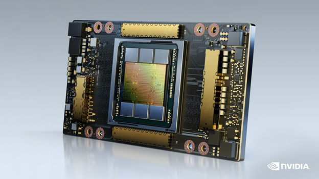
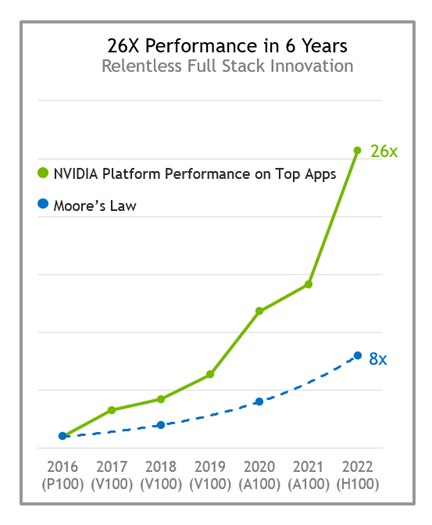
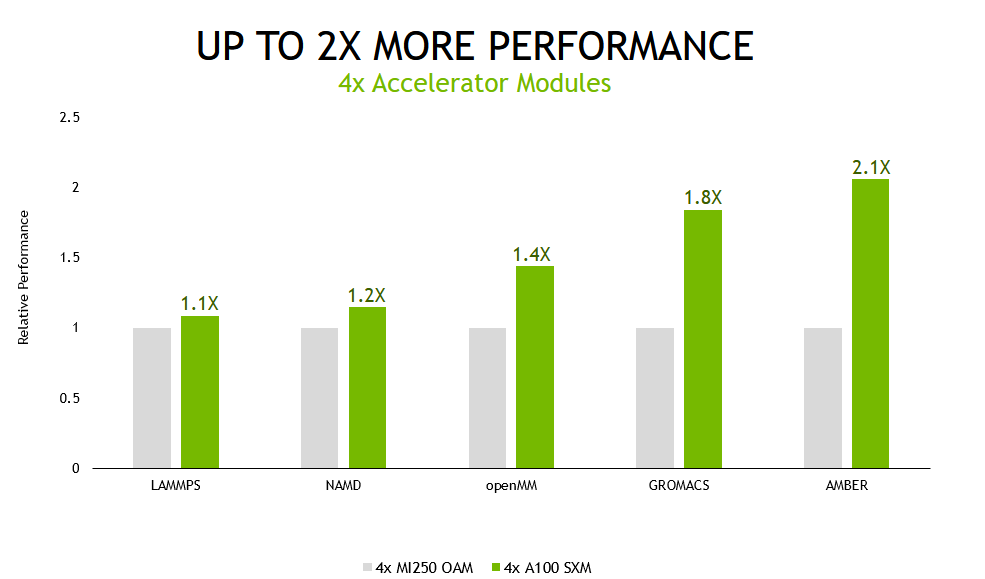
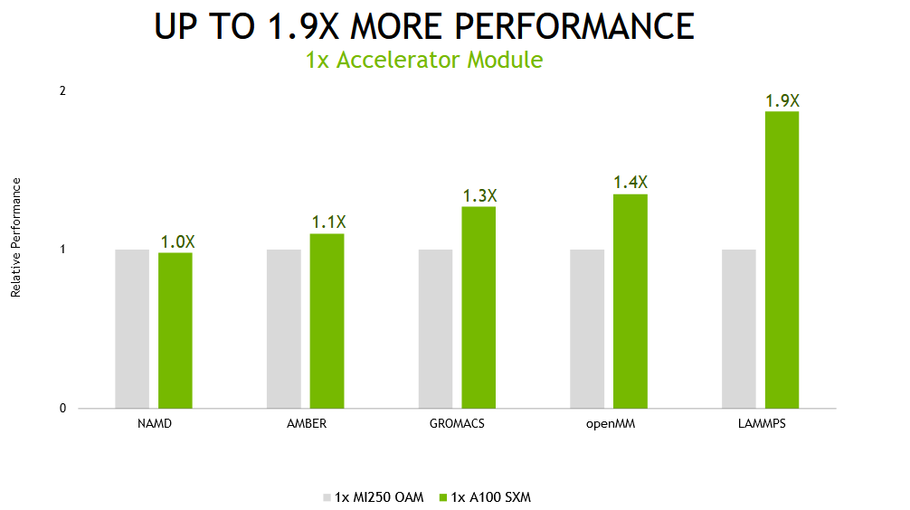
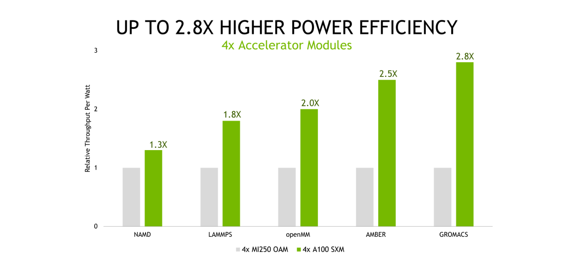

# 通过全站创新推动高性能计算

高性能计算 (HPC) 已成为科学发现的重要工具。

无论是发现新的救命药物、应对气候变化，还是对我们的世界进行精确模拟，这些解决方案都需要巨大且快速增长的处理能力。 它们越来越超出传统计算方法的范围。

这就是为什么业界接受 NVIDIA GPU 加速计算的原因。 与人工智能相结合，它为科学进步带来了数百万倍的性能飞跃。 如今，有 2,700 个应用程序可以从 NVIDIA GPU 加速中受益，而且这个数字还在不断增加，得到了不断壮大的 300 万开发者社区的支持。

## HPC 应用程序性能改进
在整个 HPC 应用程序范围内实现多倍加速需要在系统堆栈的每个级别进行不懈的创新。 这从芯片和系统开始，一直到应用程序框架本身。

NVIDIA 平台每年都在持续提供显着的性能改进，在架构和整个 NVIDIA 软件堆栈方面都取得了不懈的进步。 与仅仅六年前发布的 P100 相比，H100 Tensor Core GPU 的性能预计将提高 26 倍，比摩尔定律快 3 倍以上。

NVIDIA 平台的核心是功能丰富的高性能软件堆栈。 为了促进最广泛的 HPC 应用程序的 GPU 加速，该平台包括 NVIDIA HPC SDK。 SDK 为开发人员提供了无与伦比的灵活性，支持使用标准语言、指令和 CUDA 创建和移植 GPU 加速应用程序。

NVIDIA HPC SDK 的强大之处在于一套高度优化的 GPU 加速数学库，使您能够充分利用 NVIDIA GPU 的性能潜力。 为了获得最佳的多 GPU 和多节点性能，NVIDIA HPC SDK 还提供了强大的通信库：

* NVSHMEM 为跨越多个 GPU 内存的数据创建全局地址空间。
* NVIDIA 集合通信库 (NCCL) 优化 GPU 间通信。

总而言之，该平台提供了最高的性能和灵活性，以支持庞大且不断增长的 GPU 加速 HPC 应用程序。

## HPC 性能和能源效率
为了展示 NVIDIA 全栈创新如何转化为加速 HPC 的最高性能，我们将 HPE 服务器的性能与四个 NVIDIA GPU 的性能与基于相同数量的其他供应商加速器模块的类似配置服务器的性能进行了比较。

我们使用各种数据集测试了一组五个广泛使用的 HPC 应用程序。虽然 NVIDIA 平台可以加速每个行业的 2,700 个应用程序，但我们可以在此比较中使用的应用程序受到其他供应商加速器可用的软件和应用程序版本选择的限制。

对于除分子动力学模拟软件 NAMD 之外的所有工作负载，我们的结果是使用跨多个数据集的结果的几何平均值计算的，以最大限度地减少异常值的影响并代表客户体验。

我们还在多 GPU 和单 GPU 场景中测试了这些应用程序。

在多 GPU 场景中，测试系统中的所有加速器都用于运行单个模拟，基于 A100 Tensor Core GPU 的服务器提供的性能比替代产品高出 2.1 倍。

在计算性能不断进步的推动下，分子动力学领域正朝着在更长的模拟时间段内模拟更大的原子系统的方向发展。这些进步使研究人员能够模拟越来越多的生化机制，例如光合电子传输和视觉信号转导。这些和其他过程长期以来一直是科学争论的主题，因为它们已经超出了模拟的范围，而模拟是验证的主要工具。这是由于完成模拟所需的时间过长。

但是，我们认识到并非所有这些应用程序的用户在每次模拟时都使用多个 GPU 运行它们。为了获得最佳吞吐量，最佳执行方法通常是为每次模拟分配一个 GPU。

在单个加速器模块（NVIDIA A100 上的完整 GPU 和替代产品上的两个计算芯片）上运行这些相同的应用程序时，基于 NVIDIA A100 的系统可提供高达 1.9 倍的性能提升。

能源成本占数据中心和超级计算中心等总拥有成本 (TCO) 的很大一部分，凸显了高能效计算平台的重要性。 我们的测试表明，NVIDIA 平台的每瓦吞吐量比替代产品高出 2.8 倍。

显示 A100 与 MI250 的效率比 - NVIDIA 越高越好。每个应用程序的多个数据集（不同）的 Geomean。效率是使用 NVIDIA SMI 和 ROCm 中的等效功能测量的 GPU 的性能/功耗（瓦）|

AMD MI250 在配备 (2) 个 AMD EPYC 7763 和 4 个采用 AMD Infinity Fabric™ 技术的 AMD Instinct™ MI250 OAM (128 GB HBM2e) 500W GPU 的 MI250 系统上测量。 NVIDIA 在 HGX A100 4-GPU 服务器上运行，使用双 EPYC 7713 CPU 和 4x A100 (80 GB) SXM4

LAMMPS develop_db00b49(AMD) develop_2a35ec2(NVIDIA) 数据集 ReaxFF/c、Tersoff、Leonard-Jones、SNAP | NAMD 3.0alpha9 数据集 STMV_NVE | OpenMM 7.7.0 Ensemble 运行数据集：amber20-stmv、amber20-纤维素、apoa1pme、pme|

GROMACS 2021.1(AMD) 2022(NVIDIA) 数据集 ADH-Dodec (h-bond)、STMV (h-bond) | AMBER 20.xx_rocm_mr_202108(AMD) 和 20.12-AT_21.12 (NVIDIA) 数据集 Cellulose_NVE、STMV_NVE | 1x MI250 有 2x GCD

NVIDIA A100 GPU 卓越的性能和能效是多年来为最大限度提高应用程序性能和效率而不懈地进行软硬件协同优化的结果。有关 NVIDIA Ampere 架构的更多信息，请参阅 NVIDIA A100 Tensor Core GPU 白皮书。

A100 还以单处理器的形式呈现给操作系统，只需启动一个 MPI 等级即可充分利用其性能。而且，由于节点中所有 GPU 之间的 600-GB/s NVLink 连接，A100 可大规模提供出色的性能。

## 人工智能与高性能计算融合
正如加速计算为建模和仿真应用带来了成倍的加速一样，AI 和 HPC 的结合将带来性能的下一个阶梯函数提升，以开启下一波科学发现浪潮。

在我们首次提交 MLPerf 训练和最近的结果之间的三年中，NVIDIA 平台在这个行业标准、同行评审的基准套件上提供了 20 倍的深度学习训练性能。 收益来自芯片、软件和大规模改进的结合。

.png)

科学家和研究人员已经在利用人工智能的力量来显着提高性能，推动科学发现：

* 使识别引力波所需的时间减少 105 倍。
* 为模拟 Delta SARS-CoV-2 病毒在具有超过 10 亿个原子的呼吸道飞沫中提供 1,000 倍的加速。
* 加快发展清洁聚变能源。
* 为热回收蒸汽发生器 (HRSG) 工厂创建预测数字孪生。

世界各地的超级计算中心都在继续采用加速的人工智能超级计算机。

* Argonne Leadership Computing Facility (ALCF) 的 Polaris 超级计算机、NERSC 的 Perlmutter 和 CINECA 的 Leonardo 均由 A100 Tensor Core GPU 提供支持。
* 即将推出的基于我们即将推出的 Grace Hopper 超级芯片的阿尔卑斯山超级计算机将于 2023 年上线。
* 洛斯阿拉莫斯国家实验室即将于 2023 年交付的 Venado 系统将包括 Grace Hopper 超级芯片和 Grace CPU 超级芯片节点。

