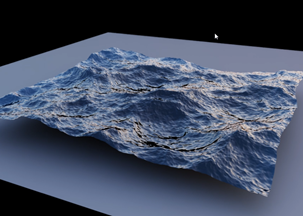
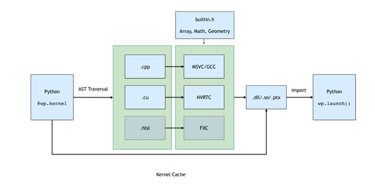
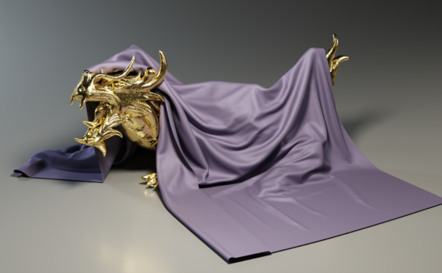
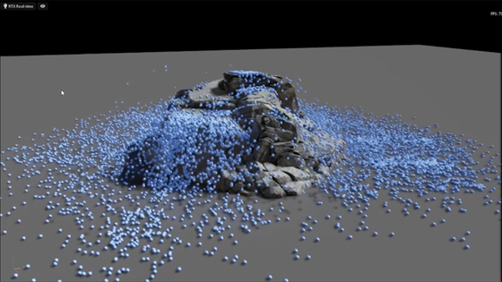
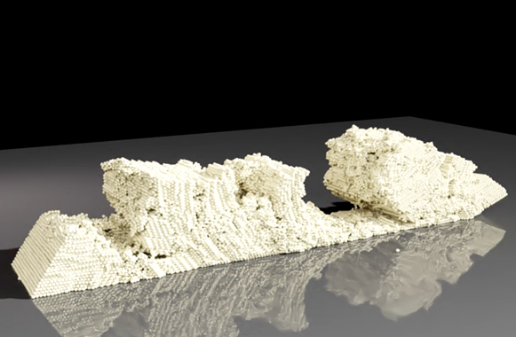
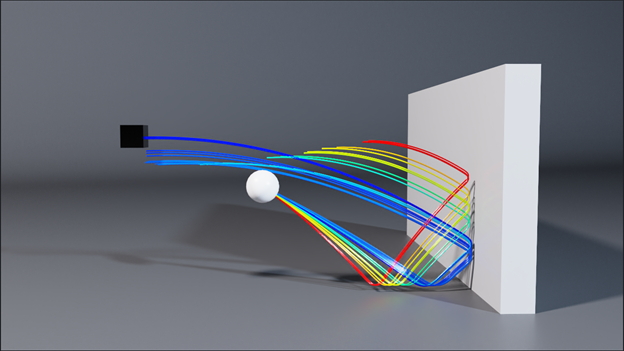

# 使用 NVIDIA Warp 在 Python 中创建可微分图形和物理模拟


通常，为获得最佳性能, 实时物理模拟代码是用底层的 CUDA C++ 编写的。 在这篇文章中，我们介绍了 NVIDIA Warp，这是一个新的 Python 框架，可以轻松地在 Python 中编写可微分图形和模拟 GPU 代码。 Warp 提供了编写高性能模拟代码所需的构建块，但具有使用 Python 等解释语言工作的生产力。

在这篇文章的最后，您将学习如何使用 Warp 在 Python 环境中编写 CUDA 内核，并利用一些内置的高级功能可以轻松编写复杂的物理模拟，例如海洋模拟 （下图）。



## 安装
[Warp 是 GitHub 上的一个开源库](https://github.com/NVIDIA/warp)。
下载地址: 

https://github.com/NVIDIA/warp

要下载发布包并安装到本地 Python 环境中，请按照 README 说明并使用以下命令：
```C++
pip install .
```
## 初始化
导入后，必须显式初始化 Warp：

```Python
import warp as wp
wp.init()
```

## 启动内核
Warp 使用 Python 装饰器的概念来标记可以在 GPU 上执行的函数。 例如，您可以编写一个简单的半隐式粒子积分方案，如下所示：
```Python
@wp.kernel
def integrate(x: wp.array(dtype=wp.vec3),
              v: wp.array(dtype=wp.vec3),
              f: wp.array(dtype=wp.vec3),
              w: wp.array(dtype=float),
              gravity: wp.vec3,
              dt: float):  

   # thread id
   tid = wp.tid()  

   x0 = x[tid]
   v0 = v[tid]  

   # Semi-implicit Euler step
   f_ext = f[tid]  inv_mass = w[tid]  

   v1 = v0 + (f_ext * inv_mass + gravity) * dt
   x1 = x0 + v1 * dt

   # store results
   x[tid] = x1
   v[tid] = v1 
```

因为 Warp 是强类型的，所以你应该为内核参数提供类型提示。 要启动内核，请使用以下语法：
```Python
    wp.launch(kernel=simple_kernel, # kernel to launch
              dim=1024,             # number of threads
              inputs=[a, b, c],     # parameters
              device="cuda")        # execution device
```

与 NumPy 等基于张量的框架不同，Warp 使用基于内核的编程模型。 基于内核的编程更接近底层 GPU 执行模型。 它通常是一种更自然的方式来表达需要细粒度条件逻辑和内存操作的模拟代码。 然而，Warp 以一种易于使用的方式公开了这种以线程为中心的编程模型，不需要 GPU 架构的底层知识。

## 编译模型
启动内核会触发即时 (JIT) 编译流程，该流程会自动从 Python 函数定义生成 C++/CUDA 内核代码。

属于 Python 模块的所有内核都在运行时编译成动态库和 PTX。下图 显示了编译流程，其中涉及遍历函数 AST 并将其转换为直线 CUDA 代码，然后编译并加载回 Python 进程。




此 JIT 编译的结果被缓存。 如果输入内核源代码未更改，则预编译的二进制文件将以低开销方式加载。

## 内存模型
Warp 中的内存分配通过 warp.array 类型公开。 数组封装了可能存在于主机 (CPU) 或设备 (GPU) 内存中的底层内存分配。 与张量框架不同，Warp 中的数组是强类型的，并存储内置结构（vec3、matrix33、quat 等）的线性序列。

您可以使用与 NumPy 和 PyTorch 类似的语法从 Python 列表或 NumPy 数组构造或初始化数组：

```Python
# allocate an uninitizalized array of vec3s
    v = wp.empty(length=n, dtype=wp.vec3, device="cuda")

    # allocate a zero-initialized array of quaternions    
    q = wp.zeros(length=n, dtype=wp.quat, device="cuda")

    # allocate and initialize an array from a numpy array
    # will be automatically transferred to the specified device
    v = wp.from_numpy(array, dtype=wp.vec3, device="cuda")
```

Warp 支持 `__array_interface__ `和 `__cuda_array_interface__` 协议，它们允许基于张量的框架之间的零拷贝数据视图。 例如，要将数据转换为 NumPy，请使用以下命令：

```Python
# automatically bring data from device back to host
    view = device_array.numpy()

```

## 特性
Warp 包括几个更高级的数据结构，可以更轻松地实现模拟和几何处理算法。

### 网格
三角形网格在模拟和计算机图形学中无处不在。 Warp 提供了一种用于管理网格数据的内置类型，该类型为几何查询提供支持，例如最近点、光线投射和重叠检查。

以下示例显示如何使用 Warp 计算网格上与输入位置数组最近的点。 这种类型的计算是碰撞检测中许多算法的构建块（下图）。 Warp 的网格查询使实现此类方法变得简单。




```Python
@wp.kernel
def project(positions: wp.array(dtype=wp.vec3),
            mesh: wp.uint64,
            output_pos: wp.array(dtype=wp.vec3),
            output_face: wp.array(dtype=int)):
    
    
    tid = wp.tid()

    x = wp.load(positions, tid)

    face_index = int(0)
    face_u = float(0.0)
    face_v = float(0.0)
    sign = float(0.0)

    max_dist = 2.0
    
    if (wp.mesh_query_point(mesh, x, max_dist, sign, face_index, face_u, face_v)):
        
        p = wp.mesh_eval_position(mesh, face_index, face_u, face_v)

        output_pos[tid] = p
        output_face[tid] = face_index
```

## 稀疏体
稀疏体对于表示大型域上的网格数据非常有用，例如复杂对象的符号距离场 (SDF) 或大规模流体流动的速度。 Warp 包括对使用 NanoVDB 标准定义的稀疏体的支持。 使用标准 OpenVDB 工具（例如 Blender、Houdini 或 Maya）构建体，然后在 Warp 内核中进行采样。

您可以直接从磁盘或内存中的二进制网格文件创建，然后使用 API 对它们进行采样：
```Python
wp.volume_sample_world(vol, xyz, mode)  # world space sample using interpolation mode
wp.volume_sample_local(vol, uvw, mode)  # volume space sample using interpolation mode
wp.volume_lookup(vol, ijk)              # direct voxel lookup
wp.volume_transform(vol, xyz)           # map point from voxel space to world space
wp.volume_transform_inv(vol, xyz)       # map point from world space to volume space
```



使用查询，您可以以最小的内存开销有效地与复杂对象进行碰撞。

## 哈希网格
许多基于粒子的模拟方法，例如离散元法 (DEM) 或平滑粒子流体动力学 (SPH)，都涉及迭代空间邻居以计算力相互作用。 哈希网格是一种完善的数据结构，可以加速这些最近邻查询，并且特别适合 GPU。

哈希网格由点集构成，如下所示：

```Python
grid = wp.HashGrid(dim_x=128, dim_y=128, dim_z=128, device="cuda")
grid.build(points=p, radius=r)
```

创建哈希网格后，您可以直接从用户内核代码中查询它们，如下例所示，该示例计算所有相邻粒子位置的总和：

```Python
@wp.kernel
def sum(grid : wp.uint64,
        points: wp.array(dtype=wp.vec3),
        output: wp.array(dtype=wp.vec3),
        radius: float):

    tid = wp.tid()

    # query point
    p = points[tid]

    # create grid query around point
    query = wp.hash_grid_query(grid, p, radius)
    index = int(0)

    sum = wp.vec3()

    while(wp.hash_grid_query_next(query, index)):
           
        neighbor = points[index]
        
        # compute distance to neighbor point
        dist = wp.length(p-neighbor)
        if (dist <= radius):
            sum += neighbor

    output[tid] = sum
```

下图 显示了粘性材料的 DEM 颗粒材料模拟示例。 使用内置的哈希网格数据结构，您可以用不到 200 行 Python 代码编写这样的模拟，并以超过 100K 粒子的交互速率运行。



使用 Warp 哈希网格数据，您可以轻松评估相邻粒子之间的成对力相互作用。

## 可微性
基于张量的框架，例如 PyTorch 和 JAX，提供张量计算的梯度，非常适合 ML 训练等应用程序。

Warp 的一个独特功能是能够生成内核代码的前向和后向版本。 这使得编写可微分模拟变得容易，这些模拟可以传播梯度作为更大训练管道的一部分。 一个常见的场景是对网络层使用传统的 ML 框架，并使用 Warp 来实现模拟层，从而实现端到端的可微性。

当需要渐变时，您应该使用 requires_grad=True 创建数组。 例如，warp.Tape 类可以记录内核启动并重放它们以计算标量损失函数相对于内核输入的梯度：

```Python
tape = wp.Tape()

# forward pass
with tape:
   wp.launch(kernel=compute1, inputs=[a, b], device="cuda")
   wp.launch(kernel=compute2, inputs=[c, d], device="cuda")
   wp.launch(kernel=loss, inputs=[d, l], device="cuda")

# reverse pass
tape.backward(loss=l)
```

反向传播完成后，可以通过 Tape 对象中的映射获得关于输入的梯度：
```C++
# gradient of loss with respect to input a
print(tape.gradients[a])
```




