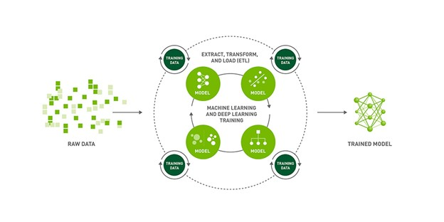
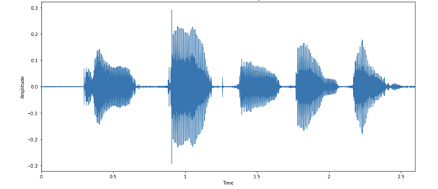
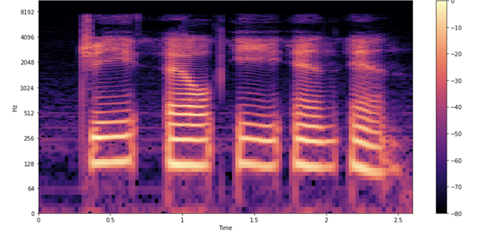
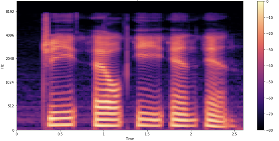
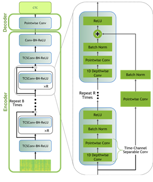
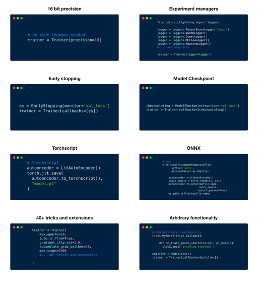
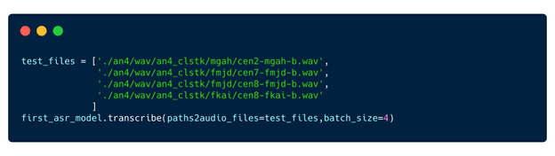
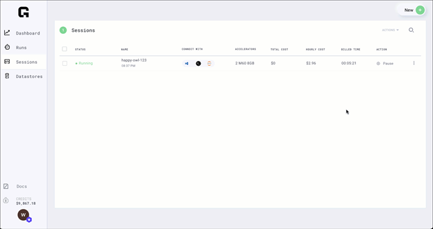

# 在Python中使用PyTorch Lightning简化模型开发和构建模型


人工智能正在推动第四次工业革命，机器可以听、看、理解、分析，然后在超人的水平上做出明智的决定。 然而，人工智能的有效性取决于底层模型的质量。 因此，无论您是学术研究人员还是数据科学家，您都希望快速构建具有各种参数的模型，并为您的解决方案确定最有效的模型。

在这篇文章中，我将介绍使用 PyTorch Lightning 构建语音模型。

## PyTorch Lightning + Grid.ai：更快、更大规模地构建模型
PyTorch Lightning 是用于高性能 AI 研究的轻量级 PyTorch 包装器。 使用 Lightning 组织 PyTorch 代码可以在多个 GPU、TPU、CPU 上进行无缝训练，并使用难以实现的最佳实践，例如检查点、日志记录、分片和混合精度。 [NGC 目录](https://ngc.nvidia.com/catalog/containers/partners:gridai:pytorch-lightning)中提供了 [PyTorch Lightning 容器](https://ngc.nvidia.com/catalog/containers/partners:gridai:pytorch-lightning)和开发人员环境。

Grid 使您能够将训练从笔记本电脑扩展到云端，而无需修改代码。 Grid 在 AWS 等云提供商上运行，支持 Lightning 以及所有经典机器学习框架，如 Sci Kit、TensorFlow、Keras、PyTorch 等。 使用 Grid，您可以扩展 NGC 目录中模型的训练。

## NGC：GPU 优化 AI 软件的中心
NGC 是 GPU 优化软件的中心，包括 AI/ML 容器、预训练模型和 SDK，可以在本地、云、边缘和混合环境中轻松部署。 NGC 提供 NVIDIA TAO 工具包，支持使用自定义数据和 NVIDIA Triton 推理服务器重新训练模型，以在 CPU 和 GPU 驱动的系统上运行预测。

本文的其余部分将引导您了解如何利用 NGC 目录中的模型和 NVIDIA NeMo 框架，使用以下基于 ASR with NeMo 的[教程](https://github.com/aribornstein/NGC-Lightning-Grid-Workshop)，使用 PyTorch Lightning 训练自动语音识别 (ASR) 模型。




## 使用 Grid 、PyTorch Lightning 和 NVIDIA NeMo 训练 NGC 模型
ASR 是将口语转录为文本的任务，是语音到文本系统的关键组成部分。 在训练 ASR 模型时，您的目标是从给定的音频输入生成文本，以最大限度地减少人工转录语音的单词错误率 (WER) 指标。 NGC 目录包含最先进的 ASR 预训练模型。

在本文的其余部分，我们将向您展示如何使用 Grid 、NVIDIA NeMo 和 PyTorch Lightning 在 [AN4 数据集](https://docs.nvidia.com/deeplearning/nemo/user-guide/docs/en/stable/asr/datasets.html)上微调这些模型。

AN4 数据集，也称为字母数字数据集，由卡内基梅隆大学收集并发布。 它包括人们拼写地址、姓名、电话号码等的录音，一次一个字母或一个数字，以及他们相应的成绩单。


## 第 1 步：创建针对 Lightning 和预训练 NGC 模型优化的 Grid模块
Grid模块在您需要扩展的相同硬件上运行，同时为您提供预配置的环境，以比以前更快地迭代机器学习过程的研究阶段。 模块链接到 GitHub，加载了 JupyterHub，并且可以通过 SSH 和您选择的 IDE 访问，而无需自己进行任何设置。

使用模块，您只需为获得基线运行所需的计算付费，然后您可以使用网格运行将您的工作扩展到云。 Grid模块针对 NGC 目录上托管的 PyTorch Lightning 和模型进行了优化。 他们甚至提供专门的定制版。


## 第 2 步：克隆 ASR 演示例子并打开教程notebook

现在您已经有了针对 PyTorch Lightning 优化的开发人员环境，下一步是克隆 NGC-Lightning-Grid-Workshop 项目。

您可以使用以下命令直接从网格会话中的终端执行此操作：

```Bash
git clone https://github.com/aribornstein/NGC-Lightning-Grid-Workshop.git
```
克隆 repo 后，您可以打开notebook以使用 NeMo 和 PyTorch Lightning 微调 NGC 托管模型。

## 第 3 步：安装 NeMo ASR 依赖项
首先，安装所有依赖项。 运行 PyTorch Lightning 和 NeMo 等工具并处理 AN4 数据集以执行此操作。 运行教程notebook中的第一个单元格，它运行以下 bash 命令来安装依赖项。

```bash
## Install dependencies
!pip install wget
!sudo apt-get install sox libsndfile1 ffmpeg -y
!pip install unidecode
!pip install matplotlib>=3.3.2
## Install NeMo
BRANCH = 'main'
!python -m pip install --user git+https://github.com/NVIDIA/NeMo.git@$BRANCH#egg=nemo_toolkit[all]
## Grab the config we'll use in this example
!mkdir configs
!wget -P configs/ https://raw.githubusercontent.com/NVIDIA/NeMo/$BRANCH/examples/asr/conf/config.yaml
```

## 第 4 步：转换和可视化 AN4 数据集
AN4 数据集来自原始 Sof 音频文件，但大多数模型在 mel 频谱图上处理。 将 Sof 文件转换为 Wav 格式，以便您可以使用 NeMo 音频处理。

```Python
import librosa
import IPython.display as ipd
import glob
import os
import subprocess
import tarfile
import wget

# Download the dataset. This will take a few moments...
print("******")
if not os.path.exists(data_dir + '/an4_sphere.tar.gz'):
    an4_url = 'http://www.speech.cs.cmu.edu/databases/an4/an4_sphere.tar.gz'
    an4_path = wget.download(an4_url, data_dir)
    print(f"Dataset downloaded at: {an4_path}")
else:
    print("Tarfile already exists.")
    an4_path = data_dir + '/an4_sphere.tar.gz'

if not os.path.exists(data_dir + '/an4/'):
    # Untar and convert .sph to .wav (using sox)
    tar = tarfile.open(an4_path)
    tar.extractall(path=data_dir)

    print("Converting .sph to .wav...")
    sph_list = glob.glob(data_dir + '/an4/**/*.sph', recursive=True)
    for sph_path in sph_list:
        wav_path = sph_path[:-4] + '.wav'
        cmd = ["sox", sph_path, wav_path]
        subprocess.run(cmd)
print("Finished conversion.\n******")
# Load and listen to the audio file
example_file = data_dir + '/an4/wav/an4_clstk/mgah/cen2-mgah-b.wav'
audio, sample_rate = librosa.load(example_file)
ipd.Audio(example_file, rate=sample_rate)
```
然后，您可以将音频示例可视化为音频波形的图像。 下图显示了与音频中每个字母相对应的波形中的活动，因为您的扬声器在这里发音非常清楚！




每个口语字母都有不同的“形状”。 有趣的是，最后两个 blob 看起来比较相似，这是意料之中的，因为它们都是字母 N。

**频谱图**

在声音频率随时间变化的情况下，对音频进行建模更容易。 您可以获得比 57,330 个值的原始序列更好的表示。 频谱图是一种可视化音频中各种频率的强度如何随时间变化的好方法。 它是通过将信号分解成更小的、通常重叠的块，并对每个块执行短时傅里叶变换 (STFT) 来获得的。

下图显示了样品的频谱图。



与前面的波形一样，您会看到每个字母都在发音。 你如何解释这些形状和颜色？ 就像在前面的波形图中一样，您会在 x 轴上看到时间流逝（所有 2.6 秒的音频）。 但是，现在 y 轴代表不同的频率（在对数刻度上），图上的颜色显示特定时间点的频率强度。

**梅尔谱图**

您还没有完成，因为您可以通过使用梅尔谱图可视化数据来进行一项更可能有用的调整。 将频率标度从线性（或对数）更改为 `mel `标度，这样可以更好地表示人耳可感知的音高。 Mel 频谱图对 ASR 非常有用。 因为您正在处理和转录人类语音，所以梅尔频谱图可以减少可能影响模型的背景噪声。



## 第 5 步：从 NGC 加载和推理预训练的 QuartzNet 模型

现在您已经加载并正确理解了 AN4 数据集，看看如何使用 NGC 加载 ASR 模型以使用 PyTorch Lightning 进行微调。 NeMo 的 ASR 集合包含许多构建块，甚至是完整的模型，您可以使用它们进行训练和评估。 此外，一些模型带有预训练的权重。

为了对这篇文章的数据进行建模，您使用来自 NGC 模型中心的称为 `QuartzNet` 的 `Jasper` 架构。 Jasper 架构由重复的块结构组成，这些结构使用一维卷积对频谱图数据进行建模（下图）。



QuartzNet 是 Jasper 的一个更好的变体，主要区别在于它使用时间通道可分离的一维卷积。 这使它能够在保持相似精度的同时显着减少权重的数量。

以下命令从 NGC 目录下载预训练的 QuartzNet15x5 模型并为您实例化它。
```Python
tgmuartznet = nemo_asr.models.EncDecCTCModel.from_pretrained(model_name="QuartzNet15x5Base-En")
```


## 第 6 步：使用 Lightning 微调模型
有了模型后，您可以使用 PyTorch Lightning 对其进行微调，如下所示。

```Python
import pytorch_lightning as pl
from omegaconf import DictConfig
trainer = pl.Trainer(gpus=1, max_epochs=10)
params['model']['train_ds']['manifest_filepath'] = train_manifest
params['model']['validation_ds']['manifest_filepath'] = test_manifest
first_asr_model = nemo_asr.models.EncDecCTCModel(cfg=DictConfig(params['model']), trainer=trainer)

# Start training!!!
trainer.fit(first_asr_model)
```
因为您使用的是这款 Lightning Trainer，所以您可以获得一些关键优势，例如默认的模型检查点和日志记录。 您还可以使用 50 多种最佳实践策略而无需修改模型代码，包括多 GPU 训练、模型分片、深度速度、量化感知训练、提前停止、混合精度、梯度裁剪和分析。




## 第 7 步：推理和部署
现在您已经有了一个基本模型，可以利用它进行推理。




## 第 8 步：暂停模块
现在您已经训练了模型，您可以暂停模块并保留所有需要的文件。



暂停的模块是释放的，可以根据需要恢复。

## 总结
现在，您应该对 PyTorch Lightning、NGC 和 Grid 有了更好的了解。 您已经对您的第一个 NGC NeMo 模型进行了微调，并使用网格运行对其进行了优化。 


