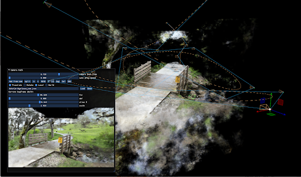

#! https://zhuanlan.zhihu.com/p/531659342
# 利用AI将2D照片合成3D场景

新的 NVIDIA NGP Instant NeRF 很好地介绍了神经辐射场的入门。 在短短一个小时内，您就可以编译代码库、准备图像并训练您的第一个 NeRF。 与其他 NeRF 实现不同，Instant NeRF 只需要几分钟就可以训练出漂亮的视觉效果。

**您可以轻松地利用它将几张2D照片合成3D场景**

我将向您介绍制作您的第一个 NeRF 的细节。 我介绍了几个关键技巧来帮助您编译代码库并解释如何捕获良好的输入图像。 我将浏览 GUI 界面并解释如何优化您的场景参数。 最后，我将展示您必须从场景中创建动画。

## 编译代码库
对于经验丰富的程序员和数据科学家来说，代码库易于编译。 初学者可以轻松地按照 GitHub中 bycloudai 的 fork 中提供的详细说明进行操作。 以下是一些有助于安装过程的其他提示：

* 源码下载地址: https://github.com/NVlabs/instant-ngp
* 安装 [Visual Studio 2019](https://visualstudio.microsoft.com/)。
* 使用最新版本安装 [CUDA Toolkit](https://developer.nvidia.com/cuda-toolkit)。
* 安装 [Python 3.9](https://www.python.org/downloads/release/python-390/)。 如果您是 Python 新手，这不是最新版本。
* 使用 [CMake 3.22](https://cmake.org/cmake/help/latest/release/3.22.html) 并确保使用 Python 3.9 编译代码库。

## 为 Instant NeRF 捕获图像
该流程接受用于`Instant NeRF` 生成的照片和视频输入。 Instant NeRF 生成流程的第一步使用 [COLMAP](https://colmap.github.io/) 来确定相机位置。 由于这个事实，您必须遵循摄影测量的基本原则来处理重叠和清晰的图像。 

## 启动 GUI 并训练你的第一个 NeRF
为您的第一个 Instant NeRF 准备好图像位置后，使用从代码库编译的包含的 Testbed.exe 文件通过 Anaconda 启动图形用户界面。 NeRF 会自动开始训练您的 NeRF。

您会发现在前 30 秒内获得了大部分视觉质量； 但是，您的 NeRF 将在几分钟内继续改善。 GUI 中的损失图最终会变平，您可以停止训练以提高查看器的帧速率。

GUI 包括许多可视化选项，包括对摄像头的控制和调试可视化。 我在动手演示视频中介绍了 GUI 中的几个不同选项。

提示：将常用的命令行提示保存在记事本中以供将来参考。

## 创建动画
NVIDIA 提供了一个易于使用的带有 GUI 的相机路径编辑器。 要添加关键帧，请浏览场景并选择 Add from Cam。 GUI 生成带有贝塞尔曲线的相机轨迹。 

要预览您的动画，请选择“阅读”。 如果您对动画感到满意，请保存您的相机路径并使用脚本文件夹中的渲染脚本渲染完整质量的视频。

总结
我发现 Instant NeRF 的一大好处是我可以捕捉整个背景作为场景的一部分。 这个事实让我兴奋，因为它开启了一个全新的世界，有潜力以新的方式捕捉和可视化世界。

我发现试用 NVIDIA Instant NeRF 是对新兴技术的一个很好的介绍。 我能够产生结果的速度意味着我可以快速了解什么适用于图像捕捉。 我希望当您开始探索 NeRF 的力量和乐趣的旅程时，本教程对您有所帮助。

