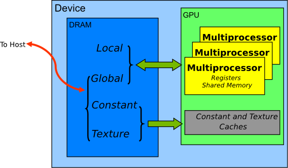

#! https://zhuanlan.zhihu.com/p/552049443
# CUDA 存储单元的适用条件

CUDA 设备使用多个内存空间，这些空间具有不同的特征，反映了它们在 CUDA 应用程序中的不同用途。 这些内存空间包括global, local, shared, constant, texture, 和 registers，下图所示。

就速度而言，如果所有不同类型的设备内存都在比赛中，比赛结果如下：

1. Register file
2. Shared Memory
3. Constant Memory
4. Texture Memory
5. Local Memory and Global Memory

查看上面的列表，似乎我们只想使用寄存器文件、共享内存和常量内存来获得最佳性能。 

那我们是不是只要用那些速度快的就好?

其实, 速度只是衡量CUDA 存储空间的一个指标. 上面列出来的存储单元各有各的优缺点.

特性
实际驻留在 GPU 芯片上的仅有两种类型的内存是寄存器和共享内存。本地、全局、常量和纹理内存都驻留在芯片外。 Local、Constant 和 Texture 都被缓存。

虽然看起来最快的内存是最好的，但决定如何使用该类型内存的另外两个内存特性是: `内存的范围`和`生命周期`：

* 存储在寄存器内存中的数据仅对写入它的线程可见，并且仅在该线程的生命周期内持续存在。
* 本地内存具有与寄存器内存相同的范围规则，但执行速度较慢。
* 存储在共享内存中的数据对该块内的所有线程都是可见的，并且在该块的持续时间内持续存在。这是无价的，因为这种类型的内存允许线程在彼此之间进行通信和共享数据。
* 存储在全局内存中的数据对应用程序内的所有线程（包括主机）都是可见的，并且在主机分配期间持续存在。
* 常量和纹理内存，它们仅对非常特定类型的应用程序有益。常量内存用于在内核执行过程中不会改变的数据，并且是只读的。使用常量而不是全局内存可以减少所需的内存带宽，但是这种性能提升只有在线程束读取相同位置时才能实现。与常量内存类似，纹理内存是设备上的另一种只读内存.当 warp 中的所有读取在物理空间上相邻时，与全局内存相比，使用纹理内存可以减少内存流量并提高性能。

**Register**

通常，访问寄存器每条指令消耗零个额外的时钟周期，但由于寄存器读后写依赖性和寄存器bank冲突，可能会出现延迟。

编译器和硬件线程调度器将尽可能优化地调度指令以避免寄存器bank冲突。 应用程序无法直接控制这些bank冲突。 特别是，没有寄存器相关的理由将数据打包成向量数据类型，例如 float4 或 int4 类型。

**Shared Memory**

如[可变内存空间说明](https://docs.nvidia.com/cuda/cuda-c-programming-guide/index.html#variable-memory-space-specifiers)中所述，共享内存是使用 __shared__ 内存空间说明符分配的。

正如[线程层次结构](https://docs.nvidia.com/cuda/cuda-c-programming-guide/index.html#thread-hierarchy)中提到的和[共享内存](https://docs.nvidia.com/cuda/cuda-c-programming-guide/index.html#shared-memory)中详述的那样，共享内存预计比全局内存快得多。 它可以用作暂存器内存（或软件管理的缓存），以最大限度地减少来自 CUDA 块的全局内存访问.

**Local Memory**

本地内存之所以如此命名，**是因为它的范围是线程本地的，而不是因为它的物理位置**。事实上，本地存储器是**片外**的。因此，访问本地内存与访问全局内存一样昂贵。换句话说，名称中的“本地”一词并不意味着访问速度更快。

本地内存仅用于保存自动变量。当 nvcc 编译器确定没有足够的寄存器空间来保存变量时，这是由 nvcc 编译器完成的。可能放置在本地内存中的自动变量是会消耗过多寄存器空间的大型结构或数组，并且编译器确定的数组可能会被动态索引。

检查 PTX 汇编代码（通过使用 `-ptx` 或 `-keep` 命令行选项编译到 nvcc 获得）可以发现在第一个编译阶段是否已将变量放置在本地内存中。如果有，它将使用 `.local` 助记符声明并使用 `ld.local` 和 `st.local` 助记符访问。如果没有，后续编译阶段可能仍会做出其他决定，如果他们发现变量为目标架构消耗了过多的寄存器空间。无法检查特定变量，但编译器会在使用 `--ptxas-options=-v` 选项运行时报告每个内核 (lmem) 的总本地内存使用量。

**Texture Memory**

只读纹理内存空间被缓存。 因此，纹理提取只在缓存未命中时花费一个只读设备内存； 否则，它只需要从纹理缓存中读取一次。 纹理缓存针对 2D 空间局部性进行了优化，**因此读取靠近在一起的纹理地址的同一 warp 的线程将获得最佳性能**。 纹理内存还设计用于具有恒定延迟的流式提取； 也就是说，缓存命中会降低 DRAM 带宽需求，但不会降低获取延迟。

在某些寻址情况下，通过纹理提取读取设备内存可能是从全局或常量内存读取设备内存的有利替代方案。

**Constant Memory**

一个设备上总共有 64 KB 的常量内存。 常量内存空间被缓存。 因此，从常量内存中读取一次内存只在缓存未命中时从设备内存中读取一次； 否则，它只需要从常量缓存中读取一次。 warp 中的线程对不同地址的访问是序列化的，因此成本与 warp 中所有线程读取的唯一地址的数量成线性关系。 因此，当同一 warp 中的线程仅访问几个不同的位置时，常量缓存是最好的。 如果一个 warp 的所有线程都访问同一个位置，那么常量内存可以与寄存器访问一样快。
