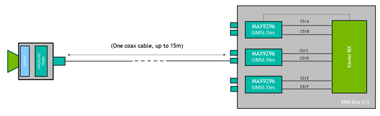

# 在Jetson上搭建多摄像头实时视频处理流程


多摄像头应用越来越流行； 它们对于启用自主机器人、智能视频分析 (IVA) 和 AR/VR 应用程序至关重要。 无论具体的用例如何，都必须始终执行一些常见任务：

* 捕获
* 预处理
* 编码
* 显示

在许多情况下，您还希望在摄像头流上部署 DNN 并在检测上运行自定义逻辑。 下图显示了应用程序的流程。


在这篇文章中，我将展示如何在 NVIDIA Jetson 平台上高效地实现这些常见任务。 具体来说，我介绍了 jetmulticam，这是一个易于使用的 Python 包，用于创建多摄像头任务。 我在带有环绕摄像头系统的机器人上演示了一个特定用例。 最后，我添加了基于 DNN 对象检测的自定义逻辑（人关注），以获得以下视频所示的结果：


## 多摄像头硬件
选择相机时需要考虑许多参数：分辨率、帧速率、光学、全局快门、接口、像素大小等。 

在这个特定的多相机设置中，您使用以下硬件：

* [NVIDIA Jetson Xavier NX](https://developer.nvidia.com/embedded/jetson-modules) 模块
* Leopard Imaging 提供的支持 GMSL2 的[载板](https://leopardimaging.com/uploads/LI-XNX-BOX-GMSL2_datasheet.pdf)
* 3 × Leopard Imaging 的 IMX185 GMSL2 [相机](https://www.leopardimaging.com/product/nvidia-jetson-cameras/aicam-tx2-box-camera/li-tx2b-imx185-gmsl2/li-tx2b-imx185-gmsl2-d/)

每个 IMX185 摄像机的视野约为 90°。 将它们相互正交安装，总 FOV 为 270°，如下图 所示。


这些相机使用 GMSL 接口，它提供了很大的灵活性，可以将相机放置在距离 Jetson 模块几米远的地方。 在这种情况下，您可以将相机抬高约 0.5m 以获得更大的垂直 FOV。



## Jetmulticam
首先，在您的 Jetson 开发板上下载并安装 [NVIDIA Jetpack SDK](https://developer.nvidia.com/embedded/jetpack)。 然后，安装 `jetmulticam `包：

```Bash
$ git clone https://github.com/NVIDIA-AI-IOT/jetson-multicamera-pipelines.git
$ cd jetson-multicamera-pipelines
$ bash scripts/install_dependencies.sh
$ pip3 install Cython
$ pip3 install .
```

## 基本的多摄像头pipeline
设置完成后，您可以使用 CameraPipeline 类创建基本pipeline。 使用初始化参数传递要包含在pipeline中的摄像机列表。 在以下示例中，元素 `[0, 1, 2]` 对应于设备节点 `/dev/video0`、`/dev/video1` 和 `/dev/video2`。

```Python
from jetmulticam import CameraPipeline
p = CameraPipeline([0, 1, 2])
```
就是这样——pipeline已经初始化并启动了。 您现在可以从pipeline中的每个摄像头读取图像并将它们作为 numpy 数组访问。

```Python
img0 = p.read(0) # img0 is a np.array
img1 = p.read(1)
img2 = p.read(2)
```

通常，在循环中从相机中读取是很方便的，如下面的代码示例所示。 pipeline从主线程异步运行，读取总是获取最新的缓冲区。

```Python
while True:
    img0 = p.read(0)
    print(img0.shape) # >> (1920, 1080, 3)
    time.sleep(1/10)
```

## 更复杂的 AI pipeline
现在您可以构建更复杂的pipeline。 这一次，使用 `CameraPipelineDNN `类来组成更复杂的pipeline，以及来自 [NGC](https://ngc.nvidia.com/catalog) 目录的两个预训练模型：[`PeopleNet`](https://ngc.nvidia.com/catalog/models/nvidia:tlt_peoplenet) 和 [`DashCamNet`](https://catalog.ngc.nvidia.com/orgs/nvidia/teams/tao/models/dashcamnet)。


```Python
import time
from jetmulticam import CameraPipelineDNN
from jetmulticam.models import PeopleNet, DashCamNet

if __name__ == "__main__":

    pipeline = CameraPipelineDNN(
        cameras=[2, 5, 8],
        models=[
            PeopleNet.DLA1,
            DashCamNet.DLA0,
            # PeopleNet.GPU
        ],
        save_video=True,
        save_video_folder="/home/nx/logs/videos",
        display=True,
    )

    while pipeline.running():
        arr = pipeline.images[0] # np.array with shape (1080, 1920, 3)
        dets = pipeline.detections[0] # Detections from the DNNs
        time.sleep(1/30)
```

这是pipeline初始化的细分：

* 相机
* 模型
* 硬件加速
* 保存视频
* 显示视频
* 主循环

### 相机
首先，与前面的示例类似，camera 参数是传感器列表。 在这种情况下，您使用与设备节点关联的摄像头：

* /dev/video2
* /dev/video5
* /dev/video8

```Python
cameras=[2, 5, 8]
```

### 模型
第二个参数 models 使您能够定义预训练模型以在pipeline中运行。
```Python
  models=[
           PeopleNet.DLA1,
           DashCamNet.DLA0,
           # PeopleNet.GPU
      ],
```

在这里，您从 [NGC](https://ngc.nvidia.com/catalog) 部署两个预训练模型：

* PeopleNet：一种能够识别人、脸和包的目标检测模型。
* DashCamNet：能够识别四类对象的模型：汽车、人、路标和自行车。


有关详细信息，请参阅 NGC 中的[模型卡](https://ngc.nvidia.com/catalog/models/nvidia:tlt_peoplenet)。

### 硬件加速
这些模型使用 NVIDIA 深度学习加速器 (DLA) 实时运行。 具体来说，您在 DLA0 (DLA Core 0) 上部署 PeopleNet，在 DLA1 上部署 DashCamNet。

在两个加速器之间分配模型有助于提高管道的总吞吐量。 此外，DLA 比 GPU 更省电。 因此，在最高时钟设置下，系统在满负载下仅消耗约 10W。 最后，在这种配置中，Jetson GPU 仍然可以利用 Jetson NX 上可用的 384 个 CUDA 内核来加速更多任务。

以下代码示例显示了当前支持的模型/加速器组合的列表。

```Python
pipeline = CameraPipelineDNN(
    # ...
    models=[
        models.PeopleNet.DLA0,
        models.PeopleNet.DLA1,
        models.PeopleNet.GPU,
        models.DashCamNet.DLA0,
        models.DashCamNet.DLA1,
        models.DashCamNet.GPU
        ]
    # ...
)
```

### 保存视频
接下来的两个参数指定是否存储编码的视频并定义用于存储的文件夹。
```Python
save_video=True,
save_video_folder="/home/nx/logs/videos",
```

### 显示视频
作为最后的初始化步骤，配置pipeline以在屏幕上显示视频输出以进行调试。

```Python
display=True
```

### 主循环
最后，定义主循环。 在运行时，图像在 pipeline.images 下，检测结果在 pipeline.detections 下。

```Python
while pipeline.running():
    arr = pipeline.images[0] # np.array with shape (1080, 1920, 3)
    dets = pipeline.detections[0] # Detections from the DNNs
    time.sleep(1/30)
```

以下代码示例显示了结果检测。 对于每次检测，您都会得到一个包含以下内容的字典：

* 对象类
* 对象位置定义为像素坐标中的 [left, width, top, height]
* 检测置信度

```Bash
>>> pipeline.detections[0]
[
    # ...
    {
        "class": "person",
        "position": [1092.72 93.68 248.01 106.38], # L-W-T-H
        "confidence": 0.91
    },
    #...
]
```

## 使用自定义逻辑扩展 AI Pipeline
作为最后一步，您可以扩展主循环以使用 DNN 输出构建自定义逻辑。 具体来说，您使用摄像头的检测输出在机器人中实现基本的人员跟踪逻辑。 源代码可在 [NVIDIA-AI-IOT/jetson-multicamera-pipelines](https://github.com/NVIDIA-AI-IOT/jetson-multicamera-pipelines) GitHub 存储库中找到。

* 要找到要跟随的人，请解析 `pipeline.detections` 输出。 这个逻辑在 [find_closest_human](https://github.com/NVIDIA-AI-IOT/jetson-multicamera-pipelines/blob/34ba883d1f2312e54f9d592c7e2b5bde451331ed/examples/example-person-following.py#L14) 函数中实现。
* 根据边界框在 dets2steer 中的位置计算机器人的转向角。
    * 如果人在左侧图像中，则最大限度地向左转。
    * 如果人在正确的图像中，则最大限度地向右转。
    * 如果人在中心图像中，则按比例转动边界框中心的 X 坐标。


生成的视频将保存到 `/home/nx/logs/videos`，正如您在初始化期间定义的那样。


## 解决方案概述
下面简要介绍 jetmulticam 的工作原理。 该包动态创建并启动一个 GStreamer 管道，其中包含您的应用程序所需的摄像头数量。 下图 显示了当按照人员跟踪示例进行配置时，底层 GStreamer 管道的外观。 如您所见，系统中的所有关键操作（以绿色框表示）都受益于硬件加速。


首先，使用图上的 `nvarguscamerasrc` 元素使用多个 CSI 摄像机捕获视频。使用 `nvvidconv` 或 `nvvideoconvert` 重新调整每个单独的缓冲区并转换为 RGBA 格式。接下来，使用 [DeepStream SDK](https://developer.nvidia.com/deepstream-sdk) 提供的组件对帧进行批处理。默认情况下，批量大小等于系统中的摄像机数量。

要部署 DNN 模型，请利用 [nvinfer](https://docs.nvidia.com/metropolis/deepstream/dev-guide/text/DS_plugin_gst-nvinfer.html) 元素。在演示中，我在两个不同的加速器 DLA 核心 1 和 DLA 核心 2 上部署了两个模型 PeopleNet 和 DashCamNet，两者都在 Jetson Xavier NX 上可用。但是，如果需要，可以将更多模型堆叠在一起。

在生成的边界框被 nvosd 元素覆盖后，您可以使用 nvoverlaysink 将它们显示在 HDMI 显示器上，并使用硬件加速的 H264 编码器对视频流进行编码。保存为 .mkv 文件。

Python 代码中可用的图像（例如 pipeline.images[0]）由注册在每个视频转换器元素上的回调函数或[prob](https://gstreamer.freedesktop.org/documentation/additional/design/probes.html?gi-language=c)解析为 numpy 数组。同样，在最后一个 nvinfer 元素的 sinkpad 上注册了另一个回调函数，它将元数据解析为用户友好的检测列表。有关源代码或单个组件配置的更多信息，请参阅 [create_pipeline](https://github.com/NVIDIA-AI-IOT/jetson-multicamera-pipelines/blob/34ba883d1f2312e54f9d592c7e2b5bde451331ed/jetmulticam/pipelines/multicamDNN.py#L49) 函数。


